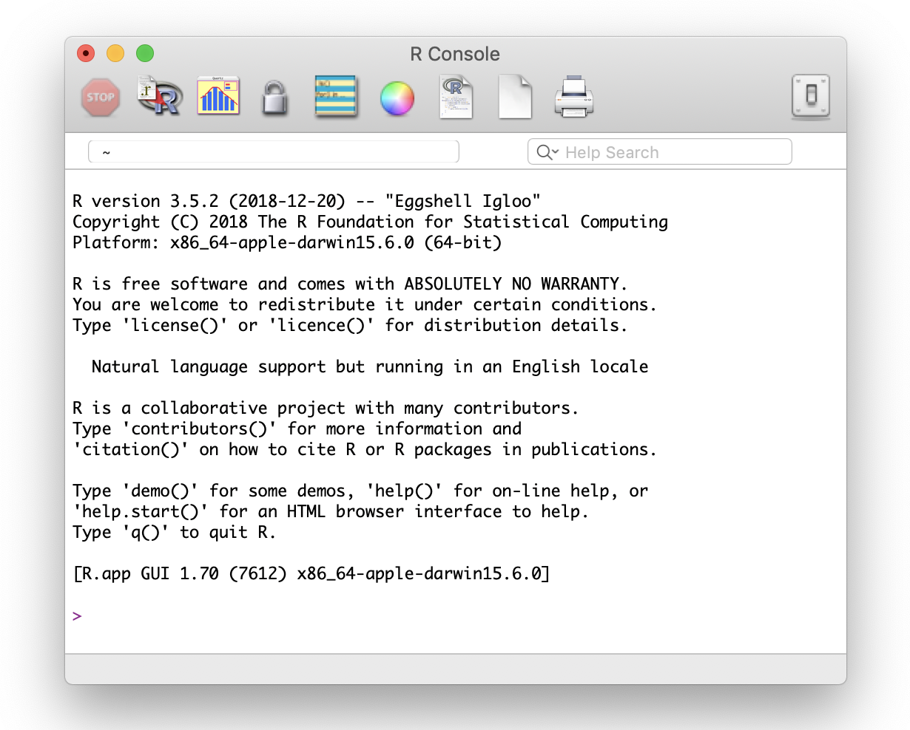

# Getting Started {#intro}


## Learning Objectives

1. Understand the components of the [RStudio IDE](#rstudio_ide)
2. Type commands into the [console](#console)
3. Understand [function syntax](#function_syx)
4. Install a [package](#install-package)
5. [Organizing a project](#project_org): directory structure and working directory
6. Appropriately [structure an R script or RMarkdown file](#script_struct)
7. Create and compile an [Rmarkdown document](#rmarkdown)


## Resources

* [Chapter 1: Introduction](http://r4ds.had.co.nz/introduction.html) in *R for Data Science*
* [RStudio IDE Cheatsheet](https://github.com/rstudio/cheatsheets/raw/master/rstudio-ide.pdf)


## What is R?


R is a programming environment for data processing and statistical analysis. We use R in Psychology at the University of Glasgow to promote **reproducible research**. This refers to being able to document and reproduce all of the steps between raw data and results. R allows you to write scripts that combine data files, clean data, and run analyses. There are many other ways to do this, including writing SPSS syntax files, but we find R to be a useful tool that is free, open source, and commonly used by research psychologists.

```{block, type="info"}
See Appendix \@ref(installing-r) for more information on on how to install R and associated programs.
```

### The Base R Console {#rconsole}

If you open up the application called R, you will see an "R Console" window that looks something like this.

```{r img-repl, echo=FALSE, fig.cap="The R Console window."}

``` 

You can close R and never open it again. We'll be working entirely in RStudio in this class.

```{block, type="warning"}
ALWAYS REMEMBER: Launch R though the RStudio IDE  

```

### RStudio {#rstudio_ide}

[RStudio](http://www.rstudio.com) is an Integrated Development Environment (IDE). This is a program that serves as a text editor, file manager, and provides many functions to help you read and write R code.

```{r img-rstudio, echo=FALSE, fig.cap="The RStudio IDE"}
knitr::include_graphics("images/01/rstudio.png")
``` 

RStudio is arranged with four window `r glossary("panes")`. By default, the upper left pane is the **source pane**, where you view and edit source code from files. The bottom left pane is usually the **console pane**, where you can type in commands and view output messages. The right panes have several different tabs that show you information about your code. You can change the location of panes and what tabs are shown under **`Preferences > Pane Layout`**.

### Configure RStudio

In this class, you will be learning how to develop **reproducible scripts**.  This means scripts that completely and transparently perform some analysis from start to finish in a way that yields the same result for different people using the same software on different computers. Transparency is a key value of science, as embodied in the "trust but verify" motto. When you do things reproducibly, others can understand and check your work. This benefits science, but there is a selfish reason, too: the most important person who will benefit from a reproducible script is your future self. When you return to an analysis after two weeks of vacation, you will thank your earlier self for doing things in a transparent, reproducible way, as you can easily pick up right where you left off.

There are two tweaks that you should do to your RStudio installation to maximize reproducibility. Go to the preferences/settings menu, and uncheck the box that says **`Restore .RData into workspace at startup`**;.  If you keep things around in your workspace, things will get messy, and unexpected things will happen. You should always start with a clear workspace. This also means that you never want to save your workspace when you exit, so set this to **`Never`**. The only thing you want to save are your scripts.

```{r img-repro, echo=FALSE, out.width='50%', fig.cap="Alter these settings for increased reproducibility."}
knitr::include_graphics("images/01/repro.png")
```

## Getting Started

### Console commands {#console}

We are first going to learn about how to interact with the console. In general, you will be developing R scripts or R markdown files, rather than working directly in the console window.  However, you can consider the console a kind of **sandbox** where you can try out lines of code and adapt them until you get them to do what you want. Then you can copy them back into the script editor.

Mostly, however, you will be typing into the script editor window (either into an R script or an R Markdown file) and then sending the commands to the console by placing the cursor on the line and holding down the Ctrl key while you press Enter.  The Ctrl+Enter key sequence sends the command in the script to the console.

One simple way to learn about the R console is to use it as a calculator.  Enter the lines of code below and see if your results match. Be prepared to make lots of typos (at first) :/

```{r calc1}
1 + 1
```

The R console remembers a history of the commands you typed in the past.Use the up and down arrow keys on your keyboard to scroll backwards and forwards through your history.It's a lot faster than re-typing.

```{r calc2}
1 + 1 + 3
```

You can break up math expressions over multiple lines; R waits for a complete expression before processing it.

```{r calc3}
## here comes a long expression
## let's break it over multiple lines
1 + 2 + 3 + 4 + 5 + 6 +
    7 + 8 + 9 +
    10
```

Text inside quotes is called a `r glossary("string")`.

```{r char-demo}
"Good afternoon"
```

You can break up text over multiple lines; R waits for a close quote before processing it. If you want to include a double quote inside this quoted string, preface it with a backslash.

```{r multiline-char-demo}
"I hear the drums echoing tonight
But she hears only whispers of some quiet conversation
She's coming in, 12:30 flight
The moonlit wings reflect the stars that guide me towards salvation
I stopped an old man along the way
Hoping to find some old forgotten words or ancient melodies
He turned to me as if to say, \"Hurry boy, it's waiting there for you\"

- Toto"
```

You can add comments to an R script by with the `#` symbol. The R interpreter will ignore characters from the # symbol to the end of the line.

```{r comment-demo}
## comments: any text from '#' on is ignored until end of line
22 / 7  # approximation to pi
```

### Variables {#vars}

Often you want to store the result of some computation for later use.  You can store it in a `r glossary("variable")`. A variable in R:

* contains only letters, numbers, fulls stops, and underscores
* starts with a letter or a full stop and a letter
* distinguishes uppercase and lowercase letters (`rickastley` is not the same as `RickAstley`)

The following are valid and different variables:

* songdata
* SongData
* song_data
* song.data
* .song.data
* never_gonna_give_you_up_never_gonna_let_you_down

The following are not valid variables:

* _song_data
* 1song
* .1song
* song data
* song-data

Use the assignment operator `<-` to assign the value on the right to the variable named on the left.

```{r assignment}
## use the assignment operator '<-'
## R stores the number in the variable
x <- 5
```

Now that we have set `x` to a value, we can do something with it:

```{r var-demo}
x * 2

## R evaluates the expression and stores the result in the variable
boring_calculation <- 2 + 2
```

Note that it doesn't print the result back at you when it's stored.  To view the result, just type the variable name on a blank line.

```{r var-demo2}
boring_calculation
```


### The environment

Anytime you assign something to a new variable, R creates a new object in the **global environment**. Objects in the global environment exist until you end your session; then they disappear forever (unless you save them).

Look at the **Environment** tab in the upper right pane. It lists all of the variables you have created. Click the broom icon to clear all of the variables and start fresh. You can also use the following functions in the console to view all variables, remove one variable, or remove all variables. 
```{r global-environment, eval = FALSE}
ls()            # print the variables in the global environment
rm("x")         # remove the variable named x from the global environment
rm(list = ls()) # clear out the global environment
```

```{block, type = "info"}
In the upper right corner of the Environment tab, change **`List`** to **`Grid`**. Now you can see the type, length, and size of your variables, and reorder the list by any of these attributes.
```

### Whitespace

When you see `>` at the beginning of a line, that means R is waiting for you to start a new command.  However, if you see a `+` instead of `>` at the start of the line, that means R is waiting for you to finish a command you started on a previous line.  If you want to cancel whatever command you started, just press the Esc key in the console window and you'll get back to the `>` command prompt.

```{r whitespace}
# R waits until next line for evaluation
(3 + 2) *
     5
```

It is often useful to break up long functions onto several lines.

```{r, results='asis'}
cat("3, 6, 9, the goose drank wine",
    "The monkey chewed tobacco on the streetcar line",
    "The line broke, the monkey got choked",
    "And they all went to heaven in a little rowboat",
    sep = "  \n")
```


### Function syntax {#function_syx}

A lot of what you do in R involves calling a `r glossary("function")` and storing the results. A function is a named section of code that can be reused. 

For example, `sd` is a function that returns the standard deviation of the `r glossary("vector")` of numbers that you provide as the input `r glossary("argument")`. Functions are set up like this: 

`function_name(argument1, argument2 = "value")`. 

The arguments in parentheses can be named (like, `argument1 = 10`) or you can skip the names if you put them in the exact same order that they're defined in the function. You can check this by typing `?sd` (or whatever function name you're looking up) into the console and the Help pane will show you the default order under **Usage**. You can also skip arguments that have a default value specified.

Most functions return a value, but may also produce &rsquo;side effects&rsquo; like printing to the console.

To illustrate, the function `rnorm()` generates random numbers from the standard normal distribution.  The help page for `rnorm()` (accessed by typing `?rnorm` in the console) shows that it has the syntax 

`rnorm(n, mean = 0, sd = 1)`

where `n` is the number of randomly generated numbers you want, `mean` is the mean of the distribution, and `sd` is the standard deviation.  The default mean is 0, and the default standard deviation is 1.  There is no default for `n` which means you'll get an error if you don't specify it:

```{r rnorm-error, error = TRUE}
rnorm()
```

If you want 10 random numbers from a distribution with mean of 0 and standard deviation, you can just use the defaults.

```{r rnorm-10}
rnorm(10)
```

If you want 10 numbers from a distribution with a mean of 100:

```{r rnorm-10-100}
rnorm(10, 100)
```

This would be an equivalent but less efficient way of calling the function:

```{r rnorm-n-10-m-100}
rnorm(n = 10, mean = 100)
```

We don't need to name the arguments because R will recognize that we intended to fill in the first and second arguments by their position in the function call. However, if we want to change the default for an argument coming later in the list, then we need to name it.  For instance, if we wanted to keep the default `mean = 0` but change the standard deviation to 100 we would do it this way:

```{r rnorm-10-sd-100}
rnorm(10, sd = 100)
```

Some functions give a list of options after an argument; this means the deafult value is the first option. The usage entry for the `power.t.test()` function looks like this:

```{r, eval = FALSE}
power.t.test(n = NULL, delta = NULL, sd = 1, sig.level = 0.05,
             power = NULL,
             type = c("two.sample", "one.sample", "paired"),
             alternative = c("two.sided", "one.sided"),
             strict = FALSE, tol = .Machine$double.eps^0.25)
```

* What is the default value for `sd`? `r mcq(c("NULL", answer = 1, 0.05, "two.sample"))`
* What is the default value for `type`? `r mcq(c("NULL", answer = "two.sample", "one.sample", "paired"))`
* Which is equivalent to `power.t.test(100, 0.5)`? `r mcq(c("power.t.test(100, 0.5, sig.level = 1, sd = 0.05)", "power.t.test()", "power.t.test(n = 100)", answer="power.t.test(delta = 0.5, n = 100)"))`

### Getting help {#help}

Start up help in a browser using the function `help.start()`.

If a function is in base R or a loaded package, you can use the `help("function_name")` function or the `?function_name` shortcut to access the help file. If the package isn't loaded, specify the package name as the second argument to the help function.

```{r help, eval = FALSE}
# these methods are all equivalent ways of getting help
help("rnorm")
?rnorm
help("rnorm", package="stats") 
```

When the package isn't loaded or you aren't sure what package the function is in, use the shortcut `??function_name`.

* What is the first argument to the `mean` function? `r mcq(c("trim", "na.rm", "mean", answer="x"))`
* What package is `read_excel` in? `r mcq(c("readr", answer="readxl", "base", "stats"))`

## Add-on packages {#install-package}

One of the great things about R is that it is **user extensible**: anyone can create a new add-on software package that extends its functionality. There are currently thousands of add-on packages that R users have created to solve many different kinds of problems, or just simply to have fun. There are packages for data visualisation, machine learning, neuroimaging, eyetracking, web scraping, and playing games such as Sudoku.

Add-on packages are not distributed with base R, but have to be downloaded and installed from an archive, in the same way that you would, for instance, download and install a fitness app on your smartphone.

The main repository where packages reside is called CRAN, the Comprehensive R Archive Network. A package has to pass strict tests devised by the R core team to be allowed to be part of the CRAN archive. You can install from the CRAN archive through R using the `install.packages()` function.

There is an important distinction between **installing** a package and **loading** a package.

### Installing a package 

This is done using `install.packages()`. This is like installing an app on your smartphone: you only have to do it once and the app will remain installed until you remove it.For instance, if you want to use PokemonGo on your phone you install it once from the App Store or Play Store, and you don't have to re-install it each time you want to use it.Once you launch the app, it will run in the background until you close it or restart your phone.Likewise, when you install a package, the package will be available (but not *loaded*) every time you open up R.

```{block, type="warning"}
You may only be able to permanently install packages if you are using R on your own system; you may not be able to do this on public workstations because you will lack the appropriate privileges.
```

Install the `fortunes` package on your system:

```{r install-fortunes, eval = FALSE}
install.packages("fortunes")
```

If you don't get an error message, the installation was successful. 

### Loading a package

This is done using `library(packagename)`. This is like **launching** an app on your phone: the functionality is only there where the app is launched and remains there until you close the app or restart. Likewise, when you run `library(packagename)` within a session, the functionality of the package referred to by `packagename` will be made available for your R session. The next time you start R, you will need to run the `library()` function again if you want to access its functionality.

You can load the functions in `fortune` for your current R session as follows:

```{r library-fortunes}
library(fortunes)
```

Once you have typed this, you can run the function `fortune()`, which spouts random wisdom from one of the R help lists:

```{r fortune-demo}
fortune()
```

Note that we will use the convention `package::function()` to indicate in which add-on package a function resides. For instance, if you see `readr::read_csv()`, that refers to the function `read_csv()` in the `readr` add-on package.

### Install from GitHub

Many R packages are not yet on CRAN because they are still in development or are too specific. Some datasets and code for papers are available as packages you can download from github. You'll need to install the devtools package to be able to install packages from github. 

```{r, eval = FALSE}
install.packages("devtools")
devtools::install_github("adam-gruer/goodshirt")
```

```{r good-place, results='asis'}
library(goodshirt)
# quotes from The Good Place
chidi()
```


## Developing reproducible scripts

Here is what an R script looks like.  Don't worry about the details for now.

```{r demo-script, eval = FALSE}
# load add-on packages
library(tidyverse)

# define custom functions
cumulativeToTarget <- function(x) {
    sessID <- x$SessionID[1]
    # etc... do some other stuff
    return(res)
}

## SCRIPT BEGINS HERE
load(file = "pog.RData")

pog2 <- pog %>% filter(ms >= -200 & ms <= 1000) %>%
  filter(FrameID <= 600) %>% 
  select(-ms) %>%
  do(cumulativeToTarget(.)) %>% 
  ungroup %>%
  mutate(ms = (FrameID-1) * 2 - 200, ID = factor(ID))

save(pog2, file = "pog2.RData")
```

All scripts will have the following structure: {#structure}

-   load in any add-on packages you need to use
-   define any custom functions
-   load in the data you will be working with
-   work with the data
-   save anything you need to save

Its best if you follow the above convention when developing your own scripts.


### Reproducible reports with RStudio and RMarkdown {#rmarkdown}

We will be working toward producing reproducible reports following the principles of **literate programming**.  The basic idea is to have the text of the report together in a single document along with the R code needed to perform all analyses and generate the tables.  The report is then "compiled" from the original format into some other, more portable format, such as HTML or PDF.  This is different from traditional cutting and pasting approaches where, for instance, you create a graph in Microsoft Excel or a statistics program like SPSS and then paste it into Microsoft Word.

We will be using RMarkdown to create reproducible reports, which enables interleaving text with R code blocks.

You can read more about Donald Knuth's idea about literate programming at this [Wikipedia page](https://en.wikipedia.org/wiki/Literate_programming), and about the [RMarkdown format](http://rmarkdown.rstudio.com/lesson-1.html).

```{r img-reproducibleScript, echo=FALSE, fig.cap="A reproducible script."}
knitr::include_graphics("images/01/reproducibleScript.png")
```


A reproducible script will contain sections of code in code blocks.  A code block is delimited using three backtick symbols in a row, like so:

    This is just some text before the code block
    
    ```{r blockname}
    # now we are inside the R code block
    rnorm(10)  # generate some random numbers
    ```
    
    now we're back outside the code block

If you open up a new RMarkdown file from a template, you will see an example document with several code blocks in it.

To create an HTML or PDF report from an rmarkdown (rmd) document, you compile it.  Compiling a document is called **knitting** in RStudio.  There is a button that looks like a ball of yarn with needles through it that you click on to compile your file into a report.  Try it with the template file and see what happens!

### Organizing a project {#project_org}

#### Working Directory

Where should I put all my files?

When developing an analysis, you usually want to have all of your scripts and data files in one subtree of your computer's directory structure.  Usually there is a single *working directory* where your data and scripts are stored.   For the purpose of this class, to minimize problems, please store your files on your network drive (usually something like the M: drive or U: drive on a Windows machine.)

Your script should only reference files in three locations, using the appropriate format.

| Where                                      |  Example |
|--------------------------------------------|-----------------------|
| on the web  | "https://github.com/gupsych/data_skills/blob/master/02_intro.Rmd" |
| in the working directory  | "my_file2.csv"  |
| in a subdirectory | "subdir/my_file2.csv" |

```{block, type="warning"}
Never set or change your working directory in a script; always store your main script file in the top-level directory and manually set your working directory to that location.  This means you'll have to reset the working directory each time you open RStudio, but this is a small price to pay for reproducibility (alternatively, learn about [R Projects](https://support.rstudio.com/hc/en-us/articles/200526207-Using-Projects)).
```

For instance, if on a Windows machine your data and scripts live in the directory `C:\Carla's_files\thesis2\my_thesis\new_analysis`, you will set your working directory to `new_analysis` in one of two ways: (1) by going to the `Session` pull down menu in RStudio and choosing `Set Working Directory`, or (2) by typing `setwd("C:\Carla's_files\thesis2\my_thesis\new_analysis")` in the console window.  If you 'knit' an RMarkdown file, your working directory is automatically set to the same directory where the Rmd file is located during the knitting process. But if you're planning on running the code chunks individually, you'll need to manually set the directory.

```{block, type="danger"}
It's tempting to make your life simple by putting the `setwd()` command in your script. Don't do this! Others will not have the same directory tree as you (and when your laptop dies and you get a new one, neither will you).

When manually setting the working directory, always do so by using the **`Session | Set Working Directory`** pull-down option or by typing `setwd()` in the console.
```

If your script needs a file in a subdirectory of `new_analysis`, say, `analysis2/dat.rds`, load it in using a relative path:

```{r readRDS, eval = FALSE}
dat <- readRDS("analysis2/dat.rds")  # right way
```

Do not load it in using an absolute path:

```{r abs-path, eval = FALSE}
dat <- readRDS("C:/Carla's_files/thesis22/my_thesis/new_analysis/analysis2/dat.rds")   # wrong
```

```{block, type="info"}
Also note the convention of using forward slashes, unlike the Windows specific convention of using backward slashes.  This is to make references to files platform independent.
```

### Structuring your script {#script_struct}

If you structure your R script or RMarkdown file in a predictable way, it will make your life much easier.  All scripts should have the following structure:

1. Load any add-on packages you will need
2. Define any custom functions
3. Import data
4. Perform the analysis

Consider, for instance, the following script:

```{r code, eval=FALSE}
# Load the add-on packages
library("tidyverse")
library("ukbabynames")

# If we had created any functions (we didn't) we would put them here. We will
# learn about creating functions later in the course.

# Import the data
nam0 <- read_csv("PSYCH5077 Grades-20180921_0719-comma_separated.csv") %>%
  select(name = `First name`) # rename the column

# The rest of the script performs the analysis
nam1 <- tibble(name = c("Dale", "Lisa", "Rebecca"))

nam_uk <- bind_rows(nam0, nam1) %>%
  inner_join(ukbabynames, "name") 

ggplot(nam_uk, aes(x = year, y= n,
                   colour = sex)) +
  geom_line() +
  facet_wrap(~name, scales = "free_y")
```

Often when you are working on a script, you will realize that you need to load another add-on package. Don't bury the call to `library(package_I_need)` way down in the script. Put it in the top, so the user has an overview of what packages are needed.

When structuring an RMarkdown file, it is generally a good idea to have a single code chunk for each output that is produced in the report; for instance, the above code could all be in a single chunk since the only output we care about is the graph at the end. It is also a good idea to suppress any warnings or messages in the report so that they don't confuse the reader. You can suppress messages or warnings by using the code chunk options `message=FALSE` and `warning=FALSE`.


## Exercises

Download the first set of [formative exercises](formative_exercises/01_intro_stub.Rmd).

We will be working with the `cowsay` add-on package (`help(package = "cowsay")`)

Check to see if there are any **vignettes** available for this package.

```{r cowsay-vignette, eval = FALSE}
vignette(package = "cowsay")
```

Load in and read the vignette to get an idea of how the package works.

```{r cowsay-tutorial, eval = FALSE}
vignette("cowsay_tutorial", package = "cowsay")
```

Your first task is to develop a reproducible script that accomplishes the tasks below. Compile the RMarkdown (rmd) document into HTML. Make sure the report includes the code in addition to the output.

Important! Try to perform each task making the shortest function call you can by taking advantage of the function defaults and include the results in an R script.

```{r library-cowsay, include = FALSE}
library("cowsay")
```

1. Make a cat say, “FEED ME”

2. Make a shark say “Hello world!”

3. Make anything produce a famous quote

4. Make a clippy warn the user about the impending apocalypse

5. Make a cat produce a random quote from an R coder. You should get a different quote every time you run the code (hint: read the documentation for `cowsay::say()`).

6. Define a variable creature and assign to it the value of one of the types of creatures accepted by the say() function. Then use the variable to output the current time.

7. Change the value of the variable creature to some other thing, and make it display the time using the `date()` function in base R.

8. Restart R and re-run the script to check whether it is reproducible.

9. **Advanced**: Create an RMarkdown file including each answer below each question heading (question 1-7 only), and compile it to HTML.
