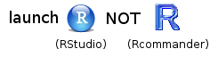

# Introduction {#intro}


## Learning Objectives

1. Understand the [R console](#rconsole) and the components of the [RStudio IDE](#rstudio_ide)
2. Use R as a [calculator](#rcalc)
3. [Creating vectors](#vectors) and storing as [variables](#vars)
4. Understand [vectorized operations](#vectorized_ops)
5. Understand [function syntax](#function_syx)
6. Appropriately [structure an R script](#structure)
7. Create and compile an [Rmarkdown document](#rmarkdown)


## Resources

* [Chapter 1: Introduction](http://r4ds.had.co.nz/introduction.html) in *R for Data Science*
* [RStudio IDE Cheatsheet](https://github.com/rstudio/cheatsheets/raw/master/rstudio-ide.pdf)
* If you need tips on how to install R/RStudio, head on over to the [Miscellaneous](11_misc.html) section.


## What is R?

*A programming environment for data processing and statistical analysis*


-   free and open-source
-   community supported
-   continually evolving
-   promotes *reproducible research*

## Interacting with R

### The Base R Console {#rconsole}

R is was developed almost two decades ago, and has a longer history as a derivative language of the scripting language S-PLUS developed in Bell Labs in the 70s and 80s.  &ldquo;Base R&rdquo; consists of a &ldquo;Read Evaluate Print Loop&rdquo; (REPL) command interpreter, in which you type in text commands, which are evaluated, and the results of which are printed to the screen.  This &ldquo;R Console&rdquo; window looks something like this.


### The RStudio Integrated Development Environment (IDE) {#rstudio_ide}

However, when you are developing a script, you will want to work in a text editor and send commands to the console, rather than typing directly into the console.  Developing an analysis script is R is essentially an exercise in programming, and for developing code it is best to use an Integrated Development Environment or IDE.  An IDE provides additional functionality that wraps around the basic console.  


The IDE that is highly recommended for this class is by RStudio (<http://www.rstudio.com>) and is depicted above.  This IDE provides multiple windows in additional to the console that greatly facilitate developing code.  In addition to the console (appearing as the bottom left window in the above figure), there is a script editor (top left), which provides syntax highlighting, autocompletion, and pop-up tool tips, a window showing functions and objects residing in memory for the session in the &ldquo;Environment&rdquo; tab (top right window in the figure), and a window that shows plots, files in the working directory, available add-on packages, and documentation (bottom right).

You will install both base R and RStudio, but will interact with R through the RStudio IDE.  You will have icons for both RStudio and for a very primitive IDE called &ldquo;R commander&rdquo; which comes packaged with R.  R commander is not as sophisticated or user-friendly as RStudio, so make sure you launch the RStudio IDE and not R commander by clicking on the correct icon.  Launch RStudio will also launch the R console, so that is all you need to click.

<p class="alert alert-warning">ALWAYS REMEMBER: Launch R though the RStudio IDE</p>



If you are an experienced programmer, you might want to consider using Emacs + ESS + Org Mode as an IDE instead of RStudio.  See [this link](http://orgmode.org/worg/org-contrib/babel/how-to-use-Org-Babel-for-R.html) if you want to go this advanced route.

## Developing reproducible scripts

Here is what an R script looks like.  Don't worry about the details for now.

```{r demo-script, eval = FALSE}
# load add-on packages
library(tidyverse)

# define custom functions
cumulativeToTarget <- function(x) {
    sessID <- x$SessionID[1]
    # etc... do some other stuff
    return(res)
}

## SCRIPT BEGINS HERE
load(file = "pog.RData")

pog2 <- pog %>% filter(ms >= -200 & ms <= 1000) %>%
  filter(FrameID <= 600) %>% 
  select(-ms) %>%
  do(cumulativeToTarget(.)) %>% 
  ungroup %>%
  mutate(ms = (FrameID-1) * 2 - 200, ID = factor(ID))

save(pog2, file = "pog2.RData")
```

All scripts will have the following structure:
<a name="structure"></a>

-   load in any add-on packages you need to use
-   define any custom functions
-   load in the data you will be working with
-   work with the data
-   save anything you need to save

Its best if you follow the above convention when developing your own scripts.

### Configure RStudio for Maximum Reproducibility

In this class, you will be learning how to develop *reproducible scripts*.  This means scripts that completely and transparently perform some analysis from start to finish in a way that yields the same result for different people using the same software on different computers.  And transparency is a key value of science, as embodied in the &ldquo;trust but verify&rdquo; motto.  When you do things reproducibly, others can understand and check your work.  This benefits science, but there is a selfish reason, too: the most important person who will benefit from a reproducible script is your future self.  When you return to an analysis after two weeks of vacation, you will thank your earlier self for doing things in a transparent, reproducible way, as you can easily pick up right where you left off.

<p class="alert alert-info">There are two tweaks that you should do to your RStudio installation to maximize reproducibility.  Go to the setting menu, and uncheck the box that says &ldquo;Restore .RData into workspace at startup&rdquo;.  If you keep things around in your workspace, things will get messy, and unexpected things will happen.  You should always start with a clear workspace.  This also means that you never want to save your workspace when you exit, so set this to &ldquo;Never&rdquo;.  The only thing you want to save are your scripts.</p>


### Reproducible reports with RStudio and RMarkdown {#rmarkdown}

We will be working toward producing reproducible reports following the principles of &ldquo;literate programming&rdquo;.  The basic idea is to have the text of the report together in a single document along with the R code needed to perform all analyses and generate the tables.  The report is then &rsquo;compiled&rsquo; from the original format into some other, more portable format, such as HTML or PDF.  This is different from traditional cutting and pasting approaches where, for instance, you create a graph in Microsoft Excel or a statistics program like SPSS and then paste it into Microsoft Word.

We will be using RMarkdown to create reproducible reports, which enables interleaving text with R code blocks.

You can read more about Donald Knuth's idea about literate programming at this [Wikipedia page](https://en.wikipedia.org/wiki/Literate_programming), and about the RMarkdown format [here](http://rmarkdown.rstudio.com/lesson-1.html).


A reproducible script will contain sections of code in code blocks.  A code block is delimited using three backtick symbols in a row, like so:

    This is just some text before the code block
    
    ```{r blockname}
    # now we are inside the R code block
    rnorm(10)  # generate some random numbers
    ```
    
    now we're back outside the code block

If you open up a new RMarkdown file from a template, you will see an example document with several code blocks in it.

To create an HTML or PDF report from an rmarkdown (rmd) document, you compile it.  Compiling a document is called &rsquo;knitting&rsquo; in RStudio.  There is a button that looks like a ball of yarn with needles through it that you click on to compile your file into a report.  Try it with the template file and see what happens!

## Typing in commands

We are first going to learn about how to interact with the console.  In generally, you will be developing R scripts or R markdown files, rather than working directly in the console window.  However, you can consider the console a kind of &rsquo;sandbox&rsquo; where you can try out lines of code and adapt them until you get them to do what you want.  Then you can copy them back into the script editor.

Mostly, however, you will be typing into the script editor window (either into an R script or an RMarkdown file) and then sending the commands to the console by placing the cursor on the line and holding down the Ctrl key while you press Enter.  The Ctrl+Enter key sequence sends the command in the script to the console.

### Warming up: Use R as a calculator {#rcalc}

One simple way to learn about the R console is to use it as a calculator.  Enter the lines of code below and see if your results match.  Be prepared to make lots of typos (at first) :/

```{r calc1}
## REPL: Read/Evaluate/Print Loop
## R prints results back at you
1 + 1
```

The R console remembers a history of the commands you typed in the past.  Use the up and down arrow keys on your keyboard to scroll backwards and forwards through your history.  It's a lot faster than re-typing.

```{r calc2}
1 + 1 + 3
```

You can break up math expressions over multiple lines; R waits for a complete expression before processing it.

```{r calc3}
## here comes a long expression
## let's break it over multiple lines
1 + 2 + 3 + 4 + 5 + 6 +
    7 + 8 + 9 +
    10
```

```{r char-demo}
"Good afternoon"
```

You can break up text over multiple lines; R waits for a close quote before processing it.

```{r multiline-char-demo}
"There is nothing in the world 
that makes people so unhappy as fear.  
The misfortune that befalls us is 
seldom, or never, as bad as that 
which we fear.

- Friedrich Schiller"
```

You can add comments to an R script by with the &rsquo;#&rsquo; symbol.  The R interpreter will ignore characters from the # symbol to the end of the line.

```{r comment-demo}
## comments: any text from '#' on is ignored until end of line
22 / 7  # approximation to pi
```

### Storing results in a variable {#vars}

Often you want to store the result of some computation for later use.  You can store it in a *variable*.  There are some important things to consider when naming your variables.

-   capitalization matters (`myVar` is different from `myvar`)
-   don't use spaces or special characters `(^&"'*+?)` etc.; use the &rsquo;\_&rsquo;
    where you would use a space (e.g., `my_var` is a legal variable
    name)
-   must begin with a letter (`m2` is a valid name, but `2m` is not)

Use the assignment operator `<-` to assign the value on the right to the variable named on the left.

```{r assignment}
## use the assignment operator '<-'
## R stores the number in the variable
x <- 5
```

Now that we have set `x` to a value, we can do something with it:

```{r var-demo}
x * 2

## R evaluates the expression and stores the result in the variable
boring_calculation <- 2 + 2
```

Note that it doesn't print the result back at you when it's stored.  To view the result, just type the variable name on a blank line.

```{r var-demo2}
boring_calculation
```

### Whitespace

```{r whitespace}
# R waits until next line for evaluation
(3 + 2) *
     5
```

```{r cowsay-intro}
# often useful to spread function arguments over multiple lines
library(cowsay)
say("This function call is far too wide to fit all on one line",
    "stretchycat")
```


When you see `>` at the beginning of a line, that means R is waiting for you to start a new command.  However, if you see a `+` instead of `>` at the start of the line, that means R is waiting for you to finish a command you started on a previous line.  If you want to cancel whatever command you started, just press the Esc key in the console window and you&rsquo;ll get back to the `>` command prompt.

### The workspace

Anytime you assign something to a new variable, R creates a new object in your workspace.  Objects in your workspace exist until you end your session; then they disappear forever (unless you save them).

```{r workspace}
ls()  # print the objects in the workspace

rm("x")   # remove the object named x from the workspace

rm(list = ls()) # clear out the workspace
```

### Vectors {#vectors}

Vectors are one of the key data structures in R.  A vector in R is like a vector in math: a set of ordered elements.  All of the elements in a vector must be of the same *data type* (numeric, character, factor).  You can create a vector by enclosing the elements in `c(...)`, as shown below.

```{r vectors}
## put information into a vector using c(...)
c(1, 2, 3)

c("this", "is", "cool")

## what happens when you mix types?
c(2, "good", 2, "b", "true")
```

#### Vectorized Operations
<a name="vectorized_ops"></a>

R performs calculations on vectors in a special way.  Let's look at an example using $z$-scores.  A $z$-score is a *deviation score* (a score minus a mean) divided by a standard deviation.  Let's say we have a set of four IQ scores.

```{r vectorised-calc1}    
## example IQ scores: mu = 100, sigma = 15
iq <- c(86, 101, 127, 99)
```

If we want to subtract the mean from these four scores, we just use the following code:

```{r vectorised-calc2}    
iq - 100
```

This subtracts 100 from each element of the vector.  R automatically assumes that this is what you wanted to do; it is called a *vectorized operation* and it makes it possible to express operations more efficiently.

To calculate $z$-scores we use the formula:

$z = \frac{X - \mu}{\sigma}$

where X are the scores, $\mu$ is the mean, and $\sigma$ is the standard deviation.  We can expression this formula in R as follows:

```{r z-scores}    
## z-scores
(iq - 100) / 15
```

You can see that it computed all four $z$-scores with a single line of code.  Very efficient!

### Function syntax {#function_syx}

A lot of what you do in R involves calling functions and storing the results.

Functions have the following generic syntax:

`functionname(arg1, arg2, arg3, ...)`

Each function has *named arguments* which may or may not have default
values.  Arguments without default values are *mandatory*; arguments
with these values are *optional*.  If an optional argument is not
specified, it will take on the default value.  You can *override* default values by supplying your own.

Arguments can be specified by:

-   position (unnamed)
-   name

Most functions return a value, but may also produce &rsquo;side effects&rsquo;
like printing to the console.

To illustrate, the function `rnorm()` generates random numbers from the standard normal distribution.  The help page for `rnorm()` (accessed by typing `?rnorm` in the console) shows that it has the syntax 

`rnorm(n, mean = 0, sd = 1)`

where `n` is the number of randomly generated numbers you want, `mean` is the mean of the distribution, and `sd` is the standard deviation.  The default mean is 0, and the default standard deviation is 1.  There is no default for `n` which means you&rsquo;ll get an error if you don't specify it:

```{r rnorm, eval = FALSE}
rnorm()
```

`Error in rnorm() : argument "n" is missing, with no default`

If you want 10 random numbers from a distribution with mean of 0 and standard deviation, you can just use the defaults.

```{r rnorm-10}
rnorm(10)
```

If you want 10 numbers from a distribution with a mean of 100:

```{r rnorm-10-100}
rnorm(10, 100)
```

This would be an equivalent but less efficient way of calling the function:

```{r rnorm-n-10-m-100}
rnorm(n = 10, mean = 100)
```

We don't need to name the arguments because R will recognize that we intended to fill in the first and second arguments by their position in the function call.  However, if we want to change the default for an argument coming later in the list, then we need to name it.  For instance, if we wanted to keep the default `mean = 0` but change the standard deviation to 100 we would do it this way:

```{r rnorm-10-sd-100}
rnorm(10, sd = 100)
```


## Some basic data types {#data_types}

Below are a list of different data types in R.

| type | description | example |
|--------|-------------|---------|
| double | floating point value | `.333337` |
| integer | integer | `-1, 0, 1` |
| numeric | any real number (int,dbl) | `1, .5, -.222` |
| boolean | assertion of truth/falsity | `TRUE, FALSE` |
| character | text string | `"hello world", 'howdy'` |

Wonder what type a particular variable is? Use `class()` to find out


## Add-on packages

One of the great things about R is that it is *user extensible*: anyone can create a new add-on software package that extends its functionality.  There are currently thousands of add-on packages that R users have created to solve many different kinds of problems, or just simply to have fun.  There are packages for data visualisation, machine learning, neuroimaging, eyetracking, web scraping, and playing games such as Sudoku.

Add-on packages are not distributed with base R, but have to be downloaded and installed from an archive, in the same way that you would, for instance, download and install a fitness app on your smartphone.

The main repository where packages reside is called CRAN, the Comprehensive R Archive Network.  A package has to pass strict tests devised by the R core team to be allowed to be part of the CRAN archive.  You can install from the CRAN archive through R using the `install.packages()` function.

There is an important distinction between *installing* a package and *loading* a package.

-   *Installing* a package is done using `install.packages()`. This is like installing an app on your smartphone: you only have to do it once and the app will remain installed until you remove it.  For instance, if you want to use Facebook on your phone you install it once from the App Store or Play Store, and you don't have to re-install it each time you want to use it.  Once you launch the app, it will run in the background until you close it or restart your phone.  Likewise, when you install a package, the package will be available (but not *loaded*) every time you open up R.

-   *Loading* a package: This is done using `library(packagename)`. This is like **launching** an app on your phone: the functionality is only there where the app is launched and remains there until you close the app or restart.  Likewise, when you run `library(packagename)` within a session, the functionality of the package referred to by `packagename` will be made available for your R session.  The next time you start R, you will need to run the `library()` function again if you want to access its functionality.

You may only be able to permanently install packages if you are using R on your own system; you may not be able to do this on public workstations because you will lack the appropriate privileges.

Try installing the library fortunes on your system:

```{r install-fortunes, eval = FALSE}
install.packages("fortunes")
```

If you don't get an error message, the installation was successful. 

You can then access the functionality of `fortune` for your current R session as follows:

```{r library-fortunes}
library(fortunes)
```

Once you have typed this, you can run the function `fortune()`, which spouts random wisdom from one of the R help lists:

```{r fortune-demo}
fortune()
```

Note that we will use the convention `package::function()` and `package::object` to indicate in which add-on package a function or object resides.  For instance, if you see `readr::read_csv()`, that refers to the function `read_csv()` in the `readr` add-on package.  If you see a function introduced without a package name, that means it is part of the base R system and not an add-on package (depending on the context).  Sometimes I will make this explicit by using `base` in the place of the package name; for instance, I might refer to `rnorm()` in base as `base::rnorm()`.

## Getting help

```{r help, eval = FALSE}
# these methods are all equivalent ways of getting help
help("say") # if package 'cowsay' is loaded
?say
help("say", package="cowsay") # if cowsay not loaded

??say # search for help files with "say"

# start up help in a browser
help.start()
```


## Exercises

<a href="formative_exercises/01_intro_stub.Rmd">Download the first set of formative exercises.</a>

We will be working with the `cowsay` add-on package (`help(package = "cowsay")`)

Check to see if there are any *vignettes* available for this package.

```{r cowsay-vignette, eval = FALSE}
vignette(package = "cowsay")
```

Load in and read the vignette to get an idea of how the package works.

```{r cowsay-tutorial, eval = FALSE}
vignette("cowsay_tutorial", package = "cowsay")
```

Your first task is to develop a reproducible script that accomplishes the tasks below. Compile the RMarkdown (rmd) document into HTML. Make sure the report includes the code in addition to the output.

Important! Try to perform each task making the shortest function call you can by taking advantage of the function defaults and include the results in an R script.

```{r library-cowsay, include = FALSE}
library("cowsay")
```

1. Make a cat say, “FEED ME”

2. Make a shark say “Hello world!”

3. Make anything produce a famous quote

4. Make a clippy warn the user about the impending apocalypse

5. Make a cat produce a random quote from an R coder. You should get a different quote every time you run the code (hint: read the documentation for `cowsay::say()`).

6. Define a variable creature and assign to it the value of one of the types of creatures accepted by the say() function. Then use the variable to output the current time.

7. Change the value of the variable creature to some other thing, and make it display the time using the `date()` function in base R.

8. Restart R and re-run the script to check whether it is reproducible.

9. *Advanced*: Create an RMarkdown file including each answer below each question heading (question 1-7 only), and compile it to HTML.
