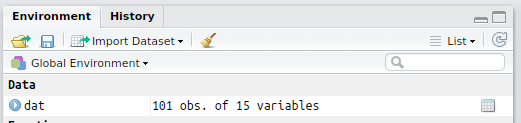

# Working with Data {#data}

## Learning Objectives

1. Understand the use the [basic data types](#data_types)
2. Understand and use the [basic container types](#containers) (list, vector)
3. [Create vectors](#vectors) and store them as [variables](#vars)
4. Understand [vectorized operations](#vectorized_ops)
5. Create a [data table](#tables)
6. [Import data](#import_data) from CSV and Excel files

 

## Resources

* [Chapter 11: Data Import](http://r4ds.had.co.nz/data-import.html) in *R for Data Science*
* [RStudio Data Import Cheatsheet](https://github.com/rstudio/cheatsheets/raw/master/source/pdfs/data-import-cheatsheet.pdf)
* [Scottish Babynames](https://www.nrscotland.gov.uk/files//statistics/babies-first-names-full-list/summary-records/babies-names16-all-names-years.csv)
* [Developing an analysis in R/RStudio: Scottish babynames (1/2)](https://www.youtube.com/watch?v=lAaVPMcMs1w)
* [Developing an analysis in R/RStudio: Scottish babynames (2/2)](https://www.youtube.com/watch?v=lzdTHCcClqo)


## Basic data types {#data_types}

There are five main basic data types in R (there are more, but these are the critical ones you need to know about).

| type      | description                | example                  |
|:----------|:---------------------------|:-------------------------|
| double    | floating point value       | `.333337`                |
| integer   | integer                    | `-1, 0, 1`               |
| numeric   | any real number (int,dbl)  | `1, .5, -.222`           |
| boolean   | assertion of truth/falsity | `TRUE, FALSE`            |
| character | text string                | `"hello world", 'howdy'` |


There is also a specific data type called a `factor` which will probably give you a headache sooner or later, but we can get by for now without them.

Character strings can include basically anything, including quotes, but if you want a quote to be included you have to 'escape' it using a backslash:

```{r quote}
my_string <- "The instructor said, \"R is cool,\" and the class agreed."
my_string
```

Note that if you just type a plain number such as `10` it is stored as a double, even if it doesn't have a decimal point. If you want it to be an exact integer, use the `L` suffix (10L).

If you ever want to know the data type of something, use the `class` function.  There is also the `mode` function which is specifically for vectors.

```{r class}
class(10) # numeric
class(10L) # integer
class("10") # string
class(10L == 11L) # logical
mode(TRUE)
```

## Basic container types {#containers}

### Vectors {#vectors}

Vectors are one of the key data structures in R.  A vector in R is like a vector in math: a set of ordered elements.  All of the elements in a vector must be of the same *data type* (numeric, character, factor).  You can create a vector by enclosing the elements in `c(...)`, as shown below.

```{r vectors}
## put information into a vector using c(...)
c(1, 2, 3)

c("this", "is", "cool")

## what happens when you mix types?
c(2, "good", 2, "b", "true")
```

OK, here's a question. When you type a single number in the console, it spits it back out to you, like this:

```{r three}
3L
```

Why is there a `[1]` there? i.e., what does the `[1]` in the `[1] 3` refer to?

We'll eventually get to the answer, but let's see if you can discover it yourself through experiment. There is an operator `:` that, when placed between two integers `x` and `y` like so: `x:y` will yield the sequence of integers from x to y inclusive. Let's make a big long vector of numbers and print it out.

```{r big_long_vector}
vec <- 200:400
vec
```

Note the number in square brackets on the left hand side of the output. Note that `vec` is a vector: an ordered container of 200 elements, in this case, the integers from 200 to 400. The bracked number on the left hand side tells you the numeric index (i.e., element number) corresponding to the first value in that row. So the first value is 200, the 19th value is 218, the 37th value is 236, etc.

Recall from the last class that another way to create a vector is to use the `c()` operator. (This is the easiest way, but you can also use the `vector()` function.) If we wanted to pick specific values out of the vector by position, we can make a vector of numbers like so:

```{r vec_index}
c(1L, 19L, 37L, 55L)
```

And then pull them out using the `[]` operator, which is the *extraction* operator, on the variable `vec`.

```{r vec_index1}
vec[c(1L, 19L, 37L, 55L)]

## note also:
index <- c(1L, 19L, 37L, 55L)
vec[index]

vec[c(1L, 1L, 19L, 19L, 19L, 19L)]
```

OK let's return to our original question: why did we get `[1] 3` when we just typed `3L`?  The answer should now be clear: when we entered a single number, R created a vector with a single element.

You can also create 'named' vectors, where each elements has a name. For example:

```{r vec_named}
vec2 <- c(first = 77.9, second = -13.2, third = 100.1)
vec2
```

We can then access elements by name using a character vector within the square brackets. We can put them in any order we want, and we can repeat elements:

```{r vec_named2}
vec2[c("third", "second", "second")]
```

We can get the vector of names using the `names()` function, and we can set or change them using something like `names(vec2) <- c("n1", "n2", "n3")`.

Another way to access elements is by using a logical vector within the square brackets. This will pull out the elements of the vector for which the corresponding element of the logical vector is `TRUE`. The logical vector must have the same length as the original. You can find out how long a vector is using the `length()` function.

```{r vec_len}
length(vec2)
vec2[c(TRUE, FALSE, TRUE)]
```

Here are some useful tricks to save typing when creating vectors. Recall that in the command `x:y` the `:` operator would give you the sequence of integers from `x:y`. 

What if you want to repeat a vector many times? You could either type it out (painful) or use the `rep()` function, which can repeat vectors in different ways.

```{r rep1}
# ten zeroes
rep(0, 10)

# alternating 1 and 3, 7 times
rep(c(1L, 3L), 7)

rep(c(TRUE, FALSE), 2)
```

What if you want to create a sequence but with something other than integer steps? You can use the `seq()` function. You can learn about this in the exercises below.

```{r rep}
# Repeat a vector
# See the ?rep function
rep(c(TRUE, FALSE), 3)

# Get every other (odd) element of vec
vec[rep(c(TRUE, FALSE), 100)]

# We can also store the logical vector in a variable and use that
evens <- rep(c(FALSE, TRUE), 100)
```

```{block, type="warning"}
You can't mix data types in a vector; all elements of the vector must be the same data type. If you mix them, R will coerce them so that they are all the same.
```


#### Vectorized Operations {#vectorized_ops}

R performs calculations on vectors in a special way.  Let's look at an example using $z$-scores.  A $z$-score is a *deviation score* (a score minus a mean) divided by a standard deviation.  Let's say we have a set of four IQ scores.

```{r vectorised-calc1}    
## example IQ scores: mu = 100, sigma = 15
iq <- c(86, 101, 127, 99)
```

If we want to subtract the mean from these four scores, we just use the following code:

```{r vectorised-calc2}    
iq - 100
```

This subtracts 100 from each element of the vector.  R automatically assumes that this is what you wanted to do; it is called a *vectorized operation* and it makes it possible to express operations more efficiently.

To calculate $z$-scores we use the formula:

$z = \frac{X - \mu}{\sigma}$

where X are the scores, $\mu$ is the mean, and $\sigma$ is the standard deviation.  We can expression this formula in R as follows:

```{r z-scores}    
## z-scores
(iq - 100) / 15
```

You can see that it computed all four $z$-scores with a single line of code.  Very efficient!


#### Exercises {#ex_vector}

1. The built-in vector `letters` contains the letters of the English alphabet.  Use an indexing vector of integers to extract the letters that spell 'cat'.
    
2. The function `colors()` returns all of the color names that R is aware of. What is the length of the vector returned by this function? (Use code to find the answer.)

3. The function call `runif(1000, 0, 1)` will draw 1000 numbers from a uniform distribution from 0 to 1, which simulates the p-values that you would get from 1000 experiments where the null hypothesis is true. Store the result of this call in `pvals`. Create a logical vector called `is_sig` that is `TRUE` if the corresponding element of `pvals` is less than .05, `FALSE` otherwise (hint: vectorized operations from the last lession), then use this logical vector to pull out those p-values. Finally, calculate the proportion of those p-values that were significant.

### Lists

Recall that vectors can contain data of only one type. What if you want to store a collection of data of different data types? For that purpose you would use a `list`. Define a list using the `list()` function.

```{r list-define, eval = FALSE}   

albums <- 
  list(
    Michael_Jackson = c(
      "Off the Wall",
      "Thriller",
      "Bad",
      "Dangerous"
    ),
    Nirvana = c(
      "Bleach",
      "Nevermind",
      "In Utero"
    )
  )  

names(albums)
length(albums)
```

You can refer to elements of a list by 

```{block, type="info"}
Fun fact: tabular data, stored in `data.frame` or `tibble` objects, which you will learn about in the next section, are a special type of list. That means you can access the columns of one of these object using `tablename$column` syntax, which is sometimes useful.
```

### Tabular data {#tables}

Most of what you will be working with in this course is *tabular data*, data arranged in the form of a table.

Tabular data structures, like lists, allow for a collection of data of different types (characters, integers, logical, etc.) but subject to the constraint that each "column" of the table (element of the list) must have the same number of elements.  The base R version of a table is called a `data.frame` while the 'tidyverse' version is called a `tibble`.  Tibbles are far easier to work with, so we'll be using those. To learn more about differences between these two data structures, see `vignette("tibble")`.

Tabular data becomes especially important for when we talk about *tidy data* in [lesson 4](04_wrangling.Rmd), which consists of a set of simple principles for structuring data.

If we are creating a tibble from scratch, we can use the `tibble()` function, and type the data right in.  Note that if we want a value to repeat multiple times, we only have to specify a one-element vector; R will expand out the vector to fill out the table.  All columns in the tibble must have the same lengths or be of length 1.

If we want to use the `tibble()` function, we either need to load the tibble package or the tidyverse package (which will itself load tibble in addition to other packages).  Let's do the latter.

```{r tverse, message = FALSE}
library("tidyverse")
```

We can get information about the table dimensions using the functions `ncol()` (number of columns), `nrow()` (number of rows), or `dim()` (a vector with the number of rows and number of columns).

```{r dataframe-define, eval = FALSE}    
months <- tibble(ID = 1:12,
                 name = c("Jan", "Feb", "Mar", "Apr",
                          "May", "Jun", "Jul", "Aug",
                          "Sep", "Oct", "Nov", "Dec"))

# print it
months

# how many rows?
nrow(months)

# how many columns?
ncol(months)
```

#### Viewing your tibble

Always, always, always, look at your data once you've created the table and load it in. Also look at it after each step that transforms your tibble.

There are three ways to look at your tibble: `View()` [*NB: capital 'V'], `print()`, and `glimpse()`.  Note that it is also rare that you want to print your data in a script; that is something you usually are doing for a sanity check, and you should just do it in the console.

The `print()` method can be run explicitly, but is more commonly called by just typing the variable name on the blank line. Usually we only call `print()` if we want fine control of how the information is displayed. 

Note that the default is not to print the entire table, but just the first 10 rows. Let's look at the `starwars` table that is built into the tidyverse.

```{r print}
starwars
```

You can see that this is a `r nrow(starwars)` rows by `r ncol(starwars)` column table, and we can only see the first 10 rows and first 8 columns.

If I want to see all 87 rows for some reason, I would use an explicit call to `print()`, and set the argument `n` to the number of rows I want to see. If I want all of them, just use `+Inf`, the symbol for 'infinite' rows.

```{r sw_all, eval = FALSE}
print(starwars, n = +Inf) # try this in the console
```

But we still can't see all the columns. If this is important to us, we can use `glimpse()`, which gives a sideways version of the tibble.

```{r sw_glimpse}
glimpse(starwars)
```

The other way to look at the table is a more graphical spreadsheet-like version given by `View()` (capital 'V').  It can be useful in the console, but don't ever put this one in a script because it will create an annoying pop-up window when the user goes to run it.

Note that `data.frame` objects are printed out in different ways from `tibble` objects. If you print a `data.frame` object with thousands or millions of rows, you won't just get a preview... you will spam your console with row upon row of data.  If you want to make a data.frame into a tibble so that it prints out nicely, just use the `as_tibble()` function.

```{r as_tibble, eval = FALSE}
mtcars # prints out way too many rows; TMI

as_tibble(mtcars) # much cleaner
mtcars2 <- as_tibble(mtcars) # store it
```

#### Accessing rows and columns

There are various base R ways of accessing specific columns or rows from a table that are useful to know about, but you'll be learning easier (and more readable) ways when we get to the lecture on [data wrangling](04_wrangling.Rmd).  Examples of these base R accessing functions are provided here for reference.

```{r dataframe-access, eval = FALSE}   
months[1, ] # first row

months[, 2] # second column (position)

months[1:3, ] # first 3 months

months[, c("Month")] # access column by name

months$month  # by column name
```

You'll learn about data frame operations in the [tidyr](#tidyr) and [dplyr](#dplyr) lessons.

#### Exercises {#ex_tibble}

1. Create a tibble with the name, age, and sex of 3-5 people whose names, ages, and sex you know.

2. Convert the built-in base R `iris` dataset to a tibble, and store it in the variable `iris2`.


3. Create a tibble that has the structure of the table below, using the minimum typing possible. (Hint: `rep()`).  Store it in the variable `my_tbl`.

    ```{r ex_tib3, echo = FALSE}
    my_tbl <- tibble(ID = 1:8,
                     A = rep(c("A1", "A2"), each = 4),
                     B = rep(c("B1", "B2"), 4),
                     C = "C1")
    my_tbl
    ```


## Importing data {#import_data}

There are many different types of files that you might work with when doing data analysis.  These different file types are usually distinguished by the three letter *extension* following a period at the end of the file name.  Here are some examples of different types of files and the functions you would use to read them in or write them out.

| Extension   | File Type              | Reading                 | Writing |
|-------------|------------------------|-------------------------|---------|
| .csv        | Comma-separated values | `readr::read_csv()`    | `readr::write_csv()` |
| .xls, .xlsx | Excel workbook         | `readxl::read_excel()` | N/A |
| .rds        | R binary file          | `readRDS()`             | `saveRDS()` |
| .RData      | R binary file          | `load()`                | `save()` |

Note: following the conventions introduced above in the section about add-on packages, `readr::read_csv()` refers to the `read_csv()` function in the `readr` package, and `readxl::read_excel()` refers to the function `read_excel()` in the package `readxl`.

Probably the most common file type you will encounter is `.csv` (comma-separated values).  As the name suggests, a CSV file distinguishes which values go with which variable by separating them with commas, and text values are sometimes enclosed in double quotes.  The first line of a file usually provides the names of the variables.  For example, here are the first few lines of a CSV containing Scottish baby names (see [the page at National Records Scotland](http://www.nrscotland.gov.uk/statistics-and-data/statistics/statistics-by-theme/vital-events/names/babies-first-names/babies-first-names-summary-records-comma-separated-value-csv-format)):

    yr,sex,FirstForename,number,rank,position
    1974,B,David,1794,1,1
    1974,B,John,1528,2,2
    1974,B,Paul,1260,3,3
    1974,B,Mark,1234,4,4
    1974,B,James,1202,5,5
    1974,B,Andrew,1067,6,6
    1974,B,Scott,1060,7,7
    1974,B,Steven,1020,8,8
    1974,B,Robert,885,9,9
    1974,B,Stephen,866,10,10

There are six variables in this dataset, and their names are given in the first line of the file: `yr`, `sex`, `FirstForename`, `number`, `rank`, and `position`.  You can see that the values for each of these variables are given in order, separated by commas, on each subsequent line of the file.

When you read in CSV files, it is best practice to use the `readr::read_csv()` function. The `readr` package is automatically loaaded as part of the `tidyverse` package, which we will be using in almost every script. Note that you would normally want to store the result of the `read_csv()` function to a variable, as so:

```{r load-tidyverse}
library(tidyverse)
```

```{r read_csv, eval = FALSE}
dat <- read_csv("my_data_file.csv")
```

Once loaded, you can view your data using the data viewer.  In the upper right hand window of RStudio, under the Environment tab, you will see the object `dat` listed.



If you click on the View icon (), it will bring up a table view of the data you loaded in the top left pane of RStudio.


This allows you to check that the data have been loaded in properly.  You can close the tab when you're done looking at it&#x2014;it won't remove the object.

### Writing Data

If you have data that you want to save your data to a CSV file, use `readr::write_csv()`, as follows.

```{r write_csv, eval = FALSE}
write_csv(dat, "my_data_file2.csv")
```

This will save the data in CSV format to your working directory.

## Exercises

Download the [exercises](exercises/02_data_stub.Rmd). See the [answers](exercises/02_data_answers.Rmd) only after you've attempted all the questions.