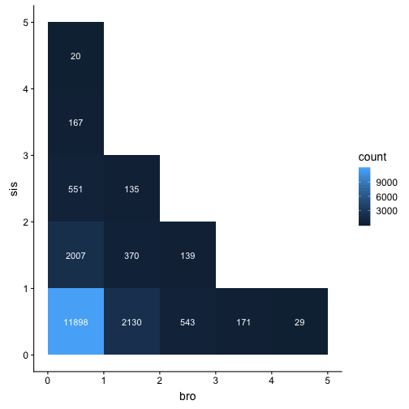

## UK Baby Names

Here we will convert the data table from the ukbabynames package to a tibble and assign it the variable name `ukb`. Use this data tibble for questions 1-13.


```r
# do not alter this code chunk
ukb <- as_tibble(ukbabynames) # convert to a tibble
```


### Question 1

How many records are in the dataset?


```r
nrecords <- nrow(ukb)

## or: 

nrecords <- count(ukb) %>% pull(n) 
```

### Question 2

Remove the column `rank` from the dataset.


```r
norank <- ukb %>%
  select(-rank)
```

```
## Error in select(., -rank): unused argument (-rank)
```

### Question 3

What is the range of birth years contained in the dataset? Use `summarise` to make a table with two columns: `minyear` and `maxyear`.


```r
birth_range <- ukb %>%
  summarise(minyear = min(year),
            maxyear = max(year))
```

### Question 4

Make a table of only the data from babies named Hermione.


```r
hermiones <- ukb %>%
  filter(name == "Hermione")
```

### Question 5

Sort the dataset by sex and then by year (descending) and then by rank (descending).


```r
sorted_babies <- ukb %>%
  arrange(sex, desc(year), desc(rank))
```

### Question 6

Create a new column, `decade`, that contains the decade of birth (1990, 2000, 2010).  Hint: see `?floor`


```r
ukb_decade <- ukb %>%
  mutate(decade = floor(year / 10) * 10)
```

### Question 7

Make a table of only the data from male babies named Courtney that were born between 1998 and 2001 (inclusive).


```r
courtney <- ukb %>%
  filter(name == "Courtney", sex == "M",
         year >= 1998, year <= 2001)
```


### Question 8

How many distinct names are represented in the dataset? Make sure `distinct_names` is an integer, not a data table.


```r
distinct_names <- n_distinct(ukb$name)

# or

distinct_names <- ukb %>%
  distinct(name) %>%
  count() %>%
  pull()
```

### Question 9

Make a table of only the data from the female babies named Frankie that were born before 1999 or after 2010.


```r
frankie <- ukb %>%
  filter(name == "Frankie", 
         sex == "F",
         (year < 1999) | (year > 2010))
```

### Question 10

How many total babies in the dataset were named 'Emily'? Make sure `emily` is an integer, not a data table.


```r
emily <- ukb %>%
  filter(name == "Emily") %>%
  summarise(tot = sum(n)) %>%
  pull(tot)
```

### Question 11

How many distinct names are there for each sex?


```r
names_per_sex <- ukb %>% 
  group_by(sex) %>%
  distinct(name) %>%
  count()
```

### Question 12

What is the most popular name in the dataset?


```r
most_popular <- ukb %>%
  group_by(name) %>%
  summarise(tot = sum(n)) %>%
  arrange(desc(tot)) %>%
  slice(1) %>%
  pull(name)
```

### Question 13

How many babies were born each year for each sex?  Make a plot.


```r
babies_per_year <- ukb %>%
  group_by(year, sex) %>%
  summarise(tot = sum(n))

ggplot(babies_per_year, aes(year, tot, color = sex)) +
  geom_line()
```


## Advanced Questions

There are several ways to complete the following two tasks. Different people will solve them different ways, so they cannot be automatically checked, but you should be able to tell if your answers make sense.

### Question 14

Load the dataset [family_composition.csv](https://psyteachr.github.io/msc-data-skills/data/family_composition.csv) from last week's exercise.

Calculate how many siblings of each sex each person has, narrow the dataset down to people with fewer than 6 siblings, and generate at least two different ways to graph this.

    

```r
family <- read_csv("https://psyteachr.github.io/msc-data-skills/data/family_composition.csv") %>%
  gather("sibtype", "n", oldbro:twinsis) %>%
  separate(sibtype, c("sibage", "sibsex"), sep = -3)

sib6 <- family %>%
  group_by(user_id, sex, sibsex) %>%
  summarise(n = sum(n)) %>%
  group_by(user_id) %>%
  filter(sex %in% c("male", "female"), sum(n) < 6)

ggplot(sib6, aes(n, fill = sibsex)) +
  geom_histogram(binwidth = 1, colour = "black", position = "dodge")
```


    

```r
sib6 <- family %>%
  group_by(user_id, sex, sibsex) %>%
  summarise(n = sum(n)) %>%
  filter(sex %in% c("male", "female")) %>%
  spread(sibsex, n) %>%
  filter(bro + sis < 6)

ggplot(sib6, aes(bro, sis)) +
  geom_count()
```


```r
# or
ggplot(sib6, aes(bro, sis)) +
  geom_bin2d(binwidth = c(1,1)) +
  stat_bin2d(geom = "text", aes(label = ..count..), 
             binwidth = c(1, 1), color = "white")
```




### Question 15

Use the data from [eye_descriptions.csv](https://psyteachr.github.io/msc-data-skills/data/eye_descriptions.csv) from last week's exercise.

Create a list of the 10 most common descriptions from the eyes dataset. Remove useless descriptions and merge redundant descriptions.
    

```r
eyes <- read_csv("https://psyteachr.github.io/msc-data-skills/data/eye_descriptions.csv") %>%
  gather("face_id", "description", t1:t50) %>%
  separate(description, c("d1", "d2", "d3", "d4"), sep = "(,|;|\\/)+", extra = "merge", fill = "right") %>%
  gather("desc_n", "description", d1:d4) %>%
  filter(!is.na(description)) %>% # gets rid of rows with no description
  mutate(
    description = trimws(description), # get rid of white space around string
    description = tolower(description) # make all characters lowercase
  ) %>%
  group_by(description) %>%
  summarise(n = n()) %>%               # count occurances of each description
  arrange(desc(n)) %>%                 # sort by count (descending)
  filter(nchar(description) > 1) %>%   # get rid of 1-character descriptions
  filter(row_number() < 11)

knitr::kable(eyes) # displays the table in a nice format
```


|description |   n|
|:-----------|---:|
|brown       | 364|
|blue        | 314|
|small       | 276|
|pretty      | 261|
|big         | 240|
|round       | 233|
|sad         | 225|
|tired       | 219|
|dark        | 190|
|average     | 176|

## Answer Checks

You've made it to the end. Make sure you are able to knit this document to HTML. You can check your answers below in the knit document.


|Question                               |Answer    |
|:--------------------------------------|:---------|
|<a href='#question-1'>Question 1</a>   |correct   |
|<a href='#question-2'>Question 2</a>   |incorrect |
|<a href='#question-3'>Question 3</a>   |correct   |
|<a href='#question-4'>Question 4</a>   |correct   |
|<a href='#question-5'>Question 5</a>   |correct   |
|<a href='#question-6'>Question 6</a>   |correct   |
|<a href='#question-7'>Question 7</a>   |correct   |
|<a href='#question-8'>Question 8</a>   |correct   |
|<a href='#question-9'>Question 9</a>   |correct   |
|<a href='#question-10'>Question 10</a> |correct   |
|<a href='#question-11'>Question 11</a> |correct   |
|<a href='#question-12'>Question 12</a> |correct   |
|<a href='#question-13'>Question 13</a> |correct   |


