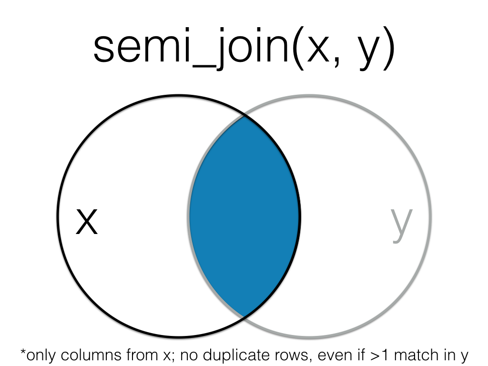

```{r psyteachr-setup, include = FALSE}
source("R/psyteachr_setup.R") # psyTeachR styles and functions
source("R/my_setup.R")        # book-specific styles and functions
```

# Data Relations {#joins}

## Learning Objectives

1. Be able to use the 4 mutating join verbs:
    + [`left_join()`](#left_join)
    + [`right_join()`](#right_join)
    + [`inner_join()`](#inner_join)
    + [`full_join()`](#full_join)

2. Be able to use the 2 filtering join verbs:
    + [`semi_join()`](#semi_join)
    + [`anti_join()`](#anti_join)
    
3. Be able to use the 2 binding join verbs:
    + [`bind_rows()`](#bind_rows)
    + [`bind_cols()`](#bind_cols)

4. Be able to use the 3 set operations:
    + [`intersect()`](#intersect)
    + [`union()`](#union)
    + [`setdiff()`](#setdiff)

## Resources

* [Chapter 13: Relational Data](http://r4ds.had.co.nz/relational-data.html) in *R for Data Science*
* [Cheatsheet for dplyr join functions](http://stat545.com/bit001_dplyr-cheatsheet.html)
* [Lecture slides on dplyr two-table verbs](slides/05_joins_slides.pdf)

## Setup

```{r libraries, warning = FALSE, message = FALSE}
# libraries needed for these examples
library(tidyverse)
```

### Data

First, we'll create two small data tables. 

`subject` has id, sex and age for subjects 1-5. Age and sex are missing for subject 3.

```{r subject}
subject <- tibble(
  id = seq(1,5),
  sex = c("m", "m", NA, "f", "f"),
  age = c(19, 22, NA, 19, 18)
)
```

`r knitr::kable(subject)`

`exp` has subject id and the score from an experiment. Some subjects are missing, 
some completed twice, and some are not in the subject table.

```{r exp}
exp <- tibble(
  id = c(2, 3, 4, 4, 5, 5, 6, 6, 7),
  score = c(10, 18, 21, 23, 9, 11, 11, 12, 3)
)
```

`r knitr::kable(exp)`


## Mutating Joins

All the mutating joins have this basic syntax:

`****_join(x, y, by = NULL, suffix = c(".x", ".y")`

* `x` = the first (left) table
* `y` = the second (right) table
* `by` = what columns to match on. If you leave this blank, it will match on all columns with the same names in the two tables.
* `suffix` = if columns have the same name in the two tables, but you aren't joining by them, they get a suffix to make them unambiguous. This defaults to ".x" and ".y", but you can change it to something more meaningful.

### left_join() {#left_join}

```{r img-left-join, echo=FALSE, fig.width=4, fig.cap="Left Join", class="join"}
knitr::include_graphics("images/joins/left_join.png")
```

A `left_join` keeps all the data from the first (left) table and joins anything 
that matches from the second (right) table. If the right table has more than one match for a row in the right table, there will be more than one row in the joined table (see ids 4 and 5).

```{r left_join}
left_join(subject, exp, by = "id")
```

You can leave out the `by` argument if you're matching on all of the columns with 
the same name, but it's good practice to always specify it so your code is robust 
to changes in the loaded data.

```{r img-left-join-rev, echo=FALSE, fig.width=4, fig.cap="Left Join (reversed)", class="join"}
knitr::include_graphics("images/joins/left_join_rev.png")
```

The order of tables is swapped here, so the result is all rows from the `exp` 
table joined to any matching rows from the `subject` table.

```{r left_join-2}
left_join(exp, subject, by = "id")
```

### right_join() {#right_join}

```{r img-right-join, echo=FALSE, fig.width=4, fig.cap="Right Join", class="join"}
knitr::include_graphics("images/joins/right_join.png")
```

A `right_join` keeps all the data from the second (right) table and joins anything 
that matches from the first (left) table. 

```{r right_join}
right_join(subject, exp, by = "id")
```

```{block, type="info"}
This table has the same information as 
`left_join(exp, subject, by = "id")`, but the columns are in a different order 
(left table, then right table).
```

### inner_join() {#inner_join}

```{r img-inner-join, echo=FALSE, fig.width=4, fig.cap="Inner Join", class="join"}
knitr::include_graphics("images/joins/inner_join.png")
```

An `inner_join` returns all the rows that have a match in the other table.

```{r inner_join}
inner_join(subject, exp, by = "id")
```


### full_join() {#full_join}

```{r img-full-join, echo=FALSE, fig.width=4, fig.cap="Full Join", class="join"}
knitr::include_graphics("images/joins/full_join.png")
```

A `full_join` lets you join up rows in two tables while keeping all of the 
information from both tables. If a row doesn't have a match in the other table, 
the other table's column values are set to `NA`.

```{r full_join}
full_join(subject, exp, by = "id")
```

## Filtering Joins

### semi_join() {#semi_join}

```{r img-semi-join, echo=FALSE, fig.width=4, fig.cap="Semi Join", class="join"}

```

A `semi_join` returns all rows from the left table where there are matching values 
in the right table, keeping just columns from the left table.

```{r semi_join}
semi_join(subject, exp, by = "id")
```

```{block, type="info"}
Unlike an inner join, a semi join will never duplicate 
the rows in the left table if there is more than one maching row in the right table.
```

```{r img-semi-join-rev, echo=FALSE, fig.width=4, fig.cap="Semi Join (Reversed)", class="join"}
knitr::include_graphics("images/joins/semi_join_rev.png")
```

Order matters in a semi join.

```{r semi_join-2}
semi_join(exp, subject, by = "id")
```

### anti_join() {#anti_join}

```{r img-anti-join, echo=FALSE, fig.width=4, fig.cap="Anti Join", class="join"}
knitr::include_graphics("images/joins/anti_join.png")
```
A `anti_join` return all rows from the left table where there are *not* matching 
values in the right table, keeping just columns from the left table.

```{r anti_join}
anti_join(subject, exp, by = "id")
```

```{r img-anti-join-rev, echo=FALSE, fig.width=4, fig.cap="Anti Join (Reversed)", class="join"}
knitr::include_graphics("images/joins/anti_join_rev.png")
```

Order matters in an anti join.

```{r anti_join-2}
anti_join(exp, subject, by = "id")
```

## Binding Joins

### bind_rows() {#bind_rows}

You can combine the rows of two tables with `bind_rows`.

Here we'll add subject data for subjects 6-9 and bind that to the original subject table.

```{r bind_rows}
new_subjects <- tibble(
  id = seq(6, 9),
  sex = c("m", "m", "f", "f"),
  age = c(19, 16, 20, 19)
)

bind_rows(subject, new_subjects)
```

The columns just have to have the same names, they don't have to be in the same order. Any columns that differ between the two tables will just have `NA` values for entries from the other table.

If a row is duplicated between the two tables (like id 5 below), the row will also
be duplicated in the resulting table. If your tables have the exact same columns, 
you can use `union()` (see below) to avoid duplicates.

```{r bind-rows-union}
new_subjects <- tibble(
  id = seq(5, 9),
  age = c(18, 19, 16, 20, 19),
  sex = c("f", "m", "m", "f", "f"),
  new = c(1,2,3,4,5)
)

bind_rows(subject, new_subjects)
```

### bind_cols() {#bind_cols}

You can merge two tables with the same number of rows using `bind_cols`. This is 
only useful if the two tables have their rows in the exact same order. The only 
advantage over a left join is when the tables don't have any IDs to join by and 
you have to rely solely on their order.

```{r bind_cols}
new_info <- tibble(
  colour = c("red", "orange", "yellow", "green", "blue")
)

bind_cols(subject, new_info)
```

## Set Operations

### intersect() {#intersect}

`intersect()` returns all rows in two tables that match exactly. The columns 
don't have to be in the same order.

```{r intersect}
new_subjects <- tibble(
  id = seq(4, 9),
  age = c(19, 18, 19, 16, 20, 19),
  sex = c("f", "f", "m", "m", "f", "f")
)

dplyr::intersect(subject, new_subjects)

```


### union() {#union}

`union()` returns all the rows from both tables, removing duplicate rows.

```{r union}
dplyr::union(subject, new_subjects)
```

### setdiff() {#setdiff}

`setdiff` returns rows that are in the first table, but not in the second table.

```{r setdiff}
setdiff(subject, new_subjects)
```

Order matters for `setdiff`.

```{r setdiff-order}
setdiff(new_subjects, subject)
```


## Exercises

Download the [formative exercises](formative_exercises/06_joins_stub.Rmd). See the [answers](formative_exercises/06_joins_answers.Rmd) only after you've attempted all the questions.

### Mutating joins

Load data from [disgust_scores.csv](data/disgust_scores.csv), 
[personality_scores.csv](data/personality_scores.csv) and [users.csv](data/users.csv). 
Each participant is identified by a unique `user_id`.

1. Add participant data to the disgust table.

    <div class="solution"><button>Solution</button>
    ```{r ex-1, message = FALSE, warning = FALSE}
    disgust <- read_csv("data/disgust_scores.csv")
    ocean <- read_csv("data/personality_scores.csv")
    user <- read_csv("data/users.csv")

    study1 <- left_join(disgust, user, by = "user_id")
    
    head(study1)
    ```
    </div>
    
    *Intermediate*: Calculate the age of each participant on the date they did the disgust questionnaire. Round to the nearest tenth of a year.
    
    <div class="solution"><button>Solution</button>
    ```{r ex-1-i, message = FALSE}
    library(lubridate)
    
    study1_ages <- study1 %>%
      mutate(
        age = date - birthday,
        age_days = as.integer(age),
        age_years = round(age_days/365.25, 1)
      )
    
    study1_ages %>%
      select(date, birthday:age_years) %>%
      head()
    ```
    </div>

2. Add the participant data to the disgust data, but have the columns from the participant table first.

    <div class="solution"><button>Solution</button>
    ```{r ex-2}
    study2 <- right_join(user, disgust, by = "user_id")
    head(study2)
    ```
    </div>
    
    *Intermediate*: How many times was the disgust questionnaire completed by each sex?
    
    <div class="solution"><button>Solution</button>
    ```{r ex-2-i}
    study2 %>%
      group_by(sex) %>%
      summarise(n = n())
    ```
    </div>
    
    *Advanced*: Make a graph of how many people completed the questionnaire each year.
    
    <div class="solution"><button>Solution</button>
    ```{r ex-2-a, message = FALSE}
    study2 %>%
      mutate(year = substr(date, 1, 4)) %>%
      group_by(year) %>%
      summarise(times_completed = n()) %>%
      ggplot() +
      geom_col(aes(year, times_completed, fill = year)) +
      labs(
        x = "Year",
        y = "Times Completed"
      ) +
      guides(fill = FALSE)
      
    ```
    </div>

3. Create a table with only disgust and personality data from the same `user_id` collected on the same `date`.

    <div class="solution"><button>Solution</button>
    ```{r ex-3}
    study3 <- inner_join(disgust, ocean, by = c("user_id", "date"))
    head(study3)
    ```
    </div> 
    
    *Intermediate*: Join data from the same `user_id`, regardless of `date`. Does this give you the same data table as above?
    
    <div class="solution"><button>Solution</button>
    ```{r ex-3-i}
    study3_nodate <- inner_join(disgust, ocean, by = c("user_id"))
    head(study3_nodate)
    ```
    </div> 
    

4. Create a table of the disgust and personality data with each `user_id:date` on a single row, containing _all_ of the data from both tables.

    <div class="solution"><button>Solution</button>
    ```{r ex-4}
    study4 <- full_join(disgust, ocean, by = c("user_id", "date"))
    head(study4)
    ```
    </div>

### Filtering joins

5. Create a table of just the data from the disgust table for users who completed the personality questionnaire that same day.

    <div class="solution"><button>Solution</button>
    ```{r ex-5}
    study5 <- semi_join(disgust, ocean, by = c("user_id", "date"))
    head(study5)
    ```
    </div>
    
6. Create a table of data from users who did not complete either the personality questionnaire or the disgust questionnaire. (_Hint: this will require two steps; use pipes._)

    <div class="solution"><button>Solution</button>
    ```{r ex-6}
    study6 <- user %>%
      anti_join(ocean, by = "user_id") %>%
      anti_join(disgust, by = "user_id")
    head(study6)
    ```
    </div>

### Binding and sets

7. Load new user data from [users2.csv](data/users2.csv). Bind them into a single table.

    <div class="solution"><button>Solution</button>
    ```{r ex-7, message = FALSE}
    user2 <- read_csv("data/users2.csv")
    users_all <- bind_rows(user, user2)
    head(users_all)
    ```
    </div>

8. How many users are in both the first and second user table?

    <div class="solution"><button>Solution</button>
    ```{r ex-8}
    dplyr::intersect(user, user2) %>% nrow()
    ```
    </div>

9. How many unique users are there in total across the first and second user tables?

    <div class="solution"><button>Solution</button>
    ```{r ex-9}
    dplyr::union(user, user2) %>% nrow()
    ```
    </div>

10. How many users are in the first, but not the second, user table?

    <div class="solution"><button>Solution</button>
    ```{r ex-10}
    dplyr::setdiff(user, user2) %>% nrow()
    ```
    </div>

11. How many users are in the second, but not the first, user table?

    <div class="solution"><button>Solution</button>
    ```{r ex-11}
    dplyr::setdiff(user2, user) %>% nrow()
    ```
    </div>
