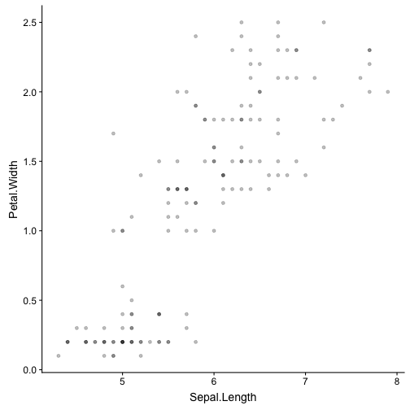
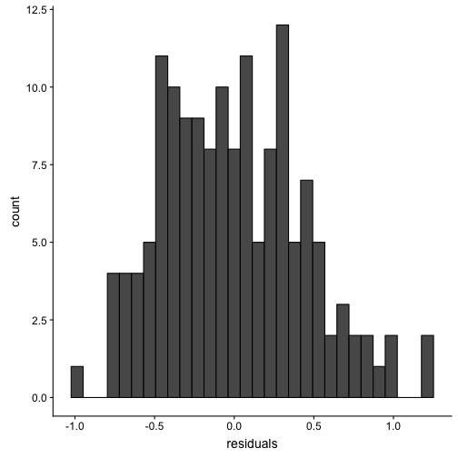

## The `iris` dataset

There is a built-in dataset called `iris` that has measurements of different parts of flowers. (See `?iris` for information about the dataset.)


### Question 1

Use ggplot2 to make a scatterplot that visualizes the relationship between sepal length (horizontal axis) and petal width (vertical axis). Watch out for overplotting.


```r
ggplot()
```




### Question 2

Run a regression model that predicts the petal width from the sepal length, and store the model object in the variable `iris_mod`.  End the block by printing out the summary of the model.


```r
iris_mod <- NULL

summary(iris_mod) #print out the model summary
```

```
## Length  Class   Mode 
##      0   NULL   NULL
```


### Question 3

Make a histogram of the residuals of the model using ggplot2.


```r
residuals <- NULL

ggplot()
```




### Question 4

Write code to predict the petal width for two plants, the first with a sepal length of 5.25cm, and the second with a sepal length of 6.3cm.  Store the vector of predictions in the variable `iris_pred`.


```r
iris_pred <- NULL

iris_pred # print the predicted values
```

```
## NULL
```


## Simulating data from the linear model

### Question 5

*NOTE: You can knit this file to html to see formatted versions of the equations below (which are enclosed in `$` characters); alternatively, if you find it easier, you can hover your mouse pointer over the `$` in the code equations to see the formatted versions.* 

Write code to randomly generate 10 Y values from a simple linear regression model with an intercept of 3 and a slope of -7.  Recall the form of the linear model:

$Y_i = \beta_0 + \beta_1 X_i + e_i$

The residuals ($e_i$s) are drawn from a normal distribution with mean 0 and variance $\sigma^2 = 4$, and $X$ is the vector of integer values from 1 to 10. Store the 10 observations in the variable `Yi` below. (NOTE: the standard deviation is the *square root* of the variance, i.e. $\sigma$; `rnorm()` takes the standard deviation, not the variance, as its third argument).


```r
x   <- NULL
err <- NULL
Yi  <- NULL

Yi # print the values of Yi
```

```
## NULL
```

## Advanced

### Question 6

Write a function to simulate data with the form.

$Y_i = \beta_0 + \beta_1 X_i + e_i$

The function should take arguments for the number of observations to return (`n`), the intercept (`b0`), the effect (`b1`), the mean and SD of the predictor variable X (`X_mu` and `X_sd`), and the SD of the residual error (`err_sd`). The function should return a tibble with `n` rows and the columns `id`, `X` and `Y`.


```r
sim_lm_data <- function(n){}

dat6 <- sim_lm_data(n = 10) 

knitr::kable(dat6) # print table
```

```
## Warning in kable_markdown(x = structure(character(0), .Dim = c(0L,
## 0L), .Dimnames = list(: The table should have a header (column names)
```


||
||
||
||

### Question 7

Use the function from Question 6 to generate a data table with 10000 subjects, an intercept of 80, an effect of X of 0.5, where X has a mean of 0 and SD of 1, and residual error SD of 2.

Analyse the data with `lm()`. Find where the analysis summary estimates the values of `b0` and `b1`. What happens if you change the simulation values?


```r
dat <- NULL

mod <- NULL

summary(mod) # print summary
```

```
## Length  Class   Mode 
##      0   NULL   NULL
```


### Question 8

Use the function from Question 6 to calculate power by simulation for the effect of X on Y in a design with 50 subjects, an intercept of 80, an effect of X of 0.5, where X has a mean of 0 and SD of 1, residual error SD of 2, and alpha of 0.05.

Hint: use `broom::tidy()` to get the p-value for the effect of X.


```r
power <- NULL

power # print the value
```

```
## NULL
```

### Question 9

Calculate power (i.e., the false positive rate) for the effect of X on Y in a design with 50 subjects where there is no effect and alpha is 0.05.


```r
false_pos <- NULL

false_pos # print the value
```

```
## NULL
```


## Answer Checks

You've made it to the end. Make sure you are able to knit this document to HTML. You can check your answers below in the knit document.


|   |Question                             |Answer    |
|:--|:------------------------------------|:---------|
|2  |<a href='#question-2'>Question 2</a> |incorrect |
|3  |<a href='#question-3'>Question 3</a> |incorrect |
|4  |<a href='#question-4'>Question 4</a> |incorrect |
|5  |<a href='#question-5'>Question 5</a> |incorrect |
|6  |<a href='#question-6'>Question 6</a> |incorrect |
|7  |<a href='#question-7'>Question 7</a> |incorrect |
|8  |<a href='#question-8'>Question 8</a> |incorrect |
|9  |<a href='#question-9'>Question 9</a> |incorrect |
