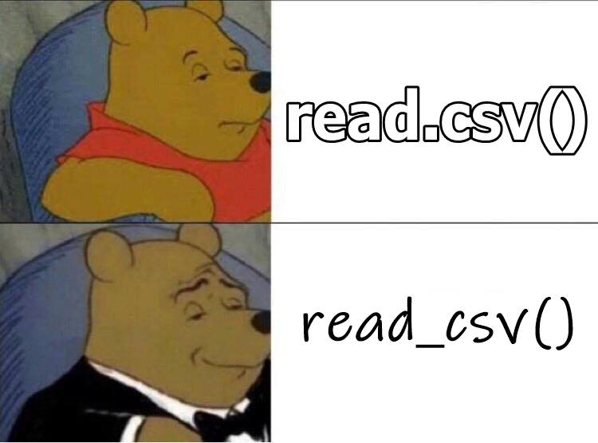

# Working with Data {#data}



## Learning Objectives {#ilo2}

1. Load [built-in datasets](#builtin) [(video)](https://youtu.be/Z5fK5VGmzlY){class="video"}
2. [Import data](#import_data) from CSV and Excel files [(video)](https://youtu.be/a7Ra-hnB8l8){class="video"}
3. Create a [data table](#tables) [(video)](https://youtu.be/k-aqhurepb4){class="video"}
4. Understand the use the [basic data types](#data_types) [(video)](https://youtu.be/jXQrF18Jaac){class="video"}
5. Understand and use the [basic container types](#containers) (list, vector) [(video)](https://youtu.be/4xU7uKNdoig){class="video"}
6. Use [vectorized operations](#vectorized_ops) [(video)](https://youtu.be/9I5MdS7UWmI){class="video"}
7. Be able to [troubleshoot](#Troubleshooting) common data import problems [(video)](https://youtu.be/gcxn4LJ_vAI){class="video"}


## Resources {#resources2}

* [Chapter 11: Data Import](http://r4ds.had.co.nz/data-import.html) in *R for Data Science*
* [RStudio Data Import Cheatsheet](https://github.com/rstudio/cheatsheets/raw/master/data-import.pdf)
* [Scottish Babynames](https://www.nrscotland.gov.uk/files//statistics/babies-first-names-full-list/summary-records/babies-names16-all-names-years.csv)
* [Developing an analysis in R/RStudio: Scottish babynames (1/2)](https://www.youtube.com/watch?v=lAaVPMcMs1w)
* [Developing an analysis in R/RStudio: Scottish babynames (2/2)](https://www.youtube.com/watch?v=lzdTHCcClqo)

## Setup {#setup2}

```{r, results = 'hide', warning = FALSE, message = FALSE}
# libraries needed for these examples
library(tidyverse)
library(dataskills)
```

## Data tables

### Built-in data {#builtin}

R comes with built-in datasets. Some packages, like tidyr and dataskills, also contain data. The `data()` function lists the datasets available in a package.

```{r built-in-data}
# lists datasets in dataskills
data(package = "dataskills")
```

Type the name of a dataset into the console to see the data. Type `?smalldata` into the console to see the dataset description.

```{r}
smalldata
```

You can also use the `data()` function to load a dataset into your `r glossary("global environment")`.

```{r}
# loads smalldata into the environment
data("smalldata")
```


Always, always, always, look at your data once you've created or loaded a table. Also look at it after each step that transforms your table. There are three main ways to look at your tibble: `print()`, `glimpse()`, and `View()`. 

The `print()` method can be run explicitly, but is more commonly called by just typing the variable name on the blank line. The default is not to print the entire table, but just the first 10 rows. It's rare to print your data in a script; that is something you usually are doing for a sanity check, and you should just do it in the console.  

Let's look at the `smalldata` table that we made above. 

```{r print}
smalldata
```

The function `glimpse()` gives a sideways version of the tibble. This is useful if the table is very wide and you can't see all of the columns. It also tells you the data type of each column in angled brackets after each column name. We'll learn about [data types](#data_types) below.

```{r sw_glimpse}
glimpse(smalldata)
```

The other way to look at the table is a more graphical spreadsheet-like version given by `View()` (capital 'V').  It can be useful in the console, but don't ever put this one in a script because it will create an annoying pop-up window when the user runs it.
Now you can click on `smalldata` in the environment pane to open it up in a viewer that looks a bit like Excel.

You can get a quick summary of a dataset with the `summary()` function.

```{r}
summary(smalldata)
```

You can even do things like calculate the difference between the means of two columns.

```{r}
pre_mean <- mean(smalldata$pre)
post_mean <- mean(smalldata$post)
post_mean - pre_mean
```


### Importing data {#import_data}

Built-in data are nice for examples, but you're probably more interested in your own data. There are many different types of files that you might work with when doing data analysis. These different file types are usually distinguished by the three letter `r glossary("extension")` following a period at the end of the file name. Here are some examples of different types of files and the functions you would use to read them in or write them out.

| Extension   | File Type              | Reading                | Writing |
|-------------|------------------------|------------------------|---------|
| .csv        | Comma-separated values | `readr::read_csv()`    | `readr::write_csv()` |
| .tsv, .txt  | Tab-separated values   | `readr::read_tsv()`    | `readr::write_tsv()` |
| .xls, .xlsx | Excel workbook         | `readxl::read_excel()` | NA |
| .sav, .mat, ... | Multiple types     | `rio::import()`          | NA |

The double colon means that the function on the right comes from the package on the left, so `readr::read_csv()` refers to the `read_csv()` function in the `readr` package, and `readxl::read_excel()` refers to the function `read_excel()` in the package `readxl`. The function `rio::import()` from the `rio` package will read almost any type of data file, including SPSS and Matlab. Check the help with `?rio::import` to see a full list.

You can get a directory of data files used in this class for tutorials and exercises with the following code, which will create a directory called "data" in your project directory. Alternatively, you can download a [zip file of the datasets](data/data.zip).

```{r getdata, eval = FALSE}
dataskills::getdata()
```


Probably the most common file type you will encounter is `r glossary("csv", ".csv")` (comma-separated values).  As the name suggests, a CSV file distinguishes which values go with which variable by separating them with commas, and text values are sometimes enclosed in double quotes. The first line of a file usually provides the names of the variables. 

For example, here are the first few lines of a CSV containing personality scores:

    ```
    subj_id,O,C,E,A,N
    S01,4.428571429,4.5,3.333333333,5.142857143,1.625
    S02,5.714285714,2.9,3.222222222,3,2.625
    S03,5.142857143,2.8,6,3.571428571,2.5
    S04,3.142857143,5.2,1.333333333,1.571428571,3.125
    S05,5.428571429,4.4,2.444444444,4.714285714,1.625
    ```

There are six variables in this dataset, and their names are given in the first line of the file: `subj_id`, `O`, `C`, `E`, `A`, and `N`. You can see that the values for each of these variables are given in order, separated by commas, on each subsequent line of the file.

When you read in CSV files, it is best practice to use the `readr::read_csv()` function. The `readr` package is automatically loaded as part of the `tidyverse` package, which we will be using in almost every script. Note that you would normally want to store the result of the `read_csv()` function to an object, as so:

```{r read_csv}
csv_data <- read_csv("data/5factor.csv")
```

The `read_csv()` and `read_tsv()` functions will give you some information about the data you just read in so you can check the column names and [data types](#data_types). For now, it's enough to know that `col_double()` refers to columns with numbers and `col_character()` refers to columns with words. We'll learn in the [toroubleshooting](#troubleshooting) section below how to fix it if the function guesses the wrong data type.

```{r read_funcs, eval=FALSE}
tsv_data <- read_tsv("data/5factor.txt")
xls_data <- readxl::read_xls("data/5factor.xls")
# you can load sheets from excel files by name or number
rep_data <- readxl::read_xls("data/5factor.xls", sheet = "replication")
spss_data <- rio::import("data/5factor.sav")
```

Once loaded, you can view your data using the data viewer.  In the upper right hand window of RStudio, under the Environment tab, you will see the object `babynames` listed.


If you click on the View icon (), it will bring up a table view of the data you loaded in the top left pane of RStudio.


This allows you to check that the data have been loaded in properly.  You can close the tab when you're done looking at it, it won't remove the object.

### Creating data 

If we are creating a data table from scratch, we can use the `tibble::tibble()` function, and type the data right in. The `tibble` package is part of the `r glossary("tidyverse")` package that we loaded at the start of this chapter. 

Let's create a small table with the names of three Avatar characters and their bending type. The `tibble()` function takes arguments with the names that you want your columns to have. The values are vectors that list the column values in order.

If you don't know the value for one of the cells, you can enter `NA`, which we have to do for Sokka because he doesn't have any bending ability. If all the values in the column are the same, you can just enter one value and it will be copied for each row.

```{r tibble-define}    
avatar <- tibble(
  name = c("Katara", "Toph", "Sokka"),
  bends = c("water", "earth", NA),
  friendly = TRUE
)

# print it
avatar
```


### Writing Data

If you have data that you want to save to a CSV file, use `readr::write_csv()`, as follows.

```{r write_csv, eval = FALSE}
write_csv(avatar, "avatar.csv")
```

This will save the data in CSV format to your working directory.

```{block, type="try"}
* Create a new table called `family` with the first name, last name, and age of your family members. 
* Save it to a CSV file called "family.csv". 
* Clear the object from your environment by restarting R or with the code `remove(family)`.
* Load the data back in and view it.
```

We'll be working with `r glossary("tabular data")` a lot in this class, but tabular data is made up of `r glossary("vector", "vectors")`, which group together data with the same basic `r glossary("data type")`. The following sections explain some of this terminology to help you understand the functions we'll be learning to process and analyse data.

## Basic data types {#data_types}

Data can be numbers, words, true/false values or combinations of these. In order to understand some later concepts, it's useful to have a basic understanding of `r glossary("data type", "data types")` in R: `r glossary("numeric")`, `r glossary("character")`, and `r glossary("logical")` There is also a specific data type called a `r glossary("factor")`, which will probably give you a headache sooner or later, but we can ignore it for now.

### Numeric data

All of the real numbers are `r glossary("numeric")` data types (imaginary numbers are "complex"). There are two types of numeric data, `r glossary("integer")` and `r glossary("double")`. Integers are the whole numbers, like -1, 0 and 1. Doubles are numbers that can have fractional amounts. If you just type a plain number such as `10`, it is stored as a double, even if it doesn't have a decimal point. If you want it to be an exact integer, use the `L` suffix (10L).

If you ever want to know the data type of something, use the `typeof` function.

```{r numeric-data}
typeof(10)   # double
typeof(10.0) # double
typeof(10L)  # integer
typeof(10i)  # complex
```

If you want to know if something is numeric (a double or an integer), you can use the function `is.numeric()` and it will tell you if it is numeric (`TRUE`) or not (`FALSE`).

```{r}
is.numeric(10L)
is.numeric(10.0)
is.numeric("Not a number")
```

### Character data

`r glossary("character", "Character")` strings are any text between quotation marks. 

```{r character-data}
typeof("This is a character string")
typeof('You can use double or single quotes')
```

This can include quotes, but you have to `r glossary("escape")` it using a backslash to signal the the quote isn't meant to be the end of the string.

```{r quote}
my_string <- "The instructor said, \"R is cool,\" and the class agreed."
cat(my_string) # cat() prints the arguments
```

### Logical Data

`r glossary("logical", "Logical")` data (also sometimes called "boolean" values) is one of two values: true or false. In R, we always write them in uppercase: `TRUE` and `FALSE`.

```{r logical-data}
class(TRUE)
class(FALSE)
```

When you compare two values with an `r glossary("operator")`, such as checking to see if 10 is greater than 5, the resulting value is logical.

```{r logical-operator}
is.logical(10 > 5)
```

```{block type = "info"}
You might also see logical values abbreviated as `T` and `F`, or `0` and `1`. This can cause some problems down the road, so we will always spell out the whole thing.
```


```{r, include = FALSE}
int <- c(answer = "integer", "double", "character", "logical", "factor")
dbl <- c("integer", answer = "double", "character", "logical", "factor")
chr <- c("integer", "double", answer = "character", "logical", "factor")
logi <- c("integer", "double", "character", answer = "logical", "factor")
fac <- c("integer", "double", "character", "logical", answer = "factor")
```

<div class="try">
What data types are these:

* `100` `r mcq(dbl)`
* `100L` `r mcq(int)`
* `"100"` `r mcq(chr)`
* `100.0` `r mcq(dbl)`
* `-100L` `r mcq(int)`
* `factor(100)` `r mcq(fac)`
* `TRUE` `r mcq(logi)`
* `"TRUE"` `r mcq(chr)`
* `FALSE` `r mcq(logi)`
* `1 == 2` `r mcq(logi)`

</div>

## Basic container types {#containers}

Individual data values can be grouped together into containers. The main types of containers we'll work with are vectors, lists, and data tables.

### Vectors {#vectors}

A `r glossary("vector")` in R is like a vector in mathematics: a set of ordered elements.  All of the elements in a vector must be of the same **data type** (numeric, character, logical). You can create a vector by enclosing the elements in the function `c()`.

```{r vectors}
## put information into a vector using c(...)
c(1, 2, 3, 4)
c("this", "is", "cool")
1:6 # shortcut to make a vector of all integers x:y
```

<div class="try">
What happens when you mix types? What class is the variable `mixed`?
```{r}
mixed <- c(2, "good", 2L, "b", TRUE)
```
</div>

```{block, type="warning"}
You can't mix data types in a vector; all elements of the vector must be the same data type. If you mix them, R will "coerce" them so that they are all the same. If you mix doubles and integers, the integers will be changed to doubles. If you mix characters and numeric types, the numbers will be coerced to characters, so `10` would turn into "10".
```

#### Selecting values from a vector

If we wanted to pick specific values out of a vector by position, we can use square brackets (an `r glossary("extract operator")`, or `[]`) after the vector.

```{r vec_select}
values <- c(10, 20, 30, 40, 50)
values[2] # selects the second value
```

You can select more than one value from the vector by putting a vector of numbers inside the square brackets. For example, you can select the 18th, 19th, 20th, 21st, 4th, 9th and 15th letter from the built-in vector `LETTERS` (which gives all the uppercase letters in the Latin alphabet).

```{r vec_index}
word <- c(18, 19, 20, 21, 4, 9, 15)
LETTERS[word]
```

<div class="try">
Can you decode the secret message?
```{r}
secret <- c(14, 5, 22, 5, 18, 7, 15, 14, 14, 1, 7, 9, 22, 5, 25, 15, 21, 21, 16)
```

</div>

You can also create 'named' vectors, where each element has a name. For example:

```{r vec_named}
vec <- c(first = 77.9, second = -13.2, third = 100.1)
vec
```

We can then access elements by name using a character vector within the square brackets. We can put them in any order we want, and we can repeat elements:

```{r vec_named2}
vec[c("third", "second", "second")]
```

```{block, type="info"}
We can get the vector of names using the `names()` function, and we can set or change them using something like `names(vec2) <- c("n1", "n2", "n3")`.
```

Another way to access elements is by using a logical vector within the square brackets. This will pull out the elements of the vector for which the corresponding element of the logical vector is `TRUE`. If the logical vector doesn't have the same length as the original, it will repeat. You can find out how long a vector is using the `length()` function.

```{r vec_len}
length(LETTERS)
LETTERS[c(TRUE, FALSE)]
```

#### Repeating Sequences {#rep_seq}

Here are some useful tricks to save typing when creating vectors.

In the command `x:y` the `:` operator would give you the sequence of number starting at `x`, and going to `y` in increments of 1. 

```{r colon}
1:10
15.3:20.5
0:-10
```

What if you want to create a sequence but with something other than integer steps? You can use the `seq()` function. Look at the examples below and work out what the arguments do.

```{r seq}
seq(from = -1, to = 1, by = 0.2)
seq(0, 100, length.out = 11)
seq(0, 10, along.with = LETTERS)
```

What if you want to repeat a vector many times? You could either type it out (painful) or use the `rep()` function, which can repeat vectors in different ways.

```{r rep1}
rep(0, 10)                      # ten zeroes
rep(c(1L, 3L), times = 7)       # alternating 1 and 3, 7 times
rep(c("A", "B", "C"), each = 2) # A to C, 2 times each
```

The `rep()` function is useful to create a vector of logical values (`TRUE`/`FALSE` or `1`/`0`) to select values from another vector.

```{r eiko}
# Get subject IDs in the pattern Y Y N N ...
subject_ids <- 1:40
yynn <- rep(c(TRUE, FALSE), each = 2, 
            length.out = length(subject_ids))
subject_ids[yynn]
```


#### Vectorized Operations {#vectorized_ops}

R performs calculations on vectors in a special way. Let's look at an example using $z$-scores.  A $z$-score is a `r glossary("deviation score")`(a score minus a mean) divided by a standard deviation. Let's say we have a set of four IQ scores.

```{r vectorised-calc1}    
## example IQ scores: mu = 100, sigma = 15
iq <- c(86, 101, 127, 99)
```

If we want to subtract the mean from these four scores, we just use the following code:

```{r vectorised-calc2}    
iq - 100
```

This subtracts 100 from each element of the vector. R automatically assumes that this is what you wanted to do; it is called a `r glossary("vectorized")` operation and it makes it possible to express operations more efficiently.

To calculate $z$-scores we use the formula:

$z = \frac{X - \mu}{\sigma}$

where X are the scores, $\mu$ is the mean, and $\sigma$ is the standard deviation. We can expression this formula in R as follows:

```{r z-scores}    
## z-scores
(iq - 100) / 15
```

You can see that it computed all four $z$-scores with a single line of code. In later chapters, we'll use vectorised operations to process our data, such as reverse-scoring some questionnaire items.


### Lists

Recall that vectors can contain data of only one type. What if you want to store a collection of data of different data types? For that purpose you would use a `r glossary("list")`. Define a list using the `list()` function.

```{r list-define}   

data_types <- list(
  double = 10.0,
  integer = 10L,
  character = "10",
  logical = TRUE
)

str(data_types) # str() prints lists in a condensed format
```

You can refer to elements of a list using square brackets like a vector, but you can also use the dollar sign notation (`$`) if the list items have names.

```{r}
data_types$logical
```

<div class="try">
Explore the 5 ways shown below to extract a value from a list. What data type is each object? What is the difference between the single and double brackets? Which one is the same as the dollar sign?

```{r}
bracket1 <- data_types[1]
bracket2 <- data_types[[1]]
name1    <- data_types["double"]
name2    <- data_types[["double"]]
dollar   <- data_types$double
```

</div>

### Tables {#tables}

The built-in, imported, and created data above are `r glossary("tabular data")`, data arranged in the form of a table.

Tabular data structures allow for a collection of data of different types (characters, integers, logical, etc.) but subject to the constraint that each "column" of the table (element of the list) must have the same number of elements. The base R version of a table is called a `data.frame`, while the 'tidyverse' version is called a `tibble`.  Tibbles are far easier to work with, so we'll be using those. To learn more about differences between these two data structures, see `vignette("tibble")`.

Tabular data becomes especially important for when we talk about `r glossary("tidy data")` in [chapter 4](#tidyr), which consists of a set of simple principles for structuring data.

#### Creating a table

We learned how to create a table by importing a Excel or CSV file, and creating a table from scratch using the `tibble()` function. You can also use the `tibble::tribble()` function to create a table by row, rather than by column. You start by listing the column names, each preceded by a tilde (`~`), then you list the values for each column, row by row, separated by commas (don't forget a comma at the end of each row). This method can be easier for some data, but doesn't let you use shortcuts, like setting all of the values in a column to the same value or a [repeating sequence](#rep_seq).

```{r}
# by column using tibble
avatar_by_col <- tibble(
  name = c("Katara", "Toph", "Sokka", "Azula"),
  bends = c("water", "earth", NA, "fire"),
  friendly = rep(c(TRUE, FALSE), c(3, 1))
)

# by row using tribble
avatar_by_row <- tribble(
  ~name,    ~bends, ~friendly,
  "Katara", "water",       TRUE,
  "Toph",   "earth",       TRUE,
  "Sokka",  NA,            TRUE,
  "Azula",  "fire",        FALSE
)

```

#### Table info

We can get information about the table using the functions `ncol()` (number of columns), `nrow()` (number of rows), `dim()` (the number of rows and number of columns), and `name()` (the column names).

````{r}
nrow(avatar) # how many rows?
ncol(avatar) # how many columns?
dim(avatar)  # what are the table dimensions?
names(avatar) # what are the column names?
```

#### Accessing rows and columns {#row-col-access}

There are various ways of accessing specific columns or rows from a table. The ones below are from `r glossary("base R")` and are useful to know about, but you'll be learning easier (and more readable) ways in the [tidyr](#tidyr) and [dplyr](#dplyr) lessons. Examples of these base R accessing functions are provided here for reference, since you might see them in other people's scripts.

```{r dataframe-access}   
katara     <- avatar[1, ] # first row
type       <- avatar[, 2] # second column (bends)
benders    <- avatar[c(1, 2), ] # selected rows (by number)
bends_name <- avatar[, c("bends", "name")] # selected columns (by name)
friendly   <- avatar$friendly  # by column name
```

## Troubleshooting

What if you import some data and it guesses the wrong column type? The most common reason is that a numeric column has some non-numbers in it somewhere. Maybe someone wrote a note in an otherwise numeric column. Columns have to be all one data type, so if there are any characters, the whole column is converted to character strings, and numbers like `1.2` get represented as "1.2", which will cause very weird errors like `"100" < "9" == TRUE`. You can catch this by looking at the output from `read_csv()` or using `glimpse()` to check your data.

The data directory you created with `dataskills::getdata()` contains a file called "mess.csv". Let's try loading this dataset.

```{r}
mess <- read_csv("data/mess.csv")
```

You'll get a warning with many parsing errors and `mess` is just a single column of the word "junk". View the file `data/mess.csv` by clicking on it in the File pane, and choosing "View File". Here are the first 10 lines. What went wrong?

```
This is my messy dataset

junk,order,score,letter,good,min_max,date
junk,1,-1,a,1,1 - 2,2020-01-1

junk,missing,0.72,b,1,2 - 3,2020-01-2

junk,3,-0.62,c,FALSE,3 - 4,2020-01-3

junk,4,2.03,d,T,4 - 5,2020-01-4
```

First, the file starts with a note: "This is my messy dataset". We want to skip the first two lines. You can do this with the argument `skip` in `read_csv()`.

```{r mess}
mess <- read_csv("data/mess.csv", skip = 2)
mess
```

OK, that's a little better, but this table is still a serious mess in several ways:

* `junk` is a column that we don't need
* `order` should be an integer column
* `good` should be a logical column
* `good` uses all kinds of different ways to record TRUE and FALSE values
* `min_max` contains two pieces of numeric information, but is a character column
* `date` should be a date column

We'll learn how to deal with this mess in the chapters on [tidy data](#tidyr) and [data wrangling](#dplyr), but we can fix a few things by setting the `col_types` argument in `read_csv()` to specify the column types for our two columns that were guessed wrong and skip the "junk" column. The argument `col_types` takes a list where the name of each item in the list is a column name and the value is from the table below. You can use the function, like `col_double()` or the abbreviation, like `"l"`. Omitted column names are guessed.

| function | |abbreviation | type |
|:---------|:--------------|:-----|
| col_logical()   | l | logical values |
| col_integer()   | i | integer values |
| col_double()    | d | numeric values |
| col_character() | c | strings |
| col_factor(levels, ordered) | f | a fixed set of values |
| col_date(format = "")     | D | with the locale's date_format |
| col_time(format = "")     | t | with the locale's time_format |
| col_datetime(format = "") | T | ISO8601 date time |
| col_number()    | n | numbers containing the grouping_mark |
| col_skip()      | _, - | don't import this column |
| col_guess()     | ? | parse using the "best" type based on the input |

```{r tidier}
# omitted values are guessed
# ?col_date for format options
ct <- list(
  junk = "-", # skip this column
  order = "i",
  good = "l",
  date = col_date(format = "%Y-%m-%d")
)

tidier <- read_csv("data/mess.csv", 
                   skip = 2,
                   col_types = ct)
```

You will get a message about "1 parsing failure" when you run this. Warnings look scary at first, but always start by reading the message. The table tells you what row (`2`) and column (`order`) the error was found in, what kind of data was expected (`integer`), and what the actual value was (`missing`). If you specifically tell `read_csv()` to import a column as an integer, any characters in the column will produce a warning like this and then be recorded as `NA`. You can manually set what the missing values are recorded as with the `na` argument.

```{r}
tidiest <- read_csv("data/mess.csv", 
                   skip = 2,
                   na = "missing",
                   col_types = ct)
```


Now `order` is an integer where "missing" is now `NA`, `good` is a logical value, where `0` and `F` are converted to `FALSE` and `1` and `T` are converted to `TRUE`, and `date` is a date type (adding leading zeros to the day). We'll learn in later chapters how to fix the other problems.

```{r tidiest-table}
tidiest
```


## Glossary {#glossary2}

`r glossary_table()`

## Exercises {#exercises2}

Download the [exercises](exercises/02_data_exercise.Rmd). See the [answers](exercises/02_data_answers.Rmd) only after you've attempted all the questions.

```{r, eval = FALSE}
# run this to access the exercise
dataskills::exercise(2)

# run this to access the answers
dataskills::exercise(2, answers = TRUE)
```
