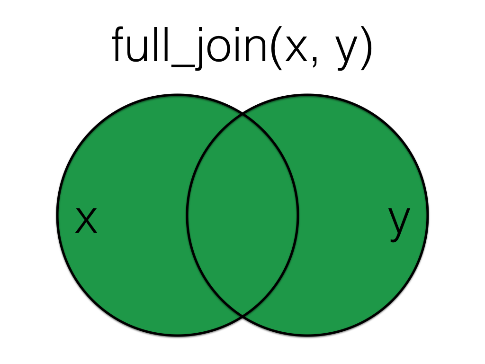
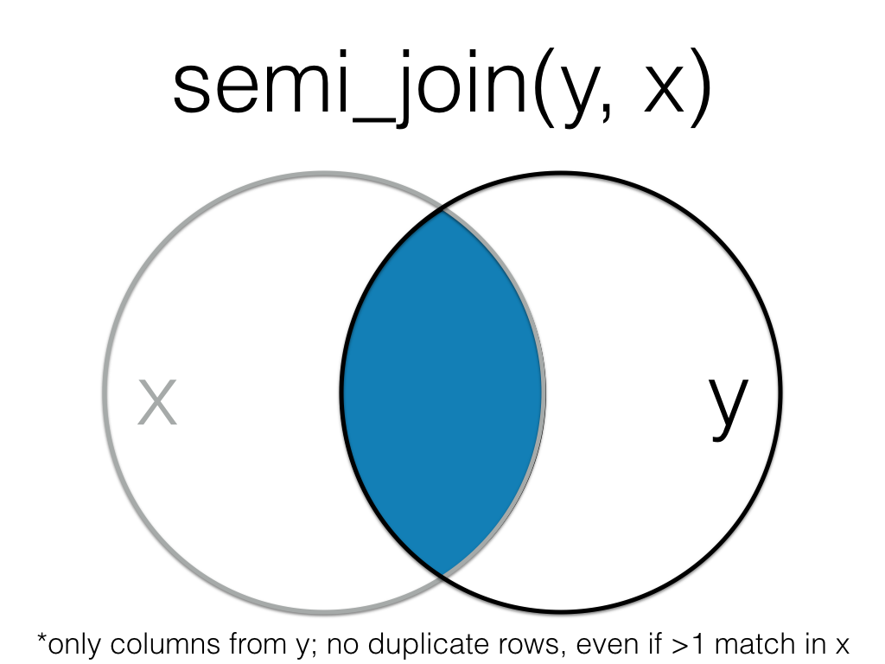

# Data Relations {#joins}


## Learning Objectives {#ilo6}

1. Be able to use the 4 mutating join verbs: [(video)](https://youtu.be/WV0yg6f3DNM){class="video"}
    + [`left_join()`](#left_join)
    + [`right_join()`](#right_join)
    + [`inner_join()`](#inner_join)
    + [`full_join()`](#full_join)
2. Be able to use the 2 filtering join verbs: [(video)](https://youtu.be/ijoCEKifefQ){class="video"}
    + [`semi_join()`](#semi_join)
    + [`anti_join()`](#anti_join)
3. Be able to use the 2 binding join verbs: [(video)](https://youtu.be/8RWdNhbVZ4I){class="video"}
    + [`bind_rows()`](#bind_rows)
    + [`bind_cols()`](#bind_cols)
4. Be able to use the 3 set operations: [(video)](https://youtu.be/c3V33ElWUYI){class="video"}
    + [`intersect()`](#intersect)
    + [`union()`](#union)
    + [`setdiff()`](#setdiff)

## Resources {#resources6}

* [Chapter 13: Relational Data](http://r4ds.had.co.nz/relational-data.html) in *R for Data Science*
* [Cheatsheet for dplyr join functions](http://stat545.com/bit001_dplyr-cheatsheet.html)
* [Lecture slides on dplyr two-table verbs](slides/05_joins_slides.pdf)

## Setup {#setup6}

```{r libraries, results = 'hide', warning = FALSE, message = FALSE}
# libraries needed
library(tidyverse)
```

## Data

First, we'll create two small data tables. 

`subject` has id, gender and age for subjects 1-5. Age and gender are missing for subject 3.

```{r subject}
subject <- tibble(
  id = 1:5,
  gender = c("m", "m", NA, "nb", "f"),
  age = c(19, 22, NA, 19, 18)
)
```

`r knitr::kable(subject)`

`exp` has subject id and the score from an experiment. Some subjects are missing, some completed twice, and some are not in the subject table.

```{r exp}
exp <- tibble(
  id = c(2, 3, 4, 4, 5, 5, 6, 6, 7),
  score = c(10, 18, 21, 23, 9, 11, 11, 12, 3)
)
```

`r knitr::kable(exp)`


## Mutating Joins

`r glossary("Mutating joins")` act like the `mutate()` function in that they add new columns to one table based on values in another table.  

All the mutating joins have this basic syntax:

`****_join(x, y, by = NULL, suffix = c(".x", ".y")`

* `x` = the first (left) table
* `y` = the second (right) table
* `by` = what columns to match on. If you leave this blank, it will match on all columns with the same names in the two tables.
* `suffix` = if columns have the same name in the two tables, but you aren't joining by them, they get a suffix to make them unambiguous. This defaults to ".x" and ".y", but you can change it to something more meaningful.

```{block, type="info"}
You can leave out the `by` argument if you're matching on all of the columns with the same name, but it's good practice to always specify it so your code is robust to changes in the loaded data.
```

### left_join() {#left_join}

```{r img-left-join, echo=FALSE, fig.width=4, fig.cap="Left Join", class="join"}
knitr::include_graphics("images/joins/left_join.png")
```

A `left_join` keeps all the data from the first (left) table and joins anything that matches from the second (right) table. If the right table has more than one match for a row in the right table, there will be more than one row in the joined table (see ids 4 and 5).

```{r left_join}
left_join(subject, exp, by = "id")
```

```{r img-left-join-rev, echo=FALSE, fig.width=4, fig.cap="Left Join (reversed)", class="join"}
knitr::include_graphics("images/joins/left_join_rev.png")
```

The order of tables is swapped here, so the result is all rows from the `exp` table joined to any matching rows from the `subject` table.

```{r left_join-2}
left_join(exp, subject, by = "id")
```

### right_join() {#right_join}

```{r img-right-join, echo=FALSE, fig.width=4, fig.cap="Right Join", class="join"}
knitr::include_graphics("images/joins/right_join.png")
```

A `right_join` keeps all the data from the second (right) table and joins anything that matches from the first (left) table. 

```{r right_join}
right_join(subject, exp, by = "id")
```

<div class="info">
This table has the same information as `left_join(exp, subject, by = "id")`, but the columns are in a different order (left table, then right table).
</div>

### inner_join() {#inner_join}

```{r img-inner-join, echo=FALSE, fig.width=4, fig.cap="Inner Join", class="join"}
knitr::include_graphics("images/joins/inner_join.png")
```

An `inner_join` returns all the rows that have a match in the other table.

```{r inner_join}
inner_join(subject, exp, by = "id")
```


### full_join() {#full_join}

```{r img-full-join, echo=FALSE, fig.width=4, fig.cap="Full Join", class="join"}

```

A `full_join` lets you join up rows in two tables while keeping all of the information from both tables. If a row doesn't have a match in the other table, the other table's column values are set to `NA`.

```{r full_join}
full_join(subject, exp, by = "id")
```


## Filtering Joins

`r glossary("Filtering joins")` act like the `filter()` function in that they remove rows from the data in one table based on the values in another table. The result of a filtering join will only contain rows from the left table and have the same number or fewer rows than the left table. 

### semi_join() {#semi_join}

```{r img-semi-join, echo=FALSE, fig.width=4, fig.cap="Semi Join", class="join"}
knitr::include_graphics("images/joins/semi_join.png")
```

A `semi_join` returns all rows from the left table where there are matching values in the right table, keeping just columns from the left table.

```{r semi_join}
semi_join(subject, exp, by = "id")
```

```{block, type="info"}
Unlike an inner join, a semi join will never duplicate the rows in the left table if there is more than one matching row in the right table.
```

```{r img-semi-join-rev, echo=FALSE, fig.width=4, fig.cap="Semi Join (Reversed)", class="join"}

```

Order matters in a semi join.

```{r semi_join-2}
semi_join(exp, subject, by = "id")
```

### anti_join() {#anti_join}

```{r img-anti-join, echo=FALSE, fig.width=4, fig.cap="Anti Join", class="join"}
knitr::include_graphics("images/joins/anti_join.png")
```

An `anti_join` return all rows from the left table where there are *not* matching values in the right table, keeping just columns from the left table.

```{r anti_join}
anti_join(subject, exp, by = "id")
```

```{r img-anti-join-rev, echo=FALSE, fig.width=4, fig.cap="Anti Join (Reversed)", class="join"}
knitr::include_graphics("images/joins/anti_join_rev.png")
```

Order matters in an anti join.

```{r anti_join-2}
anti_join(exp, subject, by = "id")
```

## Binding Joins

`r glossary("Binding joins")` bind one table to another by adding their rows or columns together.

### bind_rows() {#bind_rows}

You can combine the rows of two tables with `bind_rows`.

Here we'll add subject data for subjects 6-9 and bind that to the original subject table.

```{r bind_rows}
new_subjects <- tibble(
  id = 6:9,
  gender = c("nb", "m", "f", "f"),
  age = c(19, 16, 20, 19)
)

bind_rows(subject, new_subjects)
```

The columns just have to have the same names, they don't have to be in the same order. Any columns that differ between the two tables will just have `NA` values for entries from the other table.

If a row is duplicated between the two tables (like id 5 below), the row will also be duplicated in the resulting table. If your tables have the exact same columns, you can use `union()` (see below) to avoid duplicates.

```{r bind-rows-union}
new_subjects <- tibble(
  id = 5:9,
  age = c(18, 19, 16, 20, 19),
  gender = c("f", "nb", "m", "f", "f"),
  new = c(1,2,3,4,5)
)

bind_rows(subject, new_subjects)
```

### bind_cols() {#bind_cols}

You can merge two tables with the same number of rows using `bind_cols`. This is only useful if the two tables have their rows in the exact same order. The only advantage over a left join is when the tables don't have any IDs to join by and you have to rely solely on their order.

```{r bind_cols}
new_info <- tibble(
  colour = c("red", "orange", "yellow", "green", "blue")
)

bind_cols(subject, new_info)
```

## Set Operations

`r glossary("Set operations")` compare two tables and return rows that match (intersect), are in either table (union), or are in one table but not the other (setdiff).

### intersect() {#intersect}

`intersect()` returns all rows in two tables that match exactly. The columns don't have to be in the same order.

```{r intersect}
new_subjects <- tibble(
  id = seq(4, 9),
  age = c(19, 18, 19, 16, 20, 19),
  gender = c("f", "f", "m", "m", "f", "f")
)

intersect(subject, new_subjects)

```

<div class="warning">

If you've forgotten to load dplyr or the tidyverse, `r glossary("base R")` also has an `intersect()` function. The error message can be confusing and looks something like this:

```{r base-intersect, error = TRUE}
base::intersect(subject, new_subjects)
```
</div>

### union() {#union}

`union()` returns all the rows from both tables, removing duplicate rows.

```{r union}
union(subject, new_subjects)
```


<div class="warning">
If you've forgotten to load dplyr or the tidyverse, `r glossary("base R")` also has a `union()` function. You usually won't get an error message, but the output won't be what you expect.

```{r base-union}
base::union(subject, new_subjects)
```
</div> 

### setdiff() {#setdiff}

`setdiff` returns rows that are in the first table, but not in the second table.

```{r setdiff}
setdiff(subject, new_subjects)
```

Order matters for `setdiff`.

```{r setdiff-order}
setdiff(new_subjects, subject)
```

<div class="warning">
If you've forgotten to load dplyr or the tidyverse, `r glossary("base R")` also has a `setdiff()` function. You usually won't get an error message, but the output might not be what you expect because the base R `setdiff()` expects columns to be in the same order, so id 5 here registers as different between the two tables.

```{r base-setdiff}
base::setdiff(subject, new_subjects)
```
</div>

## Glossary {#glossary6}

`r glossary_table()`

## Exercises {#exercises6}

Download the [exercises](exercises/06_joins_exercise.Rmd). See the [answers](exercises/06_joins_answers.Rmd) only after you've attempted all the questions.

```{r, eval = FALSE}
# run this to access the exercise
dataskills::exercise(6)

# run this to access the answers
dataskills::exercise(6, answers = TRUE)
```
