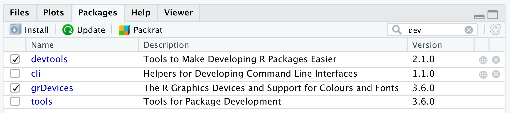
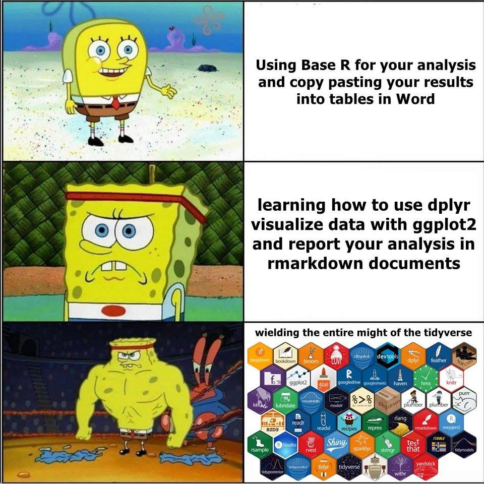

--- 
title: Data Skills for Reproducible Science
date: "2020-10-17"
site: bookdown::bookdown_site
documentclass: book
bibliography: [book.bib]
biblio-style: apalike
link-citations: yes
description: "This course provides an overview of skills needed for reproducible research and open science using the statistical programming language R. Students will learn about data visualisation, data tidying and wrangling, archiving, iteration and functions, probability and data simulations, general linear models, and reproducible workflows. Learning is reinforced through weekly assignments that involve working with different types of data."
---

# Overview {-}


This course provides an overview of skills needed for reproducible research and open science using the statistical programming language R. Students will learn about data visualisation, data tidying and wrangling, archiving, iteration and functions, probability and data simulations, general linear models, and reproducible workflows. Learning is reinforced through weekly assignments that involve working with different types of data.


## Course Aims

This course aims to teach students the basic principles of reproducible research and to provide practical training in data processing and analysis in the statistical programming language R.


## Intended Learning Outcomes


By the end of this course students will be able to:

*	Draw on a range of specialised skills and techniques to formulate a research design appropriate to various kinds of questions in psychology and neuroscience
*	Write scripts in R to organise and transform data sets using best accepted practices
*	Explain basics of probability and its role in statistical inference
*	Critically analyse data and report descriptive and inferential statistics in a reproducible manner

## Course Resources

* [Data Skills Videos](https://www.youtube.com/playlist?list=PLA2iRWVwbpTIweEBHD2dOKjZHK1atRmXt){target="_blank"}
    Each chapter has several short video lectures for the main learning outcomes at the playlist . The videos are captioned and watching with the captioning on is a useful way to learn the jargon of computational reproducibility. If you cannot access YouTube, the videos are available on the course Teams and Moodle sites or by request from the instructor.

* [dataskills](https://github.com/psyteachr/msc-data-skills){target="_blank"}
    This is a custom package R for this course. You can install it with the code below. It will download all of the packages that are used in the book, along with an offline copy of this book, the shiny apps used in the book, and the exercises.
    
    
    ```r
    devtools::install_github("psyteachr/msc-data-skills")
    ```

* [glossary](https://github.com/psyteachr/glossary){target="_blank"}
    Coding and statistics both have a lot of specialist terms. Throughout this book, jargon will be linked to the glossary.


## Course Outline

The overview below lists the beginner learning outcomes only. Some lessons have additional learning outcomes for intermediate or advanced students.

1. [Getting Started](#intro)
    1. Understand the components of the [RStudio IDE](#rstudio_ide)
    2. Type commands into the [console](#console)
    3. Understand [function syntax](#function_syx)
    4. Install a [package](#install-package)
    5. Organise a [project](#projects)
    6. Create and compile an [Rmarkdown document](#rmarkdown)

2. [Working with Data](#data)
    1. Load [built-in datasets](#builtin)
    2. [Import data](#import_data) from CSV and Excel files
    3. Create a [data table](#tables)
    4. Understand the use the [basic data types](#data_types)
    5. Understand and use the [basic container types](#containers) (list, vector)
    6. Use [vectorized operations](#vectorized_ops)
    7. Be able to [troubleshoot](#Troubleshooting) common data import problems

3. [Data Visualisation](#ggplot)
    1. Understand what types of graphs are best for [different types of data](#vartypes)
    2. Create common types of graphs with ggplot2
    3. Set custom [labels](#custom-labels),  [colours](#custom-colours), and [themes](#themes)
    4. [Combine plots](combo_plots) on the same plot, as facets, or as a grid using cowplot
    5. [Save plots](#ggsave) as an image file

4. [Tidy Data](#tidyr)
    1. Understand the concept of [tidy data](#tidy-data)
    2. Be able to convert between long and wide formats using [pivot functions](#pivot)
    3. Be able to use the 4 basic [`tidyr` verbs](#tidy-verbs)
    4. Be able to chain functions using [pipes](#pipes)

5. [Data Wrangling](#dplyr)
    1. Be able to use the 6 main dplyr one-table verbs: [`select()`](#select), [`filter()`](#filter), [`arrange()`](#arrange), [`mutate()`](#mutate), [`summarise()`](#summarise), [`group_by()`](#group_by)
    2. Be able to [wrangle data by chaining tidyr and dplyr functions](#all-together)
    3. Be able to use these additional one-table verbs: [`rename()`](#rename), [`distinct()`](#distinct), [`count()`](#count), [`slice()`](#slice), [`pull()`](#pull)

6. [Data Relations](#joins)
    1. Be able to use the 4 mutating join verbs: [`left_join()`](#left_join), [`right_join()`](#right_join), [`inner_join()`](#inner_join), [`full_join()`](#full_join)
    2. Be able to use the 2 filtering join verbs: [`semi_join()`](#semi_join), [`anti_join()`](#anti_join)
    3. Be able to use the 2 binding join verbs: [`bind_rows()`](#bind_rows), [`bind_cols()`](#bind_cols)
    4. Be able to use the 3 set operations: [`intersect()`](#intersect), [`union()`](#union), [`setdiff()`](#setdiff)

7. [Iteration & Functions](#func)
    1. Work with [iteration functions](#iteration-functions): `rep()`, `seq()`, and `replicate()`
    2. Use [`map()` and `apply()` functions](#map-apply) 
    3. Write your own [custom functions](#custom-functions) with `function()`
    4. Set [default values](#defaults) for the arguments in your functions

8. [Probability & Simulation](#sim)
    1. Understand what types of data are best modeled by different distributions: uniform, binomial, normal, poisson
    2. Generate and plot data randomly sampled from the above distributions
    3. Test sampled distributions against a null hypothesis using: exact binomial test, t-test (1-sample, independent samples, paired samples), correlation (pearson, kendall and spearman)
    4. Define the following statistical terms: [p-value](#p-value), [alpha](#alpha), [power](#power), smallest effect size of interest ([SESOI](#sesoi)), [false positive](#false-pos) (type I error), [false negative](#false-neg) (type II error), confidence interval ([CI](#conf-inf))
    5. [Calculate power](#calc-power) using iteration and a sampling function

9. [Introduction to GLM](#glm)
    1. Define the [components](#glm-components) of the GLM
    2. [Simulate data](#sim-glm) using GLM equations
    3. Identify the model parameters that correspond to the data-generation parameters
    4. Understand and plot [residuals](#residuals)
    5. [Predict new values](#predict) using the model
    6. Explain the differences among [coding schemes](#coding-schemes) 

10. [Reproducible Workflows](#repro)
    1. Create a reproducible script in R Markdown
    2. Edit the YAML header to add table of contents and other options
    3. Include a table 
    4. Include a figure 
    5. Use `source()` to include code from an external file 
    6. Report the output of an analysis using inline R


## Formative Exercises

Exercises are available at the end of each lesson's webpage. These are not marked or mandatory, but if you can work through each of these (using web resources, of course), you will easily complete the marked assessments. 

Download all [exercises and data files](exercises/msc-data-skills-exercises.zip) below as a ZIP archive.

* [01 intro](exercises/01_intro_exercise.Rmd): Intro to R, functions, R markdown
* [02 data](exercises/02_data_exercise.Rmd): Vectors, tabular data, data import, pipes
* [03 ggplot](exercises/03_ggplot_exercise.Rmd): Data visualisation
* [04 tidyr](exercises/04_tidyr_exercise.Rmd): Tidy Data
* [05 dplyr](exercises/05_dplyr_exercise.Rmd): Data wrangling
* [06 joins](exercises/06_joins_exercise.Rmd): Data relations
* [07 functions](exercises/07_func_exercise.Rmd): Functions and iteration
* [08 simulation](exercises/08_sim_exercise.Rmd): Simulation
* [09 glm](exercises/09_glm_exercise.Rmd): GLM


## I found a bug!

This book is a work in progress, so you might find errors. Please help me fix them! The best way is to open an [issue on github](https://github.com/PsyTeachR/msc-data-skills/issues){target="_blank"} that describes the error
, but you can also mention it on the class Teams forum or [email Lisa](mailto:lisa.debruine@glasgow.ac.uk?subject=msc-data-skills).

## Other Resources 

- [Learning Statistics with R](https://learningstatisticswithr-bookdown.netlify.com) by Navarro
- [R for Data Science](http://r4ds.had.co.nz) by Grolemund and Wickham
- [swirl](http://swirlstats.com)
- [R for Reproducible Scientific Analysis](http://swcarpentry.github.io/r-novice-gapminder/)
- [codeschool.com](http://tryr.codeschool.com)
- [datacamp](https://www.datacamp.com/courses/free-introduction-to-r)
- [Improving your statistical inferences](https://www.coursera.org/learn/statistical-inferences/) on Coursera
- You can access several cheatsheets in RStudio under the `Help` menu, or get the most recent [RStudio Cheat Sheets](https://www.rstudio.com/resources/cheatsheets/) 
- [Style guide for R programming](http://style.tidyverse.org)
- [#rstats on twitter](https://twitter.com/search?q=%2523rstats) highly recommended!


<!--chapter:end:index.Rmd-->

# Getting Started {#intro}


## Learning Objectives {#ilo1}

1. Understand the components of the [RStudio IDE](#rstudio_ide) [(video)](https://youtu.be/CbA6ZVlJE78){class="video"}
2. Type commands into the [console](#console) [(video)](https://youtu.be/wbI4c_7y0kE){class="video"}
3. Understand [function syntax](#function_syx) [(video)](https://youtu.be/X5P038N5Q8I){class="video"}
4. Install a [package](#install-package) [(video)](https://youtu.be/u_pvHnqkVCE){class="video"}
5. Organise a [project](#projects) [(video)](https://youtu.be/y-KiPueC9xw ){class="video"}
6. Create and compile an [Rmarkdown document](#rmarkdown) [(video)](https://youtu.be/EqJiAlJAl8Y ){class="video"}


## Resources {#resources1}

* [Chapter 1: Introduction](http://r4ds.had.co.nz/introduction.html) in *R for Data Science*
* [RStudio IDE Cheatsheet](https://github.com/rstudio/cheatsheets/raw/master/rstudio-ide.pdf)
* [Introduction to R Markdown](https://rmarkdown.rstudio.com/lesson-1.html)
* [R Markdown Cheatsheet](https://github.com/rstudio/cheatsheets/raw/master/rmarkdown-2.0.pdf)
* [R Markdown Reference](https://www.rstudio.com/wp-content/uploads/2015/03/rmarkdown-reference.pdf)
* [RStudio Cloud](https://rstudio.cloud/){target="_blank"}


## What is R?


R is a programming environment for data processing and statistical analysis. We use R in Psychology at the University of Glasgow to promote <a class='glossary' target='_blank' title='Research that documents all of the steps between raw data and results in a way that can be verified.' href='https://psyteachr.github.io/glossary/r#reproducible-research'>reproducible research</a>. This refers to being able to document and reproduce all of the steps between raw data and results. R allows you to write <a class='glossary' target='_blank' title='A plain-text file that contains commands in a coding language, such as R.' href='https://psyteachr.github.io/glossary/s#script'>scripts</a> that combine data files, clean data, and run analyses. There are many other ways to do this, including writing SPSS syntax files, but we find R to be a useful tool that is free, open source, and commonly used by research psychologists.

<div class='info'>
See Appendix \@ref(installingr) for more information on on how to install R and associated programs.
</div>


### The Base R Console {#rconsole}

If you open up the application called R, you will see an "R Console" window that looks something like this.

<div class="figure" style="text-align: center">

<p class="caption">(\#fig:img-repl)The R Console window.</p>
</div>

You can close R and never open it again. We'll be working entirely in RStudio in this class.

<div class="warning">
<p>ALWAYS REMEMBER: Launch R though the RStudio IDE</p>
<p>Launch  (RStudio.app), not  (R.app).</p>
</div>

### RStudio {#rstudio_ide}

[RStudio](http://www.rstudio.com) is an Integrated Development Environment (<a class='glossary' target='_blank' title='Integrated Development Environment: a program that serves as a text editor, file manager, and provides functions to help you read and write code. RStudio is an IDE for R.' href='https://psyteachr.github.io/glossary/i#ide'>IDE</a>). This is a program that serves as a text editor, file manager, and provides many functions to help you read and write R code.

<div class="figure" style="text-align: center">

<p class="caption">(\#fig:img-rstudio)The RStudio IDE</p>
</div>

RStudio is arranged with four window <a class='glossary' target='_blank' title='RStudio is arranged with four window “panes”.' href='https://psyteachr.github.io/glossary/p#panes'>panes</a>. By default, the upper left pane is the **source pane**, where you view and edit source code from files. The bottom left pane is usually the **console pane**, where you can type in commands and view output messages. The right panes have several different tabs that show you information about your code. You can change the location of panes and what tabs are shown under **`Preferences > Pane Layout`**.

<video width="640" height="480" controls>
  <source src="http://www.psy.gla.ac.uk/~lisad/r_movies/panes.mov" type="video/mp4">
  Your browser does not support the video tag.
</video>

### Configure RStudio

In this class, you will be learning how to do <a class='glossary' target='_blank' title='Research that documents all of the steps between raw data and results in a way that can be verified.' href='https://psyteachr.github.io/glossary/r#reproducible-research'>reproducible research</a>.  This involves writing scripts that completely and transparently perform some analysis from start to finish in a way that yields the same result for different people using the same software on different computers. Transparency is a key value of science, as embodied in the "trust but verify" motto. 


When you do things reproducibly, others can understand and check your work. This benefits science, but there is a selfish reason, too: the most important person who will benefit from a reproducible script is your future self. When you return to an analysis after two weeks of vacation, you will thank your earlier self for doing things in a transparent, reproducible way, as you can easily pick up right where you left off.

There are two tweaks that you should do to your RStudio installation to maximize reproducibility. Go to **`Global Options...`** under the **`Tools`** menu (&#8984;,), and uncheck the box that says **`Restore .RData into workspace at startup`**.  If you keep things around in your workspace, things will get messy, and unexpected things will happen. You should always start with a clear workspace. This also means that you never want to save your workspace when you exit, so set this to **`Never`**. The only thing you want to save are your scripts.

<div class="figure" style="text-align: center">

<p class="caption">(\#fig:img-repro)Alter these settings for increased reproducibility.</p>
</div>

<div class="try">
Your settings should have:

* Restore .RData into workspace at startup: <select class='solveme' name='q_1' data-answer='["Not Checked"]'> <option></option> <option>Checked</option> <option>Not Checked</option></select>
* Save workspace to .RData on exit: <select class='solveme' name='q_2' data-answer='["Never"]'> <option></option> <option>Always</option> <option>Never</option> <option>Ask</option></select>
</div>

## Getting Started

### Console commands {#console}

We are first going to learn about how to interact with the <a class='glossary' target='_blank' title='The pane in RStudio where you can type in commands and view output messages.' href='https://psyteachr.github.io/glossary/c#console'>console</a>. In general, you will be developing R <a class='glossary' target='_blank' title='NA' href='https://psyteachr.github.io/glossary/s#scripts'>script</a> or <a class='glossary' target='_blank' title='The R-specific version of markdown: a way to specify formatting, such as headers, paragraphs, lists, bolding, and links, as well as code blocks and inline code.' href='https://psyteachr.github.io/glossary/r#r-markdown'>R Markdown</a> files, rather than working directly in the console window. However, you can consider the console a kind of "sandbox" where you can try out lines of code and adapt them until you get them to do what you want. Then you can copy them back into the script editor.

Mostly, however, you will be typing into the script editor window (either into an R script or an R Markdown file) and then sending the commands to the console by placing the cursor on the line and holding down the Ctrl key while you press Enter. The Ctrl+Enter key sequence sends the command in the script to the console.


One simple way to learn about the R console is to use it as a calculator. Enter the lines of code below and see if your results match. Be prepared to make lots of typos (at first).


```r
1 + 1
```

```
## [1] 2
```

The R console remembers a history of the commands you typed in the past. Use the up and down arrow keys on your keyboard to scroll backwards and forwards through your history. It's a lot faster than re-typing.


```r
1 + 1 + 3
```

```
## [1] 5
```

You can break up mathematical expressions over multiple lines; R waits for a complete expression before processing it.


```r
## here comes a long expression
## let's break it over multiple lines
1 + 2 + 3 + 4 + 5 + 6 +
    7 + 8 + 9 +
    10
```

```
## [1] 55
```

Text inside quotes is called a <a class='glossary' target='_blank' title='NA' href='https://psyteachr.github.io/glossary/s#string'>string</a>.


```r
"Good afternoon"
```

```
## [1] "Good afternoon"
```

You can break up text over multiple lines; R waits for a close quote before processing it. If you want to include a double quote inside this quoted string, <a class='glossary' target='_blank' title='Include special characters like " inside of a string by prefacing them with a backslash.' href='https://psyteachr.github.io/glossary/e#escape'>escape</a> it with a backslash.


```r
africa <- "I hear the drums echoing tonight  
But she hears only whispers of some quiet conversation  
She's coming in, 12:30 flight  
The moonlit wings reflect the stars that guide me towards salvation  
I stopped an old man along the way  
Hoping to find some old forgotten words or ancient melodies  
He turned to me as if to say, \"Hurry boy, it's waiting there for you\"

- Toto"

cat(africa) # cat() prints the string
```

```
## I hear the drums echoing tonight  
## But she hears only whispers of some quiet conversation  
## She's coming in, 12:30 flight  
## The moonlit wings reflect the stars that guide me towards salvation  
## I stopped an old man along the way  
## Hoping to find some old forgotten words or ancient melodies  
## He turned to me as if to say, "Hurry boy, it's waiting there for you"
## 
## - Toto
```


### Objects {#vars}

Often you want to store the result of some computation for later use.  You can store it in an <a class='glossary' target='_blank' title='A word that identifies and stores the value of some data for later use.' href='https://psyteachr.github.io/glossary/o#object'>object</a> (also sometimes called a <a class='glossary' target='_blank' title='A word that identifies and stores the value of some data for later use.' href='https://psyteachr.github.io/glossary/v#variable'>variable</a>). An object in R:

* contains only letters, numbers, full stops, and underscores
* starts with a letter or a full stop and a letter
* distinguishes uppercase and lowercase letters (`rickastley` is not the same as `RickAstley`)

The following are valid and different objects:

* songdata
* SongData
* song_data
* song.data
* .song.data
* never_gonna_give_you_up_never_gonna_let_you_down

The following are not valid objects:

* _song_data
* 1song
* .1song
* song data
* song-data

Use the <a class='glossary' target='_blank' title='The symbol <-, which functions like = and assigns the value on the right to the object on the left' href='https://psyteachr.github.io/glossary/a#assignment-operator'>assignment operator</a><-` to assign the value on the right to the object named on the left.


```r
## use the assignment operator '<-'
## R stores the number in the object
x <- 5
```

Now that we have set `x` to a value, we can do something with it:


```r
x * 2

## R evaluates the expression and stores the result in the object boring_calculation
boring_calculation <- 2 + 2
```

```
## [1] 10
```

Note that it doesn't print the result back at you when it's stored. To view the result, just type the object name on a blank line.


```r
boring_calculation
```

```
## [1] 4
```

Once an object is assigned a value, its value doesn't change unless you reassign the object, even if the objects you used to calculate it change. Predict what the code below does and test yourself:


```r
this_year <- 2019
my_birth_year <- 1976
my_age <- this_year - my_birth_year
this_year <- 2020
```

<div class="try">
After all the code above is run:

* `this_year` = <select class='solveme' name='q_3' data-answer='["2020"]'> <option></option> <option>43</option> <option>44</option> <option>1976</option> <option>2019</option> <option>2020</option></select>
* `my_birth_year` = <select class='solveme' name='q_4' data-answer='["1976"]'> <option></option> <option>43</option> <option>44</option> <option>1976</option> <option>2019</option> <option>2020</option></select>
* `my_age` = <select class='solveme' name='q_5' data-answer='["43"]'> <option></option> <option>43</option> <option>44</option> <option>1976</option> <option>2019</option> <option>2020</option></select>

</div>


### The environment

Anytime you assign something to a new object, R creates a new entry in the <a class='glossary' target='_blank' title='The interactive workspace where your script runs' href='https://psyteachr.github.io/glossary/g#global-environment'>global environment</a>. Objects in the global environment exist until you end your session; then they disappear forever (unless you save them).

Look at the **Environment** tab in the upper right pane. It lists all of the objects you have created. Click the broom icon to clear all of the objects and start fresh. You can also use the following functions in the console to view all objects, remove one object, or remove all objects.


```r
ls()            # print the objects in the global environment
rm("x")         # remove the object named x from the global environment
rm(list = ls()) # clear out the global environment
```

<div class="info">
<p>In the upper right corner of the Environment tab, change <strong><code>List</code></strong> to <strong><code>Grid</code></strong>. Now you can see the type, length, and size of your objects, and reorder the list by any of these attributes.</p>
</div>

### Whitespace

R mostly ignores <a class='glossary' target='_blank' title='Spaces, tabs and line breaks' href='https://psyteachr.github.io/glossary/w#whitespace'>whitespace</a>: spaces, tabs, and line breaks. This means that you can use whitespace to help you organise your code.


```r
# a and b are identical
a <- list(ctl = "Control Condition", exp1 = "Experimental Condition 1", exp2 = "Experimental Condition 2")

# but b is much easier to read
b <- list(ctl  = "Control Condition", 
          exp1 = "Experimental Condition 1", 
          exp2 = "Experimental Condition 2")
```

When you see `>` at the beginning of a line, that means R is waiting for you to start a new command.  However, if you see a `+` instead of `>` at the start of the line, that means R is waiting for you to finish a command you started on a previous line.  If you want to cancel whatever command you started, just press the Esc key in the console window and you'll get back to the `>` command prompt.


```r
# R waits until next line for evaluation
(3 + 2) *
     5
```

```
## [1] 25
```

It is often useful to break up long functions onto several lines.


```r
cat("3, 6, 9, the goose drank wine",
    "The monkey chewed tobacco on the streetcar line",
    "The line broke, the monkey got choked",
    "And they all went to heaven in a little rowboat",
    sep = "  \n")
```

```
## 3, 6, 9, the goose drank wine  
## The monkey chewed tobacco on the streetcar line  
## The line broke, the monkey got choked  
## And they all went to heaven in a little rowboat
```


### Function syntax {#function_syx}

A lot of what you do in R involves calling a <a class='glossary' target='_blank' title='A named section of code that can be reused.' href='https://psyteachr.github.io/glossary/f#function'>function</a> and storing the results. A function is a named section of code that can be reused. 

For example, `sd` is a function that returns the <a class='glossary' target='_blank' title='NA' href='https://psyteachr.github.io/glossary/s#standard-deviation'>standard deviation</a> of the <a class='glossary' target='_blank' title='A type of data structure that is basically a list of things like T/F values, numbers, or strings.' href='https://psyteachr.github.io/glossary/v#vector'>vector</a> of numbers that you provide as the input <a class='glossary' target='_blank' title='A variable that provides input to a function.' href='https://psyteachr.github.io/glossary/a#argument'>argument</a>. Functions are set up like this: 

`function_name(argument1, argument2 = "value")`. 

The arguments in parentheses can be named (like, `argument1 = 10`) or you can skip the names if you put them in the exact same order that they're defined in the function. You can check this by typing `?sd` (or whatever function name you're looking up) into the console and the Help pane will show you the default order under **Usage**. You can also skip arguments that have a default value specified.

Most functions return a value, but may also produce side effects like printing to the console.

To illustrate, the function `rnorm()` generates random numbers from the standard <a class='glossary' target='_blank' title='A symmetric distribution of data where values near the centre are most probable.' href='https://psyteachr.github.io/glossary/n#normal-distribution'>normal distribution</a>. The help page for `rnorm()` (accessed by typing `?rnorm` in the console) shows that it has the syntax 

`rnorm(n, mean = 0, sd = 1)`

where `n` is the number of randomly generated numbers you want, `mean` is the mean of the distribution, and `sd` is the standard deviation. The default mean is 0, and the default standard deviation is 1. There is no default for `n`, which means you'll get an error if you don't specify it:


```r
rnorm()
```

```
## Error in rnorm(): argument "n" is missing, with no default
```

If you want 10 random numbers from a normal distribution with mean of 0 and standard deviation, you can just use the defaults.


```r
rnorm(10)
```

```
##  [1] -0.09795273 -0.50046071 -1.91051297  0.79895775  0.45431689 -0.06102266
##  [7]  0.74205333  0.87130362 -3.15765215  1.12921051
```

If you want 10 numbers from a normal distribution with a mean of 100:


```r
rnorm(10, 100)
```

```
##  [1]  99.44160 101.85656 100.42223 100.75830  99.62495  99.07072 100.17099
##  [8]  99.98897 100.99009 101.47114
```

This would be an equivalent but less efficient way of calling the function:


```r
rnorm(n = 10, mean = 100)
```

```
##  [1]  98.92088  99.51786 100.24208  99.68698  99.51706 100.95359  99.42520
##  [8]  97.63609  98.56144 100.80789
```

We don't need to name the arguments because R will recognize that we intended to fill in the first and second arguments by their position in the function call. However, if we want to change the default for an argument coming later in the list, then we need to name it. For instance, if we wanted to keep the default `mean = 0` but change the standard deviation to 100 we would do it this way:


```r
rnorm(10, sd = 100)
```

```
##  [1]   77.10334  -75.22634 -132.76215 -126.08363   69.90139   49.04526
##  [7] -112.17218  -82.68942 -113.97242   22.69466
```

Some functions give a list of options after an argument; this means the default value is the first option. The usage entry for the `power.t.test()` function looks like this:


```r
power.t.test(n = NULL, delta = NULL, sd = 1, sig.level = 0.05,
             power = NULL,
             type = c("two.sample", "one.sample", "paired"),
             alternative = c("two.sided", "one.sided"),
             strict = FALSE, tol = .Machine$double.eps^0.25)
```

<div class="try">
* What is the default value for `sd`? <select class='solveme' name='q_6' data-answer='["1"]'> <option></option> <option>NULL</option> <option>1</option> <option>0.05</option> <option>two.sample</option></select>
* What is the default value for `type`? <select class='solveme' name='q_7' data-answer='["two.sample"]'> <option></option> <option>NULL</option> <option>two.sample</option> <option>one.sample</option> <option>paired</option></select>
* Which is equivalent to `power.t.test(100, 0.5)`? <select class='solveme' name='q_8' data-answer='["power.t.test(delta = 0.5, n = 100)"]'> <option></option> <option>power.t.test(100, 0.5, sig.level = 1, sd = 0.05)</option> <option>power.t.test()</option> <option>power.t.test(n = 100)</option> <option>power.t.test(delta = 0.5, n = 100)</option></select>
</div>

### Getting help {#help}

Start up help in a browser using the function `help.start()`.

If a function is in <a class='glossary' target='_blank' title='The set of R functions that come with a basic installation of R, before you add external packages' href='https://psyteachr.github.io/glossary/b#base-r'>base R</a> or a loaded <a class='glossary' target='_blank' title='A group of R functions.' href='https://psyteachr.github.io/glossary/p#package'>package</a>, you can use the `help("function_name")` function or the `?function_name` shortcut to access the help file. If the package isn't loaded, specify the package name as the second argument to the help function.


```r
# these methods are all equivalent ways of getting help
help("rnorm")
?rnorm
help("rnorm", package="stats") 
```

When the package isn't loaded or you aren't sure what package the function is in, use the shortcut `??function_name`.

<div class="try">
* What is the first argument to the `mean` function? <select class='solveme' name='q_9' data-answer='["x"]'> <option></option> <option>trim</option> <option>na.rm</option> <option>mean</option> <option>x</option></select>
* What package is `read_excel` in? <select class='solveme' name='q_10' data-answer='["readxl"]'> <option></option> <option>readr</option> <option>readxl</option> <option>base</option> <option>stats</option></select>
</div>

## Add-on packages {#install-package}

One of the great things about R is that it is **user extensible**: anyone can create a new add-on software package that extends its functionality. There are currently thousands of add-on packages that R users have created to solve many different kinds of problems, or just simply to have fun. There are packages for data visualisation, machine learning, neuroimaging, eyetracking, web scraping, and playing games such as Sudoku.

Add-on packages are not distributed with base R, but have to be downloaded and installed from an archive, in the same way that you would, for instance, download and install a fitness app on your smartphone.

The main repository where packages reside is called CRAN, the Comprehensive R Archive Network. A package has to pass strict tests devised by the R core team to be allowed to be part of the CRAN archive. You can install from the CRAN archive through R using the `install.packages()` function.

There is an important distinction between **installing** a package and **loading** a package.

### Installing a package 


This is done using `install.packages()`. This is like installing an app on your phone: you only have to do it once and the app will remain installed until you remove it. For instance, if you want to use PokemonGo on your phone, you install it once from the App Store or Play Store, and you don't have to re-install it each time you want to use it. Once you launch the app, it will run in the background until you close it or restart your phone. Likewise, when you install a package, the package will be available (but not *loaded*) every time you open up R.

<div class="warning">
<p>You may only be able to permanently install packages if you are using R on your own system; you may not be able to do this on public workstations if you lack the appropriate privileges.</p>
</div>

Install the `ggExtra` package on your system. This package lets you create plots with marginal histograms.


```r
install.packages("ggExtra")
```

If you don't already have packages like ggplot2 and shiny installed, it will also install these **dependencies** for you. If you don't get an error message at the end, the installation was successful. 

### Loading a package

This is done using `library(packagename)`. This is like **launching** an app on your phone: the functionality is only there where the app is launched and remains there until you close the app or restart. Likewise, when you run `library(packagename)` within a session, the functionality of the package referred to by `packagename` will be made available for your R session. The next time you start R, you will need to run the `library()` function again if you want to access its functionality.

You can load the functions in `ggExtra` for your current R session as follows:


```r
library(ggExtra)
```

You might get some red text when you load a package, this is normal. It is usually warning you that this package has functions that have the same name as other packages you've already loaded.

<div class="info">
<p>You can use the convention <code>package::function()</code> to indicate in which add-on package a function resides. For instance, if you see <code>readr::read_csv()</code>, that refers to the function <code>read_csv()</code> in the <code>readr</code> add-on package.</p>
</div>

Now you can run the function `ggExtra::runExample()`, which runs an interactive example of marginal plots using shiny.


```r
ggExtra::runExample()
```


### Install from GitHub

Many R packages are not yet on <a class='glossary' target='_blank' title='The Comprehensive R Archive Network: a network of ftp and web servers around the world that store identical, up-to-date, versions of code and documentation for R.' href='https://psyteachr.github.io/glossary/c#cran'>CRAN</a> because they are still in development. Increasingly, datasets and code for papers are available as packages you can download from github. You'll need to install the devtools package to be able to install packages from github. Check if you have a package installed by trying to load it (e.g., if you don't have devtools installed, `library("devtools")` will display an error message) or by searching for it in the packages tab in the lower right pane. All listed packages are installed; all checked packages are currently loaded.

<div class="figure" style="text-align: center">

<p class="caption">(\#fig:img-packages)Check installed and loaded packages in the packages tab in the lower right pane.</p>
</div>


```r
# install devtools if you get
# Error in loadNamespace(name) : there is no package called ‘devtools’
# install.packages("devtools")
devtools::install_github("psyteachr/msc-data-skills")
```

After you install the dataskills package, load it using the `library()` function. You can then try out some of the functions below.

* `book()` opens a local copy of this book in your web browser. 
* `app("plotdemo")` opens a shiny app that lets you see how simulated data would look in different plot styles
* `exercise(1)` creates and opens a file containing the exercises for this chapter
* `?disgust` shows you the documentation for the built-in dataset `disgust`, which we will be using in future lessons


```r
library(dataskills)
book()
app("plotdemo")
exercise(1)
?disgust
```


<div class="try">
<p>How many different ways can you find to discover what functions are available in the dataskills package?</p>
</div>


## Organising a project {#projects}

<a class='glossary' target='_blank' title='A way to organise related files in RStudio' href='https://psyteachr.github.io/glossary/p#project'>Projects</a> in RStudio are a way to group all of the files you need for one project. Most projects include scripts, data files, and output files like the PDF version of the script or images.

<div class="try">
<p>Make a new directory where you will keep all of your materials for this class. If you’re using a lab computer, make sure you make this directory in your network drive so you can access it from other computers.</p>
<p>Choose <strong><code>New Project...</code></strong> under the <strong><code>File</code></strong> menu to create a new project called <code>01-intro</code> in this directory.</p>
</div>

### Structure {#structure}

Here is what an R script looks like. Don't worry about the details for now.


```r
# load add-on packages
library(tidyverse)

# set object ----
n <- 100

# simulate data ----
data <- data.frame(
  id = 1:n,
  dv = c(rnorm(n/2, 0), rnorm(n/2, 1)),
  condition = rep(c("A", "B"), each = n/2)
)

# plot data ----
ggplot(data, aes(condition, dv)) +
  geom_violin(trim = FALSE) +
  geom_boxplot(width = 0.25, 
               aes(fill = condition),
               show.legend = FALSE)

# save plot ----
ggsave("sim_data.png", width = 8, height = 6)
```

It's best if you follow the following structure when developing your own scripts: 

* load in any add-on packages you need to use
* define any custom functions
* load or simulate the data you will be working with
* work with the data
* save anything you need to save

Often when you are working on a script, you will realize that you need to load another add-on package. Don't bury the call to `library(package_I_need)` way down in the script. Put it in the top, so the user has an overview of what packages are needed.

You can add comments to an R script by with the hash symbol (`#`). The R interpreter will ignore characters from the hash to the end of the line.


```r
## comments: any text from '#' on is ignored until end of line
22 / 7  # approximation to pi
```

```
## [1] 3.142857
```

<div class="info">
<p>If you add 4 or more dashes to the end of a comment, it acts like a header and creates an outline that you can see in the document outline (⇧⌘O).</p>
</div>

### Reproducible reports with R Markdown {#rmarkdown}

We will make reproducible reports following the principles of [literate programming](https://en.wikipedia.org/wiki/Literate_programming). The basic idea is to have the text of the report together in a single document along with the code needed to perform all analyses and generate the tables. The report is then "compiled" from the original format into some other, more portable format, such as HTML or PDF. This is different from traditional cutting and pasting approaches where, for instance, you create a graph in Microsoft Excel or a statistics program like SPSS and then paste it into Microsoft Word.

We will use <a class='glossary' target='_blank' title='The R-specific version of markdown: a way to specify formatting, such as headers, paragraphs, lists, bolding, and links, as well as code blocks and inline code.' href='https://psyteachr.github.io/glossary/r#r-markdown'>R Markdown</a> to create reproducible reports, which enables mixing of text and code. A reproducible script will contain sections of code in code blocks. A code block starts and ends with backtick symbols in a row, with some infomation about the code between curly brackets, such as `{r chunk-name, echo=FALSE}` (this runs the code, but does not show the text of the code block in the compiled document). The text outside of code blocks is written in <a class='glossary' target='_blank' title='A way to specify formatting, such as headers, paragraphs, lists, bolding, and links.' href='https://psyteachr.github.io/glossary/m#markdown'>markdown</a>, which is a way to specify formatting, such as headers, paragraphs, lists, bolding, and links.

<div class="figure" style="text-align: center">

<p class="caption">(\#fig:img-reproducibleScript)A reproducible script.</p>
</div>

If you open up a new R Markdown file from a template, you will see an example document with several code blocks in it. To create an HTML or PDF report from an R Markdown (Rmd) document, you compile it.  Compiling a document is called <a class='glossary' target='_blank' title='To create an HTML, PDF, or Word document from an R Markdown (Rmd) document' href='https://psyteachr.github.io/glossary/k#knit'>knitting</a> in RStudio. There is a button that looks like a ball of yarn with needles through it that you click on to compile your file into a report. 

<div class="try">
<p>Create a new R Markdown file from the <strong><code>File &gt; New File &gt; R Markdown...</code></strong> menu. Change the title and author, then click the knit button to create an html file.</p>
</div>


### Working Directory

Where should you put all of your files? When developing an analysis, you usually want to have all of your scripts and data files in one subtree of your computer's directory structure. Usually there is a single <a class='glossary' target='_blank' title='The filepath where R is currently reading and writing files.' href='https://psyteachr.github.io/glossary/w#working-directory'>working directory</a> where your data and scripts are stored.

Your script should only reference files in three locations, using the appropriate format.

| Where                    | Example |
|--------------------------|---------|
| on the web               | "https://psyteachr.github.io/msc-data-skills/data/disgust_scores.csv" |
| in the working directory | "disgust_scores.csv"  |
| in a subdirectory        | "data/disgust_scores.csv" |

<div class="warning">
<p>Never set or change your working directory in a script.</p>
</div>

If you are working with an R Markdown file, it will automatically use the same directory the .Rmd file is in as the working directory. 

If you are working with R scripts, store your main script file in the top-level directory and manually set your working directory to that location. You will have to reset the working directory each time you open RStudio, unless you create a <a class='glossary' target='_blank' title='A way to organise related files in RStudio' href='https://psyteachr.github.io/glossary/p#project'>project</a> and access the script from the project. 

For instance, if you are on a Windows machine your data and scripts are in the directory `C:\Carla's_files\thesis2\my_thesis\new_analysis`, you will set your working directory in one of two ways: (1) by going to the `Session` pull down menu in RStudio and choosing `Set Working Directory`, or (2) by typing `setwd("C:\Carla's_files\thesis2\my_thesis\new_analysis")` in the console window.

<div class="danger">
<p>It’s tempting to make your life simple by putting the <code>setwd()</code> command in your script. Don’t do this! Others will not have the same directory tree as you (and when your laptop dies and you get a new one, neither will you).</p>
<p>When manually setting the working directory, always do so by using the <strong><code>Session &gt; Set Working Directory</code></strong> pull-down option or by typing <code>setwd()</code> in the console.</p>
</div>

If your script needs a file in a subdirectory of `new_analysis`, say, `data/questionnaire.csv`, load it in using a <a class='glossary' target='_blank' title='The location of a file in relation to the working directory.' href='https://psyteachr.github.io/glossary/r#relative-path'>relative path</a> so that it is accessible if you move the folder `new_analysis` to another location or computer:


```r
dat <- read_csv("data/questionnaire.csv")  # correct
```

Do not load it in using an <a class='glossary' target='_blank' title='A file path that starts with / and is not appended to the working directory' href='https://psyteachr.github.io/glossary/a#absolute-path'>absolute path</a>:


```r
dat <- read_csv("C:/Carla's_files/thesis22/my_thesis/new_analysis/data/questionnaire.csv")   # wrong
```

<div class="info">
<p>Also note the convention of using forward slashes, unlike the Windows-specific convention of using backward slashes. This is to make references to files platform independent.</p>
</div>

## Glossary  {#glossary1}

Each chapter ends with a glossary table defining the jargon introduced in this chapter. The links below take you to the [glossary book](https://psyteachr.github.io/glossary), which you can also download for offline use with `devtools::install_github("psyteachr/glossary")` and access the glossary offline with `glossary::book()`.


|term                                                                                                                              |definition                                                                                                                                                                 |
|:---------------------------------------------------------------------------------------------------------------------------------|:--------------------------------------------------------------------------------------------------------------------------------------------------------------------------|
|<a class='glossary' target='_blank' href='https://psyteachr.github.io/glossary/a#absolute.path'>absolute path</a>                 |A file path that starts with / and is not appended to the working directory                                                                                                |
|<a class='glossary' target='_blank' href='https://psyteachr.github.io/glossary/a#argument'>argument</a>                           |A variable that provides input to a function.                                                                                                                              |
|<a class='glossary' target='_blank' href='https://psyteachr.github.io/glossary/a#assignment.operator'>assignment operator</a>     |The symbol <-, which functions like = and assigns the value on the right to the object on the left                                                                         |
|<a class='glossary' target='_blank' href='https://psyteachr.github.io/glossary/b#base.r'>base r</a>                               |The set of R functions that come with a basic installation of R, before you add external packages                                                                          |
|<a class='glossary' target='_blank' href='https://psyteachr.github.io/glossary/c#console'>console</a>                             |The pane in RStudio where you can type in commands and view output messages.                                                                                               |
|<a class='glossary' target='_blank' href='https://psyteachr.github.io/glossary/c#cran'>cran</a>                                   |The Comprehensive R Archive Network: a network of ftp and web servers around the world that store identical, up-to-date, versions of code and documentation for R.         |
|<a class='glossary' target='_blank' href='https://psyteachr.github.io/glossary/e#escape'>escape</a>                               |Include special characters like " inside of a string by prefacing them with a backslash.                                                                                   |
|<a class='glossary' target='_blank' href='https://psyteachr.github.io/glossary/f#function.'>function </a>                         |A named section of code that can be reused.                                                                                                                                |
|<a class='glossary' target='_blank' href='https://psyteachr.github.io/glossary/g#global.environment'>global environment</a>       |The interactive workspace where your script runs                                                                                                                           |
|<a class='glossary' target='_blank' href='https://psyteachr.github.io/glossary/i#ide'>ide</a>                                     |Integrated Development Environment: a program that serves as a text editor, file manager, and provides functions to help you read and write code. RStudio is an IDE for R. |
|<a class='glossary' target='_blank' href='https://psyteachr.github.io/glossary/k#knit'>knit</a>                                   |To create an HTML, PDF, or Word document from an R Markdown (Rmd) document                                                                                                 |
|<a class='glossary' target='_blank' href='https://psyteachr.github.io/glossary/m#markdown'>markdown</a>                           |A way to specify formatting, such as headers, paragraphs, lists, bolding, and links.                                                                                       |
|<a class='glossary' target='_blank' href='https://psyteachr.github.io/glossary/n#normal.distribution'>normal distribution</a>     |A symmetric distribution of data where values near the centre are most probable.                                                                                           |
|<a class='glossary' target='_blank' href='https://psyteachr.github.io/glossary/o#object'>object</a>                               |A word that identifies and stores the value of some data for later use.                                                                                                    |
|<a class='glossary' target='_blank' href='https://psyteachr.github.io/glossary/p#package'>package</a>                             |A group of R functions.                                                                                                                                                    |
|<a class='glossary' target='_blank' href='https://psyteachr.github.io/glossary/p#panes'>panes</a>                                 |RStudio is arranged with four window “panes”.                                                                                                                              |
|<a class='glossary' target='_blank' href='https://psyteachr.github.io/glossary/p#project'>project</a>                             |A way to organise related files in RStudio                                                                                                                                 |
|<a class='glossary' target='_blank' href='https://psyteachr.github.io/glossary/r#r.markdown'>r markdown</a>                       |The R-specific version of markdown: a way to specify formatting, such as headers, paragraphs, lists, bolding, and links, as well as code blocks and inline code.           |
|<a class='glossary' target='_blank' href='https://psyteachr.github.io/glossary/r#relative.path'>relative path</a>                 |The location of a file in relation to the working directory.                                                                                                               |
|<a class='glossary' target='_blank' href='https://psyteachr.github.io/glossary/r#reproducible.research'>reproducible research</a> |Research that documents all of the steps between raw data and results in a way that can be verified.                                                                       |
|<a class='glossary' target='_blank' href='https://psyteachr.github.io/glossary/s#script'>script</a>                               |A plain-text file that contains commands in a coding language, such as R.                                                                                                  |
|<a class='glossary' target='_blank' href='https://psyteachr.github.io/glossary/s#scripts'>scripts</a>                             |NA                                                                                                                                                                         |
|<a class='glossary' target='_blank' href='https://psyteachr.github.io/glossary/s#standard.deviation'>standard deviation</a>       |NA                                                                                                                                                                         |
|<a class='glossary' target='_blank' href='https://psyteachr.github.io/glossary/s#string'>string</a>                               |NA                                                                                                                                                                         |
|<a class='glossary' target='_blank' href='https://psyteachr.github.io/glossary/v#variable'>variable</a>                           |A word that identifies and stores the value of some data for later use.                                                                                                    |
|<a class='glossary' target='_blank' href='https://psyteachr.github.io/glossary/v#vector'>vector</a>                               |A type of data structure that is basically a list of things like T/F values, numbers, or strings.                                                                          |
|<a class='glossary' target='_blank' href='https://psyteachr.github.io/glossary/w#whitespace'>whitespace</a>                       |Spaces, tabs and line breaks                                                                                                                                               |
|<a class='glossary' target='_blank' href='https://psyteachr.github.io/glossary/w#working.directory'>working directory</a>         |The filepath where R is currently reading and writing files.                                                                                                               |


## Exercises {#exercises1}

Download the first set of [exercises](exercises/01_intro_exercise.Rmd) and put it in the project directory you created earlier for today's exercises. See the [answers](exercises/01_intro_answers.Rmd) only after you've attempted all the questions.


```r
# run this to access the exercise
dataskills::exercise(1)

# run this to access the answers
dataskills::exercise(1, answers = TRUE)
```


<!--chapter:end:01-intro.Rmd-->

# Working with Data {#data}


## Learning Objectives {#ilo2}

1. Load [built-in datasets](#builtin) [(video)](https://youtu.be/Z5fK5VGmzlY){class="video"}
2. [Import data](#import_data) from CSV and Excel files [(video)](https://youtu.be/a7Ra-hnB8l8){class="video"}
3. Create a [data table](#tables) [(video)](https://youtu.be/k-aqhurepb4){class="video"}
4. Understand the use the [basic data types](#data_types) [(video)](https://youtu.be/jXQrF18Jaac){class="video"}
5. Understand and use the [basic container types](#containers) (list, vector) [(video)](https://youtu.be/4xU7uKNdoig){class="video"}
6. Use [vectorized operations](#vectorized_ops) [(video)](https://youtu.be/9I5MdS7UWmI){class="video"}
7. Be able to [troubleshoot](#Troubleshooting) common data import problems [(video)](https://youtu.be/gcxn4LJ_vAI){class="video"}


## Resources {#resources2}

* [Chapter 11: Data Import](http://r4ds.had.co.nz/data-import.html) in *R for Data Science*
* [RStudio Data Import Cheatsheet](https://github.com/rstudio/cheatsheets/raw/master/data-import.pdf)
* [Scottish Babynames](https://www.nrscotland.gov.uk/files//statistics/babies-first-names-full-list/summary-records/babies-names16-all-names-years.csv)
* [Developing an analysis in R/RStudio: Scottish babynames (1/2)](https://www.youtube.com/watch?v=lAaVPMcMs1w)
* [Developing an analysis in R/RStudio: Scottish babynames (2/2)](https://www.youtube.com/watch?v=lzdTHCcClqo)

## Setup {#setup2}


```r
# libraries needed for these examples
library(tidyverse)
library(dataskills)
```

## Data tables

### Built-in data {#builtin}

R comes with built-in datasets. Some packages, like tidyr and dataskills, also contain data. The `data()` function lists the datasets available in a package.


```r
# lists datasets in dataskills
data(package = "dataskills")
```

Type the name of a dataset into the console to see the data. Type `?smalldata` into the console to see the dataset description.


```r
smalldata
```

```
## # A tibble: 10 x 4
##    id    group     pre  post
##    <chr> <chr>   <dbl> <dbl>
##  1 S01   control  98.5 107. 
##  2 S02   control 104.   89.1
##  3 S03   control 105.  124. 
##  4 S04   control  92.4  70.7
##  5 S05   control 124.  125. 
##  6 S06   exp      97.5 102. 
##  7 S07   exp      87.8 126. 
##  8 S08   exp      77.2  72.3
##  9 S09   exp      97.0 109. 
## 10 S10   exp     102.  114.
```

You can also use the `data()` function to load a dataset into your <a class='glossary' target='_blank' title='The interactive workspace where your script runs' href='https://psyteachr.github.io/glossary/g#global-environment'>global environment</a>.


```r
# loads smalldata into the environment
data("smalldata")
```


Always, always, always, look at your data once you've created or loaded a table. Also look at it after each step that transforms your table. There are three main ways to look at your tibble: `print()`, `glimpse()`, and `View()`. 

The `print()` method can be run explicitly, but is more commonly called by just typing the variable name on the blank line. The default is not to print the entire table, but just the first 10 rows. It's rare to print your data in a script; that is something you usually are doing for a sanity check, and you should just do it in the console.  

Let's look at the `smalldata` table that we made above. 


```r
smalldata
```

```
## # A tibble: 10 x 4
##    id    group     pre  post
##    <chr> <chr>   <dbl> <dbl>
##  1 S01   control  98.5 107. 
##  2 S02   control 104.   89.1
##  3 S03   control 105.  124. 
##  4 S04   control  92.4  70.7
##  5 S05   control 124.  125. 
##  6 S06   exp      97.5 102. 
##  7 S07   exp      87.8 126. 
##  8 S08   exp      77.2  72.3
##  9 S09   exp      97.0 109. 
## 10 S10   exp     102.  114.
```

The function `glimpse()` gives a sideways version of the tibble. This is useful if the table is very wide and you can't see all of the columns. It also tells you the data type of each column in angled brackets after each column name. We'll learn about [data types](#data_types) below.


```r
glimpse(smalldata)
```

```
## Rows: 10
## Columns: 4
## $ id    <chr> "S01", "S02", "S03", "S04", "S05", "S06", "S07", "S08", "S09", …
## $ group <chr> "control", "control", "control", "control", "control", "exp", "…
## $ pre   <dbl> 98.46606, 104.39774, 105.13377, 92.42574, 123.53268, 97.48676, …
## $ post  <dbl> 106.70508, 89.09030, 123.67230, 70.70178, 124.95526, 101.61697,…
```

The other way to look at the table is a more graphical spreadsheet-like version given by `View()` (capital 'V').  It can be useful in the console, but don't ever put this one in a script because it will create an annoying pop-up window when the user runs it.
Now you can click on `smalldata` in the environment pane to open it up in a viewer that looks a bit like Excel.

You can get a quick summary of a dataset with the `summary()` function.


```r
summary(smalldata)
```

```
##       id               group                pre              post       
##  Length:10          Length:10          Min.   : 77.15   Min.   : 70.70  
##  Class :character   Class :character   1st Qu.: 93.57   1st Qu.: 92.22  
##  Mode  :character   Mode  :character   Median : 97.98   Median :107.76  
##                                        Mean   : 98.57   Mean   :103.79  
##                                        3rd Qu.:103.88   3rd Qu.:121.19  
##                                        Max.   :123.53   Max.   :126.30
```

You can even do things like calculate the difference between the means of two columns.


```r
pre_mean <- mean(smalldata$pre)
post_mean <- mean(smalldata$post)
post_mean - pre_mean
```

```
## [1] 5.223055
```


### Importing data {#import_data}

Built-in data are nice for examples, but you're probably more interested in your own data. There are many different types of files that you might work with when doing data analysis. These different file types are usually distinguished by the three letter <a class='glossary' target='_blank' title='The end part of a file name that tells you what type of file it is (e.g., .R or .Rmd).' href='https://psyteachr.github.io/glossary/e#extension'>extension</a> following a period at the end of the file name. Here are some examples of different types of files and the functions you would use to read them in or write them out.

| Extension   | File Type              | Reading                | Writing |
|-------------|------------------------|------------------------|---------|
| .csv        | Comma-separated values | `readr::read_csv()`    | `readr::write_csv()` |
| .tsv, .txt  | Tab-separated values   | `readr::read_tsv()`    | `readr::write_tsv()` |
| .xls, .xlsx | Excel workbook         | `readxl::read_excel()` | NA |
| .sav, .mat, ... | Multiple types     | `rio::import()`          | NA |

The double colon means that the function on the right comes from the package on the left, so `readr::read_csv()` refers to the `read_csv()` function in the `readr` package, and `readxl::read_excel()` refers to the function `read_excel()` in the package `readxl`. The function `rio::import()` from the `rio` package will read almost any type of data file, including SPSS and Matlab. Check the help with `?rio::import` to see a full list.

You can get a directory of data files used in this class for tutorials and exercises with the following code, which will create a directory called "data" in your project directory. Alternatively, you can download a [zip file of the datasets](data/data.zip).


```r
dataskills::getdata()
```


Probably the most common file type you will encounter is <a class='glossary' target='_blank' title='Comma-separated variable: a file type for representing data where each variable is separated from the next by a comma.' href='https://psyteachr.github.io/glossary/c#csv'>.csv</a> (comma-separated values).  As the name suggests, a CSV file distinguishes which values go with which variable by separating them with commas, and text values are sometimes enclosed in double quotes. The first line of a file usually provides the names of the variables. 

For example, here are the first few lines of a CSV containing personality scores:

    ```
    subj_id,O,C,E,A,N
    S01,4.428571429,4.5,3.333333333,5.142857143,1.625
    S02,5.714285714,2.9,3.222222222,3,2.625
    S03,5.142857143,2.8,6,3.571428571,2.5
    S04,3.142857143,5.2,1.333333333,1.571428571,3.125
    S05,5.428571429,4.4,2.444444444,4.714285714,1.625
    ```

There are six variables in this dataset, and their names are given in the first line of the file: `subj_id`, `O`, `C`, `E`, `A`, and `N`. You can see that the values for each of these variables are given in order, separated by commas, on each subsequent line of the file.

When you read in CSV files, it is best practice to use the `readr::read_csv()` function. The `readr` package is automatically loaded as part of the `tidyverse` package, which we will be using in almost every script. Note that you would normally want to store the result of the `read_csv()` function to an object, as so:


```r
csv_data <- read_csv("data/5factor.csv")
```

```
## 
## ── Column specification ────────────────────────────────────────────────────────
## cols(
##   subj_id = col_character(),
##   O = col_double(),
##   C = col_double(),
##   E = col_double(),
##   A = col_double(),
##   N = col_double()
## )
```

The `read_csv()` and `read_tsv()` functions will give you some information about the data you just read in so you can check the column names and [data types](#data_types). For now, it's enough to know that `col_double()` refers to columns with numbers and `col_character()` refers to columns with words. We'll learn in the [toroubleshooting](#troubleshooting) section below how to fix it if the function guesses the wrong data type.


```r
tsv_data <- read_tsv("data/5factor.txt")
xls_data <- readxl::read_xls("data/5factor.xls")
# you can load sheets from excel files by name or number
rep_data <- readxl::read_xls("data/5factor.xls", sheet = "replication")
spss_data <- rio::import("data/5factor.sav")
```

Once loaded, you can view your data using the data viewer.  In the upper right hand window of RStudio, under the Environment tab, you will see the object `babynames` listed.


If you click on the View icon (), it will bring up a table view of the data you loaded in the top left pane of RStudio.


This allows you to check that the data have been loaded in properly.  You can close the tab when you're done looking at it, it won't remove the object.

### Creating data 

If we are creating a data table from scratch, we can use the `tibble::tibble()` function, and type the data right in. The `tibble` package is part of the <a class='glossary' target='_blank' title='A set of R packages that help you create and work with tidy data' href='https://psyteachr.github.io/glossary/t#tidyverse'>tidyverse</a> package that we loaded at the start of this chapter. 

Let's create a small table with the names of three Avatar characters and their bending type. The `tibble()` function takes arguments with the names that you want your columns to have. The values are vectors that list the column values in order.

If you don't know the value for one of the cells, you can enter `NA`, which we have to do for Sokka because he doesn't have any bending ability. If all the values in the column are the same, you can just enter one value and it will be copied for each row.


```r
avatar <- tibble(
  name = c("Katara", "Toph", "Sokka"),
  bends = c("water", "earth", NA),
  friendly = TRUE
)

# print it
avatar
```

```
## # A tibble: 3 x 3
##   name   bends friendly
##   <chr>  <chr> <lgl>   
## 1 Katara water TRUE    
## 2 Toph   earth TRUE    
## 3 Sokka  <NA>  TRUE
```


### Writing Data

If you have data that you want to save to a CSV file, use `readr::write_csv()`, as follows.


```r
write_csv(avatar, "avatar.csv")
```

This will save the data in CSV format to your working directory.

<div class="try">
<ul>
<li>Create a new table called <code>family</code> with the first name, last name, and age of your family members.</li>
<li>Save it to a CSV file called “family.csv”.</li>
<li>Clear the object from your environment by restarting R or with the code <code>remove(family)</code>.</li>
<li>Load the data back in and view it.</li>
</ul>
</div>

We'll be working with <a class='glossary' target='_blank' title='Data in a rectangular table format, where each row has an entry for each column.' href='https://psyteachr.github.io/glossary/t#tabular-data'>tabular data</a> a lot in this class, but tabular data is made up of <a class='glossary' target='_blank' title='A type of data structure that is basically a list of things like T/F values, numbers, or strings.' href='https://psyteachr.github.io/glossary/v#vector'>vectors</a>, which group together data with the same basic <a class='glossary' target='_blank' title='The kind of data represented by an object.' href='https://psyteachr.github.io/glossary/d#data-type'>data type</a>. The following sections explain some of this terminology to help you understand the functions we'll be learning to process and analyse data.

## Basic data types {#data_types}

Data can be numbers, words, true/false values or combinations of these. In order to understand some later concepts, it's useful to have a basic understanding of <a class='glossary' target='_blank' title='The kind of data represented by an object.' href='https://psyteachr.github.io/glossary/d#data-type'>data types</a> in R: <a class='glossary' target='_blank' title='A data type representing a real decimal number or integer.' href='https://psyteachr.github.io/glossary/n#numeric'>numeric</a>, <a class='glossary' target='_blank' title='A data type representing strings of text.' href='https://psyteachr.github.io/glossary/c#character'>character</a>, and <a class='glossary' target='_blank' title='A data type representing TRUE or FALSE values.' href='https://psyteachr.github.io/glossary/l#logical'>logical</a> There is also a specific data type called a <a class='glossary' target='_blank' title='A data type where a specific set of values are stored with labels' href='https://psyteachr.github.io/glossary/f#factor'>factor</a>, which will probably give you a headache sooner or later, but we can ignore it for now.

### Numeric data

All of the real numbers are <a class='glossary' target='_blank' title='A data type representing a real decimal number or integer.' href='https://psyteachr.github.io/glossary/n#numeric'>numeric</a> data types (imaginary numbers are "complex"). There are two types of numeric data, <a class='glossary' target='_blank' title='A data type representing whole numbers.' href='https://psyteachr.github.io/glossary/i#integer'>integer</a> and <a class='glossary' target='_blank' title='A data type representing a real decimal number' href='https://psyteachr.github.io/glossary/d#double'>double</a>. Integers are the whole numbers, like -1, 0 and 1. Doubles are numbers that can have fractional amounts. If you just type a plain number such as `10`, it is stored as a double, even if it doesn't have a decimal point. If you want it to be an exact integer, use the `L` suffix (10L).

If you ever want to know the data type of something, use the `typeof` function.


```r
typeof(10)   # double
typeof(10.0) # double
typeof(10L)  # integer
typeof(10i)  # complex
```

```
## [1] "double"
## [1] "double"
## [1] "integer"
## [1] "complex"
```

If you want to know if something is numeric (a double or an integer), you can use the function `is.numeric()` and it will tell you if it is numeric (`TRUE`) or not (`FALSE`).


```r
is.numeric(10L)
is.numeric(10.0)
is.numeric("Not a number")
```

```
## [1] TRUE
## [1] TRUE
## [1] FALSE
```

### Character data

<a class='glossary' target='_blank' title='A data type representing strings of text.' href='https://psyteachr.github.io/glossary/c#character'>Character</a> strings are any text between quotation marks. 


```r
typeof("This is a character string")
typeof('You can use double or single quotes')
```

```
## [1] "character"
## [1] "character"
```

This can include quotes, but you have to <a class='glossary' target='_blank' title='Include special characters like " inside of a string by prefacing them with a backslash.' href='https://psyteachr.github.io/glossary/e#escape'>escape</a> it using a backslash to signal the the quote isn't meant to be the end of the string.


```r
my_string <- "The instructor said, \"R is cool,\" and the class agreed."
cat(my_string) # cat() prints the arguments
```

```
## The instructor said, "R is cool," and the class agreed.
```

### Logical Data

<a class='glossary' target='_blank' title='A data type representing TRUE or FALSE values.' href='https://psyteachr.github.io/glossary/l#logical'>Logical</a> data (also sometimes called "boolean" values) is one of two values: true or false. In R, we always write them in uppercase: `TRUE` and `FALSE`.


```r
class(TRUE)
class(FALSE)
```

```
## [1] "logical"
## [1] "logical"
```

When you compare two values with an <a class='glossary' target='_blank' title='A symbol that performs a mathematical operation, such as +, -, *, /' href='https://psyteachr.github.io/glossary/o#operator'>operator</a>, such as checking to see if 10 is greater than 5, the resulting value is logical.


```r
is.logical(10 > 5)
```

```
## [1] TRUE
```

<div class="info">
<p>You might also see logical values abbreviated as <code>T</code> and <code>F</code>, or <code>0</code> and <code>1</code>. This can cause some problems down the road, so we will always spell out the whole thing.</p>
</div>


<div class="try">
What data types are these:

* `100` <select class='solveme' name='q_1' data-answer='["double"]'> <option></option> <option>integer</option> <option>double</option> <option>character</option> <option>logical</option> <option>factor</option></select>
* `100L` <select class='solveme' name='q_2' data-answer='["integer"]'> <option></option> <option>integer</option> <option>double</option> <option>character</option> <option>logical</option> <option>factor</option></select>
* `"100"` <select class='solveme' name='q_3' data-answer='["character"]'> <option></option> <option>integer</option> <option>double</option> <option>character</option> <option>logical</option> <option>factor</option></select>
* `100.0` <select class='solveme' name='q_4' data-answer='["double"]'> <option></option> <option>integer</option> <option>double</option> <option>character</option> <option>logical</option> <option>factor</option></select>
* `-100L` <select class='solveme' name='q_5' data-answer='["integer"]'> <option></option> <option>integer</option> <option>double</option> <option>character</option> <option>logical</option> <option>factor</option></select>
* `factor(100)` <select class='solveme' name='q_6' data-answer='["factor"]'> <option></option> <option>integer</option> <option>double</option> <option>character</option> <option>logical</option> <option>factor</option></select>
* `TRUE` <select class='solveme' name='q_7' data-answer='["logical"]'> <option></option> <option>integer</option> <option>double</option> <option>character</option> <option>logical</option> <option>factor</option></select>
* `"TRUE"` <select class='solveme' name='q_8' data-answer='["character"]'> <option></option> <option>integer</option> <option>double</option> <option>character</option> <option>logical</option> <option>factor</option></select>
* `FALSE` <select class='solveme' name='q_9' data-answer='["logical"]'> <option></option> <option>integer</option> <option>double</option> <option>character</option> <option>logical</option> <option>factor</option></select>
* `1 == 2` <select class='solveme' name='q_10' data-answer='["logical"]'> <option></option> <option>integer</option> <option>double</option> <option>character</option> <option>logical</option> <option>factor</option></select>

</div>

## Basic container types {#containers}

Individual data values can be grouped together into containers. The main types of containers we'll work with are vectors, lists, and data tables.

### Vectors {#vectors}

A <a class='glossary' target='_blank' title='A type of data structure that is basically a list of things like T/F values, numbers, or strings.' href='https://psyteachr.github.io/glossary/v#vector'>vector</a> in R is like a vector in mathematics: a set of ordered elements.  All of the elements in a vector must be of the same **data type** (numeric, character, logical). You can create a vector by enclosing the elements in the function `c()`.


```r
## put information into a vector using c(...)
c(1, 2, 3, 4)
c("this", "is", "cool")
1:6 # shortcut to make a vector of all integers x:y
```

```
## [1] 1 2 3 4
## [1] "this" "is"   "cool"
## [1] 1 2 3 4 5 6
```

<div class="try">
What happens when you mix types? What class is the variable `mixed`?

```r
mixed <- c(2, "good", 2L, "b", TRUE)
```
</div>

<div class="warning">
<p>You can’t mix data types in a vector; all elements of the vector must be the same data type. If you mix them, R will “coerce” them so that they are all the same. If you mix doubles and integers, the integers will be changed to doubles. If you mix characters and numeric types, the numbers will be coerced to characters, so <code>10</code> would turn into “10”.</p>
</div>

#### Selecting values from a vector

If we wanted to pick specific values out of a vector by position, we can use square brackets (an <a class='glossary' target='_blank' title='A symbol used to get values from a container object, such as [, [[, or $' href='https://psyteachr.github.io/glossary/e#extract-operator'>extract operator</a>, or `[]`) after the vector.


```r
values <- c(10, 20, 30, 40, 50)
values[2] # selects the second value
```

```
## [1] 20
```

You can select more than one value from the vector by putting a vector of numbers inside the square brackets. For example, you can select the 18th, 19th, 20th, 21st, 4th, 9th and 15th letter from the built-in vector `LETTERS` (which gives all the uppercase letters in the Latin alphabet).


```r
word <- c(18, 19, 20, 21, 4, 9, 15)
LETTERS[word]
```

```
## [1] "R" "S" "T" "U" "D" "I" "O"
```

<div class="try">
Can you decode the secret message?

```r
secret <- c(14, 5, 22, 5, 18, 7, 15, 14, 14, 1, 7, 9, 22, 5, 25, 15, 21, 21, 16)
```

</div>

You can also create 'named' vectors, where each element has a name. For example:


```r
vec <- c(first = 77.9, second = -13.2, third = 100.1)
vec
```

```
##  first second  third 
##   77.9  -13.2  100.1
```

We can then access elements by name using a character vector within the square brackets. We can put them in any order we want, and we can repeat elements:


```r
vec[c("third", "second", "second")]
```

```
##  third second second 
##  100.1  -13.2  -13.2
```

<div class="info">
<p>We can get the vector of names using the <code>names()</code> function, and we can set or change them using something like <code>names(vec2) &lt;- c("n1", "n2", "n3")</code>.</p>
</div>

Another way to access elements is by using a logical vector within the square brackets. This will pull out the elements of the vector for which the corresponding element of the logical vector is `TRUE`. If the logical vector doesn't have the same length as the original, it will repeat. You can find out how long a vector is using the `length()` function.


```r
length(LETTERS)
LETTERS[c(TRUE, FALSE)]
```

```
## [1] 26
##  [1] "A" "C" "E" "G" "I" "K" "M" "O" "Q" "S" "U" "W" "Y"
```

#### Repeating Sequences {#rep_seq}

Here are some useful tricks to save typing when creating vectors.

In the command `x:y` the `:` operator would give you the sequence of number starting at `x`, and going to `y` in increments of 1. 


```r
1:10
15.3:20.5
0:-10
```

```
##  [1]  1  2  3  4  5  6  7  8  9 10
## [1] 15.3 16.3 17.3 18.3 19.3 20.3
##  [1]   0  -1  -2  -3  -4  -5  -6  -7  -8  -9 -10
```

What if you want to create a sequence but with something other than integer steps? You can use the `seq()` function. Look at the examples below and work out what the arguments do.


```r
seq(from = -1, to = 1, by = 0.2)
seq(0, 100, length.out = 11)
seq(0, 10, along.with = LETTERS)
```

```
##  [1] -1.0 -0.8 -0.6 -0.4 -0.2  0.0  0.2  0.4  0.6  0.8  1.0
##  [1]   0  10  20  30  40  50  60  70  80  90 100
##  [1]  0.0  0.4  0.8  1.2  1.6  2.0  2.4  2.8  3.2  3.6  4.0  4.4  4.8  5.2  5.6
## [16]  6.0  6.4  6.8  7.2  7.6  8.0  8.4  8.8  9.2  9.6 10.0
```

What if you want to repeat a vector many times? You could either type it out (painful) or use the `rep()` function, which can repeat vectors in different ways.


```r
rep(0, 10)                      # ten zeroes
rep(c(1L, 3L), times = 7)       # alternating 1 and 3, 7 times
rep(c("A", "B", "C"), each = 2) # A to C, 2 times each
```

```
##  [1] 0 0 0 0 0 0 0 0 0 0
##  [1] 1 3 1 3 1 3 1 3 1 3 1 3 1 3
## [1] "A" "A" "B" "B" "C" "C"
```

The `rep()` function is useful to create a vector of logical values (`TRUE`/`FALSE` or `1`/`0`) to select values from another vector.


```r
# Get subject IDs in the pattern Y Y N N ...
subject_ids <- 1:40
yynn <- rep(c(TRUE, FALSE), each = 2, 
            length.out = length(subject_ids))
subject_ids[yynn]
```

```
##  [1]  1  2  5  6  9 10 13 14 17 18 21 22 25 26 29 30 33 34 37 38
```


#### Vectorized Operations {#vectorized_ops}

R performs calculations on vectors in a special way. Let's look at an example using $z$-scores.  A $z$-score is a <a class='glossary' target='_blank' title='A score minus the mean' href='https://psyteachr.github.io/glossary/d#deviation-score'>deviation score</a>(a score minus a mean) divided by a standard deviation. Let's say we have a set of four IQ scores.


```r
## example IQ scores: mu = 100, sigma = 15
iq <- c(86, 101, 127, 99)
```

If we want to subtract the mean from these four scores, we just use the following code:


```r
iq - 100
```

```
## [1] -14   1  27  -1
```

This subtracts 100 from each element of the vector. R automatically assumes that this is what you wanted to do; it is called a <a class='glossary' target='_blank' title='An operator or function that acts on each element in a vector' href='https://psyteachr.github.io/glossary/v#vectorized'>vectorized</a> operation and it makes it possible to express operations more efficiently.

To calculate $z$-scores we use the formula:

$z = \frac{X - \mu}{\sigma}$

where X are the scores, $\mu$ is the mean, and $\sigma$ is the standard deviation. We can expression this formula in R as follows:


```r
## z-scores
(iq - 100) / 15
```

```
## [1] -0.93333333  0.06666667  1.80000000 -0.06666667
```

You can see that it computed all four $z$-scores with a single line of code. In later chapters, we'll use vectorised operations to process our data, such as reverse-scoring some questionnaire items.


### Lists

Recall that vectors can contain data of only one type. What if you want to store a collection of data of different data types? For that purpose you would use a <a class='glossary' target='_blank' title='A container data type that allows items with different data types to be grouped together.' href='https://psyteachr.github.io/glossary/l#list'>list</a>. Define a list using the `list()` function.


```r
data_types <- list(
  double = 10.0,
  integer = 10L,
  character = "10",
  logical = TRUE
)

str(data_types) # str() prints lists in a condensed format
```

```
## List of 4
##  $ double   : num 10
##  $ integer  : int 10
##  $ character: chr "10"
##  $ logical  : logi TRUE
```

You can refer to elements of a list using square brackets like a vector, but you can also use the dollar sign notation (`$`) if the list items have names.


```r
data_types$logical
```

```
## [1] TRUE
```

<div class="try">
Explore the 5 ways shown below to extract a value from a list. What data type is each object? What is the difference between the single and double brackets? Which one is the same as the dollar sign?


```r
bracket1 <- data_types[1]
bracket2 <- data_types[[1]]
name1    <- data_types["double"]
name2    <- data_types[["double"]]
dollar   <- data_types$double
```

</div>

### Tables {#tables}

The built-in, imported, and created data above are <a class='glossary' target='_blank' title='Data in a rectangular table format, where each row has an entry for each column.' href='https://psyteachr.github.io/glossary/t#tabular-data'>tabular data</a>, data arranged in the form of a table.

Tabular data structures allow for a collection of data of different types (characters, integers, logical, etc.) but subject to the constraint that each "column" of the table (element of the list) must have the same number of elements. The base R version of a table is called a `data.frame`, while the 'tidyverse' version is called a `tibble`.  Tibbles are far easier to work with, so we'll be using those. To learn more about differences between these two data structures, see `vignette("tibble")`.

Tabular data becomes especially important for when we talk about <a class='glossary' target='_blank' title='A format for data that maps the meaning onto the structure.' href='https://psyteachr.github.io/glossary/t#tidy-data'>tidy data</a> in [chapter 4](#tidyr), which consists of a set of simple principles for structuring data.

#### Creating a table

We learned how to create a table by importing a Excel or CSV file, and creating a table from scratch using the `tibble()` function. You can also use the `tibble::tribble()` function to create a table by row, rather than by column. You start by listing the column names, each preceded by a tilde (`~`), then you list the values for each column, row by row, separated by commas (don't forget a comma at the end of each row). This method can be easier for some data, but doesn't let you use shortcuts, like setting all of the values in a column to the same value or a [repeating sequence](#rep_seq).


```r
# by column using tibble
avatar_by_col <- tibble(
  name = c("Katara", "Toph", "Sokka", "Azula"),
  bends = c("water", "earth", NA, "fire"),
  friendly = rep(c(TRUE, FALSE), c(3, 1))
)

# by row using tribble
avatar_by_row <- tribble(
  ~name,    ~bends, ~friendly,
  "Katara", "water",       TRUE,
  "Toph",   "earth",       TRUE,
  "Sokka",  NA,            TRUE,
  "Azula",  "fire",        FALSE
)
```

#### Table info

We can get information about the table using the functions `ncol()` (number of columns), `nrow()` (number of rows), `dim()` (the number of rows and number of columns), and `name()` (the column names).


```r
nrow(avatar) # how many rows?
ncol(avatar) # how many columns?
dim(avatar)  # what are the table dimensions?
names(avatar) # what are the column names?
```

```
## [1] 3
## [1] 3
## [1] 3 3
## [1] "name"     "bends"    "friendly"
```

#### Accessing rows and columns {#row-col-access}

There are various ways of accessing specific columns or rows from a table. The ones below are from <a class='glossary' target='_blank' title='The set of R functions that come with a basic installation of R, before you add external packages' href='https://psyteachr.github.io/glossary/b#base-r'>base R</a> and are useful to know about, but you'll be learning easier (and more readable) ways in the [tidyr](#tidyr) and [dplyr](#dplyr) lessons. Examples of these base R accessing functions are provided here for reference, since you might see them in other people's scripts.


```r
katara     <- avatar[1, ] # first row
type       <- avatar[, 2] # second column (bends)
benders    <- avatar[c(1, 2), ] # selected rows (by number)
bends_name <- avatar[, c("bends", "name")] # selected columns (by name)
friendly   <- avatar$friendly  # by column name
```

## Troubleshooting

What if you import some data and it guesses the wrong column type? The most common reason is that a numeric column has some non-numbers in it somewhere. Maybe someone wrote a note in an otherwise numeric column. Columns have to be all one data type, so if there are any characters, the whole column is converted to character strings, and numbers like `1.2` get represented as "1.2", which will cause very weird errors like `"100" < "9" == TRUE`. You can catch this by looking at the output from `read_csv()` or using `glimpse()` to check your data.

The data directory you created with `dataskills::getdata()` contains a file called "mess.csv". Let's try loading this dataset.


```r
mess <- read_csv("data/mess.csv")
```

```
## 
## ── Column specification ────────────────────────────────────────────────────────
## cols(
##   `This is my messy dataset` = col_character()
## )
```

```
## Warning: 27 parsing failures.
## row col  expected    actual            file
##   1  -- 1 columns 7 columns 'data/mess.csv'
##   2  -- 1 columns 7 columns 'data/mess.csv'
##   3  -- 1 columns 7 columns 'data/mess.csv'
##   4  -- 1 columns 7 columns 'data/mess.csv'
##   5  -- 1 columns 7 columns 'data/mess.csv'
## ... ... ......... ......... ...............
## See problems(...) for more details.
```

You'll get a warning with many parsing errors and `mess` is just a single column of the word "junk". View the file `data/mess.csv` by clicking on it in the File pane, and choosing "View File". Here are the first 10 lines. What went wrong?

```
This is my messy dataset

junk,order,score,letter,good,min_max,date
junk,1,-1,a,1,1 - 2,2020-01-1

junk,missing,0.72,b,1,2 - 3,2020-01-2

junk,3,-0.62,c,FALSE,3 - 4,2020-01-3

junk,4,2.03,d,T,4 - 5,2020-01-4
```

First, the file starts with a note: "This is my messy dataset". We want to skip the first two lines. You can do this with the argument `skip` in `read_csv()`.


```r
mess <- read_csv("data/mess.csv", skip = 2)
```

```
## 
## ── Column specification ────────────────────────────────────────────────────────
## cols(
##   junk = col_character(),
##   order = col_character(),
##   score = col_double(),
##   letter = col_character(),
##   good = col_character(),
##   min_max = col_character(),
##   date = col_character()
## )
```

```r
mess
```

```
## # A tibble: 26 x 7
##    junk  order    score letter good  min_max date      
##    <chr> <chr>    <dbl> <chr>  <chr> <chr>   <chr>     
##  1 junk  1       -1     a      1     1 - 2   2020-01-1 
##  2 junk  missing  0.72  b      1     2 - 3   2020-01-2 
##  3 junk  3       -0.62  c      FALSE 3 - 4   2020-01-3 
##  4 junk  4        2.03  d      T     4 - 5   2020-01-4 
##  5 junk  5       NA     e      1     5 - 6   2020-01-5 
##  6 junk  6        0.99  f      0     6 - 7   2020-01-6 
##  7 junk  7        0.03  g      T     7 - 8   2020-01-7 
##  8 junk  8        0.67  h      TRUE  8 - 9   2020-01-8 
##  9 junk  9        0.570 i      1     9 - 10  2020-01-9 
## 10 junk  10       0.9   j      T     10 - 11 2020-01-10
## # … with 16 more rows
```

OK, that's a little better, but this table is still a serious mess in several ways:

* `junk` is a column that we don't need
* `order` should be an integer column
* `good` should be a logical column
* `good` uses all kinds of different ways to record TRUE and FALSE values
* `min_max` contains two pieces of numeric information, but is a character column
* `date` should be a date column

We'll learn how to deal with this mess in the chapters on [tidy data](#tidyr) and [data wrangling](#dplyr), but we can fix a few things by setting the `col_types` argument in `read_csv()` to specify the column types for our two columns that were guessed wrong and skip the "junk" column. The argument `col_types` takes a list where the name of each item in the list is a column name and the value is from the table below. You can use the function, like `col_double()` or the abbreviation, like `"l"`. Omitted column names are guessed.

| function | |abbreviation | type |
|:---------|:--------------|:-----|
| col_logical()   | l | logical values |
| col_integer()   | i | integer values |
| col_double()    | d | numeric values |
| col_character() | c | strings |
| col_factor(levels, ordered) | f | a fixed set of values |
| col_date(format = "")     | D | with the locale's date_format |
| col_time(format = "")     | t | with the locale's time_format |
| col_datetime(format = "") | T | ISO8601 date time |
| col_number()    | n | numbers containing the grouping_mark |
| col_skip()      | _, - | don't import this column |
| col_guess()     | ? | parse using the "best" type based on the input |


```r
# omitted values are guessed
# ?col_date for format options
ct <- list(
  junk = "-", # skip this column
  order = "i",
  good = "l",
  date = col_date(format = "%Y-%m-%d")
)

tidier <- read_csv("data/mess.csv", 
                   skip = 2,
                   col_types = ct)
```

```
## Warning: 1 parsing failure.
## row   col   expected  actual            file
##   2 order an integer missing 'data/mess.csv'
```

You will get a message about "1 parsing failure" when you run this. Warnings look scary at first, but always start by reading the message. The table tells you what row (`2`) and column (`order`) the error was found in, what kind of data was expected (`integer`), and what the actual value was (`missing`). If you specifically tell `read_csv()` to import a column as an integer, any characters in the column will produce a warning like this and then be recorded as `NA`. You can manually set what the missing values are recorded as with the `na` argument.


```r
tidiest <- read_csv("data/mess.csv", 
                   skip = 2,
                   na = "missing",
                   col_types = ct)
```


Now `order` is an integer where "missing" is now `NA`, `good` is a logical value, where `0` and `F` are converted to `FALSE` and `1` and `T` are converted to `TRUE`, and `date` is a date type (adding leading zeros to the day). We'll learn in later chapters how to fix the other problems.


```r
tidiest
```

```
## # A tibble: 26 x 6
##    order score letter good  min_max date      
##    <int> <chr> <chr>  <lgl> <chr>   <date>    
##  1     1 -1    a      TRUE  1 - 2   2020-01-01
##  2    NA 0.72  b      TRUE  2 - 3   2020-01-02
##  3     3 -0.62 c      FALSE 3 - 4   2020-01-03
##  4     4 2.03  d      TRUE  4 - 5   2020-01-04
##  5     5 NA    e      TRUE  5 - 6   2020-01-05
##  6     6 0.99  f      FALSE 6 - 7   2020-01-06
##  7     7 0.03  g      TRUE  7 - 8   2020-01-07
##  8     8 0.67  h      TRUE  8 - 9   2020-01-08
##  9     9 0.57  i      TRUE  9 - 10  2020-01-09
## 10    10 0.9   j      TRUE  10 - 11 2020-01-10
## # … with 16 more rows
```


## Glossary {#glossary2}


|term                                                                                                                        |definition                                                                                                             |
|:---------------------------------------------------------------------------------------------------------------------------|:----------------------------------------------------------------------------------------------------------------------|
|<a class='glossary' target='_blank' href='https://psyteachr.github.io/glossary/b#base.r'>base r</a>                         |The set of R functions that come with a basic installation of R, before you add external packages                      |
|<a class='glossary' target='_blank' href='https://psyteachr.github.io/glossary/c#character'>character</a>                   |A data type representing strings of text.                                                                              |
|<a class='glossary' target='_blank' href='https://psyteachr.github.io/glossary/c#csv'>csv</a>                               |Comma-separated variable: a file type for representing data where each variable is separated from the next by a comma. |
|<a class='glossary' target='_blank' href='https://psyteachr.github.io/glossary/d#data.type'>data type</a>                   |The kind of data represented by an object.                                                                             |
|<a class='glossary' target='_blank' href='https://psyteachr.github.io/glossary/d#deviation.score'>deviation score</a>       |A score minus the mean                                                                                                 |
|<a class='glossary' target='_blank' href='https://psyteachr.github.io/glossary/d#double'>double</a>                         |A data type representing a real decimal number                                                                         |
|<a class='glossary' target='_blank' href='https://psyteachr.github.io/glossary/e#escape'>escape</a>                         |Include special characters like " inside of a string by prefacing them with a backslash.                               |
|<a class='glossary' target='_blank' href='https://psyteachr.github.io/glossary/e#extension'>extension</a>                   |The end part of a file name that tells you what type of file it is (e.g., .R or .Rmd).                                 |
|<a class='glossary' target='_blank' href='https://psyteachr.github.io/glossary/e#extract.operator'>extract operator</a>     |A symbol used to get values from a container object, such as [, [[, or $                                               |
|<a class='glossary' target='_blank' href='https://psyteachr.github.io/glossary/f#factor'>factor</a>                         |A data type where a specific set of values are stored with labels                                                      |
|<a class='glossary' target='_blank' href='https://psyteachr.github.io/glossary/g#global.environment'>global environment</a> |The interactive workspace where your script runs                                                                       |
|<a class='glossary' target='_blank' href='https://psyteachr.github.io/glossary/i#integer'>integer</a>                       |A data type representing whole numbers.                                                                                |
|<a class='glossary' target='_blank' href='https://psyteachr.github.io/glossary/l#list'>list</a>                             |A container data type that allows items with different data types to be grouped together.                              |
|<a class='glossary' target='_blank' href='https://psyteachr.github.io/glossary/l#logical'>logical</a>                       |A data type representing TRUE or FALSE values.                                                                         |
|<a class='glossary' target='_blank' href='https://psyteachr.github.io/glossary/n#numeric'>numeric</a>                       |A data type representing a real decimal number or integer.                                                             |
|<a class='glossary' target='_blank' href='https://psyteachr.github.io/glossary/o#operator'>operator</a>                     |A symbol that performs a mathematical operation, such as +, -, *, /                                                    |
|<a class='glossary' target='_blank' href='https://psyteachr.github.io/glossary/t#tabular.data'>tabular data</a>             |Data in a rectangular table format, where each row has an entry for each column.                                       |
|<a class='glossary' target='_blank' href='https://psyteachr.github.io/glossary/t#tidy.data'>tidy data</a>                   |A format for data that maps the meaning onto the structure.                                                            |
|<a class='glossary' target='_blank' href='https://psyteachr.github.io/glossary/t#tidyverse'>tidyverse</a>                   |A set of R packages that help you create and work with tidy data                                                       |
|<a class='glossary' target='_blank' href='https://psyteachr.github.io/glossary/v#vector'>vector</a>                         |A type of data structure that is basically a list of things like T/F values, numbers, or strings.                      |
|<a class='glossary' target='_blank' href='https://psyteachr.github.io/glossary/v#vectorized'>vectorized</a>                 |An operator or function that acts on each element in a vector                                                          |


## Exercises {#exercises2}

Download the [exercises](exercises/02_data_exercise.Rmd). See the [answers](exercises/02_data_answers.Rmd) only after you've attempted all the questions.


```r
# run this to access the exercise
dataskills::exercise(2)

# run this to access the answers
dataskills::exercise(2, answers = TRUE)
```

<!--chapter:end:02-data.Rmd-->

# Data Visualisation {#ggplot}


## Learning Objectives {#ilo3}

### Basic

1. Understand what types of graphs are best for [different types of data](#vartypes) [(video)](https://youtu.be/tOFQFPRgZ3M){class="video"}
    + 1 discrete
    + 1 continuous
    + 2 discrete
    + 2 continuous
    + 1 discrete, 1 continuous
    + 3 continuous
2. Create common types of graphs with ggplot2 [(video)](https://youtu.be/kKlQupjD__g){class="video"}
    + [`geom_bar()`](#geom_bar)
    + [`geom_density()`](#geom_density)
    + [`geom_freqpoly()`](#geom_freqpoly)
    + [`geom_histogram()`](#geom_histogram)
    + [`geom_col()`](#geom_col)
    + [`geom_boxplot()`](#geom_boxplot)
    + [`geom_violin()`](#geom_violin)
    + [Vertical Intervals](#vertical_intervals)
        + `geom_crossbar()`
        + `geom_errorbar()`
        + `geom_linerange()`
        + `geom_pointrange()`
    + [`geom_point()`](#geom_point)
    + [`geom_smooth()`](#geom_smooth)
3. Set custom [labels](#custom-labels),  [colours](#custom-colours), and [themes](#themes) [(video)](https://youtu.be/6pHuCbOh86s){class="video"}
4. [Combine plots](combo_plots) on the same plot, as facets, or as a grid using cowplot [(video)](https://youtu.be/AnqlfuU-VZk){class="video"}
5. [Save plots](#ggsave) as an image file [(video)](https://youtu.be/f1Y53mjEli0){class="video"}
    
### Intermediate

6. Add lines to graphs
7. Deal with [overlapping data](#overlap)
8. Create less common types of graphs
    + [`geom_tile()`](#geom_tile)
    + [`geom_density2d()`](#geom_density2d)
    + [`geom_bin2d()`](#geom_bin2d)
    + [`geom_hex()`](#geom_hex)
    + [`geom_count()`](#geom_count)
9. Adjust axes (e.g., flip coordinates, set axis limits)
10. Create interactive graphs with [`plotly`](#plotly)


## Resources {#resources3}

* [Chapter 3: Data Visualisation](http://r4ds.had.co.nz/data-visualisation.html) of *R for Data Science*
* [ggplot2 cheat sheet](https://github.com/rstudio/cheatsheets/raw/master/data-visualization-2.1.pdf)
* [Chapter 28: Graphics for communication](http://r4ds.had.co.nz/graphics-for-communication.html) of *R for Data Science*
* [Look at Data](http://socviz.co/look-at-data.html) from [Data Vizualization for Social Science](http://socviz.co/)
* [Hack Your Data Beautiful](https://psyteachr.github.io/hack-your-data/) workshop by University of Glasgow postgraduate students
* [Graphs](http://www.cookbook-r.com/Graphs) in *Cookbook for R*

* [ggplot2 documentation](https://ggplot2.tidyverse.org/reference/)
* [The R Graph Gallery](http://www.r-graph-gallery.com/) (this is really useful)
* [Top 50 ggplot2 Visualizations](http://r-statistics.co/Top50-Ggplot2-Visualizations-MasterList-R-Code.html)
* [R Graphics Cookbook](http://www.cookbook-r.com/Graphs/) by Winston Chang
* [ggplot extensions](https://www.ggplot2-exts.org/)
* [plotly](https://plot.ly/ggplot2/) for creating interactive graphs


## Setup {#setup3}


```r
# libraries needed for these graphs
library(tidyverse)
library(dataskills)
library(plotly)
library(cowplot) 
set.seed(30250) # makes sure random numbers are reproducible
```

## Common Variable Combinations {#vartypes}

<a class='glossary' target='_blank' title='Data that can take on any values between other existing values.' href='https://psyteachr.github.io/glossary/c#continuous'>Continuous</a> variables are properties you can measure, like height. <a class='glossary' target='_blank' title='Data that can only take certain values, such as integers.' href='https://psyteachr.github.io/glossary/d#discrete'>Discrete</a> variables are things you can count, like the number of pets you have. Categorical variables can be <a class='glossary' target='_blank' title='Categorical variables that don’t have an inherent order, such as types of animal.' href='https://psyteachr.github.io/glossary/n#nominal'>nominal</a>, where the categories don't really have an order, like cats, dogs and ferrets (even though ferrets are obviously best). They can also be <a class='glossary' target='_blank' title='Discrete variables that have an inherent order, such as number of legs' href='https://psyteachr.github.io/glossary/o#ordinal'>ordinal</a>, where there is a clear order, but the distance between the categories isn't something you could exactly equate, like points on a <a class='glossary' target='_blank' title='A rating scale with a small number of discrete points in order' href='https://psyteachr.github.io/glossary/l#likert'>Likert</a> rating scale.

Different types of visualisations are good for different types of variables. 

Load the `pets` dataset from the `dataskills` package and explore it with `glimpse(pets)` or `View(pets)`. This is a simulated dataset with one random factor (`id`), two categorical factors (`pet`, `country`) and three continuous variables (`score`, `age`, `weight`). 


```r
data("pets")
# if you don't have the dataskills package, use:
# pets <- read_csv("https://psyteachr.github.io/msc-data-skills/data/pets.csv", col_types = "cffiid")
glimpse(pets)
```

```
## Rows: 800
## Columns: 6
## $ id      <chr> "S001", "S002", "S003", "S004", "S005", "S006", "S007", "S008…
## $ pet     <fct> dog, dog, dog, dog, dog, dog, dog, dog, dog, dog, dog, dog, d…
## $ country <fct> UK, UK, UK, UK, UK, UK, UK, UK, UK, UK, UK, UK, UK, UK, UK, U…
## $ score   <int> 90, 107, 94, 120, 111, 110, 100, 107, 106, 109, 85, 110, 102,…
## $ age     <int> 6, 8, 2, 10, 4, 8, 9, 8, 6, 11, 5, 9, 1, 10, 7, 8, 1, 8, 5, 1…
## $ weight  <dbl> 19.78932, 20.01422, 19.14863, 19.56953, 21.39259, 21.31880, 1…
```


<div class="try">
<p>Before you read ahead, come up with an example of each type of variable combination and sketch the types of graphs that would best display these data.</p>
<ul>
<li>1 categorical</li>
<li>1 continuous</li>
<li>2 categorical</li>
<li>2 continuous</li>
<li>1 categorical, 1 continuous</li>
<li>3 continuous</li>
</ul>
</div>


## Basic Plots

R has some basic plotting functions, but they're difficult to use and aesthetically not very nice. They can be useful to have a quick look at data while you're working on a script, though. The function `plot()` usually defaults to a sensible type of plot, depending on whether the arguments `x` and `y` are categorical, continuous, or missing.


```r
plot(x = pets$pet)
```

<div class="figure" style="text-align: center">

<p class="caption">(\#fig:plot0)plot() with categorical x</p>
</div>


```r
plot(x = pets$pet, y = pets$score)
```

<div class="figure" style="text-align: center">

<p class="caption">(\#fig:plot1)plot() with categorical x and continuous y</p>
</div>


```r
plot(x = pets$age, y = pets$weight)
```

<div class="figure" style="text-align: center">

<p class="caption">(\#fig:plot2)plot() with continuous x and y</p>
</div>
The function `hist()` creates a quick histogram so you can see the distribution of your data. You can adjust how many columns are plotted with the argument `breaks`.


```r
hist(pets$score, breaks = 20)
```

<div class="figure" style="text-align: center">

<p class="caption">(\#fig:hist)hist()</p>
</div>

## GGplots

While the functions above are nice for quick visualisations, it's hard to make pretty, publication-ready plots. The package `ggplot2` (loaded with `tidyverse`) is one of the most common packages for creating beautiful visualisations.

`ggplot2` creates plots using a "grammar of graphics" where you add <a class='glossary' target='_blank' title='The geometric style in which data are displayed, such as boxplot, density, or histogram.' href='https://psyteachr.github.io/glossary/g#geom'>geoms</a> in layers. It can be complex to understand, but it's very powerful once you have a mental model of how it works. 

Let's start with a totally empty plot layer created by the `ggplot()` function with no arguments.


```r
ggplot()
```

<div class="figure" style="text-align: center">

<p class="caption">(\#fig:ggplot-empty)A plot base created by ggplot()</p>
</div>

The first argument to `ggplot()` is the `data` table you want to plot. Let's use the `pets` data we loaded above. The second argument is the `mapping` for which columns in your data table correspond to which properties of the plot, such as the `x`-axis, the `y`-axis, line `colour` or `linetype`, point `shape`, or object `fill`. These mappings are specified by the `aes()` function. Just adding this to the `ggplot` function creates the labels and ranges for the `x` and `y` axes. They usually have sensible default values, given your data, but we'll learn how to change them later.


```r
mapping <- aes(x = pet, 
               y = score, 
               colour = country, 
               fill = country)
ggplot(data = pets, mapping = mapping)
```

<div class="figure" style="text-align: center">

<p class="caption">(\#fig:ggplot-labels)Empty ggplot with x and y labels</p>
</div>

People usually omit the argument names and just put the `aes()` function directly as the second argument to `ggplot`. They also usually omit `x` and `y` as argument names to `aes()` (but you have to name the other properties). Next we can add "geoms", or plot styles. You literally add them with the `+` symbol. You can also add other plot attributes, such as labels, or change the theme and base font size.


```r
ggplot(pets, aes(pet, score, colour = country, fill = country)) +
  geom_violin(alpha = 0.5) +
  labs(x = "Pet type",
       y = "Score on an Important Test",
       colour = "Country of Origin",
       fill = "Country of Origin",
       title = "My first plot!") +
  theme_bw(base_size = 15)
```

<div class="figure" style="text-align: center">

<p class="caption">(\#fig:ggplot-geom)Violin plot with country represented by colour.</p>
</div>


## Common Plot Types

There are many geoms, and they can take different arguments to customise their appearance. We'll learn about some of the most common below.

### Bar plot {#geom_bar}

Bar plots are good for categorical data where you want to represent the count.


```r
ggplot(pets, aes(pet)) +
  geom_bar()
```

<div class="figure" style="text-align: center">

<p class="caption">(\#fig:barplot)Bar plot</p>
</div>

### Density plot {#geom_density}

Density plots are good for one continuous variable, but only if you have a fairly large number of observations.


```r
ggplot(pets, aes(score)) +
  geom_density()
```

<div class="figure" style="text-align: center">

<p class="caption">(\#fig:density)Density plot</p>
</div>

You can represent subsets of a variable by assigning the category variable to the argument `group`, `fill`, or `color`. 


```r
ggplot(pets, aes(score, fill = pet)) +
  geom_density(alpha = 0.5)
```

<div class="figure" style="text-align: center">

<p class="caption">(\#fig:density-grouped)Grouped density plot</p>
</div>

<div class="try">
<p>Try changing the <code>alpha</code> argument to figure out what it does.</p>
</div>

### Frequency polygons {#geom_freqpoly}

If you want the y-axis to represent count rather than density, try `geom_freqpoly()`.


```r
ggplot(pets, aes(score, color = pet)) +
  geom_freqpoly(binwidth = 5)
```

<div class="figure" style="text-align: center">

<p class="caption">(\#fig:freqpoly)Frequency ploygon plot</p>
</div>

<div class="try">
<p>Try changing the <code>binwidth</code> argument to 10 and 1. How do you figure out the right value?</p>
</div>

### Histogram {#geom_histogram}

Histograms are also good for one continuous variable, and work well if you don't have many observations. Set the `binwidth` to control how wide each bar is.


```r
ggplot(pets, aes(score)) +
  geom_histogram(binwidth = 5, fill = "white", color = "black")
```

<div class="figure" style="text-align: center">

<p class="caption">(\#fig:histogram)Histogram</p>
</div>

<div class="info">
<p>Histograms in ggplot look pretty bad unless you set the <code>fill</code> and <code>color</code>.</p>
</div>

If you show grouped histograms, you also probably want to change the default `position` argument.


```r
ggplot(pets, aes(score, fill=pet)) +
  geom_histogram(binwidth = 5, alpha = 0.5, 
                 position = "dodge")
```

<div class="figure" style="text-align: center">

<p class="caption">(\#fig:histogram-grouped)Grouped Histogram</p>
</div>

<div class="try">
<p>Try changing the <code>position</code> argument to “identity”, “fill”, “dodge”, or “stack”.</p>
</div>

### Column plot {#geom_col}

Column plots are the worst way to represent grouped continuous data, but also one of the most common. If your data are already aggregated (e.g., you have rows for each group with columns for the mean and standard error), you can use `geom_bar` or `geom_col` and `geom_errorbar` directly. If not, you can use the function `stat_summary` to calculate the mean and standard error and send those numbers to the appropriate geom for plotting.


```r
ggplot(pets, aes(pet, score, fill=pet)) +
  stat_summary(fun = mean, geom = "col", alpha = 0.5) + 
  stat_summary(fun.data = mean_se, geom = "errorbar",
               width = 0.25) +
  coord_cartesian(ylim = c(80, 120))
```

<div class="figure" style="text-align: center">

<p class="caption">(\#fig:colplot-statsum)Column plot</p>
</div>

<div class="try">
<p>Try changing the values for <code>coord_cartesian</code>. What does this do?</p>
</div>

### Boxplot {#geom_boxplot}

Boxplots are great for representing the distribution of grouped continuous variables. They fix most of the problems with using bar/column plots for continuous data.


```r
ggplot(pets, aes(pet, score, fill=pet)) +
  geom_boxplot(alpha = 0.5)
```

<div class="figure" style="text-align: center">

<p class="caption">(\#fig:boxplot)Box plot</p>
</div>

### Violin plot {#geom_violin}

Violin pots are like sideways, mirrored density plots. They give even more information than a boxplot about distribution and are especially useful when you have non-normal distributions.


```r
ggplot(pets, aes(pet, score, fill=pet)) +
  geom_violin(draw_quantiles = .5,
              trim = FALSE, alpha = 0.5,)
```

<div class="figure" style="text-align: center">

<p class="caption">(\#fig:violin)Violin plot</p>
</div>

<div class="try">
<p>Try changing the <code>quantile</code> argument. Set it to a vector of the numbers 0.1 to 0.9 in steps of 0.1.</p>
</div>

### Vertical intervals {#vertical_intervals}

Boxplots and violin plots don't always map well onto inferential stats that use the mean. You can represent the mean and standard error or any other value you can calculate.

Here, we will create a table with the means and standard errors for two groups. We'll learn how to calculate this from raw data in the chapter on [data wrangling](#dplyr). We also create a new object called `gg` that sets up the base of the plot. 


```r
dat <- tibble(
  group = c("A", "B"),
  mean = c(10, 20),
  se = c(2, 3)
)
gg <- ggplot(dat, aes(group, mean, 
                      ymin = mean-se, 
                      ymax = mean+se))
```

The trick above can be useful if you want to represent the same data in different ways. You can add different geoms to the base plot without having to re-type the base plot code.


```r
gg + geom_crossbar()
```

<div class="figure" style="text-align: center">

<p class="caption">(\#fig:geom-crossbar)geom_crossbar()</p>
</div>


```r
gg + geom_errorbar()
```

<div class="figure" style="text-align: center">

<p class="caption">(\#fig:geom-errorbar)geom_errorbar()</p>
</div>


```r
gg + geom_linerange()
```

<div class="figure" style="text-align: center">

<p class="caption">(\#fig:geom-linerange)geom_linerange()</p>
</div>


```r
gg + geom_pointrange()
```

<div class="figure" style="text-align: center">

<p class="caption">(\#fig:geom-pointrange)geom_pointrange()</p>
</div>


You can also use the function `stats_summary` to calculate mean, standard error, or any other value for your data and display it using any geom. 


```r
ggplot(pets, aes(pet, score, color=pet)) +
  stat_summary(fun.data = mean_se, geom = "crossbar") +
  stat_summary(fun.min = function(x) mean(x) - sd(x),
               fun.max = function(x) mean(x) + sd(x),
               geom = "errorbar", width = 0) +
  theme(legend.position = "none") # gets rid of the legend
```

<div class="figure" style="text-align: center">

<p class="caption">(\#fig:vertint-statssum)Vertical intervals with stats_summary()</p>
</div>

### Scatter plot {#geom_point}

Scatter plots are a good way to represent the relationship between two continuous variables.


```r
ggplot(pets, aes(age, score, color = pet)) +
  geom_point()
```

<div class="figure" style="text-align: center">

<p class="caption">(\#fig:scatter)Scatter plot using geom_point()</p>
</div>

### Line graph {#geom_smooth}

You often want to represent the relationship as a single line.


```r
ggplot(pets, aes(age, score, color = pet)) +
  geom_smooth(formula = y ~ x, method="lm")
```

<div class="figure" style="text-align: center">

<p class="caption">(\#fig:smooth)Line plot using geom_smooth()</p>
</div>

<div class="try">
<p>What are some other options for the <code>method</code> argument to <code>geom_smooth</code>? When might you want to use them?</p>
</div>

<div class="info">

You can plot functions other than the linear `y ~ x`. The code below creates a data table where `x` is 101 values between -10 and 10. and `y` is `x` squared plus `3*x` plus `1`. You'll probably recognise this from algebra as the quadratic equation. You can set the `formula` argument in `geom_smooth` to a quadratic formula (`y ~ x + I(x^2)`) to fit a quadratic function to the data.


```r
quad <- tibble(
  x = seq(-10, 10, length.out = 101),
  y = x^2 + 3*x + 1
)

ggplot(quad, aes(x, y)) +
  geom_point() +
  geom_smooth(formula = y ~ x + I(x^2), 
              method="lm")
```

<div class="figure" style="text-align: center">

<p class="caption">(\#fig:quadratic)Fitting quadratic functions</p>
</div>
</div>

## Customisation

### Labels {#custom-labels}

You can set custom titles and axis labels in a few different ways.


```r
ggplot(pets, aes(age, score, color = pet)) +
  geom_smooth(formula = y ~ x, method="lm") +
  labs(title = "Pet score with Age",
       x = "Age (in Years)",
       y = "score Score",
       color = "Pet Type")
```

<div class="figure" style="text-align: center">

<p class="caption">(\#fig:line-labels1)Set custom labels with labs()</p>
</div>


```r
ggplot(pets, aes(age, score, color = pet)) +
  geom_smooth(formula = y ~ x, method="lm") +
  ggtitle("Pet score with Age") +
  xlab("Age (in Years)") +
  ylab("score Score") +
  scale_color_discrete(name = "Pet Type")
```

<div class="figure" style="text-align: center">

<p class="caption">(\#fig:line-labels2)Set custom labels with individual functions</p>
</div>

### Colours {#custom-colours}

You can set custom values for colour and fill using functions like `scale_colour_manual()` and `scale_fill_manual()`. The [Colours chapter in Cookbook for R](http://www.cookbook-r.com/Graphs/Colors_(ggplot2)/) has many more ways to customise colour.


```r
ggplot(pets, aes(pet, score, colour = pet, fill = pet)) +
  geom_violin() +
  scale_color_manual(values = c("darkgreen", "dodgerblue", "orange")) +
  scale_fill_manual(values = c("#CCFFCC", "#BBDDFF", "#FFCC66"))
```

<div class="figure" style="text-align: center">

<p class="caption">(\#fig:line-labels)Set custom colour</p>
</div>

### Themes {#themes}

GGplot comes with several additional themes and the ability to fully customise your theme. Type `?theme` into the console to see the full list. Other packages such as `cowplot` also have custom themes. You can add a custom theme to the end of your ggplot object and specify a new `base_size` to make the default fonts and lines larger or smaller.


```r
ggplot(pets, aes(age, score, color = pet)) +
  geom_smooth(formula = y ~ x, method="lm") +
  theme_minimal(base_size = 18)
```

<div class="figure" style="text-align: center">

<p class="caption">(\#fig:themes)Minimal theme with 18-point base font size</p>
</div>

It's more complicated, but you can fully customise your theme with `theme()`. You can save this to an object and add it to the end of all of your plots to make the style consistent. Alternatively, you can set the theme at the top of a script with `theme_set()` and this will apply to all subsequent ggplot plots.


```r
vampire_theme <- theme(
  rect = element_rect(fill = "black"),
  panel.background = element_rect(fill = "black"),
  text = element_text(size = 20, colour = "white"),
  axis.text = element_text(size = 16, colour = "grey70"),
  line = element_line(colour = "white", size = 2),
  panel.grid = element_blank(),
  axis.line = element_line(colour = "white"),
  axis.ticks = element_blank(),
  legend.position = "top"
)

theme_set(vampire_theme)

ggplot(pets, aes(age, score, color = pet)) +
  geom_smooth(formula = y ~ x, method="lm")
```

<div class="figure" style="text-align: center">

<p class="caption">(\#fig:custom-themes)Custom theme</p>
</div>


### Save as file {#ggsave}

You can save a ggplot using `ggsave()`. It saves the last ggplot you made, by default, but you can specify which plot you want to save if you assigned that plot to a variable.

You can set the `width` and `height` of your plot. The default units are inches, but you can change the `units` argument to "in", "cm", or "mm".


```r
box <- ggplot(pets, aes(pet, score, fill=pet)) +
  geom_boxplot(alpha = 0.5)

violin <- ggplot(pets, aes(pet, score, fill=pet)) +
  geom_violin(alpha = 0.5)

ggsave("demog_violin_plot.png", width = 5, height = 7)

ggsave("demog_box_plot.jpg", plot = box, width = 5, height = 7)
```

<div class="info">
<p>The file type is set from the filename suffix, or by specifying the argument <code>device</code>, which can take the following values: “eps”, “ps”, “tex”, “pdf”, “jpeg”, “tiff”, “png”, “bmp”, “svg” or “wmf”.</p>
</div>

## Combination Plots {#combo_plots}

### Violinbox plot

A combination of a violin plot to show the shape of the distribution and a boxplot to show the median and interquartile ranges can be a very useful visualisation.


```r
ggplot(pets, aes(pet, score, fill = pet)) +
  geom_violin(show.legend = FALSE) + 
  geom_boxplot(width = 0.2, fill = "white", 
               show.legend = FALSE)
```

<div class="figure" style="text-align: center">

<p class="caption">(\#fig:violinbox)Violin-box plot</p>
</div>

<div class="info">
<p>Set the <code>show.legend</code> argument to <code>FALSE</code> to hide the legend. We do this here because the x-axis already labels the pet types.</p>
</div>

### Violin-point-range plot

You can use `stat_summary()` to superimpose a point-range plot showning the mean ± 1 SD. You'll learn how to write your own functions in the lesson on [Iteration and Functions](#func).


```r
ggplot(pets, aes(pet, score, fill=pet)) +
  geom_violin(trim = FALSE, alpha = 0.5) +
  stat_summary(
    fun = mean,
    fun.max = function(x) {mean(x) + sd(x)},
    fun.min = function(x) {mean(x) - sd(x)},
    geom="pointrange"
  )
```

<div class="figure" style="text-align: center">

<p class="caption">(\#fig:stat-summary)Point-range plot using stat_summary()</p>
</div>

### Violin-jitter plot

If you don't have a lot of data points, it's good to represent them individually. You can use `geom_jitter` to do this.


```r
# sample_n chooses 50 random observations from the dataset
ggplot(sample_n(pets, 50), aes(pet, score, fill=pet)) +
  geom_violin(
    trim = FALSE,
    draw_quantiles = c(0.25, 0.5, 0.75), 
    alpha = 0.5
  ) + 
  geom_jitter(
    width = 0.15, # points spread out over 15% of available width
    height = 0, # do not move position on the y-axis
    alpha = 0.5, 
    size = 3
  )
```

<div class="figure" style="text-align: center">

<p class="caption">(\#fig:violin-jitter)Violin-jitter plot</p>
</div>

### Scatter-line graph

If your graph isn't too complicated, it's good to also show the individual data points behind the line.


```r
ggplot(sample_n(pets, 50), aes(age, weight, colour = pet)) +
  geom_point() +
  geom_smooth(formula = y ~ x, method="lm")
```

<div class="figure" style="text-align: center">

<p class="caption">(\#fig:scatter-line)Scatter-line plot</p>
</div>

### Grid of plots {#cowplot}

You can use the [ `cowplot`](https://cran.r-project.org/web/packages/cowplot/vignettes/introduction.html) package to easily make grids of different graphs. First, you have to assign each plot a name. Then you list all the plots as the first arguments of `plot_grid()` and provide a vector of labels.


```r
gg <- ggplot(pets, aes(pet, score, colour = pet))
nolegend <- theme(legend.position = 0)

vp <- gg + geom_violin(alpha = 0.5) + nolegend +
  ggtitle("Violin Plot")
bp <- gg + geom_boxplot(alpha = 0.5) + nolegend +
  ggtitle("Box Plot")
cp <- gg + stat_summary(fun = mean, geom = "col", fill = "white") + nolegend +
  ggtitle("Column Plot")
dp <- ggplot(pets, aes(score, colour = pet)) + 
  geom_density() + nolegend +
  ggtitle("Density Plot")

plot_grid(vp, bp, cp, dp, labels = LETTERS[1:4])
```

<div class="figure" style="text-align: center">

<p class="caption">(\#fig:grid)Grid of plots</p>
</div>

## Overlapping Discrete Data {#overlap}

### Reducing Opacity 

You can deal with overlapping data points (very common if you're using Likert scales) by reducing the opacity of the points. You need to use trial and error to adjust these so they look right.


```r
ggplot(pets, aes(age, score, colour = pet)) +
  geom_point(alpha = 0.25) +
  geom_smooth(formula = y ~ x, method="lm")
```

<div class="figure" style="text-align: center">

<p class="caption">(\#fig:overlap-alpha)Deal with overlapping data using transparency</p>
</div>

### Proportional Dot Plots {#geom_count}

Or you can set the size of the dot proportional to the number of overlapping observations using `geom_count()`.


```r
ggplot(pets, aes(age, score, colour = pet)) +
  geom_count()
```

<div class="figure" style="text-align: center">

<p class="caption">(\#fig:overlap-size)Deal with overlapping data using geom_count()</p>
</div>

Alternatively, you can transform your data (we will learn to do this in the [data wrangling](#dplyr) chapter) to create a count column and use the count to set the dot colour.


```r
pets %>%
  group_by(age, score) %>%
  summarise(count = n(), .groups = "drop") %>%
  ggplot(aes(age, score, color=count)) +
  geom_point(size = 2) +
  scale_color_viridis_c()
```

<div class="figure" style="text-align: center">

<p class="caption">(\#fig:overlap-colour)Deal with overlapping data using dot colour</p>
</div>


<div class="info">
<p>The <a href="https://cran.r-project.org/web/packages/viridis/vignettes/intro-to-viridis.html">viridis package</a> changes the colour themes to be easier to read by people with colourblindness and to print better in greyscale. Viridis is built into <code>ggplot2</code> since v3.0.0. It uses <code>scale_colour_viridis_c()</code> and <code>scale_fill_viridis_c()</code> for continuous variables and <code>scale_colour_viridis_d()</code> and <code>scale_fill_viridis_d()</code> for discrete variables.</p>
</div>

## Overlapping Continuous Data

Even if the variables are continuous, overplotting might obscure any relationships if you have lots of data.


```r
ggplot(pets, aes(age, score)) +
  geom_point()
```

<div class="figure" style="text-align: center">

<p class="caption">(\#fig:overplot-point)Overplotted data</p>
</div>

### 2D Density Plot {#geom_density2d}
Use `geom_density2d()` to create a contour map.


```r
ggplot(pets, aes(age, score)) +
  geom_density2d()
```

<div class="figure" style="text-align: center">

<p class="caption">(\#fig:density2d)Contour map with geom_density2d()</p>
</div>

You can use `stat_density_2d(aes(fill = ..level..), geom = "polygon")` to create a heatmap-style density plot. 


```r
ggplot(pets, aes(age, score)) +
  stat_density_2d(aes(fill = ..level..), geom = "polygon") +
  scale_fill_viridis_c()
```

<div class="figure" style="text-align: center">

<p class="caption">(\#fig:density2d-fill)Heatmap-density plot</p>
</div>


### 2D Histogram {#geom_bin2d}

Use `geom_bin2d()` to create a rectangular heatmap of bin counts. Set the `binwidth` to the x and y dimensions to capture in each box.


```r
ggplot(pets, aes(age, score)) +
  geom_bin2d(binwidth = c(1, 5))
```

<div class="figure" style="text-align: center">

<p class="caption">(\#fig:bin2d)Heatmap of bin counts</p>
</div>

### Hexagonal Heatmap {#geom_hex}

Use `geomhex()` to create a hexagonal heatmap of bin counts. Adjust the `binwidth`, `xlim()`, `ylim()` and/or the figure dimensions to make the hexagons more or less stretched.


```r
ggplot(pets, aes(age, score)) +
  geom_hex(binwidth = c(1, 5))
```

<div class="figure" style="text-align: center">

<p class="caption">(\#fig:overplot-hex)Hexagonal heatmap of bin counts</p>
</div>

### Correlation Heatmap {#geom_tile}

I've included the code for creating a correlation matrix from a table of variables, but you don't need to understand how this is done yet. We'll cover `mutate()` and `gather()` functions in the [dplyr](#dplyr) and [tidyr](#tidyr) lessons.


```r
heatmap <- pets %>%
  select_if(is.numeric) %>% # get just the numeric columns
  cor() %>% # create the correlation matrix
  as_tibble(rownames = "V1") %>% # make it a tibble
  gather("V2", "r", 2:ncol(.)) # wide to long (V2)
```

Once you have a correlation matrix in the correct (long) format, it's easy to make a heatmap using `geom_tile()`.


```r
ggplot(heatmap, aes(V1, V2, fill=r)) +
  geom_tile() +
  scale_fill_viridis_c()
```

<div class="figure" style="text-align: center">

<p class="caption">(\#fig:heatmap)Heatmap using geom_tile()</p>
</div>

## Interactive Plots {#plotly}

You can use the `plotly` package to make interactive graphs. Just assign your ggplot to a variable and use the function `ggplotly()`.


```r
demog_plot <- ggplot(pets, aes(age, score, fill=pet)) +
  geom_point() +
  geom_smooth(formula = y~x, method = lm)

ggplotly(demog_plot)
```

<div class="figure" style="text-align: center">
<!--html_preserve--><div id="htmlwidget-73ed398e49eb255651ed" style="width:100%;height:480px;" class="plotly html-widget"></div>
<script type="application/json" data-for="htmlwidget-73ed398e49eb255651ed">{"x":{"data":[{"x":[6,8,2,10,4,8,9,8,6,11,5,9,1,10,7,8,1,8,5,13,8,4,4,7,6,8,16,6,4,3,9,5,11,11,2,9,7,11,3,5,4,8,9,4,13,10,10,3,10,10,7,8,8,2,10,5,7,13,7,7,5,7,5,2,6,10,9,10,5,8,12,5,11,3,8,9,5,5,9,1,3,7,7,6,10,6,14,9,8,6,9,3,7,10,6,10,10,5,6,11,7,2,10,7,6,4,4,4,7,7,6,6,5,9,6,8,2,8,9,10,7,6,9,7,5,14,4,9,5,4,8,7,8,10,9,3,14,10,10,8,13,8,12,4,6,8,10,9,8,6,3,9,5,5,6,9,4,5,10,10,7,11,14,1,4,7,3,11,2,6,8,7,7,6,10,6,10,10,6,15,7,8,5,2,8,8,2,5,7,4,10,11,4,7,11,14,11,11,7,11,3,11,9,8,1,6,9,9,6,5,7,7,10,10,4,5,7,5,11,2,7,9,5,5,7,11,9,8,2,4,6,6,5,6,8,2,11,7,4,7,5,6,10,4,7,3,6,3,9,9,6,8,8,11,6,2,13,9,4,6,10,9,7,16,6,10,7,15,10,9,5,9,8,6,6,5,5,10,3,8,5,6,3,4,10,3,5,12,7,9,7,8,10,13,4,0,5,12,6,4,5,6,5,5,4,2,8,8,4,6,10,9,6,2,7,5,9,8,5,9,7,14,15,7,7,6,10,10,9,6,10,7,11,11,7,15,8,7,10,6,2,9,7,7,5,2,5,10,12,5,3,15,7,8,10,7,10,5,11,8,4,8,10,10,6,9,7,9,8,8,5,2,7,7,2,7,9,10,6,6,4,2,7,7,7,7,2,9,11,11,7,11,5,10,6,7,3,7,10,9],"y":[90,107,94,120,111,110,100,107,106,109,85,110,102,93,90,120,96,91,99,91,120,101,96,95,96,107,106,105,99,104,104,112,115,105,94,98,101,97,98,99,94,100,100,107,97,98,91,81,102,100,101,101,92,79,102,91,93,107,111,101,116,106,99,89,99,109,104,91,87,102,96,113,97,74,90,115,91,91,117,87,101,113,106,100,107,89,107,110,101,87,102,106,91,92,106,105,110,102,96,120,108,87,103,100,95,102,105,93,89,97,84,103,95,111,107,104,98,117,99,89,115,93,114,88,103,103,100,112,106,95,107,108,93,93,109,95,99,100,99,95,92,83,110,91,95,98,112,105,113,103,97,109,115,89,94,88,79,91,103,96,109,107,95,98,74,87,90,104,90,110,79,106,107,102,115,104,94,104,91,89,119,114,102,84,99,100,75,92,81,110,102,82,102,105,106,110,108,104,106,115,91,108,98,98,102,94,125,93,104,86,100,78,95,82,101,97,88,101,109,84,104,94,86,98,125,110,88,107,90,106,82,98,81,117,86,88,101,106,96,93,102,98,88,105,106,100,112,102,101,88,102,95,78,98,90,95,112,108,105,99,95,111,107,92,113,94,119,113,110,106,108,108,94,106,110,98,89,95,96,102,86,99,105,99,101,88,92,91,112,101,91,95,117,103,110,76,110,117,117,94,80,100,95,116,98,91,87,105,88,109,108,112,104,94,112,112,91,96,93,122,75,104,120,107,91,91,104,93,120,104,105,115,96,105,87,119,112,106,90,108,112,123,105,103,91,109,107,107,104,99,102,111,100,104,84,112,103,96,90,95,108,102,81,99,92,107,84,111,110,105,85,103,100,116,89,100,104,102,103,101,90,111,102,88,89,101,89,91,89,110,81,90,95,82,117,105,95,104,92,102],"text":["age:  6<br />score:  90<br />pet: dog","age:  8<br />score: 107<br />pet: dog","age:  2<br />score:  94<br />pet: dog","age: 10<br />score: 120<br />pet: dog","age:  4<br />score: 111<br />pet: dog","age:  8<br />score: 110<br />pet: dog","age:  9<br />score: 100<br />pet: dog","age:  8<br />score: 107<br />pet: dog","age:  6<br />score: 106<br />pet: dog","age: 11<br />score: 109<br />pet: dog","age:  5<br />score:  85<br />pet: dog","age:  9<br />score: 110<br />pet: dog","age:  1<br />score: 102<br />pet: dog","age: 10<br />score:  93<br />pet: dog","age:  7<br />score:  90<br />pet: dog","age:  8<br />score: 120<br />pet: dog","age:  1<br />score:  96<br />pet: dog","age:  8<br />score:  91<br />pet: dog","age:  5<br />score:  99<br />pet: dog","age: 13<br />score:  91<br />pet: dog","age:  8<br />score: 120<br />pet: dog","age:  4<br />score: 101<br />pet: dog","age:  4<br />score:  96<br />pet: dog","age:  7<br />score:  95<br />pet: dog","age:  6<br />score:  96<br />pet: dog","age:  8<br />score: 107<br />pet: dog","age: 16<br />score: 106<br />pet: dog","age:  6<br />score: 105<br />pet: dog","age:  4<br />score:  99<br />pet: dog","age:  3<br />score: 104<br />pet: dog","age:  9<br />score: 104<br />pet: dog","age:  5<br />score: 112<br />pet: dog","age: 11<br />score: 115<br />pet: dog","age: 11<br />score: 105<br />pet: dog","age:  2<br />score:  94<br />pet: dog","age:  9<br />score:  98<br />pet: dog","age:  7<br />score: 101<br />pet: dog","age: 11<br />score:  97<br />pet: dog","age:  3<br />score:  98<br />pet: dog","age:  5<br />score:  99<br />pet: dog","age:  4<br />score:  94<br />pet: dog","age:  8<br />score: 100<br />pet: dog","age:  9<br />score: 100<br />pet: dog","age:  4<br />score: 107<br />pet: dog","age: 13<br />score:  97<br />pet: dog","age: 10<br />score:  98<br />pet: dog","age: 10<br />score:  91<br />pet: dog","age:  3<br />score:  81<br />pet: dog","age: 10<br />score: 102<br />pet: dog","age: 10<br />score: 100<br />pet: dog","age:  7<br />score: 101<br />pet: dog","age:  8<br />score: 101<br />pet: dog","age:  8<br />score:  92<br />pet: dog","age:  2<br />score:  79<br />pet: dog","age: 10<br />score: 102<br />pet: dog","age:  5<br />score:  91<br />pet: dog","age:  7<br />score:  93<br />pet: dog","age: 13<br />score: 107<br />pet: dog","age:  7<br />score: 111<br />pet: dog","age:  7<br />score: 101<br />pet: dog","age:  5<br />score: 116<br />pet: dog","age:  7<br />score: 106<br />pet: dog","age:  5<br />score:  99<br />pet: dog","age:  2<br />score:  89<br />pet: dog","age:  6<br />score:  99<br />pet: dog","age: 10<br />score: 109<br />pet: dog","age:  9<br />score: 104<br />pet: dog","age: 10<br />score:  91<br />pet: dog","age:  5<br />score:  87<br />pet: dog","age:  8<br />score: 102<br />pet: dog","age: 12<br />score:  96<br />pet: dog","age:  5<br />score: 113<br />pet: dog","age: 11<br />score:  97<br />pet: dog","age:  3<br />score:  74<br />pet: dog","age:  8<br />score:  90<br />pet: dog","age:  9<br />score: 115<br />pet: dog","age:  5<br />score:  91<br />pet: dog","age:  5<br />score:  91<br />pet: dog","age:  9<br />score: 117<br />pet: dog","age:  1<br />score:  87<br />pet: dog","age:  3<br />score: 101<br />pet: dog","age:  7<br />score: 113<br />pet: dog","age:  7<br />score: 106<br />pet: dog","age:  6<br />score: 100<br />pet: dog","age: 10<br />score: 107<br />pet: dog","age:  6<br />score:  89<br />pet: dog","age: 14<br />score: 107<br />pet: dog","age:  9<br />score: 110<br />pet: dog","age:  8<br />score: 101<br />pet: dog","age:  6<br />score:  87<br />pet: dog","age:  9<br />score: 102<br />pet: dog","age:  3<br />score: 106<br />pet: dog","age:  7<br />score:  91<br />pet: dog","age: 10<br />score:  92<br />pet: dog","age:  6<br />score: 106<br />pet: dog","age: 10<br />score: 105<br />pet: dog","age: 10<br />score: 110<br />pet: dog","age:  5<br />score: 102<br />pet: dog","age:  6<br />score:  96<br />pet: dog","age: 11<br />score: 120<br />pet: dog","age:  7<br />score: 108<br />pet: dog","age:  2<br />score:  87<br />pet: dog","age: 10<br />score: 103<br />pet: dog","age:  7<br />score: 100<br />pet: dog","age:  6<br />score:  95<br />pet: dog","age:  4<br />score: 102<br />pet: dog","age:  4<br />score: 105<br />pet: dog","age:  4<br />score:  93<br />pet: dog","age:  7<br />score:  89<br />pet: dog","age:  7<br />score:  97<br />pet: dog","age:  6<br />score:  84<br />pet: dog","age:  6<br />score: 103<br />pet: dog","age:  5<br />score:  95<br />pet: dog","age:  9<br />score: 111<br />pet: dog","age:  6<br />score: 107<br />pet: dog","age:  8<br />score: 104<br />pet: dog","age:  2<br />score:  98<br />pet: dog","age:  8<br />score: 117<br />pet: dog","age:  9<br />score:  99<br />pet: dog","age: 10<br />score:  89<br />pet: dog","age:  7<br />score: 115<br />pet: dog","age:  6<br />score:  93<br />pet: dog","age:  9<br />score: 114<br />pet: dog","age:  7<br />score:  88<br />pet: dog","age:  5<br />score: 103<br />pet: dog","age: 14<br />score: 103<br />pet: dog","age:  4<br />score: 100<br />pet: dog","age:  9<br />score: 112<br />pet: dog","age:  5<br />score: 106<br />pet: dog","age:  4<br />score:  95<br />pet: dog","age:  8<br />score: 107<br />pet: dog","age:  7<br />score: 108<br />pet: dog","age:  8<br />score:  93<br />pet: dog","age: 10<br />score:  93<br />pet: dog","age:  9<br />score: 109<br />pet: dog","age:  3<br />score:  95<br />pet: dog","age: 14<br />score:  99<br />pet: dog","age: 10<br />score: 100<br />pet: dog","age: 10<br />score:  99<br />pet: dog","age:  8<br />score:  95<br />pet: dog","age: 13<br />score:  92<br />pet: dog","age:  8<br />score:  83<br />pet: dog","age: 12<br />score: 110<br />pet: dog","age:  4<br />score:  91<br />pet: dog","age:  6<br />score:  95<br />pet: dog","age:  8<br />score:  98<br />pet: dog","age: 10<br />score: 112<br />pet: dog","age:  9<br />score: 105<br />pet: dog","age:  8<br />score: 113<br />pet: dog","age:  6<br />score: 103<br />pet: dog","age:  3<br />score:  97<br />pet: dog","age:  9<br />score: 109<br />pet: dog","age:  5<br />score: 115<br />pet: dog","age:  5<br />score:  89<br />pet: dog","age:  6<br />score:  94<br />pet: dog","age:  9<br />score:  88<br />pet: dog","age:  4<br />score:  79<br />pet: dog","age:  5<br />score:  91<br />pet: dog","age: 10<br />score: 103<br />pet: dog","age: 10<br />score:  96<br />pet: dog","age:  7<br />score: 109<br />pet: dog","age: 11<br />score: 107<br />pet: dog","age: 14<br />score:  95<br />pet: dog","age:  1<br />score:  98<br />pet: dog","age:  4<br />score:  74<br />pet: dog","age:  7<br />score:  87<br />pet: dog","age:  3<br />score:  90<br />pet: dog","age: 11<br />score: 104<br />pet: dog","age:  2<br />score:  90<br />pet: dog","age:  6<br />score: 110<br />pet: dog","age:  8<br />score:  79<br />pet: dog","age:  7<br />score: 106<br />pet: dog","age:  7<br />score: 107<br />pet: dog","age:  6<br />score: 102<br />pet: dog","age: 10<br />score: 115<br />pet: dog","age:  6<br />score: 104<br />pet: dog","age: 10<br />score:  94<br />pet: dog","age: 10<br />score: 104<br />pet: dog","age:  6<br />score:  91<br />pet: dog","age: 15<br />score:  89<br />pet: dog","age:  7<br />score: 119<br />pet: dog","age:  8<br />score: 114<br />pet: dog","age:  5<br />score: 102<br />pet: dog","age:  2<br />score:  84<br />pet: dog","age:  8<br />score:  99<br />pet: dog","age:  8<br />score: 100<br />pet: dog","age:  2<br />score:  75<br />pet: dog","age:  5<br />score:  92<br />pet: dog","age:  7<br />score:  81<br />pet: dog","age:  4<br />score: 110<br />pet: dog","age: 10<br />score: 102<br />pet: dog","age: 11<br />score:  82<br />pet: dog","age:  4<br />score: 102<br />pet: dog","age:  7<br />score: 105<br />pet: dog","age: 11<br />score: 106<br />pet: dog","age: 14<br />score: 110<br />pet: dog","age: 11<br />score: 108<br />pet: dog","age: 11<br />score: 104<br />pet: dog","age:  7<br />score: 106<br />pet: dog","age: 11<br />score: 115<br />pet: dog","age:  3<br />score:  91<br />pet: dog","age: 11<br />score: 108<br />pet: dog","age:  9<br />score:  98<br />pet: dog","age:  8<br />score:  98<br />pet: dog","age:  1<br />score: 102<br />pet: dog","age:  6<br />score:  94<br />pet: dog","age:  9<br />score: 125<br />pet: dog","age:  9<br />score:  93<br />pet: dog","age:  6<br />score: 104<br />pet: dog","age:  5<br />score:  86<br />pet: dog","age:  7<br />score: 100<br />pet: dog","age:  7<br />score:  78<br />pet: dog","age: 10<br />score:  95<br />pet: dog","age: 10<br />score:  82<br />pet: dog","age:  4<br />score: 101<br />pet: dog","age:  5<br />score:  97<br />pet: dog","age:  7<br />score:  88<br />pet: dog","age:  5<br />score: 101<br />pet: dog","age: 11<br />score: 109<br />pet: dog","age:  2<br />score:  84<br />pet: dog","age:  7<br />score: 104<br />pet: dog","age:  9<br />score:  94<br />pet: dog","age:  5<br />score:  86<br />pet: dog","age:  5<br />score:  98<br />pet: dog","age:  7<br />score: 125<br />pet: dog","age: 11<br />score: 110<br />pet: dog","age:  9<br />score:  88<br />pet: dog","age:  8<br />score: 107<br />pet: dog","age:  2<br />score:  90<br />pet: dog","age:  4<br />score: 106<br />pet: dog","age:  6<br />score:  82<br />pet: dog","age:  6<br />score:  98<br />pet: dog","age:  5<br />score:  81<br />pet: dog","age:  6<br />score: 117<br />pet: dog","age:  8<br />score:  86<br />pet: dog","age:  2<br />score:  88<br />pet: dog","age: 11<br />score: 101<br />pet: dog","age:  7<br />score: 106<br />pet: dog","age:  4<br />score:  96<br />pet: dog","age:  7<br />score:  93<br />pet: dog","age:  5<br />score: 102<br />pet: dog","age:  6<br />score:  98<br />pet: dog","age: 10<br />score:  88<br />pet: dog","age:  4<br />score: 105<br />pet: dog","age:  7<br />score: 106<br />pet: dog","age:  3<br />score: 100<br />pet: dog","age:  6<br />score: 112<br />pet: dog","age:  3<br />score: 102<br />pet: dog","age:  9<br />score: 101<br />pet: dog","age:  9<br />score:  88<br />pet: dog","age:  6<br />score: 102<br />pet: dog","age:  8<br />score:  95<br />pet: dog","age:  8<br />score:  78<br />pet: dog","age: 11<br />score:  98<br />pet: dog","age:  6<br />score:  90<br />pet: dog","age:  2<br />score:  95<br />pet: dog","age: 13<br />score: 112<br />pet: dog","age:  9<br />score: 108<br />pet: dog","age:  4<br />score: 105<br />pet: dog","age:  6<br />score:  99<br />pet: dog","age: 10<br />score:  95<br />pet: dog","age:  9<br />score: 111<br />pet: dog","age:  7<br />score: 107<br />pet: dog","age: 16<br />score:  92<br />pet: dog","age:  6<br />score: 113<br />pet: dog","age: 10<br />score:  94<br />pet: dog","age:  7<br />score: 119<br />pet: dog","age: 15<br />score: 113<br />pet: dog","age: 10<br />score: 110<br />pet: dog","age:  9<br />score: 106<br />pet: dog","age:  5<br />score: 108<br />pet: dog","age:  9<br />score: 108<br />pet: dog","age:  8<br />score:  94<br />pet: dog","age:  6<br />score: 106<br />pet: dog","age:  6<br />score: 110<br />pet: dog","age:  5<br />score:  98<br />pet: dog","age:  5<br />score:  89<br />pet: dog","age: 10<br />score:  95<br />pet: dog","age:  3<br />score:  96<br />pet: dog","age:  8<br />score: 102<br />pet: dog","age:  5<br />score:  86<br />pet: dog","age:  6<br />score:  99<br />pet: dog","age:  3<br />score: 105<br />pet: dog","age:  4<br />score:  99<br />pet: dog","age: 10<br />score: 101<br />pet: dog","age:  3<br />score:  88<br />pet: dog","age:  5<br />score:  92<br />pet: dog","age: 12<br />score:  91<br />pet: dog","age:  7<br />score: 112<br />pet: dog","age:  9<br />score: 101<br />pet: dog","age:  7<br />score:  91<br />pet: dog","age:  8<br />score:  95<br />pet: dog","age: 10<br />score: 117<br />pet: dog","age: 13<br />score: 103<br />pet: dog","age:  4<br />score: 110<br />pet: dog","age:  0<br />score:  76<br />pet: dog","age:  5<br />score: 110<br />pet: dog","age: 12<br />score: 117<br />pet: dog","age:  6<br />score: 117<br />pet: dog","age:  4<br />score:  94<br />pet: dog","age:  5<br />score:  80<br />pet: dog","age:  6<br />score: 100<br />pet: dog","age:  5<br />score:  95<br />pet: dog","age:  5<br />score: 116<br />pet: dog","age:  4<br />score:  98<br />pet: dog","age:  2<br />score:  91<br />pet: dog","age:  8<br />score:  87<br />pet: dog","age:  8<br />score: 105<br />pet: dog","age:  4<br />score:  88<br />pet: dog","age:  6<br />score: 109<br />pet: dog","age: 10<br />score: 108<br />pet: dog","age:  9<br />score: 112<br />pet: dog","age:  6<br />score: 104<br />pet: dog","age:  2<br />score:  94<br />pet: dog","age:  7<br />score: 112<br />pet: dog","age:  5<br />score: 112<br />pet: dog","age:  9<br />score:  91<br />pet: dog","age:  8<br />score:  96<br />pet: dog","age:  5<br />score:  93<br />pet: dog","age:  9<br />score: 122<br />pet: dog","age:  7<br />score:  75<br />pet: dog","age: 14<br />score: 104<br />pet: dog","age: 15<br />score: 120<br />pet: dog","age:  7<br />score: 107<br />pet: dog","age:  7<br />score:  91<br />pet: dog","age:  6<br />score:  91<br />pet: dog","age: 10<br />score: 104<br />pet: dog","age: 10<br />score:  93<br />pet: dog","age:  9<br />score: 120<br />pet: dog","age:  6<br />score: 104<br />pet: dog","age: 10<br />score: 105<br />pet: dog","age:  7<br />score: 115<br />pet: dog","age: 11<br />score:  96<br />pet: dog","age: 11<br />score: 105<br />pet: dog","age:  7<br />score:  87<br />pet: dog","age: 15<br />score: 119<br />pet: dog","age:  8<br />score: 112<br />pet: dog","age:  7<br />score: 106<br />pet: dog","age: 10<br />score:  90<br />pet: dog","age:  6<br />score: 108<br />pet: dog","age:  2<br />score: 112<br />pet: dog","age:  9<br />score: 123<br />pet: dog","age:  7<br />score: 105<br />pet: dog","age:  7<br />score: 103<br />pet: dog","age:  5<br />score:  91<br />pet: dog","age:  2<br />score: 109<br />pet: dog","age:  5<br />score: 107<br />pet: dog","age: 10<br />score: 107<br />pet: dog","age: 12<br />score: 104<br />pet: dog","age:  5<br />score:  99<br />pet: dog","age:  3<br />score: 102<br />pet: dog","age: 15<br />score: 111<br />pet: dog","age:  7<br />score: 100<br />pet: dog","age:  8<br />score: 104<br />pet: dog","age: 10<br />score:  84<br />pet: dog","age:  7<br />score: 112<br />pet: dog","age: 10<br />score: 103<br />pet: dog","age:  5<br />score:  96<br />pet: dog","age: 11<br />score:  90<br />pet: dog","age:  8<br />score:  95<br />pet: dog","age:  4<br />score: 108<br />pet: dog","age:  8<br />score: 102<br />pet: dog","age: 10<br />score:  81<br />pet: dog","age: 10<br />score:  99<br />pet: dog","age:  6<br />score:  92<br />pet: dog","age:  9<br />score: 107<br />pet: dog","age:  7<br />score:  84<br />pet: dog","age:  9<br />score: 111<br />pet: dog","age:  8<br />score: 110<br />pet: dog","age:  8<br />score: 105<br />pet: dog","age:  5<br />score:  85<br />pet: dog","age:  2<br />score: 103<br />pet: dog","age:  7<br />score: 100<br />pet: dog","age:  7<br />score: 116<br />pet: dog","age:  2<br />score:  89<br />pet: dog","age:  7<br />score: 100<br />pet: dog","age:  9<br />score: 104<br />pet: dog","age: 10<br />score: 102<br />pet: dog","age:  6<br />score: 103<br />pet: dog","age:  6<br />score: 101<br />pet: dog","age:  4<br />score:  90<br />pet: dog","age:  2<br />score: 111<br />pet: dog","age:  7<br />score: 102<br />pet: dog","age:  7<br />score:  88<br />pet: dog","age:  7<br />score:  89<br />pet: dog","age:  7<br />score: 101<br />pet: dog","age:  2<br />score:  89<br />pet: dog","age:  9<br />score:  91<br />pet: dog","age: 11<br />score:  89<br />pet: dog","age: 11<br />score: 110<br />pet: dog","age:  7<br />score:  81<br />pet: dog","age: 11<br />score:  90<br />pet: dog","age:  5<br />score:  95<br />pet: dog","age: 10<br />score:  82<br />pet: dog","age:  6<br />score: 117<br />pet: dog","age:  7<br />score: 105<br />pet: dog","age:  3<br />score:  95<br />pet: dog","age:  7<br />score: 104<br />pet: dog","age: 10<br />score:  92<br />pet: dog","age:  9<br />score: 102<br />pet: dog"],"type":"scatter","mode":"markers","marker":{"autocolorscale":false,"color":"rgba(248,118,109,1)","opacity":1,"size":5.66929133858268,"symbol":"circle","line":{"width":1.88976377952756,"color":"rgba(0,0,0,1)"}},"hoveron":"points","name":"dog","legendgroup":"dog","showlegend":true,"xaxis":"x","yaxis":"y","hoverinfo":"text","frame":null},{"x":[2,7,4,6,3,2,6,10,4,10,5,9,5,5,10,10,7,5,10,7,10,7,6,4,11,8,5,11,7,14,8,9,8,6,9,4,11,4,5,10,4,3,8,9,9,7,3,5,6,4,10,6,3,6,5,4,5,2,6,8,9,4,0,10,5,6,4,11,6,6,3,5,7,2,13,10,5,5,9,10,8,2,7,11,1,6,9,12,8,7,8,8,8,7,9,7,5,5,9,6,12,5,12,10,7,11,8,7,9,10,4,4,8,3,10,6,12,10,7,7,6,10,5,6,5,7,10,2,4,7,1,7,14,4,1,4,2,8,7,4,8,7,5,5,4,5,6,12,9,10,3,11,9,7,7,12,8,9,2,8,6,5,10,4,2,15,9,8,6,12,7,8,6,11,7,3,12,5,12,1,6,8,10,9,7,8,8,9,4,9,9,8,13,9,8,7,6,5,2,2,10,9,7,6,3,4,9,11,8,7,11,4,10,2,7,13,2,3,9,12,4,6,3,10,10,7,10,10,5,8,11,10,9,10,8,12,7,8,5,7,5,8,11,9,7,1,8,13,9,7,5,5,8,2,6,5,7,11,2,7,6,6,6,5,9,7,8,3,7,9,5,10,9,7,8,3,1,10,3,7,4,9,5,9,4,4,5,11,5,6,10,5,6,4,8,9,10,4,7,8],"y":[95,96,72,99,85,115,89,86,87,106,89,93,88,78,98,83,92,93,76,92,100,99,95,89,97,79,76,88,89,76,86,106,91,80,73,108,91,94,92,78,84,99,95,89,95,70,103,119,97,89,86,86,74,88,88,81,92,96,85,89,79,89,90,82,72,97,81,81,100,109,98,94,100,83,88,90,92,94,66,105,107,94,73,75,85,106,85,75,98,104,83,83,79,92,88,96,75,108,92,100,76,97,78,82,97,86,85,91,86,110,80,93,99,96,91,91,101,95,81,95,89,88,83,97,86,88,82,87,94,110,102,86,76,95,88,98,92,90,91,99,88,98,101,86,106,115,106,90,98,85,88,95,74,96,77,85,94,89,84,84,88,115,89,97,71,71,85,92,79,84,97,90,90,84,103,82,89,83,80,83,106,107,92,93,87,92,88,95,88,100,102,80,71,76,76,85,71,91,99,82,86,77,104,102,103,98,95,63,93,78,80,104,84,106,104,85,102,96,117,84,101,83,85,80,85,97,100,77,101,90,84,95,90,102,105,85,94,90,83,106,93,92,93,77,103,101,73,93,87,81,96,89,84,89,90,80,107,89,84,80,83,51,86,81,109,91,90,99,91,108,100,91,85,99,102,84,89,95,96,79,89,82,95,84,83,114,101,73,90,83,90,95,55,94,88,79,99,119,86,93],"text":["age:  2<br />score:  95<br />pet: cat","age:  7<br />score:  96<br />pet: cat","age:  4<br />score:  72<br />pet: cat","age:  6<br />score:  99<br />pet: cat","age:  3<br />score:  85<br />pet: cat","age:  2<br />score: 115<br />pet: cat","age:  6<br />score:  89<br />pet: cat","age: 10<br />score:  86<br />pet: cat","age:  4<br />score:  87<br />pet: cat","age: 10<br />score: 106<br />pet: cat","age:  5<br />score:  89<br />pet: cat","age:  9<br />score:  93<br />pet: cat","age:  5<br />score:  88<br />pet: cat","age:  5<br />score:  78<br />pet: cat","age: 10<br />score:  98<br />pet: cat","age: 10<br />score:  83<br />pet: cat","age:  7<br />score:  92<br />pet: cat","age:  5<br />score:  93<br />pet: cat","age: 10<br />score:  76<br />pet: cat","age:  7<br />score:  92<br />pet: cat","age: 10<br />score: 100<br />pet: cat","age:  7<br />score:  99<br />pet: cat","age:  6<br />score:  95<br />pet: cat","age:  4<br />score:  89<br />pet: cat","age: 11<br />score:  97<br />pet: cat","age:  8<br />score:  79<br />pet: cat","age:  5<br />score:  76<br />pet: cat","age: 11<br />score:  88<br />pet: cat","age:  7<br />score:  89<br />pet: cat","age: 14<br />score:  76<br />pet: cat","age:  8<br />score:  86<br />pet: cat","age:  9<br />score: 106<br />pet: cat","age:  8<br />score:  91<br />pet: cat","age:  6<br />score:  80<br />pet: cat","age:  9<br />score:  73<br />pet: cat","age:  4<br />score: 108<br />pet: cat","age: 11<br />score:  91<br />pet: cat","age:  4<br />score:  94<br />pet: cat","age:  5<br />score:  92<br />pet: cat","age: 10<br />score:  78<br />pet: cat","age:  4<br />score:  84<br />pet: cat","age:  3<br />score:  99<br />pet: cat","age:  8<br />score:  95<br />pet: cat","age:  9<br />score:  89<br />pet: cat","age:  9<br />score:  95<br />pet: cat","age:  7<br />score:  70<br />pet: cat","age:  3<br />score: 103<br />pet: cat","age:  5<br />score: 119<br />pet: cat","age:  6<br />score:  97<br />pet: cat","age:  4<br />score:  89<br />pet: cat","age: 10<br />score:  86<br />pet: cat","age:  6<br />score:  86<br />pet: cat","age:  3<br />score:  74<br />pet: cat","age:  6<br />score:  88<br />pet: cat","age:  5<br />score:  88<br />pet: cat","age:  4<br />score:  81<br />pet: cat","age:  5<br />score:  92<br />pet: cat","age:  2<br />score:  96<br />pet: cat","age:  6<br />score:  85<br />pet: cat","age:  8<br />score:  89<br />pet: cat","age:  9<br />score:  79<br />pet: cat","age:  4<br />score:  89<br />pet: cat","age:  0<br />score:  90<br />pet: cat","age: 10<br />score:  82<br />pet: cat","age:  5<br />score:  72<br />pet: cat","age:  6<br />score:  97<br />pet: cat","age:  4<br />score:  81<br />pet: cat","age: 11<br />score:  81<br />pet: cat","age:  6<br />score: 100<br />pet: cat","age:  6<br />score: 109<br />pet: cat","age:  3<br />score:  98<br />pet: cat","age:  5<br />score:  94<br />pet: cat","age:  7<br />score: 100<br />pet: cat","age:  2<br />score:  83<br />pet: cat","age: 13<br />score:  88<br />pet: cat","age: 10<br />score:  90<br />pet: cat","age:  5<br />score:  92<br />pet: cat","age:  5<br />score:  94<br />pet: cat","age:  9<br />score:  66<br />pet: cat","age: 10<br />score: 105<br />pet: cat","age:  8<br />score: 107<br />pet: cat","age:  2<br />score:  94<br />pet: cat","age:  7<br />score:  73<br />pet: cat","age: 11<br />score:  75<br />pet: cat","age:  1<br />score:  85<br />pet: cat","age:  6<br />score: 106<br />pet: cat","age:  9<br />score:  85<br />pet: cat","age: 12<br />score:  75<br />pet: cat","age:  8<br />score:  98<br />pet: cat","age:  7<br />score: 104<br />pet: cat","age:  8<br />score:  83<br />pet: cat","age:  8<br />score:  83<br />pet: cat","age:  8<br />score:  79<br />pet: cat","age:  7<br />score:  92<br />pet: cat","age:  9<br />score:  88<br />pet: cat","age:  7<br />score:  96<br />pet: cat","age:  5<br />score:  75<br />pet: cat","age:  5<br />score: 108<br />pet: cat","age:  9<br />score:  92<br />pet: cat","age:  6<br />score: 100<br />pet: cat","age: 12<br />score:  76<br />pet: cat","age:  5<br />score:  97<br />pet: cat","age: 12<br />score:  78<br />pet: cat","age: 10<br />score:  82<br />pet: cat","age:  7<br />score:  97<br />pet: cat","age: 11<br />score:  86<br />pet: cat","age:  8<br />score:  85<br />pet: cat","age:  7<br />score:  91<br />pet: cat","age:  9<br />score:  86<br />pet: cat","age: 10<br />score: 110<br />pet: cat","age:  4<br />score:  80<br />pet: cat","age:  4<br />score:  93<br />pet: cat","age:  8<br />score:  99<br />pet: cat","age:  3<br />score:  96<br />pet: cat","age: 10<br />score:  91<br />pet: cat","age:  6<br />score:  91<br />pet: cat","age: 12<br />score: 101<br />pet: cat","age: 10<br />score:  95<br />pet: cat","age:  7<br />score:  81<br />pet: cat","age:  7<br />score:  95<br />pet: cat","age:  6<br />score:  89<br />pet: cat","age: 10<br />score:  88<br />pet: cat","age:  5<br />score:  83<br />pet: cat","age:  6<br />score:  97<br />pet: cat","age:  5<br />score:  86<br />pet: cat","age:  7<br />score:  88<br />pet: cat","age: 10<br />score:  82<br />pet: cat","age:  2<br />score:  87<br />pet: cat","age:  4<br />score:  94<br />pet: cat","age:  7<br />score: 110<br />pet: cat","age:  1<br />score: 102<br />pet: cat","age:  7<br />score:  86<br />pet: cat","age: 14<br />score:  76<br />pet: cat","age:  4<br />score:  95<br />pet: cat","age:  1<br />score:  88<br />pet: cat","age:  4<br />score:  98<br />pet: cat","age:  2<br />score:  92<br />pet: cat","age:  8<br />score:  90<br />pet: cat","age:  7<br />score:  91<br />pet: cat","age:  4<br />score:  99<br />pet: cat","age:  8<br />score:  88<br />pet: cat","age:  7<br />score:  98<br />pet: cat","age:  5<br />score: 101<br />pet: cat","age:  5<br />score:  86<br />pet: cat","age:  4<br />score: 106<br />pet: cat","age:  5<br />score: 115<br />pet: cat","age:  6<br />score: 106<br />pet: cat","age: 12<br />score:  90<br />pet: cat","age:  9<br />score:  98<br />pet: cat","age: 10<br />score:  85<br />pet: cat","age:  3<br />score:  88<br />pet: cat","age: 11<br />score:  95<br />pet: cat","age:  9<br />score:  74<br />pet: cat","age:  7<br />score:  96<br />pet: cat","age:  7<br />score:  77<br />pet: cat","age: 12<br />score:  85<br />pet: cat","age:  8<br />score:  94<br />pet: cat","age:  9<br />score:  89<br />pet: cat","age:  2<br />score:  84<br />pet: cat","age:  8<br />score:  84<br />pet: cat","age:  6<br />score:  88<br />pet: cat","age:  5<br />score: 115<br />pet: cat","age: 10<br />score:  89<br />pet: cat","age:  4<br />score:  97<br />pet: cat","age:  2<br />score:  71<br />pet: cat","age: 15<br />score:  71<br />pet: cat","age:  9<br />score:  85<br />pet: cat","age:  8<br />score:  92<br />pet: cat","age:  6<br />score:  79<br />pet: cat","age: 12<br />score:  84<br />pet: cat","age:  7<br />score:  97<br />pet: cat","age:  8<br />score:  90<br />pet: cat","age:  6<br />score:  90<br />pet: cat","age: 11<br />score:  84<br />pet: cat","age:  7<br />score: 103<br />pet: cat","age:  3<br />score:  82<br />pet: cat","age: 12<br />score:  89<br />pet: cat","age:  5<br />score:  83<br />pet: cat","age: 12<br />score:  80<br />pet: cat","age:  1<br />score:  83<br />pet: cat","age:  6<br />score: 106<br />pet: cat","age:  8<br />score: 107<br />pet: cat","age: 10<br />score:  92<br />pet: cat","age:  9<br />score:  93<br />pet: cat","age:  7<br />score:  87<br />pet: cat","age:  8<br />score:  92<br />pet: cat","age:  8<br />score:  88<br />pet: cat","age:  9<br />score:  95<br />pet: cat","age:  4<br />score:  88<br />pet: cat","age:  9<br />score: 100<br />pet: cat","age:  9<br />score: 102<br />pet: cat","age:  8<br />score:  80<br />pet: cat","age: 13<br />score:  71<br />pet: cat","age:  9<br />score:  76<br />pet: cat","age:  8<br />score:  76<br />pet: cat","age:  7<br />score:  85<br />pet: cat","age:  6<br />score:  71<br />pet: cat","age:  5<br />score:  91<br />pet: cat","age:  2<br />score:  99<br />pet: cat","age:  2<br />score:  82<br />pet: cat","age: 10<br />score:  86<br />pet: cat","age:  9<br />score:  77<br />pet: cat","age:  7<br />score: 104<br />pet: cat","age:  6<br />score: 102<br />pet: cat","age:  3<br />score: 103<br />pet: cat","age:  4<br />score:  98<br />pet: cat","age:  9<br />score:  95<br />pet: cat","age: 11<br />score:  63<br />pet: cat","age:  8<br />score:  93<br />pet: cat","age:  7<br />score:  78<br />pet: cat","age: 11<br />score:  80<br />pet: cat","age:  4<br />score: 104<br />pet: cat","age: 10<br />score:  84<br />pet: cat","age:  2<br />score: 106<br />pet: cat","age:  7<br />score: 104<br />pet: cat","age: 13<br />score:  85<br />pet: cat","age:  2<br />score: 102<br />pet: cat","age:  3<br />score:  96<br />pet: cat","age:  9<br />score: 117<br />pet: cat","age: 12<br />score:  84<br />pet: cat","age:  4<br />score: 101<br />pet: cat","age:  6<br />score:  83<br />pet: cat","age:  3<br />score:  85<br />pet: cat","age: 10<br />score:  80<br />pet: cat","age: 10<br />score:  85<br />pet: cat","age:  7<br />score:  97<br />pet: cat","age: 10<br />score: 100<br />pet: cat","age: 10<br />score:  77<br />pet: cat","age:  5<br />score: 101<br />pet: cat","age:  8<br />score:  90<br />pet: cat","age: 11<br />score:  84<br />pet: cat","age: 10<br />score:  95<br />pet: cat","age:  9<br />score:  90<br />pet: cat","age: 10<br />score: 102<br />pet: cat","age:  8<br />score: 105<br />pet: cat","age: 12<br />score:  85<br />pet: cat","age:  7<br />score:  94<br />pet: cat","age:  8<br />score:  90<br />pet: cat","age:  5<br />score:  83<br />pet: cat","age:  7<br />score: 106<br />pet: cat","age:  5<br />score:  93<br />pet: cat","age:  8<br />score:  92<br />pet: cat","age: 11<br />score:  93<br />pet: cat","age:  9<br />score:  77<br />pet: cat","age:  7<br />score: 103<br />pet: cat","age:  1<br />score: 101<br />pet: cat","age:  8<br />score:  73<br />pet: cat","age: 13<br />score:  93<br />pet: cat","age:  9<br />score:  87<br />pet: cat","age:  7<br />score:  81<br />pet: cat","age:  5<br />score:  96<br />pet: cat","age:  5<br />score:  89<br />pet: cat","age:  8<br />score:  84<br />pet: cat","age:  2<br />score:  89<br />pet: cat","age:  6<br />score:  90<br />pet: cat","age:  5<br />score:  80<br />pet: cat","age:  7<br />score: 107<br />pet: cat","age: 11<br />score:  89<br />pet: cat","age:  2<br />score:  84<br />pet: cat","age:  7<br />score:  80<br />pet: cat","age:  6<br />score:  83<br />pet: cat","age:  6<br />score:  51<br />pet: cat","age:  6<br />score:  86<br />pet: cat","age:  5<br />score:  81<br />pet: cat","age:  9<br />score: 109<br />pet: cat","age:  7<br />score:  91<br />pet: cat","age:  8<br />score:  90<br />pet: cat","age:  3<br />score:  99<br />pet: cat","age:  7<br />score:  91<br />pet: cat","age:  9<br />score: 108<br />pet: cat","age:  5<br />score: 100<br />pet: cat","age: 10<br />score:  91<br />pet: cat","age:  9<br />score:  85<br />pet: cat","age:  7<br />score:  99<br />pet: cat","age:  8<br />score: 102<br />pet: cat","age:  3<br />score:  84<br />pet: cat","age:  1<br />score:  89<br />pet: cat","age: 10<br />score:  95<br />pet: cat","age:  3<br />score:  96<br />pet: cat","age:  7<br />score:  79<br />pet: cat","age:  4<br />score:  89<br />pet: cat","age:  9<br />score:  82<br />pet: cat","age:  5<br />score:  95<br />pet: cat","age:  9<br />score:  84<br />pet: cat","age:  4<br />score:  83<br />pet: cat","age:  4<br />score: 114<br />pet: cat","age:  5<br />score: 101<br />pet: cat","age: 11<br />score:  73<br />pet: cat","age:  5<br />score:  90<br />pet: cat","age:  6<br />score:  83<br />pet: cat","age: 10<br />score:  90<br />pet: cat","age:  5<br />score:  95<br />pet: cat","age:  6<br />score:  55<br />pet: cat","age:  4<br />score:  94<br />pet: cat","age:  8<br />score:  88<br />pet: cat","age:  9<br />score:  79<br />pet: cat","age: 10<br />score:  99<br />pet: cat","age:  4<br />score: 119<br />pet: cat","age:  7<br />score:  86<br />pet: cat","age:  8<br />score:  93<br />pet: cat"],"type":"scatter","mode":"markers","marker":{"autocolorscale":false,"color":"rgba(0,186,56,1)","opacity":1,"size":5.66929133858268,"symbol":"circle","line":{"width":1.88976377952756,"color":"rgba(0,0,0,1)"}},"hoveron":"points","name":"cat","legendgroup":"cat","showlegend":true,"xaxis":"x","yaxis":"y","hoverinfo":"text","frame":null},{"x":[6,7,5,2,7,4,4,6,8,9,5,11,12,8,5,2,9,7,9,7,8,6,11,12,4,9,6,7,6,11,6,5,5,7,6,3,10,8,9,7,4,6,3,10,15,3,10,8,9,5,9,9,7,4,5,3,6,4,4,8,8,6,3,5,6,5,9,6,3,13,4,11,7,11,10,8,8,3,9,9,7,7,4,8,9,5,1,7,3,9,10,7,5,8,1,7,10,3,8,5],"y":[117,117,115,124,98,115,127,102,106,129,124,108,104,117,122,122,116,108,107,119,106,114,123,119,112,93,107,108,107,96,114,117,113,120,122,130,122,115,120,119,117,106,107,106,120,116,122,112,107,101,106,111,123,116,118,107,117,96,123,115,107,124,103,115,117,108,117,112,109,105,106,104,101,118,98,115,106,109,105,111,121,116,119,107,113,92,101,98,103,105,112,92,123,88,116,118,98,123,103,120],"text":["age:  6<br />score: 117<br />pet: ferret","age:  7<br />score: 117<br />pet: ferret","age:  5<br />score: 115<br />pet: ferret","age:  2<br />score: 124<br />pet: ferret","age:  7<br />score:  98<br />pet: ferret","age:  4<br />score: 115<br />pet: ferret","age:  4<br />score: 127<br />pet: ferret","age:  6<br />score: 102<br />pet: ferret","age:  8<br />score: 106<br />pet: ferret","age:  9<br />score: 129<br />pet: ferret","age:  5<br />score: 124<br />pet: ferret","age: 11<br />score: 108<br />pet: ferret","age: 12<br />score: 104<br />pet: ferret","age:  8<br />score: 117<br />pet: ferret","age:  5<br />score: 122<br />pet: ferret","age:  2<br />score: 122<br />pet: ferret","age:  9<br />score: 116<br />pet: ferret","age:  7<br />score: 108<br />pet: ferret","age:  9<br />score: 107<br />pet: ferret","age:  7<br />score: 119<br />pet: ferret","age:  8<br />score: 106<br />pet: ferret","age:  6<br />score: 114<br />pet: ferret","age: 11<br />score: 123<br />pet: ferret","age: 12<br />score: 119<br />pet: ferret","age:  4<br />score: 112<br />pet: ferret","age:  9<br />score:  93<br />pet: ferret","age:  6<br />score: 107<br />pet: ferret","age:  7<br />score: 108<br />pet: ferret","age:  6<br />score: 107<br />pet: ferret","age: 11<br />score:  96<br />pet: ferret","age:  6<br />score: 114<br />pet: ferret","age:  5<br />score: 117<br />pet: ferret","age:  5<br />score: 113<br />pet: ferret","age:  7<br />score: 120<br />pet: ferret","age:  6<br />score: 122<br />pet: ferret","age:  3<br />score: 130<br />pet: ferret","age: 10<br />score: 122<br />pet: ferret","age:  8<br />score: 115<br />pet: ferret","age:  9<br />score: 120<br />pet: ferret","age:  7<br />score: 119<br />pet: ferret","age:  4<br />score: 117<br />pet: ferret","age:  6<br />score: 106<br />pet: ferret","age:  3<br />score: 107<br />pet: ferret","age: 10<br />score: 106<br />pet: ferret","age: 15<br />score: 120<br />pet: ferret","age:  3<br />score: 116<br />pet: ferret","age: 10<br />score: 122<br />pet: ferret","age:  8<br />score: 112<br />pet: ferret","age:  9<br />score: 107<br />pet: ferret","age:  5<br />score: 101<br />pet: ferret","age:  9<br />score: 106<br />pet: ferret","age:  9<br />score: 111<br />pet: ferret","age:  7<br />score: 123<br />pet: ferret","age:  4<br />score: 116<br />pet: ferret","age:  5<br />score: 118<br />pet: ferret","age:  3<br />score: 107<br />pet: ferret","age:  6<br />score: 117<br />pet: ferret","age:  4<br />score:  96<br />pet: ferret","age:  4<br />score: 123<br />pet: ferret","age:  8<br />score: 115<br />pet: ferret","age:  8<br />score: 107<br />pet: ferret","age:  6<br />score: 124<br />pet: ferret","age:  3<br />score: 103<br />pet: ferret","age:  5<br />score: 115<br />pet: ferret","age:  6<br />score: 117<br />pet: ferret","age:  5<br />score: 108<br />pet: ferret","age:  9<br />score: 117<br />pet: ferret","age:  6<br />score: 112<br />pet: ferret","age:  3<br />score: 109<br />pet: ferret","age: 13<br />score: 105<br />pet: ferret","age:  4<br />score: 106<br />pet: ferret","age: 11<br />score: 104<br />pet: ferret","age:  7<br />score: 101<br />pet: ferret","age: 11<br />score: 118<br />pet: ferret","age: 10<br />score:  98<br />pet: ferret","age:  8<br />score: 115<br />pet: ferret","age:  8<br />score: 106<br />pet: ferret","age:  3<br />score: 109<br />pet: ferret","age:  9<br />score: 105<br />pet: ferret","age:  9<br />score: 111<br />pet: ferret","age:  7<br />score: 121<br />pet: ferret","age:  7<br />score: 116<br />pet: ferret","age:  4<br />score: 119<br />pet: ferret","age:  8<br />score: 107<br />pet: ferret","age:  9<br />score: 113<br />pet: ferret","age:  5<br />score:  92<br />pet: ferret","age:  1<br />score: 101<br />pet: ferret","age:  7<br />score:  98<br />pet: ferret","age:  3<br />score: 103<br />pet: ferret","age:  9<br />score: 105<br />pet: ferret","age: 10<br />score: 112<br />pet: ferret","age:  7<br />score:  92<br />pet: ferret","age:  5<br />score: 123<br />pet: ferret","age:  8<br />score:  88<br />pet: ferret","age:  1<br />score: 116<br />pet: ferret","age:  7<br />score: 118<br />pet: ferret","age: 10<br />score:  98<br />pet: ferret","age:  3<br />score: 123<br />pet: ferret","age:  8<br />score: 103<br />pet: ferret","age:  5<br />score: 120<br />pet: ferret"],"type":"scatter","mode":"markers","marker":{"autocolorscale":false,"color":"rgba(97,156,255,1)","opacity":1,"size":5.66929133858268,"symbol":"circle","line":{"width":1.88976377952756,"color":"rgba(0,0,0,1)"}},"hoveron":"points","name":"ferret","legendgroup":"ferret","showlegend":true,"xaxis":"x","yaxis":"y","hoverinfo":"text","frame":null},{"x":[0,0.20253164556962,0.405063291139241,0.607594936708861,0.810126582278481,1.0126582278481,1.21518987341772,1.41772151898734,1.62025316455696,1.82278481012658,2.0253164556962,2.22784810126582,2.43037974683544,2.63291139240506,2.83544303797468,3.0379746835443,3.24050632911392,3.44303797468354,3.64556962025316,3.84810126582278,4.05063291139241,4.25316455696202,4.45569620253165,4.65822784810127,4.86075949367089,5.06329113924051,5.26582278481013,5.46835443037975,5.67088607594937,5.87341772151899,6.07594936708861,6.27848101265823,6.48101265822785,6.68354430379747,6.88607594936709,7.08860759493671,7.29113924050633,7.49367088607595,7.69620253164557,7.89873417721519,8.10126582278481,8.30379746835443,8.50632911392405,8.70886075949367,8.91139240506329,9.11392405063291,9.31645569620253,9.51898734177215,9.72151898734177,9.92405063291139,10.126582278481,10.3291139240506,10.5316455696203,10.7341772151899,10.9367088607595,11.1392405063291,11.3417721518987,11.5443037974684,11.746835443038,11.9493670886076,12.1518987341772,12.3544303797468,12.5569620253165,12.7594936708861,12.9620253164557,13.1645569620253,13.3670886075949,13.5696202531646,13.7721518987342,13.9746835443038,14.1772151898734,14.379746835443,14.5822784810127,14.7848101265823,14.9873417721519,15.1898734177215,15.3924050632911,15.5949367088608,15.7974683544304,16],"y":[94.1492853820296,94.3127458532213,94.4762063244131,94.6396667956048,94.8031272667966,94.9665877379883,95.13004820918,95.2935086803718,95.4569691515635,95.6204296227553,95.783890093947,95.9473505651387,96.1108110363305,96.2742715075222,96.437731978714,96.6011924499057,96.7646529210975,96.9281133922892,97.0915738634809,97.2550343346727,97.4184948058644,97.5819552770562,97.7454157482479,97.9088762194396,98.0723366906314,98.2357971618231,98.3992576330149,98.5627181042066,98.7261785753984,98.8896390465901,99.0530995177818,99.2165599889736,99.3800204601653,99.5434809313571,99.7069414025488,99.8704018737405,100.033862344932,100.197322816124,100.360783287316,100.524243758507,100.687704229699,100.851164700891,101.014625172083,101.178085643274,101.341546114466,101.505006585658,101.66846705685,101.831927528041,101.995387999233,102.158848470425,102.322308941617,102.485769412808,102.649229884,102.812690355192,102.976150826384,103.139611297575,103.303071768767,103.466532239959,103.629992711151,103.793453182342,103.956913653534,104.120374124726,104.283834595918,104.447295067109,104.610755538301,104.774216009493,104.937676480685,105.101136951876,105.264597423068,105.42805789426,105.591518365451,105.754978836643,105.918439307835,106.081899779027,106.245360250218,106.40882072141,106.572281192602,106.735741663794,106.899202134985,107.062662606177],"text":["age:  0.0000000<br />score:  94.14929<br />pet: dog","age:  0.2025316<br />score:  94.31275<br />pet: dog","age:  0.4050633<br />score:  94.47621<br />pet: dog","age:  0.6075949<br />score:  94.63967<br />pet: dog","age:  0.8101266<br />score:  94.80313<br />pet: dog","age:  1.0126582<br />score:  94.96659<br />pet: dog","age:  1.2151899<br />score:  95.13005<br />pet: dog","age:  1.4177215<br />score:  95.29351<br />pet: dog","age:  1.6202532<br />score:  95.45697<br />pet: dog","age:  1.8227848<br />score:  95.62043<br />pet: dog","age:  2.0253165<br />score:  95.78389<br />pet: dog","age:  2.2278481<br />score:  95.94735<br />pet: dog","age:  2.4303797<br />score:  96.11081<br />pet: dog","age:  2.6329114<br />score:  96.27427<br />pet: dog","age:  2.8354430<br />score:  96.43773<br />pet: dog","age:  3.0379747<br />score:  96.60119<br />pet: dog","age:  3.2405063<br />score:  96.76465<br />pet: dog","age:  3.4430380<br />score:  96.92811<br />pet: dog","age:  3.6455696<br />score:  97.09157<br />pet: dog","age:  3.8481013<br />score:  97.25503<br />pet: dog","age:  4.0506329<br />score:  97.41849<br />pet: dog","age:  4.2531646<br />score:  97.58196<br />pet: dog","age:  4.4556962<br />score:  97.74542<br />pet: dog","age:  4.6582278<br />score:  97.90888<br />pet: dog","age:  4.8607595<br />score:  98.07234<br />pet: dog","age:  5.0632911<br />score:  98.23580<br />pet: dog","age:  5.2658228<br />score:  98.39926<br />pet: dog","age:  5.4683544<br />score:  98.56272<br />pet: dog","age:  5.6708861<br />score:  98.72618<br />pet: dog","age:  5.8734177<br />score:  98.88964<br />pet: dog","age:  6.0759494<br />score:  99.05310<br />pet: dog","age:  6.2784810<br />score:  99.21656<br />pet: dog","age:  6.4810127<br />score:  99.38002<br />pet: dog","age:  6.6835443<br />score:  99.54348<br />pet: dog","age:  6.8860759<br />score:  99.70694<br />pet: dog","age:  7.0886076<br />score:  99.87040<br />pet: dog","age:  7.2911392<br />score: 100.03386<br />pet: dog","age:  7.4936709<br />score: 100.19732<br />pet: dog","age:  7.6962025<br />score: 100.36078<br />pet: dog","age:  7.8987342<br />score: 100.52424<br />pet: dog","age:  8.1012658<br />score: 100.68770<br />pet: dog","age:  8.3037975<br />score: 100.85116<br />pet: dog","age:  8.5063291<br />score: 101.01463<br />pet: dog","age:  8.7088608<br />score: 101.17809<br />pet: dog","age:  8.9113924<br />score: 101.34155<br />pet: dog","age:  9.1139241<br />score: 101.50501<br />pet: dog","age:  9.3164557<br />score: 101.66847<br />pet: dog","age:  9.5189873<br />score: 101.83193<br />pet: dog","age:  9.7215190<br />score: 101.99539<br />pet: dog","age:  9.9240506<br />score: 102.15885<br />pet: dog","age: 10.1265823<br />score: 102.32231<br />pet: dog","age: 10.3291139<br />score: 102.48577<br />pet: dog","age: 10.5316456<br />score: 102.64923<br />pet: dog","age: 10.7341772<br />score: 102.81269<br />pet: dog","age: 10.9367089<br />score: 102.97615<br />pet: dog","age: 11.1392405<br />score: 103.13961<br />pet: dog","age: 11.3417722<br />score: 103.30307<br />pet: dog","age: 11.5443038<br />score: 103.46653<br />pet: dog","age: 11.7468354<br />score: 103.62999<br />pet: dog","age: 11.9493671<br />score: 103.79345<br />pet: dog","age: 12.1518987<br />score: 103.95691<br />pet: dog","age: 12.3544304<br />score: 104.12037<br />pet: dog","age: 12.5569620<br />score: 104.28383<br />pet: dog","age: 12.7594937<br />score: 104.44730<br />pet: dog","age: 12.9620253<br />score: 104.61076<br />pet: dog","age: 13.1645570<br />score: 104.77422<br />pet: dog","age: 13.3670886<br />score: 104.93768<br />pet: dog","age: 13.5696203<br />score: 105.10114<br />pet: dog","age: 13.7721519<br />score: 105.26460<br />pet: dog","age: 13.9746835<br />score: 105.42806<br />pet: dog","age: 14.1772152<br />score: 105.59152<br />pet: dog","age: 14.3797468<br />score: 105.75498<br />pet: dog","age: 14.5822785<br />score: 105.91844<br />pet: dog","age: 14.7848101<br />score: 106.08190<br />pet: dog","age: 14.9873418<br />score: 106.24536<br />pet: dog","age: 15.1898734<br />score: 106.40882<br />pet: dog","age: 15.3924051<br />score: 106.57228<br />pet: dog","age: 15.5949367<br />score: 106.73574<br />pet: dog","age: 15.7974684<br />score: 106.89920<br />pet: dog","age: 16.0000000<br />score: 107.06266<br />pet: dog"],"type":"scatter","mode":"lines","name":"dog","line":{"width":3.77952755905512,"color":"rgba(51,102,255,1)","dash":"solid"},"hoveron":"points","legendgroup":"dog","showlegend":false,"xaxis":"x","yaxis":"y","hoverinfo":"text","frame":null},{"x":[0,0.189873417721519,0.379746835443038,0.569620253164557,0.759493670886076,0.949367088607595,1.13924050632911,1.32911392405063,1.51898734177215,1.70886075949367,1.89873417721519,2.08860759493671,2.27848101265823,2.46835443037975,2.65822784810127,2.84810126582278,3.0379746835443,3.22784810126582,3.41772151898734,3.60759493670886,3.79746835443038,3.9873417721519,4.17721518987342,4.36708860759494,4.55696202531646,4.74683544303798,4.93670886075949,5.12658227848101,5.31645569620253,5.50632911392405,5.69620253164557,5.88607594936709,6.07594936708861,6.26582278481013,6.45569620253165,6.64556962025317,6.83544303797468,7.0253164556962,7.21518987341772,7.40506329113924,7.59493670886076,7.78481012658228,7.9746835443038,8.16455696202532,8.35443037974684,8.54430379746836,8.73417721518987,8.92405063291139,9.11392405063291,9.30379746835443,9.49367088607595,9.68354430379747,9.87341772151899,10.0632911392405,10.253164556962,10.4430379746835,10.6329113924051,10.8227848101266,11.0126582278481,11.2025316455696,11.3924050632911,11.5822784810127,11.7721518987342,11.9620253164557,12.1518987341772,12.3417721518987,12.5316455696203,12.7215189873418,12.9113924050633,13.1012658227848,13.2911392405063,13.4810126582278,13.6708860759494,13.8607594936709,14.0506329113924,14.2405063291139,14.4303797468354,14.620253164557,14.8101265822785,15],"y":[95.3909359538568,95.2507269674075,95.1105179809582,94.970308994509,94.8301000080597,94.6898910216104,94.5496820351612,94.4094730487119,94.2692640622626,94.1290550758134,93.9888460893641,93.8486371029149,93.7084281164656,93.5682191300163,93.4280101435671,93.2878011571178,93.1475921706685,93.0073831842193,92.86717419777,92.7269652113207,92.5867562248715,92.4465472384222,92.3063382519729,92.1661292655237,92.0259202790744,91.8857112926252,91.7455023061759,91.6052933197266,91.4650843332774,91.3248753468281,91.1846663603788,91.0444573739296,90.9042483874803,90.764039401031,90.6238304145818,90.4836214281325,90.3434124416832,90.203203455234,90.0629944687847,89.9227854823355,89.7825764958862,89.6423675094369,89.5021585229877,89.3619495365384,89.2217405500891,89.0815315636399,88.9413225771906,88.8011135907413,88.6609046042921,88.5206956178428,88.3804866313936,88.2402776449443,88.100068658495,87.9598596720458,87.8196506855965,87.6794416991472,87.539232712698,87.3990237262487,87.2588147397994,87.1186057533502,86.9783967669009,86.8381877804516,86.6979787940024,86.5577698075531,86.4175608211038,86.2773518346546,86.1371428482053,85.996933861756,85.8567248753068,85.7165158888575,85.5763069024082,85.436097915959,85.2958889295097,85.1556799430605,85.0154709566112,84.8752619701619,84.7350529837127,84.5948439972634,84.4546350108141,84.3144260243649],"text":["age:  0.0000000<br />score:  95.39094<br />pet: cat","age:  0.1898734<br />score:  95.25073<br />pet: cat","age:  0.3797468<br />score:  95.11052<br />pet: cat","age:  0.5696203<br />score:  94.97031<br />pet: cat","age:  0.7594937<br />score:  94.83010<br />pet: cat","age:  0.9493671<br />score:  94.68989<br />pet: cat","age:  1.1392405<br />score:  94.54968<br />pet: cat","age:  1.3291139<br />score:  94.40947<br />pet: cat","age:  1.5189873<br />score:  94.26926<br />pet: cat","age:  1.7088608<br />score:  94.12906<br />pet: cat","age:  1.8987342<br />score:  93.98885<br />pet: cat","age:  2.0886076<br />score:  93.84864<br />pet: cat","age:  2.2784810<br />score:  93.70843<br />pet: cat","age:  2.4683544<br />score:  93.56822<br />pet: cat","age:  2.6582278<br />score:  93.42801<br />pet: cat","age:  2.8481013<br />score:  93.28780<br />pet: cat","age:  3.0379747<br />score:  93.14759<br />pet: cat","age:  3.2278481<br />score:  93.00738<br />pet: cat","age:  3.4177215<br />score:  92.86717<br />pet: cat","age:  3.6075949<br />score:  92.72697<br />pet: cat","age:  3.7974684<br />score:  92.58676<br />pet: cat","age:  3.9873418<br />score:  92.44655<br />pet: cat","age:  4.1772152<br />score:  92.30634<br />pet: cat","age:  4.3670886<br />score:  92.16613<br />pet: cat","age:  4.5569620<br />score:  92.02592<br />pet: cat","age:  4.7468354<br />score:  91.88571<br />pet: cat","age:  4.9367089<br />score:  91.74550<br />pet: cat","age:  5.1265823<br />score:  91.60529<br />pet: cat","age:  5.3164557<br />score:  91.46508<br />pet: cat","age:  5.5063291<br />score:  91.32488<br />pet: cat","age:  5.6962025<br />score:  91.18467<br />pet: cat","age:  5.8860759<br />score:  91.04446<br />pet: cat","age:  6.0759494<br />score:  90.90425<br />pet: cat","age:  6.2658228<br />score:  90.76404<br />pet: cat","age:  6.4556962<br />score:  90.62383<br />pet: cat","age:  6.6455696<br />score:  90.48362<br />pet: cat","age:  6.8354430<br />score:  90.34341<br />pet: cat","age:  7.0253165<br />score:  90.20320<br />pet: cat","age:  7.2151899<br />score:  90.06299<br />pet: cat","age:  7.4050633<br />score:  89.92279<br />pet: cat","age:  7.5949367<br />score:  89.78258<br />pet: cat","age:  7.7848101<br />score:  89.64237<br />pet: cat","age:  7.9746835<br />score:  89.50216<br />pet: cat","age:  8.1645570<br />score:  89.36195<br />pet: cat","age:  8.3544304<br />score:  89.22174<br />pet: cat","age:  8.5443038<br />score:  89.08153<br />pet: cat","age:  8.7341772<br />score:  88.94132<br />pet: cat","age:  8.9240506<br />score:  88.80111<br />pet: cat","age:  9.1139241<br />score:  88.66090<br />pet: cat","age:  9.3037975<br />score:  88.52070<br />pet: cat","age:  9.4936709<br />score:  88.38049<br />pet: cat","age:  9.6835443<br />score:  88.24028<br />pet: cat","age:  9.8734177<br />score:  88.10007<br />pet: cat","age: 10.0632911<br />score:  87.95986<br />pet: cat","age: 10.2531646<br />score:  87.81965<br />pet: cat","age: 10.4430380<br />score:  87.67944<br />pet: cat","age: 10.6329114<br />score:  87.53923<br />pet: cat","age: 10.8227848<br />score:  87.39902<br />pet: cat","age: 11.0126582<br />score:  87.25881<br />pet: cat","age: 11.2025316<br />score:  87.11861<br />pet: cat","age: 11.3924051<br />score:  86.97840<br />pet: cat","age: 11.5822785<br />score:  86.83819<br />pet: cat","age: 11.7721519<br />score:  86.69798<br />pet: cat","age: 11.9620253<br />score:  86.55777<br />pet: cat","age: 12.1518987<br />score:  86.41756<br />pet: cat","age: 12.3417722<br />score:  86.27735<br />pet: cat","age: 12.5316456<br />score:  86.13714<br />pet: cat","age: 12.7215190<br />score:  85.99693<br />pet: cat","age: 12.9113924<br />score:  85.85672<br />pet: cat","age: 13.1012658<br />score:  85.71652<br />pet: cat","age: 13.2911392<br />score:  85.57631<br />pet: cat","age: 13.4810127<br />score:  85.43610<br />pet: cat","age: 13.6708861<br />score:  85.29589<br />pet: cat","age: 13.8607595<br />score:  85.15568<br />pet: cat","age: 14.0506329<br />score:  85.01547<br />pet: cat","age: 14.2405063<br />score:  84.87526<br />pet: cat","age: 14.4303797<br />score:  84.73505<br />pet: cat","age: 14.6202532<br />score:  84.59484<br />pet: cat","age: 14.8101266<br />score:  84.45464<br />pet: cat","age: 15.0000000<br />score:  84.31443<br />pet: cat"],"type":"scatter","mode":"lines","name":"cat","line":{"width":3.77952755905512,"color":"rgba(51,102,255,1)","dash":"solid"},"hoveron":"points","legendgroup":"cat","showlegend":false,"xaxis":"x","yaxis":"y","hoverinfo":"text","frame":null},{"x":[1,1.17721518987342,1.35443037974684,1.53164556962025,1.70886075949367,1.88607594936709,2.06329113924051,2.24050632911392,2.41772151898734,2.59493670886076,2.77215189873418,2.94936708860759,3.12658227848101,3.30379746835443,3.48101265822785,3.65822784810127,3.83544303797468,4.0126582278481,4.18987341772152,4.36708860759494,4.54430379746835,4.72151898734177,4.89873417721519,5.07594936708861,5.25316455696202,5.43037974683544,5.60759493670886,5.78481012658228,5.9620253164557,6.13924050632911,6.31645569620253,6.49367088607595,6.67088607594937,6.84810126582278,7.0253164556962,7.20253164556962,7.37974683544304,7.55696202531646,7.73417721518987,7.91139240506329,8.08860759493671,8.26582278481013,8.44303797468354,8.62025316455696,8.79746835443038,8.9746835443038,9.15189873417722,9.32911392405063,9.50632911392405,9.68354430379747,9.86075949367089,10.0379746835443,10.2151898734177,10.3924050632911,10.5696202531646,10.746835443038,10.9240506329114,11.1012658227848,11.2784810126582,11.4556962025316,11.6329113924051,11.8101265822785,11.9873417721519,12.1645569620253,12.3417721518987,12.5189873417722,12.6962025316456,12.873417721519,13.0506329113924,13.2278481012658,13.4050632911392,13.5822784810127,13.7594936708861,13.9367088607595,14.1139240506329,14.2911392405063,14.4683544303797,14.6455696202532,14.8227848101266,15],"y":[114.469230871714,114.386921275938,114.304611680162,114.222302084386,114.139992488609,114.057682892833,113.975373297057,113.893063701281,113.810754105505,113.728444509728,113.646134913952,113.563825318176,113.4815157224,113.399206126623,113.316896530847,113.234586935071,113.152277339295,113.069967743519,112.987658147742,112.905348551966,112.82303895619,112.740729360414,112.658419764637,112.576110168861,112.493800573085,112.411490977309,112.329181381533,112.246871785756,112.16456218998,112.082252594204,111.999942998428,111.917633402652,111.835323806875,111.753014211099,111.670704615323,111.588395019547,111.50608542377,111.423775827994,111.341466232218,111.259156636442,111.176847040666,111.094537444889,111.012227849113,110.929918253337,110.847608657561,110.765299061784,110.682989466008,110.600679870232,110.518370274456,110.43606067868,110.353751082903,110.271441487127,110.189131891351,110.106822295575,110.024512699799,109.942203104022,109.859893508246,109.77758391247,109.695274316694,109.612964720917,109.530655125141,109.448345529365,109.366035933589,109.283726337813,109.201416742036,109.11910714626,109.036797550484,108.954487954708,108.872178358931,108.789868763155,108.707559167379,108.625249571603,108.542939975827,108.46063038005,108.378320784274,108.296011188498,108.213701592722,108.131391996946,108.049082401169,107.966772805393],"text":["age:  1.0000000<br />score: 114.46923<br />pet: ferret","age:  1.1772152<br />score: 114.38692<br />pet: ferret","age:  1.3544304<br />score: 114.30461<br />pet: ferret","age:  1.5316456<br />score: 114.22230<br />pet: ferret","age:  1.7088608<br />score: 114.13999<br />pet: ferret","age:  1.8860759<br />score: 114.05768<br />pet: ferret","age:  2.0632911<br />score: 113.97537<br />pet: ferret","age:  2.2405063<br />score: 113.89306<br />pet: ferret","age:  2.4177215<br />score: 113.81075<br />pet: ferret","age:  2.5949367<br />score: 113.72844<br />pet: ferret","age:  2.7721519<br />score: 113.64613<br />pet: ferret","age:  2.9493671<br />score: 113.56383<br />pet: ferret","age:  3.1265823<br />score: 113.48152<br />pet: ferret","age:  3.3037975<br />score: 113.39921<br />pet: ferret","age:  3.4810127<br />score: 113.31690<br />pet: ferret","age:  3.6582278<br />score: 113.23459<br />pet: ferret","age:  3.8354430<br />score: 113.15228<br />pet: ferret","age:  4.0126582<br />score: 113.06997<br />pet: ferret","age:  4.1898734<br />score: 112.98766<br />pet: ferret","age:  4.3670886<br />score: 112.90535<br />pet: ferret","age:  4.5443038<br />score: 112.82304<br />pet: ferret","age:  4.7215190<br />score: 112.74073<br />pet: ferret","age:  4.8987342<br />score: 112.65842<br />pet: ferret","age:  5.0759494<br />score: 112.57611<br />pet: ferret","age:  5.2531646<br />score: 112.49380<br />pet: ferret","age:  5.4303797<br />score: 112.41149<br />pet: ferret","age:  5.6075949<br />score: 112.32918<br />pet: ferret","age:  5.7848101<br />score: 112.24687<br />pet: ferret","age:  5.9620253<br />score: 112.16456<br />pet: ferret","age:  6.1392405<br />score: 112.08225<br />pet: ferret","age:  6.3164557<br />score: 111.99994<br />pet: ferret","age:  6.4936709<br />score: 111.91763<br />pet: ferret","age:  6.6708861<br />score: 111.83532<br />pet: ferret","age:  6.8481013<br />score: 111.75301<br />pet: ferret","age:  7.0253165<br />score: 111.67070<br />pet: ferret","age:  7.2025316<br />score: 111.58840<br />pet: ferret","age:  7.3797468<br />score: 111.50609<br />pet: ferret","age:  7.5569620<br />score: 111.42378<br />pet: ferret","age:  7.7341772<br />score: 111.34147<br />pet: ferret","age:  7.9113924<br />score: 111.25916<br />pet: ferret","age:  8.0886076<br />score: 111.17685<br />pet: ferret","age:  8.2658228<br />score: 111.09454<br />pet: ferret","age:  8.4430380<br />score: 111.01223<br />pet: ferret","age:  8.6202532<br />score: 110.92992<br />pet: ferret","age:  8.7974684<br />score: 110.84761<br />pet: ferret","age:  8.9746835<br />score: 110.76530<br />pet: ferret","age:  9.1518987<br />score: 110.68299<br />pet: ferret","age:  9.3291139<br />score: 110.60068<br />pet: ferret","age:  9.5063291<br />score: 110.51837<br />pet: ferret","age:  9.6835443<br />score: 110.43606<br />pet: ferret","age:  9.8607595<br />score: 110.35375<br />pet: ferret","age: 10.0379747<br />score: 110.27144<br />pet: ferret","age: 10.2151899<br />score: 110.18913<br />pet: ferret","age: 10.3924051<br />score: 110.10682<br />pet: ferret","age: 10.5696203<br />score: 110.02451<br />pet: ferret","age: 10.7468354<br />score: 109.94220<br />pet: ferret","age: 10.9240506<br />score: 109.85989<br />pet: ferret","age: 11.1012658<br />score: 109.77758<br />pet: ferret","age: 11.2784810<br />score: 109.69527<br />pet: ferret","age: 11.4556962<br />score: 109.61296<br />pet: ferret","age: 11.6329114<br />score: 109.53066<br />pet: ferret","age: 11.8101266<br />score: 109.44835<br />pet: ferret","age: 11.9873418<br />score: 109.36604<br />pet: ferret","age: 12.1645570<br />score: 109.28373<br />pet: ferret","age: 12.3417722<br />score: 109.20142<br />pet: ferret","age: 12.5189873<br />score: 109.11911<br />pet: ferret","age: 12.6962025<br />score: 109.03680<br />pet: ferret","age: 12.8734177<br />score: 108.95449<br />pet: ferret","age: 13.0506329<br />score: 108.87218<br />pet: ferret","age: 13.2278481<br />score: 108.78987<br />pet: ferret","age: 13.4050633<br />score: 108.70756<br />pet: ferret","age: 13.5822785<br />score: 108.62525<br />pet: ferret","age: 13.7594937<br />score: 108.54294<br />pet: ferret","age: 13.9367089<br />score: 108.46063<br />pet: ferret","age: 14.1139241<br />score: 108.37832<br />pet: ferret","age: 14.2911392<br />score: 108.29601<br />pet: ferret","age: 14.4683544<br />score: 108.21370<br />pet: ferret","age: 14.6455696<br />score: 108.13139<br />pet: ferret","age: 14.8227848<br />score: 108.04908<br />pet: ferret","age: 15.0000000<br />score: 107.96677<br />pet: ferret"],"type":"scatter","mode":"lines","name":"ferret","line":{"width":3.77952755905512,"color":"rgba(51,102,255,1)","dash":"solid"},"hoveron":"points","legendgroup":"ferret","showlegend":false,"xaxis":"x","yaxis":"y","hoverinfo":"text","frame":null},{"x":[0,0.20253164556962,0.405063291139241,0.607594936708861,0.810126582278481,1.0126582278481,1.21518987341772,1.41772151898734,1.62025316455696,1.82278481012658,2.0253164556962,2.22784810126582,2.43037974683544,2.63291139240506,2.83544303797468,3.0379746835443,3.24050632911392,3.44303797468354,3.64556962025316,3.84810126582278,4.05063291139241,4.25316455696202,4.45569620253165,4.65822784810127,4.86075949367089,5.06329113924051,5.26582278481013,5.46835443037975,5.67088607594937,5.87341772151899,6.07594936708861,6.27848101265823,6.48101265822785,6.68354430379747,6.88607594936709,7.08860759493671,7.29113924050633,7.49367088607595,7.69620253164557,7.89873417721519,8.10126582278481,8.30379746835443,8.50632911392405,8.70886075949367,8.91139240506329,9.11392405063291,9.31645569620253,9.51898734177215,9.72151898734177,9.92405063291139,10.126582278481,10.3291139240506,10.5316455696203,10.7341772151899,10.9367088607595,11.1392405063291,11.3417721518987,11.5443037974684,11.746835443038,11.9493670886076,12.1518987341772,12.3544303797468,12.5569620253165,12.7594936708861,12.9620253164557,13.1645569620253,13.3670886075949,13.5696202531646,13.7721518987342,13.9746835443038,14.1772151898734,14.379746835443,14.5822784810127,14.7848101265823,14.9873417721519,15.1898734177215,15.3924050632911,15.5949367088608,15.7974683544304,16,16,16,15.7974683544304,15.5949367088608,15.3924050632911,15.1898734177215,14.9873417721519,14.7848101265823,14.5822784810127,14.379746835443,14.1772151898734,13.9746835443038,13.7721518987342,13.5696202531646,13.3670886075949,13.1645569620253,12.9620253164557,12.7594936708861,12.5569620253165,12.3544303797468,12.1518987341772,11.9493670886076,11.746835443038,11.5443037974684,11.3417721518987,11.1392405063291,10.9367088607595,10.7341772151899,10.5316455696203,10.3291139240506,10.126582278481,9.92405063291139,9.72151898734177,9.51898734177215,9.31645569620253,9.11392405063291,8.91139240506329,8.70886075949367,8.50632911392405,8.30379746835443,8.10126582278481,7.89873417721519,7.69620253164557,7.49367088607595,7.29113924050633,7.08860759493671,6.88607594936709,6.68354430379747,6.48101265822785,6.27848101265823,6.07594936708861,5.87341772151899,5.67088607594937,5.46835443037975,5.26582278481013,5.06329113924051,4.86075949367089,4.65822784810127,4.45569620253165,4.25316455696202,4.05063291139241,3.84810126582278,3.64556962025316,3.44303797468354,3.24050632911392,3.0379746835443,2.83544303797468,2.63291139240506,2.43037974683544,2.22784810126582,2.0253164556962,1.82278481012658,1.62025316455696,1.41772151898734,1.21518987341772,1.0126582278481,0.810126582278481,0.607594936708861,0.405063291139241,0.20253164556962,0,0],"y":[91.6713274276087,91.8938804287467,92.1161706896138,92.3381780619178,92.5598803960718,92.7812533030088,93.0022698841752,93.2229004252989,93.4431120489979,93.6628683207537,93.88212880225,94.1008485456267,94.3189775218851,94.5364599766364,94.7532337067552,94.9692292525428,95.1843690020424,95.3985662076415,95.6117239206605,95.8237338580326,96.0344752274057,96.2438135541261,96.4515995767235,96.6576683075752,96.8618383925373,97.0639119461866,97.2636750840433,97.4608994120469,97.6553447539215,97.846763380939,98.0349059346366,98.2195290819945,98.4004047068481,98.577330137337,98.7501385872383,98.9187087320456,99.0829722448289,99.24291825465,99.398594070263,99.5501020594589,99.6975931509811,99.8412578811607,99.9813161385222,100.118006744748,100.251577802393,100.382278430889,100.510352193953,100.636032256802,100.759538128963,100.881073747759,101.000826622445,101.118967768148,101.235652192549,101.351019741936,101.465196157472,101.578294231981,101.690414990314,101.801648841992,101.912076674051,102.021770865959,102.130796218152,102.239210792265,102.347066665333,102.454410602708,102.561284655872,102.667726691846,102.773770861033,102.879448010076,102.984786045905,103.089810256663,103.194543594626,103.299006925732,103.403219249797,103.507197895023,103.61095868998,103.714516115831,103.817883441247,103.921072842129,104.024095507989,104.126961736622,104.126961736622,109.998363475732,109.774308761982,109.550410485458,109.326678943957,109.10312532699,108.879761810457,108.65660166303,108.433659365873,108.210950747554,107.988493136277,107.766305531856,107.544408800231,107.322825893677,107.101582100336,106.88070532714,106.66022642073,106.440179531511,106.220602526502,106.001537457186,105.783031088917,105.565135498725,105.34790874825,105.131415637926,104.91572854722,104.70092836317,104.487105495295,104.274360968448,104.062807575452,103.852571057468,103.643791260788,103.436623193091,103.231237869504,103.027822799281,102.826581919746,102.627734740427,102.43151442654,102.2381645418,102.047934205643,101.861071520621,101.677815308417,101.498385457556,101.322972504369,101.151727377598,100.984752445036,100.822095015435,100.663744217859,100.509631725377,100.359636213483,100.213590895953,100.071293100927,99.9325147122412,99.7970123968752,99.6645367963663,99.5348401819865,99.4076823774597,99.2828349887254,99.1600841313041,99.0392319197723,98.9200969999863,98.8025143843231,98.6863348113128,98.5714238063014,98.4576605769369,98.3449368401525,98.2331556472686,98.1222302506727,98.0120830384081,97.9026445507759,97.7938525846508,97.685651385644,97.5779909247569,97.4708262541291,97.3641169354447,97.2578265341849,97.1519221729678,97.0463741375214,96.9411555292919,96.8362419592124,96.731611277696,96.6272433364505,91.6713274276087],"text":["age:  0.0000000<br />score:  94.14929<br />pet: dog","age:  0.2025316<br />score:  94.31275<br />pet: dog","age:  0.4050633<br />score:  94.47621<br />pet: dog","age:  0.6075949<br />score:  94.63967<br />pet: dog","age:  0.8101266<br />score:  94.80313<br />pet: dog","age:  1.0126582<br />score:  94.96659<br />pet: dog","age:  1.2151899<br />score:  95.13005<br />pet: dog","age:  1.4177215<br />score:  95.29351<br />pet: dog","age:  1.6202532<br />score:  95.45697<br />pet: dog","age:  1.8227848<br />score:  95.62043<br />pet: dog","age:  2.0253165<br />score:  95.78389<br />pet: dog","age:  2.2278481<br />score:  95.94735<br />pet: dog","age:  2.4303797<br />score:  96.11081<br />pet: dog","age:  2.6329114<br />score:  96.27427<br />pet: dog","age:  2.8354430<br />score:  96.43773<br />pet: dog","age:  3.0379747<br />score:  96.60119<br />pet: dog","age:  3.2405063<br />score:  96.76465<br />pet: dog","age:  3.4430380<br />score:  96.92811<br />pet: dog","age:  3.6455696<br />score:  97.09157<br />pet: dog","age:  3.8481013<br />score:  97.25503<br />pet: dog","age:  4.0506329<br />score:  97.41849<br />pet: dog","age:  4.2531646<br />score:  97.58196<br />pet: dog","age:  4.4556962<br />score:  97.74542<br />pet: dog","age:  4.6582278<br />score:  97.90888<br />pet: dog","age:  4.8607595<br />score:  98.07234<br />pet: dog","age:  5.0632911<br />score:  98.23580<br />pet: dog","age:  5.2658228<br />score:  98.39926<br />pet: dog","age:  5.4683544<br />score:  98.56272<br />pet: dog","age:  5.6708861<br />score:  98.72618<br />pet: dog","age:  5.8734177<br />score:  98.88964<br />pet: dog","age:  6.0759494<br />score:  99.05310<br />pet: dog","age:  6.2784810<br />score:  99.21656<br />pet: dog","age:  6.4810127<br />score:  99.38002<br />pet: dog","age:  6.6835443<br />score:  99.54348<br />pet: dog","age:  6.8860759<br />score:  99.70694<br />pet: dog","age:  7.0886076<br />score:  99.87040<br />pet: dog","age:  7.2911392<br />score: 100.03386<br />pet: dog","age:  7.4936709<br />score: 100.19732<br />pet: dog","age:  7.6962025<br />score: 100.36078<br />pet: dog","age:  7.8987342<br />score: 100.52424<br />pet: dog","age:  8.1012658<br />score: 100.68770<br />pet: dog","age:  8.3037975<br />score: 100.85116<br />pet: dog","age:  8.5063291<br />score: 101.01463<br />pet: dog","age:  8.7088608<br />score: 101.17809<br />pet: dog","age:  8.9113924<br />score: 101.34155<br />pet: dog","age:  9.1139241<br />score: 101.50501<br />pet: dog","age:  9.3164557<br />score: 101.66847<br />pet: dog","age:  9.5189873<br />score: 101.83193<br />pet: dog","age:  9.7215190<br />score: 101.99539<br />pet: dog","age:  9.9240506<br />score: 102.15885<br />pet: dog","age: 10.1265823<br />score: 102.32231<br />pet: dog","age: 10.3291139<br />score: 102.48577<br />pet: dog","age: 10.5316456<br />score: 102.64923<br />pet: dog","age: 10.7341772<br />score: 102.81269<br />pet: dog","age: 10.9367089<br />score: 102.97615<br />pet: dog","age: 11.1392405<br />score: 103.13961<br />pet: dog","age: 11.3417722<br />score: 103.30307<br />pet: dog","age: 11.5443038<br />score: 103.46653<br />pet: dog","age: 11.7468354<br />score: 103.62999<br />pet: dog","age: 11.9493671<br />score: 103.79345<br />pet: dog","age: 12.1518987<br />score: 103.95691<br />pet: dog","age: 12.3544304<br />score: 104.12037<br />pet: dog","age: 12.5569620<br />score: 104.28383<br />pet: dog","age: 12.7594937<br />score: 104.44730<br />pet: dog","age: 12.9620253<br />score: 104.61076<br />pet: dog","age: 13.1645570<br />score: 104.77422<br />pet: dog","age: 13.3670886<br />score: 104.93768<br />pet: dog","age: 13.5696203<br />score: 105.10114<br />pet: dog","age: 13.7721519<br />score: 105.26460<br />pet: dog","age: 13.9746835<br />score: 105.42806<br />pet: dog","age: 14.1772152<br />score: 105.59152<br />pet: dog","age: 14.3797468<br />score: 105.75498<br />pet: dog","age: 14.5822785<br />score: 105.91844<br />pet: dog","age: 14.7848101<br />score: 106.08190<br />pet: dog","age: 14.9873418<br />score: 106.24536<br />pet: dog","age: 15.1898734<br />score: 106.40882<br />pet: dog","age: 15.3924051<br />score: 106.57228<br />pet: dog","age: 15.5949367<br />score: 106.73574<br />pet: dog","age: 15.7974684<br />score: 106.89920<br />pet: dog","age: 16.0000000<br />score: 107.06266<br />pet: dog","age: 16.0000000<br />score: 107.06266<br />pet: dog","age: 16.0000000<br />score: 107.06266<br />pet: dog","age: 15.7974684<br />score: 106.89920<br />pet: dog","age: 15.5949367<br />score: 106.73574<br />pet: dog","age: 15.3924051<br />score: 106.57228<br />pet: dog","age: 15.1898734<br />score: 106.40882<br />pet: dog","age: 14.9873418<br />score: 106.24536<br />pet: dog","age: 14.7848101<br />score: 106.08190<br />pet: dog","age: 14.5822785<br />score: 105.91844<br />pet: dog","age: 14.3797468<br />score: 105.75498<br />pet: dog","age: 14.1772152<br />score: 105.59152<br />pet: dog","age: 13.9746835<br />score: 105.42806<br />pet: dog","age: 13.7721519<br />score: 105.26460<br />pet: dog","age: 13.5696203<br />score: 105.10114<br />pet: dog","age: 13.3670886<br />score: 104.93768<br />pet: dog","age: 13.1645570<br />score: 104.77422<br />pet: dog","age: 12.9620253<br />score: 104.61076<br />pet: dog","age: 12.7594937<br />score: 104.44730<br />pet: dog","age: 12.5569620<br />score: 104.28383<br />pet: dog","age: 12.3544304<br />score: 104.12037<br />pet: dog","age: 12.1518987<br />score: 103.95691<br />pet: dog","age: 11.9493671<br />score: 103.79345<br />pet: dog","age: 11.7468354<br />score: 103.62999<br />pet: dog","age: 11.5443038<br />score: 103.46653<br />pet: dog","age: 11.3417722<br />score: 103.30307<br />pet: dog","age: 11.1392405<br />score: 103.13961<br />pet: dog","age: 10.9367089<br />score: 102.97615<br />pet: dog","age: 10.7341772<br />score: 102.81269<br />pet: dog","age: 10.5316456<br />score: 102.64923<br />pet: dog","age: 10.3291139<br />score: 102.48577<br />pet: dog","age: 10.1265823<br />score: 102.32231<br />pet: dog","age:  9.9240506<br />score: 102.15885<br />pet: dog","age:  9.7215190<br />score: 101.99539<br />pet: dog","age:  9.5189873<br />score: 101.83193<br />pet: dog","age:  9.3164557<br />score: 101.66847<br />pet: dog","age:  9.1139241<br />score: 101.50501<br />pet: dog","age:  8.9113924<br />score: 101.34155<br />pet: dog","age:  8.7088608<br />score: 101.17809<br />pet: dog","age:  8.5063291<br />score: 101.01463<br />pet: dog","age:  8.3037975<br />score: 100.85116<br />pet: dog","age:  8.1012658<br />score: 100.68770<br />pet: dog","age:  7.8987342<br />score: 100.52424<br />pet: dog","age:  7.6962025<br />score: 100.36078<br />pet: dog","age:  7.4936709<br />score: 100.19732<br />pet: dog","age:  7.2911392<br />score: 100.03386<br />pet: dog","age:  7.0886076<br />score:  99.87040<br />pet: dog","age:  6.8860759<br />score:  99.70694<br />pet: dog","age:  6.6835443<br />score:  99.54348<br />pet: dog","age:  6.4810127<br />score:  99.38002<br />pet: dog","age:  6.2784810<br />score:  99.21656<br />pet: dog","age:  6.0759494<br />score:  99.05310<br />pet: dog","age:  5.8734177<br />score:  98.88964<br />pet: dog","age:  5.6708861<br />score:  98.72618<br />pet: dog","age:  5.4683544<br />score:  98.56272<br />pet: dog","age:  5.2658228<br />score:  98.39926<br />pet: dog","age:  5.0632911<br />score:  98.23580<br />pet: dog","age:  4.8607595<br />score:  98.07234<br />pet: dog","age:  4.6582278<br />score:  97.90888<br />pet: dog","age:  4.4556962<br />score:  97.74542<br />pet: dog","age:  4.2531646<br />score:  97.58196<br />pet: dog","age:  4.0506329<br />score:  97.41849<br />pet: dog","age:  3.8481013<br />score:  97.25503<br />pet: dog","age:  3.6455696<br />score:  97.09157<br />pet: dog","age:  3.4430380<br />score:  96.92811<br />pet: dog","age:  3.2405063<br />score:  96.76465<br />pet: dog","age:  3.0379747<br />score:  96.60119<br />pet: dog","age:  2.8354430<br />score:  96.43773<br />pet: dog","age:  2.6329114<br />score:  96.27427<br />pet: dog","age:  2.4303797<br />score:  96.11081<br />pet: dog","age:  2.2278481<br />score:  95.94735<br />pet: dog","age:  2.0253165<br />score:  95.78389<br />pet: dog","age:  1.8227848<br />score:  95.62043<br />pet: dog","age:  1.6202532<br />score:  95.45697<br />pet: dog","age:  1.4177215<br />score:  95.29351<br />pet: dog","age:  1.2151899<br />score:  95.13005<br />pet: dog","age:  1.0126582<br />score:  94.96659<br />pet: dog","age:  0.8101266<br />score:  94.80313<br />pet: dog","age:  0.6075949<br />score:  94.63967<br />pet: dog","age:  0.4050633<br />score:  94.47621<br />pet: dog","age:  0.2025316<br />score:  94.31275<br />pet: dog","age:  0.0000000<br />score:  94.14929<br />pet: dog","age:  0.0000000<br />score:  94.14929<br />pet: dog"],"type":"scatter","mode":"lines","line":{"width":3.77952755905512,"color":"transparent","dash":"solid"},"fill":"toself","fillcolor":"rgba(248,118,109,0.4)","hoveron":"points","hoverinfo":"x+y","name":"dog","legendgroup":"dog","showlegend":false,"xaxis":"x","yaxis":"y","frame":null},{"x":[0,0.189873417721519,0.379746835443038,0.569620253164557,0.759493670886076,0.949367088607595,1.13924050632911,1.32911392405063,1.51898734177215,1.70886075949367,1.89873417721519,2.08860759493671,2.27848101265823,2.46835443037975,2.65822784810127,2.84810126582278,3.0379746835443,3.22784810126582,3.41772151898734,3.60759493670886,3.79746835443038,3.9873417721519,4.17721518987342,4.36708860759494,4.55696202531646,4.74683544303798,4.93670886075949,5.12658227848101,5.31645569620253,5.50632911392405,5.69620253164557,5.88607594936709,6.07594936708861,6.26582278481013,6.45569620253165,6.64556962025317,6.83544303797468,7.0253164556962,7.21518987341772,7.40506329113924,7.59493670886076,7.78481012658228,7.9746835443038,8.16455696202532,8.35443037974684,8.54430379746836,8.73417721518987,8.92405063291139,9.11392405063291,9.30379746835443,9.49367088607595,9.68354430379747,9.87341772151899,10.0632911392405,10.253164556962,10.4430379746835,10.6329113924051,10.8227848101266,11.0126582278481,11.2025316455696,11.3924050632911,11.5822784810127,11.7721518987342,11.9620253164557,12.1518987341772,12.3417721518987,12.5316455696203,12.7215189873418,12.9113924050633,13.1012658227848,13.2911392405063,13.4810126582278,13.6708860759494,13.8607594936709,14.0506329113924,14.2405063291139,14.4303797468354,14.620253164557,14.8101265822785,15,15,14.8101265822785,14.620253164557,14.4303797468354,14.2405063291139,14.0506329113924,13.8607594936709,13.6708860759494,13.4810126582278,13.2911392405063,13.1012658227848,12.9113924050633,12.7215189873418,12.5316455696203,12.3417721518987,12.1518987341772,11.9620253164557,11.7721518987342,11.5822784810127,11.3924050632911,11.2025316455696,11.0126582278481,10.8227848101266,10.6329113924051,10.4430379746835,10.253164556962,10.0632911392405,9.87341772151899,9.68354430379747,9.49367088607595,9.30379746835443,9.11392405063291,8.92405063291139,8.73417721518987,8.54430379746836,8.35443037974684,8.16455696202532,7.9746835443038,7.78481012658228,7.59493670886076,7.40506329113924,7.21518987341772,7.0253164556962,6.83544303797468,6.64556962025317,6.45569620253165,6.26582278481013,6.07594936708861,5.88607594936709,5.69620253164557,5.50632911392405,5.31645569620253,5.12658227848101,4.93670886075949,4.74683544303798,4.55696202531646,4.36708860759494,4.17721518987342,3.9873417721519,3.79746835443038,3.60759493670886,3.41772151898734,3.22784810126582,3.0379746835443,2.84810126582278,2.65822784810127,2.46835443037975,2.27848101265823,2.08860759493671,1.89873417721519,1.70886075949367,1.51898734177215,1.32911392405063,1.13924050632911,0.949367088607595,0.759493670886076,0.569620253164557,0.379746835443038,0.189873417721519,0,0],"y":[92.3685778015054,92.2982848921995,92.2276895564643,92.1567693459667,92.0854996557304,92.0138534760348,91.9418011122866,91.869309868581,91.7963436901661,91.7228627595166,91.6488230402216,91.5741757624501,91.4988668434394,91.4228362363391,91.3460172009886,91.2683354909953,91.189708453083,91.1100440374764,91.0292397225568,90.9471813638187,90.8637419870549,90.7787805596431,90.6921407927968,90.6036500526017,90.5131184891318,90.4203385305843,90.3250849312304,90.227115603465,90.126173497041,90.0219897998902,89.9142887075977,89.802793923477,89.687236892493,89.5673665364141,89.4429599635469,89.31383332314,89.1798517383789,89.040937168532,88.8970731835465,88.7483059904852,88.5947415656793,88.4365392972524,88.2739029940286,88.1070703699353,87.9363021375746,87.7618716782152,87.5840559765303,87.4031282014848,87.219352044335,87.0329777249273,86.844239455344,86.6533540947448,86.4605207227296,86.2659208820049,86.069719279405,85.8720647767585,85.6730915433249,85.4729202763499,85.2716594246232,85.0694063719352,84.8662485537805,84.6622644925525,84.4575247447763,84.2520927595252,84.046025650766,83.8393748885507,83.6321869151485,83.4245036927104,83.2163631891142,83.0077998084148,82.7988447719334,82.5895264555469,82.3798706882292,82.1699010163871,81.9596389380456,81.7491041104799,81.5383145344724,81.3272867179969,81.1160358217887,80.9045757889625,87.7242762597673,87.7932341998396,87.8624012765299,87.9317914329529,88.001419829844,88.0713029751768,88.1414588697339,88.2119071707903,88.2826693763711,88.3537690328831,88.4252319693003,88.4970865614994,88.5693640308017,88.6420987812621,88.7153287807585,88.7890959914417,88.863446855581,88.9384328432284,89.0141110683508,89.0905449800213,89.1678051347652,89.2459700549756,89.3251271761475,89.405373882071,89.4868186215359,89.569582091788,89.6537984620866,89.7396165942604,89.8272011951437,89.9167338074432,90.0084135107583,90.1024571642492,90.1990989799978,90.2985891778509,90.4011914490646,90.5071789626037,90.6168287031415,90.7304140519467,90.8481957216215,90.9704114260931,91.0972649741857,91.2289157540229,91.365469741936,91.5069731449876,91.653409533125,91.8047008656167,91.960712265648,92.1212598824676,92.2861208243821,92.45504401316,92.627760893766,92.8039951695137,92.9834710359883,93.1659196811214,93.3510840546661,93.538722069017,93.7286084784457,93.9205357111491,94.1143139172013,94.3097704626881,94.5067490588228,94.7051086729832,94.9047223309622,95.1054758882541,95.3072668232403,95.5100030861455,95.7136020236936,95.9179893894918,96.1230984433797,96.3288691385067,96.5352473921101,96.7421844343592,96.9496362288428,97.1575629580357,97.3659285671861,97.574700360389,97.7838486430513,97.9933464054522,98.2031690426155,98.4132941062082,92.3685778015054],"text":["age:  0.0000000<br />score:  95.39094<br />pet: cat","age:  0.1898734<br />score:  95.25073<br />pet: cat","age:  0.3797468<br />score:  95.11052<br />pet: cat","age:  0.5696203<br />score:  94.97031<br />pet: cat","age:  0.7594937<br />score:  94.83010<br />pet: cat","age:  0.9493671<br />score:  94.68989<br />pet: cat","age:  1.1392405<br />score:  94.54968<br />pet: cat","age:  1.3291139<br />score:  94.40947<br />pet: cat","age:  1.5189873<br />score:  94.26926<br />pet: cat","age:  1.7088608<br />score:  94.12906<br />pet: cat","age:  1.8987342<br />score:  93.98885<br />pet: cat","age:  2.0886076<br />score:  93.84864<br />pet: cat","age:  2.2784810<br />score:  93.70843<br />pet: cat","age:  2.4683544<br />score:  93.56822<br />pet: cat","age:  2.6582278<br />score:  93.42801<br />pet: cat","age:  2.8481013<br />score:  93.28780<br />pet: cat","age:  3.0379747<br />score:  93.14759<br />pet: cat","age:  3.2278481<br />score:  93.00738<br />pet: cat","age:  3.4177215<br />score:  92.86717<br />pet: cat","age:  3.6075949<br />score:  92.72697<br />pet: cat","age:  3.7974684<br />score:  92.58676<br />pet: cat","age:  3.9873418<br />score:  92.44655<br />pet: cat","age:  4.1772152<br />score:  92.30634<br />pet: cat","age:  4.3670886<br />score:  92.16613<br />pet: cat","age:  4.5569620<br />score:  92.02592<br />pet: cat","age:  4.7468354<br />score:  91.88571<br />pet: cat","age:  4.9367089<br />score:  91.74550<br />pet: cat","age:  5.1265823<br />score:  91.60529<br />pet: cat","age:  5.3164557<br />score:  91.46508<br />pet: cat","age:  5.5063291<br />score:  91.32488<br />pet: cat","age:  5.6962025<br />score:  91.18467<br />pet: cat","age:  5.8860759<br />score:  91.04446<br />pet: cat","age:  6.0759494<br />score:  90.90425<br />pet: cat","age:  6.2658228<br />score:  90.76404<br />pet: cat","age:  6.4556962<br />score:  90.62383<br />pet: cat","age:  6.6455696<br />score:  90.48362<br />pet: cat","age:  6.8354430<br />score:  90.34341<br />pet: cat","age:  7.0253165<br />score:  90.20320<br />pet: cat","age:  7.2151899<br />score:  90.06299<br />pet: cat","age:  7.4050633<br />score:  89.92279<br />pet: cat","age:  7.5949367<br />score:  89.78258<br />pet: cat","age:  7.7848101<br />score:  89.64237<br />pet: cat","age:  7.9746835<br />score:  89.50216<br />pet: cat","age:  8.1645570<br />score:  89.36195<br />pet: cat","age:  8.3544304<br />score:  89.22174<br />pet: cat","age:  8.5443038<br />score:  89.08153<br />pet: cat","age:  8.7341772<br />score:  88.94132<br />pet: cat","age:  8.9240506<br />score:  88.80111<br />pet: cat","age:  9.1139241<br />score:  88.66090<br />pet: cat","age:  9.3037975<br />score:  88.52070<br />pet: cat","age:  9.4936709<br />score:  88.38049<br />pet: cat","age:  9.6835443<br />score:  88.24028<br />pet: cat","age:  9.8734177<br />score:  88.10007<br />pet: cat","age: 10.0632911<br />score:  87.95986<br />pet: cat","age: 10.2531646<br />score:  87.81965<br />pet: cat","age: 10.4430380<br />score:  87.67944<br />pet: cat","age: 10.6329114<br />score:  87.53923<br />pet: cat","age: 10.8227848<br />score:  87.39902<br />pet: cat","age: 11.0126582<br />score:  87.25881<br />pet: cat","age: 11.2025316<br />score:  87.11861<br />pet: cat","age: 11.3924051<br />score:  86.97840<br />pet: cat","age: 11.5822785<br />score:  86.83819<br />pet: cat","age: 11.7721519<br />score:  86.69798<br />pet: cat","age: 11.9620253<br />score:  86.55777<br />pet: cat","age: 12.1518987<br />score:  86.41756<br />pet: cat","age: 12.3417722<br />score:  86.27735<br />pet: cat","age: 12.5316456<br />score:  86.13714<br />pet: cat","age: 12.7215190<br />score:  85.99693<br />pet: cat","age: 12.9113924<br />score:  85.85672<br />pet: cat","age: 13.1012658<br />score:  85.71652<br />pet: cat","age: 13.2911392<br />score:  85.57631<br />pet: cat","age: 13.4810127<br />score:  85.43610<br />pet: cat","age: 13.6708861<br />score:  85.29589<br />pet: cat","age: 13.8607595<br />score:  85.15568<br />pet: cat","age: 14.0506329<br />score:  85.01547<br />pet: cat","age: 14.2405063<br />score:  84.87526<br />pet: cat","age: 14.4303797<br />score:  84.73505<br />pet: cat","age: 14.6202532<br />score:  84.59484<br />pet: cat","age: 14.8101266<br />score:  84.45464<br />pet: cat","age: 15.0000000<br />score:  84.31443<br />pet: cat","age: 15.0000000<br />score:  84.31443<br />pet: cat","age: 14.8101266<br />score:  84.45464<br />pet: cat","age: 14.6202532<br />score:  84.59484<br />pet: cat","age: 14.4303797<br />score:  84.73505<br />pet: cat","age: 14.2405063<br />score:  84.87526<br />pet: cat","age: 14.0506329<br />score:  85.01547<br />pet: cat","age: 13.8607595<br />score:  85.15568<br />pet: cat","age: 13.6708861<br />score:  85.29589<br />pet: cat","age: 13.4810127<br />score:  85.43610<br />pet: cat","age: 13.2911392<br />score:  85.57631<br />pet: cat","age: 13.1012658<br />score:  85.71652<br />pet: cat","age: 12.9113924<br />score:  85.85672<br />pet: cat","age: 12.7215190<br />score:  85.99693<br />pet: cat","age: 12.5316456<br />score:  86.13714<br />pet: cat","age: 12.3417722<br />score:  86.27735<br />pet: cat","age: 12.1518987<br />score:  86.41756<br />pet: cat","age: 11.9620253<br />score:  86.55777<br />pet: cat","age: 11.7721519<br />score:  86.69798<br />pet: cat","age: 11.5822785<br />score:  86.83819<br />pet: cat","age: 11.3924051<br />score:  86.97840<br />pet: cat","age: 11.2025316<br />score:  87.11861<br />pet: cat","age: 11.0126582<br />score:  87.25881<br />pet: cat","age: 10.8227848<br />score:  87.39902<br />pet: cat","age: 10.6329114<br />score:  87.53923<br />pet: cat","age: 10.4430380<br />score:  87.67944<br />pet: cat","age: 10.2531646<br />score:  87.81965<br />pet: cat","age: 10.0632911<br />score:  87.95986<br />pet: cat","age:  9.8734177<br />score:  88.10007<br />pet: cat","age:  9.6835443<br />score:  88.24028<br />pet: cat","age:  9.4936709<br />score:  88.38049<br />pet: cat","age:  9.3037975<br />score:  88.52070<br />pet: cat","age:  9.1139241<br />score:  88.66090<br />pet: cat","age:  8.9240506<br />score:  88.80111<br />pet: cat","age:  8.7341772<br />score:  88.94132<br />pet: cat","age:  8.5443038<br />score:  89.08153<br />pet: cat","age:  8.3544304<br />score:  89.22174<br />pet: cat","age:  8.1645570<br />score:  89.36195<br />pet: cat","age:  7.9746835<br />score:  89.50216<br />pet: cat","age:  7.7848101<br />score:  89.64237<br />pet: cat","age:  7.5949367<br />score:  89.78258<br />pet: cat","age:  7.4050633<br />score:  89.92279<br />pet: cat","age:  7.2151899<br />score:  90.06299<br />pet: cat","age:  7.0253165<br />score:  90.20320<br />pet: cat","age:  6.8354430<br />score:  90.34341<br />pet: cat","age:  6.6455696<br />score:  90.48362<br />pet: cat","age:  6.4556962<br />score:  90.62383<br />pet: cat","age:  6.2658228<br />score:  90.76404<br />pet: cat","age:  6.0759494<br />score:  90.90425<br />pet: cat","age:  5.8860759<br />score:  91.04446<br />pet: cat","age:  5.6962025<br />score:  91.18467<br />pet: cat","age:  5.5063291<br />score:  91.32488<br />pet: cat","age:  5.3164557<br />score:  91.46508<br />pet: cat","age:  5.1265823<br />score:  91.60529<br />pet: cat","age:  4.9367089<br />score:  91.74550<br />pet: cat","age:  4.7468354<br />score:  91.88571<br />pet: cat","age:  4.5569620<br />score:  92.02592<br />pet: cat","age:  4.3670886<br />score:  92.16613<br />pet: cat","age:  4.1772152<br />score:  92.30634<br />pet: cat","age:  3.9873418<br />score:  92.44655<br />pet: cat","age:  3.7974684<br />score:  92.58676<br />pet: cat","age:  3.6075949<br />score:  92.72697<br />pet: cat","age:  3.4177215<br />score:  92.86717<br />pet: cat","age:  3.2278481<br />score:  93.00738<br />pet: cat","age:  3.0379747<br />score:  93.14759<br />pet: cat","age:  2.8481013<br />score:  93.28780<br />pet: cat","age:  2.6582278<br />score:  93.42801<br />pet: cat","age:  2.4683544<br />score:  93.56822<br />pet: cat","age:  2.2784810<br />score:  93.70843<br />pet: cat","age:  2.0886076<br />score:  93.84864<br />pet: cat","age:  1.8987342<br />score:  93.98885<br />pet: cat","age:  1.7088608<br />score:  94.12906<br />pet: cat","age:  1.5189873<br />score:  94.26926<br />pet: cat","age:  1.3291139<br />score:  94.40947<br />pet: cat","age:  1.1392405<br />score:  94.54968<br />pet: cat","age:  0.9493671<br />score:  94.68989<br />pet: cat","age:  0.7594937<br />score:  94.83010<br />pet: cat","age:  0.5696203<br />score:  94.97031<br />pet: cat","age:  0.3797468<br />score:  95.11052<br />pet: cat","age:  0.1898734<br />score:  95.25073<br />pet: cat","age:  0.0000000<br />score:  95.39094<br />pet: cat","age:  0.0000000<br />score:  95.39094<br />pet: cat"],"type":"scatter","mode":"lines","line":{"width":3.77952755905512,"color":"transparent","dash":"solid"},"fill":"toself","fillcolor":"rgba(0,186,56,0.4)","hoveron":"points","hoverinfo":"x+y","name":"cat","legendgroup":"cat","showlegend":false,"xaxis":"x","yaxis":"y","frame":null},{"x":[1,1.17721518987342,1.35443037974684,1.53164556962025,1.70886075949367,1.88607594936709,2.06329113924051,2.24050632911392,2.41772151898734,2.59493670886076,2.77215189873418,2.94936708860759,3.12658227848101,3.30379746835443,3.48101265822785,3.65822784810127,3.83544303797468,4.0126582278481,4.18987341772152,4.36708860759494,4.54430379746835,4.72151898734177,4.89873417721519,5.07594936708861,5.25316455696202,5.43037974683544,5.60759493670886,5.78481012658228,5.9620253164557,6.13924050632911,6.31645569620253,6.49367088607595,6.67088607594937,6.84810126582278,7.0253164556962,7.20253164556962,7.37974683544304,7.55696202531646,7.73417721518987,7.91139240506329,8.08860759493671,8.26582278481013,8.44303797468354,8.62025316455696,8.79746835443038,8.9746835443038,9.15189873417722,9.32911392405063,9.50632911392405,9.68354430379747,9.86075949367089,10.0379746835443,10.2151898734177,10.3924050632911,10.5696202531646,10.746835443038,10.9240506329114,11.1012658227848,11.2784810126582,11.4556962025316,11.6329113924051,11.8101265822785,11.9873417721519,12.1645569620253,12.3417721518987,12.5189873417722,12.6962025316456,12.873417721519,13.0506329113924,13.2278481012658,13.4050632911392,13.5822784810127,13.7594936708861,13.9367088607595,14.1139240506329,14.2911392405063,14.4683544303797,14.6455696202532,14.8227848101266,15,15,14.8227848101266,14.6455696202532,14.4683544303797,14.2911392405063,14.1139240506329,13.9367088607595,13.7594936708861,13.5822784810127,13.4050632911392,13.2278481012658,13.0506329113924,12.873417721519,12.6962025316456,12.5189873417722,12.3417721518987,12.1645569620253,11.9873417721519,11.8101265822785,11.6329113924051,11.4556962025316,11.2784810126582,11.1012658227848,10.9240506329114,10.746835443038,10.5696202531646,10.3924050632911,10.2151898734177,10.0379746835443,9.86075949367089,9.68354430379747,9.50632911392405,9.32911392405063,9.15189873417722,8.9746835443038,8.79746835443038,8.62025316455696,8.44303797468354,8.26582278481013,8.08860759493671,7.91139240506329,7.73417721518987,7.55696202531646,7.37974683544304,7.20253164556962,7.0253164556962,6.84810126582278,6.67088607594937,6.49367088607595,6.31645569620253,6.13924050632911,5.9620253164557,5.78481012658228,5.60759493670886,5.43037974683544,5.25316455696202,5.07594936708861,4.89873417721519,4.72151898734177,4.54430379746835,4.36708860759494,4.18987341772152,4.0126582278481,3.83544303797468,3.65822784810127,3.48101265822785,3.30379746835443,3.12658227848101,2.94936708860759,2.77215189873418,2.59493670886076,2.41772151898734,2.24050632911392,2.06329113924051,1.88607594936709,1.70886075949367,1.53164556962025,1.35443037974684,1.17721518987342,1,1],"y":[110.34501242225,110.365544911787,110.385454083293,110.404689867339,110.423197071305,110.440914767539,110.457775603475,110.473705024666,110.488620401318,110.502430048919,110.515032134115,110.52631345842,110.536148115103,110.544396019143,110.550901317343,110.555490696376,110.557971621969,110.558130563801,110.555731289555,110.550513348935,110.542190915,110.530452204882,110.514959761458,110.495351934491,110.471245941371,110.442242894833,110.407935133363,110.367916053022,110.321792397318,110.269198613865,110.209812465143,110.143370659856,110.069682960483,109.988643138982,109.900235376532,109.804535233974,109.701705057173,109.591984452361,109.475677084424,109.353135385797,109.224744780154,109.090908779997,108.952035920732,108.808529062158,108.66077720936,108.509149725209,108.353992635027,108.195626645829,108.034346492484,107.870421255398,107.704095347739,107.5355899299,107.365104565849,107.192818985543,107.01889485811,106.843477512206,106.666697563714,106.488672428304,106.309507708541,106.129298453494,105.948130294189,105.766080461544,105.583218695247,105.399608052873,105.215305628706,105.030363191459,104.844827749575,104.658742052161,104.47214503287,104.285072203335,104.097556002089,103.909626104202,103.721309696314,103.53263172116,103.343615095215,103.154280902634,102.964648568281,102.774736012293,102.584559788339,102.394135207446,113.53941040334,113.513605013999,113.488047981598,113.462754617162,113.437741474362,113.413026473334,113.388629038941,113.364570255339,113.340873039003,113.317562332669,113.294665322975,113.272211684993,113.250233857254,113.228767351393,113.207851101061,113.187527855366,113.167844622752,113.148853171931,113.130610597186,113.113179956093,113.096630988341,113.081040924846,113.066495396636,113.053089452778,113.040928695838,113.030130541487,113.020825605607,113.013159216853,113.007293044355,113.003406818068,113.001700101961,113.002394056428,113.005733094635,113.011986296989,113.02144839836,113.034440105762,113.051307444516,113.072419777494,113.098166109782,113.128949301177,113.165177887087,113.207255380012,113.255567203627,113.310465790368,113.372254805119,113.441173854113,113.517385283217,113.600964653267,113.691896145447,113.790073531712,113.895306574543,114.007331982643,114.125827518491,114.250427629702,114.380739059785,114.516355204799,114.656868403231,114.801879767817,114.951006515945,115.10388699738,115.260183754997,115.41958500593,115.581804923236,115.74658305662,115.913683173766,116.082891744352,116.254016234104,116.426883329697,116.601337177932,116.777237693789,116.954458970537,117.132887809691,117.312422377896,117.492970990639,117.674451018127,117.856787905913,118.039914301432,118.223769277031,118.408297640089,118.593449321179,110.34501242225],"text":["age:  1.0000000<br />score: 114.46923<br />pet: ferret","age:  1.1772152<br />score: 114.38692<br />pet: ferret","age:  1.3544304<br />score: 114.30461<br />pet: ferret","age:  1.5316456<br />score: 114.22230<br />pet: ferret","age:  1.7088608<br />score: 114.13999<br />pet: ferret","age:  1.8860759<br />score: 114.05768<br />pet: ferret","age:  2.0632911<br />score: 113.97537<br />pet: ferret","age:  2.2405063<br />score: 113.89306<br />pet: ferret","age:  2.4177215<br />score: 113.81075<br />pet: ferret","age:  2.5949367<br />score: 113.72844<br />pet: ferret","age:  2.7721519<br />score: 113.64613<br />pet: ferret","age:  2.9493671<br />score: 113.56383<br />pet: ferret","age:  3.1265823<br />score: 113.48152<br />pet: ferret","age:  3.3037975<br />score: 113.39921<br />pet: ferret","age:  3.4810127<br />score: 113.31690<br />pet: ferret","age:  3.6582278<br />score: 113.23459<br />pet: ferret","age:  3.8354430<br />score: 113.15228<br />pet: ferret","age:  4.0126582<br />score: 113.06997<br />pet: ferret","age:  4.1898734<br />score: 112.98766<br />pet: ferret","age:  4.3670886<br />score: 112.90535<br />pet: ferret","age:  4.5443038<br />score: 112.82304<br />pet: ferret","age:  4.7215190<br />score: 112.74073<br />pet: ferret","age:  4.8987342<br />score: 112.65842<br />pet: ferret","age:  5.0759494<br />score: 112.57611<br />pet: ferret","age:  5.2531646<br />score: 112.49380<br />pet: ferret","age:  5.4303797<br />score: 112.41149<br />pet: ferret","age:  5.6075949<br />score: 112.32918<br />pet: ferret","age:  5.7848101<br />score: 112.24687<br />pet: ferret","age:  5.9620253<br />score: 112.16456<br />pet: ferret","age:  6.1392405<br />score: 112.08225<br />pet: ferret","age:  6.3164557<br />score: 111.99994<br />pet: ferret","age:  6.4936709<br />score: 111.91763<br />pet: ferret","age:  6.6708861<br />score: 111.83532<br />pet: ferret","age:  6.8481013<br />score: 111.75301<br />pet: ferret","age:  7.0253165<br />score: 111.67070<br />pet: ferret","age:  7.2025316<br />score: 111.58840<br />pet: ferret","age:  7.3797468<br />score: 111.50609<br />pet: ferret","age:  7.5569620<br />score: 111.42378<br />pet: ferret","age:  7.7341772<br />score: 111.34147<br />pet: ferret","age:  7.9113924<br />score: 111.25916<br />pet: ferret","age:  8.0886076<br />score: 111.17685<br />pet: ferret","age:  8.2658228<br />score: 111.09454<br />pet: ferret","age:  8.4430380<br />score: 111.01223<br />pet: ferret","age:  8.6202532<br />score: 110.92992<br />pet: ferret","age:  8.7974684<br />score: 110.84761<br />pet: ferret","age:  8.9746835<br />score: 110.76530<br />pet: ferret","age:  9.1518987<br />score: 110.68299<br />pet: ferret","age:  9.3291139<br />score: 110.60068<br />pet: ferret","age:  9.5063291<br />score: 110.51837<br />pet: ferret","age:  9.6835443<br />score: 110.43606<br />pet: ferret","age:  9.8607595<br />score: 110.35375<br />pet: ferret","age: 10.0379747<br />score: 110.27144<br />pet: ferret","age: 10.2151899<br />score: 110.18913<br />pet: ferret","age: 10.3924051<br />score: 110.10682<br />pet: ferret","age: 10.5696203<br />score: 110.02451<br />pet: ferret","age: 10.7468354<br />score: 109.94220<br />pet: ferret","age: 10.9240506<br />score: 109.85989<br />pet: ferret","age: 11.1012658<br />score: 109.77758<br />pet: ferret","age: 11.2784810<br />score: 109.69527<br />pet: ferret","age: 11.4556962<br />score: 109.61296<br />pet: ferret","age: 11.6329114<br />score: 109.53066<br />pet: ferret","age: 11.8101266<br />score: 109.44835<br />pet: ferret","age: 11.9873418<br />score: 109.36604<br />pet: ferret","age: 12.1645570<br />score: 109.28373<br />pet: ferret","age: 12.3417722<br />score: 109.20142<br />pet: ferret","age: 12.5189873<br />score: 109.11911<br />pet: ferret","age: 12.6962025<br />score: 109.03680<br />pet: ferret","age: 12.8734177<br />score: 108.95449<br />pet: ferret","age: 13.0506329<br />score: 108.87218<br />pet: ferret","age: 13.2278481<br />score: 108.78987<br />pet: ferret","age: 13.4050633<br />score: 108.70756<br />pet: ferret","age: 13.5822785<br />score: 108.62525<br />pet: ferret","age: 13.7594937<br />score: 108.54294<br />pet: ferret","age: 13.9367089<br />score: 108.46063<br />pet: ferret","age: 14.1139241<br />score: 108.37832<br />pet: ferret","age: 14.2911392<br />score: 108.29601<br />pet: ferret","age: 14.4683544<br />score: 108.21370<br />pet: ferret","age: 14.6455696<br />score: 108.13139<br />pet: ferret","age: 14.8227848<br />score: 108.04908<br />pet: ferret","age: 15.0000000<br />score: 107.96677<br />pet: ferret","age: 15.0000000<br />score: 107.96677<br />pet: ferret","age: 14.8227848<br />score: 108.04908<br />pet: ferret","age: 14.6455696<br />score: 108.13139<br />pet: ferret","age: 14.4683544<br />score: 108.21370<br />pet: ferret","age: 14.2911392<br />score: 108.29601<br />pet: ferret","age: 14.1139241<br />score: 108.37832<br />pet: ferret","age: 13.9367089<br />score: 108.46063<br />pet: ferret","age: 13.7594937<br />score: 108.54294<br />pet: ferret","age: 13.5822785<br />score: 108.62525<br />pet: ferret","age: 13.4050633<br />score: 108.70756<br />pet: ferret","age: 13.2278481<br />score: 108.78987<br />pet: ferret","age: 13.0506329<br />score: 108.87218<br />pet: ferret","age: 12.8734177<br />score: 108.95449<br />pet: ferret","age: 12.6962025<br />score: 109.03680<br />pet: ferret","age: 12.5189873<br />score: 109.11911<br />pet: ferret","age: 12.3417722<br />score: 109.20142<br />pet: ferret","age: 12.1645570<br />score: 109.28373<br />pet: ferret","age: 11.9873418<br />score: 109.36604<br />pet: ferret","age: 11.8101266<br />score: 109.44835<br />pet: ferret","age: 11.6329114<br />score: 109.53066<br />pet: ferret","age: 11.4556962<br />score: 109.61296<br />pet: ferret","age: 11.2784810<br />score: 109.69527<br />pet: ferret","age: 11.1012658<br />score: 109.77758<br />pet: ferret","age: 10.9240506<br />score: 109.85989<br />pet: ferret","age: 10.7468354<br />score: 109.94220<br />pet: ferret","age: 10.5696203<br />score: 110.02451<br />pet: ferret","age: 10.3924051<br />score: 110.10682<br />pet: ferret","age: 10.2151899<br />score: 110.18913<br />pet: ferret","age: 10.0379747<br />score: 110.27144<br />pet: ferret","age:  9.8607595<br />score: 110.35375<br />pet: ferret","age:  9.6835443<br />score: 110.43606<br />pet: ferret","age:  9.5063291<br />score: 110.51837<br />pet: ferret","age:  9.3291139<br />score: 110.60068<br />pet: ferret","age:  9.1518987<br />score: 110.68299<br />pet: ferret","age:  8.9746835<br />score: 110.76530<br />pet: ferret","age:  8.7974684<br />score: 110.84761<br />pet: ferret","age:  8.6202532<br />score: 110.92992<br />pet: ferret","age:  8.4430380<br />score: 111.01223<br />pet: ferret","age:  8.2658228<br />score: 111.09454<br />pet: ferret","age:  8.0886076<br />score: 111.17685<br />pet: ferret","age:  7.9113924<br />score: 111.25916<br />pet: ferret","age:  7.7341772<br />score: 111.34147<br />pet: ferret","age:  7.5569620<br />score: 111.42378<br />pet: ferret","age:  7.3797468<br />score: 111.50609<br />pet: ferret","age:  7.2025316<br />score: 111.58840<br />pet: ferret","age:  7.0253165<br />score: 111.67070<br />pet: ferret","age:  6.8481013<br />score: 111.75301<br />pet: ferret","age:  6.6708861<br />score: 111.83532<br />pet: ferret","age:  6.4936709<br />score: 111.91763<br />pet: ferret","age:  6.3164557<br />score: 111.99994<br />pet: ferret","age:  6.1392405<br />score: 112.08225<br />pet: ferret","age:  5.9620253<br />score: 112.16456<br />pet: ferret","age:  5.7848101<br />score: 112.24687<br />pet: ferret","age:  5.6075949<br />score: 112.32918<br />pet: ferret","age:  5.4303797<br />score: 112.41149<br />pet: ferret","age:  5.2531646<br />score: 112.49380<br />pet: ferret","age:  5.0759494<br />score: 112.57611<br />pet: ferret","age:  4.8987342<br />score: 112.65842<br />pet: ferret","age:  4.7215190<br />score: 112.74073<br />pet: ferret","age:  4.5443038<br />score: 112.82304<br />pet: ferret","age:  4.3670886<br />score: 112.90535<br />pet: ferret","age:  4.1898734<br />score: 112.98766<br />pet: ferret","age:  4.0126582<br />score: 113.06997<br />pet: ferret","age:  3.8354430<br />score: 113.15228<br />pet: ferret","age:  3.6582278<br />score: 113.23459<br />pet: ferret","age:  3.4810127<br />score: 113.31690<br />pet: ferret","age:  3.3037975<br />score: 113.39921<br />pet: ferret","age:  3.1265823<br />score: 113.48152<br />pet: ferret","age:  2.9493671<br />score: 113.56383<br />pet: ferret","age:  2.7721519<br />score: 113.64613<br />pet: ferret","age:  2.5949367<br />score: 113.72844<br />pet: ferret","age:  2.4177215<br />score: 113.81075<br />pet: ferret","age:  2.2405063<br />score: 113.89306<br />pet: ferret","age:  2.0632911<br />score: 113.97537<br />pet: ferret","age:  1.8860759<br />score: 114.05768<br />pet: ferret","age:  1.7088608<br />score: 114.13999<br />pet: ferret","age:  1.5316456<br />score: 114.22230<br />pet: ferret","age:  1.3544304<br />score: 114.30461<br />pet: ferret","age:  1.1772152<br />score: 114.38692<br />pet: ferret","age:  1.0000000<br />score: 114.46923<br />pet: ferret","age:  1.0000000<br />score: 114.46923<br />pet: ferret"],"type":"scatter","mode":"lines","line":{"width":3.77952755905512,"color":"transparent","dash":"solid"},"fill":"toself","fillcolor":"rgba(97,156,255,0.4)","hoveron":"points","hoverinfo":"x+y","name":"ferret","legendgroup":"ferret","showlegend":false,"xaxis":"x","yaxis":"y","frame":null}],"layout":{"margin":{"t":26.2283105022831,"r":7.30593607305936,"b":40.1826484018265,"l":43.1050228310502},"plot_bgcolor":"rgba(255,255,255,1)","paper_bgcolor":"rgba(255,255,255,1)","font":{"color":"rgba(0,0,0,1)","family":"","size":14.6118721461187},"xaxis":{"domain":[0,1],"automargin":true,"type":"linear","autorange":false,"range":[-0.8,16.8],"tickmode":"array","ticktext":["0","5","10","15"],"tickvals":[0,5,10,15],"categoryorder":"array","categoryarray":["0","5","10","15"],"nticks":null,"ticks":"outside","tickcolor":"rgba(51,51,51,1)","ticklen":3.65296803652968,"tickwidth":0.66417600664176,"showticklabels":true,"tickfont":{"color":"rgba(77,77,77,1)","family":"","size":11.689497716895},"tickangle":-0,"showline":false,"linecolor":null,"linewidth":0,"showgrid":true,"gridcolor":"rgba(235,235,235,1)","gridwidth":0.66417600664176,"zeroline":false,"anchor":"y","title":{"text":"age","font":{"color":"rgba(0,0,0,1)","family":"","size":14.6118721461187}},"hoverformat":".2f"},"yaxis":{"domain":[0,1],"automargin":true,"type":"linear","autorange":false,"range":[47.05,133.95],"tickmode":"array","ticktext":["50","70","90","110","130"],"tickvals":[50,70,90,110,130],"categoryorder":"array","categoryarray":["50","70","90","110","130"],"nticks":null,"ticks":"outside","tickcolor":"rgba(51,51,51,1)","ticklen":3.65296803652968,"tickwidth":0.66417600664176,"showticklabels":true,"tickfont":{"color":"rgba(77,77,77,1)","family":"","size":11.689497716895},"tickangle":-0,"showline":false,"linecolor":null,"linewidth":0,"showgrid":true,"gridcolor":"rgba(235,235,235,1)","gridwidth":0.66417600664176,"zeroline":false,"anchor":"x","title":{"text":"score","font":{"color":"rgba(0,0,0,1)","family":"","size":14.6118721461187}},"hoverformat":".2f"},"shapes":[{"type":"rect","fillcolor":"transparent","line":{"color":"rgba(51,51,51,1)","width":0.66417600664176,"linetype":"solid"},"yref":"paper","xref":"paper","x0":0,"x1":1,"y0":0,"y1":1}],"showlegend":true,"legend":{"bgcolor":"rgba(255,255,255,1)","bordercolor":"transparent","borderwidth":1.88976377952756,"font":{"color":"rgba(0,0,0,1)","family":"","size":11.689497716895},"y":0.913385826771654},"annotations":[{"text":"pet","x":1.02,"y":1,"showarrow":false,"ax":0,"ay":0,"font":{"color":"rgba(0,0,0,1)","family":"","size":14.6118721461187},"xref":"paper","yref":"paper","textangle":-0,"xanchor":"left","yanchor":"bottom","legendTitle":true}],"hovermode":"closest","barmode":"relative"},"config":{"doubleClick":"reset","showSendToCloud":false},"source":"A","attrs":{"76f373f54cf1":{"x":{},"y":{},"fill":{},"type":"scatter"},"76f36d8e9db0":{"x":{},"y":{},"fill":{}}},"cur_data":"76f373f54cf1","visdat":{"76f373f54cf1":["function (y) ","x"],"76f36d8e9db0":["function (y) ","x"]},"highlight":{"on":"plotly_click","persistent":false,"dynamic":false,"selectize":false,"opacityDim":0.2,"selected":{"opacity":1},"debounce":0},"shinyEvents":["plotly_hover","plotly_click","plotly_selected","plotly_relayout","plotly_brushed","plotly_brushing","plotly_clickannotation","plotly_doubleclick","plotly_deselect","plotly_afterplot","plotly_sunburstclick"],"base_url":"https://plot.ly"},"evals":[],"jsHooks":[]}</script><!--/html_preserve-->
<p class="caption">(\#fig:plotly)Interactive graph using plotly</p>
</div>

<div class="info">
<p>Hover over the data points above and click on the legend items.</p>
</div>

## Glossary {#glossary3}


|term                                                                                                        |definition                                                                               |
|:-----------------------------------------------------------------------------------------------------------|:----------------------------------------------------------------------------------------|
|<a class='glossary' target='_blank' href='https://psyteachr.github.io/glossary/c#continuous'>continuous</a> |Data that can take on any values between other existing values.                          |
|<a class='glossary' target='_blank' href='https://psyteachr.github.io/glossary/d#discrete'>discrete</a>     |Data that can only take certain values, such as integers.                                |
|<a class='glossary' target='_blank' href='https://psyteachr.github.io/glossary/g#geom'>geom</a>             |The geometric style in which data are displayed, such as boxplot, density, or histogram. |
|<a class='glossary' target='_blank' href='https://psyteachr.github.io/glossary/l#likert'>likert</a>         |A rating scale with a small number of discrete points in order                           |
|<a class='glossary' target='_blank' href='https://psyteachr.github.io/glossary/n#nominal'>nominal</a>       |Categorical variables that don’t have an inherent order, such as types of animal.        |
|<a class='glossary' target='_blank' href='https://psyteachr.github.io/glossary/o#ordinal'>ordinal</a>       |Discrete variables that have an inherent order, such as number of legs                   |


## Exercises {#exercises3}

Download the [exercises](exercises/03_ggplot_exercise.Rmd). See the [plots](exercises/03_ggplot_answers.html) to see what your plots should look like (this doesn't contain the answer code). See the [answers](exercises/03_ggplot_answers.Rmd) only after you've attempted all the questions.


```r
# run this to access the exercise
dataskills::exercise(3)

# run this to access the answers
dataskills::exercise(3, answers = TRUE)
```

<!--chapter:end:03-ggplot.Rmd-->

# Tidy Data {#tidyr}


## Learning Objectives {#ilo4}

### Basic

1. Understand the concept of [tidy data](#tidy-data) [(video)](https://youtu.be/EsSN4OdsNpc){class="video"}
2. Be able to convert between long and wide formats using pivot functions [(video)](https://youtu.be/4dvLmjhwN8I){class="video"}
    + [`pivot_longer()`](#pivot_longer)
    + [`pivot_wider()`](#pivot_wider)
3. Be able to use the 4 basic `tidyr` verbs [(video)](https://youtu.be/oUWjb0JC8zM){class="video"}
    + [`gather()`](#gather)
    + [`separate()`](#separate)
    + [`spread()`](#spread)
    + [`unite()`](#unite)
4. Be able to chain functions using [pipes](#pipes) [(video)](https://youtu.be/itfrlLaN4SE){class="video"}

### Advanced

5. Be able to use [regular expressions](#regex) to separate complex columns


## Resources {#resources4}

* [Tidy Data](http://vita.had.co.nz/papers/tidy-data.html)
* [Chapter 12: Tidy Data](http://r4ds.had.co.nz/tidy-data.html) in *R for Data Science*
* [Chapter 18: Pipes](http://r4ds.had.co.nz/pipes.html) in *R for Data Science*
* [Data wrangling cheat sheet](https://www.rstudio.com/wp-content/uploads/2015/02/data-wrangling-cheatsheet.pdf)


## Setup {#setup4}


```r
# libraries needed
library(tidyverse)
library(dataskills)

set.seed(8675309) # makes sure random numbers are reproducible
```

## Tidy Data {#tidy-data}

### Three Rules

* Each <a class='glossary' target='_blank' title='A word that identifies and stores the value of some data for later use.' href='https://psyteachr.github.io/glossary/v#variable'>variable</a> must have its own column
* Each <a class='glossary' target='_blank' title='All of the data about a single trial or question.' href='https://psyteachr.github.io/glossary/o#observation'>observation</a> must have its own row
* Each <a class='glossary' target='_blank' title='A single number or piece of data.' href='https://psyteachr.github.io/glossary/v#value'>value</a> must have its own cell


This table has three observations per row and the `total_meanRT` column contains two values.


Table: (\#tab:unnamed-chunk-1)Untidy table

| id| score_1| score_2| score_3| rt_1| rt_2| rt_3|total_meanRT |
|--:|-------:|-------:|-------:|----:|----:|----:|:------------|
|  1|       4|       3|       7|  857|  890|  859|14 (869)     |
|  2|       3|       1|       1|  902|  900|  959|5 (920)      |
|  3|       2|       5|       4|  757|  823|  901|11 (827)     |
|  4|       6|       2|       6|  844|  788|  624|14 (752)     |
|  5|       1|       7|       2|  659|  764|  690|10 (704)     |


This is the tidy version.


Table: (\#tab:unnamed-chunk-1)Tidy table

| id|trial |  rt| score|total |mean_rt |
|--:|:-----|---:|-----:|:-----|:-------|
|  1|1     | 857|     4|14    |869     |
|  1|2     | 890|     3|14    |869     |
|  1|3     | 859|     7|14    |869     |
|  2|1     | 902|     3|5     |920     |
|  2|2     | 900|     1|5     |920     |
|  2|3     | 959|     1|5     |920     |
|  3|1     | 757|     2|11    |827     |
|  3|2     | 823|     5|11    |827     |
|  3|3     | 901|     4|11    |827     |
|  4|1     | 844|     6|14    |752     |
|  4|2     | 788|     2|14    |752     |
|  4|3     | 624|     6|14    |752     |
|  5|1     | 659|     1|10    |704     |
|  5|2     | 764|     7|10    |704     |
|  5|3     | 690|     2|10    |704     |


### Wide versus long {#wide_long}

Data tables can be in <a class='glossary' target='_blank' title='Data where all of the observations about one subject are in the same row' href='https://psyteachr.github.io/glossary/w#wide'>wide</a> format or <a class='glossary' target='_blank' title='Data where each observation is on a separate row' href='https://psyteachr.github.io/glossary/l#long'>long</a> format (and sometimes a mix of the two). Wide data are where all of the observations about one subject are in the same row, while long data are where each observation is on a separate row. You often need to convert between these formats to do different types of analyses or data processing.

Imagine a study where each subject completes a questionnaire with three items. Each answer is an <a class='glossary' target='_blank' title='All of the data about a single trial or question.' href='https://psyteachr.github.io/glossary/o#observation'>observation</a> of that subject. You are probably most familiar with data like this in a wide format, where the subject `id` is in one column, and each of the three item responses is in its own column.


Table: (\#tab:wide-data)Wide data

|id | Q1| Q2| Q3|
|:--|--:|--:|--:|
|A  |  1|  2|  3|
|B  |  4|  5|  6|

The same data can be represented in a long format by creating a new column that specifies what `item` the observation is from and a new column that specifies the `value` of that observation.


Table: (\#tab:long-data)Long data

|id |item | value|
|:--|:----|-----:|
|A  |Q1   |     1|
|B  |Q1   |     4|
|A  |Q2   |     2|
|B  |Q2   |     5|
|A  |Q3   |     3|
|B  |Q3   |     6|

<div class="try">

Create a long version of the following table.

| id     | fav_colour | fav_animal |
|:-------|:-----------|:-----------|
| Lisa   | red        | echidna    |
| Robbie | orange     | babirusa   |
| Steven | green      | frog       |


<div class='solution'><button class=''>Answer</button>

Your answer doesn't need to have the same column headers or be in the same order.

| id     | fav    | answer   |
|:-------|:------ |:---------|
| Lisa   | colour | red      |
| Lisa   | animal | echidna  |
| Robbie | colour | orange   | 
| Robbie | animal | babirusa |
| Steven | colour | green    |
| Steven | animal | frog     |


</div>


</div>


## Pivot Functions {#pivot}

The pivot functions allow you to transform a data table from wide to long or long to wide in one step.

### Load Data

We will used the dataset `personality` from the dataskills package (or download the data from [personality.csv](https://psyteachr.github.io/msc-data-skills/data/personality.csv)). These data are from a 5-factor (personality) personality questionnaire. Each question is labelled with the domain (Op = openness, Co = conscientiousness, Ex = extroversion, Ag = agreeableness, and Ne = neuroticism) and the question number.


```r
data("personality", package = "dataskills")
```


| user_id|date       | Op1| Ne1| Ne2| Op2| Ex1| Ex2| Co1| Co2| Ne3| Ag1| Ag2| Ne4| Ex3| Co3| Op3| Ex4| Op4| Ex5| Ag3| Co4| Co5| Ne5| Op5| Ag4| Op6| Co6| Ex6| Ne6| Co7| Ag5| Co8| Ex7| Ne7| Co9| Op7| Ne8| Ag6| Ag7| Co10| Ex8| Ex9|
|-------:|:----------|---:|---:|---:|---:|---:|---:|---:|---:|---:|---:|---:|---:|---:|---:|---:|---:|---:|---:|---:|---:|---:|---:|---:|---:|---:|---:|---:|---:|---:|---:|---:|---:|---:|---:|---:|---:|---:|---:|----:|---:|---:|
|       0|2006-03-23 |   3|   4|   0|   6|   3|   3|   3|   3|   0|   2|   1|   3|   3|   2|   2|   1|   3|   3|   1|   3|   0|   3|   6|   1|   0|   6|   3|   1|   3|   3|   3|   3|  NA|   3|   0|   2|  NA|   3|    1|   2|   4|
|       1|2006-02-08 |   6|   0|   6|   0|   0|   0|   0|   0|   0|   0|   6|   6|   6|   0|   6|   0|   0|   0|   0|   6|   6|   0|   6|   0|   6|   0|   6|   6|   6|   6|   0|   6|   0|   6|   6|   0|   6|   0|    6|   0|   6|
|       2|2005-10-24 |   6|   0|   6|   0|   0|   0|   0|   0|   0|   0|   6|   6|   5|   1|   5|   1|   1|   1|   1|   5|   5|   1|   5|   1|   5|   1|   5|   5|   5|   5|   1|   5|   1|   5|   5|   1|   5|   1|    5|   1|   5|
|       5|2005-12-07 |   6|   4|   4|   4|   2|   3|   3|   3|   1|   4|   0|   2|   5|   3|   5|   3|   6|   6|   1|   5|   5|   4|   2|   4|   1|   4|   3|   1|   1|   0|   1|   4|   2|   4|   5|   1|   2|   1|    5|   4|   5|
|       8|2006-07-27 |   6|   1|   2|   6|   2|   3|   5|   4|   0|   6|   5|   3|   3|   4|   5|   3|   6|   3|   0|   5|   5|   1|   5|   6|   6|   6|   0|   0|   3|   2|   3|   1|   0|   3|   5|   1|   3|   1|    3|   3|   5|
|     108|2006-02-28 |   3|   2|   1|   4|   4|   4|   4|   3|   1|   5|   4|   2|   3|   4|   4|   3|   3|   3|   4|   3|   3|   1|   4|   5|   4|   5|   4|   1|   4|   5|   4|   2|   2|   4|   4|   1|   4|   3|    5|   4|   2|


### pivot_longer() {#pivot_longer}

`pivot_longer()` converts a wide data table to long format by converting the  headers from specified columns into the values of new columns, and combining the values of those columns into a new condensed column.

* `cols` refers to the columns you want to make long You can refer to them by their names, like `col1, col2, col3, col4` or `col1:col4` or by their numbers, like `8, 9, 10` or `8:10`.
* `names_to` is what you want to call the new columns that the gathered column headers will go into; it's "domain" and "qnumber" in this example. 
* `names_sep` is an optional argument if you have more than one value for `names_to`. It specifies the characters or position to split the values of the `cols` headers.
* `values_to` is what you want to call the values in the columns `...`; they're "score" in this example. 


```r
personality_long <- pivot_longer(
  data = personality, 
  cols = Op1:Ex9,                    # columns to make long 
  names_to = c("domain", "qnumber"), # new column names for headers
  names_sep = 2,                     # how to split the headers
  values_to = "score"                # new column name for values
) %>%
  glimpse()
```

```
## Rows: 615,000
## Columns: 5
## $ user_id <dbl> 0, 0, 0, 0, 0, 0, 0, 0, 0, 0, 0, 0, 0, 0, 0, 0, 0, 0, 0, 0, 0…
## $ date    <date> 2006-03-23, 2006-03-23, 2006-03-23, 2006-03-23, 2006-03-23, …
## $ domain  <chr> "Op", "Ne", "Ne", "Op", "Ex", "Ex", "Co", "Co", "Ne", "Ag", "…
## $ qnumber <chr> "1", "1", "2", "2", "1", "2", "1", "2", "3", "1", "2", "4", "…
## $ score   <dbl> 3, 4, 0, 6, 3, 3, 3, 3, 0, 2, 1, 3, 3, 2, 2, 1, 3, 3, 1, 3, 0…
```

<div class="info">
<p>You can pipe a data table to <code>glimpse()</code> at the end to have a quick look at it. It will still save to the object.</p>
</div>

<div class="try">

What would you set `names_sep` to in order to split the `cols` headers listed below into the results?


| `cols` | `names_to`  | `names_sep` |
|:-------|:------------|:------------|
| `A_1`, `A_2`, `B_1`, `B_2` | `c("condition", "version")` | <select class='solveme' name='q_1' data-answer='["_"]'> <option></option> <option>A</option> <option>B</option> <option>1</option> <option>2</option> <option>_</option></select> |
| `A1`, `A2`, `B1`, `B2` | `c("condition", "version")` | <select class='solveme' name='q_2' data-answer='["1"]'> <option></option> <option>A</option> <option>B</option> <option>1</option> <option>2</option> <option>_</option></select> |
| `cat-day&pre`, `cat-day&post`, `cat-night&pre`, `cat-night&post`, `dog-day&pre`, `dog-day&post`, `dog-night&pre`, `dog-night&post` | `c("pet", "time", "condition")` | <select class='solveme' name='q_3' data-answer='["-","-|&"]'> <option></option> <option>-</option> <option>&</option> <option>-|&</option> <option>c(3, 7)</option></select> |


</div>


### pivot_wider() {#pivot_wider}

We can also go from long to wide format using the `pivot_wider()` function.

* `names_from` is the columns that contain your new column headers. 
* `values_from` is the column that contains the values for the new columns.
* `names_sep` is the character string used to join names if `names_from` is more than one column.


```r
personality_wide <- pivot_wider(
  data = personality_long,
  names_from = c(domain, qnumber),
  values_from = score,
  names_sep = ""
) %>%
  glimpse()
```

```
## Rows: 15,000
## Columns: 43
## $ user_id <dbl> 0, 1, 2, 5, 8, 108, 233, 298, 426, 436, 685, 807, 871, 881, 9…
## $ date    <date> 2006-03-23, 2006-02-08, 2005-10-24, 2005-12-07, 2006-07-27, …
## $ Op1     <dbl> 3, 6, 6, 6, 6, 3, 3, 6, 6, 3, 4, 5, 5, 5, 6, 4, 1, 2, 5, 6, 4…
## $ Ne1     <dbl> 4, 0, 0, 4, 1, 2, 3, 4, 0, 3, 3, 3, 2, 1, 1, 3, 4, 5, 2, 4, 5…
## $ Ne2     <dbl> 0, 6, 6, 4, 2, 1, 2, 3, 1, 2, 5, 5, 3, 1, 1, 1, 1, 6, 1, 2, 5…
## $ Op2     <dbl> 6, 0, 0, 4, 6, 4, 4, 0, 0, 3, 4, 3, 3, 4, 5, 3, 3, 4, 1, 6, 6…
## $ Ex1     <dbl> 3, 0, 0, 2, 2, 4, 4, 3, 5, 4, 1, 1, 3, 3, 1, 3, 5, 1, 0, 4, 1…
## $ Ex2     <dbl> 3, 0, 0, 3, 3, 4, 5, 2, 5, 3, 4, 1, 3, 2, 1, 6, 5, 3, 4, 4, 1…
## $ Co1     <dbl> 3, 0, 0, 3, 5, 4, 3, 4, 5, 3, 3, 3, 1, 5, 5, 4, 4, 5, 6, 4, 2…
## $ Co2     <dbl> 3, 0, 0, 3, 4, 3, 3, 4, 5, 3, 5, 3, 3, 4, 5, 1, 5, 4, 5, 2, 5…
## $ Ne3     <dbl> 0, 0, 0, 1, 0, 1, 4, 4, 0, 4, 2, 5, 1, 2, 5, 5, 2, 2, 1, 2, 5…
## $ Ag1     <dbl> 2, 0, 0, 4, 6, 5, 5, 4, 2, 5, 4, 3, 2, 4, 5, 3, 5, 5, 5, 4, 4…
## $ Ag2     <dbl> 1, 6, 6, 0, 5, 4, 5, 3, 4, 3, 5, 1, 5, 4, 2, 6, 5, 5, 5, 5, 2…
## $ Ne4     <dbl> 3, 6, 6, 2, 3, 2, 3, 3, 0, 4, 4, 5, 5, 4, 5, 3, 2, 5, 2, 4, 5…
## $ Ex3     <dbl> 3, 6, 5, 5, 3, 3, 3, 0, 6, 1, 4, 2, 3, 2, 1, 2, 5, 1, 0, 5, 5…
## $ Co3     <dbl> 2, 0, 1, 3, 4, 4, 5, 4, 5, 3, 4, 3, 4, 4, 5, 4, 2, 4, 5, 2, 2…
## $ Op3     <dbl> 2, 6, 5, 5, 5, 4, 3, 2, 4, 3, 3, 6, 5, 5, 6, 5, 4, 4, 3, 6, 5…
## $ Ex4     <dbl> 1, 0, 1, 3, 3, 3, 4, 3, 5, 3, 2, 0, 3, 3, 1, 2, NA, 4, 4, 4, …
## $ Op4     <dbl> 3, 0, 1, 6, 6, 3, 3, 0, 6, 3, 4, 5, 4, 5, 6, 6, 2, 2, 4, 5, 5…
## $ Ex5     <dbl> 3, 0, 1, 6, 3, 3, 4, 2, 5, 2, 2, 4, 2, 3, 0, 4, 5, 2, 3, 1, 1…
## $ Ag3     <dbl> 1, 0, 1, 1, 0, 4, 4, 4, 3, 3, 4, 4, 3, 4, 4, 5, 5, 4, 5, 3, 4…
## $ Co4     <dbl> 3, 6, 5, 5, 5, 3, 2, 4, 3, 1, 4, 3, 1, 2, 4, 2, NA, 5, 6, 1, …
## $ Co5     <dbl> 0, 6, 5, 5, 5, 3, 3, 1, 5, 1, 2, 4, 4, 4, 2, 1, 6, 4, 3, 1, 3…
## $ Ne5     <dbl> 3, 0, 1, 4, 1, 1, 4, 5, 0, 3, 4, 6, 2, 0, 1, 1, 0, 4, 3, 1, 5…
## $ Op5     <dbl> 6, 6, 5, 2, 5, 4, 3, 2, 6, 6, 2, 4, 3, 4, 6, 6, 6, 5, 3, 3, 5…
## $ Ag4     <dbl> 1, 0, 1, 4, 6, 5, 5, 6, 6, 6, 4, 2, 4, 5, 4, 5, 6, 4, 5, 6, 5…
## $ Op6     <dbl> 0, 6, 5, 1, 6, 4, 6, 0, 0, 3, 5, 3, 5, 5, 5, 2, 5, 1, 1, 6, 2…
## $ Co6     <dbl> 6, 0, 1, 4, 6, 5, 6, 5, 4, 3, 5, 5, 4, 6, 6, 1, 3, 4, 5, 4, 6…
## $ Ex6     <dbl> 3, 6, 5, 3, 0, 4, 3, 1, 6, 3, 2, 1, 4, 2, 1, 5, 6, 2, 1, 2, 1…
## $ Ne6     <dbl> 1, 6, 5, 1, 0, 1, 3, 4, 0, 4, 4, 5, 2, 1, 5, 6, 1, 2, 2, 3, 5…
## $ Co7     <dbl> 3, 6, 5, 1, 3, 4, NA, 2, 3, 3, 2, 2, 4, 2, 5, 2, 5, 5, 3, 1, …
## $ Ag5     <dbl> 3, 6, 5, 0, 2, 5, 6, 2, 2, 3, 4, 1, 3, 5, 2, 6, 5, 6, 5, 3, 3…
## $ Co8     <dbl> 3, 0, 1, 1, 3, 4, 3, 0, 1, 3, 2, 2, 1, 2, 4, 3, 2, 4, 5, 2, 6…
## $ Ex7     <dbl> 3, 6, 5, 4, 1, 2, 5, 3, 6, 3, 4, 3, 5, 1, 1, 6, 6, 3, 1, 1, 3…
## $ Ne7     <dbl> NA, 0, 1, 2, 0, 2, 4, 4, 0, 3, 2, 5, 1, 2, 5, 2, 2, 4, 1, 3, …
## $ Co9     <dbl> 3, 6, 5, 4, 3, 4, 5, 3, 5, 3, 4, 3, 4, 4, 2, 4, 6, 5, 5, 2, 2…
## $ Op7     <dbl> 0, 6, 5, 5, 5, 4, 6, 2, 1, 3, 2, 4, 5, 5, 6, 3, 6, 5, 2, 6, 5…
## $ Ne8     <dbl> 2, 0, 1, 1, 1, 1, 5, 4, 0, 4, 4, 5, 1, 2, 5, 2, 1, 5, 1, 2, 5…
## $ Ag6     <dbl> NA, 6, 5, 2, 3, 4, 5, 6, 1, 3, 4, 2, 3, 5, 1, 6, 2, 6, 6, 5, …
## $ Ag7     <dbl> 3, 0, 1, 1, 1, 3, 3, 5, 0, 3, 2, 1, 2, 3, 5, 6, 4, 4, 6, 6, 2…
## $ Co10    <dbl> 1, 6, 5, 5, 3, 5, 1, 2, 5, 2, 4, 3, 4, 4, 3, 2, 5, 5, 5, 2, 2…
## $ Ex8     <dbl> 2, 0, 1, 4, 3, 4, 2, 4, 6, 2, 4, 0, 4, 4, 1, 3, 5, 4, 3, 1, 1…
## $ Ex9     <dbl> 4, 6, 5, 5, 5, 2, 3, 3, 6, 3, 3, 4, 4, 3, 2, 5, 5, 4, 4, 0, 4…
```


## Tidy Verbs {#tidy-verbs}

The pivot functions above are relatively new functions that combine the four basic tidy verbs. You can also convert data between long and wide formats using these functions. Many researchers still use these functions and older code will not use the pivot functions, so it is useful to know how to interpret these.

### gather() {#gather}

Much like `pivot_longer()`, `gather()`  makes a wide data table long by creating a column for the headers and a column for the values. The main difference is that you cannot turn the headers into more than one column.

* `key` is what you want to call the new column that the gathered column headers will go into; it's "question" in this example. It is like `names_to` in `pivot_longer()`, but can only take one value  (multiple values need to be separated after `separate()`).
* `value` is what you want to call the values in the gathered columns; they're "score" in this example. It is like `values_to` in `pivot_longer()`.
* `...` refers to the columns you want to gather. It is like `cols` in `pivot_longer()`. 

The `gather()` function converts `personality` from a wide data table to long format, with a row for each user/question observation. The resulting data table should have the columns: `user_id`, `date`, `question`, and `score`.
    

```r
personality_gathered <- gather(
  data = personality, 
  key = "question", # new column name for gathered headers
  value = "score",  # new column name for gathered values
  Op1:Ex9           # columns to gather
) %>%
  glimpse()
```

```
## Rows: 615,000
## Columns: 4
## $ user_id  <dbl> 0, 1, 2, 5, 8, 108, 233, 298, 426, 436, 685, 807, 871, 881, …
## $ date     <date> 2006-03-23, 2006-02-08, 2005-10-24, 2005-12-07, 2006-07-27,…
## $ question <chr> "Op1", "Op1", "Op1", "Op1", "Op1", "Op1", "Op1", "Op1", "Op1…
## $ score    <dbl> 3, 6, 6, 6, 6, 3, 3, 6, 6, 3, 4, 5, 5, 5, 6, 4, 1, 2, 5, 6, …
```

### separate() {#separate} 

* `col` is the column you want to separate
* `into` is a vector of new column names
* `sep` is the character(s) that separate your new columns. This defaults to anything that isn't alphanumeric, like .`,_-/:` and is like the `names_sep` argument in `pivot_longer()`.

Split the `question` column into two columns: `domain` and `qnumber`.

There is no character to split on, here, but you can separate a column after a specific number of characters by setting `sep` to  an integer. For example, to split "abcde" after the third character, use `sep = 3`, which results in `c("abc", "de")`. You can also use negative number to split before the *n*th character from the right. For example, to split a column that has words of various lengths and 2-digit suffixes (like "lisa03"", "amanda38"), you can use `sep = -2`.
    

```r
personality_sep <- separate(
  data = personality_gathered, 
  col = question,                # column to separate
  into = c("domain", "qnumber"), # new column names
  sep = 2                        # where to separate
) %>%
  glimpse()
```

```
## Rows: 615,000
## Columns: 5
## $ user_id <dbl> 0, 1, 2, 5, 8, 108, 233, 298, 426, 436, 685, 807, 871, 881, 9…
## $ date    <date> 2006-03-23, 2006-02-08, 2005-10-24, 2005-12-07, 2006-07-27, …
## $ domain  <chr> "Op", "Op", "Op", "Op", "Op", "Op", "Op", "Op", "Op", "Op", "…
## $ qnumber <chr> "1", "1", "1", "1", "1", "1", "1", "1", "1", "1", "1", "1", "…
## $ score   <dbl> 3, 6, 6, 6, 6, 3, 3, 6, 6, 3, 4, 5, 5, 5, 6, 4, 1, 2, 5, 6, 4…
```


<div class="warning">
If you want to separate just at full stops, you need to use `sep = "\\."`, not `sep = "."`. The two slashes **escape** the full stop, making it interpreted as a literal full stop and not the regular expression for any character.
</div>

### unite() {#unite} 

* `col` is your new united column
* `...` refers to the columns you want to unite
* `sep` is the character(s) that will separate your united columns

Put the domain and qnumber columns back together into a new column named `domain_n`. Make it in a format like "Op_Q1".
    

```r
personality_unite <- unite(
  data = personality_sep, 
  col = "domain_n", # new column name
  domain, qnumber,  # columns to unite
  sep = "_Q"        # separation characters
) %>%
  glimpse()
```

```
## Rows: 615,000
## Columns: 4
## $ user_id  <dbl> 0, 1, 2, 5, 8, 108, 233, 298, 426, 436, 685, 807, 871, 881, …
## $ date     <date> 2006-03-23, 2006-02-08, 2005-10-24, 2005-12-07, 2006-07-27,…
## $ domain_n <chr> "Op_Q1", "Op_Q1", "Op_Q1", "Op_Q1", "Op_Q1", "Op_Q1", "Op_Q1…
## $ score    <dbl> 3, 6, 6, 6, 6, 3, 3, 6, 6, 3, 4, 5, 5, 5, 6, 4, 1, 2, 5, 6, …
```

### spread() {#spread} 

You can reverse the processes above, as well. For example, you can convert data from long format into wide format.

* `key` is the column that contains your new column headers. It is like `names_from` in `pivot_wider()`, but can only take one value (multiple values need to be merged first using `unite()`).
* `value` is the column that contains the values in the new spread columns.  It is like `values_from` in `pivot_wider()`.
    

```r
personality_spread <- spread(
  data = personality_unite,
  key = domain_n, # column that contains new headers
  value = score   # column that contains new values
) %>%
  glimpse()
```

```
## Rows: 15,000
## Columns: 43
## $ user_id <dbl> 0, 1, 2, 5, 8, 108, 233, 298, 426, 436, 685, 807, 871, 881, 9…
## $ date    <date> 2006-03-23, 2006-02-08, 2005-10-24, 2005-12-07, 2006-07-27, …
## $ Ag_Q1   <dbl> 2, 0, 0, 4, 6, 5, 5, 4, 2, 5, 4, 3, 2, 4, 5, 3, 5, 5, 5, 4, 4…
## $ Ag_Q2   <dbl> 1, 6, 6, 0, 5, 4, 5, 3, 4, 3, 5, 1, 5, 4, 2, 6, 5, 5, 5, 5, 2…
## $ Ag_Q3   <dbl> 1, 0, 1, 1, 0, 4, 4, 4, 3, 3, 4, 4, 3, 4, 4, 5, 5, 4, 5, 3, 4…
## $ Ag_Q4   <dbl> 1, 0, 1, 4, 6, 5, 5, 6, 6, 6, 4, 2, 4, 5, 4, 5, 6, 4, 5, 6, 5…
## $ Ag_Q5   <dbl> 3, 6, 5, 0, 2, 5, 6, 2, 2, 3, 4, 1, 3, 5, 2, 6, 5, 6, 5, 3, 3…
## $ Ag_Q6   <dbl> NA, 6, 5, 2, 3, 4, 5, 6, 1, 3, 4, 2, 3, 5, 1, 6, 2, 6, 6, 5, …
## $ Ag_Q7   <dbl> 3, 0, 1, 1, 1, 3, 3, 5, 0, 3, 2, 1, 2, 3, 5, 6, 4, 4, 6, 6, 2…
## $ Co_Q1   <dbl> 3, 0, 0, 3, 5, 4, 3, 4, 5, 3, 3, 3, 1, 5, 5, 4, 4, 5, 6, 4, 2…
## $ Co_Q10  <dbl> 1, 6, 5, 5, 3, 5, 1, 2, 5, 2, 4, 3, 4, 4, 3, 2, 5, 5, 5, 2, 2…
## $ Co_Q2   <dbl> 3, 0, 0, 3, 4, 3, 3, 4, 5, 3, 5, 3, 3, 4, 5, 1, 5, 4, 5, 2, 5…
## $ Co_Q3   <dbl> 2, 0, 1, 3, 4, 4, 5, 4, 5, 3, 4, 3, 4, 4, 5, 4, 2, 4, 5, 2, 2…
## $ Co_Q4   <dbl> 3, 6, 5, 5, 5, 3, 2, 4, 3, 1, 4, 3, 1, 2, 4, 2, NA, 5, 6, 1, …
## $ Co_Q5   <dbl> 0, 6, 5, 5, 5, 3, 3, 1, 5, 1, 2, 4, 4, 4, 2, 1, 6, 4, 3, 1, 3…
## $ Co_Q6   <dbl> 6, 0, 1, 4, 6, 5, 6, 5, 4, 3, 5, 5, 4, 6, 6, 1, 3, 4, 5, 4, 6…
## $ Co_Q7   <dbl> 3, 6, 5, 1, 3, 4, NA, 2, 3, 3, 2, 2, 4, 2, 5, 2, 5, 5, 3, 1, …
## $ Co_Q8   <dbl> 3, 0, 1, 1, 3, 4, 3, 0, 1, 3, 2, 2, 1, 2, 4, 3, 2, 4, 5, 2, 6…
## $ Co_Q9   <dbl> 3, 6, 5, 4, 3, 4, 5, 3, 5, 3, 4, 3, 4, 4, 2, 4, 6, 5, 5, 2, 2…
## $ Ex_Q1   <dbl> 3, 0, 0, 2, 2, 4, 4, 3, 5, 4, 1, 1, 3, 3, 1, 3, 5, 1, 0, 4, 1…
## $ Ex_Q2   <dbl> 3, 0, 0, 3, 3, 4, 5, 2, 5, 3, 4, 1, 3, 2, 1, 6, 5, 3, 4, 4, 1…
## $ Ex_Q3   <dbl> 3, 6, 5, 5, 3, 3, 3, 0, 6, 1, 4, 2, 3, 2, 1, 2, 5, 1, 0, 5, 5…
## $ Ex_Q4   <dbl> 1, 0, 1, 3, 3, 3, 4, 3, 5, 3, 2, 0, 3, 3, 1, 2, NA, 4, 4, 4, …
## $ Ex_Q5   <dbl> 3, 0, 1, 6, 3, 3, 4, 2, 5, 2, 2, 4, 2, 3, 0, 4, 5, 2, 3, 1, 1…
## $ Ex_Q6   <dbl> 3, 6, 5, 3, 0, 4, 3, 1, 6, 3, 2, 1, 4, 2, 1, 5, 6, 2, 1, 2, 1…
## $ Ex_Q7   <dbl> 3, 6, 5, 4, 1, 2, 5, 3, 6, 3, 4, 3, 5, 1, 1, 6, 6, 3, 1, 1, 3…
## $ Ex_Q8   <dbl> 2, 0, 1, 4, 3, 4, 2, 4, 6, 2, 4, 0, 4, 4, 1, 3, 5, 4, 3, 1, 1…
## $ Ex_Q9   <dbl> 4, 6, 5, 5, 5, 2, 3, 3, 6, 3, 3, 4, 4, 3, 2, 5, 5, 4, 4, 0, 4…
## $ Ne_Q1   <dbl> 4, 0, 0, 4, 1, 2, 3, 4, 0, 3, 3, 3, 2, 1, 1, 3, 4, 5, 2, 4, 5…
## $ Ne_Q2   <dbl> 0, 6, 6, 4, 2, 1, 2, 3, 1, 2, 5, 5, 3, 1, 1, 1, 1, 6, 1, 2, 5…
## $ Ne_Q3   <dbl> 0, 0, 0, 1, 0, 1, 4, 4, 0, 4, 2, 5, 1, 2, 5, 5, 2, 2, 1, 2, 5…
## $ Ne_Q4   <dbl> 3, 6, 6, 2, 3, 2, 3, 3, 0, 4, 4, 5, 5, 4, 5, 3, 2, 5, 2, 4, 5…
## $ Ne_Q5   <dbl> 3, 0, 1, 4, 1, 1, 4, 5, 0, 3, 4, 6, 2, 0, 1, 1, 0, 4, 3, 1, 5…
## $ Ne_Q6   <dbl> 1, 6, 5, 1, 0, 1, 3, 4, 0, 4, 4, 5, 2, 1, 5, 6, 1, 2, 2, 3, 5…
## $ Ne_Q7   <dbl> NA, 0, 1, 2, 0, 2, 4, 4, 0, 3, 2, 5, 1, 2, 5, 2, 2, 4, 1, 3, …
## $ Ne_Q8   <dbl> 2, 0, 1, 1, 1, 1, 5, 4, 0, 4, 4, 5, 1, 2, 5, 2, 1, 5, 1, 2, 5…
## $ Op_Q1   <dbl> 3, 6, 6, 6, 6, 3, 3, 6, 6, 3, 4, 5, 5, 5, 6, 4, 1, 2, 5, 6, 4…
## $ Op_Q2   <dbl> 6, 0, 0, 4, 6, 4, 4, 0, 0, 3, 4, 3, 3, 4, 5, 3, 3, 4, 1, 6, 6…
## $ Op_Q3   <dbl> 2, 6, 5, 5, 5, 4, 3, 2, 4, 3, 3, 6, 5, 5, 6, 5, 4, 4, 3, 6, 5…
## $ Op_Q4   <dbl> 3, 0, 1, 6, 6, 3, 3, 0, 6, 3, 4, 5, 4, 5, 6, 6, 2, 2, 4, 5, 5…
## $ Op_Q5   <dbl> 6, 6, 5, 2, 5, 4, 3, 2, 6, 6, 2, 4, 3, 4, 6, 6, 6, 5, 3, 3, 5…
## $ Op_Q6   <dbl> 0, 6, 5, 1, 6, 4, 6, 0, 0, 3, 5, 3, 5, 5, 5, 2, 5, 1, 1, 6, 2…
## $ Op_Q7   <dbl> 0, 6, 5, 5, 5, 4, 6, 2, 1, 3, 2, 4, 5, 5, 6, 3, 6, 5, 2, 6, 5…
```


## Pipes {#pipes}


Pipes are a way to order your code in a more readable format. 

Let's say you have a small data table with 10 participant IDs, two columns with variable type A, and 2 columns with variable type B. You want to calculate the mean of the A variables and the mean of the B variables and return a table with 10 rows (1 for each participant) and 3 columns (`id`, `A_mean` and `B_mean`). 

One way you could do this is by creating a new object at every step and using that object in the next step. This is pretty clear, but you've created 6 unnecessary data objects in your environment. This can get confusing in very long scripts. 


```r
# make a data table with 10 subjects
data_original <- tibble(
  id = 1:10,
  A1 = rnorm(10, 0),
  A2 = rnorm(10, 1),
  B1 = rnorm(10, 2),
  B2 = rnorm(10, 3)
)

# gather columns A1 to B2 into "variable" and "value" columns
data_gathered <- gather(data_original, variable, value, A1:B2)

# separate the variable column at the _ into "var" and "var_n" columns
data_separated <- separate(data_gathered, variable, c("var", "var_n"), sep = 1)

# group the data by id and var
data_grouped <- group_by(data_separated, id, var)

# calculate the mean value for each id/var 
data_summarised <- summarise(data_grouped, mean = mean(value), .groups = "drop")

# spread the mean column into A and B columns
data_spread <- spread(data_summarised, var, mean)

# rename A and B to A_mean and B_mean
data <- rename(data_spread, A_mean = A, B_mean = B)

data
```

```
## # A tibble: 10 x 3
##       id  A_mean B_mean
##    <int>   <dbl>  <dbl>
##  1     1 -0.594   1.02 
##  2     2  0.744   2.72 
##  3     3  0.931   3.93 
##  4     4  0.720   1.97 
##  5     5 -0.0281  1.95 
##  6     6 -0.0983  3.21 
##  7     7  0.126   0.926
##  8     8  1.45    2.38 
##  9     9  0.298   1.66 
## 10    10  0.559   2.10
```

<div class="warning">
<p>You <em>can</em> name each object <code>data</code> and keep replacing the old data object with the new one at each step. This will keep your environment clean, but I don’t recommend it because it makes it too easy to accidentally run your code out of order when you are running line-by-line for development or debugging.</p>
</div>

One way to avoid extra objects is to nest your functions, literally replacing each data object with the code that generated it in the previous step. This can be fine for very short chains.


```r
mean_petal_width <- round(mean(iris$Petal.Width), 2)
```

But it gets extremely confusing for long chains:


```r
# do not ever do this!!
data <- rename(
  spread(
    summarise(
      group_by(
        separate(
          gather(
            tibble(
              id = 1:10,
              A1 = rnorm(10, 0),
              A2 = rnorm(10, 1),
              B1 = rnorm(10, 2),
              B2 = rnorm(10,3)), 
            variable, value, A1:B2), 
          variable, c("var", "var_n"), sep = 1), 
        id, var), 
      mean = mean(value), .groups = "drop"), 
    var, mean), 
  A_mean = A, B_mean = B)
```

The pipe lets you "pipe" the result of each function into the next function, allowing you to put your code in a logical order without creating too many extra objects.


```r
# calculate mean of A and B variables for each participant
data <- tibble(
  id = 1:10,
  A1 = rnorm(10, 0),
  A2 = rnorm(10, 1),
  B1 = rnorm(10, 2),
  B2 = rnorm(10,3)
) %>%
  gather(variable, value, A1:B2) %>%
  separate(variable, c("var", "var_n"), sep=1) %>%
  group_by(id, var) %>%
  summarise(mean = mean(value), .groups = "drop") %>%
  spread(var, mean) %>%
  rename(A_mean = A, B_mean = B)
```

You can read this code from top to bottom as follows:

1. Make a tibble called `data` with
    - id of 1 to 10,
    - A1 of 10 random numbers from a normal distribution,
    - A2 of 10 random numbers from a normal distribution,
    - B1 of 10 random numbers from a normal distribution, 
    - B2 of 10 random numbers from a normal distribution; and then
2. Gather to create `variable` and `value` column from columns `A_1` to `B_2`; and then
3. Separate the column `variable` into 2 new columns called `var`and `var_n`, separate at character 1; and then
4. Group by columns `id` and `var`; and then
5. Summarise and new column called `mean` as the mean of the `value` column for each group and drop the grouping; and then
6. Spread to make new columns with the key names in `var` and values in `mean`; and then
7. Rename to make columns called `A_mean` (old `A`) and `B_mean` (old `B`)

You can make intermediate objects whenever you need to break up your code because it's getting too complicated or you need to debug something.

<div class="info">
<p>You can debug a pipe by highlighting from the beginning to just before the pipe you want to stop at. Try this by highlighting from <code>data &lt;-</code> to the end of the <code>separate</code> function and typing cmd-return. What does <code>data</code> look like now?</p>
</div>


Chain all the steps above using pipes.
    

```r
personality_reshaped <- personality %>%
  gather("question", "score", Op1:Ex9) %>%
  separate(question, c("domain", "qnumber"), sep = 2) %>%
  unite("domain_n", domain, qnumber, sep = "_Q") %>%
  spread(domain_n, score)
```


## More Complex Example

### Load Data 

Get data on infant and maternal mortality rates from the dataskills package. If you don't have the package, you can download them here:

* [infant mortality](https://psyteachr.github.io/msc-data-skills/data/infmort.csv)  
* [maternal mortality](https://psyteachr.github.io/msc-data-skills/data/matmort.xls)  


```r
data("infmort", package = "dataskills")
head(infmort)
```

```
## # A tibble: 6 x 3
##   Country     Year `Infant mortality rate (probability of dying between birth a…
##   <chr>      <dbl> <chr>                                                        
## 1 Afghanist…  2015 66.3 [52.7-83.9]                                             
## 2 Afghanist…  2014 68.1 [55.7-83.6]                                             
## 3 Afghanist…  2013 69.9 [58.7-83.5]                                             
## 4 Afghanist…  2012 71.7 [61.6-83.7]                                             
## 5 Afghanist…  2011 73.4 [64.4-84.2]                                             
## 6 Afghanist…  2010 75.1 [66.9-85.1]
```


```r
data("matmort", package = "dataskills")
head(matmort)
```

```
## # A tibble: 6 x 4
##   Country     `1990`               `2000`               `2015`           
##   <chr>       <chr>                <chr>                <chr>            
## 1 Afghanistan 1 340 [ 878 - 1 950] 1 100 [ 745 - 1 570] 396 [ 253 -  620]
## 2 Albania     71 [ 58 -  88]       43 [ 33 -  56]       29 [ 16 -  46]   
## 3 Algeria     216 [ 141 -  327]    170 [ 118 -  241]    140 [ 82 -  244] 
## 4 Angola      1 160 [ 627 - 2 020] 924 [ 472 - 1 730]   477 [ 221 -  988]
## 5 Argentina   72 [ 64 -  80]       60 [ 54 -  65]       52 [ 44 -  63]   
## 6 Armenia     58 [ 51 -  65]       40 [ 35 -  46]       25 [ 21 -  31]
```


### Wide to Long

`matmort` is in wide format, with a separate column for each year. Change it to long format, with a row for each Country/Year observation.
  
This example is complicated because the column names to gather _are_ numbers. If the column names are non-standard (e.g., have spaces, start with numbers, or have special characters), you can enclose them in backticks (\`) like the example below.


```r
matmort_long <- matmort %>%
  pivot_longer(cols = `1990`:`2015`,
               names_to = "Year",
               values_to = "stats") %>%
  glimpse()
```

```
## Rows: 543
## Columns: 3
## $ Country <chr> "Afghanistan", "Afghanistan", "Afghanistan", "Albania", "Alba…
## $ Year    <chr> "1990", "2000", "2015", "1990", "2000", "2015", "1990", "2000…
## $ stats   <chr> "1 340 [ 878 - 1 950]", "1 100 [ 745 - 1 570]", "396 [ 253 - …
```

<div class="info">
<p>You can put <code>matmort</code> at the first argument to <code>pivot_longer()</code>; you don’t have to pipe it in. But when I’m working on data processing I often find myself needing to insert or rearrange steps and I constantly introduce errors by forgetting to take the first argument out of a pipe chain, so now I start with the original data table and pipe from there.</p>
</div>

Alternatively, you can use the `gather()` function.


```r
matmort_long <- matmort %>%
  gather("Year", "stats", `1990`:`2015`) %>%
  glimpse()
```

```
## Rows: 543
## Columns: 3
## $ Country <chr> "Afghanistan", "Albania", "Algeria", "Angola", "Argentina", "…
## $ Year    <chr> "1990", "1990", "1990", "1990", "1990", "1990", "1990", "1990…
## $ stats   <chr> "1 340 [ 878 - 1 950]", "71 [ 58 -  88]", "216 [ 141 -  327]"…
```

### One Piece of Data per Column

The data in the `stats` column is in an unusual format with some sort of confidence interval in brackets and lots of extra spaces. We don't need any of the spaces, so first we'll remove them with `mutate()`, which we'll learn more about in the next lesson.

The `separate` function will separate your data on anything that is not a number or letter, so try it first without specifying the `sep` argument. The `into` argument is a list of the new column names.


```r
matmort_split <- matmort_long %>%
  mutate(stats = gsub(" ", "", stats)) %>%
  separate(stats, c("rate", "ci_low", "ci_hi")) %>%
  glimpse()
```

```
## Warning: Expected 3 pieces. Additional pieces discarded in 543 rows [1, 2, 3, 4,
## 5, 6, 7, 8, 9, 10, 11, 12, 13, 14, 15, 16, 17, 18, 19, 20, ...].
```

```
## Rows: 543
## Columns: 5
## $ Country <chr> "Afghanistan", "Albania", "Algeria", "Angola", "Argentina", "…
## $ Year    <chr> "1990", "1990", "1990", "1990", "1990", "1990", "1990", "1990…
## $ rate    <chr> "1340", "71", "216", "1160", "72", "58", "8", "8", "64", "46"…
## $ ci_low  <chr> "878", "58", "141", "627", "64", "51", "7", "7", "56", "34", …
## $ ci_hi   <chr> "1950", "88", "327", "2020", "80", "65", "9", "10", "74", "61…
```

<div class="info">
<p>The <code>gsub(pattern, replacement, x)</code> function is a flexible way to do search and replace. The example above replaces all occurances of the <code>pattern</code> " " (a space), with the <code>replacement</code> "" (nothing), in the string <code>x</code> (the <code>stats</code> column). Use <code>sub()</code> instead if you only want to replace the first occurance of a pattern. We only used a simple pattern here, but you can use more complicated <a href="https://stat.ethz.ch/R-manual/R-devel/library/base/html/regex.html">regex</a> patterns to replace, for example, all even numbers (e.g., <code>gsub("[:02468:]", "*", "id = 123456")</code>) or all occurances of the word colour in US or UK spelling (e.g., <code>gsub("colo(u)?r", "***", "replace color, colour, or colours, but not collors")</code>).</p>
</div>

#### Handle spare columns with `extra` {#extra}

<div class="warning">
<p>The previous example should have given you an error warning about “Additional pieces discarded in 543 rows”. This is because <code>separate</code> splits the column at the brackets and dashes, so the text <code>100[90-110]</code> would split into four values <code>c("100", "90", "110", "")</code>, but we only specified 3 new columns. The fourth value is always empty (just the part after the last bracket), so we are happy to drop it, but <code>separate</code> generates a warning so you don’t do that accidentally. You can turn off the warning by adding the <code>extra</code> argument and setting it to “drop”. Look at the help for <code>??tidyr::separate</code> to see what the other options do.</p>
</div>


```r
matmort_split <- matmort_long %>%
  mutate(stats = gsub(" ", "", stats)) %>%
  separate(stats, c("rate", "ci_low", "ci_hi"), extra = "drop") %>%
  glimpse()
```

```
## Rows: 543
## Columns: 5
## $ Country <chr> "Afghanistan", "Albania", "Algeria", "Angola", "Argentina", "…
## $ Year    <chr> "1990", "1990", "1990", "1990", "1990", "1990", "1990", "1990…
## $ rate    <chr> "1340", "71", "216", "1160", "72", "58", "8", "8", "64", "46"…
## $ ci_low  <chr> "878", "58", "141", "627", "64", "51", "7", "7", "56", "34", …
## $ ci_hi   <chr> "1950", "88", "327", "2020", "80", "65", "9", "10", "74", "61…
```

#### Set delimiters with `sep` {#sep}

Now do the same with `infmort`. It's already in long format, so you don't need to use `gather`, but the third column has a ridiculously long name, so we can just refer to it by its column number (3).


```r
infmort_split <- infmort %>%
  separate(3, c("rate", "ci_low", "ci_hi"), extra = "drop") %>%
  glimpse()
```

```
## Rows: 5,044
## Columns: 5
## $ Country <chr> "Afghanistan", "Afghanistan", "Afghanistan", "Afghanistan", "…
## $ Year    <dbl> 2015, 2014, 2013, 2012, 2011, 2010, 2009, 2008, 2007, 2006, 2…
## $ rate    <chr> "66", "68", "69", "71", "73", "75", "76", "78", "80", "82", "…
## $ ci_low  <chr> "3", "1", "9", "7", "4", "1", "8", "6", "4", "3", "4", "7", "…
## $ ci_hi   <chr> "52", "55", "58", "61", "64", "66", "69", "71", "73", "75", "…
```

**Wait, that didn't work at all!** It split the column on spaces, brackets, _and_ full stops. We just want to split on the spaces, brackets and dashes. So we need to manually set `sep` to what the delimiters are. Also, once there are more than a few arguments specified for a function, it's easier to read them if you put one argument on each line.

{#regex}
<div class="warning">
<p>You can use <a href="https://stat.ethz.ch/R-manual/R-devel/library/base/html/regex.html">regular expressions</a> to separate complex columns. Here, we want to separate on dashes and brackets. You can separate on a list of delimiters by putting them in parentheses, separated by “|”. It’s a little more complicated because brackets have a special meaning in regex, so you need to “escape” the left one with two backslashes “\\”.</p>
</div>


```r
infmort_split <- infmort %>%
  separate(
    col = 3, 
    into = c("rate", "ci_low", "ci_hi"), 
    extra = "drop", 
    sep = "(\\[|-|])"
  ) %>%
  glimpse()
```

```
## Rows: 5,044
## Columns: 5
## $ Country <chr> "Afghanistan", "Afghanistan", "Afghanistan", "Afghanistan", "…
## $ Year    <dbl> 2015, 2014, 2013, 2012, 2011, 2010, 2009, 2008, 2007, 2006, 2…
## $ rate    <chr> "66.3 ", "68.1 ", "69.9 ", "71.7 ", "73.4 ", "75.1 ", "76.8 "…
## $ ci_low  <chr> "52.7", "55.7", "58.7", "61.6", "64.4", "66.9", "69.0", "71.2…
## $ ci_hi   <chr> "83.9", "83.6", "83.5", "83.7", "84.2", "85.1", "86.1", "87.3…
```

#### Fix data types with `convert` {#convert}

That's better. Notice the _<chr>_ next to `Year`, `rate`, `ci_low` and `ci_hi`. That means these columns hold characters (like words), not numbers or integers. This can cause problems when you try to do thigs like average the numbers (you can't average words), so we can fix it by adding the argument `convert` and setting it to `TRUE`.


```r
infmort_split <- infmort %>%
  separate(col = 3, 
           into = c("rate", "ci_low", "ci_hi"), 
           extra = "drop", 
           sep = "(\\[|-|])", 
           convert = TRUE) %>%
  glimpse()
```

```
## Rows: 5,044
## Columns: 5
## $ Country <chr> "Afghanistan", "Afghanistan", "Afghanistan", "Afghanistan", "…
## $ Year    <dbl> 2015, 2014, 2013, 2012, 2011, 2010, 2009, 2008, 2007, 2006, 2…
## $ rate    <dbl> 66.3, 68.1, 69.9, 71.7, 73.4, 75.1, 76.8, 78.6, 80.4, 82.3, 8…
## $ ci_low  <dbl> 52.7, 55.7, 58.7, 61.6, 64.4, 66.9, 69.0, 71.2, 73.4, 75.5, 7…
## $ ci_hi   <dbl> 83.9, 83.6, 83.5, 83.7, 84.2, 85.1, 86.1, 87.3, 88.9, 90.7, 9…
```

Do the same for `matmort`.


```r
matmort_split <- matmort_long %>%
  mutate(stats = gsub(" ", "", stats)) %>%
  separate(col = stats, 
           into = c("rate", "ci_low", "ci_hi"), 
           extra = "drop", 
           convert = TRUE) %>%
  glimpse()
```

```
## Rows: 543
## Columns: 5
## $ Country <chr> "Afghanistan", "Albania", "Algeria", "Angola", "Argentina", "…
## $ Year    <chr> "1990", "1990", "1990", "1990", "1990", "1990", "1990", "1990…
## $ rate    <int> 1340, 71, 216, 1160, 72, 58, 8, 8, 64, 46, 26, 569, 58, 33, 9…
## $ ci_low  <int> 878, 58, 141, 627, 64, 51, 7, 7, 56, 34, 20, 446, 47, 28, 7, …
## $ ci_hi   <int> 1950, 88, 327, 2020, 80, 65, 9, 10, 74, 61, 33, 715, 72, 38, …
```

### All in one step

We can chain all the steps for `matmort` above together, since we don't need those intermediate data tables.


```r
matmort2<- dataskills::matmort %>%
  gather("Year", "stats", `1990`:`2015`) %>%
  mutate(stats = gsub(" ", "", stats)) %>%
  separate(
    col = stats, 
    into = c("rate", "ci_low", "ci_hi"), 
    extra = "drop", 
    convert = TRUE
  ) %>%
  glimpse()
```

```
## Rows: 543
## Columns: 5
## $ Country <chr> "Afghanistan", "Albania", "Algeria", "Angola", "Argentina", "…
## $ Year    <chr> "1990", "1990", "1990", "1990", "1990", "1990", "1990", "1990…
## $ rate    <int> 1340, 71, 216, 1160, 72, 58, 8, 8, 64, 46, 26, 569, 58, 33, 9…
## $ ci_low  <int> 878, 58, 141, 627, 64, 51, 7, 7, 56, 34, 20, 446, 47, 28, 7, …
## $ ci_hi   <int> 1950, 88, 327, 2020, 80, 65, 9, 10, 74, 61, 33, 715, 72, 38, …
```


### Columns by Year

Spread out the maternal mortality rate by year.


```r
matmort_wide <- matmort2 %>%
  spread(key = Year, value = rate) %>%
  print()
```

```
## # A tibble: 542 x 6
##    Country     ci_low ci_hi `1990` `2000` `2015`
##    <chr>        <int> <int>  <int>  <int>  <int>
##  1 Afghanistan    253   620     NA     NA    396
##  2 Afghanistan    745  1570     NA   1100     NA
##  3 Afghanistan    878  1950   1340     NA     NA
##  4 Albania         16    46     NA     NA     29
##  5 Albania         33    56     NA     43     NA
##  6 Albania         58    88     71     NA     NA
##  7 Algeria         82   244     NA     NA    140
##  8 Algeria        118   241     NA    170     NA
##  9 Algeria        141   327    216     NA     NA
## 10 Angola         221   988     NA     NA    477
## # … with 532 more rows
```

<div class="warning">
<p>Nope, that didn’t work at all, but it’s a really common mistake when spreading data. This is because <code>spread</code> matches on all the remaining columns, so Afghanistan with <code>ci_low</code> of 253 is treated as a different observation than Afghanistan with <code>ci_low</code> of 745.</p>
</div>

This is where `pivot_wider()` can be very useful. You can set `values_from` to multiple column names and their names will be added to the `names_from` values. 


```r
matmort_wide <- matmort2 %>%
  pivot_wider(
    names_from = Year,
    values_from = c(rate, ci_low, ci_hi)
  )
              
glimpse(matmort_wide)
```

```
## Rows: 181
## Columns: 10
## $ Country     <chr> "Afghanistan", "Albania", "Algeria", "Angola", "Argentina…
## $ rate_1990   <int> 1340, 71, 216, 1160, 72, 58, 8, 8, 64, 46, 26, 569, 58, 3…
## $ rate_2000   <int> 1100, 43, 170, 924, 60, 40, 9, 5, 48, 61, 21, 399, 48, 26…
## $ rate_2015   <int> 396, 29, 140, 477, 52, 25, 6, 4, 25, 80, 15, 176, 27, 4, …
## $ ci_low_1990 <int> 878, 58, 141, 627, 64, 51, 7, 7, 56, 34, 20, 446, 47, 28,…
## $ ci_low_2000 <int> 745, 33, 118, 472, 54, 35, 8, 4, 42, 50, 18, 322, 38, 22,…
## $ ci_low_2015 <int> 253, 16, 82, 221, 44, 21, 5, 3, 17, 53, 12, 125, 19, 3, 5…
## $ ci_hi_1990  <int> 1950, 88, 327, 2020, 80, 65, 9, 10, 74, 61, 33, 715, 72, …
## $ ci_hi_2000  <int> 1570, 56, 241, 1730, 65, 46, 10, 6, 55, 74, 26, 496, 58, …
## $ ci_hi_2015  <int> 620, 46, 244, 988, 63, 31, 7, 5, 35, 124, 19, 280, 37, 6,…
```

### Experimentum Data

Students in the Institute of Neuroscience and Psychology at the University of Glasgow can use the online experiment builder platform, [Experimentum](https://debruine.github.io/experimentum/). The platform is also [open source on github](https://github.com/debruine/experimentum) for anyone who can install it on a web server. It allows you to group questionnaires and experiments into **projects** with randomisation and counterbalancing. Data for questionnaires and experiments are downloadable in long format, but researchers often need to put them in wide format for analysis.

Look at the help menu for built-in dataset `dataskills::experimentum_quests` to learn what each column is. Subjects are asked questions about dogs to test the different questionnaire response types.

* current: Do you own a dog? (yes/no)  
* past: Have you ever owned a dog? (yes/no)  
* name: What is the best name for a dog? (free short text)  
* good: How good are dogs? (1=pretty good:7=very good)  
* country: What country do borzois come from?  
* good_borzoi: How good are borzois? (0=pretty good:100=very good)  
* text: Write some text about dogs. (free long text)  
* time: What time is it? (time)

To get the dataset into wide format, where each question is in a separate column, use the following code:


```r
q <- dataskills::experimentum_quests %>%
  pivot_wider(id_cols = session_id:user_age,
              names_from = q_name,
              values_from = dv) %>%
  type.convert(as.is = TRUE) %>%
  print()
```

```
## # A tibble: 24 x 15
##    session_id project_id quest_id user_id user_sex user_status user_age current
##         <int>      <int>    <int>   <int> <chr>    <chr>          <dbl>   <int>
##  1      34034          1        1   31105 female   guest           28.2       1
##  2      34104          1        1   31164 male     registered      19.4       1
##  3      34326          1        1   31392 female   guest           17         0
##  4      34343          1        1   31397 male     guest           22         1
##  5      34765          1        1   31770 female   guest           44         1
##  6      34796          1        1   31796 female   guest           35.9       0
##  7      34806          1        1   31798 female   guest           35         0
##  8      34822          1        1   31802 female   guest           58         1
##  9      34864          1        1   31820 male     guest           20         0
## 10      35014          1        1   31921 female   student         39.2       1
## # … with 14 more rows, and 7 more variables: past <int>, name <chr>,
## #   good <int>, country <chr>, text <chr>, good_borzoi <int>, time <chr>
```

<div class="info">
<p>The responses in the <code>dv</code> column have multiple types (e.g., <code>r glossary("integer")</code>, <code>r glossary("double")</code>, and <code>r glossary("character")</code>), but they are all represented as character strings when they’re in the same column. After you spread the data to wide format, each column should be given the ocrrect data type. The function <code>type.convert()</code> makes a best guess at what type each new column should be and converts it. The argument <code>as.is = TRUE</code> converts columns where none of the numbers have decimal places to integers.</p>
</div>


## Glossary {#glossary4}


|term                                                                                                          |definition                                                               |
|:-------------------------------------------------------------------------------------------------------------|:------------------------------------------------------------------------|
|<a class='glossary' target='_blank' href='https://psyteachr.github.io/glossary/l#long'>long</a>               |Data where each observation is on a separate row                         |
|<a class='glossary' target='_blank' href='https://psyteachr.github.io/glossary/o#observation'>observation</a> |All of the data about a single trial or question.                        |
|<a class='glossary' target='_blank' href='https://psyteachr.github.io/glossary/v#value'>value</a>             |A single number or piece of data.                                        |
|<a class='glossary' target='_blank' href='https://psyteachr.github.io/glossary/v#variable'>variable</a>       |A word that identifies and stores the value of some data for later use.  |
|<a class='glossary' target='_blank' href='https://psyteachr.github.io/glossary/w#wide'>wide</a>               |Data where all of the observations about one subject are in the same row |


## Exercises {#exercises4}

Download the [exercises](exercises/04_tidyr_exercise.Rmd). See the [answers](exercises/04_tidyr_answers.Rmd) only after you've attempted all the questions.


```r
# run this to access the exercise
dataskills::exercise(4)

# run this to access the answers
dataskills::exercise(4, answers = TRUE)
```

<!--chapter:end:04-tidyr.Rmd-->

# Data Wrangling {#dplyr}


## Learning Objectives {#ilo5}

### Basic

1. Be able to use the 6 main dplyr one-table verbs: [(video)](https://youtu.be/l12tNKClTR0){class="video"}
    + [`select()`](#select)
    + [`filter()`](#filter)
    + [`arrange()`](#arrange)
    + [`mutate()`](#mutate)
    + [`summarise()`](#summarise)
    + [`group_by()`](#group_by)
2. Be able to [wrangle data by chaining tidyr and dplyr functions](#all-together) [(video)](https://youtu.be/hzFFAkwrkqA){class="video"} 
3. Be able to use these additional one-table verbs: [(video)](https://youtu.be/GmfF162mq4g){class="video"}
    + [`rename()`](#rename)
    + [`distinct()`](#distinct)
    + [`count()`](#count)
    + [`slice()`](#slice)
    + [`pull()`](#pull)

### Intermediate

4. Fine control of [`select()` operations](#select_helpers) [(video)](https://youtu.be/R1bi1QwF9t0){class="video"}
5. Use [window functions](#window) [(video)](https://youtu.be/uo4b0W9mqPc){class="video"}

## Resources {#resources5}

* [Chapter 5: Data Transformation](http://r4ds.had.co.nz/transform.html) in *R for Data Science*
* [Data transformation cheat sheet](https://github.com/rstudio/cheatsheets/raw/master/data-transformation.pdf)
* [Chapter 16: Date and times](http://r4ds.had.co.nz/dates-and-times.html) in *R for Data Science*

## Setup {#setup5}


```r
# libraries needed for these examples
library(tidyverse)
library(lubridate)
library(dataskills)
set.seed(8675309) # makes sure random numbers are reproducible
```


### The `disgust` dataset {#data-disgust}

These examples will use data from `dataskills::disgust`, which contains data from the [Three Domain Disgust Scale](http://digitalrepository.unm.edu/cgi/viewcontent.cgi?article=1139&context=psy_etds). Each participant is identified by a unique `user_id` and each questionnaire completion has a unique `id`. Look at the Help for this dataset to see the individual questions.


```r
data("disgust", package = "dataskills")

#disgust <- read_csv("https://psyteachr.github.io/msc-data-skills/data/disgust.csv")
```


## Six main dplyr verbs

Most of the <a class='glossary' target='_blank' title='The process of preparing data for visualisation and statistical analysis.' href='https://psyteachr.github.io/glossary/d#data-wrangling'>data wrangling</a> you'll want to do with psychological data will involve the `tidyr` functions you learned in [Chapter 4](#tidyr) and the six main `dplyr` verbs: `select`, `filter`, `arrange`, `mutate`, `summarise`, and `group_by`.

### select() {#select}

Select columns by name or number.

You can select each column individually, separated by commas (e.g., `col1, col2`). You can also select all columns between two columns by separating them with a colon (e.g., `start_col:end_col`).


```r
moral <- disgust %>% select(user_id, moral1:moral7)
names(moral)
```

```
## [1] "user_id" "moral1"  "moral2"  "moral3"  "moral4"  "moral5"  "moral6" 
## [8] "moral7"
```

You can select columns by number, which is useful when the column names are long or complicated.


```r
sexual <- disgust %>% select(2, 11:17)
names(sexual)
```

```
## [1] "user_id" "sexual1" "sexual2" "sexual3" "sexual4" "sexual5" "sexual6"
## [8] "sexual7"
```

You can use a minus symbol to unselect columns, leaving all of the other columns. If you want to exclude a span of columns, put parentheses around the span first (e.g., `-(moral1:moral7)`, not `-moral1:moral7`).


```r
pathogen <- disgust %>% select(-id, -date, -(moral1:sexual7))
names(pathogen)
```

```
## [1] "user_id"   "pathogen1" "pathogen2" "pathogen3" "pathogen4" "pathogen5"
## [7] "pathogen6" "pathogen7"
```

#### Select helpers {#select_helpers}

You can select columns based on criteria about the column names.

##### `starts_with()` {#starts_with}

Select columns that start with a character string.


```r
u <- disgust %>% select(starts_with("u"))
names(u)
```

```
## [1] "user_id"
```

##### `ends_with()` {#ends_with}

Select columns that end with a character string.


```r
firstq <- disgust %>% select(ends_with("1"))
names(firstq)
```

```
## [1] "moral1"    "sexual1"   "pathogen1"
```

##### `contains()` {#contains}

Select columns that contain a character string.


```r
pathogen <- disgust %>% select(contains("pathogen"))
names(pathogen)
```

```
## [1] "pathogen1" "pathogen2" "pathogen3" "pathogen4" "pathogen5" "pathogen6"
## [7] "pathogen7"
```

##### `num_range()` {#num_range}

Select columns with a name that matches the pattern `prefix`.


```r
moral2_4 <- disgust %>% select(num_range("moral", 2:4))
names(moral2_4)
```

```
## [1] "moral2" "moral3" "moral4"
```

<div class="info">
<p>Use <code>width</code> to set the number of digits with leading zeros. For example, <code>num_range('var_', 8:10, width=2)</code> selects columns <code>var_08</code>, <code>var_09</code>, and <code>var_10</code>.</p>
</div>

### filter() {#filter}

Select rows by matching column criteria.

Select all rows where the user_id is 1 (that's Lisa). 


```r
disgust %>% filter(user_id == 1)
```

```
## # A tibble: 1 x 24
##      id user_id date       moral1 moral2 moral3 moral4 moral5 moral6 moral7
##   <dbl>   <dbl> <date>      <dbl>  <dbl>  <dbl>  <dbl>  <dbl>  <dbl>  <dbl>
## 1     1       1 2008-07-10      2      2      1      2      1      1      1
## # … with 14 more variables: sexual1 <dbl>, sexual2 <dbl>, sexual3 <dbl>,
## #   sexual4 <dbl>, sexual5 <dbl>, sexual6 <dbl>, sexual7 <dbl>,
## #   pathogen1 <dbl>, pathogen2 <dbl>, pathogen3 <dbl>, pathogen4 <dbl>,
## #   pathogen5 <dbl>, pathogen6 <dbl>, pathogen7 <dbl>
```

<div class="warning">
<p>Remember to use <code>==</code> and not <code>=</code> to check if two things are equivalent. A single <code>=</code> assigns the righthand value to the lefthand variable and (usually) evaluates to <code>TRUE</code>.</p>
</div>

You can select on multiple criteria by separating them with commas.


```r
amoral <- disgust %>% filter(
  moral1 == 0, 
  moral2 == 0,
  moral3 == 0, 
  moral4 == 0,
  moral5 == 0,
  moral6 == 0,
  moral7 == 0
)
```

You can use the symbols `&`, `|`, and `!` to mean "and", "or", and "not". You can also use other operators to make equations.


```r
# everyone who chose either 0 or 7 for question moral1
moral_extremes <- disgust %>% 
  filter(moral1 == 0 | moral1 == 7)

# everyone who chose the same answer for all moral questions
moral_consistent <- disgust %>% 
  filter(
    moral2 == moral1 & 
    moral3 == moral1 & 
    moral4 == moral1 &
    moral5 == moral1 &
    moral6 == moral1 &
    moral7 == moral1
  )

# everyone who did not answer 7 for all 7 moral questions
moral_no_ceiling <- disgust %>%
  filter(moral1+moral2+moral3+moral4+moral5+moral6+moral7 != 7*7)
```

#### Match operator (%in%) {#match-operator}

Sometimes you need to exclude some participant IDs for reasons that can't be described in code. The match operator (`%in%`) is useful here for testing if a column value is in a list. Surround the equation with parentheses and put `!` in front to test that a value is not in the list.


```r
no_researchers <- disgust %>%
  filter(!(user_id %in% c(1,2)))
```


#### Dates {#dates}

You can use the `lubridate` package to work with dates. For example, you can use the `year()` function to return just the year from the `date` column and then select only data collected in 2010.


```r
disgust2010 <- disgust %>%
  filter(year(date) == 2010)
```


Table: (\#tab:dates-year)Rows 1-6 from `disgust2010`

|   id| user_id|date       | moral1| moral2| moral3| moral4| moral5| moral6| moral7| sexual1| sexual2| sexual3| sexual4| sexual5| sexual6| sexual7| pathogen1| pathogen2| pathogen3| pathogen4| pathogen5| pathogen6| pathogen7|
|----:|-------:|:----------|------:|------:|------:|------:|------:|------:|------:|-------:|-------:|-------:|-------:|-------:|-------:|-------:|---------:|---------:|---------:|---------:|---------:|---------:|---------:|
| 6902|    5469|2010-12-06 |      0|      1|      3|      4|      1|      0|      1|       3|       5|       2|       4|       6|       6|       5|         5|         2|         4|         4|         2|         2|         6|
| 6158|    6066|2010-04-18 |      4|      5|      6|      5|      5|      4|      4|       3|       0|       1|       6|       3|       5|       3|         6|         5|         5|         5|         5|         5|         5|
| 6362|    7129|2010-06-09 |      4|      4|      4|      4|      3|      3|      2|       4|       2|       1|       3|       2|       3|       6|         5|         2|         0|         4|         5|         5|         4|
| 6302|   39318|2010-05-20 |      2|      4|      1|      4|      5|      6|      0|       1|       0|       0|       1|       0|       0|       1|         3|         2|         3|         2|         3|         2|         4|
| 5429|   43029|2010-01-02 |      1|      1|      1|      3|      6|      4|      2|       2|       0|       1|       4|       6|       6|       6|         4|         6|         6|         6|         6|         6|         4|
| 6732|   71955|2010-10-15 |      2|      5|      3|      6|      3|      2|      5|       4|       3|       3|       6|       6|       6|       5|         4|         2|         6|         5|         6|         6|         3|


Or select data from at least 5 years ago. You can use the `range` function to check the minimum and maximum dates in the resulting dataset.


```r
disgust_5ago <- disgust %>%
  filter(date < today() - dyears(5))

range(disgust_5ago$date)
```

```
## [1] "2008-07-10" "2015-10-07"
```


### arrange() {#arrange}

Sort your dataset using `arrange()`. You will find yourself needing to sort data in R much less than you do in Excel, since you don't need to have rows next to each other in order to, for example, calculate group means. But `arrange()` can be useful when preparing data from display in tables.


```r
disgust_order <- disgust %>%
  arrange(date, moral1)
```


Table: (\#tab:arrange)Rows 1-6 from `disgust_order`

| id| user_id|date       | moral1| moral2| moral3| moral4| moral5| moral6| moral7| sexual1| sexual2| sexual3| sexual4| sexual5| sexual6| sexual7| pathogen1| pathogen2| pathogen3| pathogen4| pathogen5| pathogen6| pathogen7|
|--:|-------:|:----------|------:|------:|------:|------:|------:|------:|------:|-------:|-------:|-------:|-------:|-------:|-------:|-------:|---------:|---------:|---------:|---------:|---------:|---------:|---------:|
|  1|       1|2008-07-10 |      2|      2|      1|      2|      1|      1|      1|       3|       1|       1|       2|       1|       2|       2|         3|         2|         3|         3|         2|         3|         3|
|  3|  155324|2008-07-11 |      2|      4|      3|      5|      2|      1|      4|       1|       0|       1|       2|       2|       6|       1|         4|         3|         1|         0|         4|         4|         2|
|  6|  155386|2008-07-12 |      2|      4|      0|      4|      0|      0|      0|       6|       0|       0|       6|       4|       4|       6|         4|         5|         5|         1|         6|         4|         2|
|  7|  155409|2008-07-12 |      4|      5|      5|      4|      5|      1|      5|       3|       0|       1|       5|       2|       0|       0|         5|         5|         3|         4|         4|         2|         6|
|  4|  155366|2008-07-12 |      6|      6|      6|      3|      6|      6|      6|       0|       0|       0|       0|       0|       0|       3|         4|         4|         5|         5|         4|         6|         0|
|  5|  155370|2008-07-12 |      6|      6|      4|      6|      6|      6|      6|       2|       6|       4|       3|       6|       6|       6|         6|         6|         6|         2|         4|         4|         6|


Reverse the order using `desc()`


```r
disgust_order_desc <- disgust %>%
  arrange(desc(date))
```


Table: (\#tab:arrange-desc)Rows 1-6 from `disgust_order_desc`

|    id| user_id|date       | moral1| moral2| moral3| moral4| moral5| moral6| moral7| sexual1| sexual2| sexual3| sexual4| sexual5| sexual6| sexual7| pathogen1| pathogen2| pathogen3| pathogen4| pathogen5| pathogen6| pathogen7|
|-----:|-------:|:----------|------:|------:|------:|------:|------:|------:|------:|-------:|-------:|-------:|-------:|-------:|-------:|-------:|---------:|---------:|---------:|---------:|---------:|---------:|---------:|
| 39456|  356866|2017-08-21 |      1|      1|      1|      1|      1|      1|      1|       1|       1|       1|       1|       1|       1|       1|         1|         1|         1|         1|         1|         1|         1|
| 39447|  128727|2017-08-13 |      2|      4|      1|      2|      2|      5|      3|       0|       0|       1|       0|       0|       2|       1|         2|         0|         2|         1|         1|         1|         1|
| 39371|  152955|2017-06-13 |      6|      6|      3|      6|      6|      6|      6|       1|       0|       0|       2|       1|       4|       4|         5|         0|         5|         4|         3|         6|         3|
| 39342|   48303|2017-05-22 |      4|      5|      4|      4|      6|      4|      5|       2|       1|       4|       1|       1|       3|       1|         5|         5|         4|         4|         4|         4|         5|
| 39159|  151633|2017-04-04 |      4|      5|      6|      5|      3|      6|      2|       6|       4|       0|       4|       0|       3|       6|         4|         4|         6|         6|         6|         6|         4|
| 38942|  370464|2017-02-01 |      1|      5|      0|      6|      5|      5|      5|       0|       0|       0|       0|       0|       0|       0|         5|         0|         3|         3|         1|         6|         3|


### mutate() {#mutate}

Add new columns. This is one of the most useful functions in the tidyverse.

Refer to other columns by their names (unquoted). You can add more than one column in the same mutate function, just separate the columns with a comma. Once you make a new column, you can use it in further column definitions e.g., `total` below).


```r
disgust_total <- disgust %>%
  mutate(
    pathogen = pathogen1 + pathogen2 + pathogen3 + pathogen4 + pathogen5 + pathogen6 + pathogen7,
    moral = moral1 + moral2 + moral3 + moral4 + moral5 + moral6 + moral7,
    sexual = sexual1 + sexual2 + sexual3 + sexual4 + sexual5 + sexual6 + sexual7,
    total = pathogen + moral + sexual,
    user_id = paste0("U", user_id)
  )
```


Table: (\#tab:mutate)Rows 1-6 from `disgust_total`

|    id|user_id |date       | moral1| moral2| moral3| moral4| moral5| moral6| moral7| sexual1| sexual2| sexual3| sexual4| sexual5| sexual6| sexual7| pathogen1| pathogen2| pathogen3| pathogen4| pathogen5| pathogen6| pathogen7| pathogen| moral| sexual| total|
|-----:|:-------|:----------|------:|------:|------:|------:|------:|------:|------:|-------:|-------:|-------:|-------:|-------:|-------:|-------:|---------:|---------:|---------:|---------:|---------:|---------:|---------:|--------:|-----:|------:|-----:|
|  1199|U0      |2008-10-07 |      5|      6|      4|      6|      5|      5|      6|       4|       0|       1|       0|       1|       4|       5|         6|         1|         6|         5|         4|         5|         6|       33|    37|     15|    85|
|     1|U1      |2008-07-10 |      2|      2|      1|      2|      1|      1|      1|       3|       1|       1|       2|       1|       2|       2|         3|         2|         3|         3|         2|         3|         3|       19|    10|     12|    41|
|  1599|U2      |2008-10-27 |      1|      1|      1|      1|     NA|     NA|      1|       1|      NA|       1|      NA|       1|      NA|      NA|        NA|        NA|         1|        NA|        NA|        NA|        NA|       NA|    NA|     NA|    NA|
| 13332|U2118   |2012-01-02 |      0|      1|      1|      1|      1|      2|      1|       4|       3|       0|       6|       0|       3|       5|         5|         6|         4|         6|         5|         5|         4|       35|     7|     21|    63|
|    23|U2311   |2008-07-15 |      4|      4|      4|      4|      4|      4|      4|       2|       1|       2|       1|       1|       1|       5|         5|         5|         4|         4|         5|         4|         3|       30|    28|     13|    71|
|  1160|U3630   |2008-10-06 |      1|      5|     NA|      5|      5|      5|      1|       0|       5|       0|       2|       0|       1|       0|         6|         3|         1|         1|         3|         1|         0|       15|    NA|      8|    NA|


<div class="warning">
<p>You can overwrite a column by giving a new column the same name as the old column (see <code>user_id</code>) above. Make sure that you mean to do this and that you aren’t trying to use the old column value after you redefine it.</p>
</div>


### summarise() {#summarise}

Create summary statistics for the dataset. Check the [Data Wrangling Cheat Sheet](https://www.rstudio.org/links/data_wrangling_cheat_sheet) or the [Data Transformation Cheat Sheet](https://github.com/rstudio/cheatsheets/raw/master/source/pdfs/data-transformation-cheatsheet.pdf) for various summary functions. Some common ones are: `mean()`, `sd()`, `n()`, `sum()`, and `quantile()`.


```r
disgust_summary<- disgust_total %>%
  summarise(
    n = n(),
    q25 = quantile(total, .25, na.rm = TRUE),
    q50 = quantile(total, .50, na.rm = TRUE),
    q75 = quantile(total, .75, na.rm = TRUE),
    avg_total = mean(total, na.rm = TRUE),
    sd_total  = sd(total, na.rm = TRUE),
    min_total = min(total, na.rm = TRUE),
    max_total = max(total, na.rm = TRUE)
  )
```


Table: (\#tab:summarise)All rows from `disgust_summary`

|     n| q25| q50| q75| avg_total| sd_total| min_total| max_total|
|-----:|---:|---:|---:|---------:|--------:|---------:|---------:|
| 20000|  59|  71|  83|   70.6868| 18.24253|         0|       126|


### group_by() {#group_by}

Create subsets of the data. You can use this to create summaries, 
like the mean value for all of your experimental groups.

Here, we'll use `mutate` to create a new column called `year`, group by `year`, and calculate the average scores.


```r
disgust_groups <- disgust_total %>%
  mutate(year = year(date)) %>%
  group_by(year) %>%
  summarise(
    n = n(),
    avg_total = mean(total, na.rm = TRUE),
    sd_total  = sd(total, na.rm = TRUE),
    min_total = min(total, na.rm = TRUE),
    max_total = max(total, na.rm = TRUE),
    .groups = "drop"
  )
```


Table: (\#tab:group-by)All rows from `disgust_groups`

| year|    n| avg_total| sd_total| min_total| max_total|
|----:|----:|---------:|--------:|---------:|---------:|
| 2008| 2578|  70.29975| 18.46251|         0|       126|
| 2009| 2580|  69.74481| 18.61959|         3|       126|
| 2010| 1514|  70.59238| 18.86846|         6|       126|
| 2011| 6046|  71.34425| 17.79446|         0|       126|
| 2012| 5938|  70.42530| 18.35782|         0|       126|
| 2013| 1251|  71.59574| 17.61375|         0|       126|
| 2014|   58|  70.46296| 17.23502|        19|       113|
| 2015|   21|  74.26316| 16.89787|        43|       107|
| 2016|    8|  67.87500| 32.62531|         0|       110|
| 2017|    6|  57.16667| 27.93862|        21|        90|


<div class="warning">
<p>If you don’t add <code>.groups = "drop"</code> at the end of the <code>summarise()</code> function, you will get the following message: “<code>summarise()</code> ungrouping output (override with <code>.groups</code> argument)”. This just reminds you that the groups are still in effect and any further functions will also be grouped.</p>
<p>Older versions of dplyr didn’t do this, so older code will generate this warning if you run it with newer version of dplyr. Older code might <code>ungroup()</code> after <code>summarise()</code> to indicate that groupings should be dropped. The default behaviour is usually correct, so you don’t need to worry, but it’s best to explicitly set <code>.groups</code> in a <code>summarise()</code> function after <code>group_by()</code> if you want to “keep” or “drop” the groupings.</p>
</div>

You can use `filter` after `group_by`. The following example returns the lowest total score from each year (i.e., the row where the `rank()` of the value in the column `total` is equivalent to `1`).


```r
disgust_lowest <- disgust_total %>%
  mutate(year = year(date)) %>%
  select(user_id, year, total) %>%
  group_by(year) %>%
  filter(rank(total) == 1) %>%
  arrange(year)
```


Table: (\#tab:group-by-filter)All rows from `disgust_lowest`

|user_id | year| total|
|:-------|----:|-----:|
|U236585 | 2009|     3|
|U292359 | 2010|     6|
|U245384 | 2013|     0|
|U206293 | 2014|    19|
|U407089 | 2015|    43|
|U453237 | 2016|     0|
|U356866 | 2017|    21|


You can also use `mutate` after `group_by`. The following example calculates subject-mean-centered scores by grouping the scores by `user_id` and then subtracting the group-specific mean from each score. <span class="text-warning">Note the use of `gather` to tidy the data into a long format first.</span>


```r
disgust_smc <- disgust %>%
  gather("question", "score", moral1:pathogen7) %>%
  group_by(user_id) %>%
  mutate(score_smc = score - mean(score, na.rm = TRUE)) %>% 
  ungroup()
```

<div class="warning">
<p>Use <code>ungroup()</code> as soon as you are done with grouped functions, otherwise the data table will still be grouped when you use it in the future.</p>
</div>


Table: (\#tab:unnamed-chunk-5)Rows 1-6 from `disgust_smc`

|    id| user_id|date       |question | score|  score_smc|
|-----:|-------:|:----------|:--------|-----:|----------:|
|  1199|       0|2008-10-07 |moral1   |     5|  0.9523810|
|     1|       1|2008-07-10 |moral1   |     2|  0.0476190|
|  1599|       2|2008-10-27 |moral1   |     1|  0.0000000|
| 13332|    2118|2012-01-02 |moral1   |     0| -3.0000000|
|    23|    2311|2008-07-15 |moral1   |     4|  0.6190476|
|  1160|    3630|2008-10-06 |moral1   |     1| -1.2500000|


### All Together {#all-together}

A lot of what we did above would be easier if the data were tidy, so let's do that first. Then we can use `group_by` to calculate the domain scores.

After that, we can spread out the 3 domains, calculate the total score, remove any rows with a missing (`NA`) total, and calculate mean values by year.


```r
disgust_tidy <- dataskills::disgust %>%
  gather("question", "score", moral1:pathogen7) %>%
  separate(question, c("domain","q_num"), sep = -1) %>%
  group_by(id, user_id, date, domain) %>%
  summarise(score = mean(score), .groups = "drop")
```


Table: (\#tab:all-tidy)Rows 1-6 from `disgust_tidy`

| id| user_id|date       |domain   |    score|
|--:|-------:|:----------|:--------|--------:|
|  1|       1|2008-07-10 |moral    | 1.428571|
|  1|       1|2008-07-10 |pathogen | 2.714286|
|  1|       1|2008-07-10 |sexual   | 1.714286|
|  3|  155324|2008-07-11 |moral    | 3.000000|
|  3|  155324|2008-07-11 |pathogen | 2.571429|
|  3|  155324|2008-07-11 |sexual   | 1.857143|


```r
disgust_scored <- disgust_tidy %>%
  spread(domain, score) %>%
  mutate(
    total = moral + sexual + pathogen,
    year = year(date)
  ) %>%
  filter(!is.na(total)) %>%
  arrange(user_id) 
```


Table: (\#tab:all-scored)Rows 1-6 from `disgust_scored`

|    id| user_id|date       |    moral| pathogen|   sexual|     total| year|
|-----:|-------:|:----------|--------:|--------:|--------:|---------:|----:|
|  1199|       0|2008-10-07 | 5.285714| 4.714286| 2.142857| 12.142857| 2008|
|     1|       1|2008-07-10 | 1.428571| 2.714286| 1.714286|  5.857143| 2008|
| 13332|    2118|2012-01-02 | 1.000000| 5.000000| 3.000000|  9.000000| 2012|
|    23|    2311|2008-07-15 | 4.000000| 4.285714| 1.857143| 10.142857| 2008|
|  7980|    4458|2011-09-05 | 3.428571| 3.571429| 3.000000| 10.000000| 2011|
|   552|    4651|2008-08-23 | 3.857143| 4.857143| 4.285714| 13.000000| 2008|


```r
disgust_summarised <- disgust_scored %>%
  group_by(year) %>%
  summarise(
    n = n(),
    avg_pathogen = mean(pathogen),
    avg_moral = mean(moral),
    avg_sexual = mean(sexual),
    first_user = first(user_id),
    last_user = last(user_id),
    .groups = "drop"
  )
```


Table: (\#tab:all-summarised)Rows 1-6 from `disgust_summarised`

| year|    n| avg_pathogen| avg_moral| avg_sexual| first_user| last_user|
|----:|----:|------------:|---------:|----------:|----------:|---------:|
| 2008| 2392|     3.697265|  3.806259|   2.539298|          0|    188708|
| 2009| 2410|     3.674333|  3.760937|   2.528275|       6093|    251959|
| 2010| 1418|     3.731412|  3.843139|   2.510075|       5469|    319641|
| 2011| 5586|     3.756918|  3.806506|   2.628612|       4458|    406569|
| 2012| 5375|     3.740465|  3.774591|   2.545701|       2118|    458194|
| 2013| 1222|     3.771920|  3.906944|   2.549100|       7646|    462428|
| 2014|   54|     3.759259|  4.000000|   2.306878|      11090|    461307|
| 2015|   19|     3.781955|  4.451128|   2.375940|     102699|    460283|
| 2016|    8|     3.696429|  3.625000|   2.375000|       4976|    453237|
| 2017|    6|     3.071429|  3.690476|   1.404762|      48303|    370464|


## Additional dplyr one-table verbs

Use the code examples below and the help pages to figure out what the following one-table verbs do. Most have pretty self-explanatory names.

### rename() {#rename}

You can rename columns with `rename()`. Set the argument name to the new name, and the value to the old name. You need to put a name in quotes or backticks if it doesn't follow the rules for a good variable name (contains only letter, numbers, underscores, and full stops; and doesn't start with a number).


```r
sw <- starwars %>%
  rename(Name = name,
         Height = height,
         Mass = mass,
         `Hair Colour` = hair_color,
         `Skin Colour` = skin_color,
         `Eye Colour` = eye_color,
         `Birth Year` = birth_year)

names(sw)
```

```
##  [1] "Name"        "Height"      "Mass"        "Hair Colour" "Skin Colour"
##  [6] "Eye Colour"  "Birth Year"  "sex"         "gender"      "homeworld"  
## [11] "species"     "films"       "vehicles"    "starships"
```


<div class="try">
<p>Almost everyone gets confused at some point with <code>rename()</code> and tries to put the original names on the left and the new names on the right. Try it and see what the error message looks like.</p>
</div>

### distinct() {#distinct}

Get rid of exactly duplicate rows with `distinct()`. This can be helpful if, for example, you are merging data from multiple computers and some of the data got copied from one computer to another, creating duplicate rows.


```r
# create a data table with duplicated values
dupes <- tibble(
  id = c( 1,   2,   1,   2,   1,   2),
  dv = c("A", "B", "C", "D", "A", "B")
)

distinct(dupes)
```

```
## # A tibble: 4 x 2
##      id dv   
##   <dbl> <chr>
## 1     1 A    
## 2     2 B    
## 3     1 C    
## 4     2 D
```

### count() {#count}

The function `count()` is a quick shortcut for the common combination of `group_by()` and `summarise()` used to count the number of rows per group.


```r
starwars %>%
  group_by(sex) %>%
  summarise(n = n(), .groups = "drop")
```

```
## # A tibble: 5 x 2
##   sex                n
##   <chr>          <int>
## 1 female            16
## 2 hermaphroditic     1
## 3 male              60
## 4 none               6
## 5 <NA>               4
```


```r
count(starwars, sex)
```

```
## # A tibble: 5 x 2
##   sex                n
##   <chr>          <int>
## 1 female            16
## 2 hermaphroditic     1
## 3 male              60
## 4 none               6
## 5 <NA>               4
```


### slice() {#slice}


```r
slice(starwars, 1:3, 10)
```

```
## # A tibble: 4 x 14
##   name  height  mass hair_color skin_color eye_color birth_year sex   gender
##   <chr>  <int> <dbl> <chr>      <chr>      <chr>          <dbl> <chr> <chr> 
## 1 Luke…    172    77 blond      fair       blue              19 male  mascu…
## 2 C-3PO    167    75 <NA>       gold       yellow           112 none  mascu…
## 3 R2-D2     96    32 <NA>       white, bl… red               33 none  mascu…
## 4 Obi-…    182    77 auburn, w… fair       blue-gray         57 male  mascu…
## # … with 5 more variables: homeworld <chr>, species <chr>, films <list>,
## #   vehicles <list>, starships <list>
```

### pull() {#pull}


```r
starwars %>%
  filter(species == "Droid") %>%
  pull(name)
```

```
## [1] "C-3PO"  "R2-D2"  "R5-D4"  "IG-88"  "R4-P17" "BB8"
```


## Window functions {#window}

Window functions use the order of rows to calculate values. You can use them to do things that require ranking or ordering, like choose the top scores in each class, or accessing the previous and next rows, like calculating cumulative sums or means.

The [dplyr window functions vignette](https://dplyr.tidyverse.org/articles/window-functions.html) has very good detailed explanations of these functions, but we've described a few of the most useful ones below. 

### Ranking functions


```r
grades <- tibble(
  id = 1:5,
  "Data Skills" = c(16, 17, 17, 19, 20), 
  "Statistics"  = c(14, 16, 18, 18, 19)
) %>%
  gather(class, grade, 2:3) %>%
  group_by(class) %>%
  mutate(row_number = row_number(),
         rank       = rank(grade),
         min_rank   = min_rank(grade),
         dense_rank = dense_rank(grade),
         quartile   = ntile(grade, 4),
         percentile = ntile(grade, 100))
```


Table: (\#tab:unnamed-chunk-7)All rows from `grades`

| id|class       | grade| row_number| rank| min_rank| dense_rank| quartile| percentile|
|--:|:-----------|-----:|----------:|----:|--------:|----------:|--------:|----------:|
|  1|Data Skills |    16|          1|  1.0|        1|          1|        1|          1|
|  2|Data Skills |    17|          2|  2.5|        2|          2|        1|          2|
|  3|Data Skills |    17|          3|  2.5|        2|          2|        2|          3|
|  4|Data Skills |    19|          4|  4.0|        4|          3|        3|          4|
|  5|Data Skills |    20|          5|  5.0|        5|          4|        4|          5|
|  1|Statistics  |    14|          1|  1.0|        1|          1|        1|          1|
|  2|Statistics  |    16|          2|  2.0|        2|          2|        1|          2|
|  3|Statistics  |    18|          3|  3.5|        3|          3|        2|          3|
|  4|Statistics  |    18|          4|  3.5|        3|          3|        3|          4|
|  5|Statistics  |    19|          5|  5.0|        5|          4|        4|          5|


<div class="try">
<ul>
<li>What are the differences among <code>row_number()</code>, <code>rank()</code>, <code>min_rank()</code>, <code>dense_rank()</code>, and <code>ntile()</code>?</li>
<li>Why doesn’t <code>row_number()</code> need an argument?</li>
<li>What would happen if you gave it the argument <code>grade</code> or <code>class</code>?</li>
<li>What do you think would happen if you removed the <code>group_by(class)</code> line above?</li>
<li>What if you added <code>id</code> to the grouping?</li>
<li>What happens if you change the order of the rows?</li>
<li>What does the second argument in <code>ntile()</code> do?</li>
</ul>
</div>

You can use window functions to group your data into quantiles.


```r
sw_mass <- starwars %>%
  group_by(tertile = ntile(mass, 3)) %>%
  summarise(min = min(mass),
            max = max(mass),
            mean = mean(mass),
            .groups = "drop")
```


Table: (\#tab:unnamed-chunk-9)All rows from `sw_mass`

| tertile| min|  max|     mean|
|-------:|---:|----:|--------:|
|       1|  15|   68|  45.6600|
|       2|  74|   82|  78.4100|
|       3|  83| 1358| 171.5789|
|      NA|  NA|   NA|       NA|


<div class="try">
<p>Why is there a row of <code>NA</code> values? How would you get rid of them?</p>
</div>


### Offset functions

The function `lag()` gives a previous row's value. It defaults to 1 row back, but you can change that with the `n` argument. The function `lead()` gives values ahead of the current row.


```r
lag_lead <- tibble(x = 1:6) %>%
  mutate(lag = lag(x),
         lag2 = lag(x, n = 2),
         lead = lead(x, default = 0))
```


Table: (\#tab:unnamed-chunk-11)All rows from `lag_lead`

|  x| lag| lag2| lead|
|--:|---:|----:|----:|
|  1|  NA|   NA|    2|
|  2|   1|   NA|    3|
|  3|   2|    1|    4|
|  4|   3|    2|    5|
|  5|   4|    3|    6|
|  6|   5|    4|    0|


You can use offset functions to calculate change between trials or where a value changes. Use the `order_by` argument to specify the order of the rows. Alternatively, you can use `arrange()` before the offset functions.


```r
trials <- tibble(
  trial = sample(1:10, 10),
  cond = sample(c("exp", "ctrl"), 10, T),
  score = rpois(10, 4)
) %>%
  mutate(
    score_change = score - lag(score, order_by = trial),
    change_cond = cond != lag(cond, order_by = trial, 
                              default = "no condition")
  ) %>%
  arrange(trial)
```


Table: (\#tab:offset-adv)All rows from `trials`

| trial|cond | score| score_change|change_cond |
|-----:|:----|-----:|------------:|:-----------|
|     1|ctrl |     8|           NA|TRUE        |
|     2|ctrl |     4|           -4|FALSE       |
|     3|exp  |     6|            2|TRUE        |
|     4|ctrl |     2|           -4|TRUE        |
|     5|ctrl |     3|            1|FALSE       |
|     6|ctrl |     6|            3|FALSE       |
|     7|ctrl |     2|           -4|FALSE       |
|     8|exp  |     4|            2|TRUE        |
|     9|ctrl |     4|            0|TRUE        |
|    10|exp  |     3|           -1|TRUE        |


<div class="try">
<p>Look at the help pages for <code>lag()</code> and <code>lead()</code>.</p>
<ul>
<li>What happens if you remove the <code>order_by</code> argument or change it to <code>cond</code>?</li>
<li>What does the <code>default</code> argument do?</li>
<li>Can you think of circumstances in your own data where you might need to use <code>lag()</code> or <code>lead()</code>?</li>
</ul>
</div>

### Cumulative aggregates

`cumsum()`, `cummin()`, and `cummax()` are base R functions for calculating cumulative means, minimums, and maximums. The dplyr package introduces `cumany()` and `cumall()`, which return `TRUE` if any or all of the previous values meet their criteria.


```r
cumulative <- tibble(
  time = 1:10,
  obs = c(2, 2, 1, 2, 4, 3, 1, 0, 3, 5)
) %>%
  mutate(
    cumsum = cumsum(obs),
    cummin = cummin(obs),
    cummax = cummax(obs),
    cumany = cumany(obs == 3),
    cumall = cumall(obs < 4)
  )
```


Table: (\#tab:unnamed-chunk-13)All rows from `cumulative`

| time| obs| cumsum| cummin| cummax|cumany |cumall |
|----:|---:|------:|------:|------:|:------|:------|
|    1|   2|      2|      2|      2|FALSE  |TRUE   |
|    2|   2|      4|      2|      2|FALSE  |TRUE   |
|    3|   1|      5|      1|      2|FALSE  |TRUE   |
|    4|   2|      7|      1|      2|FALSE  |TRUE   |
|    5|   4|     11|      1|      4|FALSE  |FALSE  |
|    6|   3|     14|      1|      4|TRUE   |FALSE  |
|    7|   1|     15|      1|      4|TRUE   |FALSE  |
|    8|   0|     15|      0|      4|TRUE   |FALSE  |
|    9|   3|     18|      0|      4|TRUE   |FALSE  |
|   10|   5|     23|      0|      5|TRUE   |FALSE  |


<div class="try">
<ul>
<li>What would happen if you change <code>cumany(obs == 3)</code> to <code>cumany(obs &gt; 2)</code>?</li>
<li>What would happen if you change <code>cumall(obs &lt; 4)</code> to <code>cumall(obs &lt; 2)</code>?</li>
<li>Can you think of circumstances in your own data where you might need to use <code>cumany()</code> or <code>cumall()</code>?</li>
</ul>
</div>

## Glossary {#glossary5}


|term                                                                                                                |definition                                                                |
|:-------------------------------------------------------------------------------------------------------------------|:-------------------------------------------------------------------------|
|<a class='glossary' target='_blank' href='https://psyteachr.github.io/glossary/d#data.wrangling'>data wrangling</a> |The process of preparing data for visualisation and statistical analysis. |


## Exercises {#exercises5}

Download the [exercises](exercises/05_dplyr_exercise.Rmd). See the [answers](exercises/05_dplyr_answers.Rmd) only after you've attempted all the questions.


```r
# run this to access the exercise
dataskills::exercise(5)

# run this to access the answers
dataskills::exercise(5, answers = TRUE)
```

<!--chapter:end:05-dplyr.Rmd-->

# Data Relations {#joins}


## Learning Objectives {#ilo6}

1. Be able to use the 4 mutating join verbs: [(video)](https://youtu.be/WV0yg6f3DNM){class="video"}
    + [`left_join()`](#left_join)
    + [`right_join()`](#right_join)
    + [`inner_join()`](#inner_join)
    + [`full_join()`](#full_join)
2. Be able to use the 2 filtering join verbs: [(video)](https://youtu.be/ijoCEKifefQ){class="video"}
    + [`semi_join()`](#semi_join)
    + [`anti_join()`](#anti_join)
3. Be able to use the 2 binding join verbs: [(video)](https://youtu.be/8RWdNhbVZ4I){class="video"}
    + [`bind_rows()`](#bind_rows)
    + [`bind_cols()`](#bind_cols)
4. Be able to use the 3 set operations: [(video)](https://youtu.be/c3V33ElWUYI){class="video"}
    + [`intersect()`](#intersect)
    + [`union()`](#union)
    + [`setdiff()`](#setdiff)

## Resources {#resources6}

* [Chapter 13: Relational Data](http://r4ds.had.co.nz/relational-data.html) in *R for Data Science*
* [Cheatsheet for dplyr join functions](http://stat545.com/bit001_dplyr-cheatsheet.html)
* [Lecture slides on dplyr two-table verbs](slides/05_joins_slides.pdf)

## Setup {#setup6}


```r
# libraries needed
library(tidyverse)
```

## Data

First, we'll create two small data tables. 

`subject` has id, gender and age for subjects 1-5. Age and gender are missing for subject 3.


```r
subject <- tibble(
  id = 1:5,
  gender = c("m", "m", NA, "nb", "f"),
  age = c(19, 22, NA, 19, 18)
)
```


| id|gender | age|
|--:|:------|---:|
|  1|m      |  19|
|  2|m      |  22|
|  3|NA     |  NA|
|  4|nb     |  19|
|  5|f      |  18|


`exp` has subject id and the score from an experiment. Some subjects are missing, some completed twice, and some are not in the subject table.


```r
exp <- tibble(
  id = c(2, 3, 4, 4, 5, 5, 6, 6, 7),
  score = c(10, 18, 21, 23, 9, 11, 11, 12, 3)
)
```


| id| score|
|--:|-----:|
|  2|    10|
|  3|    18|
|  4|    21|
|  4|    23|
|  5|     9|
|  5|    11|
|  6|    11|
|  6|    12|
|  7|     3|


## Mutating Joins

<a class='glossary' target='_blank' title='Joins that act like the dplyr::mutate() function in that they add new columns to one table based on values in another table.' href='https://psyteachr.github.io/glossary/m#mutating-joins'>Mutating joins</a> act like the `mutate()` function in that they add new columns to one table based on values in another table.  

All the mutating joins have this basic syntax:

`****_join(x, y, by = NULL, suffix = c(".x", ".y")`

* `x` = the first (left) table
* `y` = the second (right) table
* `by` = what columns to match on. If you leave this blank, it will match on all columns with the same names in the two tables.
* `suffix` = if columns have the same name in the two tables, but you aren't joining by them, they get a suffix to make them unambiguous. This defaults to ".x" and ".y", but you can change it to something more meaningful.

<div class="info">
<p>You can leave out the <code>by</code> argument if you’re matching on all of the columns with the same name, but it’s good practice to always specify it so your code is robust to changes in the loaded data.</p>
</div>

### left_join() {#left_join}

<div class = 'join'><div class="figure" style="text-align: center">

<p class="caption">(\#fig:img-left-join)Left Join</p>
</div></div>

A `left_join` keeps all the data from the first (left) table and joins anything that matches from the second (right) table. If the right table has more than one match for a row in the right table, there will be more than one row in the joined table (see ids 4 and 5).


```r
left_join(subject, exp, by = "id")
```

```
## # A tibble: 7 x 4
##      id gender   age score
##   <dbl> <chr>  <dbl> <dbl>
## 1     1 m         19    NA
## 2     2 m         22    10
## 3     3 <NA>      NA    18
## 4     4 nb        19    21
## 5     4 nb        19    23
## 6     5 f         18     9
## 7     5 f         18    11
```

<div class = 'join'><div class="figure" style="text-align: center">

<p class="caption">(\#fig:img-left-join-rev)Left Join (reversed)</p>
</div></div>

The order of tables is swapped here, so the result is all rows from the `exp` table joined to any matching rows from the `subject` table.


```r
left_join(exp, subject, by = "id")
```

```
## # A tibble: 9 x 4
##      id score gender   age
##   <dbl> <dbl> <chr>  <dbl>
## 1     2    10 m         22
## 2     3    18 <NA>      NA
## 3     4    21 nb        19
## 4     4    23 nb        19
## 5     5     9 f         18
## 6     5    11 f         18
## 7     6    11 <NA>      NA
## 8     6    12 <NA>      NA
## 9     7     3 <NA>      NA
```

### right_join() {#right_join}

<div class = 'join'><div class="figure" style="text-align: center">

<p class="caption">(\#fig:img-right-join)Right Join</p>
</div></div>

A `right_join` keeps all the data from the second (right) table and joins anything that matches from the first (left) table. 


```r
right_join(subject, exp, by = "id")
```

```
## # A tibble: 9 x 4
##      id gender   age score
##   <dbl> <chr>  <dbl> <dbl>
## 1     2 m         22    10
## 2     3 <NA>      NA    18
## 3     4 nb        19    21
## 4     4 nb        19    23
## 5     5 f         18     9
## 6     5 f         18    11
## 7     6 <NA>      NA    11
## 8     6 <NA>      NA    12
## 9     7 <NA>      NA     3
```

<div class="info">
This table has the same information as `left_join(exp, subject, by = "id")`, but the columns are in a different order (left table, then right table).
</div>

### inner_join() {#inner_join}

<div class = 'join'><div class="figure" style="text-align: center">

<p class="caption">(\#fig:img-inner-join)Inner Join</p>
</div></div>

An `inner_join` returns all the rows that have a match in the other table.


```r
inner_join(subject, exp, by = "id")
```

```
## # A tibble: 6 x 4
##      id gender   age score
##   <dbl> <chr>  <dbl> <dbl>
## 1     2 m         22    10
## 2     3 <NA>      NA    18
## 3     4 nb        19    21
## 4     4 nb        19    23
## 5     5 f         18     9
## 6     5 f         18    11
```


### full_join() {#full_join}

<div class = 'join'><div class="figure" style="text-align: center">

<p class="caption">(\#fig:img-full-join)Full Join</p>
</div></div>

A `full_join` lets you join up rows in two tables while keeping all of the information from both tables. If a row doesn't have a match in the other table, the other table's column values are set to `NA`.


```r
full_join(subject, exp, by = "id")
```

```
## # A tibble: 10 x 4
##       id gender   age score
##    <dbl> <chr>  <dbl> <dbl>
##  1     1 m         19    NA
##  2     2 m         22    10
##  3     3 <NA>      NA    18
##  4     4 nb        19    21
##  5     4 nb        19    23
##  6     5 f         18     9
##  7     5 f         18    11
##  8     6 <NA>      NA    11
##  9     6 <NA>      NA    12
## 10     7 <NA>      NA     3
```


## Filtering Joins

<a class='glossary' target='_blank' title='Joins that act like the dplyr::filter() function in that they remove rows from the data in one table based on the values in another table. The result of a filtering join will only contain rows from the left table and have the same number or fewer rows than the left table.' href='https://psyteachr.github.io/glossary/f#filtering-joins'>Filtering joins</a> act like the `filter()` function in that they remove rows from the data in one table based on the values in another table. The result of a filtering join will only contain rows from the left table and have the same number or fewer rows than the left table. 

### semi_join() {#semi_join}

<div class = 'join'><div class="figure" style="text-align: center">

<p class="caption">(\#fig:img-semi-join)Semi Join</p>
</div></div>

A `semi_join` returns all rows from the left table where there are matching values in the right table, keeping just columns from the left table.


```r
semi_join(subject, exp, by = "id")
```

```
## # A tibble: 4 x 3
##      id gender   age
##   <int> <chr>  <dbl>
## 1     2 m         22
## 2     3 <NA>      NA
## 3     4 nb        19
## 4     5 f         18
```

<div class="info">
<p>Unlike an inner join, a semi join will never duplicate the rows in the left table if there is more than one matching row in the right table.</p>
</div>

<div class = 'join'><div class="figure" style="text-align: center">

<p class="caption">(\#fig:img-semi-join-rev)Semi Join (Reversed)</p>
</div></div>

Order matters in a semi join.


```r
semi_join(exp, subject, by = "id")
```

```
## # A tibble: 6 x 2
##      id score
##   <dbl> <dbl>
## 1     2    10
## 2     3    18
## 3     4    21
## 4     4    23
## 5     5     9
## 6     5    11
```

### anti_join() {#anti_join}

<div class = 'join'><div class="figure" style="text-align: center">

<p class="caption">(\#fig:img-anti-join)Anti Join</p>
</div></div>

An `anti_join` return all rows from the left table where there are *not* matching values in the right table, keeping just columns from the left table.


```r
anti_join(subject, exp, by = "id")
```

```
## # A tibble: 1 x 3
##      id gender   age
##   <int> <chr>  <dbl>
## 1     1 m         19
```

<div class = 'join'><div class="figure" style="text-align: center">

<p class="caption">(\#fig:img-anti-join-rev)Anti Join (Reversed)</p>
</div></div>

Order matters in an anti join.


```r
anti_join(exp, subject, by = "id")
```

```
## # A tibble: 3 x 2
##      id score
##   <dbl> <dbl>
## 1     6    11
## 2     6    12
## 3     7     3
```

## Binding Joins

<a class='glossary' target='_blank' title='Joins that bind one table to another by adding their rows or columns together.' href='https://psyteachr.github.io/glossary/b#binding-joins'>Binding joins</a> bind one table to another by adding their rows or columns together.

### bind_rows() {#bind_rows}

You can combine the rows of two tables with `bind_rows`.

Here we'll add subject data for subjects 6-9 and bind that to the original subject table.


```r
new_subjects <- tibble(
  id = 6:9,
  gender = c("nb", "m", "f", "f"),
  age = c(19, 16, 20, 19)
)

bind_rows(subject, new_subjects)
```

```
## # A tibble: 9 x 3
##      id gender   age
##   <int> <chr>  <dbl>
## 1     1 m         19
## 2     2 m         22
## 3     3 <NA>      NA
## 4     4 nb        19
## 5     5 f         18
## 6     6 nb        19
## 7     7 m         16
## 8     8 f         20
## 9     9 f         19
```

The columns just have to have the same names, they don't have to be in the same order. Any columns that differ between the two tables will just have `NA` values for entries from the other table.

If a row is duplicated between the two tables (like id 5 below), the row will also be duplicated in the resulting table. If your tables have the exact same columns, you can use `union()` (see below) to avoid duplicates.


```r
new_subjects <- tibble(
  id = 5:9,
  age = c(18, 19, 16, 20, 19),
  gender = c("f", "nb", "m", "f", "f"),
  new = c(1,2,3,4,5)
)

bind_rows(subject, new_subjects)
```

```
## # A tibble: 10 x 4
##       id gender   age   new
##    <int> <chr>  <dbl> <dbl>
##  1     1 m         19    NA
##  2     2 m         22    NA
##  3     3 <NA>      NA    NA
##  4     4 nb        19    NA
##  5     5 f         18    NA
##  6     5 f         18     1
##  7     6 nb        19     2
##  8     7 m         16     3
##  9     8 f         20     4
## 10     9 f         19     5
```

### bind_cols() {#bind_cols}

You can merge two tables with the same number of rows using `bind_cols`. This is only useful if the two tables have their rows in the exact same order. The only advantage over a left join is when the tables don't have any IDs to join by and you have to rely solely on their order.


```r
new_info <- tibble(
  colour = c("red", "orange", "yellow", "green", "blue")
)

bind_cols(subject, new_info)
```

```
## # A tibble: 5 x 4
##      id gender   age colour
##   <int> <chr>  <dbl> <chr> 
## 1     1 m         19 red   
## 2     2 m         22 orange
## 3     3 <NA>      NA yellow
## 4     4 nb        19 green 
## 5     5 f         18 blue
```

## Set Operations

<a class='glossary' target='_blank' title='Functions that compare two tables and return rows that match (intersect), are in either table (union), or are in one table but not the other (setdiff).' href='https://psyteachr.github.io/glossary/s#set-operations'>Set operations</a> compare two tables and return rows that match (intersect), are in either table (union), or are in one table but not the other (setdiff).

### intersect() {#intersect}

`intersect()` returns all rows in two tables that match exactly. The columns don't have to be in the same order.


```r
new_subjects <- tibble(
  id = seq(4, 9),
  age = c(19, 18, 19, 16, 20, 19),
  gender = c("f", "f", "m", "m", "f", "f")
)

intersect(subject, new_subjects)
```

```
## # A tibble: 1 x 3
##      id gender   age
##   <int> <chr>  <dbl>
## 1     5 f         18
```

<div class="warning">

If you've forgotten to load dplyr or the tidyverse, <a class='glossary' target='_blank' title='The set of R functions that come with a basic installation of R, before you add external packages' href='https://psyteachr.github.io/glossary/b#base-r'>base R</a> also has an `intersect()` function. The error message can be confusing and looks something like this:


```r
base::intersect(subject, new_subjects)
```

```
## Error: Must subset rows with a valid subscript vector.
## ℹ Logical subscripts must match the size of the indexed input.
## x Input has size 6 but subscript `!duplicated(x, fromLast = fromLast, ...)` has size 0.
```
</div>

### union() {#union}

`union()` returns all the rows from both tables, removing duplicate rows.


```r
union(subject, new_subjects)
```

```
## # A tibble: 10 x 3
##       id gender   age
##    <int> <chr>  <dbl>
##  1     1 m         19
##  2     2 m         22
##  3     3 <NA>      NA
##  4     4 nb        19
##  5     5 f         18
##  6     4 f         19
##  7     6 m         19
##  8     7 m         16
##  9     8 f         20
## 10     9 f         19
```


<div class="warning">
If you've forgotten to load dplyr or the tidyverse, <a class='glossary' target='_blank' title='The set of R functions that come with a basic installation of R, before you add external packages' href='https://psyteachr.github.io/glossary/b#base-r'>base R</a> also has a `union()` function. You usually won't get an error message, but the output won't be what you expect.


```r
base::union(subject, new_subjects)
```

```
## [[1]]
## [1] 1 2 3 4 5
## 
## [[2]]
## [1] "m"  "m"  NA   "nb" "f" 
## 
## [[3]]
## [1] 19 22 NA 19 18
## 
## [[4]]
## [1] 4 5 6 7 8 9
## 
## [[5]]
## [1] 19 18 19 16 20 19
## 
## [[6]]
## [1] "f" "f" "m" "m" "f" "f"
```
</div> 

### setdiff() {#setdiff}

`setdiff` returns rows that are in the first table, but not in the second table.


```r
setdiff(subject, new_subjects)
```

```
## # A tibble: 4 x 3
##      id gender   age
##   <int> <chr>  <dbl>
## 1     1 m         19
## 2     2 m         22
## 3     3 <NA>      NA
## 4     4 nb        19
```

Order matters for `setdiff`.


```r
setdiff(new_subjects, subject)
```

```
## # A tibble: 5 x 3
##      id   age gender
##   <int> <dbl> <chr> 
## 1     4    19 f     
## 2     6    19 m     
## 3     7    16 m     
## 4     8    20 f     
## 5     9    19 f
```

<div class="warning">
If you've forgotten to load dplyr or the tidyverse, <a class='glossary' target='_blank' title='The set of R functions that come with a basic installation of R, before you add external packages' href='https://psyteachr.github.io/glossary/b#base-r'>base R</a> also has a `setdiff()` function. You usually won't get an error message, but the output might not be what you expect because the base R `setdiff()` expects columns to be in the same order, so id 5 here registers as different between the two tables.


```r
base::setdiff(subject, new_subjects)
```

```
## # A tibble: 5 x 3
##      id gender   age
##   <int> <chr>  <dbl>
## 1     1 m         19
## 2     2 m         22
## 3     3 <NA>      NA
## 4     4 nb        19
## 5     5 f         18
```
</div>

## Glossary {#glossary6}


|term                                                                                                                  |definition                                                                                                                                                                                                                                                                       |
|:---------------------------------------------------------------------------------------------------------------------|:--------------------------------------------------------------------------------------------------------------------------------------------------------------------------------------------------------------------------------------------------------------------------------|
|<a class='glossary' target='_blank' href='https://psyteachr.github.io/glossary/b#base.r'>base r</a>                   |The set of R functions that come with a basic installation of R, before you add external packages                                                                                                                                                                                |
|<a class='glossary' target='_blank' href='https://psyteachr.github.io/glossary/b#binding.joins'>binding joins</a>     |Joins that bind one table to another by adding their rows or columns together.                                                                                                                                                                                                   |
|<a class='glossary' target='_blank' href='https://psyteachr.github.io/glossary/f#filtering.joins'>filtering joins</a> |Joins that act like the dplyr::filter() function in that they remove rows from the data in one table based on the values in another table. The result of a filtering join will only contain rows from the left table and have the same number or fewer rows than the left table. |
|<a class='glossary' target='_blank' href='https://psyteachr.github.io/glossary/m#mutating.joins'>mutating joins</a>   |Joins that act like the dplyr::mutate() function in that they add new columns to one table based on values in another table.                                                                                                                                                     |
|<a class='glossary' target='_blank' href='https://psyteachr.github.io/glossary/s#set.operations'>set operations</a>   |Functions that compare two tables and return rows that match (intersect), are in either table (union), or are in one table but not the other (setdiff).                                                                                                                          |


## Exercises {#exercises6}

Download the [exercises](exercises/06_joins_exercise.Rmd). See the [answers](exercises/06_joins_answers.Rmd) only after you've attempted all the questions.


```r
# run this to access the exercise
dataskills::exercise(6)

# run this to access the answers
dataskills::exercise(6, answers = TRUE)
```

<!--chapter:end:06-joins.Rmd-->

# Iteration & Functions {#func}


## Learning Objectives {#ilo7}

You will learn about functions and iteration by using simulation to calculate a power analysis for an independent samples t-test.

### Basic

1. Work with basic [iteration functions](#iteration-functions) `rep`, `seq`, `replicate`
2. Use [`map()` and `apply()` functions](#map-apply) 
3. Write your own [custom functions](#custom-functions) with `function()`
4. Set [default values](#defaults) for the arguments in your functions

### Intermediate

5. Understand [scope](#scope)
6. Use [error handling and warnings](#warnings-errors) in a function

### Advanced


The topics below are not (yet) covered in these materials, but they are directions for independent learning.

7. Repeat commands having multiple arguments using `purrr::map2_*()` and `purrr::pmap_*()`
8. Create **nested data frames** using `dplyr::group_by()` and `tidyr::nest()`
9. Work with **nested data frames** in `dplyr`
10. Capture and deal with errors using 'adverb' functions `purrr::safely()` and `purrr::possibly()`

## Resources {#resources7}

* Chapters 19 and 21 of [R for Data Science](http://r4ds.had.co.nz)
* [RStudio Apply Functions Cheatsheet](https://github.com/rstudio/cheatsheets/raw/master/purrr.pdf)

In the next two lectures, we are going to learn more about <a class='glossary' target='_blank' title='NA' href='https://psyteachr.github.io/glossary/i#iteration'>iteration</a> (doing the same commands over and over) and <a class='glossary' target='_blank' title='NA' href='https://psyteachr.github.io/glossary/c#custom-functions'>custom functions</a> through a data simulation exercise, which will also lead us into more traditional statistical topics.

## Setup  {#setup7}


```r
# libraries needed for these examples
library(tidyverse)  ## contains purrr, tidyr, dplyr
library(broom) ## converts test output to tidy tables

set.seed(8675309) # makes sure random numbers are reproducible
```

## Iteration functions {#iteration-functions}

We first learned about the two basic iteration functions, `rep()` and `seq()` in the [Working with Data](#rep_seq) chapter.

### rep()

The function `rep()` lets you repeat the first argument a number of times.

Use `rep()` to create a vector of alternating `"A"` and `"B"` values of length 24.


```r
rep(c("A", "B"), 12)
```

```
##  [1] "A" "B" "A" "B" "A" "B" "A" "B" "A" "B" "A" "B" "A" "B" "A" "B" "A" "B" "A"
## [20] "B" "A" "B" "A" "B"
```

If you don't specify what the second argument is, it defaults to `times`, repeating the vector in the first argument that many times. Make the same vector as above, setting the second argument explicitly.


```r
rep(c("A", "B"), times = 12)
```

```
##  [1] "A" "B" "A" "B" "A" "B" "A" "B" "A" "B" "A" "B" "A" "B" "A" "B" "A" "B" "A"
## [20] "B" "A" "B" "A" "B"
```

If the second argument is a vector that is the same length as the first argument, each element in the first vector is repeated than many times. Use `rep()` to create a vector of 11 `"A"` values followed by 3 `"B"` values.


```r
rep(c("A", "B"), c(11, 3))
```

```
##  [1] "A" "A" "A" "A" "A" "A" "A" "A" "A" "A" "A" "B" "B" "B"
```

You can repeat each element of the vector a sepcified number of times using the `each` argument, Use `rep()` to create a vector of 12 `"A"` values followed by 12 `"B"` values.


```r
rep(c("A", "B"), each = 12)
```

```
##  [1] "A" "A" "A" "A" "A" "A" "A" "A" "A" "A" "A" "A" "B" "B" "B" "B" "B" "B" "B"
## [20] "B" "B" "B" "B" "B"
```

What do you think will happen if you set both `times` to 3 and `each` to 2?


```r
rep(c("A", "B"), times = 3, each = 2)
```

```
##  [1] "A" "A" "B" "B" "A" "A" "B" "B" "A" "A" "B" "B"
```


### seq()

The function `seq()` is useful for generating a sequence of numbers with some pattern.

Use `seq()` to create a vector of the integers 0 to 10.


```r
seq(0, 10)
```

```
##  [1]  0  1  2  3  4  5  6  7  8  9 10
```

You can set the `by` argument to count by numbers other than 1 (the default). Use `seq()` to create a vector of the numbers 0 to 100 by 10s.


```r
seq(0, 100, by = 10)
```

```
##  [1]   0  10  20  30  40  50  60  70  80  90 100
```

The argument `length.out` is useful if you know how many steps you want to divide something into. Use `seq()` to create a vector that starts with 0, ends with 100, and has 12 equally spaced steps (hint: how many numbers would be in a vector with 2 *steps*?).


```r
seq(0, 100, length.out = 13)
```

```
##  [1]   0.000000   8.333333  16.666667  25.000000  33.333333  41.666667
##  [7]  50.000000  58.333333  66.666667  75.000000  83.333333  91.666667
## [13] 100.000000
```

### replicate() 

You can use the `replicate()` function to run a function `n` times.

For example, you can get 3 sets of 5 numbers from a random normal distribution by setting `n` to `3` and `expr` to `rnorm(5)`.


```r
replicate(n = 3, expr = rnorm(5))
```

```
##            [,1]       [,2]       [,3]
## [1,] -0.9965824 0.98721974 -1.5495524
## [2,]  0.7218241 0.02745393  1.0226378
## [3,] -0.6172088 0.67287232  0.1500832
## [4,]  2.0293916 0.57206650 -0.6599640
## [5,]  1.0654161 0.90367770 -0.9945890
```

By default, `replicate()` simplifies your result into a <a class='glossary' target='_blank' title='NA' href='https://psyteachr.github.io/glossary/m#matrix'>matrix</a> that is easy to convert into a table if your function returns vectors that are the same length. If you'd rather have a list of vectors, set `simplify = FALSE`.


```r
replicate(n = 3, expr = rnorm(5), simplify = FALSE)
```

```
## [[1]]
## [1]  1.9724587 -0.4418016 -0.9006372 -0.1505882 -0.8278942
## 
## [[2]]
## [1]  1.98582582  0.04400503 -0.40428231 -0.47299855 -0.41482324
## 
## [[3]]
## [1]  0.6832342  0.6902011  0.5334919 -0.1861048  0.3829458
```


### map() and apply() functions {#map-apply}

`purrr::map()` and `lapply()` return a list of the same length as a vector or list, each element of which is the result of applying a function to the corresponding element. They function much the same, but purrr functions have some optimisations for working with the tidyverse. We'll be working mostly with purrr functions in this course, but apply functions are very common in code that you might see in examples on the web.

Imagine you want to calculate the power for a two-sample t-test with a mean difference of 0.2 and SD of 1, for all the sample sizes 100 to 1000 (by 100s). You could run the `power.t.test()` function 20 times and extract the values for "power" from the resulting list and put it in a table.


```r
p100 <- power.t.test(n = 100, delta = 0.2, sd = 1, type="two.sample")
# 18 more lines
p1000 <- power.t.test(n = 500, delta = 0.2, sd = 1, type="two.sample")

tibble(
  n = c(100, "...", 1000),
  power = c(p100$power, "...", p1000$power)
)
```

```
## # A tibble: 3 x 2
##   n     power            
##   <chr> <chr>            
## 1 100   0.290266404572217
## 2 ...   ...              
## 3 1000  0.884788352886661
```

However, the `apply()` and `map()` functions allow you to perform a function on each item in a vector or list. First make an object `n` that is the vector of the sample sizes you want to test, then use `lapply()` or `map()` to run the function `power.t.test()` on each item. You can set other arguments to `power.t.test()` after the function argument.


```r
n <- seq(100, 1000, 100)
pcalc <- lapply(n, power.t.test, 
                delta = 0.2, sd = 1, type="two.sample")
# or
pcalc <- purrr::map(n, power.t.test, 
                delta = 0.2, sd = 1, type="two.sample")
```

These functions return a list where each item is the result of `power.t.test()`, which returns a list of results that includes the named item "power". This is a special list that has a summary format if you just print it directly:


```r
pcalc[[1]]
```

```
## 
##      Two-sample t test power calculation 
## 
##               n = 100
##           delta = 0.2
##              sd = 1
##       sig.level = 0.05
##           power = 0.2902664
##     alternative = two.sided
## 
## NOTE: n is number in *each* group
```

But you can see the individual items using the `str()` function.


```r
pcalc[[1]] %>% str()
```

```
## List of 8
##  $ n          : num 100
##  $ delta      : num 0.2
##  $ sd         : num 1
##  $ sig.level  : num 0.05
##  $ power      : num 0.29
##  $ alternative: chr "two.sided"
##  $ note       : chr "n is number in *each* group"
##  $ method     : chr "Two-sample t test power calculation"
##  - attr(*, "class")= chr "power.htest"
```


`sapply()` is a version of `lapply()` that returns a vector or array instead of a list, where appropriate. The corresponding purrr functions are `map_dbl()`, `map_chr()`, `map_int()` and `map_lgl()`, which return vectors with the corresponding <a class='glossary' target='_blank' title='The kind of data represented by an object.' href='https://psyteachr.github.io/glossary/d#data-type'>data type</a>.

You can extract a value from a list with the function `[[`. You usually see this written as `pcalc[[1]]`, but if you put it inside backticks, you can use it in apply and map functions.


```r
sapply(pcalc, `[[`, "power")
```

```
##  [1] 0.2902664 0.5140434 0.6863712 0.8064964 0.8847884 0.9333687 0.9623901
##  [8] 0.9792066 0.9887083 0.9939638
```

We use `map_dbl()` here because the value for "power" is a <a class='glossary' target='_blank' title='A data type representing a real decimal number' href='https://psyteachr.github.io/glossary/d#double'>double</a>.


```r
purrr::map_dbl(pcalc, `[[`, "power")
```

```
##  [1] 0.2902664 0.5140434 0.6863712 0.8064964 0.8847884 0.9333687 0.9623901
##  [8] 0.9792066 0.9887083 0.9939638
```

We can use the `map()` functions inside a `mutate()` function to run the `power.t.test()` function on the value of `n` from each row of a table, then extract the value for "power", and delete the column with the power calculations.


```r
mypower <- tibble(
  n = seq(100, 1000, 100)) %>%
  mutate(pcalc = purrr::map(n, power.t.test, 
                            delta = 0.2, 
                            sd = 1, 
                            type="two.sample"),
         power = purrr::map_dbl(pcalc, `[[`, "power")) %>%
  select(-pcalc)
```


<div class="figure" style="text-align: center">

<p class="caption">(\#fig:purrr-plot)Power for a two-sample t-test with d = 0.2</p>
</div>


## Custom functions {#custom-functions}

In addition to the built-in functions and functions you can access from packages, you can also write your own functions (and eventually even packages!).

### Structuring a function {#structure-function}

The general structure of a function is as follows:


```r
function_name <- function(my_args) {
  # process the arguments
  # return some value
}
```

Here is a very simple function. Can you guess what it does?


```r
add1 <- function(my_number) {
  my_number + 1
}

add1(10)
```

```
## [1] 11
```

Let's make a function that reports p-values in APA format (with "p = [rounded value]" when p >= .001 and "p < .001" when p < .001).

First, we have to name the function. You can name it anything, but try not to duplicate existing functions or you will overwrite them. For example, if you call your function `rep`, then you will need to use `base::rep()` to access the normal `rep` function. Let's call our p-value function `report_p` and set up the framework of the function.


```r
report_p <- function() {
}
```

### Arguments {#arguments}

We need to add one <a class='glossary' target='_blank' title='A variable that provides input to a function.' href='https://psyteachr.github.io/glossary/a#argument'>argument</a>, the p-value you want to report. The names you choose for the arguments are private to that argument, so it is not a problem if they conflict with other variables in your script. You put the arguments in the parentheses of `function()` in the order you want them to default (just like the built-in functions you've used before). 


```r
report_p <- function(p) {
}
```

### Argument defaults {#defaults}

You can add a default value to any argument. If that argument is skipped, then the function uses the default argument. It probably doesn't make sense to run this function without specifying the p-value, but we can add a second argument called `digits` that defaults to 3, so we can round p-values to any number of digits.


```r
report_p <- function(p, digits = 3) {
}
```

Now we need to write some code inside the function to process the input arguments and turn them into a **return**ed output. Put the output as the last item in function.


```r
report_p <- function(p, digits = 3) {
  if (p < .001) {
    reported = "p < .001"
  } else {
    roundp <- round(p, digits)
    reported = paste("p =", roundp)
  }
  
  reported
}
```

You might also see the returned output inside of the `return()` function. This does the same thing.


```r
report_p <- function(p, digits = 3) {
  if (p < .001) {
    reported = "p < .001"
  } else {
    roundp <- round(p, digits)
    reported = paste("p =", roundp)
  }
  
  return(reported)
}
```

When you run the code defining your function, it doesn't output anything, but makes a new object in the Environment tab under **`Functions`**. Now you can run the function.


```r
report_p(0.04869)
report_p(0.0000023)
```

```
## [1] "p = 0.049"
## [1] "p < .001"
```

### Scope {#scope}

What happens in a function stays in a function. You can change the value of a variable passed to a function, but that won't change the value of the variable outside of the function, even if that variable has the same name as the one in the function.


```r
reported <- "not changed"

# inside this function, reported == "p = 0.002"
report_p(0.0023) 

reported # still "not changed"
```

```
## [1] "p = 0.002"
## [1] "not changed"
```


### Warnings and errors {#warnings-errors}

<div class="try">
What happens when you omit the argument for <code>p</code>? Or if you set <code>p</code> to 1.5 or “a”?
</p>
</div>

You might want to add a more specific warning and stop running the function code if someone enters a value that isn't a number. You can do this with the `stop()` function.

If someone enters a number that isn't possible for a p-value (0-1), you might want to warn them that this is probably not what they intended, but still continue with the function. You can do this with `warning()`.


```r
report_p <- function(p, digits = 3) {
  if (!is.numeric(p)) stop("p must be a number")
  if (p <= 0) warning("p-values are normally greater than 0")
  if (p >= 1) warning("p-values are normally less than 1")
  
  if (p < .001) {
    reported = "p < .001"
  } else {
    roundp <- round(p, digits)
    reported = paste("p =", roundp)
  }
  
  reported
}
```


```r
report_p()
```

```
## Error in report_p(): argument "p" is missing, with no default
```

```r
report_p("a")
```

```
## Error in report_p("a"): p must be a number
```

```r
report_p(-2)
```

```
## Warning in report_p(-2): p-values are normally greater than 0
```

```r
report_p(2)
```

```
## Warning in report_p(2): p-values are normally less than 1
```

```
## [1] "p < .001"
## [1] "p = 2"
```

## Iterating your own functions

First, let's build up the code that we want to iterate.

### rnorm()

Create a vector of 20 random numbers drawn from a normal distribution with a mean of 5 and standard deviation of 1 using the `rnorm()` function and store them in the variable `A`.


```r
A <- rnorm(20, mean = 5, sd = 1)
```

### tibble::tibble()

A `tibble` is a type of table or `data.frame`. The function `tibble::tibble()` creates a tibble with a column for each argument. Each argument takes the form `column_name = data_vector`.

Create a table called `dat` including two vectors: `A` that is a vector of 20 random normally distributed numbers with a mean of 5 and SD of 1, and `B` that is a vector of 20 random normally distributed numbers with a mean of 5.5 and SD of 1.


```r
dat <- tibble(
  A = rnorm(20, 5, 1),
  B = rnorm(20, 5.5, 1)
)
```

### t.test()

You can run a Welch two-sample t-test by including the two samples you made as the first two arguments to the function `t.test`. You can reference one column of a table by its names using the format `table_name$column_name`


```r
t.test(dat$A, dat$B)
```

```
## 
## 	Welch Two Sample t-test
## 
## data:  dat$A and dat$B
## t = -1.7716, df = 36.244, p-value = 0.08487
## alternative hypothesis: true difference in means is not equal to 0
## 95 percent confidence interval:
##  -1.2445818  0.0838683
## sample estimates:
## mean of x mean of y 
##  4.886096  5.466453
```

You can also convert the table to long format using the `gather` function and specify the t-test using the format `dv_column~grouping_column`.


```r
longdat <- gather(dat, group, score, A:B)

t.test(score~group, data = longdat) 
```

```
## 
## 	Welch Two Sample t-test
## 
## data:  score by group
## t = -1.7716, df = 36.244, p-value = 0.08487
## alternative hypothesis: true difference in means is not equal to 0
## 95 percent confidence interval:
##  -1.2445818  0.0838683
## sample estimates:
## mean in group A mean in group B 
##        4.886096        5.466453
```

### broom::tidy()

You can use the function `broom::tidy()` to extract the data from a statistical test in a table format. The example below pipes everything together.


```r
tibble(
  A = rnorm(20, 5, 1),
  B = rnorm(20, 5.5, 1)
) %>%
  gather(group, score, A:B) %>%
  t.test(score~group, data = .) %>%
  broom::tidy()
```

```
## # A tibble: 1 x 10
##   estimate estimate1 estimate2 statistic p.value parameter conf.low conf.high
##      <dbl>     <dbl>     <dbl>     <dbl>   <dbl>     <dbl>    <dbl>     <dbl>
## 1   -0.642      5.04      5.69     -2.31  0.0265      37.3    -1.21   -0.0792
## # … with 2 more variables: method <chr>, alternative <chr>
```

<div class="info">
<p>In the pipeline above, <code>t.test(score~group, data = .)</code> uses the <code>.</code> notation to change the location of the piped-in data table from it’s default position as the first argument to a different position.</p>
</div>

Finally, we can extract a single value from this results table using `pull()`.


```r
tibble(
  A = rnorm(20, 5, 1),
  B = rnorm(20, 5.5, 1)
) %>%
  gather(group, score, A:B) %>%
  t.test(score~group, data = .) %>%
  broom::tidy() %>%
  pull(p.value)
```

```
## [1] 0.7075268
```

### Custom function: t_sim()

First, name your function `t_sim` and wrap the code above in a function with no arguments. 


```r
t_sim <- function() {
  tibble(
    A = rnorm(20, 5, 1),
    B = rnorm(20, 5.5, 1)
  ) %>%
    gather(group, score, A:B) %>%
    t.test(score~group, data = .) %>%
    broom::tidy() %>%
    pull(p.value) 
}
```

Run it a few times to see what happens.


```r
t_sim()
```

```
## [1] 0.00997552
```

### Iterate t_sim()

Let's run the `t_sim` function 1000 times, assign the resulting p-values to a vector called `reps`, and check what proportion of p-values are lower than alpha (e.g., .05). This number is the power for this analysis.


```r
reps <- replicate(1000, t_sim())
alpha <- .05
power <- mean(reps < alpha)
power
```

```
## [1] 0.328
```

### Set seed {#seed}

You can use the `set.seed` function before you run a function that uses random numbers to make sure that you get the same random data back each time. You can use any integer you like as the seed.


```r
set.seed(90201)
```

<div class="warning">
<p>Make sure you don’t ever use <code>set.seed()</code> <strong>inside</strong> of a simulation function, or you will just simulate the exact same data over and over again.</p>
</div>

<div class="figure" style="text-align: center">

<p class="caption">(\#fig:img-seed-alignment)&commat;KellyBodwin</p>
</div>

### Add arguments

You can just edit your function each time you want to cacluate power for a different sample n, but it is more efficent to build this into your fuction as an arguments. Redefine `t_sim`, setting arguments for the mean and SD of group A, the mean and SD of group B, and the number of subjects per group. Give them all default values.


```r
t_sim <- function(n = 10, m1=0, sd1=1, m2=0, sd2=1) {
  tibble(
    A = rnorm(n, m1, sd1),
    B = rnorm(n, m2, sd2)
  ) %>%
    gather(group, score, A:B) %>%
    t.test(score~group, data = .) %>%
    broom::tidy() %>%
    pull(p.value) 
}
```

Test your function with some different values to see if the results make sense.


```r
t_sim(100)
t_sim(100, 0, 1, 0.5, 1)
```

```
## [1] 0.5065619
## [1] 0.001844064
```

Use `replicate` to calculate power for 100 subjects/group with an effect size of 0.2 (e.g., A: m = 0, SD = 1; B: m = 0.2, SD = 1). Use 1000 replications.


```r
reps <- replicate(1000, t_sim(100, 0, 1, 0.2, 1))
power <- mean(reps < .05)
power
```

```
## [1] 0.268
```

Compare this to power calculated from the `power.t.test` function.


```r
power.t.test(n = 100, delta = 0.2, sd = 1, type="two.sample")
```

```
## 
##      Two-sample t test power calculation 
## 
##               n = 100
##           delta = 0.2
##              sd = 1
##       sig.level = 0.05
##           power = 0.2902664
##     alternative = two.sided
## 
## NOTE: n is number in *each* group
```

Calculate power via simulation and `power.t.test` for the following tests:

* 20 subjects/group, A: m = 0, SD = 1; B: m = 0.2, SD = 1
* 40 subjects/group, A: m = 0, SD = 1; B: m = 0.2, SD = 1
* 20 subjects/group, A: m = 10, SD = 1; B: m = 12, SD = 1.5

## Glossary {#glossary7}


|term                                                                                                                    |definition                                     |
|:-----------------------------------------------------------------------------------------------------------------------|:----------------------------------------------|
|<a class='glossary' target='_blank' href='https://psyteachr.github.io/glossary/a#argument'>argument</a>                 |A variable that provides input to a function.  |
|<a class='glossary' target='_blank' href='https://psyteachr.github.io/glossary/c#custom.functions'>custom functions</a> |NA                                             |
|<a class='glossary' target='_blank' href='https://psyteachr.github.io/glossary/d#data.type'>data type</a>               |The kind of data represented by an object.     |
|<a class='glossary' target='_blank' href='https://psyteachr.github.io/glossary/d#double'>double</a>                     |A data type representing a real decimal number |
|<a class='glossary' target='_blank' href='https://psyteachr.github.io/glossary/i#iteration'>iteration</a>               |NA                                             |
|<a class='glossary' target='_blank' href='https://psyteachr.github.io/glossary/m#matrix'>matrix</a>                     |NA                                             |


## Exercises {#exercises7}

Download the [exercises](exercises/07_func_exercise.Rmd). See the [answers](exercises/07_func_answers.Rmd) only after you've attempted all the questions.


```r
# run this to access the exercise
dataskills::exercise(7)

# run this to access the answers
dataskills::exercise(7, answers = TRUE)
```

<!--chapter:end:07-func.Rmd-->

# Probability & Simulation {#sim}


## Learning Objectives {#ilo8}

### Basic

1. Understand what types of data are best modelled by different distributions
    + [uniform](#uniform)
    + [binomial](#binomial)
    + [normal](#normal)
    + [poisson](#poisson)
2. Generate and plot data randomly sampled from the above distributions
3. Test sampled distributions against a null hypothesis
    + [exact binomial test](#exact-binom)
    + [t-test](#t-test) (1-sample, independent samples, paired samples)
    + [correlation](#correlation) (pearson, kendall and spearman)
4. Define the following [statistical terms](#stat-terms):
    + [p-value](#p-value)
    + [alpha](#alpha)
    + [power](#power)
    + smallest effect size of interest ([SESOI](#sesoi))
    + [false positive](#false-pos) (type I error)
    + [false negative](#false-neg) (type II error)
    + confidence interval ([CI](#conf-inf))
5. [Calculate power](#calc-power) using iteration and a sampling function

### Intermediate

6. Generate 3+ variables from a [multivariate normal](#mvnorm) distribution and plot them

### Advanced

7. Calculate the minimum sample size for a specific power level and design


## Resources {#resources8}

* [Stub for this lesson](stubs/8_sim.Rmd)
* [Distribution Shiny App](http://shiny.psy.gla.ac.uk/debruine/simulate/) (or run `dataskills::app("simulate")`
* [Simulation tutorials](https://debruine.github.io/tutorials/sim-data.html)
* [Chapter 21: Iteration](http://r4ds.had.co.nz/iteration.html)  of *R for Data Science*
* [Improving your statistical inferences](https://www.coursera.org/learn/statistical-inferences/) on Coursera (week 1)
* [Faux](https://debruine.github.io/faux/) package for data simulation
* [Simulation-Based Power-Analysis for Factorial ANOVA Designs](https://psyarxiv.com/baxsf) [@lakens_caldwell_2019]
* [Understanding mixed effects models through data simulation](https://psyarxiv.com/xp5cy/) [@debruine_barr_2019]

## Setup {#setup8}


```r
# libraries needed for these examples
library(tidyverse)
library(MASS)
set.seed(8675309) # makes sure random numbers are reproducible
```

## Distributions

Simulating data is a very powerful way to test your understanding of statistical concepts. We are going to use <a class='glossary' target='_blank' title='NA' href='https://psyteachr.github.io/glossary/s#simulation'>simulations</a> to learn the basics of <a class='glossary' target='_blank' title='A number between 0 and 1 where 0 indicates impossibility of the event and 1 indicates certainty' href='https://psyteachr.github.io/glossary/p#probability'>probability</a>.


### Uniform Distribution {#uniform}

The <a class='glossary' target='_blank' title='NA' href='https://psyteachr.github.io/glossary/u#uniform-distribution'>uniform distribution</a> is the simplest distribution. All numbers in the range have an equal probability of being sampled.

<div class="try">
<p>Take a minute to think of things in your own research that are uniformly distributed.</p>
</div>

#### Sample continuous distribution

`runif(n, min=0, max=1)` 

Use `runif()` to sample from a continuous uniform distribution.


```r
u <- runif(100000, min = 0, max = 1)

# plot to visualise
ggplot() + 
  geom_histogram(aes(u), binwidth = 0.05, boundary = 0,
                 fill = "white", colour = "black")
```


#### Sample discrete distribution

`sample(x, size, replace = FALSE, prob = NULL)`

Use `sample()` to sample from a <a class='glossary' target='_blank' title='NA' href='https://psyteachr.github.io/glossary/d#discrete-distribution'>discrete distribution</a>.

You can use `sample()` to simulate events like rolling dice or choosing from a deck of cards. The code below simulates rolling a 6-sided die 10000 times. We set `replace` to `TRUE` so that each event is independent. See what happens if you set `replace` to `FALSE`.


```r
rolls <- sample(1:6, 10000, replace = TRUE)

# plot the results
ggplot() + 
  geom_histogram(aes(rolls), binwidth = 1, 
                 fill = "white", color = "black")
```

<div class="figure" style="text-align: center">

<p class="caption">(\#fig:sample-replace)Distribution of dice rolls.</p>
</div>

You can also use sample to sample from a list of named outcomes.


```r
pet_types <- c("cat", "dog", "ferret", "bird", "fish")
sample(pet_types, 10, replace = TRUE)
```

```
##  [1] "cat"    "cat"    "cat"    "cat"    "ferret" "dog"    "bird"   "cat"   
##  [9] "dog"    "fish"
```

Ferrets are a much less common pet than cats and dogs, so our sample isn't very realistic. You can set the probabilities of each item in the list with the `prob` argument.


```r
pet_types <- c("cat", "dog", "ferret", "bird", "fish")
pet_prob <- c(0.3, 0.4, 0.1, 0.1, 0.1)
sample(pet_types, 10, replace = TRUE, prob = pet_prob)
```

```
##  [1] "fish" "dog"  "cat"  "dog"  "cat"  "dog"  "fish" "dog"  "cat"  "fish"
```


### Binomial Distribution {#binomial}

The <a class='glossary' target='_blank' title='NA' href='https://psyteachr.github.io/glossary/b#binomial-distribution'>binomial distribution</a> is useful for modeling binary data, where each observation can have one of two outcomes, like success/failure, yes/no or head/tails. 

#### Sample distribution

`rbinom(n, size, prob)`

The `rbinom` function will generate a random binomial distribution.

* `n` = number of observations
* `size` = number of trials
* `prob` = probability of success on each trial

Coin flips are a typical example of a binomial distribution, where we can assign heads to 1 and tails to 0.


```r
# 20 individual coin flips of a fair coin
rbinom(20, 1, 0.5)
```

```
##  [1] 1 1 1 0 1 1 0 1 0 0 1 1 1 0 0 0 1 0 0 0
```


```r
# 20 individual coin flips of a baised (0.75) coin
rbinom(20, 1, 0.75)
```

```
##  [1] 1 1 1 0 1 0 1 1 1 0 1 1 1 0 0 1 1 1 1 1
```

You can generate the total number of heads in 1 set of 20 coin flips by setting `size` to 20 and `n` to 1.


```r
rbinom(1, 20, 0.75)
```

```
## [1] 13
```

You can generate more sets of 20 coin flips by increasing the `n`.


```r
rbinom(10, 20, 0.5)
```

```
##  [1] 10 14 11  7 11 13  6 10  9  9
```

You should always check your randomly generated data to check that it makes sense. For large samples, it's easiest to do that graphically. A histogram is usually the best choice for plotting binomial data.


```r
flips <- rbinom(1000, 20, 0.5)

ggplot() +
  geom_histogram(
    aes(flips), 
    binwidth = 1, 
    fill = "white", 
    color = "black"
  )
```


<div class="try">
<p>Run the simulation above several times, noting how the histogram changes. Try changing the values of <code>n</code>, <code>size</code>, and <code>prob</code>.</p>
</div>

#### Exact binomial test {#exact-binom}

`binom.test(x, n, p)`

You can test a binomial distribution against a specific probability using the exact binomial test.

* `x` = the number of successes
* `n` = the number of trials
* `p` = hypothesised probability of success

Here we can test a series of 10 coin flips from a fair coin and a biased coin against the hypothesised probability of 0.5 (even odds).


```r
n <- 10
fair_coin <- rbinom(1, n, 0.5)
biased_coin <- rbinom(1, n, 0.6)

binom.test(fair_coin, n, p = 0.5)
binom.test(biased_coin, n, p = 0.5)
```

```
## 
## 	Exact binomial test
## 
## data:  fair_coin and n
## number of successes = 4, number of trials = 10, p-value = 0.7539
## alternative hypothesis: true probability of success is not equal to 0.5
## 95 percent confidence interval:
##  0.1215523 0.7376219
## sample estimates:
## probability of success 
##                    0.4 
## 
## 
## 	Exact binomial test
## 
## data:  biased_coin and n
## number of successes = 7, number of trials = 10, p-value = 0.3438
## alternative hypothesis: true probability of success is not equal to 0.5
## 95 percent confidence interval:
##  0.3475471 0.9332605
## sample estimates:
## probability of success 
##                    0.7
```

<div class="info">
<p>Run the code above several times, noting the p-values for the fair and biased coins. Alternatively, you can <a href="http://shiny.psy.gla.ac.uk/debruine/coinsim/">simulate coin flips</a> online and build up a graph of results and p-values.</p>
<ul>
<li>How does the p-value vary for the fair and biased coins?</li>
<li>What happens to the confidence intervals if you increase n from 10 to 100?</li>
<li>What criterion would you use to tell if the observed data indicate the coin is fair or biased?</li>
<li>How often do you conclude the fair coin is biased (false positives)?</li>
<li>How often do you conclude the biased coin is fair (false negatives)?</li>
</ul>
</div>

#### Statistical terms {#stat-terms}

The <a class='glossary' target='_blank' title='NA' href='https://psyteachr.github.io/glossary/e#effect'>effect</a> is some measure of your data. This will depend on the type of data you have and the type of statistical test you are using. For example, if you flipped a coin 100 times and it landed heads 66 times, the effect would be 66/100. You can then use the exact binomial test to compare this effect to the <a class='glossary' target='_blank' title='NA' href='https://psyteachr.github.io/glossary/n#null-effect'>null effect</a> you would expect from a fair coin (50/100) or to any other effect you choose. The <a class='glossary' target='_blank' title='NA' href='https://psyteachr.github.io/glossary/e#effect-size'>effect size</a> refers to the difference between the effect in your data and the null effect (usually a chance value).


{#p-value}
The <a class='glossary' target='_blank' title='NA' href='https://psyteachr.github.io/glossary/p#p-value'>p-value</a> of a test is the probability of seeing an effect at least as extreme as what you have, if the real effect was the value you are testing against (e.g., a null effect). So if you used a binomial test to test against a chance probability of 1/6 (e.g., the probability of rolling 1 with a 6-sided die), then a p-value of 0.17 means that you could expect to see effects at least as extreme as your data 17% of the time just by chance alone. 

{#alpha}
If you are using null hypothesis significance testing (<a class='glossary' target='_blank' title='NA' href='https://psyteachr.github.io/glossary/n#nhst'>NHST</a>), then you need to decide on a cutoff value (<a class='glossary' target='_blank' title='NA' href='https://psyteachr.github.io/glossary/a#alpha'>alpha</a>) for making a decision to reject the null hypothesis. We call p-values below the alpha cutoff <a class='glossary' target='_blank' title='NA' href='https://psyteachr.github.io/glossary/s#significant'>significant</a>. In psychology, alpha is traditionally set at 0.05, but there are good arguments for [setting a different criterion in some circumstances](http://daniellakens.blogspot.com/2019/05/justifying-your-alpha-by-minimizing-or.html). 

{#false-pos}{#false-neg}
The probability that a test concludes there is an effect when there is really no effect (e.g., concludes a fair coin is biased) is called the <a class='glossary' target='_blank' title='NA' href='https://psyteachr.github.io/glossary/f#false-positive'>false positive</a> rate (or <a class='glossary' target='_blank' title='NA' href='https://psyteachr.github.io/glossary/t#type-i-error'>Type I Error</a> Rate). The <a class='glossary' target='_blank' title='NA' href='https://psyteachr.github.io/glossary/a#alpha'>alpha</a> is the false positive rate we accept for a test. The probability that a test concludes there is no effect when there really is one (e.g., concludes a biased coin is fair) is called the <a class='glossary' target='_blank' title='NA' href='https://psyteachr.github.io/glossary/f#false-negative'>false negative</a> rate (or <a class='glossary' target='_blank' title='NA' href='https://psyteachr.github.io/glossary/t#type-ii-error'>Type II Error</a> Rate). The <a class='glossary' target='_blank' title='NA' href='https://psyteachr.github.io/glossary/b#beta'>beta</a> is the false negative rate we accept for a test.

<div class="info">
<p>The false positive rate is not the overall probability of getting a false positive, but the probability of a false positive <em>under the null hypothesis</em>. Similarly, the false negative rate is the probability of a false negative <em>under the alternative hypothesis</em>. Unless we know the probability that we are testing a null effect, we can’t say anything about the overall probability of false positives or negatives. If 100% of the hypotheses we test are false, then all significant effects are false positives, but if all of the hypotheses we test are true, then all of the positives are true positives and the overall false positive rate is 0.</p>
</div>

{#power}{#sesoi}
<a class='glossary' target='_blank' title='The probability of rejecting the null hypothesis when it is false.' href='https://psyteachr.github.io/glossary/p#power'>Power</a> is equal to 1 minus beta (i.e., the <a class='glossary' target='_blank' title='NA' href='https://psyteachr.github.io/glossary/t#true-positive'>true positive</a> rate), and depends on the effect size, how many samples we take (n), and what we set alpha to. For any test, if you specify all but one of these values, you can calculate the last. The effect size you use in power calculations should be the smallest effect size of interest (<a class='glossary' target='_blank' title='NA' href='https://psyteachr.github.io/glossary/s#sesoi'>SESOI</a>). See [@TOSTtutorial](https://doi.org/10.1177/2515245918770963) for a tutorial on methods for choosing an SESOI. 

<div class="try">
Let's say you want to be able to detect at least a 15% difference from chance (50%) in a coin's fairness, and you want your test to have a 5% chance of false positives and a 10% chance of false negatives. What are the following values?

* alpha = <input name='q_1' class='solveme nospaces  ' data-tol='0' size='4' data-answer='["0.05",".05","5%"]' />
* beta = <input name='q_2' class='solveme nospaces  ' data-tol='0' size='4' data-answer='["0.1","0.10",".1",".10","10%"]' />
* false positive rate = <input name='q_3' class='solveme nospaces  ' data-tol='0' size='4' data-answer='["0.05",".05","5%"]' />
* false negative rate = <input name='q_4' class='solveme nospaces  ' data-tol='0' size='4' data-answer='["0.1","0.10",".1",".10","10%"]' />
* power = <input name='q_5' class='solveme nospaces  ' data-tol='0' size='4' data-answer='["0.9","0.90",".9",".90","90%"]' />
* SESOI = <input name='q_6' class='solveme nospaces  ' data-tol='0' size='4' data-answer='["0.15",".15","15%"]' />
</div>

{#conf-int}
The <a class='glossary' target='_blank' title='NA' href='https://psyteachr.github.io/glossary/c#confidence-interval'>confidence interval</a> is a range around some value (such as a mean) that has some probability (usually 95%, but you can calculate CIs for any percentage) of containing the parameter, if you repeated the process many times. 

<div class="info">
A 95% CI does *not* mean that there is a 95% probability that the true mean lies within this range, but that, if you repeated the study many times and calculated the CI this same way every time, you'd expect the true mean to be inside the CI in 95% of the studies. This seems like a subtle distinction, but can lead to some misunderstandings. See [@Morey2016](https://link.springer.com/article/10.3758/s13423-015-0947-8) for more detailed discussion.
</div>


#### Sampling function

To estimate these rates, we need to repeat the sampling above many times. A <a class='glossary' target='_blank' title='A named section of code that can be reused.' href='https://psyteachr.github.io/glossary/f#function'>function</a> is ideal for repeating the exact same procedure over and over. Set the arguments of the function to variables that you might want to change. Here, we will want to estimate power for:

* different sample sizes (`n`)
* different effects (`bias`)
* different hypothesised probabilities (`p`, defaults to 0.5)


```r
sim_binom_test <- function(n, bias, p = 0.5) {
  # simulate 1 coin flip n times with the specified bias
  coin <- rbinom(1, n, bias)
  # run a binomial test on the simulated data for the specified p
  btest <- binom.test(coin, n, p)
  # returun the p-value of this test
  btest$p.value
}
```

Once you've created your function, test it a few times, changing the values.


```r
sim_binom_test(100, 0.6)
```

```
## [1] 0.271253
```

#### Calculate power {#calc-power}

Then you can use the `replicate()` function to run it many times and save all the output values. You can calculate the <a class='glossary' target='_blank' title='The probability of rejecting the null hypothesis when it is false.' href='https://psyteachr.github.io/glossary/p#power'>power</a> of your analysis by checking the proportion of your simulated analyses that have a p-value less than your <a class='glossary' target='_blank' title='NA' href='https://psyteachr.github.io/glossary/a#alpha'>alpha</a> (the probability of rejecting the null hypothesis when the null hypothesis is true).


```r
my_reps <- replicate(1e4, sim_binom_test(100, 0.6))

alpha <- 0.05 # this does not always have to be 0.05

mean(my_reps < alpha)
```

```
## [1] 0.4678
```

<div class="info">
<p><code>1e4</code> is just scientific notation for a 1 followed by 4 zeros (<code>10000</code>). When you’re running simulations, you usually want to run a lot of them. It’s a pain to keep track of whether you’ve typed 5 or 6 zeros (100000 vs 1000000) and this will change your running time by an order of magnitude.</p>
</div>

### Normal Distribution {#normal}

#### Sample distribution

`rnorm(n, mean, sd)`

We can simulate a <a class='glossary' target='_blank' title='A symmetric distribution of data where values near the centre are most probable.' href='https://psyteachr.github.io/glossary/n#normal-distribution'>normal distribution</a> of size `n` if we know the `mean` and standard deviation (`sd`). A density plot is usually the best way to visualise this type of data if your `n` is large.


```r
dv <- rnorm(1e5, 10, 2)

# proportions of normally-distributed data 
# within 1, 2, or 3 SD of the mean
sd1 <- .6827 
sd2 <- .9545
sd3 <- .9973

ggplot() +
  geom_density(aes(dv), fill = "white") +
  geom_vline(xintercept = mean(dv), color = "red") +
  geom_vline(xintercept = quantile(dv, .5 - sd1/2), color = "darkgreen") +
  geom_vline(xintercept = quantile(dv, .5 + sd1/2), color = "darkgreen") +
  geom_vline(xintercept = quantile(dv, .5 - sd2/2), color = "blue") +
  geom_vline(xintercept = quantile(dv, .5 + sd2/2), color = "blue") +
  geom_vline(xintercept = quantile(dv, .5 - sd3/2), color = "purple") +
  geom_vline(xintercept = quantile(dv, .5 + sd3/2), color = "purple") +
  scale_x_continuous(
    limits = c(0,20), 
    breaks = seq(0,20)
  )
```


<div class="info">
<p>Run the simulation above several times, noting how the density plot changes. What do the vertical lines represent? Try changing the values of <code>n</code>, <code>mean</code>, and <code>sd</code>.</p>
</div>

#### T-test {#t-test}

`t.test(x, y, alternative, mu, paired)`

Use a t-test to compare the mean of one distribution to a null hypothesis (one-sample t-test), compare the means of two samples (independent-samples t-test), or compare pairs of values (paired-samples t-test).

You can run a one-sample t-test comparing the mean of your data to `mu`. Here is a simulated distribution with a mean of 0.5 and an SD of 1, creating an effect size of 0.5 SD when tested against a `mu` of 0. Run the simulation a few times to see how often the t-test returns a significant p-value (or run it in the [shiny app](http://shiny.psy.gla.ac.uk/debruine/normsim/)).


```r
sim_norm <- rnorm(100, 0.5, 1)
t.test(sim_norm, mu = 0)
```

```
## 
## 	One Sample t-test
## 
## data:  sim_norm
## t = 5.1431, df = 99, p-value = 1.367e-06
## alternative hypothesis: true mean is not equal to 0
## 95 percent confidence interval:
##  0.3027835 0.6831659
## sample estimates:
## mean of x 
## 0.4929747
```

Run an independent-samples t-test by comparing two lists of values.


```r
a <- rnorm(100, 0.5, 1)
b <- rnorm(100, 0.7, 1)
t_ind <- t.test(a, b, paired = FALSE)
t_ind
```

```
## 
## 	Welch Two Sample t-test
## 
## data:  a and b
## t = 0.043602, df = 197.5, p-value = 0.9653
## alternative hypothesis: true difference in means is not equal to 0
## 95 percent confidence interval:
##  -0.2813281  0.2940499
## sample estimates:
## mean of x mean of y 
## 0.5123162 0.5059554
```

<div class="warning">
<p>The <code>paired</code> argument defaults to <code>FALSE</code>, but it’s good practice to always explicitly set it so you are never confused about what type of test you are performing.</p>
</div>

#### Sampling function

We can use the `names()` function to find out the names of all the t.test parameters and use this to just get one type of data, like the test statistic (e.g., t-value).


```r
names(t_ind)
t_ind$statistic
```

```
##  [1] "statistic"   "parameter"   "p.value"     "conf.int"    "estimate"   
##  [6] "null.value"  "stderr"      "alternative" "method"      "data.name"  
##          t 
## 0.04360244
```

Alternatively, use `broom::tidy()` to convert the output into a tidy table.


```r
broom::tidy(t_ind)
```

```
## # A tibble: 1 x 10
##   estimate estimate1 estimate2 statistic p.value parameter conf.low conf.high
##      <dbl>     <dbl>     <dbl>     <dbl>   <dbl>     <dbl>    <dbl>     <dbl>
## 1  0.00636     0.512     0.506    0.0436   0.965      197.   -0.281     0.294
## # … with 2 more variables: method <chr>, alternative <chr>
```


If you want to run the simulation many times and record information each time, first you need to turn your simulation into a function.


```r
sim_t_ind <- function(n, m1, sd1, m2, sd2) {
  # simulate v1
  v1 <- rnorm(n, m1, sd1)
  
  #simulate v2
  v2 <- rnorm(n, m2, sd2)
    
  # compare using an independent samples t-test
  t_ind <- t.test(v1, v2, paired = FALSE)
  
  # return the p-value
  return(t_ind$p.value)
}
```

Run it a few times to check that it gives you sensible values.


```r
sim_t_ind(100, 0.7, 1, 0.5, 1)
```

```
## [1] 0.1002539
```

Now replicate the simulation 1000 times.


```r
my_reps <- replicate(1e4, sim_t_ind(100, 0.7, 1, 0.5, 1))

alpha <- 0.05
power <- mean(my_reps < alpha)
power
```

```
## [1] 0.2926
```

<div class="try">
<p>Run the code above several times. How much does the power value fluctuate? How many replications do you need to run to get a reliable estimate of power?</p>
</div>

Compare your power estimate from simluation to a power calculation using `power.t.test()`. Here, `delta` is the difference between `m1` and `m2` above.


```r
power.t.test(n = 100, delta = 0.2, sd = 1, sig.level = alpha, type = "two.sample")
```

```
## 
##      Two-sample t test power calculation 
## 
##               n = 100
##           delta = 0.2
##              sd = 1
##       sig.level = 0.05
##           power = 0.2902664
##     alternative = two.sided
## 
## NOTE: n is number in *each* group
```

You can plot the distribution of p-values.


```r
ggplot() + 
  geom_histogram(
    aes(my_reps), 
    binwidth = 0.05, 
    boundary = 0,
    fill = "white", 
    color = "black"
  )
```


<div class="try">
<p>What do you think the distribution of p-values is when there is no effect (i.e., the means are identical)? Check this yourself.</p>
</div>

<div class="warning">
<p>Make sure the <code>boundary</code> argument is set to <code>0</code> for p-value histograms. See what happens with a null effect if <code>boundary</code> is not set.</p>
</div>

### Bivariate Normal

A <a class='glossary' target='_blank' title='NA' href='https://psyteachr.github.io/glossary/b#bivariate-normal'>bivariate normal</a> distribution is two normally distributed distributions that have a specified relationship, or <a class='glossary' target='_blank' title='NA' href='https://psyteachr.github.io/glossary/c#correlation'>correlation</a> to each other.

#### Correlation {#correlation}

You can test if two continuous variables are related to each other using the `cor()` function.

Below is one way to generate two correlated variables: `a` is drawn from a normal distribution, while `x` and `y` the sum of  and another value drawn from a random normal distribution. We'll learn later how to generate specific correlations in simulated data.


```r
n <- 100 # number of random samples

a <- rnorm(n, 0, 1)
x <- a + rnorm(n, 0, 1)
y <- a + rnorm(n, 0, 1)

cor(x, y)
```

```
## [1] 0.5500246
```

<div class="try">
<p>Set <code>n</code> to a large number like 1e6 so that the correlations are less affected by chance. Change the value of the <strong>mean</strong> for <code>a</code>, <code>x</code>, or <code>y</code>. Does it change the correlation between <code>x</code> and <code>y</code>? What happens when you increase or decrease the <strong>sd</strong> for <code>a</code>? Can you work out any rules here?</p>
</div>

`cor()` defaults to Pearson's correlations. Set the `method` argument to use Kendall or Spearman correlations.


```r
cor(x, y, method = "spearman")
```

```
## [1] 0.529553
```

#### Sample distribution {#bvn}

What if we want to sample from a population with specific relationships between variables? We can sample from a <a class='glossary' target='_blank' title='NA' href='https://psyteachr.github.io/glossary/b#bivariate-normal-distribution'>bivariate normal distribution</a> using `mvrnorm()` from the `MASS` package. 


```r
n   <- 1000 # number of random samples
rho <- 0.5  # population correlation between the two variables

mu     <- c(10, 20) # the means of the samples
stdevs <- c(5, 6)   # the SDs of the samples

# correlation matrix
cor_mat <- matrix(c(  1, rho, 
                    rho,   1), 2) 

# create the covariance matrix
sigma <- (stdevs %*% t(stdevs)) * cor_mat

# sample from bivariate normal distribution
bvn <- MASS::mvrnorm(n, mu, sigma) 

cor(bvn) # check correlation matrix
```

```
##           [,1]      [,2]
## [1,] 1.0000000 0.5081377
## [2,] 0.5081377 1.0000000
```

Plot your sampled variables to check everything worked like you expect. It's easiest to convert the output of `mvnorm` into a tibble in order to use it in ggplot.


```r
bvn %>%
  as_tibble() %>%
  ggplot(aes(V1, V2)) +
    geom_point(alpha = 0.5) + 
    geom_smooth(method = "lm") +
    geom_density2d()
```

```
## Warning: The `x` argument of `as_tibble.matrix()` must have unique column names if `.name_repair` is omitted as of tibble 2.0.0.
## Using compatibility `.name_repair`.
## This warning is displayed once every 8 hours.
## Call `lifecycle::last_warnings()` to see where this warning was generated.
```

```
## `geom_smooth()` using formula 'y ~ x'
```


### Multivariate Normal {#mvnorm}

You can generate more than 2 correlated variables, but it gets a little trickier to create the correlation matrix.

#### Sample distribution


```r
n      <- 200 # number of random samples
rho1_2 <- 0.5 # correlation betwen v1 and v2
rho1_3 <- 0   # correlation betwen v1 and v3
rho2_3 <- 0.7 # correlation betwen v2 and v3

mu     <- c(10, 20, 30) # the means of the samples
stdevs <- c(8, 9, 10)   # the SDs of the samples

# correlation matrix
cor_mat <- matrix(c(     1, rho1_2, rho1_3, 
                    rho1_2,      1, rho2_3,
                    rho1_3, rho2_3,      1), 3) 

sigma <- (stdevs %*% t(stdevs)) * cor_mat
bvn3 <- MASS::mvrnorm(n, mu, sigma)

cor(bvn3) # check correlation matrix
```

```
##           [,1]      [,2]      [,3]
## [1,] 1.0000000 0.5983590 0.1529026
## [2,] 0.5983590 1.0000000 0.6891871
## [3,] 0.1529026 0.6891871 1.0000000
```

Alternatively, you can use the package faux to generate any number of correlated variables. It also allows to to easily name the variables and has a function for checking the parameters of your new simulated data (`check_sim_stats()`).


```r
#devtools::install_github("debruine/faux")
library(faux)
```

```
## 
## ************
## Welcome to faux. For support and examples visit:
## http://debruine.github.io/faux/
## - Get and set global package options with: faux_options()
## ************
```

```r
bvn3 <- faux::rnorm_multi(
  n = n,
  vars = 3,
  mu = mu,
  sd = stdevs,
  r = c(rho1_2, rho1_3, rho2_3),
  varnames = c("A", "B", "C")
)

faux::check_sim_stats(bvn3)
```

```
##     n var    A    B    C  mean   sd
## 1 200   A 1.00 0.54 0.10 10.47 7.27
## 2 200   B 0.54 1.00 0.73 20.64 9.46
## 3 200   C 0.10 0.73 1.00 30.70 9.64
```


#### 3D Plots

You can use the `plotly` library to make a 3D graph.


```r
library(plotly)
```

```
## 
## Attaching package: 'plotly'
```

```
## The following object is masked from 'package:MASS':
## 
##     select
```

```
## The following object is masked from 'package:ggplot2':
## 
##     last_plot
```

```
## The following object is masked from 'package:stats':
## 
##     filter
```

```
## The following object is masked from 'package:graphics':
## 
##     layout
```

```r
marker_style = list(
    color = "#ff0000", 
    line = list(
      color = "#444", 
      width = 1
    ), 
    opacity = 0.5,
    size = 5
  )

bvn3 %>%
  as_tibble() %>%
  plot_ly(x = ~A, y = ~B, z = ~C, marker = marker_style) %>%
  add_markers()
```

```
## Warning: `arrange_()` is deprecated as of dplyr 0.7.0.
## Please use `arrange()` instead.
## See vignette('programming') for more help
## This warning is displayed once every 8 hours.
## Call `lifecycle::last_warnings()` to see where this warning was generated.
```

<!--html_preserve--><div id="htmlwidget-b9d6bee1831483fab5b9" style="width:100%;height:480px;" class="plotly html-widget"></div>
<script type="application/json" data-for="htmlwidget-b9d6bee1831483fab5b9">{"x":{"visdat":{"77743f2a860d":["function () ","plotlyVisDat"]},"cur_data":"77743f2a860d","attrs":{"77743f2a860d":{"x":{},"y":{},"z":{},"marker":{"color":"#ff0000","line":{"color":"#444","width":1},"opacity":0.5,"size":5},"alpha_stroke":1,"sizes":[10,100],"spans":[1,20],"type":"scatter3d","mode":"markers","inherit":true}},"layout":{"margin":{"b":40,"l":60,"t":25,"r":10},"scene":{"xaxis":{"title":"A"},"yaxis":{"title":"B"},"zaxis":{"title":"C"}},"hovermode":"closest","showlegend":false},"source":"A","config":{"showSendToCloud":false},"data":[{"x":[8.05260178461991,12.6409744803025,5.22852425524659,-4.51019256097734,10.1240075496456,5.62179221000471,6.703733108707,16.7429377878705,5.38629564393806,17.7597535198822,19.500939003337,-8.23458261934593,13.0013272810702,14.2102544319956,1.78594767692072,23.0783562569781,0.223260938029735,2.88420917038849,9.37323724380929,0.417632808280377,3.330061286557,8.87298412085202,0.474384532715186,15.7214784167375,6.09129463955885,16.9699488815477,3.44859862480671,9.05167920803214,10.8910100361808,10.9249457823209,9.31954905401433,10.4524370859205,10.6253196692898,6.60770227382889,11.3032229822206,7.17023758926682,14.7818564097807,-3.10816282563274,5.50351350054219,20.2319819293687,14.9830634065728,21.1548746484728,18.608534155442,-3.13511370212771,12.6881891522244,13.6808444530875,17.8180463859302,10.4111806373812,17.3716136147879,5.60802916121727,20.6393245731007,12.4325021015441,4.91200523261264,-2.05353936415432,1.43482767507819,23.9844395811584,9.80526687034713,19.2726079203326,33.6520479283846,9.87695240448514,14.2572534600899,13.6180757122369,8.79964551568788,6.69691934325003,7.06426925802404,24.3205885916481,0.691752660010076,10.1429614452639,-4.76180786591051,15.8967007127175,10.5800053453733,10.6664793279097,8.85133070489351,10.9390901174021,26.8574160937528,15.6380802793906,17.5385453768751,9.62010762041131,5.01236916273123,3.31479018819426,5.65869700103937,11.6030548193727,15.3925661426651,7.56489445621015,15.131802304719,11.6762032949346,9.08617049917855,19.0214055206646,-2.43764675085329,20.5308853487242,4.60916530977491,4.77546898965459,16.3886777972681,22.2629830002927,16.9037204192169,16.2506260855869,17.837343921475,20.4916380357862,6.23530986117737,2.60408860177074,11.9072431121696,22.3468602371317,13.515470360676,19.1083751767013,14.4107644653921,1.65847869417667,5.49263302816009,18.2935804859093,3.18189956987114,4.88406609454063,4.47542209307797,13.2438977449397,3.69703559686871,9.03707695753464,26.6309640657555,13.9224236137861,-10.127557514858,8.9801530175563,-3.11019988653403,9.4575893578418,9.33953978801179,0.690724967300024,17.1212412016879,4.69756689010998,17.4050093706534,18.6474677469327,6.21984190589818,19.9710110416358,0.113502458246808,9.67705311577875,16.6588394878378,5.03750825777041,8.02670712837204,5.48458395146666,22.9454878250014,10.4756193186703,6.35834791433064,13.6355018993348,15.7892808864187,6.97274129381272,1.54876924898764,9.11346717242589,-0.571444450611711,10.5708438959623,9.08750962820055,14.9261856584387,10.2407741288251,6.04074921379798,5.86636356877218,11.9903112637286,20.5205561990658,13.4747897293114,15.7506433297305,5.45377793390377,22.4193399254377,9.24845519467151,10.721585213015,5.14372235736719,14.6386971137786,10.5833385893307,30.7270846237492,14.8115742118522,10.2465891549459,15.3522638138235,6.93844260572303,5.30860462185339,-3.52225411307488,13.8359288697872,8.79580721416906,12.9318436531444,22.5126586880278,11.3080282325817,1.46131796313563,9.68921759211661,14.2605377594624,-4.38391384663862,13.2200435088891,20.6480216773541,13.5863218243578,12.8197807194314,10.3118109854968,3.25779095978273,16.1195487322554,7.3427486704747,10.6588047030896,15.4700596647169,12.3934872641105,21.5560275805374,10.3555681175981,2.03447711929959,9.19655009946265,6.13023801390225,4.69819006452276,11.7550409772494,10.9368141804533,7.72230602754449,1.53247223836078,11.6783666784247,16.5485140184628,1.95677256845206],"y":[7.49309252284932,38.3744072236555,23.6830444713541,15.1175351573437,7.50083659755454,8.74880108058903,22.1623475286746,18.3008972199796,27.3239478052324,20.1495062537462,33.9727085537503,-5.20421641229637,30.0804764924525,21.4370504385349,15.5879827528405,23.2428556205303,6.28090636270858,4.07661497235625,7.87159872523645,5.61502855723311,15.8625555295587,7.05915628920522,26.1442974317845,20.6148835601718,9.43329006404486,36.2784267378784,28.025460340802,24.1305193448718,32.0221794341744,20.8327600367718,14.375932201363,15.1309405632704,23.6443870428793,-1.56846915349126,18.9537353739923,34.8344259507176,18.6425015641901,19.4696758327605,18.0911024270963,26.4945204069184,25.9320991021504,34.8607867585986,33.6129448291206,8.89185825299045,15.739343212151,21.5899748941433,39.1242164303555,11.932235729298,20.9307198664292,16.9536584815224,26.2100225930415,29.9486759656676,19.5458393369736,-2.97561270093177,23.8698166843554,12.2031464568592,9.64065830548742,22.7647357672422,35.2408397526034,14.4441773119295,17.4907040528186,21.9255475352842,32.3911357835259,17.6047859770961,18.6730414439095,21.1504365708621,13.3318092652042,17.8030134050476,3.29646132473211,29.3057227340125,17.2717037263272,17.738629866625,19.2639012966883,27.8369153088086,28.8327308404694,24.1667605478278,29.3616134069256,33.0479742353595,18.9127069010295,29.9499567540905,17.9426534747736,28.5782750118561,27.7004172111305,22.5154997602713,15.3599299493365,23.6346798753275,13.287863641043,38.5372708553125,15.9675227841137,37.1106874321745,27.4107044925257,22.183766050733,33.6814600101357,32.5880131206556,24.3779461137659,29.1188772779909,18.4645020403222,16.494000582784,-2.76910625223582,25.2454079324149,24.8878243911322,16.4201544830365,23.7580071405996,28.4833335495285,15.082304163636,8.17092098277091,7.49389101242658,32.7640786720096,12.1183236015722,12.5400017970578,13.4410692384918,17.219643976885,23.6191309351295,11.6436963437839,24.9833922342779,34.0897479022398,12.4434199103748,16.5501926410176,7.39216278083794,28.2989489291922,18.9559240662755,14.5366748921193,32.0502107769019,29.3862857036247,23.3768386192155,28.0728934942523,6.96215488765043,24.1253319162865,9.80207998689376,8.16012921843693,31.0900339378042,14.0280576992563,28.9638809616566,9.54645604454964,18.6538091484605,10.9076038999066,27.7886934470855,39.2214973456283,12.6403857000303,15.2778548061206,9.36374953906034,13.7466711467135,4.83740466297715,34.2151036292234,10.9546526604457,30.0941232481535,34.4231424806161,5.09816730368225,13.9287459169289,29.0807493113936,50.3594674825058,17.908491873209,18.9595961644316,20.9337341296332,30.648813116724,30.4706836991893,27.3078077106506,20.5222264060421,17.7906664070719,22.3981045095665,35.4567632763238,20.833303080849,18.4018073303679,25.4408028544433,30.8550115289002,24.5604559238554,7.44247251593704,21.5405244417825,18.85916941738,25.0049801148774,24.4897582482906,23.8908588096965,-0.624517982931621,11.4990281405891,34.1028757935856,1.90289878071876,20.8089236428506,30.374135742642,31.5933954315946,18.8980063652991,20.0554903618357,20.8501450083726,19.412968309758,18.3731400683361,12.843914238704,26.5511610082155,19.9879169891087,35.9893363912441,10.5498797009483,28.8042136032757,19.7982229099679,31.2593012063887,18.1684864012583,15.8533539302023,19.1776436361002,29.3701159231607,22.0356451359203,16.307771784309,22.4707365839078,9.2023688923422],"z":[28.2105271819406,44.7196600692868,41.7198431727469,35.4071411226047,19.0909179858612,25.5229422643515,32.9121754310205,23.161386645436,41.2125032575862,16.9547270758857,41.3263852598476,12.0735058582994,42.8872140461086,31.0048335155804,26.6050703066575,18.949934592133,17.961233692845,20.6504133248964,29.6617162589208,7.61554554545626,30.9075129862352,25.6974567690628,40.1625218503207,32.9585974162089,22.8292519812426,55.4276053881439,46.9122387375304,29.497497623054,52.8859489747523,35.2885645582873,28.9250002558704,26.5040025744066,31.3010827817971,7.35814094967053,23.7086154168809,41.1117138023383,15.8376200248691,42.3281249964229,35.401665703991,25.308379198092,30.4593551822551,47.4516268695207,40.3423588802598,29.5667908591655,18.5763114925477,28.8918304044751,38.0471110844078,22.7679954492337,15.2352760459201,37.7003359253426,35.5039054211233,31.3853062977266,31.6503594081286,10.5667274250904,29.7274552829499,14.228712463773,23.2689140496318,20.3526545556705,36.1702783019612,17.8758912925117,28.8292514696531,16.8969222978995,47.7153707530193,24.9341294358864,29.425427617434,27.5344845820286,39.509312835722,32.6028039192341,22.7979554271846,40.4531673106592,29.0616373232844,29.7989237759938,22.9384085339916,29.6803761075281,33.866112024433,30.2655083792995,39.0719272080604,40.3164676871107,26.1458187029012,44.9099271438338,30.5799340712067,26.7692968403075,28.8704771325488,30.596596009964,29.2090182724487,26.962753311496,31.1588466822962,35.9899216286233,32.60091899977,37.814851975166,51.7292899663971,40.7146558146037,34.4321104083687,28.3639038874558,38.9420373547319,40.412662690752,27.9051120236487,21.7316209027656,8.58396793107793,36.3303362576227,41.271169722056,20.1820528200221,33.5550387571518,32.0688147486642,17.934281083914,21.6280977200596,20.8820668857129,41.778578912479,27.7315002935297,26.041348294921,30.0077053562111,29.1132043345765,34.9023946315809,18.3205124495274,21.7282015929661,47.9452769887108,31.5871515544239,25.6210118464666,32.3197837261201,41.2384974428266,25.8956853225507,35.4926026166762,36.7216972409528,45.4830772938909,36.3034679712752,30.7985502499533,19.2500401881583,24.5603063999743,26.8237312847177,23.3328671119621,37.0863118319694,23.0699335726846,33.6381371475928,19.655823983345,22.8242644300263,27.5762500757296,41.4602133708625,42.5635642337316,18.9917726024842,29.790520027139,20.3380818518753,28.4896188393926,21.3169210055087,54.5471262273576,12.8007528845916,33.2855148585132,46.1700885413568,17.794824794753,25.4144580108606,47.4292867132257,42.1894441534492,17.1718591639791,28.074394514047,41.075775965319,34.5950456393839,38.5638520730004,40.1516171067391,31.6124553276704,34.361104233816,25.4762745958018,41.1087791987028,27.3470329737966,37.3618794006224,46.5599525874787,40.8903885137512,35.9180494003284,21.0513518184356,28.7477547025912,21.3037816208278,40.5924140093874,21.4322986745938,28.6425199557828,19.721438829599,28.2917267699439,35.5545084770096,20.1636594148328,28.5866151663873,39.3515387941396,46.201257012164,22.8050532805483,32.1861357221949,32.5133387214128,38.9770661138432,27.7605643344127,27.84818156127,31.6169441445139,25.9301464023536,33.9486501683976,11.4113840116673,48.3340169154118,34.7850443630826,54.7996093958882,33.2624573064838,20.7369830405313,26.7390400960118,36.3199582236092,36.9624150152265,19.8154604697627,37.1613091919769,15.4131840207339],"marker":{"color":"#ff0000","line":{"color":"#444","width":1},"opacity":0.5,"size":5},"type":"scatter3d","mode":"markers","error_y":{"color":"rgba(31,119,180,1)"},"error_x":{"color":"rgba(31,119,180,1)"},"line":{"color":"rgba(31,119,180,1)"},"frame":null}],"highlight":{"on":"plotly_click","persistent":false,"dynamic":false,"selectize":false,"opacityDim":0.2,"selected":{"opacity":1},"debounce":0},"shinyEvents":["plotly_hover","plotly_click","plotly_selected","plotly_relayout","plotly_brushed","plotly_brushing","plotly_clickannotation","plotly_doubleclick","plotly_deselect","plotly_afterplot","plotly_sunburstclick"],"base_url":"https://plot.ly"},"evals":[],"jsHooks":[]}</script><!--/html_preserve-->

## Example

This example uses the [Growth Chart Data Tables](https://www.cdc.gov/growthcharts/data/zscore/zstatage.csv) from the [US CDC](https://www.cdc.gov/growthcharts/zscore.htm). The data consist of height in centimeters for the z-scores of –2, -1.5, -1, -0.5, 0, 0.5, 1, 1.5, and 2 by sex (1=male; 2=female) and half-month of age (from 24.0 to 240.5 months).

### Load & wrangle

We have to do a little data wrangling first. Have a look at the data after you import it and relabel `Sex` to `male` and `female` instead of `1` and `2`. Also convert `Agemos` (age in months) to years. Relabel the column `0` as `mean` and calculate a new column named `sd` as the difference between columns `1` and `0`. 


```r
orig_height_age <- read_csv("https://www.cdc.gov/growthcharts/data/zscore/zstatage.csv") 
```

```
## 
## ── Column specification ────────────────────────────────────────────────────────
## cols(
##   Sex = col_character(),
##   Agemos = col_character(),
##   `-2` = col_double(),
##   `-1.5` = col_double(),
##   `-1` = col_double(),
##   `-0.5` = col_double(),
##   `0` = col_double(),
##   `0.5` = col_double(),
##   `1` = col_double(),
##   `1.5` = col_double(),
##   `2` = col_double()
## )
```

```r
height_age <- orig_height_age %>%
  filter(Sex %in% c(1,2)) %>%
  mutate(
    sex = recode(Sex, "1" = "male", "2" = "female"),
    age = as.numeric(Agemos)/12,
    sd = `1` - `0`
  ) %>%
  dplyr::select(sex, age, mean = `0`, sd)
```

<div class="warning">
<p>If you run the code above without putting <code>dplyr::</code> before the <code>select()</code> function, you might get an error message. This is because the <code>MASS</code> package also has a function called <code>select()</code> and, since we loaded <code>MASS</code> after <code>tidyverse</code>, the <code>MASS</code> function becomes the default. When you loaded <code>MASS</code>, you should have seen a warning like “The following object is masked from ‘package:dplyr’: select”. You can use functions with the same name from different packages by specifying the package before the function name, separated by two colons.</p>
</div>

### Plot

Plot your new data frame to see how mean height changes with age for boys and girls.


```r
ggplot(height_age, aes(age, mean, color = sex)) +
  geom_smooth(aes(ymin = mean - sd, ymax = mean + sd), stat="identity")
```


### Get means and SDs

Create new variables for the means and SDs for 20-year-old men and women.


```r
height_sub <- height_age %>% filter(age == 20)

m_mean <- height_sub %>% filter(sex == "male") %>% pull(mean)
m_sd   <- height_sub %>% filter(sex == "male") %>% pull(sd)
f_mean <- height_sub %>% filter(sex == "female") %>% pull(mean)
f_sd   <- height_sub %>% filter(sex == "female") %>% pull(sd)

height_sub
```

```
## # A tibble: 2 x 4
##   sex      age  mean    sd
##   <chr>  <dbl> <dbl> <dbl>
## 1 male      20  177.  7.12
## 2 female    20  163.  6.46
```

### Simulate a population

Simulate 50 random male heights and 50 random female heights using the `rnorm()` function and the means and SDs above. Plot the data.


```r
sim_height <- tibble(
  male = rnorm(50, m_mean, m_sd),
  female = rnorm(50, f_mean, f_sd)
) %>%
  gather("sex", "height", male:female)

ggplot(sim_height) +
  geom_density(aes(height, fill = sex), alpha = 0.5) +
  xlim(125, 225)
```


<div class="try">
<p>Run the simulation above several times, noting how the density plot changes. Try changing the age you’re simulating.</p>
</div>

### Analyse simulated data

Use the `sim_t_ind(n, m1, sd1, m2, sd2)` function we created above to generate one simulation with a sample size of 50 in each group using the means and SDs of male and female 14-year-olds.


```r
height_sub <- height_age %>% filter(age == 14)
m_mean <- height_sub %>% filter(sex == "male") %>% pull(mean)
m_sd   <- height_sub %>% filter(sex == "male") %>% pull(sd)
f_mean <- height_sub %>% filter(sex == "female") %>% pull(mean)
f_sd   <- height_sub %>% filter(sex == "female") %>% pull(sd)

sim_t_ind(50, m_mean, m_sd, f_mean, f_sd)
```

```
## [1] 0.002001972
```

### Replicate simulation

Now replicate this 1e4 times using the `replicate()` function. This function will save the returned p-values in a list (`my_reps`). We can then check what proportion of those p-values are less than our alpha value. This is the power of our test.


```r
my_reps <- replicate(1e4, sim_t_ind(50, m_mean, m_sd, f_mean, f_sd))

alpha <- 0.05
power <- mean(my_reps < alpha)
power
```

```
## [1] 0.6417
```

### One-tailed prediction

This design has about 65% power to detect the sex difference in height (with a 2-tailed test). Modify the `sim_t_ind` function for a 1-tailed prediction.

You could just set `alternative` equal to "greater" in the function, but it might be better to add the `alternative` argument to your function (giving it the same default value as `t.test`) and change the value of `alternative` in the function to `alternative`.


```r
sim_t_ind <- function(n, m1, sd1, m2, sd2, alternative = "two.sided") {
  v1 <- rnorm(n, m1, sd1)
  v2 <- rnorm(n, m2, sd2)
  t_ind <- t.test(v1, v2, paired = FALSE, alternative = alternative)
  
  return(t_ind$p.value)
}

alpha <- 0.05
my_reps <- replicate(1e4, sim_t_ind(50, m_mean, m_sd, f_mean, f_sd, "greater"))
mean(my_reps < alpha)
```

```
## [1] 0.7641
```

### Range of sample sizes

What if we want to find out what sample size will give us 80% power? We can try trial and error. We know the number should be slightly larger than 50. But you can search more systematically by repeating your power calculation for a range of sample sizes. 

<div class="info">
<p>This might seem like overkill for a t-test, where you can easily look up sample size calculators online, but it is a valuable skill to learn for when your analyses become more complicated.</p>
</div>

Start with a relatively low number of replications and/or more spread-out samples to estimate where you should be looking more specifically. Then you can repeat with a narrower/denser range of sample sizes and more iterations.


```r
alpha <- 0.05
power_table <- tibble(
  n = seq(20, 100, by = 5)
) %>%
  mutate(power = map_dbl(n, function(n) {
    ps <- replicate(1e3, sim_t_ind(n, m_mean, m_sd, f_mean, f_sd, "greater"))
    mean(ps < alpha)
  }))

ggplot(power_table, aes(n, power)) +
  geom_smooth() +
  geom_point() +
  geom_hline(yintercept = 0.8)
```

```
## `geom_smooth()` using method = 'loess' and formula 'y ~ x'
```


Now we can narrow down our search to values around 55 (plus or minus 5) and increase the number of replications from 1e3 to 1e4.


```r
power_table <- tibble(
  n = seq(50, 60)
) %>%
  mutate(power = map_dbl(n, function(n) {
    ps <- replicate(1e3, sim_t_ind(n, m_mean, m_sd, f_mean, f_sd, "greater"))
    mean(ps < alpha)
  }))

##ggplot(power_table, aes(n, power)) +
##  geom_smooth() +
##  geom_point() +
##  geom_hline(yintercept = 0.8) +
##  scale_x_continuous(breaks = sample_size)
```

## Glossary {#glossary8}


|term                                                                                                                                              |definition                                                                                      |
|:-------------------------------------------------------------------------------------------------------------------------------------------------|:-----------------------------------------------------------------------------------------------|
|<a class='glossary' target='_blank' href='https://psyteachr.github.io/glossary/a#alpha'>alpha</a>                                                 |NA                                                                                              |
|<a class='glossary' target='_blank' href='https://psyteachr.github.io/glossary/b#beta'>beta</a>                                                   |NA                                                                                              |
|<a class='glossary' target='_blank' href='https://psyteachr.github.io/glossary/b#binomial.distribution'>binomial distribution</a>                 |NA                                                                                              |
|<a class='glossary' target='_blank' href='https://psyteachr.github.io/glossary/b#bivariate.normal.distribution'>bivariate normal distribution</a> |NA                                                                                              |
|<a class='glossary' target='_blank' href='https://psyteachr.github.io/glossary/b#bivariate.normal'>bivariate normal</a>                           |NA                                                                                              |
|<a class='glossary' target='_blank' href='https://psyteachr.github.io/glossary/c#confidence.interval'>confidence interval</a>                     |NA                                                                                              |
|<a class='glossary' target='_blank' href='https://psyteachr.github.io/glossary/c#correlation'>correlation</a>                                     |NA                                                                                              |
|<a class='glossary' target='_blank' href='https://psyteachr.github.io/glossary/d#discrete.distribution'>discrete distribution</a>                 |NA                                                                                              |
|<a class='glossary' target='_blank' href='https://psyteachr.github.io/glossary/e#effect.size'>effect size</a>                                     |NA                                                                                              |
|<a class='glossary' target='_blank' href='https://psyteachr.github.io/glossary/e#effect'>effect</a>                                               |NA                                                                                              |
|<a class='glossary' target='_blank' href='https://psyteachr.github.io/glossary/f#false.negative'>false negative</a>                               |NA                                                                                              |
|<a class='glossary' target='_blank' href='https://psyteachr.github.io/glossary/f#false.positive'>false positive</a>                               |NA                                                                                              |
|<a class='glossary' target='_blank' href='https://psyteachr.github.io/glossary/f#function.'>function </a>                                         |A named section of code that can be reused.                                                     |
|<a class='glossary' target='_blank' href='https://psyteachr.github.io/glossary/n#nhst'>nhst</a>                                                   |NA                                                                                              |
|<a class='glossary' target='_blank' href='https://psyteachr.github.io/glossary/n#normal.distribution'>normal distribution</a>                     |A symmetric distribution of data where values near the centre are most probable.                |
|<a class='glossary' target='_blank' href='https://psyteachr.github.io/glossary/n#null.effect'>null effect</a>                                     |NA                                                                                              |
|<a class='glossary' target='_blank' href='https://psyteachr.github.io/glossary/p#p.value'>p value</a>                                             |NA                                                                                              |
|<a class='glossary' target='_blank' href='https://psyteachr.github.io/glossary/p#power'>power</a>                                                 |The probability of rejecting the null hypothesis when it is false.                              |
|<a class='glossary' target='_blank' href='https://psyteachr.github.io/glossary/p#probability'>probability</a>                                     |A number between 0 and 1 where 0 indicates impossibility of the event and 1 indicates certainty |
|<a class='glossary' target='_blank' href='https://psyteachr.github.io/glossary/s#sesoi'>sesoi</a>                                                 |NA                                                                                              |
|<a class='glossary' target='_blank' href='https://psyteachr.github.io/glossary/s#significant'>significant</a>                                     |NA                                                                                              |
|<a class='glossary' target='_blank' href='https://psyteachr.github.io/glossary/s#simulation'>simulation</a>                                       |NA                                                                                              |
|<a class='glossary' target='_blank' href='https://psyteachr.github.io/glossary/t#true.positive'>true positive</a>                                 |NA                                                                                              |
|<a class='glossary' target='_blank' href='https://psyteachr.github.io/glossary/t#type.i.error'>type i error</a>                                   |NA                                                                                              |
|<a class='glossary' target='_blank' href='https://psyteachr.github.io/glossary/t#type.ii.error'>type ii error</a>                                 |NA                                                                                              |
|<a class='glossary' target='_blank' href='https://psyteachr.github.io/glossary/u#uniform.distribution'>uniform distribution</a>                   |NA                                                                                              |


## Exercises {#exercises8}

Download the [exercises](exercises/08_sim_exercise.Rmd). See the [answers](exercises/08_sim_answers.Rmd) only after you've attempted all the questions.


```r
# run this to access the exercise
dataskills::exercise(8)

# run this to access the answers
dataskills::exercise(8, answers = TRUE)
```

<!--chapter:end:08-sim.Rmd-->

# Introduction to GLM {#glm}


<!--

     -->

## Learning Objectives {#ilo9}

### Basic

1. Define the [components](#glm-components) of the GLM
2. [Simulate data](#sim-glm) using GLM equations
3. Identify the model parameters that correspond to the data-generation parameters
4. Understand and plot [residuals](#residuals)
5. [Predict new values](#predict) using the model
6. Explain the differences among [coding schemes](#coding-schemes) 

### Intermediate

7. Demonstrate the [relationships](#test-rels) among two-sample t-test, one-way ANOVA, and linear regression
8. Given data and a GLM, [generate a decomposition matrix](#decomp) and calculate sums of squares, mean squares, and F ratios for a one-way ANOVA

## Resources {#resources9}

* [Stub for this lesson](stubs/9_glm.Rmd)
* [Jeff Miller and Patricia Haden, Statistical Analysis with the Linear Model (free online textbook)](http://www.otago.ac.nz/psychology/otago039309.pdf)
* [lecture slides introducing the General Linear Model](slides/08_glm_slides.pdf)
* [GLM shiny app](http://rstudio2.psy.gla.ac.uk/Dale/GLM)
* [F distribution](http://rstudio2.psy.gla.ac.uk/Dale/fdist)

## Setup {#setup9}


```r
# libraries needed for these examples
library(tidyverse)
library(broom)
set.seed(30250) # makes sure random numbers are reproducible
```


## GLM

### What is the GLM?

The <a class='glossary' target='_blank' title='NA' href='https://psyteachr.github.io/glossary/g#general-linear-model'>General Linear Model</a> (GLM) is a general mathematical framework for expressing relationships among variables that can express or test <a class='glossary' target='_blank' title='NA' href='https://psyteachr.github.io/glossary/l#linear'>linear</a> relationships between a numerical <a class='glossary' target='_blank' title='The target variable that is being analyzed, whose value is assumed to depend on other variables.' href='https://psyteachr.github.io/glossary/d#dependent-variable'>dependent variable</a> and any combination of <a class='glossary' target='_blank' title='Data that can only take certain values, such as types of pet.' href='https://psyteachr.github.io/glossary/c#categorical'>categorical</a> or <a class='glossary' target='_blank' title='Data that can take on any values between other existing values.' href='https://psyteachr.github.io/glossary/c#continuous'>continuous</a> <a class='glossary' target='_blank' title='A variable whose value is assumed to influence the value of a dependent variable.' href='https://psyteachr.github.io/glossary/i#independent-variable'>independent variables</a>.

### Components {#glm-components}

There are some mathematical conventions that you need to learn to understand the equations representing linear models. Once you understand those, learning about the GLM will get much easier.


| Component of GLM | Notation                      |
|------------------|-------------------------------|
| Dependent Variable (DV) | $Y$                    |
| Grand Average    | $\mu$ (the Greek letter "mu") |
| Main Effects     | $A, B, C, \ldots$             |
| Interactions     | $AB, AC, BC, ABC, \ldots$     |
| Random Error     | $S(Group)$                    |


The linear equation predicts the dependent variable ($Y$) as the sum of the grand average value of $Y$ ($\mu$, also called the intercept), the main effects of all the predictor variables ($A+B+C+ \ldots$), the interactions among all the predictor variables ($AB, AC, BC, ABC, \ldots$), and some random error ($S(Group)$). The equation for a model with two predictor variables ($A$ and $B$) and their interaction ($AB$) is written like this:

$Y$ ~ $\mu+A+B+AB+S(Group)$

Don't worry if this doesn't make sense until we walk through a concrete example.

### Simulating data from GLM {#sim-glm}

A good way to learn about linear models is to <a class='glossary' target='_blank' title='NA' href='https://psyteachr.github.io/glossary/s#simulate'>simulate</a> data where you know exactly how the variables are related, and then analyse this simulated data to see where the parameters show up in the analysis.

We'll start with a very simple linear model that just has a single categorical factor with two levels. Let's say we're predicting reaction times for congruent and incongruent trials in a Stroop task for a single participant. Average reaction time (`mu`) is 800ms, and is 50ms faster for congruent than incongruent trials (`effect`). 

<div class="warning">
A **factor** is a categorical variable that is used to divide subjects into groups, usually to draw some comparison. Factors are composed of different **levels**. Do not confuse factors with levels!

In the example above, trial type is a <select class='solveme' name='q_1' data-answer='["factor"]'> <option></option> <option>factor</option> <option>level</option></select>, incongrunt is a <select class='solveme' name='q_2' data-answer='["level"]'> <option></option> <option>factor</option> <option>level</option></select>, and congruent is a <select class='solveme' name='q_3' data-answer='["level"]'> <option></option> <option>factor</option> <option>level</option></select>.
</div>

You need to represent <a class='glossary' target='_blank' title='Data that can only take certain values, such as types of pet.' href='https://psyteachr.github.io/glossary/c#categorical'>categorical</a> factors with numbers. The numbers, or <a class='glossary' target='_blank' title='NA' href='https://psyteachr.github.io/glossary/c#coding'>coding</a> you choose will affect the numbers you get out of the analysis and how you need to interpret them. Here, we will <a class='glossary' target='_blank' title='NA' href='https://psyteachr.github.io/glossary/e#effect-code'>effect code</a> the trial types so that congruent trials are coded as +0.5, and incongruent trials are coded as -0.5.

A person won't always respond exactly the same way. They might be a little faster on some trials than others, due to random fluctuations in attention, learning about the task, or fatigue. So we can add an <a class='glossary' target='_blank' title='NA' href='https://psyteachr.github.io/glossary/e#error-term'>error term</a> to each trial. We can't know how much any specific trial will differ, but we can characterise the distribution of how much trials differ from average and then sample from this distribution. 

Here, we'll assume the error term is sampled from a <a class='glossary' target='_blank' title='A symmetric distribution of data where values near the centre are most probable.' href='https://psyteachr.github.io/glossary/n#normal-distribution'>normal distribution</a> with a <a class='glossary' target='_blank' title='NA' href='https://psyteachr.github.io/glossary/s#standard-deviation'>standard deviation</a> of 100 ms (the mean of the error term distribution is always 0). We'll also sample 100 trials of each type, so we can see a range of variation.

So first create variables for all of the parameters that describe your data.


```r
n_per_grp <- 100
mu <- 800 # average RT
effect <- 50 # average difference between congruent and incongruent trials
error_sd <- 100 # standard deviation of the error term
trial_types <- c("congruent" = 0.5, "incongruent" = -0.5) # effect code
```

Then simulate the data by creating a data table with a row for each trial and columns for the trial type and the error term (random numbers samples from a normal distribution with the SD specified by `error_sd`). For categorical variables, include both a column with the text labels (`trial_type`) and another column with the coded version (`trial_type.e`) to make it easier to check what the codings mean and to use for graphing. Calculate the dependent variable (`RT`) as the sum of the grand mean (`mu`), the coefficient (`effect`) multiplied by the effect-coded predictor variable (`trial_type.e`), and the error term.


```r
dat <- data.frame(
  trial_type = rep(names(trial_types), each = n_per_grp)
) %>%
  mutate(
    trial_type.e = recode(trial_type, !!!trial_types),
    error = rnorm(nrow(.), 0, error_sd),
    RT = mu + effect*trial_type.e + error
  )
```

<div class="info">
<p>The <code>!!!</code> (triple bang) in the code <code>recode(trial_type, !!!trial_types)</code> is a way to expand the vector <code>trial_types &lt;- c("congruent" = 0.5, "incongruent" = -0.5)</code>. It’s equivalent to <code>recode(trial_type, "congruent" = 0.5, "incongruent" = -0.5)</code>. This pattern avoids making mistakes with recoding because there is only one place where you set up the category to code mapping (in the <code>trial_types</code> vector).</p>
</div>

Last but not least, always plot simulated data to make sure it looks like you expect.


```r
ggplot(dat, aes(trial_type, RT)) + 
  geom_violin() +
  geom_boxplot(aes(fill = trial_type), 
               width = 0.25, show.legend = FALSE)
```

<div class="figure" style="text-align: center">

<p class="caption">(\#fig:plot-sim)Simulated Data</p>
</div>

### Linear Regression

Now we can analyse the data we simulated using the function `lm()`. It takes the formula as the first argument. This is the same as the data-generating equation, but you can omit the error term (this is implied), and takes the data table as the second argument. Use the `summary()` function to see the statistical summary.


```r
my_lm <- lm(RT ~ trial_type.e, data = dat)
summary(my_lm)
```

```
## 
## Call:
## lm(formula = RT ~ trial_type.e, data = dat)
## 
## Residuals:
##      Min       1Q   Median       3Q      Max 
## -302.110  -70.052    0.948   68.262  246.220 
## 
## Coefficients:
##              Estimate Std. Error t value Pr(>|t|)    
## (Intercept)   788.192      7.206 109.376  < 2e-16 ***
## trial_type.e   61.938     14.413   4.297 2.71e-05 ***
## ---
## Signif. codes:  0 '***' 0.001 '**' 0.01 '*' 0.05 '.' 0.1 ' ' 1
## 
## Residual standard error: 101.9 on 198 degrees of freedom
## Multiple R-squared:  0.08532,	Adjusted R-squared:  0.0807 
## F-statistic: 18.47 on 1 and 198 DF,  p-value: 2.707e-05
```

Notice how the **estimate** for the `(Intercept)` is close to the value we set for `mu` and the estimate for `trial_type.e` is close to the value we set for `effect`.

<div class="try">
<p>Change the values of <code>mu</code> and <code>effect</code>, resimulate the data, and re-run the linear model. What happens to the estimates?</p>
</div>

### Residuals {#residuals}

You can use the `residuals()` function to extract the error term for each each data point. This is the DV values, minus the estimates for the intercept and trial type. We'll make a density plot of the <a class='glossary' target='_blank' title='NA' href='https://psyteachr.github.io/glossary/r#residuals'>residuals</a> below and compare it to the normal distribution we used for the error term.


```r
res <- residuals(my_lm)
ggplot(dat) + 
  stat_function(aes(0), color = "grey60",
                fun = dnorm, n = 101,
                args = list(mean = 0, sd = error_sd)) +
  geom_density(aes(res, color = trial_type))
```

<div class="figure" style="text-align: center">

<p class="caption">(\#fig:res-density-plot)Model residuals should be approximately normally distributed for each group</p>
</div>


You can also compare the model residuals to the simulated error values. If the model is accurate, they should be almost identical. If the intercept estimate is slightly off, the points will be slightly above or below the black line. If the estimate for the effect of trial type is slightly off, there will be a small, systematic difference between residuals for congruent and incongruent trials.


```r
ggplot(dat) +
  geom_abline(slope = 1) +
  geom_point(aes(error, res,color = trial_type)) +
  ylab("Model Residuals") +
  xlab("Simulated Error")
```

<div class="figure" style="text-align: center">

<p class="caption">(\#fig:res-err-plot)Model residuals should be very similar to the simulated error</p>
</div>

<div class="try">
<p>What happens to the residuals if you fit a model that ignores trial type (e.g., <code>lm(Y ~ 1, data = dat)</code>)?</p>
</div>

### Predict New Values {#predict}

You can use the estimates from your model to predict new data points, given values for the model parameters. For this simple example, we just need to know the trial type to make a prediction.

For congruent trials, you would predict that a new data point would be equal to the intercept estimate plus the trial type estimate multiplied by 0.5 (the effect code for congruent trials).


```r
int_est <- my_lm$coefficients[["(Intercept)"]]
tt_est  <- my_lm$coefficients[["trial_type.e"]]
tt_code <- trial_types[["congruent"]]
new_congruent_RT <- int_est + tt_est * tt_code
new_congruent_RT
```

```
## [1] 819.1605
```

You can also use the `predict()` function to do this more easily. The second argument is a data table with columns for the factors in the model and rows with the values that you want to use for the prediction.


```r
predict(my_lm, newdata = tibble(trial_type.e = 0.5))
```

```
##        1 
## 819.1605
```


<div class="info">
<p>If you look up this function using <code>?predict</code>, you will see that “The function invokes particular methods which depend on the class of the first argument.” What this means is that <code>predict()</code> works differently depending on whether you’re predicting from the output of <code>lm()</code> or other analysis functions. You can search for help on the lm version with <code>?predict.lm</code>.</p>
</div>


### Coding Categorical Variables {#coding-schemes}

In the example above, we used **effect coding** for trial type. You can also use **sum coding**, which assigns +1 and  -1 to the levels instead of +0.5 and -0.5.  More commonly, you might want to use **treatment coding**, which assigns 0 to one level (usually a baseline or control condition) and 1 to the other level (usually a treatment or experimental condition).

Here we will add sum-coded and treatment-coded versions of `trial_type` to the dataset using the `recode()` function.


```r
dat <- dat %>% mutate(
  trial_type.sum = recode(trial_type, "congruent" = +1, "incongruent" = -1),
  trial_type.tr = recode(trial_type, "congruent" = 1, "incongruent" = 0)
)
```

If you define named vectors with your levels and coding, you can use them with the `recode()` function if you expand them using `!!!`.


```r
tt_sum <- c("congruent"   = +1, 
            "incongruent" = -1)
tt_tr <- c("congruent"   = 1, 
           "incongruent" = 0)
dat <- dat %>% mutate(
  trial_type.sum = recode(trial_type, !!!tt_sum),
  trial_type.tr = recode(trial_type, !!!tt_tr)
)
```

Here are the coefficients for the effect-coded version. They should be the same as those from the last analysis.


```r
lm(RT ~ trial_type.e, data = dat)$coefficients
```

```
##  (Intercept) trial_type.e 
##    788.19166     61.93773
```

Here are the coefficients for the sum-coded version. This give the same results as effect coding, except the estimate for the categorical factor will be exactly half as large, as it represents the difference between each trial type and the hypothetical condition of 0 (the overall mean RT), rather than the difference between the two trial types.


```r
lm(RT ~ trial_type.sum, data = dat)$coefficients
```

```
##    (Intercept) trial_type.sum 
##      788.19166       30.96887
```

Here are the coefficients for the treatment-coded version. The estimate for the categorical factor will be the same as in the effect-coded version, but the intercept will decrease. It will be equal to the intercept minus the estimate for trial type from the sum-coded version.


```r
lm(RT ~ trial_type.tr, data = dat)$coefficients
```

```
##   (Intercept) trial_type.tr 
##     757.22279      61.93773
```


## Relationships among tests {#test-rels}

### T-test

The t-test is just a special, limited example of a general linear model.


```r
t.test(RT ~ trial_type.e, data = dat, var.equal = TRUE)
```

```
## 
## 	Two Sample t-test
## 
## data:  RT by trial_type.e
## t = -4.2975, df = 198, p-value = 2.707e-05
## alternative hypothesis: true difference in means is not equal to 0
## 95 percent confidence interval:
##  -90.35945 -33.51601
## sample estimates:
## mean in group -0.5  mean in group 0.5 
##           757.2228           819.1605
```

<div class="try">
<p>What happens when you use other codings for trial type in the t-test above? Which coding maps onto the results of the t-test best?</p>
</div>

### ANOVA

ANOVA is also a special, limited version of the linear model.


```r
my_aov <- aov(RT ~ trial_type.e, data = dat)
summary(my_aov, intercept = TRUE)
```

```
##               Df    Sum Sq   Mean Sq  F value   Pr(>F)    
## (Intercept)    1 124249219 124249219 11963.12  < 2e-16 ***
## trial_type.e   1    191814    191814    18.47 2.71e-05 ***
## Residuals    198   2056432     10386                      
## ---
## Signif. codes:  0 '***' 0.001 '**' 0.01 '*' 0.05 '.' 0.1 ' ' 1
```

The easiest way to get parameters out of an analysis is to use the `broom::tidy()` function. This returns a tidy table that you can extract numbers of interest from. Here, we just want to get the F-value for the effect of trial_type. Compare the square root of this value to the t-value from the t-tests above.


```r
f <- broom::tidy(my_aov)$statistic[1]
sqrt(f)
```

```
## [1] 4.297498
```

## Understanding ANOVA

We'll walk through an example of a one-way ANOVA with the following equation:

$Y_{ij} = \mu + A_i + S(A)_{ij}$

This means that each data point ($Y_{ij}$) is predicted to be the sum of the grand mean ($\mu$), plus the effect of factor A ($A_i$), plus some residual error ($S(A)_{ij}$).

### Means, Variability, and Deviation Scores

Let's create a simple simulation function so you can quickly create a two-sample dataset with specified Ns, means, and SDs.


```r
two_sample <- function(n = 10, m1 = 0, m2 = 0, sd1 = 1, sd2 = 1) {
  s1 <- rnorm(n, m1, sd1)
  s2 <- rnorm(n, m2, sd2)
  
  data.frame(
    Y = c(s1, s2),
    grp = rep(c("A", "B"), each = n)
  )
}
```

Now we will use `two_sample()` to create a dataset `dat` with N=5 per group, means of -2 and +2, and SDs of 1 and 1 (yes, this is an effect size of d = 4).


```r
dat <- two_sample(5, -2, +2, 1, 1)
```

You can calculate how each data point (`Y`) deviates from the overall sample mean ($\hat{\mu}$), which is represented by the horizontal grey line below and the deviations are the vertical grey lines. You can also calculate how different each point is from its group-specific mean ($\hat{A_i}$), which are represented by the horizontal coloured lines below and the deviations are the coloured vertical lines.

<div class="figure" style="text-align: center">

<p class="caption">(\#fig:deviation)Deviations of each data point (Y) from the overall and group means</p>
</div>

You can use these deviations to calculate variability between groups and within groups. ANOVA tests whether the variability between groups is larger than that within groups, accounting for the number of groups and observations.

### Decomposition matrices {#decomp}

We can use the estimation equations for a one-factor ANOVA to calculate the model components.

* `mu` is the overall mean 
* `a` is how different each group mean is from the overall mean
* `err` is residual error, calculated by subtracting `mu` and `a` from `Y`

This produces a *decomposition matrix*, a table with columns for `Y`, `mu`, `a`, and `err`.


```r
decomp <- dat %>% 
  select(Y, grp) %>%
  mutate(mu = mean(Y)) %>%     # calculate mu_hat
  group_by(grp) %>%
  mutate(a = mean(Y) - mu) %>% # calculate a_hat for each grp
  ungroup() %>%
  mutate(err = Y - mu - a)     # calculate residual error
```


|          Y|grp |        mu|         a|        err|
|----------:|:---|---------:|---------:|----------:|
| -1.4770938|A   | 0.1207513| -1.533501| -0.0643443|
| -2.9508741|A   | 0.1207513| -1.533501| -1.5381246|
| -0.6376736|A   | 0.1207513| -1.533501|  0.7750759|
| -1.7579084|A   | 0.1207513| -1.533501| -0.3451589|
| -0.2401977|A   | 0.1207513| -1.533501|  1.1725518|
|  0.1968155|B   | 0.1207513|  1.533501| -1.4574367|
|  2.6308008|B   | 0.1207513|  1.533501|  0.9765486|
|  2.0293297|B   | 0.1207513|  1.533501|  0.3750775|
|  2.1629037|B   | 0.1207513|  1.533501|  0.5086516|
|  1.2514112|B   | 0.1207513|  1.533501| -0.4028410|


Calculate sums of squares for `mu`, `a`, and `err`.


```r
SS <- decomp %>%
  summarise(mu = sum(mu*mu),
            a = sum(a*a),
            err = sum(err*err))
```


|        mu|        a|      err|
|---------:|--------:|--------:|
| 0.1458088| 23.51625| 8.104182|


If you've done everything right, `SS$mu + SS$a + SS$err` should equal the sum of squares for Y.


```r
SS_Y <- sum(decomp$Y^2)
all.equal(SS_Y, SS$mu + SS$a + SS$err)
```

```
## [1] TRUE
```

Divide each sum of squares by its corresponding degrees of freedom (df) to calculate mean squares. The df for `mu` is 1, the df for factor `a` is `K-1` (K is the number of groups), and the df for `err` is `N - K` (N is the number of observations).


```r
K <- n_distinct(dat$grp)
N <- nrow(dat)
df <- c(mu = 1, a = K - 1, err = N - K)
MS <- SS / df
```


|        mu|        a|      err|
|---------:|--------:|--------:|
| 0.1458088| 23.51625| 1.013023|


Then calculate an F-ratio for `mu` and `a` by dividing their mean squares by the error term mean square. Get the p-values that correspond to these F-values using the `pf()` function.


```r
F_mu <- MS$mu / MS$err
F_a  <- MS$a  / MS$err
p_mu <- pf(F_mu, df1 = df['mu'], df2 = df['err'], lower.tail = FALSE)
p_a  <- pf(F_a,  df1 = df['a'],  df2 = df['err'], lower.tail = FALSE)
```

Put everything into a data frame to display it in the same way as the ANOVA summary function.


```r
my_calcs <- data.frame(
  term = c("Intercept", "grp", "Residuals"),
  Df = df,
  SS = c(SS$mu, SS$a, SS$err),
  MS = c(MS$mu, MS$a, MS$err),
  F = c(F_mu, F_a, NA),
  p = c(p_mu, p_a, NA)
)
```


|    |term      | Df|     SS|     MS|      F|     p|
|:---|:---------|--:|------:|------:|------:|-----:|
|mu  |Intercept |  1|  0.146|  0.146|  0.144| 0.714|
|a   |grp       |  1| 23.516| 23.516| 23.214| 0.001|
|err |Residuals |  8|  8.104|  1.013|     NA|    NA|


Now run a one-way ANOVA on your results and compare it to what you obtained in your calculations.


```r
aov(Y ~ grp, data = dat) %>% summary(intercept = TRUE)
```

```
##             Df Sum Sq Mean Sq F value  Pr(>F)   
## (Intercept)  1  0.146   0.146   0.144 0.71427   
## grp          1 23.516  23.516  23.214 0.00132 **
## Residuals    8  8.104   1.013                   
## ---
## Signif. codes:  0 '***' 0.001 '**' 0.01 '*' 0.05 '.' 0.1 ' ' 1
```


<div class="try">
<p>Using the code above, write your own function that takes a table of data and returns the ANOVA results table like above.</p>
</div>


## Glossary {#glossary9}


|term                                                                                                                            |definition                                                                                       |
|:-------------------------------------------------------------------------------------------------------------------------------|:------------------------------------------------------------------------------------------------|
|<a class='glossary' target='_blank' href='https://psyteachr.github.io/glossary/c#categorical'>categorical</a>                   |Data that can only take certain values, such as types of pet.                                    |
|<a class='glossary' target='_blank' href='https://psyteachr.github.io/glossary/c#coding'>coding</a>                             |NA                                                                                               |
|<a class='glossary' target='_blank' href='https://psyteachr.github.io/glossary/c#continuous'>continuous</a>                     |Data that can take on any values between other existing values.                                  |
|<a class='glossary' target='_blank' href='https://psyteachr.github.io/glossary/d#dependent.variable'>dependent variable</a>     |The target variable that is being analyzed, whose value is assumed to depend on other variables. |
|<a class='glossary' target='_blank' href='https://psyteachr.github.io/glossary/e#effect.code'>effect code</a>                   |NA                                                                                               |
|<a class='glossary' target='_blank' href='https://psyteachr.github.io/glossary/e#error.term'>error term</a>                     |NA                                                                                               |
|<a class='glossary' target='_blank' href='https://psyteachr.github.io/glossary/g#general.linear.model'>general linear model</a> |NA                                                                                               |
|<a class='glossary' target='_blank' href='https://psyteachr.github.io/glossary/i#independent.variable'>independent variable</a> |A variable whose value is assumed to influence the value of a dependent variable.                |
|<a class='glossary' target='_blank' href='https://psyteachr.github.io/glossary/l#linear'>linear</a>                             |NA                                                                                               |
|<a class='glossary' target='_blank' href='https://psyteachr.github.io/glossary/n#normal.distribution'>normal distribution</a>   |A symmetric distribution of data where values near the centre are most probable.                 |
|<a class='glossary' target='_blank' href='https://psyteachr.github.io/glossary/r#residuals'>residuals</a>                       |NA                                                                                               |
|<a class='glossary' target='_blank' href='https://psyteachr.github.io/glossary/s#simulate'>simulate</a>                         |NA                                                                                               |
|<a class='glossary' target='_blank' href='https://psyteachr.github.io/glossary/s#standard.deviation'>standard deviation</a>     |NA                                                                                               |


## Exercises {#exercises9}

Download the [exercises](exercises/09_glm_exercise.Rmd). See the [answers](exercises/09_glm_answers.Rmd) only after you've attempted all the questions.


```r
# run this to access the exercise
dataskills::exercise(9)

# run this to access the answers
dataskills::exercise(9, answers = TRUE)
```

<!--chapter:end:09-glm.Rmd-->

# Reproducible Workflows {#repro}



## Learning Objectives {#ilo10}

### Basic

1. Create a reproducible script in R Markdown
2. Edit the YAML header to add table of contents and other options
3. Include a table 
4. Include a figure 
5. Use `source()` to include code from an external file 
6. Report the output of an analysis using inline R

### Intermediate

7. Output doc and PDF formats
8. Add a bibliography and in-line citations
9. Format tables using `kableExtra`

### Advanced

10. Create a computationally reproducible project in Code Ocean


## Resources {#resources10}

* [Chapter 27: R Markdown](http://r4ds.had.co.nz/r-markdown.html) in *R for Data Science*
* [R Markdown Cheat Sheet](http://www.rstudio.com/wp-content/uploads/2016/03/rmarkdown-cheatsheet-2.0.pdf)
* [R Markdown reference Guide](https://www.rstudio.com/wp-content/uploads/2015/03/rmarkdown-reference.pdf)
* [R Markdown Tutorial](https://rmarkdown.rstudio.com/lesson-1.html)
* [R Markdown: The Definitive Guide](https://bookdown.org/yihui/rmarkdown/) by Yihui Xie, J. J. Allaire, & Garrett Grolemund
* [Papaja](https://crsh.github.io/papaja_man/) Reproducible APA Manuscripts
* [Code Ocean](https://codeocean.com/) for Computational Reproducibility


## Setup {#setup10}


```r
library(tidyverse)
library(knitr)
library(broom)
set.seed(8675309)
```

## R Markdown

By now you should be pretty comfortable working with R Markdown files from the weekly formative exercises and set exercises. Here, we'll explore some of the more advanced options and create an R Markdown document that produces a <a class='glossary' target='_blank' title='NA' href='https://psyteachr.github.io/glossary/r#reproducible'>reproducible</a> manuscript.

First, make a new R Markdown document.

### knitr options

When you create a new R Markdown file in RStudio, a setup chunk is automatically created.

<div class='verbatim'><code>&#96;&#96;&#96;{r setup, include=FALSE}</code>

```r
knitr::opts_chunk$set(echo = TRUE)
```

<code>&#96;&#96;&#96;</code></div>

You can set more default options for code chunks here. See the [knitr options documentation](https://yihui.name/knitr/options/) for explanations of the possible options.

<div class='verbatim'><code>&#96;&#96;&#96;{r setup, include=FALSE}</code>

```r
knitr::opts_chunk$set(
  fig.width  = 8, 
  fig.height = 5, 
  fig.path   = 'images/',
  echo       = FALSE, 
  warning    = TRUE, 
  message    = FALSE,
  cache      = FALSE
)
```

<code>&#96;&#96;&#96;</code></div>

The code above sets the following options:

* `fig.width  = 8` : figure width is 8 inches
* `fig.height = 5` : figure height is 5 inches
* `fig.path   = 'images/'` : figures are saved in the directory "images"
* `echo       = FALSE` : do not show code chunks in the rendered document
* `warning    = FALSE` : do not show any function warnings
* `message    = FALSE` : do not show any function messages
* `cache      = FALSE` : run all the code to create all of the images and objects each time you knit (set to `TRUE` if you have time-consuming code)

### YAML Header

The <a class='glossary' target='_blank' title='NA' href='https://psyteachr.github.io/glossary/y#yaml'>YAML</a> header is where you can set several options. 

```
---
title: "My Demo Document"
author: "Me"
output:
  html_document:
    theme: spacelab
    highlight: tango
    toc: true
    toc_float:
      collapsed: false
      smooth_scroll: false
    toc_depth: 3
    number_sections: false
---
```

The built-in themes are: "cerulean", "cosmo", "flatly", "journal", "lumen", "paper", "readable", "sandstone", "simplex", "spacelab", "united", and "yeti". You can [view and download more themes](http://www.datadreaming.org/post/r-markdown-theme-gallery/).

<p class="alert alert-info">Try changing the values from `false` to `true` to see what the options do.</p>


### TOC and Document Headers

If you include a table of contents (`toc`), it is created from your document headers. Headers in <a class='glossary' target='_blank' title='A way to specify formatting, such as headers, paragraphs, lists, bolding, and links.' href='https://psyteachr.github.io/glossary/m#markdown'>markdown</a> are created by prefacing the header title with one or more hashes (`#`). Add a typical paper structure to your document like the one below.  

```
## Abstract

My abstract here...

## Introduction

What's the question; why is it interesting?

## Methods

### Participants

How many participants and why? Do your power calculation here.

### Procedure

What will they do?

### Analysis

Describe the analysis plan...

## Results

Demo results for simulated data...

## Discussion

What does it all mean?

## References
```

### Code Chunks

You can include <a class='glossary' target='_blank' title='NA' href='https://psyteachr.github.io/glossary/c#code-chunk'>code chunks</a> that create and display images, tables, or computations to include in your text. Let's start by simulating some data.

First, create a code chunk in your document. You can put this before the abstract, since we won't be showing the code in this document. We'll use a modified version of the `two_sample` function from the [GLM lecture](09_glm.html) to create two groups with a difference of 0.75 and 100 observations per group. 

<p class="alert alert-info">This function was modified to add sex and effect-code both sex and group. Using the `recode` function to set effect or difference coding makes it clearer which value corresponds to which level. There is no effect of sex or interaction with group in these simulated data.</p>


```r
two_sample <- function(diff = 0.5, n_per_group = 20) {
  tibble(Y = c(rnorm(n_per_group, -.5 * diff, sd = 1),
               rnorm(n_per_group, .5 * diff, sd = 1)),
         grp = factor(rep(c("a", "b"), each = n_per_group)),
         sex = factor(rep(c("female", "male"), times = n_per_group))
  ) %>%
    mutate(
      grp_e = recode(grp, "a" = -0.5, "b" = 0.5),
      sex_e = recode(sex, "female" = -0.5, "male" = 0.5)
    )
}
```

<p class="alert alert-warning">This function requires the `tibble` and `dplyr` packages, so remember to load the whole tidyverse package at the top of this script (e.g., in the setup chunk).</p>

Now we can make a separate code chunk to create our simulated dataset `dat`. 


```r
dat <- two_sample(diff = 0.75, n_per_group = 100)
```


#### Tables

Next, create a code chunk where you want to display a table of the descriptives (e.g., Participants section of the Methods). We'll use tidyverse functions you learned in the [data wrangling lectures](04_wrangling.html) to create summary statistics for each group.

<pre><code>&#96;&#96;&#96;{r, results='asis'}

dat %>%
  group_by(grp, sex) %>%
  summarise(n = n(),
            Mean = mean(Y),
            SD = sd(Y)) %>%
  rename(group = grp) %>%
  mutate_if(is.numeric, round, 3) %>%
  knitr::kable()

&#96;&#96;&#96;</code></pre>


```
## `summarise()` regrouping output by 'grp' (override with `.groups` argument)
```

```
## `mutate_if()` ignored the following grouping variables:
## Column `group`
```


|group |sex    |  n|   Mean|    SD|
|:-----|:------|--:|------:|-----:|
|a     |female | 50| -0.361| 0.796|
|a     |male   | 50| -0.284| 1.052|
|b     |female | 50|  0.335| 1.080|
|b     |male   | 50|  0.313| 0.904|

<p class="alert alert-info">Notice that the r chunk specifies the option `results='asis'`. This lets you format the table using the `kable()` function from `knitr`. You can also use more specialised functions from [papaja](https://crsh.github.io/papaja_man/reporting.html#tables) or [kableExtra](https://haozhu233.github.io/kableExtra/awesome_table_in_html.html) to format your tables.</p>

#### Images

Next, create a code chunk where you want to display the image in your document. Let's put it in the Results section. Use what you learned in the [data visualisation lecture](03_ggplot.html) to show violin-boxplots for the two groups.

<pre><code>&#96;&#96;&#96;{r, fig1, fig.cap="Figure 1. Scores by group and sex."}
ggplot(dat, aes(grp, Y, fill = sex)) +
  geom_violin(alpha = 0.5) +
  geom_boxplot(width = 0.25, 
               position = position_dodge(width = 0.9),
               show.legend = FALSE) +
  scale_fill_manual(values = c("orange", "purple")) +
  xlab("Group") +
  ylab("Score") +
  theme(text = element_text(size = 30, family = "Times"))
  
&#96;&#96;&#96;</code></pre>

<p class="alert alert-info">The last line changes the default text size and font, which can be useful for generating figures that meet a journal's requirements.</p>

<div class="figure" style="text-align: center">

<p class="caption">(\#fig:unnamed-chunk-5)Figure 1. Scores by group and sex.</p>
</div>


You can also include images that you did not create in R using the typical markdown syntax for images: 
```
](images/memes/x-all-the-things.png)
```

](images/memes/x-all-the-things.png)

#### In-line R

Now let's use what you learned in the [GLM lecture](09_glm.html) to analyse our simulated data. The document is getting a little cluttered, so let's move this code to external scripts.

* Create a new R script called "functions.R"
* Move the `library(tidyverse)` line and the `two_sample()` function definition to this file.
* Create a new R script called "analysis.R"
* Move the code for creating `dat` to this file.
* Add the following code to the end of the setup chunk:


```r
source("functions.R")
source("analysis.R")
```

The `source` function lets you include code from an external file. This is really useful for making your documents readable. Just make sure you call your source files in the right order (e.g., include function definitions before you use the functions).

In the "analysis.R" file, we're going to run the analysis code and save any numbers we might want to use in our manuscript to variables.


```r
grp_lm <- lm(Y ~ grp_e * sex_e, data = dat)

stats <- grp_lm %>%
  broom::tidy() %>%
  mutate_if(is.numeric, round, 3)
```

The code above runs our analysis predicting `Y` from the effect-coded group variable `grp_e`, the effect-coded sex variable `sex_e` and their intereaction. The `tidy` function from the `broom` package turns the output into a tidy table. The `mutate_if` function uses the function `is.numeric` to check if each column should be mutated, adn if it is numeric, applies the `round` function with the digits argument set to 3.

If you want to report the results of the analysis in a paragraph istead of a table, you need to know how to refer to each number in the table. Like with everything in R, there are many wways to do this. One is by specifying the column and row number like this:


```r
stats$p.value[2]
```

```
## [1] 0
```

Another way is to create variables for each row like this:


```r
grp_stats <- filter(stats, term == "grp_e")
sex_stats <- filter(stats, term == "sex_e")
ixn_stats <- filter(stats, term == "grp_e:sex_e")
```

Add the above code to the end of your analysis.R file. Then you can refer to columns by name like this:


```r
grp_stats$p.value
sex_stats$statistic
ixn_stats$estimate
```

```
## [1] 0
## [1] 0.197
## [1] -0.099
```

You can insert these numbers into a paragraph with inline R code that looks like this: 

<pre><code>Scores were higher in group B than group A 
(B = &#96;r grp_stats$estimate&#96;, 
t = &#96;r grp_stats$statistic&#96;, 
p = &#96;r grp_stats$p.value&#96;). 
There was no significant difference between men and women 
(B = &#96;r sex_statsestimate&#96;, 
t = &#96;r sex_stats$statistic&#96;, 
p = &#96;r sex_stats$p.value&#96;) 
and the effect of group was not qualified by an interaction with sex 
(B = &#96;r ixn_stats$estimate&#96;, 
t = &#96;r ixn_stats$statistic&#96;, 
p = &#96;r ixn_stats$p.value&#96;).
</code></pre>

**Rendered text:**  
Scores were higher in group B than group A 
(B = 0.647, 
t = 4.74, 
p = 0). 
There was no significant difference between men and women 
(B = 0.027, 
t = 0.197, 
p = 0.844)
and the effect of group was not qualified by an interaction with sex 
(B = -0.099, 
t = -0.363, 
p = 0.717).

<p class="alert alert-info">Remember, line breaks are ignored when you render the file (unless you add two spaces at the end of lines), so you can use line breaks to make it easier to read your text with inline R code.</p>

The p-values aren't formatted in APA style. We wrote a function to deal with this in the [function lecture](07_functions.html). Add this function to the "functions.R" file and change the inline text to use the `report_p` function.


```r
report_p <- function(p, digits = 3) {
  if (!is.numeric(p)) stop("p must be a number")
  if (p <= 0) warning("p-values are normally greater than 0")
  if (p >= 1) warning("p-values are normally less than 1")
  
  if (p < .001) {
    reported = "p < .001"
  } else {
    roundp <- round(p, digits)
    fmt <- paste0("p = %.", digits, "f")
    reported = sprintf(fmt, roundp)
  }
  
  reported
}
```


<pre><code>Scores were higher in group B than group A 
(B = &#96;r grp_stats$estimate&#96;, 
t = &#96;r grp_stats$statistic&#96;, 
&#96;r report_p(grp_stats$p.value, 3)&#96;). 
There was no significant difference between men and women 
(B = &#96;r sex_stats$estimate&#96;, 
t = &#96;r sex_stats$statistic&#96;, 
&#96;r report_p(sex_stats$p.value, 3)&#96;) 
and the effect of group was not qualified by an interaction with sex 
(B = &#96;r ixn_stats$estimate&#96;, 
t = &#96;r ixn_stats$statistic&#96;, 
&#96;r report_p(ixn_stats$p.value, 3)&#96;).
</code></pre>

**Rendered text:**  
Scores were higher in group B than group A 
(B = 0.647, 
t = 4.74, 
p < .001). 
There was no significant difference between men and women 
(B = 0.027, 
t = 0.197, 
p = 0.844) 
and the effect of group was not qualified by an interaction with sex 
(B = -0.099, 
t = -0.363, 
p = 0.717).

You might also want to report the statistics for the regression. There are a lot of numbers to format and insert, so it is easier to do this in the analysis script using `sprintf` for formatting.


```r
s <- summary(grp_lm)

# calculate p value from fstatistic
fstat.p <- pf(s$fstatistic[1], 
              s$fstatistic[2], 
              s$fstatistic[3], 
              lower=FALSE)

adj_r <- sprintf(
  "The regression equation had an adjusted $R^{2}$ of %.3f ($F_{(%i, %i)}$ = %.3f, %s).",
  round(s$adj.r.squared, 3),
  s$fstatistic[2],
  s$fstatistic[3],
  round(s$fstatistic[1], 3),
  report_p(fstat.p, 3)
)
```

Then you can just insert the text in your manuscript like this: &#96; adj_r&#96;:

The regression equation had an adjusted $R^{2}$ of 0.090 ($F_{(3, 196)}$ = 7.546, p < .001).

### Bibliography

There are several ways to do in-text citations and automatically generate a [bibliography](https://rmarkdown.rstudio.com/authoring_bibliographies_and_citations.html#bibliographies) in RMarkdown.

#### Create a BibTeX File Manually

You can just make a BibTeX file and add citations manually. Make a new Text File in RStudio called "bibliography.bib".

Next, add the line `bibliography: bibliography.bib` to your YAML header.

You can add citations in the following format:

```
@article{shortname,
  author = {Author One and Author Two and Author Three},
  title = {Paper Title},
  journal = {Journal Title},
  volume = {vol},
  number = {issue},
  pages = {startpage--endpage},
  year = {year},
  doi = {doi}
}
```

#### Citing R packages

You can get the citation for an R package using the function `citation`. You can paste the bibtex entry into your bibliography.bib file. Make sure to add a short name (e.g., "rmarkdown") before the first comma to refer to the reference.


```r
citation(package="rmarkdown")
```

```
## 
## To cite the 'rmarkdown' package in publications, please use:
## 
##   JJ Allaire and Yihui Xie and Jonathan McPherson and Javier Luraschi
##   and Kevin Ushey and Aron Atkins and Hadley Wickham and Joe Cheng and
##   Winston Chang and Richard Iannone (2020). rmarkdown: Dynamic
##   Documents for R. R package version 2.4. URL
##   https://rmarkdown.rstudio.com.
## 
##   Yihui Xie and J.J. Allaire and Garrett Grolemund (2018). R Markdown:
##   The Definitive Guide. Chapman and Hall/CRC. ISBN 9781138359338. URL
##   https://bookdown.org/yihui/rmarkdown.
## 
##   Yihui Xie and Christophe Dervieux and Emily Riederer (2020). R
##   Markdown Cookbook. Chapman and Hall/CRC. ISBN 9780367563837. URL
##   https://bookdown.org/yihui/rmarkdown-cookbook.
## 
## To see these entries in BibTeX format, use 'print(<citation>,
## bibtex=TRUE)', 'toBibtex(.)', or set
## 'options(citation.bibtex.max=999)'.
```


#### Download Citation Info

You can get the BibTeX formatted citation from most publisher websites. For example, go to the publisher's page for [Equivalence Testing for Psychological Research: A Tutorial](https://journals.sagepub.com/doi/abs/10.1177/2515245918770963), click on the Cite button (in the sidebar or under the bottom Explore More menu), choose BibTeX format, and download the citation. You can open up the file in a text editor and copy the text. It should look like this:

```
@article{doi:10.1177/2515245918770963,
author = {Daniël Lakens and Anne M. Scheel and Peder M. Isager},
title ={Equivalence Testing for Psychological Research: A Tutorial},
journal = {Advances in Methods and Practices in Psychological Science},
volume = {1},
number = {2},
pages = {259-269},
year = {2018},
doi = {10.1177/2515245918770963},

URL = { 
        https://doi.org/10.1177/2515245918770963
    
},
eprint = { 
        https://doi.org/10.1177/2515245918770963
    
}
,
    abstract = { Psychologists must be able to test both for the presence of an effect and for the absence of an effect. In addition to testing against zero, researchers can use the two one-sided tests (TOST) procedure to test for equivalence and reject the presence of a smallest effect size of interest (SESOI). The TOST procedure can be used to determine if an observed effect is surprisingly small, given that a true effect at least as extreme as the SESOI exists. We explain a range of approaches to determine the SESOI in psychological science and provide detailed examples of how equivalence tests should be performed and reported. Equivalence tests are an important extension of the statistical tools psychologists currently use and enable researchers to falsify predictions about the presence, and declare the absence, of meaningful effects. }
}
```

Paste the reference into your bibliography.bib file. Change `doi:10.1177/2515245918770963` in the first line of the reference to a short string you will use to cite the reference in your manuscript. We'll use `TOSTtutorial`.

#### Converting from reference software

Most reference software like EndNote, Zotero or mendeley have exporting options that can export to BibTeX format. You just need to check the shortnames in the resulting file.

#### In-text citations

You can cite reference in text like this: 

```
This tutorial uses several R packages [@tidyverse;@rmarkdown].
```

This tutorial uses several R packages [@tidyverse;@rmarkdown].

Put a minus in front of the @ if you just want the year:

```
Lakens, Scheel and Isengar [-@TOSTtutorial] wrote a tutorial explaining how to test for the absence of an effect.
```

Lakens, Scheel and Isengar [-@TOSTtutorial] wrote a tutorial explaining how to test for the absence of an effect.

#### Citation Styles

You can search a [list of style files](https://www.zotero.org/styles) for various journals and download a file that will format your bibliography for a specific journal's style. You'll need to add the line `csl: filename.csl` to your YAML header. 

<p class="alert alert-info">Add some citations to your bibliography.bib file, reference them in your text, and render your manuscript to see the automatically generated reference section. Try a few different citation style files.</p>


### Output Formats

You can knit your file to PDF or Word if you have the right packages installed on your computer.

### Computational Reproducibility

Computational reproducibility refers to making all aspects of your analysis reproducible, including specifics of the software you used to run the code you wrote. R packages get updated periodically and some of these updates may break your code. Using a computational reproducibility platform guards against this by always running your code in the same environment.

[Code Ocean](https://codeocean.com/) is a new platform that lets you run your code in the cloud via a web browser. 

## Glossary {#glossary10}


|term                                                                                                            |definition                                                                           |
|:---------------------------------------------------------------------------------------------------------------|:------------------------------------------------------------------------------------|
|<a class='glossary' target='_blank' href='https://psyteachr.github.io/glossary/c#code.chunk'>code chunk</a>     |NA                                                                                   |
|<a class='glossary' target='_blank' href='https://psyteachr.github.io/glossary/m#markdown'>markdown</a>         |A way to specify formatting, such as headers, paragraphs, lists, bolding, and links. |
|<a class='glossary' target='_blank' href='https://psyteachr.github.io/glossary/r#reproducible'>reproducible</a> |NA                                                                                   |
|<a class='glossary' target='_blank' href='https://psyteachr.github.io/glossary/y#yaml'>yaml</a>                 |NA                                                                                   |


## References

<!--chapter:end:10-repro.Rmd-->

# Acknowledgements {-}


[](https://zenodo.org/badge/latestdoi/166541547)


The whole [psyTeachR](https://psyteachr.github.io) team at the University of Glasgow School of Psychology deserves enormous thanks for making it possible and rewarding to teach methods with a focus on reproducibility and open science. Particularly [Heather Cleland Woods](https://github.com/clelandwoods/), [Phil McAleer](https://github.com/philmcaleer), [Helena Paterson](https://github.com/HelenaPaterson), [Emily Nordmann](https://github.com/emilynordmann/), [Benedict Jones](http://facelab.org/People/benjones), and [Niamh Stack](https://github.com/eavanmac). We greatly appreciate [Iris Holzleitner](https://github.com/orgs/facelab/people/iholzleitner)'s volunteer in-class assistance with the first year of this course. We were ever so lucky to get [Rebecca Lai](https://github.com/RebeccaJLai) as a teaching assistant in the second year; her kind and patient approach to teaching technical skills is an inspiration. Thanks to [Daniël Lakens](https://github.com/Lakens) for many inspirational discussions and resources.

## Contributors

Several people contributed to testing these materials.

* [Rebecca Lai](https://github.com/RebeccaJLai)
* [Richard Morey](https://github.com/richarddmorey)
* [Mossa Merhi Reimert](https://github.com/CGMossa)

<!--chapter:end:11-acknowledgements.Rmd-->

# (APPENDIX) Appendices {-} 

<!--chapter:end:appendix-0.Rmd-->

# Installing R {#installingr}

Installing R and RStudio is usually straightforward. The sections below explain how and [there is a helpful YouTube video here](https://www.youtube.com/watch?v=lVKMsaWju8w).

## Installing Base R

Install base R from <https://cran.rstudio.com/>. Choose the download link for your operating system (Linux, Mac OS X, or Windows).

If you have a Mac, install the latest release from the newest `R-x.x.x.pkg` link (or a legacy version if you have an older operating system). After you install R, you should also install [XQuartz](http://xquartz.macosforge.org/) to be able to use some visualisation packages.

If you are installing the Windows version, choose the "[base](https://cran.rstudio.com/bin/windows/base/)" subdirectory and click on the download link at the top of the page. After you install R, you should also install [RTools](https://cran.rstudio.com/bin/windows/Rtools/); use the "recommended" version highlighted near the top of the list.

If you are using Linux, choose your specific operating system and follow the installation instructions.

## Installing RStudio

Go to [rstudio.com](https://www.rstudio.com/products/rstudio/download/#download) and download the RStudio Desktop (Open Source License) version for your operating system under the list titled **Installers for Supported Platforms**.

## Installing LaTeX

You can install the LaTeX typesetting system to produce PDF reports from RStudio. Without this additional installation, you will be able to produce reports in HTML but not PDF. To generate PDF reports, you will additionally need: 

1.  [pandoc](http://pandoc.org/installing.html), and
2.  LaTeX, a typesetting language, available for
    - WINDOWS: [MikTeX](http://miktex.org/)
    - Mac OS: [MacTex](https://tug.org/mactex/downloading.html) (3.2GB download) or [BasicTeX](http://ww.tug.org/mactex/morepackages.html) (78MB download, but should work fine)
    - Linux: [TeX Live](https://www.tug.org/texlive/)

## RStudio Online

You may need to access R and RStudio online if you use a tablet or chromebook that can't install R.

Students in the Institute of Neuroscience and Psychology at the University of Glasgow can access [Glasgow Psychology RStudio](https://rstudio.psy.gla.ac.uk){target="_blank"} with their GUID and password.

[RStudio Cloud](https://rstudio.cloud/){target="_blank"} is a free online service that allows access to R and RStudio. 

<!--chapter:end:appendix-a-installing-r.Rmd-->

# Symbols {#symbols}

| Symbol | psyTeachR Term    | Also Known As     |
|:------:|:------------------|:------------------|
| ()     | (round) brackets  | parentheses       |
| []     | square brackets   | brackets          |
| {}     | curly brackets    | squiggly brackets |
| <>     | chevrons          | angled brackets / guillemets |
| <      | less than         |                   |
| >      | greater than      |                   |
| &      | ampersand         | "and" symbol      |
| #      | hash              | pound / octothorpe|
| /      | slash             | forward slash     |
| \\     | backslash         |                   |
| -      | dash              | hyphen / minus    |
| _      | underscore        |                   |
| *      | asterisk          | star              |
| ^      | caret             | power symbol      |
| ~      | tilde             | twiddle / squiggle|
| =      | equal sign        |                   |
| ==     | double equal sign |                   |
| .      | full stop         | period / point    |
| !      | exclamation mark  | bang / not        |
| ?      | question mark     |                   |
| '      | single quote      | quote / apostrophe|
| "      | double quote      | quote             |
| %>%    | pipe              | magrittr pipe     |
| \|     | vertical bar      | pipe              |
| ,      | comma             |                   |
| ;      | semi-colon        |                   |
| :      | colon             |                   |
| @      | "at" symbol       | [various hilarious regional terms](https://www.theguardian.com/notesandqueries/query/0,5753,-1773,00.html) |


<!--chapter:end:appendix-b-symbols.Rmd-->

# Exercise Answers {#exercise-answers}

Download all [exercises and data files](exercises/msc-data-skills-exercises.zip) below as a ZIP archive. The answers are not included in the zip file.

* [01 intro](exercises/01_intro_exercise.Rmd) ([answers](exercises/01_intro_answers.html)): Intro to R, functions, R markdown
* [02 data](exercises/02_data_exercise.Rmd) ([answers](exercises/02_data_answers.html)): Vectors, tabular data, data import, pipes
* [Essential Skills](exercises/essential_skills_exercise.Rmd) ([answers](exercises/essential_skills_answers.html)): You must be able to complete these exercises to advance in the class beyond the first two lectures
* [03 ggplot](exercises/03_ggplot_exercise.Rmd) ([answers](exercises/03_ggplot_answers.html)): Data visualisation
* [04 tidyr](exercises/04_tidyr_exercise.Rmd) ([answers](exercises/04_tidyr_answers.html)): Tidy Data
* [05 dplyr](exercises/05_dplyr_exercise.Rmd) ([answers](exercises/05_dplyr_answers.html)): Data wrangling
* [06 joins](exercises/06_joins_exercise.Rmd) ([answers](exercises/06_joins_answers.html)): Data relations
* [07 functions](exercises/07_func_exercise.Rmd) ([answers](exercises/07_func_answers.html)): Functions and iteration
* [08 simulation](exercises/08_sim_exercise.Rmd) ([answers](exercises/08_sim_answers.html)): Simulation
* [09 glm](exercises/09_glm_exercise.Rmd) ([answers](exercises/09_glm_answers.html)): GLM

<!--chapter:end:appendix-c-answers.Rmd-->

# Datasets {#datasets}

You can download a [zip file of the datasets](data/data.zip) or access them from the class package with `getdata()`. The help files for each data table describe the data and each column. Each data table comes with a codebook in [Psych-DS](https://psych-ds.github.io/) format.

* [Country Codes](data/country_codes.csv) Multiple country, subregion, and region codes for 249 countries.
* [Three Domain Disgust Questionnaire (correlations)](data/disgust_cors.csv) Correlations among questions on the Three Domain Disgust Questionnaire (Tybur et al.)
* [Three Domain Disgust Questionnaire (scores)](data/disgust_scores.csv) A dataset containing subscale scores for to the Three Domain Disgust Questionnaire (Tybur et al.), calculated from [disgust].
* [Three Domain Disgust Questionnaire (items)](data/disgust.csv) A dataset containing responses to the 21 items in the Three Domain Disgust Questionnaire (Tybur et al.)
* [Parental Attachment (Mothers)](data/EMBU_mother.csv) Items starting with r, p and e are for the rejection (r), overprotection (p), and emotional warmth (e) subscales.
* [Empathizing Quotient](data/eq_data.csv) Reverse coded (Q#R) questions coded and strongly disagree = 2, slightly disagree = 1, else = 0. The other questions are coded as strongly agree = 2, slightly agree = 1, else = 0.
* [Experimentum Project Experiments](data/experimentum_exps.csv) Data from a demo experiment on Experimentum <https://debruine.github.io/experimentum/>. Subjects are shown pairs of upright and inverted Mooney faces and asked to click on the upright face.
* [Experimentum Project Questionnaires](data/experimentum_quests.csv) Data from a demo questionnaire on Experimentum <https://debruine.github.io/experimentum/>. Subjects are asked questions about dogs to test the different questionnaire response types.
* [Descriptions of Eyes](data/eye_descriptions.csv) Participant's written descriptions of the eyes of 50 people
* [Family Composition](data/family_composition.csv) Responses to a brief questionnaire about family composition.
* [Infant Mortality](data/infmort.csv) Infant mortality by country and year from the World Health Organisation.
* [Maternal Mortality](data/matmort.xls) Maternal mortality by country and year from the World Health Organisation.
* [Messy Data](data/mess.csv) A dataset with missing values, blank rows, incorrect data types, multiple values in one column, and multiple date types for practicing data import.
* [5-Factor Personality Scores](data/personality_scores.csv) Archival data from the Face Research Lab of a 5-factor personality questionnaire, with factor score calculated from [personality].
* [5-Factor Personality Items](data/personality.csv) Archival data from the Face Research Lab of a 5-factor personality questionnaire. Each question is labelled with the domain (Op = openness, Co = conscientiousness, Ex = extroversion, Ag = agreeableness, and Ne = neuroticism) and the question number. Participants rate each statement on a Likert scale from 0 (Never) to 6 (Always). Questions with REV have already been reverse-coded (0 = Always, 6 = Never). 
* [Pets](data/pets.csv) A simulated dataset with one random factor (id), two categorical factors (pet, country) and three continuous variables (score, age, weight). This dataset is useful for practicing plotting.
* [First Impressions of Faces (Aggregated)](data/psa001_agg.csv) Aggregated data from Psychological Science Accelerator project: To Which World Regions Does the Valence-Dominance Model of Social Perception Apply? <https://psyarxiv.com/n26dy>. Mean ratings on 13 traits for each of 120 faces shown in 10 world regions. Face characteristics at [psa001_cfd_faces]. 
* [Face Characteristics](data/psa001_cfd_faces.csv) Face stimulus characteristics from Psychological Science Accelerator project: To Which World Regions Does the Valence-Dominance Model of Social Perception Apply? <https://psyarxiv.com/n26dy>. To be used with [psa001_agg]. 
* [Sensation Seeking Scale](data/sensation_seeking.csv) Zuckerman M. (1984). Sensation seeking: a comparative approach to a human trait. Behavioral and Brain Sciences. 7: 413-471.
* [Small Factorial Design: 2w*2b](data/smalldata.csv) Small simulated dataset (n = 5) with one within-subject factor (time) having 2 levels (pre and post) and one beteen-subject factor (group) having two levels(control and experimental). The dataset is in wide format and created with faux.
* [Systemizing Quotient](data/sq_data.csv) Reverse coded (Q#R) questions coded as strongly disagree = 2, slightly disagree = 1, else = 0. The other questions are coded as strongly agree = 2, slightly agree = 1, else = 0.
c("* [Stroop Task](data/stroop.csv) 50 simulated subject in a stroop task viewing all combinations of word and ink colours blue, purple, green, red, and brown, 5 times each. Subjects respond with the ink colour. Subjects who do not respond in time have NA for response and rt.", "* [Stroop Task](data/stroop.xlsx) 50 simulated subject in a stroop task viewing all combinations of word and ink colours blue, purple, green, red, and brown, 5 times each. Subjects respond with the ink colour. Subjects who do not respond in time have NA for response and rt."
)
* [User Demographics](data/users.csv) A dataset with unique participant ID, sex and birth year. To be used in conjunction with data from [disgust], [disgust_scores], [personality], [personality_scores], and [users2].
* [User Demographics 2](data/users2.csv) A dataset with unique participant ID, birth year, and sex. To be used in conjunction with data from [disgust], [disgust_scores], [personality], [personality_scores], and [users].


<!--chapter:end:appendix-d-datasets.Rmd-->

# References {#bookrefs}

<!--chapter:end:references.Rmd-->

