# Data Visualisation {#ggplot}

Take the [quiz](#ggplot-quiz) to see if you need to review this chapter.

## Learning Objectives

### Basic

1. Understand what types of graphs are best for [different types of data](#vartypes)
    + 1 discrete
    + 1 continuous
    + 2 discrete
    + 2 continuous
    + 1 discrete, 1 continuous
    + 3 continuous
2. Create common types of graphs with ggplot2
    + [`geom_bar()`](#geom_bar)
    + [`geom_density()`](#geom_density)
    + [`geom_freqpoly()`](#geom_freqpoly)
    + [`geom_histogram()`](#geom_histogram)
    + [`geom_violin()`](#geom_violin)
    + [`geom_boxplot()`](#geom_boxplot)
    + [`geom_col()`](#geom_col)
    + [`geom_point()`](#geom_point)
    + [`geom_smooth()`](#geom_smooth)
3. Set custom labels
4. Represent factorial designs with different colours or facets
5. [Save plots](#ggsave) as an image file
    
### Intermediate

6. Superimpose different types of graphs
7. Add lines to graphs
8. Deal with [overlapping data](#overlap)
9. Create less common types of graphs
    + [`geom_tile()`](#geom_tile)
    + [`geom_density2d()`](#geom_density2d)
    + [`geom_bin2d()`](#geom_bin2d)
    + [`geom_hex()`](#geom_hex)
    + [`geom_count()`](#geom_count)
10. Use the [`viridis`](#viridis) package to set colours

### Advanced

11. Arrange plots in a grid using [`cowplot`](#cowplot)
12. Adjust axes (e.g., flip coordinates, set axis limits)
13. Change the [theme](#theme)
14. Create interactive graphs with [`plotly`](#plotly)


## Resources

* [Look at Data](http://socviz.co/look-at-data.html) from [Data Vizualization for Social Science](http://socviz.co/)
* [Chapter 3: Data Visualisation](http://r4ds.had.co.nz/data-visualisation.html) of *R for Data Science*
* [Chapter 28: Graphics for communication](http://r4ds.had.co.nz/graphics-for-communication.html) of *R for Data Science*
* [ggplot2 cheat sheet](https://www.rstudio.com/wp-content/uploads/2016/11/ggplot2-cheatsheet-2.1.pdf)
* [ggplot2 documentation](http://ggplot2.tidyverse.org/reference/)
* [The R Graph Gallery](http://www.r-graph-gallery.com/) (this is really useful)
* [Top 50 ggplot2 Visualizations](http://r-statistics.co/Top50-Ggplot2-Visualizations-MasterList-R-Code.html)
* [R Graphics Cookbook](http://www.cookbook-r.com/Graphs/) by Winston Chang
* [The viridis color palettes](https://cran.r-project.org/web/packages/viridis/vignettes/intro-to-viridis.html)
* [ggplot extensions](https://www.ggplot2-exts.org/)
* [plotly](https://plot.ly/ggplot2/) for creating interactive graphs


## Setup


```r
# libraries needed for these graphs
library(tidyverse)
library(viridis)
library(plotly)

# cowplot will change the default theme of graphs, so we're loading it later
# library(cowplot) 
```

## Common Variable Combinations {#vartypes}

* 1 discrete
* 1 continuous
* 2 discrete
* 2 continuous
* 1 discrete, 1 continuous
* 3 continuous

<div class="try">
<p>Before you read ahead, come up with an example of each type of variable combination and sketch the types of graphs that would best display these data.</p>
</div>

## Data

Here we've created some data frames with different types of data. 

* `pets` has a column with pet type
* `pet_happy` has `happiness` and `age` for 500 dog owners and 500 cat owners
* `x_vs_y` has two correlated continuous variables (`x` and `y`)
* `overlap` has two correlated ordinal variables and 1000 observations so there is a lot of overlap
* `overplot` has two correlated continuous variables and 10000 observations


```r
pets <- tibble(
  pet = sample(
    c("dog", "cat", "ferret", "bird", "fish"), 
    100, 
    TRUE, 
    c(0.45, 0.40, 0.05, 0.05, 0.05)
  )
)

pet_happy <- tibble(
  pet = rep(c("dog", "cat"), each = 500),
  happiness = c(rnorm(500, 55, 10), rnorm(500, 45, 10)),
  age = rpois(1000, 3) + 20
)

x_vs_y <- tibble(
  x = rnorm(100),
  y = x + rnorm(100, 0, 0.5)
)

overlap <- tibble(
  x = rbinom(1000, 10, 0.5),
  y = x + rbinom(1000, 20, 0.5)
)

overplot <- tibble(
  x = rnorm(10000),
  y = x + rnorm(10000, 0, 0.5)
)
```

First, think about what kinds of graphs are best for representing these different types of data.

## Basic Plots

### Bar plot {#geom_bar}

Bar plots are good for categorical data where you want to represent the count.


```r
ggplot(pets, aes(pet)) +
  geom_bar()
```

<div class="figure" style="text-align: center">
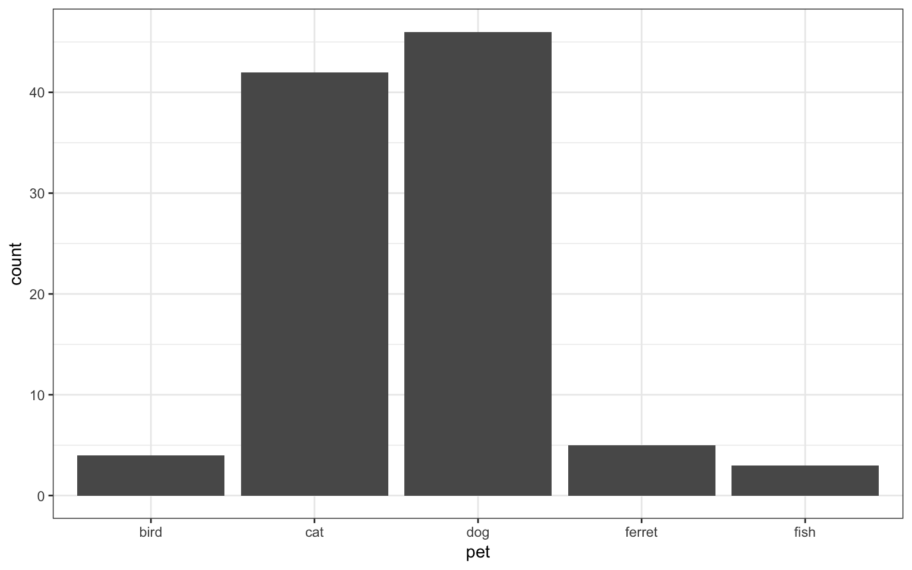
<p class="caption">(\#fig:barplot)Bar plot</p>
</div>

### Density plot
<a name="geom_density"></a>
Density plots are good for one continuous variable, but only if you have a fairly 
large number of observations.


```r
ggplot(pet_happy, aes(happiness)) +
  geom_density()
```

<div class="figure" style="text-align: center">
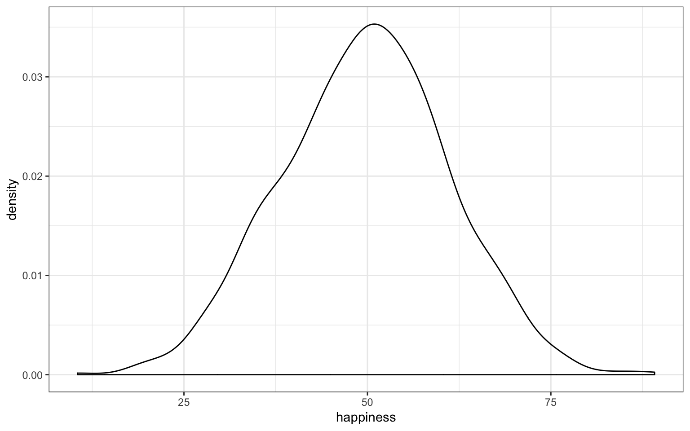
<p class="caption">(\#fig:density)Density plot</p>
</div>

You can represent subsets of a variable by assigning the category variable to 
the argument `group`, `fill`, or `color`. 


```r
ggplot(pet_happy, aes(happiness, fill = pet)) +
  geom_density(alpha = 0.5)
```

<div class="figure" style="text-align: center">
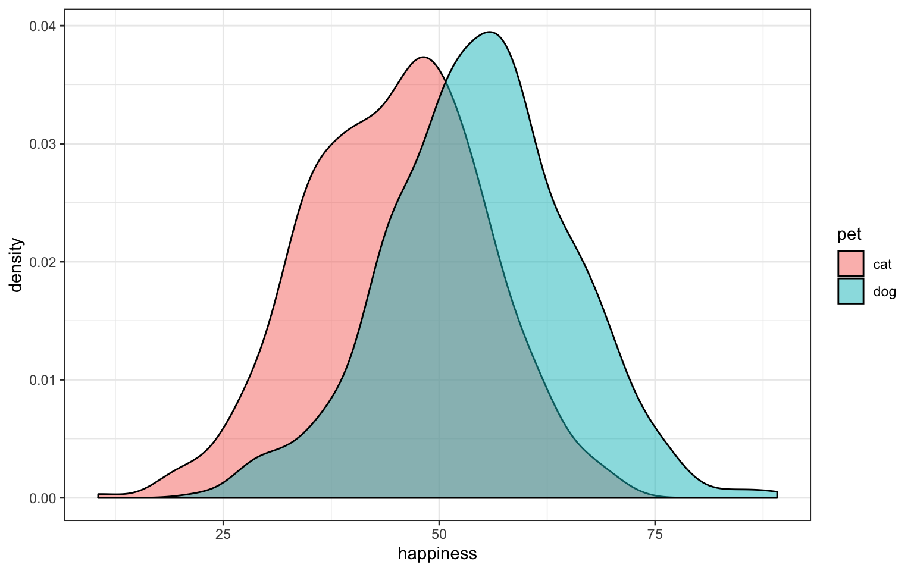
<p class="caption">(\#fig:density-grouped)Grouped density plot</p>
</div>

<div class="try">
<p>Try changing the <code>alpha</code> argument to figure out what it does.</p>
</div>

### Frequency Polygons {#geom_freqpoly}

If you don't want smoothed distributions, try `geom_freqpoly()`.


```r
ggplot(pet_happy, aes(happiness, color = pet)) +
  geom_freqpoly(binwidth = 1)
```

<div class="figure" style="text-align: center">

<p class="caption">(\#fig:freqpoly)Frequency ploygon plot</p>
</div>

<div class="try">
<p>Try changing the <code>binwidth</code> argument to 5 and 0.1. How do you figure out the right value?</p>
</div>

### Histogram {#geom_histogram}

Histograms are also good for one continuous variable, and work well if you don't have many observations. Set the `binwidth` to control how wide each bar is.


```r
ggplot(pet_happy, aes(happiness)) +
  geom_histogram(binwidth = 1, fill = "white", color = "black")
```

<div class="figure" style="text-align: center">
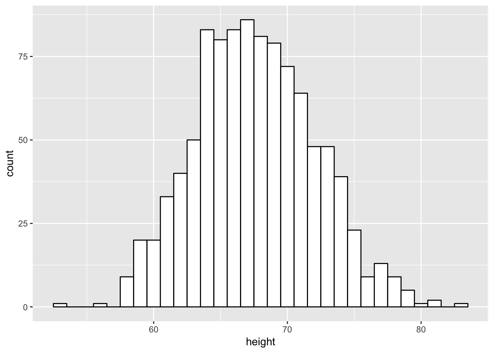
<p class="caption">(\#fig:histogram)Histogram</p>
</div>

<div class="info">
<p>Histograms in ggplot look pretty bad unless you set the <code>fill</code> and <code>color</code>.</p>
</div>

If you show grouped histograms, you also probably want to change the default `position` argument.


```r
ggplot(pet_happy, aes(happiness, fill=pet)) +
  geom_histogram(binwidth = 1, alpha = 0.5, position = "dodge")
```

<div class="figure" style="text-align: center">
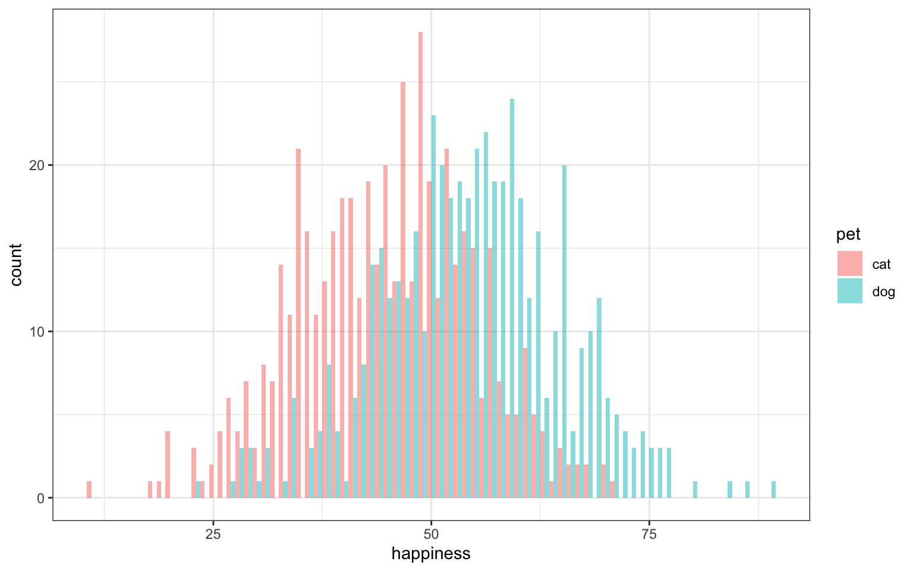
<p class="caption">(\#fig:histogram-grouped)Grouped Histogram</p>
</div>

<div class="try">
<p>Try changing the <code>position</code> argument to “identity”, “fill”, “dodge”, or “stack”.</p>
</div>

### Column plot {#geom_col}

Column plots are the worst way to represent grouped continuous data, but also one of the most common.

To make column plots with error bars, you first need to calculate the means, error bar uper limits (`ymax`) and error bar lower limits (`ymin`) for each category. You'll learn more about how to use the code below in the next two lessons.


```r
# calculate mean and SD for each pet
pet_happy %>%
  group_by(pet) %>%
  summarise(
    mean = mean(happiness),
    sd = sd(happiness)
  ) %>%
ggplot(aes(pet, mean, fill=pet)) +
  geom_col(alpha = 0.5) +
  geom_errorbar(aes(ymin = mean - sd, ymax = mean + sd), width = 0.25) +
  geom_hline(yintercept = 40)
```

<div class="figure" style="text-align: center">
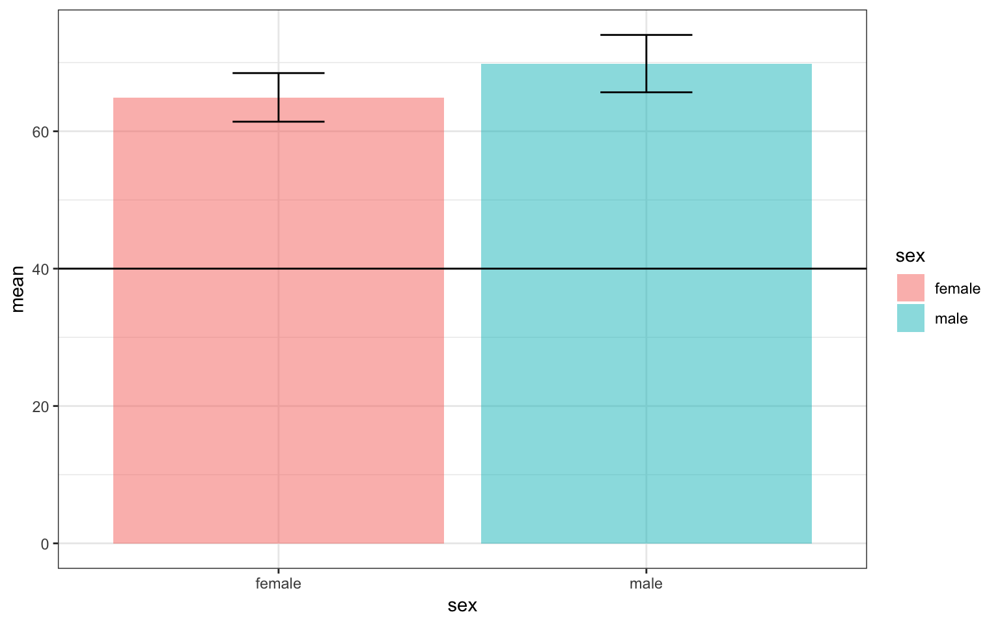
<p class="caption">(\#fig:colplot)Column plot</p>
</div>

<div class="try">
<p>What do you think <code>geom_hline()</code> does?</p>
</div>

### Boxplot {#geom_boxplot}

Boxplots are great for representing the distribution of grouped continuous 
variables. They fix most of the problems with using barplots for continuous data.


```r
ggplot(pet_happy, aes(pet, happiness, fill=pet)) +
  geom_boxplot(alpha = 0.5)
```

<div class="figure" style="text-align: center">
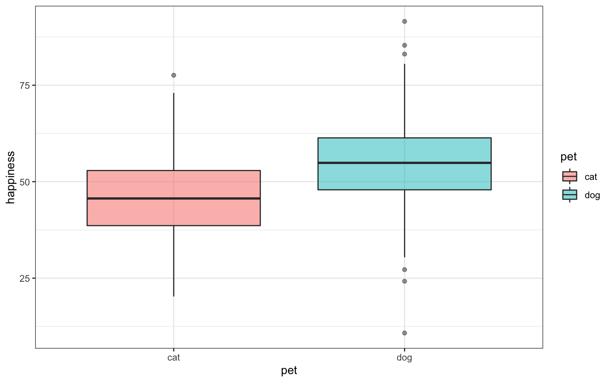
<p class="caption">(\#fig:boxplot)Box plot</p>
</div>

### Violin plot {#geom_violin}

Violin pots are like sideways, mirrored density plots. They give even more information than a boxplot about distribution and are especially useful when you have non-normal distributions.


```r
ggplot(pet_happy, aes(pet, happiness, fill=pet)) +
  geom_violin(
    trim = FALSE,
    draw_quantiles = c(0.25, 0.5, 0.75), 
    alpha = 0.5
  )
```

<div class="figure" style="text-align: center">
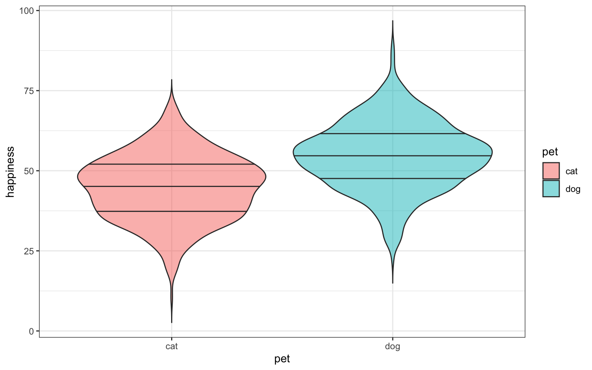
<p class="caption">(\#fig:violin)Violin plot</p>
</div>

<div class="try">
<p>Try changing the numbers in the <code>draw_quantiles</code> argument.</p>
</div>


### Scatter plot {#geom_point}

Scatter plots are a good way to represent the relationship between two continuous variables.


```r
ggplot(x_vs_y, aes(x, y)) +
  geom_point()
```

<div class="figure" style="text-align: center">
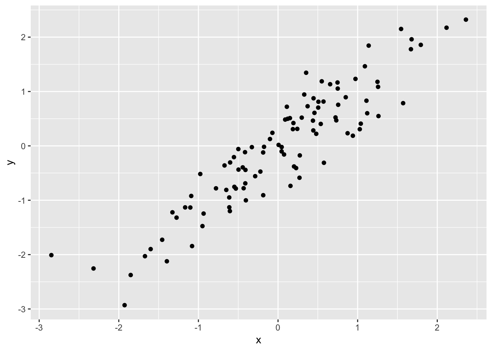
<p class="caption">(\#fig:scatter)Scatter plot using geom_point()</p>
</div>

### Line graph {#geom_smooth}

You often want to represent the relationship as a single line.


```r
ggplot(x_vs_y, aes(x, y)) +
  geom_smooth(method="lm")
```

<div class="figure" style="text-align: center">
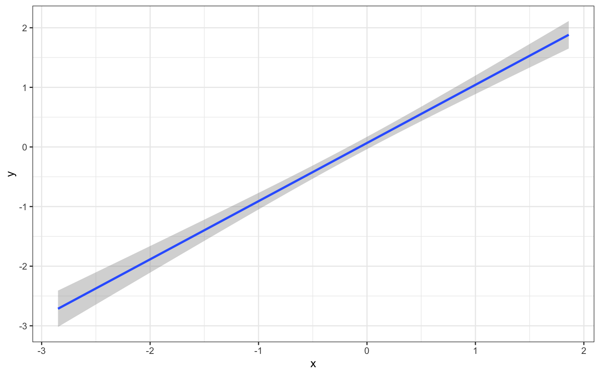
<p class="caption">(\#fig:line)Line plot using geom_smooth()</p>
</div>
 
 
## Save as File
<a name="ggsave"></a>
You can save a ggplot using `ggsave()`. It saves the last ggplot you made, 
by default, but you can specify which plot you want to save if you assigned that 
plot to a variable.

You can set the `width` and `height` of your plot. The default units are inches, 
but you can change the `units` argument to "in", "cm", or "mm".


```r
box <- ggplot(pet_happy, aes(pet, happiness, fill=pet)) +
  geom_boxplot(alpha = 0.5)

violin <- ggplot(pet_happy, aes(pet, happiness, fill=pet)) +
  geom_violin(alpha = 0.5)

ggsave("demog_violin_plot.png", width = 5, height = 7)

ggsave("demog_box_plot.jpg", plot = box, width = 5, height = 7)
```


## Combination Plots

### Violinbox plot

To demonstrate the use of `facet_grid()` for factorial designs, we create a new 
column called `agegroup` to split the data into participants older than the 
meadian age or younger than the median age. New factors will display in alphabetical order, so we can use the `factor()` function to set the levels in the order we want.


```r
pet_happy %>%
  mutate(agegroup = ifelse(age<median(age), "Younger", "Older"),
         agegroup = factor(agegroup, levels = c("Younger", "Older"))) %>%
  ggplot(aes(pet, happiness, fill=pet)) +
    geom_violin(trim = FALSE, alpha=0.5, show.legend = FALSE) +
    geom_boxplot(width = 0.25, fill="white") +
    facet_grid(.~agegroup) +
    scale_fill_manual(values = c("orange", "green"))
```

<div class="figure" style="text-align: center">
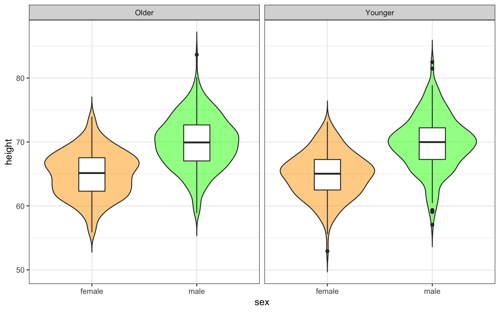
<p class="caption">(\#fig:violinbox)Violin-box plot</p>
</div>

<div class="info">
<p>Set the <code>show.legend</code> argument to <code>FALSE</code> to hide the legend. We do this here because the x-axis already labels the pet types.</p>
</div>

### Violin-point-range plot

You can use `stat_summary()` to superimpose a point-range plot showning the mean ± 1 SD. You'll learn how to write your own functions in the lesson on [Iteration and Functions](#func).


```r
ggplot(pet_happy, aes(pet, happiness, fill=pet)) +
  geom_violin(
    trim = FALSE,
    alpha = 0.5
  ) +
  stat_summary(
    fun.y = mean,
    fun.ymax = function(x) {mean(x) + sd(x)},
    fun.ymin = function(x) {mean(x) - sd(x)},
    geom="pointrange"
  )
```

<div class="figure" style="text-align: center">

<p class="caption">(\#fig:stat-summary)Point-range plot using stat_summary()</p>
</div>

### Violin-jitter plot

If you don't have a lot of data points, it's good to represent them individually. 
You can use `geom_point` to do this, setting `position` to "jitter".


```r
pet_happy %>%
  sample_n(50) %>%  # choose 50 random observations from the dataset
  ggplot(aes(pet, happiness, fill=pet)) +
  geom_violin(
    trim = FALSE,
    draw_quantiles = c(0.25, 0.5, 0.75), 
    alpha = 0.5
  ) + 
  geom_point(position = "jitter", alpha = 0.7, size = 3)
```

<div class="figure" style="text-align: center">
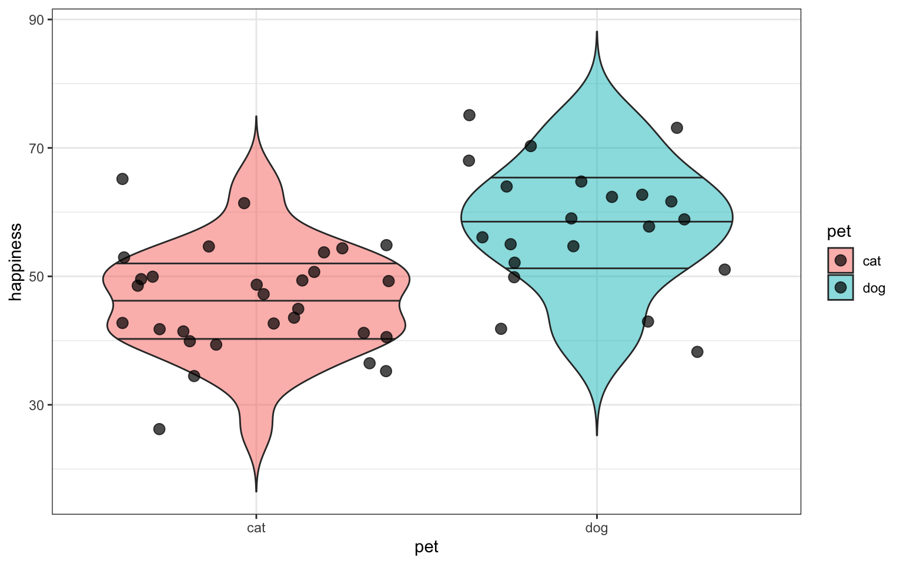
<p class="caption">(\#fig:violin-jitter)Violin-jitter plot</p>
</div>

### Scatter-line graph

If your graph isn't too complicated, it's good to also show the individual data 
points behind the line.


```r
ggplot(x_vs_y, aes(x, y)) +
  geom_point(alpha = 0.25) +
  geom_smooth(method="lm")
```

<div class="figure" style="text-align: center">
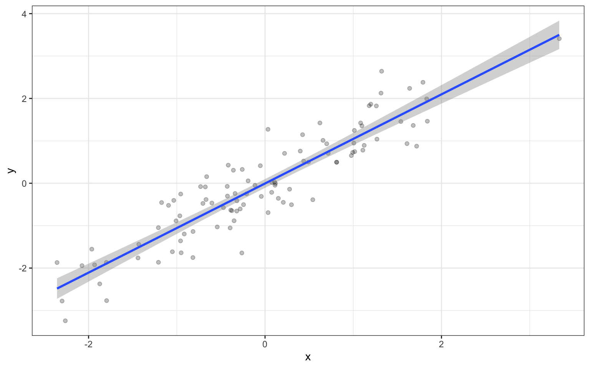
<p class="caption">(\#fig:scatter_line)Scatter-line plot</p>
</div>

### Grid of plots {#cowplot}

You can use the [ `cowplot`](https://cran.r-project.org/web/packages/cowplot/vignettes/introduction.html) package to easily make grids of different graphs. First, you have to assign each plot a name. Then you list all the plots as the first arguments of `plot_grid()` and provide a list of labels.


```r
library(cowplot)

my_hist <- ggplot(pet_happy, aes(happiness, fill=pet)) +
  geom_histogram(
    binwidth = 1, 
    alpha = 0.5, 
    position = "dodge", 
    show.legend = FALSE
  )

my_violin <- ggplot(pet_happy, aes(pet, happiness, fill=pet)) +
  geom_violin(
    trim = FALSE,
    draw_quantiles = c(0.5), 
    alpha = 0.5, 
    show.legend = FALSE
  )

my_box <- ggplot(pet_happy, aes(pet, happiness, fill=pet)) +
  geom_boxplot(alpha=0.5, show.legend = FALSE)

my_density <- ggplot(pet_happy, aes(happiness, fill=pet)) +
  geom_density(alpha=0.5, show.legend = FALSE)

my_bar <- pet_happy %>%
  group_by(pet) %>%
  summarise(
    mean = mean(happiness),
    sd = sd(happiness)
  ) %>%
  ggplot(aes(pet, mean, fill=pet)) +
    geom_bar(stat="identity", alpha = 0.5, show.legend = FALSE) +
    geom_errorbar(aes(ymin = mean - sd, ymax = mean + sd), width = 0.25)

plot_grid(
  my_violin, 
  my_box, 
  my_density, 
  my_bar, 
  labels = c("A", "B", "C", "D")
)
```

<div class="figure" style="text-align: center">
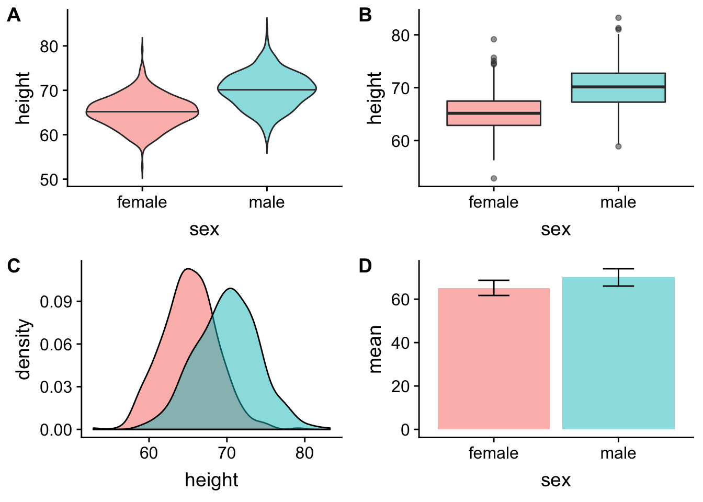
<p class="caption">(\#fig:cowplot)Grid of plots using cowplot</p>
</div>

<div class="info">
<p>{#theme} Once you load the cowplot package, your ggplot default theme will change. You can get back the default ggplot theme with <code>+ theme_set(theme_grey())</code>.</p>
</div>

## Overlapping Data {#overlap}

### Discrete Data 

You can deal with overlapping data points (very common if you're using Likert scales) by reducing the opacity of the points. You need to use trial and error to adjust these so they look right.


```r
ggplot(overlap, aes(x, y)) +
  geom_point(size = 5, alpha = .05) +
  geom_smooth(method="lm")
```

<div class="figure" style="text-align: center">
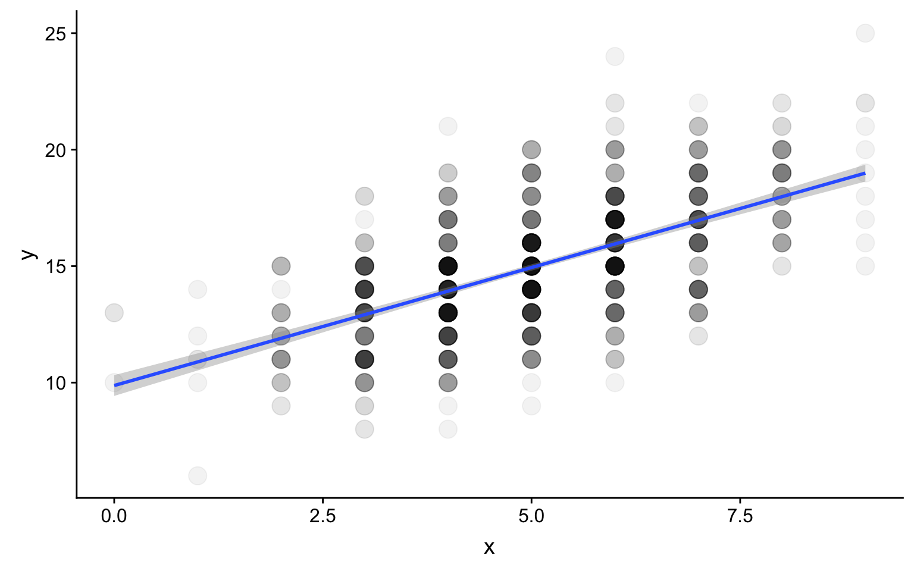
<p class="caption">(\#fig:overlap_alpha)Deal with overlapping data using transparency</p>
</div>

{#geom_count}
Or you can set the size of the dot proportional to the number of overlapping 
observations using `geom_count()`.


```r
overlap %>%
  ggplot(aes(x, y)) +
  geom_count(color = "#663399")
```

<div class="figure" style="text-align: center">
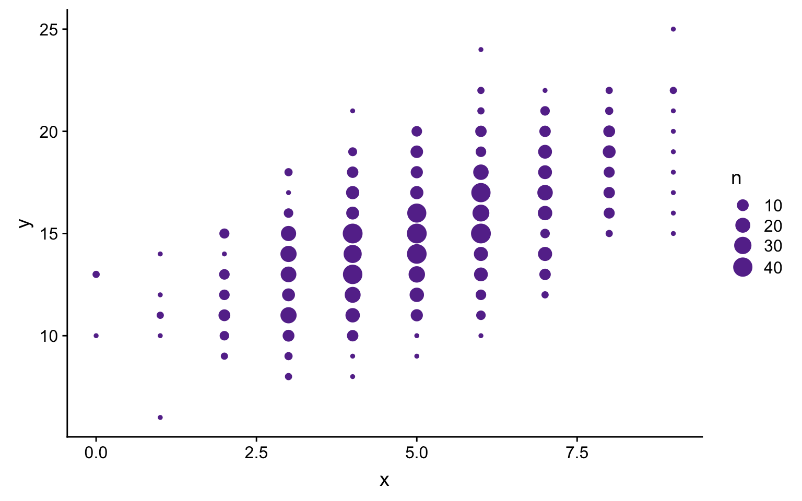
<p class="caption">(\#fig:overlap_size)Deal with overlapping data using geom_count()</p>
</div>

Alternatively, you can transform your data to create a count column and use the 
count to set the dot colour.


```r
overlap %>%
  group_by(x, y) %>%
  summarise(count = n()) %>%
  ggplot(aes(x, y, color=count)) +
  geom_point(size = 5) +
  scale_color_viridis()
```

<div class="figure" style="text-align: center">
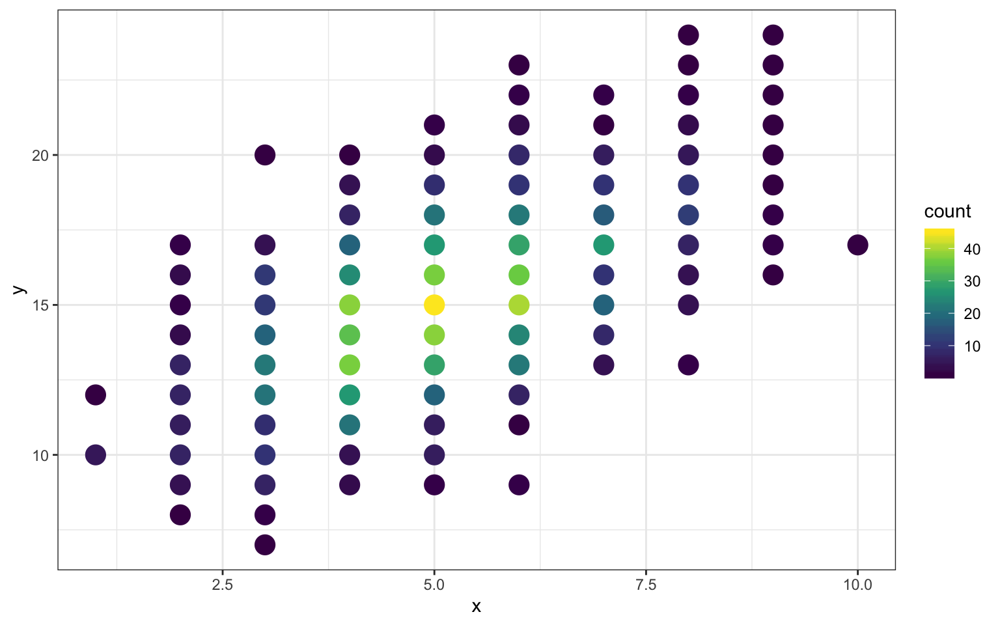
<p class="caption">(\#fig:overlap-colour)Deal with overlapping data using dot colour</p>
</div>

### Colours {#viridis}

The [viridis package](https://cran.r-project.org/web/packages/viridis/vignettes/intro-to-viridis.html) 
changes the colour themes to be easier to read by people with colourblindness 
and to print better in greyscale. Use `scale_color_viridis()` to set the colour 
palette and `scale_fill_viridis()` to set the fill palette in ggplot. If you need 
discrete (as opposed to continuous) colours, use `scale_color_viridis(discrete=TRUE)` 
or `scale_fill_viridis(discrete=TRUE)` instead. 


<div class="info">
<p>The newest version of <code>ggplot2</code> v3.0.0 has viridis built in. It uses <code>scale_colour_viridis_c()</code> and <code>scale_fill_viridis_c()</code> for continuous variables and <code>scale_colour_viridis_d()</code> and <code>scale_fill_viridis_d()</code> for discrete variables.</p>
</div>

### Continuous Data

Even if the variables are continuous, overplotting might obscure any relationships 
if you have lots of data.


```r
overplot %>%
  ggplot(aes(x, y)) + 
  geom_point()
```

<div class="figure" style="text-align: center">

<p class="caption">(\#fig:overplot-point)Overplotted data</p>
</div>

{#geom_density2d}
Use `geom_density2d()` to create a contour map.


```r
overplot %>%
  ggplot(aes(x, y)) + 
  geom_density2d()
```

<div class="figure" style="text-align: center">
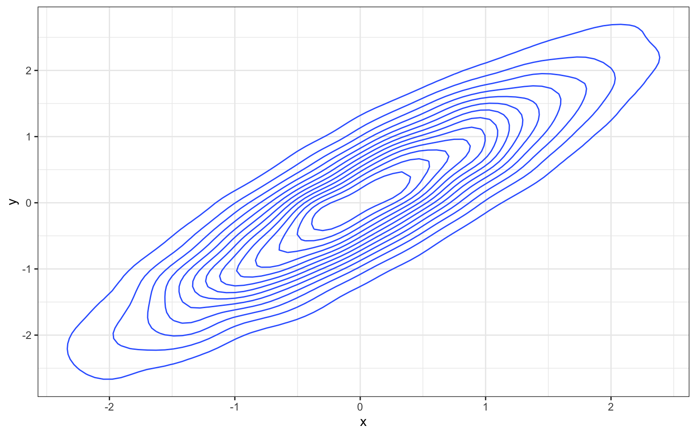
<p class="caption">(\#fig:density2d)Contour map with geom_density2d()</p>
</div>

You can use `stat_density_2d(aes(fill = ..level..), geom = "polygon")` to create 
a heatmap-style density plot. 


```r
overplot %>%
  ggplot(aes(x, y)) + 
  stat_density_2d(aes(fill = ..level..), geom = "polygon") +
  scale_fill_viridis()
```

<div class="figure" style="text-align: center">
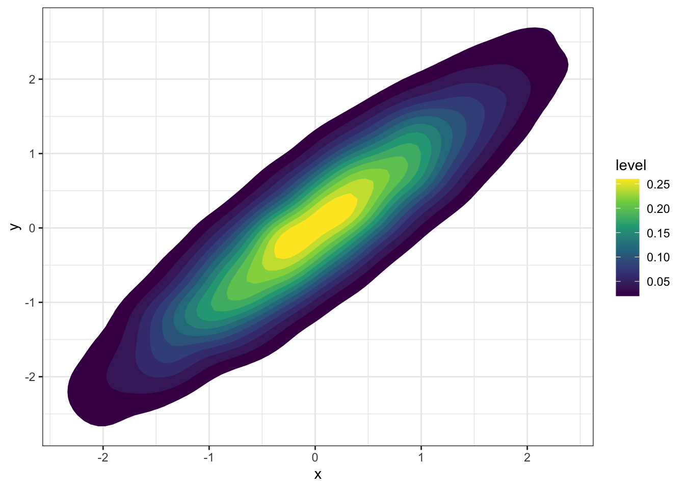
<p class="caption">(\#fig:density2d-fill)Heatmap-density plot</p>
</div>


{#geom_bin2d}
Use `geom_bin2d()` to create a rectangular heatmap of bin counts. Set the 
`binwidth` to the x and y dimensions to capture in each box.


```r
overplot %>%
  ggplot(aes(x, y)) + 
  geom_bin2d(binwidth = c(1,1))
```

<div class="figure" style="text-align: center">
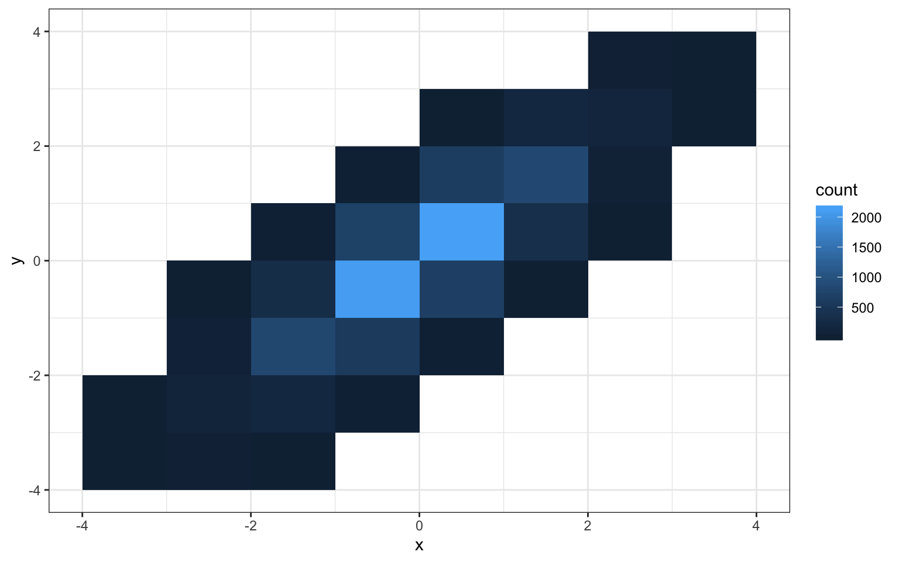
<p class="caption">(\#fig:bin2d)Heatmap of bin counts</p>
</div>

{#geom_hex}
Use `geomhex()` to create a hexagonal heatmap of bin counts. Adjust the 
`binwidth`, `xlim()`, `ylim()` and/or the figure dimensions to make the hexagons 
more or less stretched.


```r
overplot %>%
  ggplot(aes(x, y)) + 
  geom_hex(binwidth = c(0.25, 0.25))
```

<div class="figure" style="text-align: center">
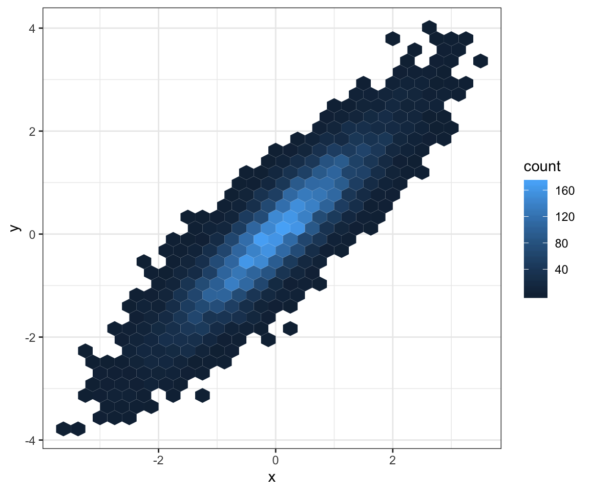
<p class="caption">(\#fig:overplot-hex)Hexagonal heatmap of bin counts</p>
</div>

## Heat map {#geom_tile}

I've included the code for creating a correlation matrix from a table of variables, 
but you don't need to understand how this is done yet. We'll cover `mutate` and 
`gather` functions in the `dplyr` and `tidyr` lessons.


```r
# generate two sets of correlated variables (a and b)
heatmap <- tibble(
  a1 = rnorm(100),
  b1 = rnorm(100)
) %>% 
mutate(
  a2 = a1 + rnorm(100),
  a3 = a1 + rnorm(100),
  a4 = a1 + rnorm(100),
  b2 = b1 + rnorm(100),
  b3 = b1 + rnorm(100),
  b4 = b1 + rnorm(100)
) %>%
cor() %>% # create the correlation matrix
as.data.frame() %>% # make it a data frame
rownames_to_column(var = "V1") %>% # set rownames as V1
gather("V2", "r", a1:b4) # wide to long (V2)
```

Once you have a correlation matrix in the correct (long) format, it's easy to 
make a heatmap using `geom_tile()`.


```r
ggplot(heatmap, aes(V1, V2, fill=r)) +
  geom_tile() +
  scale_fill_viridis()
```

<div class="figure" style="text-align: center">
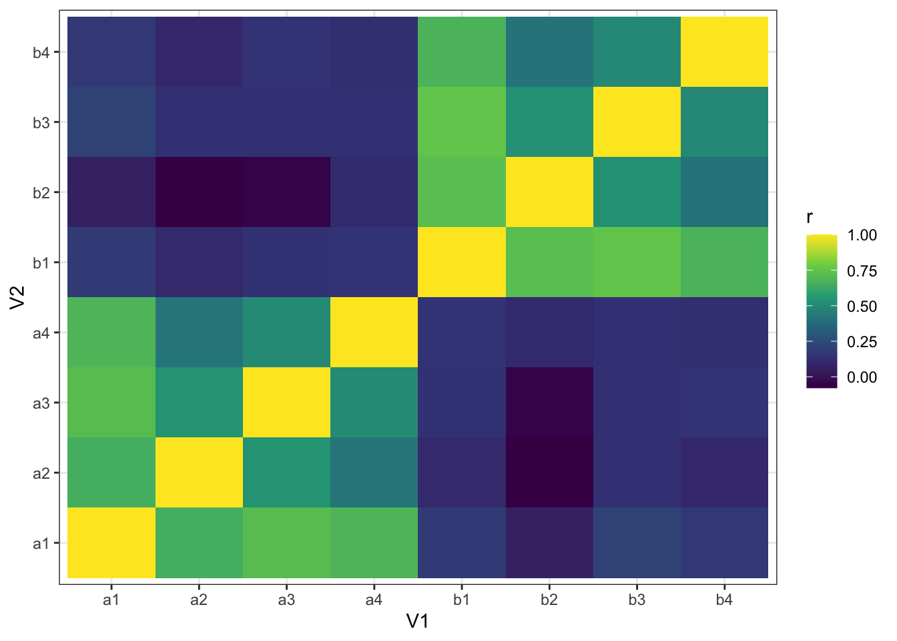
<p class="caption">(\#fig:heatmap)Heatmap using geom_tile()</p>
</div>

<div class="info">
<p>The file type is set from the filename suffix, or by specifying the argument <code>device</code>, which can take the following values: “eps”, “ps”, “tex”, “pdf”, “jpeg”, “tiff”, “png”, “bmp”, “svg” or “wmf”.</p>
</div>

## Interactive Plots {#plotly}

You can use the `plotly` package to make interactive graphs. Just assign your 
ggplot to a variable and use the function `ggplotly()`.


```r
demog_plot <- ggplot(pet_happy, aes(pet, happiness, fill=pet)) +
  geom_point(position = position_jitter(width= 0.2, height = 0), size = 2)

ggplotly(demog_plot)
```

<div class="figure" style="text-align: center">
<!--html_preserve--><div id="htmlwidget-2b43e495a671b6c6ffff" style="width:100%;height:480px;" class="plotly html-widget"></div>
<script type="application/json" data-for="htmlwidget-2b43e495a671b6c6ffff">{"x":{"data":[{"x":[0.913345659058541,0.853786632604897,0.820672192424536,1.10026619741693,1.0177942677401,1.1857450527139,0.999181847739965,0.940961317252368,0.814978234283626,1.16600802019238,0.841851714905351,1.10932171279564,0.911560460273176,0.895446693710983,0.941342350840568,0.899077963363379,1.13919859779999,0.81449818406254,0.860112079512328,0.841767915245146,0.969697839673609,1.05522834416479,0.975208107102662,0.959147005714476,0.851541999727488,0.937637502141297,0.810416898597032,1.13721916982904,0.908628197666258,0.935590413399041,1.06756537239999,0.963492140360177,0.93004182362929,1.01278723170981,0.838144927844405,1.17688325354829,0.893945740070194,1.1973317806609,0.953116618189961,0.888208016101271,0.803620818257332,0.921736594196409,0.925264354981482,0.895990377571434,0.925722462497652,0.977697897329927,0.983781917206943,0.987435768730938,1.15936023583636,1.18125108741224,1.11685725459829,1.1746023427695,0.811755937151611,1.00707243336365,1.0281189950183,0.969881286006421,0.980621138773859,0.914233186934143,1.07787510911003,1.07841565646231,1.0044213347137,1.17096027489752,1.02926320387051,1.0740272260271,1.09155458537862,1.14403428798541,1.01950942045078,0.80206302003935,1.11630551880226,1.02411709083244,1.12682688254863,1.00402452610433,0.980926157161593,0.987306695245206,0.927539690677077,1.0758384084329,0.946707657445222,1.05433600954711,0.838116930890828,1.15281239580363,1.05741313537583,1.00281071551144,0.867544848751277,0.995371078792959,1.08633414404467,1.14417953407392,1.17880060309544,0.995591110084206,0.88195688482374,0.983361985068768,1.17160977935418,1.09342354284599,1.16943864980713,1.18565697828308,0.953636947460473,1.0800392717123,1.07719990750775,0.93460392896086,0.996909142844379,1.01397259468213,0.998598030209541,1.02918992862105,0.923134746588767,0.896063756104559,0.90661488417536,1.01062894370407,0.974564735032618,1.14204398747534,1.05095030954108,1.06610728669912,0.819352945126593,0.992366068810224,0.968642126303166,1.19136104667559,0.903321899287403,1.18123594922945,0.994390387367457,1.10234997319058,1.04932968178764,1.15616783583537,0.855701330024749,1.01708091944456,0.882084690127522,0.903166019078344,0.865157249756157,1.17149907313287,0.992748411837965,0.902919681742787,1.00144778126851,1.18673519743606,0.941962608788163,1.13233135426417,1.12589364564046,1.08888592347503,1.18925282526761,0.998513033427298,1.03894713670015,0.887726229708642,0.881125016417354,0.884509591944516,0.966871818341315,0.94232322005555,1.12446556920186,0.805945878755301,0.815219991002232,0.834551027789712,1.12523272670805,0.952801116276532,0.926756650581956,1.06761971255764,1.16910837208852,0.843420791160315,0.949502661172301,0.944717276562005,1.04917859444395,1.04009661078453,1.1522075753659,1.02545212870464,1.02869429253042,1.1367811575532,0.844339963234961,1.14963103281334,0.844132317509502,1.07352083055303,1.05457685431465,0.961620214954019,0.813167862873524,1.08676562448964,0.832782030291855,1.05681004915386,0.974185419920832,0.899948413576931,1.13000461179763,0.843839180842042,1.07504270439968,1.14621991831809,0.849711856618524,1.15326089281589,1.12689164439216,0.856237426307052,1.07488146889955,1.11333540836349,1.19111755462363,0.969609829038382,0.895713254623115,0.948655118048191,1.19381612520665,0.880250062886626,1.09780588624999,1.03608009004965,0.820838908385485,1.10072882445529,0.914032846968621,0.806795748323202,0.89984555253759,0.86823060894385,1.18949831016362,0.96406049542129,1.13719158712775,1.0863236611709,0.911484634503722,1.19565525371581,0.851628408487886,1.1154283862561,1.08901839917526,1.1228224071674,0.86287893736735,0.912193358130753,0.822826535906643,1.01058609103784,1.19003356676549,0.911489011161029,1.08115095105022,0.961005721054971,0.982429705467075,1.15890008844435,0.884093526378274,1.16471055783331,1.08798523619771,1.00521514602005,1.1251109842211,1.17333262292668,1.1786835424602,1.04452816303819,1.06432529594749,1.05655461652204,0.980542487185448,1.00250107161701,0.897324968408793,1.05994825717062,0.897478183638304,0.89076075302437,1.09702980788425,1.04433225374669,1.06259067412466,0.845819622650743,0.964973525237292,1.14264385160059,0.840864361729473,0.934998320322484,0.832648725062609,1.03194216331467,1.05068810768425,1.15200570635498,0.881358423363417,1.11941603384912,0.8322839345783,0.992647852282971,0.950088815484196,0.874296851549298,0.973090464901179,0.980916528310627,1.07297751447186,1.17470914702863,0.885815799143165,0.934502813313156,0.980576782114804,1.10594528084621,1.0419471652247,0.854433612059802,0.843138491082936,1.13942240905017,0.871137152519077,0.842785023804754,1.09832338746637,0.928398552630097,1.17581879161298,0.935379046946764,1.15365147897974,1.09833603678271,1.17371908500791,0.889548466261476,1.12576879225671,1.09404748380184,1.06013634707779,0.970515472441912,0.805347588285804,0.994223243091255,1.09383916798979,1.04923502793536,1.07537384834141,0.8901846264489,0.836604102887213,0.910204124636948,1.09915003525093,0.849611767102033,0.875185476243496,0.806194893736392,0.922359580174088,0.977931684907526,0.856808248534799,1.11000309800729,1.12606862317771,1.0103002583608,0.899787168949842,1.18641312783584,1.00117850871757,1.0027162774466,0.848302653245628,1.15856484016404,0.887316955905408,1.00223416583613,1.19365233154967,0.885189702920616,0.872543961275369,1.08608819497749,0.980486152041703,0.925399068184197,0.948743261396885,0.801595161668956,0.837015316821635,1.01172290593386,1.05180759727955,1.08702791426331,1.16205737031996,1.04756504185498,1.0012414871715,1.10115506937727,1.1985950906761,1.15540881259367,0.941347172018141,0.808799796178937,0.950698157586157,1.06537897465751,1.17077021803707,1.00505689419806,1.02131916461512,0.964893751684576,1.05972489872947,0.822105969581753,0.986978577263653,0.920397633221,1.13331359019503,1.03235702905804,1.03166691176593,0.90930499183014,1.0386120130308,0.874214595649391,0.848128409311175,1.18321937229484,0.850335482973605,0.804749609250575,1.06648772805929,1.09674631254748,0.846115796081722,0.979442666750401,1.01992274848744,1.19871758865193,0.89768451359123,0.929526131972671,1.11324213212356,0.821831537317485,0.977501395624131,1.03542881282046,0.845901431329548,0.859898219443858,1.08164747431874,1.19803048036993,0.891082397289574,0.85089897075668,0.864971607271582,1.1564822521992,1.17105678161606,0.979323827475309,1.08066604500636,1.19931458393112,0.890338615514338,0.840567909181118,1.06829455485567,1.13698526928201,0.800524677895009,0.906745234783739,1.0088702022098,1.19726841878146,0.993466301448643,1.08209210429341,1.19330907640979,0.983285837620497,1.12061250610277,0.981533405650407,1.19741137875244,0.911806063912809,0.852260282635689,0.847938697692007,1.12997423289344,1.04552223477513,0.95948498910293,1.12048098379746,1.16695497538894,0.803437617514282,1.19190793363377,0.983755665365607,1.12637943290174,1.10332454480231,0.953883864637464,1.10902114985511,1.19426683122292,1.02824706807733,1.1957569972612,1.01681677261367,0.92348940661177,1.19691599830985,0.884864936955273,0.809490008000284,1.13475684979931,1.18381780115888,0.97736372705549,0.985949261952192,1.04995450675488,0.902429499197751,1.04350336110219,1.16591552523896,0.942103032767773,0.882508965488523,0.8949004647322,1.15395984183997,0.839023113250732,1.07738479468971,1.02660291995853,1.03925322107971,1.10178935136646,0.802703589573503,1.0617524953559,1.0071737954393,0.931437874026597,1.18274097871035,1.16342923715711,1.13748251460493,1.17214378286153,1.11951362984255,0.858442255295813,1.08464425532147,1.04764646133408,1.12689960431308,1.11889301883057,1.06396914860234,0.869934334140271,0.994547933340073,1.12610366474837,0.873204831965268,1.11346188560128,1.08799470243976,1.00582357738167,0.955071289185435,1.00831449432299,0.826334930583835,1.11488543599844,1.11641942430288,0.842184168752283,1.06996333124116,1.1424141167663,0.914255424309522,0.969768672715873,0.903550893440843,0.811711907945573,0.871834960766137,1.10796413002536,1.07999501619488,0.837742129061371,1.19931739922613,1.19237738130614,0.848288268595934,0.972217650897801,0.957646009139717,0.927465804014355,0.813103773258626,0.931021913513541,0.995839063078165,0.853746469225734,0.898509580083191,0.936669346224517,1.11165075702593,0.886147782299668,0.993313642125577,1.01742724357173,0.997988818120211,1.07569074546918,0.905675943382084,0.949734910018742,1.1107237114571,1.07141174860299,0.833209414593875,1.18117281543091,1.15817324919626,1.01623030286282,1.1104665751569,1.01250170990825,0.830713830515742,0.852034683991224,0.80390895716846,1.16872103316709,0.956224766466767,1.13994264630601,0.810144679807127,0.900912391487509,0.973220220021904,1.07977409856394,1.16571531984955,1.17750804116949,1.13159820996225],"y":[60.3993280066307,49.2667100359068,34.7373150587626,38.0969299607942,35.4608618080806,27.443840550856,52.7817560629419,44.4100312282574,52.064191565187,41.8044626044599,36.7300048370598,43.3783313466196,45.1331971856659,56.2342648416459,52.2488255775302,48.8210511756453,43.2713595932256,35.2412096280491,49.5710135576596,39.0167596756483,29.2886146685041,52.3914173792665,44.1979032474844,39.680927120387,39.695613213488,62.6617741542459,22.6900234379969,48.1061101489791,32.6470030557595,42.6095381058337,54.3639103930888,50.4392692635615,53.7239685363019,36.4958707277974,28.3368608272945,53.2904687400854,36.1127951963015,51.8221858146293,41.841944242869,40.1308751742365,55.4506505812835,45.6000187871616,56.365227781681,34.8643007137864,38.7941255724361,30.746857379052,38.4741505005692,41.0788532196054,53.5343863300021,43.9661977467601,35.4711865899145,52.7869585072184,43.4642959977675,42.9646645825706,46.1317885772672,39.3358299096807,70.5419164043442,38.195800117911,48.5337200652751,31.4078750602784,44.9247682058076,23.1852918206532,39.8971910625548,27.3816260306648,45.2732650663814,42.1732178269696,33.1326909321794,46.0352972943087,53.9565339093827,28.728528415682,48.6660600388131,39.4056015459669,30.9415210734523,42.8293644398869,69.966007633469,54.915905310827,33.7492338476271,52.0907512994934,35.084151546317,50.3638991653688,27.0508757988724,42.7723628364182,26.1504192872447,61.4694494352894,31.2746151451934,32.5041583668473,46.6874276783147,50.4155201366602,41.1434734534287,38.3155756310512,47.0913400541438,42.6435992584207,33.6413265474556,49.849165039003,50.1754101552753,44.7268247217641,57.2010928009836,46.5903377921905,45.9092532164111,33.137221206566,46.60860139302,39.803850775435,22.7447982454816,43.5662971521192,35.2252857114441,39.4871293892635,57.8200312230075,53.026420980964,49.3718171363503,44.1219122729724,40.6416201324869,55.7385939172115,51.852308153523,37.6805792519171,57.532314902201,39.6954707542916,63.6750737139838,58.238358550923,55.223172005873,50.6772471709537,52.9695710186909,53.5339911018815,39.2431611396813,50.9700669537192,54.663628834748,43.1539184094119,34.0135863754004,39.9540220880905,40.6038532701086,46.6267949604233,31.1022341977419,44.3877854521197,49.0663445572714,43.6680930637592,45.7467468986868,32.9261500311108,36.7756299068114,36.2125975724898,57.0605023362674,46.2804718070735,35.6443212888235,39.5431298453103,62.1702012655048,48.8606543115372,55.0237536267771,20.3203328286924,54.3653078766447,62.5686391419205,62.0189217325641,38.8065642442733,24.5829925642457,44.758911235609,40.0621370565975,61.0450170287896,42.7502760116194,35.2790100522264,32.432990361585,49.9122904067591,32.673616797514,53.7738127556185,52.8282700703643,57.1760435691106,49.3749339902623,38.5473869781206,57.3779001160055,56.867901906301,36.6466147777927,41.4137819123776,37.9289477879458,66.7467456799918,20.3173460887404,49.5543013182208,65.1745882461388,51.6037823509041,36.2172531174204,35.7457065734808,49.1580428306545,38.029500534089,65.6420826735047,48.8978542571243,50.2195108342318,60.1082794928997,41.3767271321878,50.3408013314174,31.8118613963602,64.9499291967642,56.9922592600061,50.7007745768031,35.4253683036422,52.6297811098446,56.566529876338,68.0479432594656,49.6311876928602,47.7799724786416,35.5325913330884,53.3887542557687,51.8764523948377,52.59154810075,49.2161084194506,44.2204145568143,46.3301119367127,56.8134481014827,44.7867912318673,48.6315224374632,29.0118957312494,56.7390164102888,48.6913315488343,40.6434827162433,35.7152337199804,40.5961313072751,52.3338189879067,47.1487508517656,26.2288021803948,44.5985640612223,36.6719636174612,51.8534913041066,29.1428263841762,56.4188099846927,55.2908693199433,49.9238147048733,29.7862837586801,47.4314052699643,44.8179403148933,61.4618770669307,33.0675970853126,45.1614028568659,49.4148486286225,46.9009394640069,48.4811269640229,45.9678568644516,34.6930595273765,54.8563351701483,47.2294320621391,32.7610161821541,34.6625381014065,46.1443344557659,33.738844824203,35.7550573153216,34.517194840898,54.9843659464185,25.8866683248673,35.1115650653384,39.3823771938714,27.0352395366638,61.6837531551471,49.8695315101,40.0764505050765,48.5190047521606,37.4699518477432,47.2203593247533,58.4382891329794,35.6808113350907,40.9657926166444,39.1878763912977,66.3478905942487,48.6953586541205,43.1832711419489,32.1797670755574,50.0295921022605,47.443277212859,45.4070996613204,39.5526743266749,35.9836119397417,29.2132885585909,56.8718970468956,51.603383326356,40.7363393026779,51.3118524055159,33.9330995994035,56.9163566403705,48.1155658213691,32.1308106578499,46.3342576631669,48.8053182645085,47.988763148162,35.2514538443331,34.4657261165,37.5592336574593,57.3615657088836,59.1379983546159,41.7521029283386,47.5113405764037,48.7250776792693,52.9387636430864,34.7036724163524,59.3725809962949,33.2492265830956,50.6493381596091,52.064644272132,45.8206417845222,49.9656274411589,47.855011619784,34.8208467430808,57.1172482717133,54.3251495339277,59.448606260069,54.7567438962455,61.3898778038518,37.8061542560391,33.6291377518115,52.3956999078296,38.4443200383352,38.0797439023975,30.8127168317824,45.0677131441527,62.7550800713326,24.2919864679202,38.5199464696713,55.0521350510207,47.3725579200492,33.1142323993484,39.994767732738,47.9516794385295,10.504433567576,55.1969572778736,36.3796858543542,48.428598034396,26.2782099654469,35.1983996133595,42.9268079443487,55.7635153202487,41.7711316226564,41.9517064362649,52.5057347463897,52.4342934456867,53.9270498018483,48.8911230788968,30.4808156143357,61.9421914694244,42.6606804256948,45.4801099204316,46.2236613657182,59.9626087614277,54.0227761288721,37.1929055801273,53.7892230740598,49.3198909984941,28.8023305921619,48.7394627598697,36.9252440005017,44.8641670833526,42.355808286339,39.7931035627251,27.910655725513,54.5807746764943,69.5222395752138,58.5895835091703,35.6212682788537,53.1169440294738,57.8679479808566,43.0970421195206,50.5851763680552,53.9264296924252,57.0098511343041,53.4268638215894,57.7807809461657,36.6758283183659,41.2118440735521,52.4864603962819,48.5468385325901,38.7207629975626,39.597796252997,48.7354567219427,59.5695956693544,46.5088219250636,54.2105694487837,37.9556962860486,40.7970365107044,49.4643775487706,47.7616322579903,41.848982188397,19.7580888011417,24.6768432684893,48.8463775026237,43.3215272658167,43.8884639379608,33.6812267187581,35.2345256983474,40.556033005468,51.0633888338615,32.0557049215034,52.7688293115804,30.5462136385644,37.2528449123518,37.9374029079879,18.8970454336767,45.1074569870246,47.6618605913915,33.2761806738953,47.47963435302,68.3177327851854,44.1531572157389,46.7385660726976,47.3401710900872,46.5331538914346,63.1315605234506,50.9101345558233,38.8885432485609,27.9217422347225,50.8263977261551,61.8163181068066,20.0071876995589,45.2553817784439,45.1264405377343,32.6177385754589,41.7773505300348,36.2089031386403,51.6981057699762,26.8323617979574,40.8547865556032,54.5401009284707,42.6298216669833,29.9558021047091,35.7947203973663,44.8199283715346,40.3564533681241,40.736985810578,39.8539469834979,44.2874674503577,43.3048486032973,46.9663029858366,57.4782013672903,49.9902616815832,46.9783885178356,60.5082181581186,47.3304678287747,41.817243610904,35.1414798505938,44.3663928596001,47.4240613451895,48.6891236690579,67.3755904445195,47.5916193849375,41.3794701603172,37.4598584331523,45.3683432068641,61.0538332418918,42.4302224401837,27.2618416510661,41.0551809694909,33.7089854243408,29.0142624653475,54.2443686213679,31.1945431590974,55.3061714289679,51.3302094225025,56.3316020196785,47.4311801146994,34.6595620937298,39.1676673531655,42.3258674246321,32.3680749948138,33.2992565054624,52.0131555271724,61.3182220289968,42.6565706451192,51.4871118359336,54.597311217949,46.0513330942068,46.6115808580833,51.2229278448706,41.2096735246771,31.6861270520315,49.0736796757223,37.0556299100102,46.9071541059917,43.9709566220546,50.2721048219094,45.306000478453,52.1667542717486,34.4988481714802,59.2156356684168,52.2255143514066,59.8491096027461,60.8421528825248,35.2822924327677,38.9499492364794,65.2581273003663,57.6411164080705,39.6135528278724,47.8440034487432,50.2536288844081,33.0084162903286,54.4007789193104,51.9838998638635,46.6866235526079,39.1609336884501,28.4668416283945,52.4949442387485,36.4892691465745,60.8447348284863,49.2711549403046,33.5466843167384,53.6115322546255,18.0548034069717,40.2110191687923,42.6097785565208,43.5414322925327,50.4547953267298,45.41300803391],"text":["pet: cat<br />happiness: 60.39933<br />pet: cat","pet: cat<br />happiness: 49.26671<br />pet: cat","pet: cat<br />happiness: 34.73732<br />pet: cat","pet: cat<br />happiness: 38.09693<br />pet: cat","pet: cat<br />happiness: 35.46086<br />pet: cat","pet: cat<br />happiness: 27.44384<br />pet: cat","pet: cat<br />happiness: 52.78176<br />pet: cat","pet: cat<br />happiness: 44.41003<br />pet: cat","pet: cat<br />happiness: 52.06419<br />pet: cat","pet: cat<br />happiness: 41.80446<br />pet: cat","pet: cat<br />happiness: 36.73000<br />pet: cat","pet: cat<br />happiness: 43.37833<br />pet: cat","pet: cat<br />happiness: 45.13320<br />pet: cat","pet: cat<br />happiness: 56.23426<br />pet: cat","pet: cat<br />happiness: 52.24883<br />pet: cat","pet: cat<br />happiness: 48.82105<br />pet: cat","pet: cat<br />happiness: 43.27136<br />pet: cat","pet: cat<br />happiness: 35.24121<br />pet: cat","pet: cat<br />happiness: 49.57101<br />pet: cat","pet: cat<br />happiness: 39.01676<br />pet: cat","pet: cat<br />happiness: 29.28861<br />pet: cat","pet: cat<br />happiness: 52.39142<br />pet: cat","pet: cat<br />happiness: 44.19790<br />pet: cat","pet: cat<br />happiness: 39.68093<br />pet: cat","pet: cat<br />happiness: 39.69561<br />pet: cat","pet: cat<br />happiness: 62.66177<br />pet: cat","pet: cat<br />happiness: 22.69002<br />pet: cat","pet: cat<br />happiness: 48.10611<br />pet: cat","pet: cat<br />happiness: 32.64700<br />pet: cat","pet: cat<br />happiness: 42.60954<br />pet: cat","pet: cat<br />happiness: 54.36391<br />pet: cat","pet: cat<br />happiness: 50.43927<br />pet: cat","pet: cat<br />happiness: 53.72397<br />pet: cat","pet: cat<br />happiness: 36.49587<br />pet: cat","pet: cat<br />happiness: 28.33686<br />pet: cat","pet: cat<br />happiness: 53.29047<br />pet: cat","pet: cat<br />happiness: 36.11280<br />pet: cat","pet: cat<br />happiness: 51.82219<br />pet: cat","pet: cat<br />happiness: 41.84194<br />pet: cat","pet: cat<br />happiness: 40.13088<br />pet: cat","pet: cat<br />happiness: 55.45065<br />pet: cat","pet: cat<br />happiness: 45.60002<br />pet: cat","pet: cat<br />happiness: 56.36523<br />pet: cat","pet: cat<br />happiness: 34.86430<br />pet: cat","pet: cat<br />happiness: 38.79413<br />pet: cat","pet: cat<br />happiness: 30.74686<br />pet: cat","pet: cat<br />happiness: 38.47415<br />pet: cat","pet: cat<br />happiness: 41.07885<br />pet: cat","pet: cat<br />happiness: 53.53439<br />pet: cat","pet: cat<br />happiness: 43.96620<br />pet: cat","pet: cat<br />happiness: 35.47119<br />pet: cat","pet: cat<br />happiness: 52.78696<br />pet: cat","pet: cat<br />happiness: 43.46430<br />pet: cat","pet: cat<br />happiness: 42.96466<br />pet: cat","pet: cat<br />happiness: 46.13179<br />pet: cat","pet: cat<br />happiness: 39.33583<br />pet: cat","pet: cat<br />happiness: 70.54192<br />pet: cat","pet: cat<br />happiness: 38.19580<br />pet: cat","pet: cat<br />happiness: 48.53372<br />pet: cat","pet: cat<br />happiness: 31.40788<br />pet: cat","pet: cat<br />happiness: 44.92477<br />pet: cat","pet: cat<br />happiness: 23.18529<br />pet: cat","pet: cat<br />happiness: 39.89719<br />pet: cat","pet: cat<br />happiness: 27.38163<br />pet: cat","pet: cat<br />happiness: 45.27327<br />pet: cat","pet: cat<br />happiness: 42.17322<br />pet: cat","pet: cat<br />happiness: 33.13269<br />pet: cat","pet: cat<br />happiness: 46.03530<br />pet: cat","pet: cat<br />happiness: 53.95653<br />pet: cat","pet: cat<br />happiness: 28.72853<br />pet: cat","pet: cat<br />happiness: 48.66606<br />pet: cat","pet: cat<br />happiness: 39.40560<br />pet: cat","pet: cat<br />happiness: 30.94152<br />pet: cat","pet: cat<br />happiness: 42.82936<br />pet: cat","pet: cat<br />happiness: 69.96601<br />pet: cat","pet: cat<br />happiness: 54.91591<br />pet: cat","pet: cat<br />happiness: 33.74923<br />pet: cat","pet: cat<br />happiness: 52.09075<br />pet: cat","pet: cat<br />happiness: 35.08415<br />pet: cat","pet: cat<br />happiness: 50.36390<br />pet: cat","pet: cat<br />happiness: 27.05088<br />pet: cat","pet: cat<br />happiness: 42.77236<br />pet: cat","pet: cat<br />happiness: 26.15042<br />pet: cat","pet: cat<br />happiness: 61.46945<br />pet: cat","pet: cat<br />happiness: 31.27462<br />pet: cat","pet: cat<br />happiness: 32.50416<br />pet: cat","pet: cat<br />happiness: 46.68743<br />pet: cat","pet: cat<br />happiness: 50.41552<br />pet: cat","pet: cat<br />happiness: 41.14347<br />pet: cat","pet: cat<br />happiness: 38.31558<br />pet: cat","pet: cat<br />happiness: 47.09134<br />pet: cat","pet: cat<br />happiness: 42.64360<br />pet: cat","pet: cat<br />happiness: 33.64133<br />pet: cat","pet: cat<br />happiness: 49.84917<br />pet: cat","pet: cat<br />happiness: 50.17541<br />pet: cat","pet: cat<br />happiness: 44.72682<br />pet: cat","pet: cat<br />happiness: 57.20109<br />pet: cat","pet: cat<br />happiness: 46.59034<br />pet: cat","pet: cat<br />happiness: 45.90925<br />pet: cat","pet: cat<br />happiness: 33.13722<br />pet: cat","pet: cat<br />happiness: 46.60860<br />pet: cat","pet: cat<br />happiness: 39.80385<br />pet: cat","pet: cat<br />happiness: 22.74480<br />pet: cat","pet: cat<br />happiness: 43.56630<br />pet: cat","pet: cat<br />happiness: 35.22529<br />pet: cat","pet: cat<br />happiness: 39.48713<br />pet: cat","pet: cat<br />happiness: 57.82003<br />pet: cat","pet: cat<br />happiness: 53.02642<br />pet: cat","pet: cat<br />happiness: 49.37182<br />pet: cat","pet: cat<br />happiness: 44.12191<br />pet: cat","pet: cat<br />happiness: 40.64162<br />pet: cat","pet: cat<br />happiness: 55.73859<br />pet: cat","pet: cat<br />happiness: 51.85231<br />pet: cat","pet: cat<br />happiness: 37.68058<br />pet: cat","pet: cat<br />happiness: 57.53231<br />pet: cat","pet: cat<br />happiness: 39.69547<br />pet: cat","pet: cat<br />happiness: 63.67507<br />pet: cat","pet: cat<br />happiness: 58.23836<br />pet: cat","pet: cat<br />happiness: 55.22317<br />pet: cat","pet: cat<br />happiness: 50.67725<br />pet: cat","pet: cat<br />happiness: 52.96957<br />pet: cat","pet: cat<br />happiness: 53.53399<br />pet: cat","pet: cat<br />happiness: 39.24316<br />pet: cat","pet: cat<br />happiness: 50.97007<br />pet: cat","pet: cat<br />happiness: 54.66363<br />pet: cat","pet: cat<br />happiness: 43.15392<br />pet: cat","pet: cat<br />happiness: 34.01359<br />pet: cat","pet: cat<br />happiness: 39.95402<br />pet: cat","pet: cat<br />happiness: 40.60385<br />pet: cat","pet: cat<br />happiness: 46.62679<br />pet: cat","pet: cat<br />happiness: 31.10223<br />pet: cat","pet: cat<br />happiness: 44.38779<br />pet: cat","pet: cat<br />happiness: 49.06634<br />pet: cat","pet: cat<br />happiness: 43.66809<br />pet: cat","pet: cat<br />happiness: 45.74675<br />pet: cat","pet: cat<br />happiness: 32.92615<br />pet: cat","pet: cat<br />happiness: 36.77563<br />pet: cat","pet: cat<br />happiness: 36.21260<br />pet: cat","pet: cat<br />happiness: 57.06050<br />pet: cat","pet: cat<br />happiness: 46.28047<br />pet: cat","pet: cat<br />happiness: 35.64432<br />pet: cat","pet: cat<br />happiness: 39.54313<br />pet: cat","pet: cat<br />happiness: 62.17020<br />pet: cat","pet: cat<br />happiness: 48.86065<br />pet: cat","pet: cat<br />happiness: 55.02375<br />pet: cat","pet: cat<br />happiness: 20.32033<br />pet: cat","pet: cat<br />happiness: 54.36531<br />pet: cat","pet: cat<br />happiness: 62.56864<br />pet: cat","pet: cat<br />happiness: 62.01892<br />pet: cat","pet: cat<br />happiness: 38.80656<br />pet: cat","pet: cat<br />happiness: 24.58299<br />pet: cat","pet: cat<br />happiness: 44.75891<br />pet: cat","pet: cat<br />happiness: 40.06214<br />pet: cat","pet: cat<br />happiness: 61.04502<br />pet: cat","pet: cat<br />happiness: 42.75028<br />pet: cat","pet: cat<br />happiness: 35.27901<br />pet: cat","pet: cat<br />happiness: 32.43299<br />pet: cat","pet: cat<br />happiness: 49.91229<br />pet: cat","pet: cat<br />happiness: 32.67362<br />pet: cat","pet: cat<br />happiness: 53.77381<br />pet: cat","pet: cat<br />happiness: 52.82827<br />pet: cat","pet: cat<br />happiness: 57.17604<br />pet: cat","pet: cat<br />happiness: 49.37493<br />pet: cat","pet: cat<br />happiness: 38.54739<br />pet: cat","pet: cat<br />happiness: 57.37790<br />pet: cat","pet: cat<br />happiness: 56.86790<br />pet: cat","pet: cat<br />happiness: 36.64661<br />pet: cat","pet: cat<br />happiness: 41.41378<br />pet: cat","pet: cat<br />happiness: 37.92895<br />pet: cat","pet: cat<br />happiness: 66.74675<br />pet: cat","pet: cat<br />happiness: 20.31735<br />pet: cat","pet: cat<br />happiness: 49.55430<br />pet: cat","pet: cat<br />happiness: 65.17459<br />pet: cat","pet: cat<br />happiness: 51.60378<br />pet: cat","pet: cat<br />happiness: 36.21725<br />pet: cat","pet: cat<br />happiness: 35.74571<br />pet: cat","pet: cat<br />happiness: 49.15804<br />pet: cat","pet: cat<br />happiness: 38.02950<br />pet: cat","pet: cat<br />happiness: 65.64208<br />pet: cat","pet: cat<br />happiness: 48.89785<br />pet: cat","pet: cat<br />happiness: 50.21951<br />pet: cat","pet: cat<br />happiness: 60.10828<br />pet: cat","pet: cat<br />happiness: 41.37673<br />pet: cat","pet: cat<br />happiness: 50.34080<br />pet: cat","pet: cat<br />happiness: 31.81186<br />pet: cat","pet: cat<br />happiness: 64.94993<br />pet: cat","pet: cat<br />happiness: 56.99226<br />pet: cat","pet: cat<br />happiness: 50.70077<br />pet: cat","pet: cat<br />happiness: 35.42537<br />pet: cat","pet: cat<br />happiness: 52.62978<br />pet: cat","pet: cat<br />happiness: 56.56653<br />pet: cat","pet: cat<br />happiness: 68.04794<br />pet: cat","pet: cat<br />happiness: 49.63119<br />pet: cat","pet: cat<br />happiness: 47.77997<br />pet: cat","pet: cat<br />happiness: 35.53259<br />pet: cat","pet: cat<br />happiness: 53.38875<br />pet: cat","pet: cat<br />happiness: 51.87645<br />pet: cat","pet: cat<br />happiness: 52.59155<br />pet: cat","pet: cat<br />happiness: 49.21611<br />pet: cat","pet: cat<br />happiness: 44.22041<br />pet: cat","pet: cat<br />happiness: 46.33011<br />pet: cat","pet: cat<br />happiness: 56.81345<br />pet: cat","pet: cat<br />happiness: 44.78679<br />pet: cat","pet: cat<br />happiness: 48.63152<br />pet: cat","pet: cat<br />happiness: 29.01190<br />pet: cat","pet: cat<br />happiness: 56.73902<br />pet: cat","pet: cat<br />happiness: 48.69133<br />pet: cat","pet: cat<br />happiness: 40.64348<br />pet: cat","pet: cat<br />happiness: 35.71523<br />pet: cat","pet: cat<br />happiness: 40.59613<br />pet: cat","pet: cat<br />happiness: 52.33382<br />pet: cat","pet: cat<br />happiness: 47.14875<br />pet: cat","pet: cat<br />happiness: 26.22880<br />pet: cat","pet: cat<br />happiness: 44.59856<br />pet: cat","pet: cat<br />happiness: 36.67196<br />pet: cat","pet: cat<br />happiness: 51.85349<br />pet: cat","pet: cat<br />happiness: 29.14283<br />pet: cat","pet: cat<br />happiness: 56.41881<br />pet: cat","pet: cat<br />happiness: 55.29087<br />pet: cat","pet: cat<br />happiness: 49.92381<br />pet: cat","pet: cat<br />happiness: 29.78628<br />pet: cat","pet: cat<br />happiness: 47.43141<br />pet: cat","pet: cat<br />happiness: 44.81794<br />pet: cat","pet: cat<br />happiness: 61.46188<br />pet: cat","pet: cat<br />happiness: 33.06760<br />pet: cat","pet: cat<br />happiness: 45.16140<br />pet: cat","pet: cat<br />happiness: 49.41485<br />pet: cat","pet: cat<br />happiness: 46.90094<br />pet: cat","pet: cat<br />happiness: 48.48113<br />pet: cat","pet: cat<br />happiness: 45.96786<br />pet: cat","pet: cat<br />happiness: 34.69306<br />pet: cat","pet: cat<br />happiness: 54.85634<br />pet: cat","pet: cat<br />happiness: 47.22943<br />pet: cat","pet: cat<br />happiness: 32.76102<br />pet: cat","pet: cat<br />happiness: 34.66254<br />pet: cat","pet: cat<br />happiness: 46.14433<br />pet: cat","pet: cat<br />happiness: 33.73884<br />pet: cat","pet: cat<br />happiness: 35.75506<br />pet: cat","pet: cat<br />happiness: 34.51719<br />pet: cat","pet: cat<br />happiness: 54.98437<br />pet: cat","pet: cat<br />happiness: 25.88667<br />pet: cat","pet: cat<br />happiness: 35.11157<br />pet: cat","pet: cat<br />happiness: 39.38238<br />pet: cat","pet: cat<br />happiness: 27.03524<br />pet: cat","pet: cat<br />happiness: 61.68375<br />pet: cat","pet: cat<br />happiness: 49.86953<br />pet: cat","pet: cat<br />happiness: 40.07645<br />pet: cat","pet: cat<br />happiness: 48.51900<br />pet: cat","pet: cat<br />happiness: 37.46995<br />pet: cat","pet: cat<br />happiness: 47.22036<br />pet: cat","pet: cat<br />happiness: 58.43829<br />pet: cat","pet: cat<br />happiness: 35.68081<br />pet: cat","pet: cat<br />happiness: 40.96579<br />pet: cat","pet: cat<br />happiness: 39.18788<br />pet: cat","pet: cat<br />happiness: 66.34789<br />pet: cat","pet: cat<br />happiness: 48.69536<br />pet: cat","pet: cat<br />happiness: 43.18327<br />pet: cat","pet: cat<br />happiness: 32.17977<br />pet: cat","pet: cat<br />happiness: 50.02959<br />pet: cat","pet: cat<br />happiness: 47.44328<br />pet: cat","pet: cat<br />happiness: 45.40710<br />pet: cat","pet: cat<br />happiness: 39.55267<br />pet: cat","pet: cat<br />happiness: 35.98361<br />pet: cat","pet: cat<br />happiness: 29.21329<br />pet: cat","pet: cat<br />happiness: 56.87190<br />pet: cat","pet: cat<br />happiness: 51.60338<br />pet: cat","pet: cat<br />happiness: 40.73634<br />pet: cat","pet: cat<br />happiness: 51.31185<br />pet: cat","pet: cat<br />happiness: 33.93310<br />pet: cat","pet: cat<br />happiness: 56.91636<br />pet: cat","pet: cat<br />happiness: 48.11557<br />pet: cat","pet: cat<br />happiness: 32.13081<br />pet: cat","pet: cat<br />happiness: 46.33426<br />pet: cat","pet: cat<br />happiness: 48.80532<br />pet: cat","pet: cat<br />happiness: 47.98876<br />pet: cat","pet: cat<br />happiness: 35.25145<br />pet: cat","pet: cat<br />happiness: 34.46573<br />pet: cat","pet: cat<br />happiness: 37.55923<br />pet: cat","pet: cat<br />happiness: 57.36157<br />pet: cat","pet: cat<br />happiness: 59.13800<br />pet: cat","pet: cat<br />happiness: 41.75210<br />pet: cat","pet: cat<br />happiness: 47.51134<br />pet: cat","pet: cat<br />happiness: 48.72508<br />pet: cat","pet: cat<br />happiness: 52.93876<br />pet: cat","pet: cat<br />happiness: 34.70367<br />pet: cat","pet: cat<br />happiness: 59.37258<br />pet: cat","pet: cat<br />happiness: 33.24923<br />pet: cat","pet: cat<br />happiness: 50.64934<br />pet: cat","pet: cat<br />happiness: 52.06464<br />pet: cat","pet: cat<br />happiness: 45.82064<br />pet: cat","pet: cat<br />happiness: 49.96563<br />pet: cat","pet: cat<br />happiness: 47.85501<br />pet: cat","pet: cat<br />happiness: 34.82085<br />pet: cat","pet: cat<br />happiness: 57.11725<br />pet: cat","pet: cat<br />happiness: 54.32515<br />pet: cat","pet: cat<br />happiness: 59.44861<br />pet: cat","pet: cat<br />happiness: 54.75674<br />pet: cat","pet: cat<br />happiness: 61.38988<br />pet: cat","pet: cat<br />happiness: 37.80615<br />pet: cat","pet: cat<br />happiness: 33.62914<br />pet: cat","pet: cat<br />happiness: 52.39570<br />pet: cat","pet: cat<br />happiness: 38.44432<br />pet: cat","pet: cat<br />happiness: 38.07974<br />pet: cat","pet: cat<br />happiness: 30.81272<br />pet: cat","pet: cat<br />happiness: 45.06771<br />pet: cat","pet: cat<br />happiness: 62.75508<br />pet: cat","pet: cat<br />happiness: 24.29199<br />pet: cat","pet: cat<br />happiness: 38.51995<br />pet: cat","pet: cat<br />happiness: 55.05214<br />pet: cat","pet: cat<br />happiness: 47.37256<br />pet: cat","pet: cat<br />happiness: 33.11423<br />pet: cat","pet: cat<br />happiness: 39.99477<br />pet: cat","pet: cat<br />happiness: 47.95168<br />pet: cat","pet: cat<br />happiness: 10.50443<br />pet: cat","pet: cat<br />happiness: 55.19696<br />pet: cat","pet: cat<br />happiness: 36.37969<br />pet: cat","pet: cat<br />happiness: 48.42860<br />pet: cat","pet: cat<br />happiness: 26.27821<br />pet: cat","pet: cat<br />happiness: 35.19840<br />pet: cat","pet: cat<br />happiness: 42.92681<br />pet: cat","pet: cat<br />happiness: 55.76352<br />pet: cat","pet: cat<br />happiness: 41.77113<br />pet: cat","pet: cat<br />happiness: 41.95171<br />pet: cat","pet: cat<br />happiness: 52.50573<br />pet: cat","pet: cat<br />happiness: 52.43429<br />pet: cat","pet: cat<br />happiness: 53.92705<br />pet: cat","pet: cat<br />happiness: 48.89112<br />pet: cat","pet: cat<br />happiness: 30.48082<br />pet: cat","pet: cat<br />happiness: 61.94219<br />pet: cat","pet: cat<br />happiness: 42.66068<br />pet: cat","pet: cat<br />happiness: 45.48011<br />pet: cat","pet: cat<br />happiness: 46.22366<br />pet: cat","pet: cat<br />happiness: 59.96261<br />pet: cat","pet: cat<br />happiness: 54.02278<br />pet: cat","pet: cat<br />happiness: 37.19291<br />pet: cat","pet: cat<br />happiness: 53.78922<br />pet: cat","pet: cat<br />happiness: 49.31989<br />pet: cat","pet: cat<br />happiness: 28.80233<br />pet: cat","pet: cat<br />happiness: 48.73946<br />pet: cat","pet: cat<br />happiness: 36.92524<br />pet: cat","pet: cat<br />happiness: 44.86417<br />pet: cat","pet: cat<br />happiness: 42.35581<br />pet: cat","pet: cat<br />happiness: 39.79310<br />pet: cat","pet: cat<br />happiness: 27.91066<br />pet: cat","pet: cat<br />happiness: 54.58077<br />pet: cat","pet: cat<br />happiness: 69.52224<br />pet: cat","pet: cat<br />happiness: 58.58958<br />pet: cat","pet: cat<br />happiness: 35.62127<br />pet: cat","pet: cat<br />happiness: 53.11694<br />pet: cat","pet: cat<br />happiness: 57.86795<br />pet: cat","pet: cat<br />happiness: 43.09704<br />pet: cat","pet: cat<br />happiness: 50.58518<br />pet: cat","pet: cat<br />happiness: 53.92643<br />pet: cat","pet: cat<br />happiness: 57.00985<br />pet: cat","pet: cat<br />happiness: 53.42686<br />pet: cat","pet: cat<br />happiness: 57.78078<br />pet: cat","pet: cat<br />happiness: 36.67583<br />pet: cat","pet: cat<br />happiness: 41.21184<br />pet: cat","pet: cat<br />happiness: 52.48646<br />pet: cat","pet: cat<br />happiness: 48.54684<br />pet: cat","pet: cat<br />happiness: 38.72076<br />pet: cat","pet: cat<br />happiness: 39.59780<br />pet: cat","pet: cat<br />happiness: 48.73546<br />pet: cat","pet: cat<br />happiness: 59.56960<br />pet: cat","pet: cat<br />happiness: 46.50882<br />pet: cat","pet: cat<br />happiness: 54.21057<br />pet: cat","pet: cat<br />happiness: 37.95570<br />pet: cat","pet: cat<br />happiness: 40.79704<br />pet: cat","pet: cat<br />happiness: 49.46438<br />pet: cat","pet: cat<br />happiness: 47.76163<br />pet: cat","pet: cat<br />happiness: 41.84898<br />pet: cat","pet: cat<br />happiness: 19.75809<br />pet: cat","pet: cat<br />happiness: 24.67684<br />pet: cat","pet: cat<br />happiness: 48.84638<br />pet: cat","pet: cat<br />happiness: 43.32153<br />pet: cat","pet: cat<br />happiness: 43.88846<br />pet: cat","pet: cat<br />happiness: 33.68123<br />pet: cat","pet: cat<br />happiness: 35.23453<br />pet: cat","pet: cat<br />happiness: 40.55603<br />pet: cat","pet: cat<br />happiness: 51.06339<br />pet: cat","pet: cat<br />happiness: 32.05570<br />pet: cat","pet: cat<br />happiness: 52.76883<br />pet: cat","pet: cat<br />happiness: 30.54621<br />pet: cat","pet: cat<br />happiness: 37.25284<br />pet: cat","pet: cat<br />happiness: 37.93740<br />pet: cat","pet: cat<br />happiness: 18.89705<br />pet: cat","pet: cat<br />happiness: 45.10746<br />pet: cat","pet: cat<br />happiness: 47.66186<br />pet: cat","pet: cat<br />happiness: 33.27618<br />pet: cat","pet: cat<br />happiness: 47.47963<br />pet: cat","pet: cat<br />happiness: 68.31773<br />pet: cat","pet: cat<br />happiness: 44.15316<br />pet: cat","pet: cat<br />happiness: 46.73857<br />pet: cat","pet: cat<br />happiness: 47.34017<br />pet: cat","pet: cat<br />happiness: 46.53315<br />pet: cat","pet: cat<br />happiness: 63.13156<br />pet: cat","pet: cat<br />happiness: 50.91013<br />pet: cat","pet: cat<br />happiness: 38.88854<br />pet: cat","pet: cat<br />happiness: 27.92174<br />pet: cat","pet: cat<br />happiness: 50.82640<br />pet: cat","pet: cat<br />happiness: 61.81632<br />pet: cat","pet: cat<br />happiness: 20.00719<br />pet: cat","pet: cat<br />happiness: 45.25538<br />pet: cat","pet: cat<br />happiness: 45.12644<br />pet: cat","pet: cat<br />happiness: 32.61774<br />pet: cat","pet: cat<br />happiness: 41.77735<br />pet: cat","pet: cat<br />happiness: 36.20890<br />pet: cat","pet: cat<br />happiness: 51.69811<br />pet: cat","pet: cat<br />happiness: 26.83236<br />pet: cat","pet: cat<br />happiness: 40.85479<br />pet: cat","pet: cat<br />happiness: 54.54010<br />pet: cat","pet: cat<br />happiness: 42.62982<br />pet: cat","pet: cat<br />happiness: 29.95580<br />pet: cat","pet: cat<br />happiness: 35.79472<br />pet: cat","pet: cat<br />happiness: 44.81993<br />pet: cat","pet: cat<br />happiness: 40.35645<br />pet: cat","pet: cat<br />happiness: 40.73699<br />pet: cat","pet: cat<br />happiness: 39.85395<br />pet: cat","pet: cat<br />happiness: 44.28747<br />pet: cat","pet: cat<br />happiness: 43.30485<br />pet: cat","pet: cat<br />happiness: 46.96630<br />pet: cat","pet: cat<br />happiness: 57.47820<br />pet: cat","pet: cat<br />happiness: 49.99026<br />pet: cat","pet: cat<br />happiness: 46.97839<br />pet: cat","pet: cat<br />happiness: 60.50822<br />pet: cat","pet: cat<br />happiness: 47.33047<br />pet: cat","pet: cat<br />happiness: 41.81724<br />pet: cat","pet: cat<br />happiness: 35.14148<br />pet: cat","pet: cat<br />happiness: 44.36639<br />pet: cat","pet: cat<br />happiness: 47.42406<br />pet: cat","pet: cat<br />happiness: 48.68912<br />pet: cat","pet: cat<br />happiness: 67.37559<br />pet: cat","pet: cat<br />happiness: 47.59162<br />pet: cat","pet: cat<br />happiness: 41.37947<br />pet: cat","pet: cat<br />happiness: 37.45986<br />pet: cat","pet: cat<br />happiness: 45.36834<br />pet: cat","pet: cat<br />happiness: 61.05383<br />pet: cat","pet: cat<br />happiness: 42.43022<br />pet: cat","pet: cat<br />happiness: 27.26184<br />pet: cat","pet: cat<br />happiness: 41.05518<br />pet: cat","pet: cat<br />happiness: 33.70899<br />pet: cat","pet: cat<br />happiness: 29.01426<br />pet: cat","pet: cat<br />happiness: 54.24437<br />pet: cat","pet: cat<br />happiness: 31.19454<br />pet: cat","pet: cat<br />happiness: 55.30617<br />pet: cat","pet: cat<br />happiness: 51.33021<br />pet: cat","pet: cat<br />happiness: 56.33160<br />pet: cat","pet: cat<br />happiness: 47.43118<br />pet: cat","pet: cat<br />happiness: 34.65956<br />pet: cat","pet: cat<br />happiness: 39.16767<br />pet: cat","pet: cat<br />happiness: 42.32587<br />pet: cat","pet: cat<br />happiness: 32.36807<br />pet: cat","pet: cat<br />happiness: 33.29926<br />pet: cat","pet: cat<br />happiness: 52.01316<br />pet: cat","pet: cat<br />happiness: 61.31822<br />pet: cat","pet: cat<br />happiness: 42.65657<br />pet: cat","pet: cat<br />happiness: 51.48711<br />pet: cat","pet: cat<br />happiness: 54.59731<br />pet: cat","pet: cat<br />happiness: 46.05133<br />pet: cat","pet: cat<br />happiness: 46.61158<br />pet: cat","pet: cat<br />happiness: 51.22293<br />pet: cat","pet: cat<br />happiness: 41.20967<br />pet: cat","pet: cat<br />happiness: 31.68613<br />pet: cat","pet: cat<br />happiness: 49.07368<br />pet: cat","pet: cat<br />happiness: 37.05563<br />pet: cat","pet: cat<br />happiness: 46.90715<br />pet: cat","pet: cat<br />happiness: 43.97096<br />pet: cat","pet: cat<br />happiness: 50.27210<br />pet: cat","pet: cat<br />happiness: 45.30600<br />pet: cat","pet: cat<br />happiness: 52.16675<br />pet: cat","pet: cat<br />happiness: 34.49885<br />pet: cat","pet: cat<br />happiness: 59.21564<br />pet: cat","pet: cat<br />happiness: 52.22551<br />pet: cat","pet: cat<br />happiness: 59.84911<br />pet: cat","pet: cat<br />happiness: 60.84215<br />pet: cat","pet: cat<br />happiness: 35.28229<br />pet: cat","pet: cat<br />happiness: 38.94995<br />pet: cat","pet: cat<br />happiness: 65.25813<br />pet: cat","pet: cat<br />happiness: 57.64112<br />pet: cat","pet: cat<br />happiness: 39.61355<br />pet: cat","pet: cat<br />happiness: 47.84400<br />pet: cat","pet: cat<br />happiness: 50.25363<br />pet: cat","pet: cat<br />happiness: 33.00842<br />pet: cat","pet: cat<br />happiness: 54.40078<br />pet: cat","pet: cat<br />happiness: 51.98390<br />pet: cat","pet: cat<br />happiness: 46.68662<br />pet: cat","pet: cat<br />happiness: 39.16093<br />pet: cat","pet: cat<br />happiness: 28.46684<br />pet: cat","pet: cat<br />happiness: 52.49494<br />pet: cat","pet: cat<br />happiness: 36.48927<br />pet: cat","pet: cat<br />happiness: 60.84473<br />pet: cat","pet: cat<br />happiness: 49.27115<br />pet: cat","pet: cat<br />happiness: 33.54668<br />pet: cat","pet: cat<br />happiness: 53.61153<br />pet: cat","pet: cat<br />happiness: 18.05480<br />pet: cat","pet: cat<br />happiness: 40.21102<br />pet: cat","pet: cat<br />happiness: 42.60978<br />pet: cat","pet: cat<br />happiness: 43.54143<br />pet: cat","pet: cat<br />happiness: 50.45480<br />pet: cat","pet: cat<br />happiness: 45.41301<br />pet: cat"],"type":"scatter","mode":"markers","marker":{"autocolorscale":false,"color":"rgba(248,118,109,1)","opacity":1,"size":7.55905511811024,"symbol":"circle","line":{"width":1.88976377952756,"color":"rgba(0,0,0,1)"}},"hoveron":"points","name":"cat","legendgroup":"cat","showlegend":true,"xaxis":"x","yaxis":"y","hoverinfo":"text","frame":null},{"x":[1.92587048830464,1.84839181415737,2.04631047192961,2.02063257563859,2.03599205380306,2.11355103198439,1.95340803880244,2.0346646880731,1.88595545282587,1.83229697570205,1.94261808460578,1.98277125004679,1.8821399088949,1.9017039407976,1.93046587575227,2.18067274698988,1.88285643691197,1.89740283200517,2.04946067603305,2.16580709293485,1.95361596997827,1.93626091871411,1.93093655221164,1.86614947188646,2.10296005215496,2.10217030793428,1.91850908184424,1.94874512534589,1.97835517590865,2.02122827032581,2.01966692144051,1.82176243271679,1.83357437606901,2.13026659460738,1.85331741748378,1.91953403064981,1.88473696112633,2.02860279651359,2.05919720744714,2.08518427601084,2.17450597640127,1.98507846789435,1.90540355583653,1.8733100974001,1.81559698600322,1.98325620377436,1.92637626025826,1.85206681024283,1.94857083065435,1.89943244364113,1.97043382851407,2.08108407547697,2.01958765871823,2.08556154631078,1.92490928815678,1.93869393020868,1.91276866793633,2.06730777174234,2.1599169915542,1.94811043534428,1.97640370111912,1.89819076042622,1.93371828775853,1.9555139021948,1.87945168428123,2.1410368219018,2.1656218515709,2.04629291621968,2.01800942402333,1.99731374187395,1.89741615448147,2.11853620251641,1.80650639394298,1.8182136121206,1.95242500687018,2.0815609363839,2.06667037084699,1.87067506518215,2.18970646485686,1.90495852818713,1.91507168412209,1.98944554394111,1.91719218632206,1.94541746871546,1.81238181991503,1.92739456417039,1.84695297610015,2.07764737447724,1.91253272378817,1.9829479557462,2.17580408472568,1.86079991506413,1.91297309258953,2.00717072570696,2.04706787755713,2.09792750449851,1.8113539156504,2.04465686185285,1.96107605360448,1.99489217968658,2.10514646889642,1.99123936956748,1.85987881002948,2.04389287559316,1.9071786926128,1.96862889910117,1.83259177012369,2.05887532774359,2.07505072774366,2.00185031341389,2.07436890462413,1.92620803620666,2.03908868934959,1.87195062655956,2.02375070722774,2.18587775751948,1.82352599110454,2.00681269327179,2.05293520605192,2.16059704720974,2.10464894752949,2.13827018188313,1.89205328039825,1.89618104668334,1.81172117292881,1.80533073665574,1.87529900381342,1.97535195080563,2.12237020740285,1.89240714469925,1.91381143750623,2.06832998516038,1.93652588091791,1.8388340992853,1.82910247296095,2.06306571187451,1.89873262038454,1.86597222257406,1.90649059033021,2.08008581586182,1.83112314734608,1.86546834092587,1.97719509620219,2.00544702224433,2.00358359152451,1.85999463135377,2.11752475928515,1.92229454210028,1.96981061585248,2.0420195155777,2.10221644062549,2.13926670588553,1.90867458302528,2.07777082510293,2.01796341072768,1.89723343197256,2.05015330370516,1.8767709877342,1.80089330933988,2.15286178709939,2.15759353497997,1.82931715510786,2.03911910830066,1.9397176544182,2.08582185506821,2.15639443993568,1.89891299195588,2.04362626979128,2.10324130225927,2.02849286925048,2.02164818225428,2.03342705406249,1.90633019376546,1.89601895408705,1.91535117542371,2.18260332485661,1.89995984742418,1.86625837683678,2.07315273517743,2.10312242461368,1.9222021529451,1.95186979398131,1.98366924701259,2.0416279935278,1.90572506329045,1.83271713480353,1.91954890256748,2.16041358271614,1.88635331336409,1.87543463949114,2.11110685141757,1.85405178982764,1.92414498254657,1.83250173777342,1.86925367433578,2.11351445028558,1.87131127994508,1.81914781006053,2.19090121500194,1.84677446279675,1.9058422870934,2.01364328432828,1.88109079319984,2.01262922827154,1.87778792455792,1.86036098916084,2.15088306264952,1.81937942449003,2.1629937116988,2.18429745910689,1.85047785099596,2.04018795313314,1.80211624102667,1.84205050710589,2.1805673552677,2.1181653238833,1.92199102276936,2.01197362150997,1.83483772454783,2.02075109165162,1.97838528659195,1.83286171024665,2.01969207096845,2.07385187419131,2.13640938168392,2.00387917058542,1.97526557929814,1.89406890440732,2.02850316688418,2.17370463237166,2.00628936160356,1.82473162766546,1.92427528733388,1.97676705252379,1.93872401667759,2.09418483320624,1.83479368360713,1.86196135440841,2.03050642935559,2.1777572542429,2.08759841332212,2.18863823749125,2.18612644150853,2.06876505194232,1.84063175395131,2.06273483335972,1.92392163602635,1.99019397431985,2.15821515414864,1.82783828033134,2.16100439177826,1.94337342856452,1.81390889119357,2.01390415364876,2.0510269774124,2.09060359317809,2.14598349062726,1.93554143812507,1.92442014189437,2.06545928306878,2.14659154713154,1.93196673458442,1.82061995547265,1.98066436145455,1.95507005946711,2.01679990543053,2.11174088073894,2.17420522421598,1.86916874712333,2.09365909788758,1.83740224121138,2.01202315399423,2.09426549458876,1.81786272469908,2.18484238125384,1.96031623519957,2.18769352659583,1.82032650606707,2.11854398325086,1.85476840734482,2.01098823482171,1.81385024236515,1.97998457858339,2.16542729688808,2.09152013324201,1.86951069273055,1.86584442164749,1.83299766080454,2.16852229787037,2.11987296389416,2.14671574318781,2.17114278925583,2.05142193520442,1.80146304657683,2.14854407142848,1.95010565919802,2.01356312101707,2.04741566665471,2.18434441937134,1.88641842184588,2.07948540775105,2.03693957971409,2.02829932440072,1.99995357245207,1.82141761770472,2.11345543386415,1.94063440850005,1.8706614731811,2.0581636887975,1.96617727251723,2.15245495270938,1.87676545185968,2.12915402939543,2.14783285083249,2.06195887569338,1.81906237546355,1.882228946127,2.1701625331305,1.801714824792,1.8158011703752,1.92739818831906,2.18232459863648,1.80106725478545,2.17122499393299,1.89405668750405,1.9335160639137,2.15847218018025,2.0550696387887,2.06721104644239,1.86383291753009,2.18129854006693,1.91763108270243,1.95257119862363,1.95270076151937,1.96270522503182,1.87731918822974,1.86715456368402,1.91951167928055,1.99210648722947,1.90582300331444,2.06152308024466,2.16271156771109,2.03371324436739,1.94227089304477,2.1533133178018,2.18550524450839,2.17176724467427,1.99242269331589,1.85502108614892,1.96650972887874,1.80435302592814,1.89532915260643,2.06107000522316,1.82883191537112,2.1634384191595,2.13184665264562,1.84002914009616,2.07711784094572,1.90471368925646,1.80988613208756,2.10392980044708,2.09245620211586,2.01025923835114,1.94481280809268,2.13373682033271,1.95728344675153,1.93823834303766,1.89714289288968,2.03327201819047,1.92803543573245,2.06201617158949,1.99355062367395,1.82751508625224,2.01531140338629,2.12370239188895,1.93458291459829,2.03775498056784,2.19610451450571,2.09660852523521,2.16525640301406,2.12663068817928,2.18063102159649,1.8078794259578,2.13049837425351,1.95521314088255,1.99997503114864,2.15503398124129,1.82050887551159,2.07044462440535,2.14393446799368,2.05622176984325,2.03745203651488,2.09024554947391,2.13782782657072,1.88343741539866,1.80955207720399,1.87745858328417,2.00344839571044,1.90517810210586,2.04958943119273,2.15041064033285,1.88003370882943,2.12271826453507,2.09290732704103,2.07792437793687,1.87459931485355,2.15469156522304,1.81149120787159,1.89136060280725,1.91327767716721,1.91491912510246,2.02350489823148,1.82678220747039,2.07020120928064,2.18095237072557,1.90901957796887,2.07768631121144,2.14206029456109,2.15800923379138,1.86004387484863,2.09753354880959,2.07906304374337,2.14292006846517,2.18359273364767,1.98679161183536,2.10227792970836,2.01531837489456,2.08211056087166,1.93004818484187,2.08228194117546,1.99295192146674,1.83777515292168,1.93636875189841,2.08473684359342,2.12263449020684,1.93459381824359,2.01320280674845,2.15279285712168,1.92982767466456,1.99840537672862,2.03421206856146,1.86991524910554,1.86852217558771,2.05189154362306,2.17694229427725,1.92609105147421,2.09650777997449,1.97118949797004,2.1073186702095,1.95706247221678,2.18176896637306,1.82342737196013,2.14929094677791,1.9146340069361,1.85473095355555,1.83068624557927,1.87753474703059,1.95512591479346,2.02999487072229,1.88603033777326,2.03958009090275,2.13830907912925,1.86839769650251,2.14183562789112,1.85978662660345,1.87896418077871,1.99189449939877,2.03627264732495,2.18493530526757,1.93148572901264,2.09055781979114,2.11886110343039,1.968023234047,2.09969437681139,2.02857270147651,2.07740209074691,2.19071828834713,1.86139094289392,2.01702670026571,2.08527214173228,2.10805376321077,2.1648513934575,1.80853635556996,2.18603409184143,2.0538750173524,1.98823996018618,1.9422199097462,2.18712642341852,2.01687536034733,2.07616049349308,2.14275053553283,1.85228683473542,2.1280724177137,2.0384695106186,1.98825952429324,2.16845967648551,1.95634738104418,2.17951400894672,2.10824254117906,2.14280358944088],"y":[56.348980379992,56.1758210575528,46.7441087176872,33.6476373531261,57.1420852566974,45.529319300444,48.4835955039011,62.2870326534951,65.4977811914848,56.0196713956355,70.9699140540981,60.6408403246229,53.4463828584239,43.2453268014034,53.5785282225978,64.0078298669407,58.5817694848113,45.8147790829873,41.7797649666038,57.2780001019732,51.5214603725893,68.0072451671968,52.753525926705,29.0313420041752,45.7826744722238,69.6878476826746,45.6053918868517,46.4913652545934,71.6093372475839,41.4247394488671,55.8600488037611,67.5157826232099,61.101210208633,55.2038585527414,62.2253981196261,43.9157267536101,62.6978339050839,65.2712084959997,55.7292701908791,41.8552561634719,56.9474354248509,60.9155773313345,45.7397074059729,47.1259645870389,60.8677672200968,60.3955927234214,65.8698574462304,56.3101780822837,51.0681730202713,75.2069144500301,62.4453767765039,41.5337199195212,58.3014251000117,54.8727467381946,50.3632403970925,57.0494209032875,59.6397505636977,47.4328409919972,44.344596334078,52.3714827341331,38.2527477291103,57.7610633395158,49.7129601358153,66.5563939764121,62.1575083501585,59.2289464986141,52.8018548735395,71.8864317064644,53.883150280247,44.7987747653537,69.9547568423037,48.1011656432593,68.7978401783825,43.3178324183513,58.0251065993467,58.9987921334904,54.9516928304282,67.0484621836554,60.9598074036472,50.0486381688524,61.5797631987522,62.7022809408572,47.8958722616553,47.9465836265595,63.6793452922399,50.2437499508847,54.4855538318562,55.3766957129665,54.30047293239,50.1299948621331,48.0176050642804,38.0125314816194,64.9134919554448,45.4203479767643,49.9559298122974,53.4454576737383,66.6915008313595,60.3346110800217,68.1833414179698,57.6395691570415,51.8088382077301,64.1463753050838,69.2274057949456,44.008987790356,48.952874513094,42.7243470852849,34.0961485493776,45.6589730698622,57.9598394319407,51.0150338979558,64.1571406230563,62.2923850599381,50.6007456848882,52.3862917675036,29.0135507235515,42.5544033892296,44.6587978438829,59.1357227189857,44.1720668824557,65.095557647207,33.8719184006428,61.1079600414955,62.1075061366571,57.1261777209566,69.924049840491,59.0962656325719,49.5443437362911,59.2983056197838,45.8915752770966,44.8058884063392,74.146288126446,69.4031617196148,56.663156846456,38.9458289644278,54.3225965008125,55.0148562167577,30.1084111459232,46.7283430806421,35.9692403590937,64.8991481729908,57.3985792242006,37.3142915847315,56.4570329847652,59.4629242320002,60.9166374450139,65.0609596961482,63.3629966355494,59.5572766137353,60.6161769854027,69.8500929566588,54.1163523964244,55.8114035940751,68.8814524843497,54.7658937829888,64.8759268951391,53.5530364717985,48.965484399723,53.1020433942707,63.7262875854439,42.9762598694685,57.0633120369964,52.1356542927145,83.694916819908,42.9465336959998,50.9486758564846,57.521337335172,76.1717890166646,52.1896309110703,61.4633084812071,32.9711203682081,58.8719957463279,65.3018134521508,60.1648697839587,55.9786636981014,54.2731788758027,54.8624346286349,27.7718097656376,59.1191337725543,67.3162467931885,70.9030642629621,49.8976770450167,68.368846484685,46.0949573392641,39.4660983362272,68.7129948894985,48.911407151938,55.5487484337503,43.794412102778,69.201238458593,66.1402697172692,59.8561234375931,54.2567820508889,47.6944163963388,65.2889940300401,38.3900920738933,45.8203041718305,41.2840083954761,64.2672633439153,47.5246432878671,44.7074875450714,51.6727566823071,53.2631541277312,53.1256186990802,66.5632219026743,45.6180586804783,60.2405232822127,53.7191330143613,36.7368782175643,60.3266578384649,55.404400543126,65.1614077008045,57.722719870563,64.9972077202182,71.0290284857983,54.7046978944406,51.0261507188579,54.0418669135207,46.6987079976261,61.1390238584206,55.5946679242987,38.2180377513814,59.6755179721,36.3945237831118,63.6305060711122,45.0621322667266,50.1480281428998,60.1768224038975,51.4523862854784,53.0756256453944,74.1054487812157,73.1194690180575,58.266082108888,54.6913812985127,58.2977323937898,47.8074331296751,53.3305970477301,31.0995169729889,47.8657741863346,50.3106981250609,57.1835880303568,50.1523677685137,71.7507834635506,53.7285939698378,44.4773100520864,62.2633749103697,47.240488465318,43.6276638746881,65.133452896212,52.889583149521,53.4218204521674,57.6497555394962,65.3616157547902,49.726117326445,55.2581510868053,57.2154581349435,65.0161176753927,67.9180014176452,64.773466062312,52.5812364868432,54.9761944525371,61.0657584216646,58.9627862079031,56.9145025486289,52.9119679405142,61.8115891725922,50.3697305673917,73.8000487354301,51.7419850050931,44.6516291539241,43.154544644383,55.0829177584137,54.5678063803482,49.874601848162,48.1042542748186,61.6675892538921,30.9488469642053,62.133680543385,51.6759347014676,64.1754933509152,62.3964486285391,59.1437951280819,58.7188455273979,48.7250706609221,44.62707331725,53.9479752161003,59.35699285464,31.1571507231622,44.2656122432856,42.1204151114409,52.1362210733047,33.5710759954521,50.2570362409763,42.639900972276,62.386956807877,57.2875789796925,52.6520887618166,50.7685947801054,50.4183553318721,55.5361255330931,55.995245609544,65.2596777577469,51.0753976322663,67.2679288122315,60.4962490506892,59.016089954619,50.313445389845,59.7808162092078,58.2703671182606,42.6556871147064,42.962343697484,58.3904016360441,42.9556210147932,28.9227174279046,73.6857077033091,54.9231381387244,49.1583707636023,67.9391544191982,45.9474238131288,70.2911828829504,63.4002610652443,49.3041074998879,55.4780525832746,59.1215994462602,59.3363917938142,49.7481348717662,56.6433081194327,46.7643126550714,46.8423401136972,57.3966962351859,22.6256142239452,59.9546464907717,54.9926962249185,62.3659482159445,69.4345480949266,56.2664913995163,48.2080864416639,66.7741913814567,57.8143375913318,49.2572387092912,70.9904461455696,42.5896463465402,37.234267208733,65.0102958466925,57.40229536475,43.7975677308243,37.7595476356415,43.502239776386,42.2577749996503,53.9024263118432,44.4210826471562,56.4927789816208,53.1201616920034,63.3155982234204,44.3558310106955,68.9972626970561,59.1195133748471,47.346279826103,64.269265443763,44.1380170325557,55.7112864732048,51.8545150137748,56.1710709152759,37.5253522135759,53.790440236377,56.7524591201242,52.0651050113153,69.2724173288344,47.5792717753578,55.9021521645539,55.7119682724085,45.1370710022505,53.0804561689891,80.2763735056865,38.8790054212263,67.8638671673797,45.0359713212287,51.8386565215699,63.109417499812,50.8456318805362,57.5770458541122,50.581767224624,37.6625859506587,57.3833023544838,75.1005965560552,65.0822142512501,49.4491067929929,47.5979037165513,42.2909490495543,46.8482700558066,41.2209436356555,75.4668156743545,50.050894546648,51.4770436830508,66.0034330962761,34.1140516144025,51.3122723701556,53.8911852773209,51.4464393280248,49.7464193810683,59.8170427098116,65.2430196181112,49.8364425165903,41.8450346716257,51.0606366921629,56.0964512273255,46.4477893424399,54.6969517552996,57.2264122646358,52.0670076778389,52.2950049397374,60.124912362811,49.3696194898711,35.7374264377754,55.0197894964468,69.0271502776492,36.5177132852723,33.5434395798871,37.7360123698205,48.1564009457278,44.0157453075402,41.5815941846202,77.2514109071194,73.2529504960158,40.5121623216306,68.9079153920186,57.8922461492343,54.4891970187462,89.127944088886,56.2525501061707,51.5637468515512,47.2419461285748,52.7438411688957,59.0740355689192,61.5098516451096,54.9944173991586,58.5853980687606,61.2545383794932,67.5086432267035,64.4392078580968,47.9318434179632,54.434208767811,58.673181230923,51.0644826878766,40.6764058858029,48.4409840605075,43.4963342732651,66.514813248245,52.1041896683715,75.9295561217171,28.403543030647,51.0877410942956,77.1272236583338,39.3740900589026,47.2970243543211,49.4529415667966,69.105020228478,50.0979638861404,55.7202949212382,58.8784242484261,45.1290351114932,27.2057751891893,60.0703702687098,72.5726822730862,50.9131138531352,55.4337841189937,66.7211582064629,57.6217604802226,76.375770866664,67.6927631720959,52.7681722859141,70.2853830112649,59.5218016447955,71.9792443727334,65.1571343967023,65.6365954406087,62.2043507226092,77.3856457019744,57.30860065583,57.6612998669301,58.0574869194505,27.6573685643276,50.5129000663718,58.8988723295966,44.5811935013745,43.2368440106042,86.2227710338264,57.8239652338952,59.2544513022294,67.6229291103111,53.4600997185716,44.2423934635197,40.0494273288804,51.6049756302852,59.5470067450711,50.283954084783,41.3307904339869,50.5701499963909,58.837268274811,50.5753597778862,71.4876335767875],"text":["pet: dog<br />happiness: 56.34898<br />pet: dog","pet: dog<br />happiness: 56.17582<br />pet: dog","pet: dog<br />happiness: 46.74411<br />pet: dog","pet: dog<br />happiness: 33.64764<br />pet: dog","pet: dog<br />happiness: 57.14209<br />pet: dog","pet: dog<br />happiness: 45.52932<br />pet: dog","pet: dog<br />happiness: 48.48360<br />pet: dog","pet: dog<br />happiness: 62.28703<br />pet: dog","pet: dog<br />happiness: 65.49778<br />pet: dog","pet: dog<br />happiness: 56.01967<br />pet: dog","pet: dog<br />happiness: 70.96991<br />pet: dog","pet: dog<br />happiness: 60.64084<br />pet: dog","pet: dog<br />happiness: 53.44638<br />pet: dog","pet: dog<br />happiness: 43.24533<br />pet: dog","pet: dog<br />happiness: 53.57853<br />pet: dog","pet: dog<br />happiness: 64.00783<br />pet: dog","pet: dog<br />happiness: 58.58177<br />pet: dog","pet: dog<br />happiness: 45.81478<br />pet: dog","pet: dog<br />happiness: 41.77976<br />pet: dog","pet: dog<br />happiness: 57.27800<br />pet: dog","pet: dog<br />happiness: 51.52146<br />pet: dog","pet: dog<br />happiness: 68.00725<br />pet: dog","pet: dog<br />happiness: 52.75353<br />pet: dog","pet: dog<br />happiness: 29.03134<br />pet: dog","pet: dog<br />happiness: 45.78267<br />pet: dog","pet: dog<br />happiness: 69.68785<br />pet: dog","pet: dog<br />happiness: 45.60539<br />pet: dog","pet: dog<br />happiness: 46.49137<br />pet: dog","pet: dog<br />happiness: 71.60934<br />pet: dog","pet: dog<br />happiness: 41.42474<br />pet: dog","pet: dog<br />happiness: 55.86005<br />pet: dog","pet: dog<br />happiness: 67.51578<br />pet: dog","pet: dog<br />happiness: 61.10121<br />pet: dog","pet: dog<br />happiness: 55.20386<br />pet: dog","pet: dog<br />happiness: 62.22540<br />pet: dog","pet: dog<br />happiness: 43.91573<br />pet: dog","pet: dog<br />happiness: 62.69783<br />pet: dog","pet: dog<br />happiness: 65.27121<br />pet: dog","pet: dog<br />happiness: 55.72927<br />pet: dog","pet: dog<br />happiness: 41.85526<br />pet: dog","pet: dog<br />happiness: 56.94744<br />pet: dog","pet: dog<br />happiness: 60.91558<br />pet: dog","pet: dog<br />happiness: 45.73971<br />pet: dog","pet: dog<br />happiness: 47.12596<br />pet: dog","pet: dog<br />happiness: 60.86777<br />pet: dog","pet: dog<br />happiness: 60.39559<br />pet: dog","pet: dog<br />happiness: 65.86986<br />pet: dog","pet: dog<br />happiness: 56.31018<br />pet: dog","pet: dog<br />happiness: 51.06817<br />pet: dog","pet: dog<br />happiness: 75.20691<br />pet: dog","pet: dog<br />happiness: 62.44538<br />pet: dog","pet: dog<br />happiness: 41.53372<br />pet: dog","pet: dog<br />happiness: 58.30143<br />pet: dog","pet: dog<br />happiness: 54.87275<br />pet: dog","pet: dog<br />happiness: 50.36324<br />pet: dog","pet: dog<br />happiness: 57.04942<br />pet: dog","pet: dog<br />happiness: 59.63975<br />pet: dog","pet: dog<br />happiness: 47.43284<br />pet: dog","pet: dog<br />happiness: 44.34460<br />pet: dog","pet: dog<br />happiness: 52.37148<br />pet: dog","pet: dog<br />happiness: 38.25275<br />pet: dog","pet: dog<br />happiness: 57.76106<br />pet: dog","pet: dog<br />happiness: 49.71296<br />pet: dog","pet: dog<br />happiness: 66.55639<br />pet: dog","pet: dog<br />happiness: 62.15751<br />pet: dog","pet: dog<br />happiness: 59.22895<br />pet: dog","pet: dog<br />happiness: 52.80185<br />pet: dog","pet: dog<br />happiness: 71.88643<br />pet: dog","pet: dog<br />happiness: 53.88315<br />pet: dog","pet: dog<br />happiness: 44.79877<br />pet: dog","pet: dog<br />happiness: 69.95476<br />pet: dog","pet: dog<br />happiness: 48.10117<br />pet: dog","pet: dog<br />happiness: 68.79784<br />pet: dog","pet: dog<br />happiness: 43.31783<br />pet: dog","pet: dog<br />happiness: 58.02511<br />pet: dog","pet: dog<br />happiness: 58.99879<br />pet: dog","pet: dog<br />happiness: 54.95169<br />pet: dog","pet: dog<br />happiness: 67.04846<br />pet: dog","pet: dog<br />happiness: 60.95981<br />pet: dog","pet: dog<br />happiness: 50.04864<br />pet: dog","pet: dog<br />happiness: 61.57976<br />pet: dog","pet: dog<br />happiness: 62.70228<br />pet: dog","pet: dog<br />happiness: 47.89587<br />pet: dog","pet: dog<br />happiness: 47.94658<br />pet: dog","pet: dog<br />happiness: 63.67935<br />pet: dog","pet: dog<br />happiness: 50.24375<br />pet: dog","pet: dog<br />happiness: 54.48555<br />pet: dog","pet: dog<br />happiness: 55.37670<br />pet: dog","pet: dog<br />happiness: 54.30047<br />pet: dog","pet: dog<br />happiness: 50.12999<br />pet: dog","pet: dog<br />happiness: 48.01761<br />pet: dog","pet: dog<br />happiness: 38.01253<br />pet: dog","pet: dog<br />happiness: 64.91349<br />pet: dog","pet: dog<br />happiness: 45.42035<br />pet: dog","pet: dog<br />happiness: 49.95593<br />pet: dog","pet: dog<br />happiness: 53.44546<br />pet: dog","pet: dog<br />happiness: 66.69150<br />pet: dog","pet: dog<br />happiness: 60.33461<br />pet: dog","pet: dog<br />happiness: 68.18334<br />pet: dog","pet: dog<br />happiness: 57.63957<br />pet: dog","pet: dog<br />happiness: 51.80884<br />pet: dog","pet: dog<br />happiness: 64.14638<br />pet: dog","pet: dog<br />happiness: 69.22741<br />pet: dog","pet: dog<br />happiness: 44.00899<br />pet: dog","pet: dog<br />happiness: 48.95287<br />pet: dog","pet: dog<br />happiness: 42.72435<br />pet: dog","pet: dog<br />happiness: 34.09615<br />pet: dog","pet: dog<br />happiness: 45.65897<br />pet: dog","pet: dog<br />happiness: 57.95984<br />pet: dog","pet: dog<br />happiness: 51.01503<br />pet: dog","pet: dog<br />happiness: 64.15714<br />pet: dog","pet: dog<br />happiness: 62.29239<br />pet: dog","pet: dog<br />happiness: 50.60075<br />pet: dog","pet: dog<br />happiness: 52.38629<br />pet: dog","pet: dog<br />happiness: 29.01355<br />pet: dog","pet: dog<br />happiness: 42.55440<br />pet: dog","pet: dog<br />happiness: 44.65880<br />pet: dog","pet: dog<br />happiness: 59.13572<br />pet: dog","pet: dog<br />happiness: 44.17207<br />pet: dog","pet: dog<br />happiness: 65.09556<br />pet: dog","pet: dog<br />happiness: 33.87192<br />pet: dog","pet: dog<br />happiness: 61.10796<br />pet: dog","pet: dog<br />happiness: 62.10751<br />pet: dog","pet: dog<br />happiness: 57.12618<br />pet: dog","pet: dog<br />happiness: 69.92405<br />pet: dog","pet: dog<br />happiness: 59.09627<br />pet: dog","pet: dog<br />happiness: 49.54434<br />pet: dog","pet: dog<br />happiness: 59.29831<br />pet: dog","pet: dog<br />happiness: 45.89158<br />pet: dog","pet: dog<br />happiness: 44.80589<br />pet: dog","pet: dog<br />happiness: 74.14629<br />pet: dog","pet: dog<br />happiness: 69.40316<br />pet: dog","pet: dog<br />happiness: 56.66316<br />pet: dog","pet: dog<br />happiness: 38.94583<br />pet: dog","pet: dog<br />happiness: 54.32260<br />pet: dog","pet: dog<br />happiness: 55.01486<br />pet: dog","pet: dog<br />happiness: 30.10841<br />pet: dog","pet: dog<br />happiness: 46.72834<br />pet: dog","pet: dog<br />happiness: 35.96924<br />pet: dog","pet: dog<br />happiness: 64.89915<br />pet: dog","pet: dog<br />happiness: 57.39858<br />pet: dog","pet: dog<br />happiness: 37.31429<br />pet: dog","pet: dog<br />happiness: 56.45703<br />pet: dog","pet: dog<br />happiness: 59.46292<br />pet: dog","pet: dog<br />happiness: 60.91664<br />pet: dog","pet: dog<br />happiness: 65.06096<br />pet: dog","pet: dog<br />happiness: 63.36300<br />pet: dog","pet: dog<br />happiness: 59.55728<br />pet: dog","pet: dog<br />happiness: 60.61618<br />pet: dog","pet: dog<br />happiness: 69.85009<br />pet: dog","pet: dog<br />happiness: 54.11635<br />pet: dog","pet: dog<br />happiness: 55.81140<br />pet: dog","pet: dog<br />happiness: 68.88145<br />pet: dog","pet: dog<br />happiness: 54.76589<br />pet: dog","pet: dog<br />happiness: 64.87593<br />pet: dog","pet: dog<br />happiness: 53.55304<br />pet: dog","pet: dog<br />happiness: 48.96548<br />pet: dog","pet: dog<br />happiness: 53.10204<br />pet: dog","pet: dog<br />happiness: 63.72629<br />pet: dog","pet: dog<br />happiness: 42.97626<br />pet: dog","pet: dog<br />happiness: 57.06331<br />pet: dog","pet: dog<br />happiness: 52.13565<br />pet: dog","pet: dog<br />happiness: 83.69492<br />pet: dog","pet: dog<br />happiness: 42.94653<br />pet: dog","pet: dog<br />happiness: 50.94868<br />pet: dog","pet: dog<br />happiness: 57.52134<br />pet: dog","pet: dog<br />happiness: 76.17179<br />pet: dog","pet: dog<br />happiness: 52.18963<br />pet: dog","pet: dog<br />happiness: 61.46331<br />pet: dog","pet: dog<br />happiness: 32.97112<br />pet: dog","pet: dog<br />happiness: 58.87200<br />pet: dog","pet: dog<br />happiness: 65.30181<br />pet: dog","pet: dog<br />happiness: 60.16487<br />pet: dog","pet: dog<br />happiness: 55.97866<br />pet: dog","pet: dog<br />happiness: 54.27318<br />pet: dog","pet: dog<br />happiness: 54.86243<br />pet: dog","pet: dog<br />happiness: 27.77181<br />pet: dog","pet: dog<br />happiness: 59.11913<br />pet: dog","pet: dog<br />happiness: 67.31625<br />pet: dog","pet: dog<br />happiness: 70.90306<br />pet: dog","pet: dog<br />happiness: 49.89768<br />pet: dog","pet: dog<br />happiness: 68.36885<br />pet: dog","pet: dog<br />happiness: 46.09496<br />pet: dog","pet: dog<br />happiness: 39.46610<br />pet: dog","pet: dog<br />happiness: 68.71299<br />pet: dog","pet: dog<br />happiness: 48.91141<br />pet: dog","pet: dog<br />happiness: 55.54875<br />pet: dog","pet: dog<br />happiness: 43.79441<br />pet: dog","pet: dog<br />happiness: 69.20124<br />pet: dog","pet: dog<br />happiness: 66.14027<br />pet: dog","pet: dog<br />happiness: 59.85612<br />pet: dog","pet: dog<br />happiness: 54.25678<br />pet: dog","pet: dog<br />happiness: 47.69442<br />pet: dog","pet: dog<br />happiness: 65.28899<br />pet: dog","pet: dog<br />happiness: 38.39009<br />pet: dog","pet: dog<br />happiness: 45.82030<br />pet: dog","pet: dog<br />happiness: 41.28401<br />pet: dog","pet: dog<br />happiness: 64.26726<br />pet: dog","pet: dog<br />happiness: 47.52464<br />pet: dog","pet: dog<br />happiness: 44.70749<br />pet: dog","pet: dog<br />happiness: 51.67276<br />pet: dog","pet: dog<br />happiness: 53.26315<br />pet: dog","pet: dog<br />happiness: 53.12562<br />pet: dog","pet: dog<br />happiness: 66.56322<br />pet: dog","pet: dog<br />happiness: 45.61806<br />pet: dog","pet: dog<br />happiness: 60.24052<br />pet: dog","pet: dog<br />happiness: 53.71913<br />pet: dog","pet: dog<br />happiness: 36.73688<br />pet: dog","pet: dog<br />happiness: 60.32666<br />pet: dog","pet: dog<br />happiness: 55.40440<br />pet: dog","pet: dog<br />happiness: 65.16141<br />pet: dog","pet: dog<br />happiness: 57.72272<br />pet: dog","pet: dog<br />happiness: 64.99721<br />pet: dog","pet: dog<br />happiness: 71.02903<br />pet: dog","pet: dog<br />happiness: 54.70470<br />pet: dog","pet: dog<br />happiness: 51.02615<br />pet: dog","pet: dog<br />happiness: 54.04187<br />pet: dog","pet: dog<br />happiness: 46.69871<br />pet: dog","pet: dog<br />happiness: 61.13902<br />pet: dog","pet: dog<br />happiness: 55.59467<br />pet: dog","pet: dog<br />happiness: 38.21804<br />pet: dog","pet: dog<br />happiness: 59.67552<br />pet: dog","pet: dog<br />happiness: 36.39452<br />pet: dog","pet: dog<br />happiness: 63.63051<br />pet: dog","pet: dog<br />happiness: 45.06213<br />pet: dog","pet: dog<br />happiness: 50.14803<br />pet: dog","pet: dog<br />happiness: 60.17682<br />pet: dog","pet: dog<br />happiness: 51.45239<br />pet: dog","pet: dog<br />happiness: 53.07563<br />pet: dog","pet: dog<br />happiness: 74.10545<br />pet: dog","pet: dog<br />happiness: 73.11947<br />pet: dog","pet: dog<br />happiness: 58.26608<br />pet: dog","pet: dog<br />happiness: 54.69138<br />pet: dog","pet: dog<br />happiness: 58.29773<br />pet: dog","pet: dog<br />happiness: 47.80743<br />pet: dog","pet: dog<br />happiness: 53.33060<br />pet: dog","pet: dog<br />happiness: 31.09952<br />pet: dog","pet: dog<br />happiness: 47.86577<br />pet: dog","pet: dog<br />happiness: 50.31070<br />pet: dog","pet: dog<br />happiness: 57.18359<br />pet: dog","pet: dog<br />happiness: 50.15237<br />pet: dog","pet: dog<br />happiness: 71.75078<br />pet: dog","pet: dog<br />happiness: 53.72859<br />pet: dog","pet: dog<br />happiness: 44.47731<br />pet: dog","pet: dog<br />happiness: 62.26337<br />pet: dog","pet: dog<br />happiness: 47.24049<br />pet: dog","pet: dog<br />happiness: 43.62766<br />pet: dog","pet: dog<br />happiness: 65.13345<br />pet: dog","pet: dog<br />happiness: 52.88958<br />pet: dog","pet: dog<br />happiness: 53.42182<br />pet: dog","pet: dog<br />happiness: 57.64976<br />pet: dog","pet: dog<br />happiness: 65.36162<br />pet: dog","pet: dog<br />happiness: 49.72612<br />pet: dog","pet: dog<br />happiness: 55.25815<br />pet: dog","pet: dog<br />happiness: 57.21546<br />pet: dog","pet: dog<br />happiness: 65.01612<br />pet: dog","pet: dog<br />happiness: 67.91800<br />pet: dog","pet: dog<br />happiness: 64.77347<br />pet: dog","pet: dog<br />happiness: 52.58124<br />pet: dog","pet: dog<br />happiness: 54.97619<br />pet: dog","pet: dog<br />happiness: 61.06576<br />pet: dog","pet: dog<br />happiness: 58.96279<br />pet: dog","pet: dog<br />happiness: 56.91450<br />pet: dog","pet: dog<br />happiness: 52.91197<br />pet: dog","pet: dog<br />happiness: 61.81159<br />pet: dog","pet: dog<br />happiness: 50.36973<br />pet: dog","pet: dog<br />happiness: 73.80005<br />pet: dog","pet: dog<br />happiness: 51.74199<br />pet: dog","pet: dog<br />happiness: 44.65163<br />pet: dog","pet: dog<br />happiness: 43.15454<br />pet: dog","pet: dog<br />happiness: 55.08292<br />pet: dog","pet: dog<br />happiness: 54.56781<br />pet: dog","pet: dog<br />happiness: 49.87460<br />pet: dog","pet: dog<br />happiness: 48.10425<br />pet: dog","pet: dog<br />happiness: 61.66759<br />pet: dog","pet: dog<br />happiness: 30.94885<br />pet: dog","pet: dog<br />happiness: 62.13368<br />pet: dog","pet: dog<br />happiness: 51.67593<br />pet: dog","pet: dog<br />happiness: 64.17549<br />pet: dog","pet: dog<br />happiness: 62.39645<br />pet: dog","pet: dog<br />happiness: 59.14380<br />pet: dog","pet: dog<br />happiness: 58.71885<br />pet: dog","pet: dog<br />happiness: 48.72507<br />pet: dog","pet: dog<br />happiness: 44.62707<br />pet: dog","pet: dog<br />happiness: 53.94798<br />pet: dog","pet: dog<br />happiness: 59.35699<br />pet: dog","pet: dog<br />happiness: 31.15715<br />pet: dog","pet: dog<br />happiness: 44.26561<br />pet: dog","pet: dog<br />happiness: 42.12042<br />pet: dog","pet: dog<br />happiness: 52.13622<br />pet: dog","pet: dog<br />happiness: 33.57108<br />pet: dog","pet: dog<br />happiness: 50.25704<br />pet: dog","pet: dog<br />happiness: 42.63990<br />pet: dog","pet: dog<br />happiness: 62.38696<br />pet: dog","pet: dog<br />happiness: 57.28758<br />pet: dog","pet: dog<br />happiness: 52.65209<br />pet: dog","pet: dog<br />happiness: 50.76859<br />pet: dog","pet: dog<br />happiness: 50.41836<br />pet: dog","pet: dog<br />happiness: 55.53613<br />pet: dog","pet: dog<br />happiness: 55.99525<br />pet: dog","pet: dog<br />happiness: 65.25968<br />pet: dog","pet: dog<br />happiness: 51.07540<br />pet: dog","pet: dog<br />happiness: 67.26793<br />pet: dog","pet: dog<br />happiness: 60.49625<br />pet: dog","pet: dog<br />happiness: 59.01609<br />pet: dog","pet: dog<br />happiness: 50.31345<br />pet: dog","pet: dog<br />happiness: 59.78082<br />pet: dog","pet: dog<br />happiness: 58.27037<br />pet: dog","pet: dog<br />happiness: 42.65569<br />pet: dog","pet: dog<br />happiness: 42.96234<br />pet: dog","pet: dog<br />happiness: 58.39040<br />pet: dog","pet: dog<br />happiness: 42.95562<br />pet: dog","pet: dog<br />happiness: 28.92272<br />pet: dog","pet: dog<br />happiness: 73.68571<br />pet: dog","pet: dog<br />happiness: 54.92314<br />pet: dog","pet: dog<br />happiness: 49.15837<br />pet: dog","pet: dog<br />happiness: 67.93915<br />pet: dog","pet: dog<br />happiness: 45.94742<br />pet: dog","pet: dog<br />happiness: 70.29118<br />pet: dog","pet: dog<br />happiness: 63.40026<br />pet: dog","pet: dog<br />happiness: 49.30411<br />pet: dog","pet: dog<br />happiness: 55.47805<br />pet: dog","pet: dog<br />happiness: 59.12160<br />pet: dog","pet: dog<br />happiness: 59.33639<br />pet: dog","pet: dog<br />happiness: 49.74813<br />pet: dog","pet: dog<br />happiness: 56.64331<br />pet: dog","pet: dog<br />happiness: 46.76431<br />pet: dog","pet: dog<br />happiness: 46.84234<br />pet: dog","pet: dog<br />happiness: 57.39670<br />pet: dog","pet: dog<br />happiness: 22.62561<br />pet: dog","pet: dog<br />happiness: 59.95465<br />pet: dog","pet: dog<br />happiness: 54.99270<br />pet: dog","pet: dog<br />happiness: 62.36595<br />pet: dog","pet: dog<br />happiness: 69.43455<br />pet: dog","pet: dog<br />happiness: 56.26649<br />pet: dog","pet: dog<br />happiness: 48.20809<br />pet: dog","pet: dog<br />happiness: 66.77419<br />pet: dog","pet: dog<br />happiness: 57.81434<br />pet: dog","pet: dog<br />happiness: 49.25724<br />pet: dog","pet: dog<br />happiness: 70.99045<br />pet: dog","pet: dog<br />happiness: 42.58965<br />pet: dog","pet: dog<br />happiness: 37.23427<br />pet: dog","pet: dog<br />happiness: 65.01030<br />pet: dog","pet: dog<br />happiness: 57.40230<br />pet: dog","pet: dog<br />happiness: 43.79757<br />pet: dog","pet: dog<br />happiness: 37.75955<br />pet: dog","pet: dog<br />happiness: 43.50224<br />pet: dog","pet: dog<br />happiness: 42.25777<br />pet: dog","pet: dog<br />happiness: 53.90243<br />pet: dog","pet: dog<br />happiness: 44.42108<br />pet: dog","pet: dog<br />happiness: 56.49278<br />pet: dog","pet: dog<br />happiness: 53.12016<br />pet: dog","pet: dog<br />happiness: 63.31560<br />pet: dog","pet: dog<br />happiness: 44.35583<br />pet: dog","pet: dog<br />happiness: 68.99726<br />pet: dog","pet: dog<br />happiness: 59.11951<br />pet: dog","pet: dog<br />happiness: 47.34628<br />pet: dog","pet: dog<br />happiness: 64.26927<br />pet: dog","pet: dog<br />happiness: 44.13802<br />pet: dog","pet: dog<br />happiness: 55.71129<br />pet: dog","pet: dog<br />happiness: 51.85452<br />pet: dog","pet: dog<br />happiness: 56.17107<br />pet: dog","pet: dog<br />happiness: 37.52535<br />pet: dog","pet: dog<br />happiness: 53.79044<br />pet: dog","pet: dog<br />happiness: 56.75246<br />pet: dog","pet: dog<br />happiness: 52.06511<br />pet: dog","pet: dog<br />happiness: 69.27242<br />pet: dog","pet: dog<br />happiness: 47.57927<br />pet: dog","pet: dog<br />happiness: 55.90215<br />pet: dog","pet: dog<br />happiness: 55.71197<br />pet: dog","pet: dog<br />happiness: 45.13707<br />pet: dog","pet: dog<br />happiness: 53.08046<br />pet: dog","pet: dog<br />happiness: 80.27637<br />pet: dog","pet: dog<br />happiness: 38.87901<br />pet: dog","pet: dog<br />happiness: 67.86387<br />pet: dog","pet: dog<br />happiness: 45.03597<br />pet: dog","pet: dog<br />happiness: 51.83866<br />pet: dog","pet: dog<br />happiness: 63.10942<br />pet: dog","pet: dog<br />happiness: 50.84563<br />pet: dog","pet: dog<br />happiness: 57.57705<br />pet: dog","pet: dog<br />happiness: 50.58177<br />pet: dog","pet: dog<br />happiness: 37.66259<br />pet: dog","pet: dog<br />happiness: 57.38330<br />pet: dog","pet: dog<br />happiness: 75.10060<br />pet: dog","pet: dog<br />happiness: 65.08221<br />pet: dog","pet: dog<br />happiness: 49.44911<br />pet: dog","pet: dog<br />happiness: 47.59790<br />pet: dog","pet: dog<br />happiness: 42.29095<br />pet: dog","pet: dog<br />happiness: 46.84827<br />pet: dog","pet: dog<br />happiness: 41.22094<br />pet: dog","pet: dog<br />happiness: 75.46682<br />pet: dog","pet: dog<br />happiness: 50.05089<br />pet: dog","pet: dog<br />happiness: 51.47704<br />pet: dog","pet: dog<br />happiness: 66.00343<br />pet: dog","pet: dog<br />happiness: 34.11405<br />pet: dog","pet: dog<br />happiness: 51.31227<br />pet: dog","pet: dog<br />happiness: 53.89119<br />pet: dog","pet: dog<br />happiness: 51.44644<br />pet: dog","pet: dog<br />happiness: 49.74642<br />pet: dog","pet: dog<br />happiness: 59.81704<br />pet: dog","pet: dog<br />happiness: 65.24302<br />pet: dog","pet: dog<br />happiness: 49.83644<br />pet: dog","pet: dog<br />happiness: 41.84503<br />pet: dog","pet: dog<br />happiness: 51.06064<br />pet: dog","pet: dog<br />happiness: 56.09645<br />pet: dog","pet: dog<br />happiness: 46.44779<br />pet: dog","pet: dog<br />happiness: 54.69695<br />pet: dog","pet: dog<br />happiness: 57.22641<br />pet: dog","pet: dog<br />happiness: 52.06701<br />pet: dog","pet: dog<br />happiness: 52.29500<br />pet: dog","pet: dog<br />happiness: 60.12491<br />pet: dog","pet: dog<br />happiness: 49.36962<br />pet: dog","pet: dog<br />happiness: 35.73743<br />pet: dog","pet: dog<br />happiness: 55.01979<br />pet: dog","pet: dog<br />happiness: 69.02715<br />pet: dog","pet: dog<br />happiness: 36.51771<br />pet: dog","pet: dog<br />happiness: 33.54344<br />pet: dog","pet: dog<br />happiness: 37.73601<br />pet: dog","pet: dog<br />happiness: 48.15640<br />pet: dog","pet: dog<br />happiness: 44.01575<br />pet: dog","pet: dog<br />happiness: 41.58159<br />pet: dog","pet: dog<br />happiness: 77.25141<br />pet: dog","pet: dog<br />happiness: 73.25295<br />pet: dog","pet: dog<br />happiness: 40.51216<br />pet: dog","pet: dog<br />happiness: 68.90792<br />pet: dog","pet: dog<br />happiness: 57.89225<br />pet: dog","pet: dog<br />happiness: 54.48920<br />pet: dog","pet: dog<br />happiness: 89.12794<br />pet: dog","pet: dog<br />happiness: 56.25255<br />pet: dog","pet: dog<br />happiness: 51.56375<br />pet: dog","pet: dog<br />happiness: 47.24195<br />pet: dog","pet: dog<br />happiness: 52.74384<br />pet: dog","pet: dog<br />happiness: 59.07404<br />pet: dog","pet: dog<br />happiness: 61.50985<br />pet: dog","pet: dog<br />happiness: 54.99442<br />pet: dog","pet: dog<br />happiness: 58.58540<br />pet: dog","pet: dog<br />happiness: 61.25454<br />pet: dog","pet: dog<br />happiness: 67.50864<br />pet: dog","pet: dog<br />happiness: 64.43921<br />pet: dog","pet: dog<br />happiness: 47.93184<br />pet: dog","pet: dog<br />happiness: 54.43421<br />pet: dog","pet: dog<br />happiness: 58.67318<br />pet: dog","pet: dog<br />happiness: 51.06448<br />pet: dog","pet: dog<br />happiness: 40.67641<br />pet: dog","pet: dog<br />happiness: 48.44098<br />pet: dog","pet: dog<br />happiness: 43.49633<br />pet: dog","pet: dog<br />happiness: 66.51481<br />pet: dog","pet: dog<br />happiness: 52.10419<br />pet: dog","pet: dog<br />happiness: 75.92956<br />pet: dog","pet: dog<br />happiness: 28.40354<br />pet: dog","pet: dog<br />happiness: 51.08774<br />pet: dog","pet: dog<br />happiness: 77.12722<br />pet: dog","pet: dog<br />happiness: 39.37409<br />pet: dog","pet: dog<br />happiness: 47.29702<br />pet: dog","pet: dog<br />happiness: 49.45294<br />pet: dog","pet: dog<br />happiness: 69.10502<br />pet: dog","pet: dog<br />happiness: 50.09796<br />pet: dog","pet: dog<br />happiness: 55.72029<br />pet: dog","pet: dog<br />happiness: 58.87842<br />pet: dog","pet: dog<br />happiness: 45.12904<br />pet: dog","pet: dog<br />happiness: 27.20578<br />pet: dog","pet: dog<br />happiness: 60.07037<br />pet: dog","pet: dog<br />happiness: 72.57268<br />pet: dog","pet: dog<br />happiness: 50.91311<br />pet: dog","pet: dog<br />happiness: 55.43378<br />pet: dog","pet: dog<br />happiness: 66.72116<br />pet: dog","pet: dog<br />happiness: 57.62176<br />pet: dog","pet: dog<br />happiness: 76.37577<br />pet: dog","pet: dog<br />happiness: 67.69276<br />pet: dog","pet: dog<br />happiness: 52.76817<br />pet: dog","pet: dog<br />happiness: 70.28538<br />pet: dog","pet: dog<br />happiness: 59.52180<br />pet: dog","pet: dog<br />happiness: 71.97924<br />pet: dog","pet: dog<br />happiness: 65.15713<br />pet: dog","pet: dog<br />happiness: 65.63660<br />pet: dog","pet: dog<br />happiness: 62.20435<br />pet: dog","pet: dog<br />happiness: 77.38565<br />pet: dog","pet: dog<br />happiness: 57.30860<br />pet: dog","pet: dog<br />happiness: 57.66130<br />pet: dog","pet: dog<br />happiness: 58.05749<br />pet: dog","pet: dog<br />happiness: 27.65737<br />pet: dog","pet: dog<br />happiness: 50.51290<br />pet: dog","pet: dog<br />happiness: 58.89887<br />pet: dog","pet: dog<br />happiness: 44.58119<br />pet: dog","pet: dog<br />happiness: 43.23684<br />pet: dog","pet: dog<br />happiness: 86.22277<br />pet: dog","pet: dog<br />happiness: 57.82397<br />pet: dog","pet: dog<br />happiness: 59.25445<br />pet: dog","pet: dog<br />happiness: 67.62293<br />pet: dog","pet: dog<br />happiness: 53.46010<br />pet: dog","pet: dog<br />happiness: 44.24239<br />pet: dog","pet: dog<br />happiness: 40.04943<br />pet: dog","pet: dog<br />happiness: 51.60498<br />pet: dog","pet: dog<br />happiness: 59.54701<br />pet: dog","pet: dog<br />happiness: 50.28395<br />pet: dog","pet: dog<br />happiness: 41.33079<br />pet: dog","pet: dog<br />happiness: 50.57015<br />pet: dog","pet: dog<br />happiness: 58.83727<br />pet: dog","pet: dog<br />happiness: 50.57536<br />pet: dog","pet: dog<br />happiness: 71.48763<br />pet: dog"],"type":"scatter","mode":"markers","marker":{"autocolorscale":false,"color":"rgba(0,191,196,1)","opacity":1,"size":7.55905511811024,"symbol":"circle","line":{"width":1.88976377952756,"color":"rgba(0,0,0,1)"}},"hoveron":"points","name":"dog","legendgroup":"dog","showlegend":true,"xaxis":"x","yaxis":"y","hoverinfo":"text","frame":null}],"layout":{"margin":{"t":30.8775425487754,"r":9.29846409298464,"b":54.0612702366127,"l":48.4821917808219},"font":{"color":"rgba(0,0,0,1)","family":"","size":18.5969281859693},"xaxis":{"domain":[0,1],"automargin":true,"type":"linear","autorange":false,"range":[0.4,2.6],"tickmode":"array","ticktext":["cat","dog"],"tickvals":[1,2],"categoryorder":"array","categoryarray":["cat","dog"],"nticks":null,"ticks":"outside","tickcolor":"rgba(0,0,0,1)","ticklen":4.64923204649232,"tickwidth":0.66417600664176,"showticklabels":true,"tickfont":{"color":"rgba(0,0,0,1)","family":"","size":15.9375674553757},"tickangle":-0,"showline":true,"linecolor":"rgba(0,0,0,1)","linewidth":0.66417600664176,"showgrid":false,"gridcolor":null,"gridwidth":0,"zeroline":false,"anchor":"y","title":{"text":"pet","font":{"color":"rgba(0,0,0,1)","family":"","size":18.5969281859693}},"hoverformat":".2f"},"yaxis":{"domain":[0,1],"automargin":true,"type":"linear","autorange":false,"range":[6.57325804151052,93.0591196149515],"tickmode":"array","ticktext":["25","50","75"],"tickvals":[25,50,75],"categoryorder":"array","categoryarray":["25","50","75"],"nticks":null,"ticks":"outside","tickcolor":"rgba(0,0,0,1)","ticklen":4.64923204649232,"tickwidth":0.66417600664176,"showticklabels":true,"tickfont":{"color":"rgba(0,0,0,1)","family":"","size":15.9375674553757},"tickangle":-0,"showline":true,"linecolor":"rgba(0,0,0,1)","linewidth":0.66417600664176,"showgrid":false,"gridcolor":null,"gridwidth":0,"zeroline":false,"anchor":"x","title":{"text":"happiness","font":{"color":"rgba(0,0,0,1)","family":"","size":18.5969281859693}},"hoverformat":".2f"},"shapes":[{"type":"rect","fillcolor":null,"line":{"color":null,"width":0,"linetype":[]},"yref":"paper","xref":"paper","x0":0,"x1":1,"y0":0,"y1":1}],"showlegend":true,"legend":{"bgcolor":null,"bordercolor":null,"borderwidth":0,"font":{"color":"rgba(0,0,0,1)","family":"","size":15.9375674553757},"y":0.889763779527559},"annotations":[{"text":"pet","x":1.02,"y":1,"showarrow":false,"ax":0,"ay":0,"font":{"color":"rgba(0,0,0,1)","family":"","size":18.5969281859693},"xref":"paper","yref":"paper","textangle":-0,"xanchor":"left","yanchor":"bottom","legendTitle":true}],"hovermode":"closest","barmode":"relative"},"config":{"doubleClick":"reset","showSendToCloud":false},"source":"A","attrs":{"d9101af42d37":{"x":{},"y":{},"fill":{},"type":"scatter"}},"cur_data":"d9101af42d37","visdat":{"d9101af42d37":["function (y) ","x"]},"highlight":{"on":"plotly_click","persistent":false,"dynamic":false,"selectize":false,"opacityDim":0.2,"selected":{"opacity":1},"debounce":0},"shinyEvents":["plotly_hover","plotly_click","plotly_selected","plotly_relayout","plotly_brushed","plotly_brushing","plotly_clickannotation","plotly_doubleclick","plotly_deselect","plotly_afterplot"],"base_url":"https://plot.ly"},"evals":[],"jsHooks":[]}</script><!--/html_preserve-->
<p class="caption">(\#fig:plotly)Interactive graph using plotly</p>
</div>

<div class="info">
<p>Hover over the data points above and click on the legend items.</p>
</div>

## Quiz {#ggplot-quiz}

1. Generate a plot like this from the built-in dataset `iris`. Make sure to include the custom axis labels.

    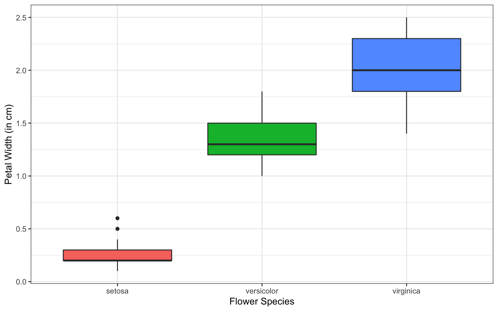
    
    
    ```r
    ggplot(iris, aes(Species, Petal.Width, fill = Species)) +
      geom_boxplot(show.legend = FALSE) +
      xlab("Flower Species") +
      ylab("Petal Width (in cm)")
    
    # there are many ways to do things, the code below is also correct
    ggplot(iris) +
      geom_boxplot(aes(Species, Petal.Width, fill = Species), show.legend = FALSE) +
      labs(x = "Flower Species",
           y = "Petal Width (in cm)")
    ```


2. You have just created a plot using the following code. How do you save it?
    
    ```r
    ggplot(cars, aes(speed, dist)) + 
      geom_point() +
      geom_smooth(method = lm)
    ```
    
    <select class='solveme' data-answer='["ggsave(\"figname.png\")"]'> <option></option> <option>ggsave()</option> <option>ggsave("figname")</option> <option>ggsave("figname.png")</option> <option>ggsave("figname.png", plot = cars)</option></select>

  
3. Debug the following code.
    
    ```r
    ggplot(iris) +
      geom_point(aes(Petal.Width, Petal.Length, colour = Species)) +
      geom_smooth(method = lm) +
      facet_grid(Species)
    ```
    
    
    ```r
    ggplot(iris, aes(Petal.Width, Petal.Length, colour = Species)) +
      geom_point() +
      geom_smooth(method = lm) +
      facet_grid(~Species)
    ```
    
    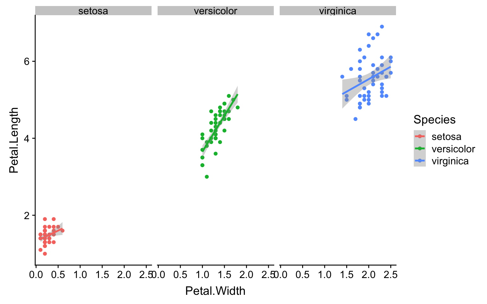


4. Generate a plot like this from the built-in dataset `ChickWeight`.  

    
    
    
    ```r
    ggplot(ChickWeight, aes(weight, Time)) +
      geom_hex(binwidth = c(10, 1)) +
      scale_fill_viridis_c()
    ```

    
5. Generate a plot like this from the built-in dataset `iris`.

    
    
    
    ```r
    pw <- ggplot(iris, aes(Petal.Width, color = Species)) +
      geom_density() +
      xlab("Petal Width (in cm)")
    
    pl <- ggplot(iris, aes(Petal.Length, color = Species)) +
      geom_density() +
      xlab("Petal Length (in cm)") +
      coord_flip()
    
    pw_pl <- ggplot(iris, aes(Petal.Width, Petal.Length, color = Species)) +
      geom_point() +
      geom_smooth(method = lm) +
      xlab("Petal Width (in cm)") +
      ylab("Petal Length (in cm)")
    
    cowplot::plot_grid(
      pw, pl, pw_pl, 
      labels = c("A", "B", "C"),
      nrow = 3
    )
    ```

## Exercises

Download the [exercises](exercises/03_ggplot_exercise.Rmd). See the [plots](exercises/03_ggplot_answers.html) to see what your plots should look like (this doesn't contain the answer code). See the [answers](exercises/03_ggplot_answers.Rmd) only after you've attempted all the questions.
