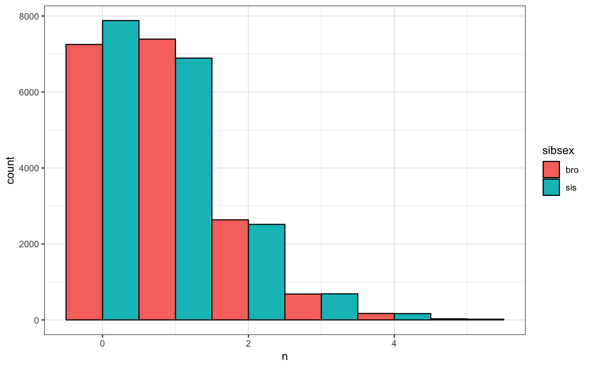
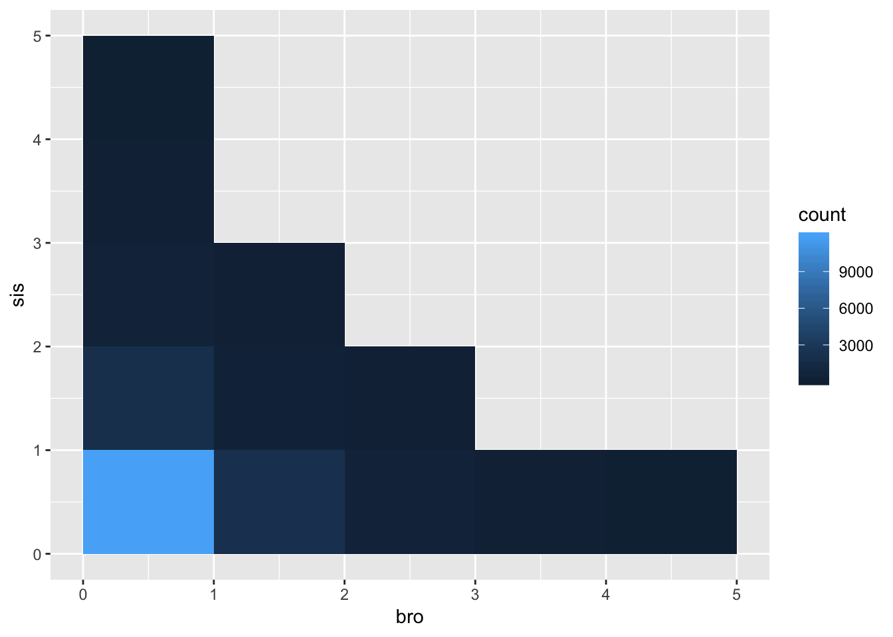

# Tidy Data {#tidyr}

## Learning Objectives

### Basic

1. Understand the concept of "tidy data"
2. Be able to use the 4 basic `tidyr` verbs
    + [`gather()`](#gather)
    + [`separate()`](#separate)
    + [`spread()`](#spread)
    + [`unite()`](#unite)
3. Be able to chain functions using [pipes](#pipes)

### Intermediate

4. Be able to use arguments like [`sep`](#sep), [`extra`](#extra), and [`convert`](#convert) to handle less straightforward data cleaning

### Advanced

5. Be able to use [regular expressions](#regex) to separate complex columns


## Resources

* [Tidy Data](http://vita.had.co.nz/papers/tidy-data.html)
* [Chapter 12: Tidy Data](http://r4ds.had.co.nz/tidy-data.html) in *R for Data Science*
* [Chapter 18: Pipes](http://r4ds.had.co.nz/pipes.html) in *R for Data Science*
* [Data wrangling cheat sheet](https://www.rstudio.com/wp-content/uploads/2015/02/data-wrangling-cheatsheet.pdf)


## Setup


```r
# libraries needed
library(tidyverse)
library(readxl)
```

## Load Data

Get data on infant mortality rates from the CSV file 
[`infmort.csv`](data/infmort.csv) in the directory `data`.


```r
infmort <- read_csv("data/infmort.csv")
```

```
## Parsed with column specification:
## cols(
##   Country = col_character(),
##   Year = col_double(),
##   `Infant mortality rate (probability of dying between birth and age 1 per 1000 live births)` = col_character()
## )
```

```r
glimpse(infmort)
```

```
## Observations: 5,044
## Variables: 3
## $ Country                                                                                     <chr> …
## $ Year                                                                                        <dbl> …
## $ `Infant mortality rate (probability of dying between birth and age 1 per 1000 live births)` <chr> …
```

Get data on maternal mortality from from the excel file 
[`matmort.xls`](data/matmort.xls) in the directory `data`


```r
matmort <- read_xls("data/matmort.xls")
glimpse(matmort)
```

```
## Observations: 181
## Variables: 4
## $ Country <chr> "Afghanistan", "Albania", "Algeria", "Angola", "Argentin…
## $ `1990`  <chr> "1 340 [ 878 - 1 950]", "71 [ 58 -  88]", "216 [ 141 -  …
## $ `2000`  <chr> "1 100 [ 745 - 1 570]", "43 [ 33 -  56]", "170 [ 118 -  …
## $ `2015`  <chr> "396 [ 253 -  620]", "29 [ 16 -  46]", "140 [ 82 -  244]…
```

Get data on country codes from [https://raw.githubusercontent.com/lukes/ISO-3166-Countries-with-Regional-Codes/master/all/all.csv](https://raw.githubusercontent.com/lukes/ISO-3166-Countries-with-Regional-Codes/master/all/all.csv)


```r
ccodes <- read_csv("https://raw.githubusercontent.com/lukes/ISO-3166-Countries-with-Regional-Codes/master/all/all.csv")
```

```
## Parsed with column specification:
## cols(
##   name = col_character(),
##   `alpha-2` = col_character(),
##   `alpha-3` = col_character(),
##   `country-code` = col_character(),
##   `iso_3166-2` = col_character(),
##   region = col_character(),
##   `sub-region` = col_character(),
##   `intermediate-region` = col_character(),
##   `region-code` = col_character(),
##   `sub-region-code` = col_character(),
##   `intermediate-region-code` = col_character()
## )
```

```r
glimpse(ccodes)
```

```
## Observations: 249
## Variables: 11
## $ name                       <chr> "Afghanistan", "Åland Islands", "Alba…
## $ `alpha-2`                  <chr> "AF", "AX", "AL", "DZ", "AS", "AD", "…
## $ `alpha-3`                  <chr> "AFG", "ALA", "ALB", "DZA", "ASM", "A…
## $ `country-code`             <chr> "004", "248", "008", "012", "016", "0…
## $ `iso_3166-2`               <chr> "ISO 3166-2:AF", "ISO 3166-2:AX", "IS…
## $ region                     <chr> "Asia", "Europe", "Europe", "Africa",…
## $ `sub-region`               <chr> "Southern Asia", "Northern Europe", "…
## $ `intermediate-region`      <chr> NA, NA, NA, NA, NA, NA, "Middle Afric…
## $ `region-code`              <chr> "142", "150", "150", "002", "009", "1…
## $ `sub-region-code`          <chr> "034", "154", "039", "015", "061", "0…
## $ `intermediate-region-code` <chr> NA, NA, NA, NA, NA, NA, "017", "029",…
```

## Pipes {#pipes}


Pipes were introduced in the second lesson, but we will review them here. Pipes are a way to order your code in a more readable format. 

Let's say you have a small data table with 10 participant IDs, two columns with variable type A, and 2 columns with variable type B. You want to calculate the mean of the A variables and the mean of the B variables and return a table with 10 rows (1 for each participant) and 3 columns (`id`, `A_mean` and `B_mean`). 

One way you could do this is by creating a new object at every step and using that object in the next step. This is pretty clear, but you've created 6 unnecessary data objects in your environment. This can get confusing in very long scripts. 


```r
# make a data table with 10 subjects
data_original <- tibble(
  id = 1:10,
  A1 = rnorm(10, 0),
  A2 = rnorm(10, 1),
  B1 = rnorm(10, 2),
  B2 = rnorm(10,3)
)

# gather columns A1 to B2 into "variable" and "value" columns
data_gathered <- gather(data_original, variable, value, A1:B2)

# separate the variable column at the _ into "var" and "var_n" columns
data_separated <- separate(data_gathered, variable, c("var", "var_n"), sep = 1)

# group the data by id and var
data_grouped <- group_by(data_separated, id, var)

# calculate the mean value for each id/var 
data_summarised <- summarise(data_grouped, mean = mean(value))

# spread the mean column into A and B columns
data_spread <- spread(data_summarised, var, mean)

# rename A and B to A_mean and B_mean
data <- rename(data_spread, A_mean = A, B_mean = B)

data
```

```
## # A tibble: 10 x 3
## # Groups:   id [10]
##       id  A_mean B_mean
##    <int>   <dbl>  <dbl>
##  1     1  0.423    1.81
##  2     2 -0.370    1.84
##  3     3  0.625    2.61
##  4     4  0.591    3.35
##  5     5  0.443    3.15
##  6     6  1.07     2.67
##  7     7 -0.0433   1.66
##  8     8  0.882    2.14
##  9     9  0.0537   2.70
## 10    10  0.0555   2.86
```

<div class="warning">
<p>You <em>can</em> name each object <code>data</code> and keep replacing the old data object with the new one at each step. This will keep you environment clean, but I don't recommend it because it makes it too easy to accidentally run your code out of order when you are running line-by-line for development or debugging.</p>
</div>

One way to avoid extra objects is to nest your functions, literally replacing each data object with the code that generated it in the previous step. This can be fine for very short chains.


```r
mean_petal_width <- round(mean(iris$Petal.Width), 2)
```

But it gets extremely confusing for long chains:


```r
# do not ever do this!!
data <- rename(
  spread(
    summarise(
      group_by(
        separate(
          gather(
            tibble(
              id = 1:10,
              A1 = rnorm(10, 0),
              A2 = rnorm(10, 1),
              B1 = rnorm(10, 2),
              B2 = rnorm(10,3)), 
            variable, value, A1:B2), 
          variable, c("var", "var_n"), sep = 1), 
        id, var), 
      mean = mean(value)), 
    var, mean), 
  A_mean = A, B_mean = B)
```

The pipe lets you "pipe" the result of each function into the next function, allowing you to put your code in a logical order without creating too many extra objects.


```r
# calculate mean of A and B variables for each participant
data <- tibble(
  id = 1:10,
  A1 = rnorm(10, 0),
  A2 = rnorm(10, 1),
  B1 = rnorm(10, 2),
  B2 = rnorm(10,3)
) %>%
  gather(variable, value, A1:B2) %>%
  separate(variable, c("var", "var_n"), sep=1) %>%
  group_by(id, var) %>%
  summarise(mean = mean(value)) %>%
  spread(var, mean) %>%
  rename(A_mean = A, B_mean = B)
```

You can read this code from top to bottom as follows:

1. Make a tibble called `data` with
    - id of 1 to 10,
    - A1 of 10 random numbers from a normal distribution,
    - A2 of 10 random numbers from a normal distribution,
    - B1 of 10 random numbers from a normal distribution, 
    - B2 of 10 random numbers from a normal distribution; and then
2. Gather to create `variable` and `value` column from columns `A_1` to `B_2`; and then
3. Separate the column `variable` into 2 new columns called `var`and `var_n`, separate at character 1; and then
4. Group by columns `id` and `var`; and then
5. Summarise and new column called `mean` as the mean of the `value` column for each group; and then
6. Spread to make new columns with the key names in `var` and values in `mean`; and then
7. Rename to make columns called `A_mean` (old `A`) and `B_mean` (old `B`)

You can make intermediate objects whenever you need to break up your code because it's getting too complicated or you need to debug something.

<div class="info">
<p>You can debug a pipe by running just the first few functions by highlighting from the beginning to just before the pipe you want to stop at. Try this by highlighting from <code>data &lt;-</code> to the end of the <code>separate</code> function and typing cmd-return. What does <code>data</code> look like now?</p>
</div>

## gather() {#gather}

`gather(data, key = "key", value = "value", ..., na.rm = FALSE, convert = FALSE, factor_key = FALSE)`

`matmort` is in wide format, with a separate column for each year. Change it to long format, with a row for each County/Year observation.

* `key` is what you want to call the row headers; it's "year" in this example. 
* `value` is what you want to call the values in the gathered columns; they're "stats" in this example.
* The `...` refers to the columns you want to gather. You can refer to them by their names, like `col1, col2, col3, col4` or `col1:col4` or by their numbers, like `8, 9, 10` or `8:10`.
  
This example is complicated because the column names to gather _are_ numbers. If the column names are non-standard (e.g., have spaces, start with numbers, or have special characters), you can enclose them in backticks (\`) like the example below.


```r
matmort_long <- matmort %>%
  gather("Year", "stats", `1990`:`2015`)

glimpse(matmort_long)
```

```
## Observations: 543
## Variables: 3
## $ Country <chr> "Afghanistan", "Albania", "Algeria", "Angola", "Argentin…
## $ Year    <chr> "1990", "1990", "1990", "1990", "1990", "1990", "1990", …
## $ stats   <chr> "1 340 [ 878 - 1 950]", "71 [ 58 -  88]", "216 [ 141 -  …
```

## separate() {#separate}

`separate(data, col, into, sep = "[^[:alnum:]]+", remove = TRUE, convert = FALSE, extra = "warn", fill = "warn")`

The data in the `stats` column is in a crazy format with some sort of confidence interval in brackets and lots of extra spaces. We don't need any of the spaces, so first we'll remove them with `mutate`. 

The `separate` function will separate your data on anything that is not a number or letter, so try it first without specifying the `sep` argument. The `into` argument is a list of the new column names.


```r
matmort_split <- matmort_long %>%
  mutate(stats = gsub(" ", "", stats)) %>%
  separate(stats, c("rate", "ci_low", "ci_hi"))
```

```
## Warning: Expected 3 pieces. Additional pieces discarded in 543 rows [1, 2,
## 3, 4, 5, 6, 7, 8, 9, 10, 11, 12, 13, 14, 15, 16, 17, 18, 19, 20, ...].
```

```r
glimpse(matmort_split)
```

```
## Observations: 543
## Variables: 5
## $ Country <chr> "Afghanistan", "Albania", "Algeria", "Angola", "Argentin…
## $ Year    <chr> "1990", "1990", "1990", "1990", "1990", "1990", "1990", …
## $ rate    <chr> "1340", "71", "216", "1160", "72", "58", "8", "8", "64",…
## $ ci_low  <chr> "878", "58", "141", "627", "64", "51", "7", "7", "56", "…
## $ ci_hi   <chr> "1950", "88", "327", "2020", "80", "65", "9", "10", "74"…
```

<div class="info">
<p>The <code>gsub(pattern, replacement, x)</code> function is a flexible way to do search and replace. The example above replaces all occurances of the <code>pattern</code> &quot; &quot; (a space), with the <code>replacement</code> &quot;&quot; (nothing), in the string <code>x</code> (the <code>stats</code> column). Use <code>sub()</code> instead if you only want to replace the first occurance of a pattern. We only used a simple pattern here, but you can use more complicated <a href="https://stat.ethz.ch/R-manual/R-devel/library/base/html/regex.html">regex</a> patterns to replace, for example, all even numbers (e.g., <code>gsub(&quot;[:02468:]&quot;, &quot;*&quot;, &quot;id = 123456&quot;)</code>) or all occurances of the word colour in US or UK spelling (e.g., <code>gsub(&quot;colo(u)?r&quot;, &quot;***&quot;, &quot;replace color, colour, or colours, but not collors&quot;)</code>).</p>
</div>

### Handle spare columns with `extra` {#extra}

<div class="warning">
<p>The previous example should have given you an error warning about &quot;Too many values at 543 locations&quot;. This is because <code>separate</code> splits the column at the brackets and dashes, so the text <code>100[90-110]</code> would split into four values <code>c(&quot;100&quot;, &quot;90&quot;, &quot;110&quot;, &quot;&quot;)</code>, but we only specified 3 new columns. The fourth value is always empty (just the part after the last bracket), so we are happy to drop it, but <code>separate</code> generates a warning so you don't do that accidentally. You can turn off the warning by adding the <code>extra</code> argument and setting it to &quot;drop&quot;. Look at the help for <code>??tidyr::separate</code> to see what the other options do.</p>
</div>


```r
matmort_split <- matmort_long %>%
  mutate(stats = gsub(" ", "", stats)) %>%
  separate(stats, c("rate", "ci_low", "ci_hi"), extra = "drop")

glimpse(matmort_split)
```

```
## Observations: 543
## Variables: 5
## $ Country <chr> "Afghanistan", "Albania", "Algeria", "Angola", "Argentin…
## $ Year    <chr> "1990", "1990", "1990", "1990", "1990", "1990", "1990", …
## $ rate    <chr> "1340", "71", "216", "1160", "72", "58", "8", "8", "64",…
## $ ci_low  <chr> "878", "58", "141", "627", "64", "51", "7", "7", "56", "…
## $ ci_hi   <chr> "1950", "88", "327", "2020", "80", "65", "9", "10", "74"…
```

### Set delimiters with `sep` {#sep}

Now do the same with `infmort`. It's already in long format, so you don't need to use `gather`, but the third column has a crazy long name, so we can just refer to it by its column number (3).


```r
infmort_split <- infmort %>%
  separate(3, c("rate", "ci_low", "ci_hi"), extra = "drop")

glimpse(infmort_split)
```

```
## Observations: 5,044
## Variables: 5
## $ Country <chr> "Afghanistan", "Afghanistan", "Afghanistan", "Afghanista…
## $ Year    <dbl> 2015, 2014, 2013, 2012, 2011, 2010, 2009, 2008, 2007, 20…
## $ rate    <chr> "66", "68", "69", "71", "73", "75", "76", "78", "80", "8…
## $ ci_low  <chr> "3", "1", "9", "7", "4", "1", "8", "6", "4", "3", "4", "…
## $ ci_hi   <chr> "52", "55", "58", "61", "64", "66", "69", "71", "73", "7…
```

*Wait, that didn't work at all!* It split the column on spaces, brackets, _and_ full stops. We just want to split on the spaces, brackets and dashes. So we need to manually set `sep` to what the delimiters are. Also, once there are more than a few arguments specified for a function, it's easier to read them if you put one argument on each line.

{#regex}
<div class="warning">
<p>You can use <a href="https://stat.ethz.ch/R-manual/R-devel/library/base/html/regex.html">regular expressions</a> to separate complex columns. Here, we want to separate on dashes and brackets. You can separate on a list of delimiters by putting them in parentheses, separated by &quot;|&quot;. It's a little more complicated because brackets have a special meaning in regex, so you need to &quot;escape&quot; the left one with two backslashes &quot;\\&quot;.</p>
</div>


```r
infmort_split <- infmort %>%
  separate(
    col = 3, 
    into = c("rate", "ci_low", "ci_hi"), 
    extra = "drop", 
    sep = "(\\[|-|])"
  )

glimpse(infmort_split)
```

```
## Observations: 5,044
## Variables: 5
## $ Country <chr> "Afghanistan", "Afghanistan", "Afghanistan", "Afghanista…
## $ Year    <dbl> 2015, 2014, 2013, 2012, 2011, 2010, 2009, 2008, 2007, 20…
## $ rate    <chr> "66.3 ", "68.1 ", "69.9 ", "71.7 ", "73.4 ", "75.1 ", "7…
## $ ci_low  <chr> "52.7", "55.7", "58.7", "61.6", "64.4", "66.9", "69.0", …
## $ ci_hi   <chr> "83.9", "83.6", "83.5", "83.7", "84.2", "85.1", "86.1", …
```

### Fix data types with `convert` {#convert}

That's better. Notice the _<chr>_ next to `Year`, `rate`, `ci_low` and `ci_hi`. That means these columns hold characters (like words), not numbers or integers. This can cause problems when you try to do thigs like average the numbers (you can't average words), so we can fix it by adding the argument `convert` and setting it to `TRUE`.


```r
infmort_split <- infmort %>%
  separate(3, c("rate", "ci_low", "ci_hi"), extra = "drop", sep = "(\\[|-|])", convert = TRUE)

glimpse(infmort_split)
```

```
## Observations: 5,044
## Variables: 5
## $ Country <chr> "Afghanistan", "Afghanistan", "Afghanistan", "Afghanista…
## $ Year    <dbl> 2015, 2014, 2013, 2012, 2011, 2010, 2009, 2008, 2007, 20…
## $ rate    <dbl> 66.3, 68.1, 69.9, 71.7, 73.4, 75.1, 76.8, 78.6, 80.4, 82…
## $ ci_low  <dbl> 52.7, 55.7, 58.7, 61.6, 64.4, 66.9, 69.0, 71.2, 73.4, 75…
## $ ci_hi   <dbl> 83.9, 83.6, 83.5, 83.7, 84.2, 85.1, 86.1, 87.3, 88.9, 90…
```

Do the same for `matmort`.


```r
matmort_split <- matmort_long %>%
  mutate(stats = gsub(" ", "", stats)) %>%
  separate(stats, c("rate", "ci_low", "ci_hi"), extra = "drop", convert = TRUE)

glimpse(matmort_split)
```

```
## Observations: 543
## Variables: 5
## $ Country <chr> "Afghanistan", "Albania", "Algeria", "Angola", "Argentin…
## $ Year    <chr> "1990", "1990", "1990", "1990", "1990", "1990", "1990", …
## $ rate    <int> 1340, 71, 216, 1160, 72, 58, 8, 8, 64, 46, 26, 569, 58, …
## $ ci_low  <int> 878, 58, 141, 627, 64, 51, 7, 7, 56, 34, 20, 446, 47, 28…
## $ ci_hi   <int> 1950, 88, 327, 2020, 80, 65, 9, 10, 74, 61, 33, 715, 72,…
```

### All in one step

We can chain all the steps above together, since we don't need those intermediate dataframes.


```r
infmort <- read_csv("data/infmort.csv") %>%
  separate(
    3, 
    c("rate", "ci_low", "ci_hi"), 
    extra = "drop", 
    sep = "(\\[|-|])", 
    convert = TRUE
  )
```

```
## Parsed with column specification:
## cols(
##   Country = col_character(),
##   Year = col_double(),
##   `Infant mortality rate (probability of dying between birth and age 1 per 1000 live births)` = col_character()
## )
```

```r
matmort <- read_xls("data/matmort.xls") %>%
  gather("Year", "stats", `1990`:`2015`) %>%
  mutate(stats = gsub(" ", "", stats)) %>%
  separate(
    stats, 
    c("rate", "ci_low", "ci_hi"), 
    extra = "drop", 
    convert = TRUE
  )

glimpse(matmort)
glimpse(infmort)
```

```
## Observations: 543
## Variables: 5
## $ Country <chr> "Afghanistan", "Albania", "Algeria", "Angola", "Argentin…
## $ Year    <chr> "1990", "1990", "1990", "1990", "1990", "1990", "1990", …
## $ rate    <int> 1340, 71, 216, 1160, 72, 58, 8, 8, 64, 46, 26, 569, 58, …
## $ ci_low  <int> 878, 58, 141, 627, 64, 51, 7, 7, 56, 34, 20, 446, 47, 28…
## $ ci_hi   <int> 1950, 88, 327, 2020, 80, 65, 9, 10, 74, 61, 33, 715, 72,…
## Observations: 5,044
## Variables: 5
## $ Country <chr> "Afghanistan", "Afghanistan", "Afghanistan", "Afghanista…
## $ Year    <dbl> 2015, 2014, 2013, 2012, 2011, 2010, 2009, 2008, 2007, 20…
## $ rate    <dbl> 66.3, 68.1, 69.9, 71.7, 73.4, 75.1, 76.8, 78.6, 80.4, 82…
## $ ci_low  <dbl> 52.7, 55.7, 58.7, 61.6, 64.4, 66.9, 69.0, 71.2, 73.4, 75…
## $ ci_hi   <dbl> 83.9, 83.6, 83.5, 83.7, 84.2, 85.1, 86.1, 87.3, 88.9, 90…
```


## spread() {#spread}

`spread(data, key, value, fill = NA, convert = FALSE, drop = TRUE, sep = NULL)`

You can reverse the processes above, as well. For example, you can convert data from long format into wide format.

* `key` is the column that contains your new column headers
* `value` is the column that contains the values in the new spread columns

Let's spread out the infant mortality rate by year.


```r
infmort_wide <- infmort %>%
  spread(Year, rate)

glimpse(infmort_wide)
```

```
## Observations: 4,934
## Variables: 29
## $ Country <chr> "Afghanistan", "Afghanistan", "Afghanistan", "Afghanista…
## $ ci_low  <dbl> 52.7, 55.7, 58.7, 61.6, 64.4, 66.9, 69.0, 71.2, 73.4, 75…
## $ ci_hi   <dbl> 83.9, 83.6, 83.5, 83.7, 84.2, 85.1, 86.1, 87.3, 88.9, 90…
## $ `1990`  <dbl> NA, NA, NA, NA, NA, NA, NA, NA, NA, NA, NA, NA, NA, NA, …
## $ `1991`  <dbl> NA, NA, NA, NA, NA, NA, NA, NA, NA, NA, NA, NA, NA, NA, …
## $ `1992`  <dbl> NA, NA, NA, NA, NA, NA, NA, NA, NA, NA, NA, NA, NA, NA, …
## $ `1993`  <dbl> NA, NA, NA, NA, NA, NA, NA, NA, NA, NA, NA, NA, NA, NA, …
## $ `1994`  <dbl> NA, NA, NA, NA, NA, NA, NA, NA, NA, NA, NA, NA, NA, NA, …
## $ `1995`  <dbl> NA, NA, NA, NA, NA, NA, NA, NA, NA, NA, NA, NA, NA, NA, …
## $ `1996`  <dbl> NA, NA, NA, NA, NA, NA, NA, NA, NA, NA, NA, NA, NA, NA, …
## $ `1997`  <dbl> NA, NA, NA, NA, NA, NA, NA, NA, NA, NA, NA, NA, NA, NA, …
## $ `1998`  <dbl> NA, NA, NA, NA, NA, NA, NA, NA, NA, NA, NA, NA, NA, NA, …
## $ `1999`  <dbl> NA, NA, NA, NA, NA, NA, NA, NA, NA, NA, NA, NA, NA, NA, …
## $ `2000`  <dbl> NA, NA, NA, NA, NA, NA, NA, NA, NA, NA, NA, NA, NA, NA, …
## $ `2001`  <dbl> NA, NA, NA, NA, NA, NA, NA, NA, NA, NA, NA, NA, NA, NA, …
## $ `2002`  <dbl> NA, NA, NA, NA, NA, NA, NA, NA, NA, NA, NA, NA, NA, 91.2…
## $ `2003`  <dbl> NA, NA, NA, NA, NA, NA, NA, NA, NA, NA, NA, NA, 89, NA, …
## $ `2004`  <dbl> NA, NA, NA, NA, NA, NA, NA, NA, NA, NA, NA, 86.7, NA, NA…
## $ `2005`  <dbl> NA, NA, NA, NA, NA, NA, NA, NA, NA, NA, 84.4, NA, NA, NA…
## $ `2006`  <dbl> NA, NA, NA, NA, NA, NA, NA, NA, NA, 82.3, NA, NA, NA, NA…
## $ `2007`  <dbl> NA, NA, NA, NA, NA, NA, NA, NA, 80.4, NA, NA, NA, NA, NA…
## $ `2008`  <dbl> NA, NA, NA, NA, NA, NA, NA, 78.6, NA, NA, NA, NA, NA, NA…
## $ `2009`  <dbl> NA, NA, NA, NA, NA, NA, 76.8, NA, NA, NA, NA, NA, NA, NA…
## $ `2010`  <dbl> NA, NA, NA, NA, NA, 75.1, NA, NA, NA, NA, NA, NA, NA, NA…
## $ `2011`  <dbl> NA, NA, NA, NA, 73.4, NA, NA, NA, NA, NA, NA, NA, NA, NA…
## $ `2012`  <dbl> NA, NA, NA, 71.7, NA, NA, NA, NA, NA, NA, NA, NA, NA, NA…
## $ `2013`  <dbl> NA, NA, 69.9, NA, NA, NA, NA, NA, NA, NA, NA, NA, NA, NA…
## $ `2014`  <dbl> NA, 68.1, NA, NA, NA, NA, NA, NA, NA, NA, NA, NA, NA, NA…
## $ `2015`  <dbl> 66.3, NA, NA, NA, NA, NA, NA, NA, NA, NA, NA, NA, NA, NA…
```

<div class="warning">
<p>Nope, that didn't work at all, but it's a really common mistake when spreading data. This is because <code>spread</code> matches on all the remaining columns, so Afghanistan with <code>ci_low</code> of 52.7 is treated as a different observation than Afghanistan with <code>ci_low</code> of 55.7. We can fix this by merging the <code>rate</code>, <code>ci_low</code> and <code>ci_hi</code> columns back together.</p>
</div>

## unite() {#unite}

`unite(data, col, ..., sep = "_", remove = TRUE)`


```r
infmort_united <- infmort %>%
  unite(rate_ci, rate, ci_low, ci_hi)

glimpse(infmort_united)
```

```
## Observations: 5,044
## Variables: 3
## $ Country <chr> "Afghanistan", "Afghanistan", "Afghanistan", "Afghanista…
## $ Year    <dbl> 2015, 2014, 2013, 2012, 2011, 2010, 2009, 2008, 2007, 20…
## $ rate_ci <chr> "66.3_52.7_83.9", "68.1_55.7_83.6", "69.9_58.7_83.5", "7…
```


### Control separation with `sep`

`unite()` separates merged names with an underscore by default. 
Set the `sep` argument if you want to change that.


```r
infmort_united <- infmort %>%
  unite(rate_ci, rate, ci_low, ci_hi, sep = ", ")

glimpse(infmort_united)
```

```
## Observations: 5,044
## Variables: 3
## $ Country <chr> "Afghanistan", "Afghanistan", "Afghanistan", "Afghanista…
## $ Year    <dbl> 2015, 2014, 2013, 2012, 2011, 2010, 2009, 2008, 2007, 20…
## $ rate_ci <chr> "66.3, 52.7, 83.9", "68.1, 55.7, 83.6", "69.9, 58.7, 83.…
```

<div class="info">
<p>What if you want to put it back into the format &quot;rate [ci_low - ci_hi]&quot;? Then, <code>mutate</code> and <code>paste</code> are a better choice than <code>unite</code>, but you have to get rid of the <code>rate</code>, <code>ci_low</code> and <code>ci_hi</code> columns with <code>select</code>. You'll learn more about these function in the <a href="04_dplyr.html">Data Manipulation</a> lesson.</p>
</div>


```r
infmort_united <- infmort %>%
  mutate(rate_ci = paste0(rate, " [", ci_low, " - ", ci_hi, "]"))

glimpse(infmort_united)
```

```
## Observations: 5,044
## Variables: 6
## $ Country <chr> "Afghanistan", "Afghanistan", "Afghanistan", "Afghanista…
## $ Year    <dbl> 2015, 2014, 2013, 2012, 2011, 2010, 2009, 2008, 2007, 20…
## $ rate    <dbl> 66.3, 68.1, 69.9, 71.7, 73.4, 75.1, 76.8, 78.6, 80.4, 82…
## $ ci_low  <dbl> 52.7, 55.7, 58.7, 61.6, 64.4, 66.9, 69.0, 71.2, 73.4, 75…
## $ ci_hi   <dbl> 83.9, 83.6, 83.5, 83.7, 84.2, 85.1, 86.1, 87.3, 88.9, 90…
## $ rate_ci <chr> "66.3 [52.7 - 83.9]", "68.1 [55.7 - 83.6]", "69.9 [58.7 …
```


Now let's try spreading on year again. Notice here we're uniting columns `rate:ci_hi`, instead of `rate, ci_low, ci_hi`. The colon just says to select all the columns between the first and last named ones. Check the help documentation for `??tidyr::unite` and `??tidyr::select` to see other ways to select columns.


```r
infmort_wide <- infmort %>%
  unite(rate_ci, rate:ci_hi, sep = ", ") %>%
  spread(Year, rate_ci)

glimpse(infmort_wide)
```

```
## Observations: 194
## Variables: 27
## $ Country <chr> "Afghanistan", "Albania", "Algeria", "Andorra", "Angola"…
## $ `1990`  <chr> "122.5, 111.6, 135.5", "35.1, 31.3, 39.2", "39.7, 37.1, …
## $ `1991`  <chr> "118.3, 108, 129.9", "33.7, 30.2, 37.6", "38.8, 36.1, 41…
## $ `1992`  <chr> "114.4, 104.6, 125.2", "32.5, 29.2, 36.2", "38.1, 35.4, …
## $ `1993`  <chr> "110.9, 101.4, 120.9", "31.4, 28.2, 34.9", "37.5, 34.9, …
## $ `1994`  <chr> "107.7, 98.6, 117.2", "30.3, 27.1, 33.8", "36.9, 34.6, 3…
## $ `1995`  <chr> "105, 96.2, 114.1", "29.1, 26, 32.7", "36.3, 34.2, 38.4"…
## $ `1996`  <chr> "102.7, 94.5, 111.3", "27.9, 24.8, 31.5", "35.7, 34, 37.…
## $ `1997`  <chr> "100.7, 92.9, 109.1", "26.8, 23.6, 30.4", "35.1, 33.8, 3…
## $ `1998`  <chr> "98.9, 91.4, 107.2", "25.5, 22.4, 29.2", "34.7, 33.7, 35…
## $ `1999`  <chr> "97.2, 89.9, 105.4", "24.4, 21.2, 28.1", "34.4, 33.5, 35…
## $ `2000`  <chr> "95.4, 88.2, 103.6", "23.2, 20, 27", "33.9, 33.2, 34.7",…
## $ `2001`  <chr> "93.4, 86.3, 101.6", "22.1, 18.8, 26", "33.3, 32.7, 34",…
## $ `2002`  <chr> "91.2, 84.3, 99.3", "21, 17.6, 25.1", "32.4, 31.8, 33", …
## $ `2003`  <chr> "89, 82.1, 97", "20, 16.5, 24.3", "31.3, 30.7, 31.9", "3…
## $ `2004`  <chr> "86.7, 79.9, 94.8", "19.1, 15.4, 23.8", "30.1, 29.5, 30.…
## $ `2005`  <chr> "84.4, 77.7, 92.6", "18.3, 14.2, 23.4", "28.8, 28.3, 29.…
## $ `2006`  <chr> "82.3, 75.5, 90.7", "17.4, 13.2, 23.1", "27.6, 27, 28.1"…
## $ `2007`  <chr> "80.4, 73.4, 88.9", "16.7, 12.1, 22.9", "26.4, 25.9, 26.…
## $ `2008`  <chr> "78.6, 71.2, 87.3", "16, 11.2, 22.7", "25.3, 24.8, 25.7"…
## $ `2009`  <chr> "76.8, 69, 86.1", "15.4, 10.5, 22.6", "24.3, 23.8, 24.7"…
## $ `2010`  <chr> "75.1, 66.9, 85.1", "14.8, 9.8, 22.4", "23.5, 23, 23.9",…
## $ `2011`  <chr> "73.4, 64.4, 84.2", "14.3, 9.1, 22.3", "22.8, 22.4, 23.3…
## $ `2012`  <chr> "71.7, 61.6, 83.7", "13.8, 8.5, 22.2", "22.4, 22, 22.9",…
## $ `2013`  <chr> "69.9, 58.7, 83.5", "13.3, 7.9, 22.1", "22.1, 21.7, 22.7…
## $ `2014`  <chr> "68.1, 55.7, 83.6", "12.9, 7.5, 22.1", "22, 21.3, 22.7",…
## $ `2015`  <chr> "66.3, 52.7, 83.9", "12.5, 7, 22.2", "21.9, 20.8, 23", "…
```


## Exercises

Download the [formative exercises](formative_exercises/04_wrangle1_stub.Rmd). See the [answers](formative_exercises/04_wrangle1_answers.Rmd) only after you've attempted all the questions.

Tidy the data from [personality.csv](data/personality.csv).

These data are from a 5-factor (OCEAN) personality questionnaire. Each question 
is labelled with the domain (Op = openness, Co = concientiousness, Ex = extraversion, 
Ag = agreeableness, and Ne = neuroticism) and the question number.

1. *Basic*: Load the data and convert from wide to long format. 

    The resulting dataframe should have the columns: `user_id`, `date`, `question`, and `score`.

    <div class="solution"><button>Solution</button>
    
    ```r
    ocean <- read_csv("data/personality.csv") %>%
      gather("question", "score", Op1:Ex9)
    ```
    
    ```
    ## Parsed with column specification:
    ## cols(
    ##   .default = col_double(),
    ##   date = col_date(format = "")
    ## )
    ```
    
    ```
    ## See spec(...) for full column specifications.
    ```
    </div>

2. *Basic*: Split the `question` column into two columns: `domain` and `qnumber`.

    <p class="alert alert-info'>
    There is no character to split on, here, but you can separate a column after a 
    specific number of characters by setting `sep` to  an integer. For example, to 
    split "abcde" after the third character, use `sep = 3`, which results in 
    c("abc", "de"). You can also use negative number to split before the *n*th 
    character from the right. For example, to split a column that has words of 
    various lengths and 2-digit suffixes (like "lisa03"", "amanda38"), you can 
    use `sep = -2`.</p>

    <div class="solution"><button>Solution</button>
    
    ```r
    ocean_sep <- ocean %>%
      separate(question, c("domain", "qnumber"), sep = 2)
    ```
    </div>

3. *Basic*: Put the domain and qnumber columns back together into a new column named `domain_n`. Make it in a format like "Op_Q1".

    <div class="solution"><button>Solution</button>
    
    ```r
    ocean_unite <- ocean_sep %>%
      unite("domain_n", domain, qnumber, sep = "_Q")
    ```
    </div>

4. *Basic*: Convert back to wide format.

    <div class="solution"><button>Solution</button>
    
    ```r
    ocean_spread <- ocean_unite %>%
      spread(domain_n, score)
    ```
    </div>

5. *Intermediate*: Chain all the steps above using pipes.
    <div class="solution"><button>Solution</button>
    
    ```r
    ocean <- read_csv("data/personality.csv") %>%
      gather("question", "score", Op1:Ex9) %>%
      separate(question, c("domain", "qnumber"), sep = 2) %>%
      unite("domain_n", domain, qnumber, sep = "_Q") %>%
      spread(domain_n, score)
    ```
    
    ```
    ## Parsed with column specification:
    ## cols(
    ##   .default = col_double(),
    ##   date = col_date(format = "")
    ## )
    ```
    
    ```
    ## See spec(...) for full column specifications.
    ```
    </div>

*Intermediate*: Debug the following code:

6. Load the data from [sensation_seeking.csv](data/sensation_seeking.csv).
    
    ```r
    ss <- read_csv(data/sensation_seeking.csv)
    ```

    <div class="solution"><button>Solution</button>
    
    ```r
    ss <- read_csv("data/sensation_seeking.csv")
    ```
    
    ```
    ## Parsed with column specification:
    ## cols(
    ##   id = col_double(),
    ##   user_id = col_double(),
    ##   date = col_date(format = ""),
    ##   sss1 = col_double(),
    ##   sss2 = col_double(),
    ##   sss3 = col_double(),
    ##   sss4 = col_double(),
    ##   sss5 = col_double(),
    ##   sss6 = col_double(),
    ##   sss7 = col_double(),
    ##   sss8 = col_double(),
    ##   sss9 = col_double(),
    ##   sss10 = col_double(),
    ##   sss11 = col_double(),
    ##   sss12 = col_double(),
    ##   sss13 = col_double(),
    ##   sss14 = col_double()
    ## )
    ```
    </div>

7. Convert from wide to long format.
    
    ```r
    ss_long <- gather(ss, "question", "score")
    ```

    <div class="solution"><button>Solution</button>
    
    ```r
    ss_long <- gather(ss, "question", "score", sss1:sss14)
    ```
    </div>
    
8.  Split the `question` column into two columns: `domain` and `qnumber`.
    
    ```r
    ss_sep <- ss_long %>%
      separate(question, domain, qnumber, sep = 3)
    ```

    <div class="solution"><button>Solution</button>
    
    ```r
    ss_sep <- ss_long %>%
      separate(question, c("domain", "qnumber"), sep = 3)
    ```
    </div>
    
9. Put the `id` and `user_id` columns together into a new column named `super_id`. Make it in a format like "id-user_id".
    
    ```r
    ss_unite <- ss_sep %>%
      unite(id, user_id, "super_id", sep = "-")
    ```

    <div class="solution"><button>Solution</button>
    
    ```r
    ss_unite <- ss_sep %>%
      unite("super_id", id, user_id, sep = "-")
    ```
    </div>
 
10.  Convert back to wide format.
    
    ```r
    ss_wide <- ss_unite %>%
      spreadr(qnumber, score)
    ```

    <div class="solution"><button>Solution</button>
    
    ```r
    ss_wide <- ss_unite %>%
      spread(qnumber, score)
    ```
    </div>
    
*Intermediate*: Load the dataset [family_composition.csv](data/family_composition.csv).

11. The columns `oldbro` through `twinsis` give the number of siblings of that age and sex. Put this into long format and create separate columns for sibling age (old, young, twin) and sex (bro, sis).

    <div class="solution"><button>Solution</button>
    
    ```r
    family <- read_csv("data/family_composition.csv") %>%
      gather("sibtype", "n", oldbro:twinsis) %>%
      separate(sibtype, c("sibage", "sibsex"), sep = -3)
    ```
    </div>
    
*Advanced*: Tidy the data from [eye_descriptions.csv](data/eye_descriptions.csv). This dataset contains descriptions of the eyes of 50 people. Some raters wrote more than one description per face, separated by commas, semicolons, or slashes. 

12. Create a dataset with separate columns for face_id, description, and number of description.

    <div class="solution"><button>Solution</button>
    
    ```r
    eyes <- read_csv("data/eye_descriptions.csv") %>%
      gather("face_id", "description", t1:t50) %>%
      separate(description, c("d1", "d2", "d3"), sep = "(,|;|\\/)+", extra = "merge") %>%
      gather("desc_n", "description", d1:d3) %>%
      filter(!is.na(description))  # gets rid of rows with no description
    ```
    
    ```
    ## Warning: Expected 3 pieces. Missing pieces filled with `NA` in 10645
    ## rows [1, 2, 3, 4, 5, 6, 7, 8, 9, 10, 11, 12, 13, 14, 15, 16, 17, 18, 19,
    ## 20, ...].
    ```
    </div>
    
*I'm bored*

13. Using the family composition dataset from question 11, calculate how many siblings of each sex each person has, narrow the dataset down to people with fewer than 6 siblings, and generate at least two different ways to graph this.

    <div class="solution"><button>Solution</button>
    
    ```r
    family %>%
      group_by(user_id, sex, sibsex) %>%
      summarise(n = sum(n)) %>%
      group_by(user_id) %>%
      filter(sex %in% c("male", "female"), sum(n) < 6) %>%
      ggplot(aes(n, fill = sibsex)) +
      geom_histogram(binwidth = 1, colour = "black", position = "dodge")
    ```
    
    <div class="figure" style="text-align: center">
    
    <p class="caption">(\#fig:exercise-sibs1)**CAPTION THIS FIGURE!!**</p>
    </div>
    
    
    ```r
    family %>%
      group_by(user_id, sex, sibsex) %>%
      summarise(n = sum(n)) %>%
      filter(sex %in% c("male", "female")) %>%
      spread(sibsex, n) %>%
      filter(bro + sis < 6) %>%
      ggplot(aes(bro, sis)) +
      geom_bin2d(binwidth = c(1,1))
    ```
    
    <div class="figure" style="text-align: center">
    
    <p class="caption">(\#fig:exercise-sibs2)**CAPTION THIS FIGURE!!**</p>
    </div>
    </div>
    
14. Create a list of the 10 most common descriptions from the eye colour dataset in question 12. Remove useless descriptions and merge redundant descriptions. Display the table by piping the resulting tibble to `knitr::kable()`.

    <div class="solution"><button>Solution</button>
    
    ```r
    eyes %>%
      mutate(
        description = trimws(description), # get rid of white space around string
        description = tolower(description) # make all characters lowercase
      ) %>%
      group_by(description) %>%
      summarise(n = n()) %>%               # count occurances of each description
      arrange(desc(n)) %>%                 # sort by count (descending)
      filter(nchar(description) > 1) %>%   # get rid of 1-character descriptions
      filter(row_number() < 11) %>%
      knitr::kable()
    ```
    
    
    
    description      n
    ------------  ----
    brown          364
    blue           314
    small          270
    pretty         259
    big            239
    round          229
    sad            224
    tired          217
    dark           190
    average        174
    </div>

