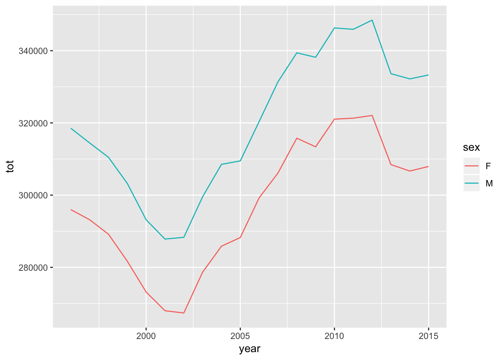
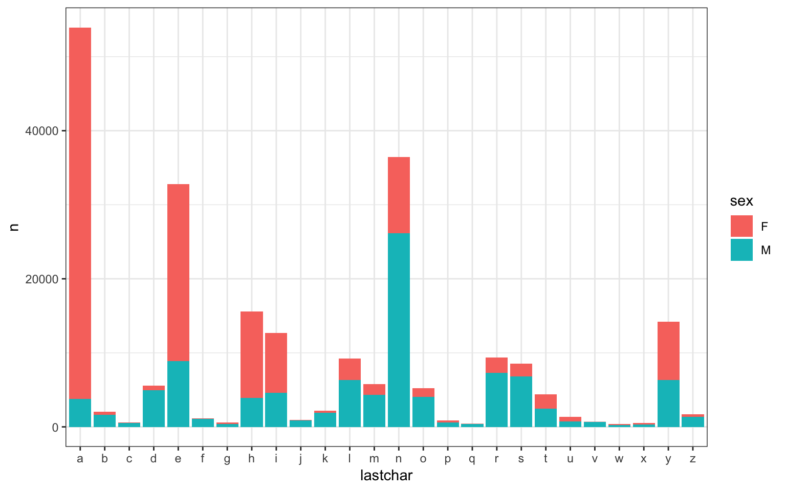
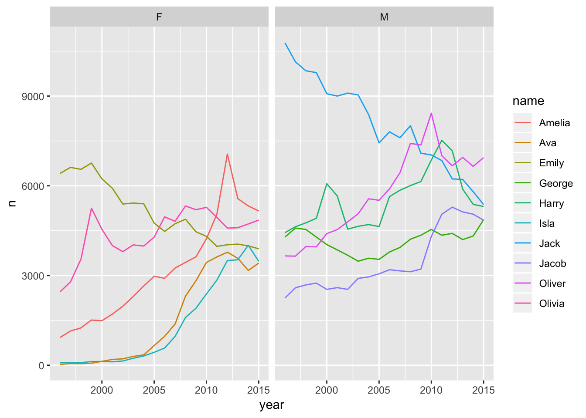
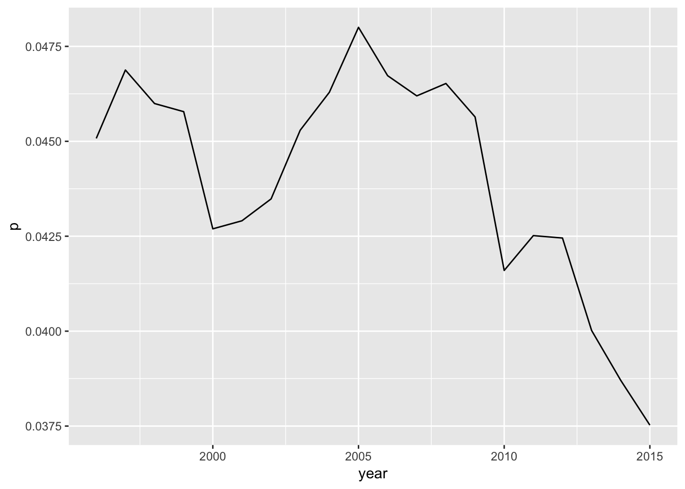
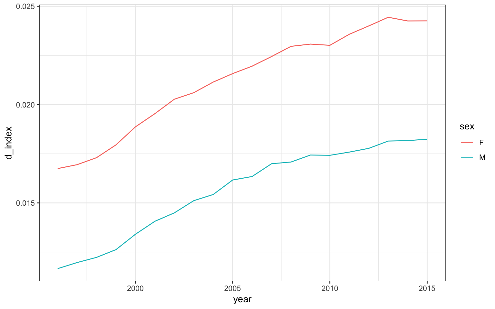

# Data Wrangling {#dplyr}

# Learning Objectives {.tabset}

## Basic

* Be able to use the 6 main dplyr one-table verbs:
    + `select()`
    + `filter()`
    + `arrange()`
    + `mutate()`
    + `summarise()`
    + `group_by()`

* Also know these additional one-table verbs:
    + `rename()`
    + `distinct()`
    + `count()`
    + `slice()`
    + `pull()`
    
* Be able to string together commands using pipes `%>%`

## Intermediate/Advanced

- Fine control of `select()` operations
- Perform 'windowed' operations.
  + windowed `mutate()`
  + windowed `slice()`

# Prep

* Read [Chapter 5: Data Transformation](http://r4ds.had.co.nz/transform.html) in *R for Data Science*

# Resources

* [Data transformation cheat sheet](https://github.com/rstudio/cheatsheets/raw/master/source/pdfs/data-transformation-cheatsheet.pdf)

* [Lecture slides on dplyr one-table verbs](slides/04_dplyr_slides.pdf)

# Formative exercises

Download the [formative exercises](formative_exercises/05_wrangle2_stub.Rmd). See the [answers](formative_exercises/05_wrangle2_answers.Rmd) only after you've attempted all the questions.

# Class notes

## Setup

You'll need the following two packages. Might as well convert to a tibble to make printing prettier.


```r
  library("tidyverse")
```

```
## ── Attaching packages ──────────────────────────────────────────────────── tidyverse 1.2.1 ──
```

```
## ✔ ggplot2 3.1.0     ✔ purrr   0.2.5
## ✔ tibble  1.4.2     ✔ dplyr   0.7.8
## ✔ tidyr   0.8.2     ✔ stringr 1.3.1
## ✔ readr   1.3.0     ✔ forcats 0.3.0
```

```
## ── Conflicts ─────────────────────────────────────────────────────── tidyverse_conflicts() ──
## ✖ dplyr::filter() masks stats::filter()
## ✖ dplyr::lag()    masks stats::lag()
```

```r
  library("ukbabynames")

  ## convert to a tibble
  ukb <- as_tibble(ukbabynames)
```

## In-class tasks

### Easy

1. How many records are in the dataset?

    <div class="solution"><button>Solution</button>
    
    ```r
      count(ukb) ## or: nrow(ukb)
    ```
    
    ```
    ## # A tibble: 1 x 1
    ##       nn
    ##    <int>
    ## 1 227449
    ```
    </div>

2. Remove the column `rank` from the dataset.

    <div class="solution"><button>Solution</button>
    
    ```r
      ukb %>%
        select(-rank)
    ```
    
    ```
    ## # A tibble: 227,449 x 4
    ##     year sex   name          n
    ##    <dbl> <chr> <chr>     <dbl>
    ##  1  1996 F     Sophie     7087
    ##  2  1996 F     Chloe      6824
    ##  3  1996 F     Jessica    6711
    ##  4  1996 F     Emily      6415
    ##  5  1996 F     Lauren     6299
    ##  6  1996 F     Hannah     5916
    ##  7  1996 F     Charlotte  5866
    ##  8  1996 F     Rebecca    5828
    ##  9  1996 F     Amy        5206
    ## 10  1996 F     Megan      4948
    ## # ... with 227,439 more rows
    ```
    </div>

3. What is the range of birth years contained in the dataset?

    <div class="solution"><button>Solution</button>
    
    ```r
      ukb %>%
        summarise(minyear = min(year),
                  maxyear = max(year))
    ```
    
    ```
    ## # A tibble: 1 x 2
    ##   minyear maxyear
    ##     <dbl>   <dbl>
    ## 1    1996    2015
    ```
    </div>


4. Pull out the babies named Hermione.

    <div class="solution"><button>Solution</button>
    
    ```r
    ukb %>%
      filter(name == "Hermione")
    ```
    
    ```
    ## # A tibble: 20 x 5
    ##     year sex   name         n  rank
    ##    <dbl> <chr> <chr>    <dbl> <dbl>
    ##  1  1996 F     Hermione    21   974
    ##  2  1997 F     Hermione    29   789
    ##  3  1998 F     Hermione    40   628
    ##  4  1999 F     Hermione    35   678
    ##  5  2000 F     Hermione    40   637
    ##  6  2001 F     Hermione    52   540
    ##  7  2002 F     Hermione    84   394
    ##  8  2003 F     Hermione   158   265
    ##  9  2004 F     Hermione   162   265
    ## 10  2005 F     Hermione   122   331
    ## 11  2006 F     Hermione   118   359
    ## 12  2007 F     Hermione   109   385
    ## 13  2008 F     Hermione   129   348
    ## 14  2009 F     Hermione   116   370
    ## 15  2010 F     Hermione   111   398
    ## 16  2011 F     Hermione   118   392
    ## 17  2012 F     Hermione    97   465
    ## 18  2013 F     Hermione    77   542
    ## 19  2014 F     Hermione    85   500
    ## 20  2015 F     Hermione    79   549
    ```
    </div>

5. Sort the dataset by sex and then by year (descending) and then by rank (descending).

    <div class="solution"><button>Solution</button>
    
    ```r
    ukb %>%
      arrange(sex, desc(year), desc(rank))
    ```
    
    ```
    ## # A tibble: 227,449 x 5
    ##     year sex   name            n  rank
    ##    <dbl> <chr> <chr>       <dbl> <dbl>
    ##  1  2015 F     Aabidah         3  5730
    ##  2  2015 F     Aabish          3  5730
    ##  3  2015 F     Aaeesha         3  5730
    ##  4  2015 F     Aafreen         3  5730
    ##  5  2015 F     Aaiza           3  5730
    ##  6  2015 F     Aakifa          3  5730
    ##  7  2015 F     Aala            3  5730
    ##  8  2015 F     Aaliyah-Mai     3  5730
    ##  9  2015 F     Aaliyah-may     3  5730
    ## 10  2015 F     Aamena          3  5730
    ## # ... with 227,439 more rows
    ```
    </div>

6. Create a new column, `decade`, that contains the decade of birth (1990, 2000, 2010).  Hint: see `?floor`

    <div class="solution"><button>Solution</button>
    
    ```r
      ukb %>%
        mutate(decade = floor(year / 10) * 10)
    ```
    
    ```
    ## # A tibble: 227,449 x 6
    ##     year sex   name          n  rank decade
    ##    <dbl> <chr> <chr>     <dbl> <dbl>  <dbl>
    ##  1  1996 F     Sophie     7087     1   1990
    ##  2  1996 F     Chloe      6824     2   1990
    ##  3  1996 F     Jessica    6711     3   1990
    ##  4  1996 F     Emily      6415     4   1990
    ##  5  1996 F     Lauren     6299     5   1990
    ##  6  1996 F     Hannah     5916     6   1990
    ##  7  1996 F     Charlotte  5866     7   1990
    ##  8  1996 F     Rebecca    5828     8   1990
    ##  9  1996 F     Amy        5206     9   1990
    ## 10  1996 F     Megan      4948    10   1990
    ## # ... with 227,439 more rows
    ```
    </div>

7. Pull out the male babies named Courtney that were born between 1998 and 2001 (inclusive).

    <div class="solution"><button>Solution</button>
    
    ```r
        ukb %>%
          filter(name == "Courtney", sex == "M",
                 year >= 1998, year <= 2001)
    ```
    
    ```
    ## # A tibble: 4 x 5
    ##    year sex   name         n  rank
    ##   <dbl> <chr> <chr>    <dbl> <dbl>
    ## 1  1998 M     Courtney    33   554
    ## 2  1999 M     Courtney    15   973
    ## 3  2000 M     Courtney    19   848
    ## 4  2001 M     Courtney    22   786
    ```
    </div>


8. How many distinct names are represented in the dataset?

    <div class="solution"><button>Solution</button>
    
    ```r
    ## how many distinct names are represented in the dataset?
    ukb %>%
      distinct(name) %>%
      count()
    ```
    
    ```
    ## # A tibble: 1 x 1
    ##       n
    ##   <int>
    ## 1 31272
    ```
    </div>


9. Pull out all the female babies named Frankie that were born before 1999 or after 2010

    <div class="solution"><button>Solution</button>
    
    ```r
      ukb %>%
        filter(name == "Frankie", sex == "F",
              (year < 1999) | (year > 2010))
    ```
    
    ```
    ## # A tibble: 8 x 5
    ##    year sex   name        n  rank
    ##   <dbl> <chr> <chr>   <dbl> <dbl>
    ## 1  1996 F     Frankie    34   686
    ## 2  1997 F     Frankie    48   545
    ## 3  1998 F     Frankie    41   619
    ## 4  2011 F     Frankie   337   156
    ## 5  2012 F     Frankie   298   173
    ## 6  2013 F     Frankie   273   195
    ## 7  2014 F     Frankie   344   162
    ## 8  2015 F     Frankie   376   147
    ```
    </div>

10. How many total babies in the dataset were named 'Emily'?

    <div class="solution"><button>Solution</button>
    
    ```r
      ## 
      ukb %>%
        filter(name == "Emily") %>%
        summarise(tot = sum(n)) %>%
        pull(tot)
    ```
    
    ```
    ## [1] 102250
    ```
    </div>

11. How many distinct names are there for each sex?

    <div class="solution"><button>Solution</button>
    
    ```r
      ukb %>% 
        group_by(sex) %>%
        distinct(name) %>%
        count()
    ```
    
    ```
    ## # A tibble: 2 x 2
    ## # Groups:   sex [2]
    ##   sex       n
    ##   <chr> <int>
    ## 1 F     18823
    ## 2 M     14378
    ```
    </div>

12. What is the most popular name in the dataset?

    <div class="solution"><button>Solution</button>
    
    ```r
      ukb %>%
        group_by(name) %>%
        summarise(tot = sum(n)) %>%
        arrange(desc(tot)) %>%
        slice(1) %>%
        pull(name)
    ```
    
    ```
    ## [1] "Jack"
    ```
    </div>

13. How many babies were born each year for each sex?  Make a plot.

    <div class="solution"><button>Solution</button>
    
    ```r
      babes_per_year <- ukb %>%
        group_by(year, sex) %>%
        summarise(tot = sum(n))
    
      ggplot(babes_per_year, aes(year, tot, color = sex)) +
        geom_line()
    ```
    
    
    </div>

### Intermediate

- For the next questions, you might first want to read about window functions (`group_by()` + `filter()` or `mutate()` in the dplyr vignette: `vignette("window-functions")`.

1. Create a column `prop` that contains the proportion of babies that were given a particular name for a given sex in a given year, then `ungroup()` the resulting table.

    <div class="solution"><button>Solution</button>
    
    ```r
      ukb_prop <- ukb %>%
        group_by(year, sex) %>%
        mutate(p = n / sum(n)) %>%
        ungroup()
    
      ## TODO double check that you did it right by making sure the props 
      ## for each year/sex combo sum to 1
    ```
    </div>

2. Use a window function to pull out the top year for each name/sex combination in the table you just created (i.e., the year when the name was given to greatest proportion of babies of a given sex).

    <div class="solution"><button>Solution</button>
    
    ```r
      ukb_top_year <- ukb_prop %>%
        group_by(name, sex) %>%
        filter(p == max(p)) %>%
        ungroup() %>%
        arrange(year)
    ```
    </div>


### Advanced

1. Make a frequency histogram for the final letter of each name, broken down by sex.  Are certain final letters more "gendered" than others?

    <div class="solution"><button>Solution</button>
    
    ```r
      last_letter <- ukb %>%
        mutate(lastchar = substr(name, nchar(name), nchar(name))) %>%
        filter(lastchar %in% letters) %>%
        count(sex, lastchar) %>%
        arrange(lastchar)
    
      ggplot(last_letter, aes(lastchar, nn, fill = sex)) +
        geom_bar(stat = "identity")
    ```
    
    
    </div>

2. Calculate the top 5 boys and girls names for each decade and print out the whole table.

    <div class="solution"><button>Solution</button>
    
    ```r
      ukb %>%
        mutate(decade = floor(year / 10) * 10) %>%
        group_by(decade, sex, name) %>%
        summarise(tot_n = sum(n)) %>%
        arrange(desc(tot_n)) %>%
        slice(1:5) %>%
        ungroup() %>%
        print(n = +Inf)
    ```
    
    ```
    ## # A tibble: 30 x 4
    ##    decade sex   name    tot_n
    ##     <dbl> <chr> <chr>   <dbl>
    ##  1   1990 F     Chloe   33235
    ##  2   1990 F     Emily   26341
    ##  3   1990 F     Sophie  24111
    ##  4   1990 F     Megan   23363
    ##  5   1990 F     Jessica 23319
    ##  6   1990 M     Jack    40554
    ##  7   1990 M     Thomas  38004
    ##  8   1990 M     James   37183
    ##  9   1990 M     Daniel  34052
    ## 10   1990 M     Joshua  30532
    ## 11   2000 F     Emily   51663
    ## 12   2000 F     Chloe   50965
    ## 13   2000 F     Jessica 48023
    ## 14   2000 F     Olivia  44937
    ## 15   2000 F     Sophie  44885
    ## 16   2000 M     Jack    82540
    ## 17   2000 M     Thomas  70475
    ## 18   2000 M     Joshua  69428
    ## 19   2000 M     James   59247
    ## 20   2000 M     Oliver  56990
    ## 21   2010 F     Amelia  32397
    ## 22   2010 F     Olivia  28977
    ## 23   2010 F     Emily   24246
    ## 24   2010 F     Jessica 21690
    ## 25   2010 F     Lily    21379
    ## 26   2010 M     Oliver  42642
    ## 27   2010 M     Harry   38128
    ## 28   2010 M     Jack    37492
    ## 29   2010 M     Charlie 31009
    ## 30   2010 M     Jacob   29667
    ```
    </div>

3. Pull out the top 5 boys and girls names for the final year of the dataset, and plot the historical trajectory of their popularity, with separate graphs for boys and girls. (Hint: This might require merging tables, which you will learn about next week.)

    <div class="solution"><button>Solution</button>
    
    ```r
      top_names <- ukb %>%
        filter(year == max(year), rank <= 5) %>%
        select(sex, name)
    
      ukb %>%
        inner_join(top_names, c("sex", "name")) %>%
        ggplot(aes(year, n, color = name)) +
          geom_line() +
          facet_wrap(~sex)
    ```
    
    
    </div>

4. What are the 10 most androgynous names in the UK?  Discard any names that were given to less than 5000 babies total.  Calculate an "androgyny index" for each name as log(F + .5) - log(M + .5) where F is the number of female and M is the number of male babies.  This index will be zero for perfect gender balance, positive for skewed female, and negative for skewed male.

    <div class="solution"><button>Solution</button>
    
    ```r
      andro <- ukb %>%
        group_by(sex, name) %>%
        summarise(tot = sum(n)) %>%
        ungroup() %>%
        spread(sex, tot, fill = 0) %>%
        mutate(N = F + M)
    
      andro_gbal <- andro %>%
        filter(N >= 5000) %>%
        mutate(gbal = log(F + .5) - log(M + .5),
               tot = F + M) %>%
        arrange(abs(gbal)) %>%
        slice(1:10)
    ```
    </div>

5. Which girl name has increased the most in popularity, if you directly compare the first year of the dataset to the last year?  Which girl name has decreased the most?  (Only comare names that were given to at least 500 babies in at least one of the years covered by the dataset.)

    <div class="solution"><button>Solution</button>
    
    ```r
      name_pop <- ukb %>%
        filter(sex == "F", (year == 1996) | (year == 2015)) %>%
        spread(year, n, fill = 0) %>%
        filter(`2015` > 500 | `1996` > 500) %>%
        mutate(chg = `2015` - `1996`)
    
      name_pop %>%
        arrange(desc(chg)) %>%
        slice(1) %>%
        pull(name)
    ```
    
    ```
    ## [1] "Amelia"
    ```
    
    ```r
      name_pop %>%
        arrange(chg) %>%
        slice(1) %>%
        pull(name)
    ```
    
    ```
    ## [1] "Sophie"
    ```
    </div>

6. Calculate the proportion of names that are androgynous for each year in the dataset (were given to both male and female babies) and then plot the historical trend.

    <div class="solution"><button>Solution</button>
    
    ```r
      p_andro <- ukb %>%
        select(-rank) %>%
        spread(sex, n, fill = 0) %>%
        mutate(is_andro = (F != 0) & (M != 0)) %>%
        group_by(year) %>%
        summarise(p = mean(is_andro))
    
      ggplot(p_andro, aes(year, p)) + geom_line()
    ```
    
    
    </div>

7. *Naming diversity trends.* Calculate a naming diversity index (number of names divided by number of babies) for each year and sex in the dataset.  Plot the historical trend for naming diversity.

    <div class="solution"><button>Solution</button>
    
    ```r
      ndiversity <- ukb %>%
        group_by(year, sex) %>%
        summarise(n_names = n_distinct(name),
                  n_babies = sum(n),
                  d_index = n_names / n_babies) %>%
        ungroup()
    
      ggplot(ndiversity,
    	      aes(year, d_index, color = sex)) + geom_line()
    ```
    
    
    </div>


## Other things you can try: The `disgust` dataset

Some of the tasks below involve the use of the `lubridate` package for working with dates and times.  See R4DS:

* [Chapter 16: Date and times](http://r4ds.had.co.nz/dates-and-times.html) in *R for Data Science*


```r
# libraries needed for these examples
library(lubridate)
library(tidyverse)
```

These examples will use data from [disgust.csv](https://gupsych.github.io/data_skills/data/disgust.csv), which contains
data from the [Three Domain Disgust Scale](http://digitalrepository.unm.edu/cgi/viewcontent.cgi?article=1139&context=psy_etds).
Each participant is identified by a unique `user_id` and each questionnaire 
completion has a unique `id`.


```r
disgust <- read_csv("https://gupsych.github.io/data_skills/data/disgust.csv")
```

*Questionnaire Instructions*: The following items describe a variety of concepts. 
Please rate how disgusting you find the concepts described in the items, where 0 
means that you do not find the concept disgusting at all, and 6 means that you 
find the concept extremely disgusting.

| colname   | question                                                                          |
|----------:|:----------------------------------------------------------------------------------|
| moral1 	  | Shoplifting a candy bar from a convenience store                                  |
| moral2	  | Stealing from a neighbor                                                          |
| moral3	  | A student cheating to get good grades                                             |
| moral4	  | Deceiving a friend                                                                |
| moral5	  | Forging someone's signature on a legal document                                   |
| moral6	  | Cutting to the front of a line to purchase the last few tickets to a show         |
| moral7	  | Intentionally lying during a business transaction                                 |
| sexual1	  | Hearing two strangers having sex                                                  |
| sexual2	  | Performing oral sex                                                               |
| sexual3	  | Watching a pornographic video                                                     |
| sexual4	  | Finding out that someone you don't like has sexual fantasies about you            |
| sexual5	  | Bringing someone you just met back to your room to have sex                       |
| sexual6	  | A stranger of the opposite sex intentionally rubbing your thigh in an elevator    |
| sexual7	  | Having anal sex with someone of the opposite sex                                  |
| pathogen1	| Stepping on dog poop                                                              |
| pathogen2	| Sitting next to someone who has red sores on their arm                            |
| pathogen3	| Shaking hands with a stranger who has sweaty palms                                |
| pathogen4	| Seeing some mold on old leftovers in your refrigerator                            |
| pathogen5	| Standing close to a person who has body odor                                      |
| pathogen6	| Seeing a cockroach run across the floor                                           |
| pathogen7	| Accidentally touching a person's bloody cut                                       |

### select()

<a name="#select"></a>
Select columns by name or number.

You can select each column individually, separated by commas (e.g., `col1, col2`). 
You can also select all columns between two columns by separating them with a 
colon (e.g., `start_col:end_col`).


```r
moral <- disgust %>% select(user_id, moral1:moral7)
glimpse(moral)
```

```
## Observations: 20,000
## Variables: 8
## $ user_id <dbl> 0, 1, 2, 2118, 2311, 3630, 4458, 4651, 4976, 5469, 606...
## $ moral1  <dbl> 5, 2, 1, 0, 4, 1, 3, 2, 6, 0, 4, 1, 1, 4, 2, 1, NA, 3,...
## $ moral2  <dbl> 6, 2, 1, 1, 4, 5, 4, 4, 6, 1, 5, 2, 4, 4, 5, 3, NA, 5,...
## $ moral3  <dbl> 4, 1, 1, 1, 4, NA, 3, 3, 6, 3, 6, 2, 3, 4, 4, 2, NA, 4...
## $ moral4  <dbl> 6, 2, 1, 1, 4, 5, 4, 5, 0, 4, 5, 2, 4, 4, 6, 4, NA, 5,...
## $ moral5  <dbl> 5, 1, NA, 1, 4, 5, 4, 5, 6, 1, 5, 1, 3, 3, 5, 5, NA, 3...
## $ moral6  <dbl> 5, 1, NA, 2, 4, 5, 3, 5, 0, 0, 4, 2, 4, 3, 4, 4, NA, 4...
## $ moral7  <dbl> 6, 1, 1, 1, 4, 1, 3, 3, 0, 1, 4, 1, 3, 2, 5, 4, NA, 3,...
```

You can select colmns by number, which is useful when the column names are long or complicated.


```r
sexual <- disgust %>% select(2, 11:17)
glimpse(sexual)
```

```
## Observations: 20,000
## Variables: 8
## $ user_id <dbl> 0, 1, 2, 2118, 2311, 3630, 4458, 4651, 4976, 5469, 606...
## $ sexual1 <dbl> 4, 3, 1, 4, 2, 0, 2, 4, 0, 3, 3, 1, 1, 4, 2, 0, NA, 1,...
## $ sexual2 <dbl> 0, 1, NA, 3, 1, 5, 4, 2, 0, 5, 0, 0, 0, 2, 1, 0, NA, 3...
## $ sexual3 <dbl> 1, 1, 1, 0, 2, 0, 3, 4, 0, 2, 1, 0, 0, 1, 0, 0, NA, 3,...
## $ sexual4 <dbl> 0, 2, NA, 6, 1, 2, 2, 6, 0, 4, 6, 3, 1, 3, 2, 0, NA, 5...
## $ sexual5 <dbl> 1, 1, 1, 0, 1, 0, 1, 6, 0, 6, 3, 0, 0, 2, 1, 0, NA, 5,...
## $ sexual6 <dbl> 4, 2, NA, 3, 1, 1, 5, 6, 0, 6, 5, 4, 2, 3, 4, 0, NA, 3...
## $ sexual7 <dbl> 5, 2, NA, 5, 5, 0, 4, 2, 0, 5, 3, 4, 1, 6, 3, 0, NA, 3...
```

You can use a minus symbol to unselect columns, leaving all of the other columns. 
If you want to exclude a span of columns, put parentheses around the span first 
(e.g., `-(moral1:moral7)`, not `-moral1:moral7`).


```r
pathogen <- disgust %>% select(-id, -date, -(moral1:sexual7))
glimpse(pathogen)
```

```
## Observations: 20,000
## Variables: 8
## $ user_id   <dbl> 0, 1, 2, 2118, 2311, 3630, 4458, 4651, 4976, 5469, 6...
## $ pathogen1 <dbl> 6, 3, NA, 5, 5, 6, 6, 5, 6, 5, 6, 4, 4, 5, 3, 5, NA,...
## $ pathogen2 <dbl> 1, 2, NA, 6, 5, 3, 4, 6, 6, 2, 5, 3, 4, 2, 3, 4, NA,...
## $ pathogen3 <dbl> 6, 3, 1, 4, 4, 1, 4, 6, 6, 4, 5, 1, 3, 0, 2, 3, NA, ...
## $ pathogen4 <dbl> 5, 3, NA, 6, 4, 1, 3, 4, 6, 4, 5, 1, 4, 4, 4, 1, NA,...
## $ pathogen5 <dbl> 4, 2, NA, 5, 5, 3, 3, 6, 0, 2, 5, 4, 5, 5, 5, 4, NA,...
## $ pathogen6 <dbl> 5, 3, NA, 5, 4, 1, 2, 1, 0, 2, 5, 1, 4, 5, 1, 2, NA,...
## $ pathogen7 <dbl> 6, 3, NA, 4, 3, 0, 3, 6, 6, 6, 5, 3, 5, 4, 5, 3, NA,...
```

### select() helpers 

<a name="#select_helpers"></a>
You can select columns based on criteria about the column names.

#### `starts_with()`

<a name="#starts_with"></a>
Select columns that start with a character string.


```r
u <- disgust %>% select(starts_with("u"))
glimpse(u)
```

```
## Observations: 20,000
## Variables: 1
## $ user_id <dbl> 0, 1, 2, 2118, 2311, 3630, 4458, 4651, 4976, 5469, 606...
```

#### `ends_with()`

<a name="#ends_with"></a>
Select columns that end with a character string.


```r
firstq <- disgust %>% select(ends_with("1"))
glimpse(firstq)
```

```
## Observations: 20,000
## Variables: 3
## $ moral1    <dbl> 5, 2, 1, 0, 4, 1, 3, 2, 6, 0, 4, 1, 1, 4, 2, 1, NA, ...
## $ sexual1   <dbl> 4, 3, 1, 4, 2, 0, 2, 4, 0, 3, 3, 1, 1, 4, 2, 0, NA, ...
## $ pathogen1 <dbl> 6, 3, NA, 5, 5, 6, 6, 5, 6, 5, 6, 4, 4, 5, 3, 5, NA,...
```

#### `contains()`

<a name="#contains"></a>
Select columns that contain a character string.


```r
pathogen <- disgust %>% select(contains("pathogen"))
glimpse(pathogen)
```

```
## Observations: 20,000
## Variables: 7
## $ pathogen1 <dbl> 6, 3, NA, 5, 5, 6, 6, 5, 6, 5, 6, 4, 4, 5, 3, 5, NA,...
## $ pathogen2 <dbl> 1, 2, NA, 6, 5, 3, 4, 6, 6, 2, 5, 3, 4, 2, 3, 4, NA,...
## $ pathogen3 <dbl> 6, 3, 1, 4, 4, 1, 4, 6, 6, 4, 5, 1, 3, 0, 2, 3, NA, ...
## $ pathogen4 <dbl> 5, 3, NA, 6, 4, 1, 3, 4, 6, 4, 5, 1, 4, 4, 4, 1, NA,...
## $ pathogen5 <dbl> 4, 2, NA, 5, 5, 3, 3, 6, 0, 2, 5, 4, 5, 5, 5, 4, NA,...
## $ pathogen6 <dbl> 5, 3, NA, 5, 4, 1, 2, 1, 0, 2, 5, 1, 4, 5, 1, 2, NA,...
## $ pathogen7 <dbl> 6, 3, NA, 4, 3, 0, 3, 6, 6, 6, 5, 3, 5, 4, 5, 3, NA,...
```

#### `num_range(prefix, range, width = NULL)`

<a name="#num_range"></a>
Select columns with a name that matches the pattern `prefix#`.


```r
moral2_4 <- disgust %>% select(num_range("moral", 2:4))
glimpse(moral2_4)
```

```
## Observations: 20,000
## Variables: 3
## $ moral2 <dbl> 6, 2, 1, 1, 4, 5, 4, 4, 6, 1, 5, 2, 4, 4, 5, 3, NA, 5, ...
## $ moral3 <dbl> 4, 1, 1, 1, 4, NA, 3, 3, 6, 3, 6, 2, 3, 4, 4, 2, NA, 4,...
## $ moral4 <dbl> 6, 2, 1, 1, 4, 5, 4, 5, 0, 4, 5, 2, 4, 4, 6, 4, NA, 5, ...
```

<p class="alert alert-info">Use `width` to set the number of digits with leading
zeros. For example, `num_range("var_", 8:10, width=2)` selects columns `var_08`, 
`var_09`, and `var_10`.</p>

### filter()

<a name="#filter"></a>
Select rows by matching column criteria.

Select all rows where the user_id is 1 (that's Lisa). 


```r
disgust %>% filter(user_id == 1)
```

```
## # A tibble: 1 x 24
##      id user_id date       moral1 moral2 moral3 moral4 moral5 moral6 moral7
##   <dbl>   <dbl> <date>      <dbl>  <dbl>  <dbl>  <dbl>  <dbl>  <dbl>  <dbl>
## 1     1       1 2008-07-10      2      2      1      2      1      1      1
## # ... with 14 more variables: sexual1 <dbl>, sexual2 <dbl>, sexual3 <dbl>,
## #   sexual4 <dbl>, sexual5 <dbl>, sexual6 <dbl>, sexual7 <dbl>,
## #   pathogen1 <dbl>, pathogen2 <dbl>, pathogen3 <dbl>, pathogen4 <dbl>,
## #   pathogen5 <dbl>, pathogen6 <dbl>, pathogen7 <dbl>
```

<p class="alert alert-warning">Remember to use `==` and not `=` to check if two 
things are equivalent. A single `=` assigns the righthand value to the lefthand 
variable and (usually) evaluates to `TRUE`.</p>

You can select on multiple criteria by separating them with commas.


```r
amoral <- disgust %>% filter(
  moral1 == 0, 
  moral2 == 0,
  moral3 == 0, 
  moral4 == 0,
  moral5 == 0,
  moral6 == 0,
  moral7 == 0
)
```

You can use the symbols `&`, `|`, and `!` to mean "and", "or", and "not". 
You can also use other operators to make equations.


```r
# everyone who chose either 0 or 7 for question moral1
moral_extremes <- disgust %>% 
  filter(moral1 == 0 | moral1 == 7)

# everyone who chose the same answer for all moral questions
moral_consistent <- disgust %>% 
  filter(
    moral2 == moral1 & 
      moral3 == moral1 & 
      moral4 == moral1 &
      moral5 == moral1 &
      moral6 == moral1 &
      moral7 == moral1
  )

# everyone who did not answer 7 for all 7 moral questions
moral_no_ceiling <- disgust %>%
  filter(moral1+moral2+moral3+moral4+moral5+moral6+moral7 != 7*7)
```

Sometimes you need to exclude some participant IDs for reasons that can't be 
described in code. the `%in%` operator is useful here for testing if a column 
value is in a list. Surround the equation with parentheses and put `!` in front 
to test that a value is not in the list.


```r
no_researchers <- disgust %>%
  filter(!(user_id %in% c(1,2)))
```

<a name="#dates"></a>
You can use the `lubridate` package to work with dates. For example, you can use 
the `year()` function to return just the year from the `date` column and then 
select only data collected in 2010.


```r
disgust2010 <- disgust  %>%
  filter(year(date) == 2010)
```

Or select data from at least 5 years ago. You can use the `range` function to 
check the minimum and maxiumum dates in the resulting dataset.


```r
disgust_5ago <- disgust %>%
  filter(date < today() - dyears(5))

range(disgust_5ago$date)
```

```
## [1] "2008-07-10" "2014-01-19"
```


### arrange()

<a name="#arrange"></a>
Sort your dataset using `arrange()`.


```r
disgust_order <- disgust %>%
  arrange(id)

head(disgust_order)
```

```
## # A tibble: 6 x 24
##      id user_id date       moral1 moral2 moral3 moral4 moral5 moral6 moral7
##   <dbl>   <dbl> <date>      <dbl>  <dbl>  <dbl>  <dbl>  <dbl>  <dbl>  <dbl>
## 1     1       1 2008-07-10      2      2      1      2      1      1      1
## 2     3  155324 2008-07-11      2      4      3      5      2      1      4
## 3     4  155366 2008-07-12      6      6      6      3      6      6      6
## 4     5  155370 2008-07-12      6      6      4      6      6      6      6
## 5     6  155386 2008-07-12      2      4      0      4      0      0      0
## 6     7  155409 2008-07-12      4      5      5      4      5      1      5
## # ... with 14 more variables: sexual1 <dbl>, sexual2 <dbl>, sexual3 <dbl>,
## #   sexual4 <dbl>, sexual5 <dbl>, sexual6 <dbl>, sexual7 <dbl>,
## #   pathogen1 <dbl>, pathogen2 <dbl>, pathogen3 <dbl>, pathogen4 <dbl>,
## #   pathogen5 <dbl>, pathogen6 <dbl>, pathogen7 <dbl>
```

Reverse the order using `desc()`


```r
disgust_order <- disgust %>%
  arrange(desc(id))

head(disgust_order)
```

```
## # A tibble: 6 x 24
##      id user_id date       moral1 moral2 moral3 moral4 moral5 moral6 moral7
##   <dbl>   <dbl> <date>      <dbl>  <dbl>  <dbl>  <dbl>  <dbl>  <dbl>  <dbl>
## 1 39456  356866 2017-08-21      1      1      1      1      1      1      1
## 2 39447  128727 2017-08-13      2      4      1      2      2      5      3
## 3 39371  152955 2017-06-13      6      6      3      6      6      6      6
## 4 39342   48303 2017-05-22      4      5      4      4      6      4      5
## 5 39159  151633 2017-04-04      4      5      6      5      3      6      2
## 6 38942  370464 2017-02-01      1      5      0      6      5      5      5
## # ... with 14 more variables: sexual1 <dbl>, sexual2 <dbl>, sexual3 <dbl>,
## #   sexual4 <dbl>, sexual5 <dbl>, sexual6 <dbl>, sexual7 <dbl>,
## #   pathogen1 <dbl>, pathogen2 <dbl>, pathogen3 <dbl>, pathogen4 <dbl>,
## #   pathogen5 <dbl>, pathogen6 <dbl>, pathogen7 <dbl>
```


### mutate()

<a name="#mutate"></a>
Add new columns. This is one of the most useful functions in the tidyverse.

Refer to other columns by their names (unquoted). You can add more than one column, 
just separate the columns with a comma. Once you make a new column, you can use 
it in further column definitions e.g., `total` below).


```r
disgust_total <- disgust %>%
  mutate(
    pathogen = pathogen1 + pathogen2 + pathogen3 + pathogen4 + pathogen5 + pathogen6 + pathogen7,
    moral = moral1 + moral2 + moral3 + moral4 + moral5 + moral6 + moral7,
    sexual = sexual1 + sexual2 + sexual3 + sexual4 + sexual5 + sexual6 + sexual7,
    total = pathogen + moral + sexual,
    user_id = paste0("U", user_id)
  )
```

<p class="alert alert-warning">You can overwrite a column by giving a new column 
the same name as the old column. Make sure that you mean to do this and that you 
aren't trying to use the old column value after you redefine it.</p>

### summarise()

<a name="#summarise"></a>
Create summary statistics for the dataset. Check the [Data Wrangling Cheat Sheet](https://www.rstudio.org/links/data_wrangling_cheat_sheet) or the 
[Data Transformation Cheat Sheet](https://github.com/rstudio/cheatsheets/raw/master/source/pdfs/data-transformation-cheatsheet.pdf) for various summary functions. Some common ones are: `mean()`, `sd()`, 
`n()`, `sum()`, and `quantile()`.


```r
disgust_total %>%
  summarise(
    n = n(),
    q25 = quantile(total, .25, na.rm = TRUE),
    q50 = quantile(total, .50, na.rm = TRUE),
    q75 = quantile(total, .75, na.rm = TRUE),
    avg_total = mean(total, na.rm = TRUE),
    sd_total  = sd(total, na.rm = TRUE),
    min_total = min(total, na.rm = TRUE),
    max_total = max(total, na.rm = TRUE)
  )
```

```
## # A tibble: 1 x 8
##       n   q25   q50   q75 avg_total sd_total min_total max_total
##   <int> <dbl> <dbl> <dbl>     <dbl>    <dbl>     <dbl>     <dbl>
## 1 20000    59    71    83      70.7     18.2         0       126
```


### group_by()

<a name="#group_by"></a>
Create subsets of the data. You can use this to create summaries, 
like the mean value for all of your experimental groups.

Here, we'll use `mutate` to create a new column called `year`, group by `year`,
and calculate the average scores.


```r
disgust_total %>%
  mutate(year = year(date)) %>%
  group_by(year) %>%
  summarise(
    n = n(),
    avg_total = mean(total, na.rm = TRUE),
    sd_total  = sd(total, na.rm = TRUE),
    min_total = min(total, na.rm = TRUE),
    max_total = max(total, na.rm = TRUE)
  )
```

```
## # A tibble: 10 x 6
##     year     n avg_total sd_total min_total max_total
##    <dbl> <int>     <dbl>    <dbl>     <dbl>     <dbl>
##  1  2008  2578      70.3     18.5         0       126
##  2  2009  2580      69.7     18.6         3       126
##  3  2010  1514      70.6     18.9         6       126
##  4  2011  6046      71.3     17.8         0       126
##  5  2012  5938      70.4     18.4         0       126
##  6  2013  1251      71.6     17.6         0       126
##  7  2014    58      70.5     17.2        19       113
##  8  2015    21      74.3     16.9        43       107
##  9  2016     8      67.9     32.6         0       110
## 10  2017     6      57.2     27.9        21        90
```

You can use `filter` after `group_by`. The following example returns the lowest 
total score from each year.


```r
disgust_total %>%
  mutate(year = year(date)) %>%
  select(user_id, year, total) %>%
  group_by(year) %>%
  filter(rank(total) == 1) %>%
  arrange(year)
```

```
## # A tibble: 7 x 3
## # Groups:   year [7]
##   user_id  year total
##   <chr>   <dbl> <dbl>
## 1 U236585  2009     3
## 2 U292359  2010     6
## 3 U245384  2013     0
## 4 U206293  2014    19
## 5 U407089  2015    43
## 6 U453237  2016     0
## 7 U356866  2017    21
```

You can also use `mutate` after `group_by`. The following example calculates 
subject-mean-centered scores by grouping the scores by `user_id` and then 
subtracting the group-specific mean from each score. <span class="text-warning">
Note the use of `gather` to tidy the data into a long format first.</span>


```r
disgust_smc <- disgust %>%
  gather("question", "score", moral1:pathogen7) %>%
  group_by(user_id) %>%
  mutate(score_smc = score - mean(score, na.rm = TRUE))
```


### All Together

A lot of what we did above would be easier if the data were tidy, so let's do 
that first. Then we can use `group_by` to calculate the domain scores.

<p class="alert alert-warning">It is good practice to use `ungroup()` after using 
`group_by` and `summarise`. Forgetting to ungroup the dataset won't affect some 
further processing, but can really mess up other things.</p>

Then we can spread out the 3 domains, calculate the total score, remove any rows 
with a missing (`NA`) total, and calculate mean values by year.


```r
disgust_tidy <- read_csv("data/disgust.csv") %>%
  gather("question", "score", moral1:pathogen7) %>%
  separate(question, c("domain","q_num"), sep = -1) %>%
  group_by(id, user_id, date, domain) %>%
  summarise(score = mean(score)) %>%
  ungroup() 
```

```
## Parsed with column specification:
## cols(
##   .default = col_double(),
##   date = col_date(format = "")
## )
```

```
## See spec(...) for full column specifications.
```

```r
disgust_tidy2 <- disgust_tidy %>%
  spread(domain, score) %>%
  mutate(
    total = moral + sexual + pathogen,
    year = year(date)
  ) %>%
  filter(!is.na(total)) %>%
  arrange(user_id) 

disgust_tidy3 <- disgust_tidy2 %>%
  group_by(year) %>%
  summarise(
    n = n(),
    avg_pathogen = mean(pathogen),
    avg_moral = mean(moral),
    avg_sexual = mean(sexual),
    first_user = first(user_id),
    last_user = last(user_id)
  )

disgust_tidy3
```

```
## # A tibble: 10 x 7
##     year     n avg_pathogen avg_moral avg_sexual first_user last_user
##    <dbl> <int>        <dbl>     <dbl>      <dbl>      <dbl>     <dbl>
##  1  2008  2392         3.70      3.81       2.54          0    188708
##  2  2009  2410         3.67      3.76       2.53       6093    251959
##  3  2010  1418         3.73      3.84       2.51       5469    319641
##  4  2011  5586         3.76      3.81       2.63       4458    406569
##  5  2012  5375         3.74      3.77       2.55       2118    458194
##  6  2013  1222         3.77      3.91       2.55       7646    462428
##  7  2014    54         3.76      4          2.31      11090    461307
##  8  2015    19         3.78      4.45       2.38     102699    460283
##  9  2016     8         3.70      3.62       2.38       4976    453237
## 10  2017     6         3.07      3.69       1.40      48303    370464
```
