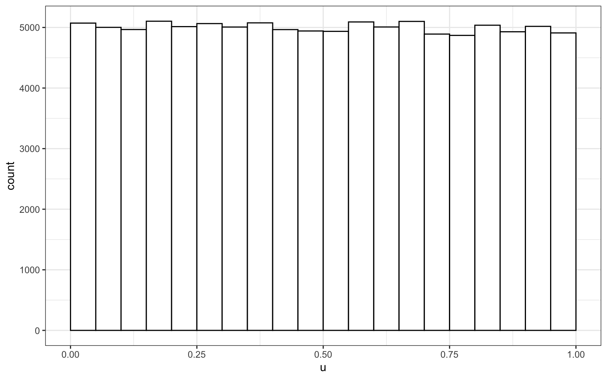
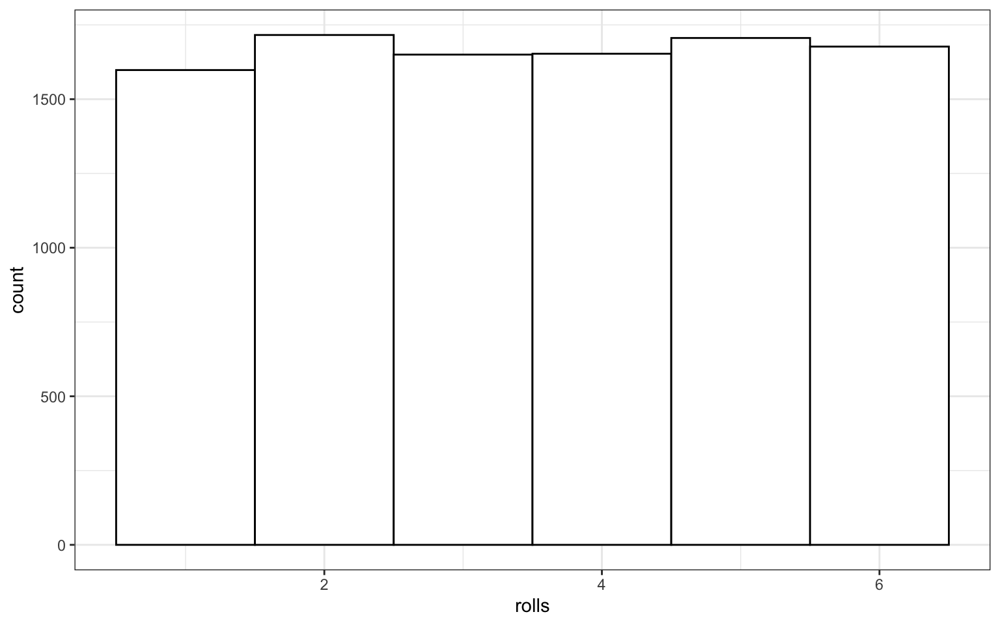

# Probability & Simulation {#sim}


## Learning Objectives

### Basic

1. Understand what types of data are best modeled by different distributions
    + [uniform](#uniform)
    + [binomial](#binomial)
    + [normal](#normal)
    + [poisson](#poisson)
2. Generate and plot data randomly sampled from the above distributions
3. Test sampled distributions against a null hypothesis
    + [exact binomial test](#exact-binom)
    + [t-test](#t-test) (1-sample, independent samples, paired samples)
    + [correlation](#correlation) (pearson, kendall and spearman)
4. Define the following [statistical terms](#stat-terms):
    + [p-value](#p-value)
    + [alpha](#alpha)
    + [power](#power)
    + smallest effect size of interest ([SESOI](#sesoi))
    + [false positive](#false-pos) (type I error)
    + [false negative](#false-neg) (type II error)
    + confidence interval ([CI](#conf-inf))
5. [Calculate power](#calc-power) using iteration and a sampling function

### Intermediate

6. Generate 3+ variables from a [multivariate normal](#mvnorm) distribution and plot them

### Advanced

7. Calculate the minimum sample size for a specific power level and design


## Resources

* [Stub for this lesson](stubs/8_sim.Rmd)
* [Distribution Shiny App](http://shiny.psy.gla.ac.uk/debruine/simulate/)
* [Simulation tutorials](https://debruine.github.io/tutorials/sim-data.html)
* [Chapter 21: Iteration](http://r4ds.had.co.nz/iteration.html)  of *R for Data Science*
* [Improving your statistical inferences](https://www.coursera.org/learn/statistical-inferences/) on Coursera (week 1)
* [Faux](https://debruine.github.io/faux/) package for data simulation
* [Simulation-Based Power-Analysis for Factorial ANOVA Designs](https://psyarxiv.com/baxsf) [@lakens_caldwell_2019]
* [Understanding mixed effects models through data simulation](https://psyarxiv.com/xp5cy/) [@debruine_barr_2019]


## Distributions

Simulating data is a very powerful way to test your understanding of statistical concepts. We are going to use simulations to learn the basics of probability.


```r
# libraries needed for these examples
library(tidyverse)
library(MASS)
set.seed(8675309) # makes sure random numbers are reproducible
```

### Uniform Distribution {#uniform}

The uniform distribution is the simplest distribution. All numbers in the range have an equal probability of being sampled.

<div class="try">
<p>Take a minute to think of things in your own research that are uniformly distributed.</p>
</div>

#### Sample continuous distribution

`runif(n, min=0, max=1)` 

Use `runif()` to sample from a continuous uniform distribution.


```r
u <- runif(100000, min = 0, max = 1)

# plot to visualise
ggplot() + 
  geom_histogram(aes(u), binwidth = 0.05, boundary = 0,
                 fill = "white", colour = "black")
```



#### Sample discrete distribution

`sample(x, size, replace = FALSE, prob = NULL)`

Use `sample()` to sample from a discrete distribution.

You can use `sample()` to simulate events like rolling dice or choosing from a deck of cards. The code below simulates rolling a 6-sided die 10000 times. We set `replace` to `TRUE` so that each event is independent. See what happens if you set `replace` to `FALSE`.


```r
rolls <- sample(1:6, 10000, replace = TRUE)

# plot the results
ggplot() + 
  geom_histogram(aes(rolls), binwidth = 1, 
                 fill = "white", color = "black")
```

<div class="figure" style="text-align: center">

<p class="caption">(\#fig:sample-replace)Distribution of dice rolls.</p>
</div>

You can also use sample to sample from a list of named outcomes.


```r
pet_types <- c("cat", "dog", "ferret", "bird", "fish")
sample(pet_types, 10, replace = TRUE)
```

```
##  [1] "cat"    "cat"    "cat"    "cat"    "ferret" "dog"    "bird"  
##  [8] "cat"    "dog"    "fish"
```

Ferrets are a much less common pet than cats and dogs, so our sample isn't very realistic. You can set the probabilities of each item in the list with the `prob` argument.


```r
pet_types <- c("cat", "dog", "ferret", "bird", "fish")
pet_prob <- c(0.3, 0.4, 0.1, 0.1, 0.1)
sample(pet_types, 10, replace = TRUE, prob = pet_prob)
```

```
##  [1] "fish" "dog"  "cat"  "dog"  "cat"  "dog"  "fish" "dog"  "cat"  "fish"
```


### Binomial Distribution {#binomial}

The binomial distribution is useful for modeling binary data, where each observation can have one of two outcomes, like success/failure, yes/no or head/tails. 

#### Sample distribution

`rbinom(n, size, prob)`

The `rbinom` function will generate a random binomial distribution.

* `n` = number of observations
* `size` = number of trials
* `prob` = probability of success on each trial

Coin flips are a typical example of a binomial distribution, where we can assign heads to 1 and tails to 0.


```r
# 20 individual coin flips of a fair coin
rbinom(20, 1, 0.5)
```

```
##  [1] 1 1 1 0 1 1 0 1 0 0 1 1 1 0 0 0 1 0 0 0
```


```r
# 20 individual coin flips of a baised (0.75) coin
rbinom(20, 1, 0.75)
```

```
##  [1] 1 1 1 0 1 0 1 1 1 0 1 1 1 0 0 1 1 1 1 1
```

You can generate the total number of heads in 1 set of 20 coin flips by setting `size` to 20 and `n` to 1.


```r
rbinom(1, 20, 0.75)
```

```
## [1] 13
```

You can generate more sets of 20 coin flips by increasing the `n`.


```r
rbinom(10, 20, 0.5)
```

```
##  [1] 10 14 11  7 11 13  6 10  9  9
```

You should always check your randomly generated data to check that it makes sense. For large samples, it's easiest to do that graphically. A histogram is usually the best choice for plotting binomial data.


```r
flips <- rbinom(1000, 20, 0.5)

ggplot() +
  geom_histogram(
    aes(flips), 
    binwidth = 1, 
    fill = "white", 
    color = "black"
  )
```


<div class="try">
<p>Run the simulation above several times, noting how the histogram changes. Try changing the values of <code>n</code>, <code>size</code>, and <code>prob</code>.</p>
</div>

#### Exact binomial test {#exact-binom}

`binom.test(x, n, p)`

You can test a binomial distribution against a specific probability using the exact binomial test.

* `x` = the number of successes
* `n` = the number of trials
* `p` = hypothesised probability of success

Here we can test a series of 10 coin flips from a fair coin and a biased coin against the hypothesised probability of 0.5 (even odds).


```r
n <- 10
fair_coin <- rbinom(1, n, 0.5)
biased_coin <- rbinom(1, n, 0.6)

binom.test(fair_coin, n, p = 0.5)
binom.test(biased_coin, n, p = 0.5)
```

```
## 
## 	Exact binomial test
## 
## data:  fair_coin and n
## number of successes = 4, number of trials = 10, p-value = 0.7539
## alternative hypothesis: true probability of success is not equal to 0.5
## 95 percent confidence interval:
##  0.1215523 0.7376219
## sample estimates:
## probability of success 
##                    0.4 
## 
## 
## 	Exact binomial test
## 
## data:  biased_coin and n
## number of successes = 7, number of trials = 10, p-value = 0.3438
## alternative hypothesis: true probability of success is not equal to 0.5
## 95 percent confidence interval:
##  0.3475471 0.9332605
## sample estimates:
## probability of success 
##                    0.7
```

<div class="info">
<p>Run the code above several times, noting the p-values for the fair and biased coins. Alternatively, you can <a href="http://shiny.psy.gla.ac.uk/debruine/coinsim/">simulate coin flips</a> online and build up a graph of results and p-values.</p>
<ul>
<li>How does the p-value vary for the fair and biased coins?</li>
<li>What happens to the confidence intervals if you increase n from 10 to 100?</li>
<li>What criterion would you use to tell if the observed data indicate the coin is fair or biased?</li>
<li>How often do you conclude the fair coin is biased (false positives)?</li>
<li>How often do you conclude the biased coin is fair (false negatives)?</li>
</ul>
</div>

#### Statistical terms {#stat-terms}

The **effect** is some measure of your data. This will depend on the type of data you have and the type of statistical test you are using. For example, if you flipped a coin 100 times and it landed heads 66 times, the effect would be 66/100. You can then use the exact binomial test to compare this effect to the **null effect** you would expect from a fair coin (50/100) or to any other effect you choose. The **effect size** refers to the difference between the effect in your data and the null effect (usually a chance value).


{#p-value}
The **p-value** of a test is the probability of seeing an effect at least as extreme as what you have, if the real effect was the value you are testing against (e.g., a null effect). So if you used a binomial test to test against a chance probability of 1/6 (e.g., the probability of rolling 1 with a 6-sided die), then a p-value of 0.17 means that you could expect to see effects at least as extreme as your data 17% of the time just by chance alone. 

{#alpha}
If you are using null hypothesis significance testing (**NHST**), then you need to decide on a cutoff value (**alpha**) for making a decision to reject the null hypothesis. We call p-values below the alpha cutoff **significant**. In psychology, alpha is traditionally set at 0.05, but there are good arguments for [setting a different criterion in some circumstances](http://daniellakens.blogspot.com/2019/05/justifying-your-alpha-by-minimizing-or.html). 

{#false-pos}{#false-neg}
The probability that a test concludes there is an effect when there is really no effect (e.g., concludes a fair coin is biased) is called the **false positive rate** (or _Type I Error Rate_). The alpha is the false positive rate we accept for a test. The probability that a test concludes there is no effect when there really is one (e.g., concludes a biased coin is fair) is called the **false negative rate** (or _Type II Error Rate_). The **beta** is the false negative rate we accept for a test.

<div class="info">
<p>The false positive rate is not the overall probability of getting a false positive, but the probability of a false positive <em>under the null hypothesis</em>. Similarly, the false negative rate is the probability of a false negative <em>under the alternative hypothesis</em>. Unless we know the probability that we are testing a null effect, we can’t say anything about the overall probability of false positives or negatives. If 100% of the hypotheses we test are false, then all significant effects are false positives, but if all of the hypotheses we test are true, then all of the positives are true positives and the overall false positive rate is 0.</p>
</div>

{#power}{#sesoi}
**Power** is equal to 1 minus beta (i.e., the **true positive rate**), and depends on the effect size, how many samples we take (n), and what we set alpha to. For any test, if you specify all but one of these values, you can calculate the last. The effect size you use in power calculations should be the smallest effect size of interest (**SESOI**). See [@TOSTtutorial](https://doi.org/10.1177/2515245918770963) for a tutorial on methods for choosing an SESOI. 

<div class="try">
Let's say you want to be able to detect at least a 15% difference from chance (50%) in a coin's fairness, and you want your test to have a 5% chance of false positives and a 10% chance of false negatives. What are the following values?

* alpha = <input class='solveme nospaces' size='4' data-answer='["0.05",".05","5%"]'/>
* beta = <input class='solveme nospaces' size='4' data-answer='["0.1","0.10",".1",".10","10%"]'/>
* false positive rate = <input class='solveme nospaces' size='4' data-answer='["0.05",".05","5%"]'/>
* false negative rate = <input class='solveme nospaces' size='4' data-answer='["0.1","0.10",".1",".10","10%"]'/>
* power = <input class='solveme nospaces' size='4' data-answer='["0.9","0.90",".9",".90","90%"]'/>
* SESOI = <input class='solveme nospaces' size='4' data-answer='["0.15",".15","15%"]'/>
</div>

{#conf-int}
The **confidence interval** is a range around some value (such as a mean) that has some probability (usually 95%, but you can calculate CIs for any percentage) of containing the parameter, if you repeated the process many times. 

<div class="info">
A 95% CI does *not* mean that there is a 95% probability that the true mean lies within this range, but that, if you repeated the study many times and calculated the CI this same way every time, you'd expect the true mean to be inside the CI in 95% of the studies. This seems like a subtle distinction, but can lead to some misunderstandings. See [@Morey2016](https://link.springer.com/article/10.3758/s13423-015-0947-8) for more detailed discussion.
</div>


#### Sampling function

To estimate these rates, we need to repeat the sampling above many times. 
A function is ideal for repeating the exact same procedure over and over. Set the arguments of the function to variables that you might want to change. Here, we will want to estimate power for:

* different sample sizes (`n`)
* different effects (`bias`)
* different hypothesised probabilities (`p`, defaults to 0.5)


```r
sim_binom_test <- function(n, bias, p = 0.5) {
  # simulate 1 coin flip n times with the specified bias
  coin <- rbinom(1, n, bias)
  # run a binomial test on the simulated data for the specified p
  btest <- binom.test(coin, n, p)
  # returun the p-value of this test
  btest$p.value
}
```

Once you've created your function, test it a few times, changing the values.


```r
sim_binom_test(100, 0.6)
```

```
## [1] 0.271253
```

#### Calculate power {#calc-power}

Then you can use the `replicate()` function to run it many times and save all the output values. You can calculate the *power* of your analysis by checking the proportion of your simulated analyses that have a p-value less than your _alpha_ (the probability of rejecting the null hypothesis when the null hypothesis is true).


```r
my_reps <- replicate(1e4, sim_binom_test(100, 0.6))

alpha <- 0.05 # this does not always have to be 0.05

mean(my_reps < alpha)
```

```
## [1] 0.4678
```

<div class="info">
<p><code>1e4</code> is just scientific notation for a 1 followed by 4 zeros (<code>10000</code>). When you’re running simulations, you usually want to run a lot of them. It’s a pain to keep track of whether you’ve typed 5 or 6 zeros (100000 vs 1000000) and this will change your running time by an order of magnitude.</p>
</div>

### Normal Distribution {#normal}

#### Sample distribution

`rnorm(n, mean, sd)`

We can simulate a normal distribution of size `n` if we know the `mean` and standard deviation (`sd`). A density plot is usually the best way to visualise this type of data if your `n` is large.


```r
dv <- rnorm(1e5, 10, 2)

# proportions of normally-distributed data 
# within 1, 2, or 3 SD of the mean
sd1 <- .6827 
sd2 <- .9545
sd3 <- .9973

ggplot() +
  geom_density(aes(dv), fill = "white") +
  geom_vline(xintercept = mean(dv), color = "red") +
  geom_vline(xintercept = quantile(dv, .5 - sd1/2), color = "darkgreen") +
  geom_vline(xintercept = quantile(dv, .5 + sd1/2), color = "darkgreen") +
  geom_vline(xintercept = quantile(dv, .5 - sd2/2), color = "blue") +
  geom_vline(xintercept = quantile(dv, .5 + sd2/2), color = "blue") +
  geom_vline(xintercept = quantile(dv, .5 - sd3/2), color = "purple") +
  geom_vline(xintercept = quantile(dv, .5 + sd3/2), color = "purple") +
  scale_x_continuous(
    limits = c(0,20), 
    breaks = seq(0,20)
  )
```


<div class="info">
<p>Run the simulation above several times, noting how the density plot changes. What do the vertical lines represent? Try changing the values of <code>n</code>, <code>mean</code>, and <code>sd</code>.</p>
</div>

#### T-test {#t-test}

`t.test(x, y, alternative, mu, paired)`

Use a t-test to compare the mean of one distribution to a null hypothesis 
(one-sample t-test), compare the means of two samples (independent-samples t-test), 
or compare pairs of values (paired-samples t-test).

You can run a one-sample t-test comparing the mean of your data to `mu`. Here is 
a simulated distribution with a mean of 0.5 and an SD of 1, creating an effect 
size of 0.5 SD when tested against a `mu` of 0. Run the simulation a few times to 
see how often the t-test returns a significant p-value (or run it in the [shiny app](http://shiny.psy.gla.ac.uk/debruine/normsim/)).


```r
sim_norm <- rnorm(100, 0.5, 1)
t.test(sim_norm, mu = 0)
```

```
## 
## 	One Sample t-test
## 
## data:  sim_norm
## t = 5.1431, df = 99, p-value = 1.367e-06
## alternative hypothesis: true mean is not equal to 0
## 95 percent confidence interval:
##  0.3027835 0.6831659
## sample estimates:
## mean of x 
## 0.4929747
```

Run an independent-samples t-test by comparing two lists of values.


```r
a <- rnorm(100, 0.5, 1)
b <- rnorm(100, 0.7, 1)
t_ind <- t.test(a, b, paired = FALSE)
t_ind
```

```
## 
## 	Welch Two Sample t-test
## 
## data:  a and b
## t = 0.043602, df = 197.5, p-value = 0.9653
## alternative hypothesis: true difference in means is not equal to 0
## 95 percent confidence interval:
##  -0.2813281  0.2940499
## sample estimates:
## mean of x mean of y 
## 0.5123162 0.5059554
```

<div class="warning">
<p>The <code>paired</code> argument defaults to <code>FALSE</code>, but it’s good practice to always explicitly set it so you are never confused about what type of test you are performing.</p>
</div>

#### Sampling function

We can use the `names()` function to find out the names of all the t.test parameters and use this to just get one type of data, like the test statistic (e.g., t-value).


```r
names(t_ind)
t_ind$statistic
```

```
##  [1] "statistic"   "parameter"   "p.value"     "conf.int"    "estimate"   
##  [6] "null.value"  "stderr"      "alternative" "method"      "data.name"  
##          t 
## 0.04360244
```

Alternatively, use `broom::tidy()` to convert the output into a tidy table.


```r
broom::tidy(t_ind)
```

```
## # A tibble: 1 x 10
##   estimate estimate1 estimate2 statistic p.value parameter conf.low
##      <dbl>     <dbl>     <dbl>     <dbl>   <dbl>     <dbl>    <dbl>
## 1  0.00636     0.512     0.506    0.0436   0.965      197.   -0.281
## # … with 3 more variables: conf.high <dbl>, method <chr>,
## #   alternative <chr>
```


If you want to run the simulation many times and record information each time, first you need to turn your simulation into a function.


```r
sim_t_ind <- function(n, m1, sd1, m2, sd2) {
  # simulate v1
  v1 <- rnorm(n, m1, sd1)
  
  #simulate v2
  v2 <- rnorm(n, m2, sd2)
    
  # compare using an independent samples t-test
  t_ind <- t.test(v1, v2, paired = FALSE)
  
  # return the p-value
  return(t_ind$p.value)
}
```

Run it a few times to check that it gives you sensible values.


```r
sim_t_ind(100, 0.7, 1, 0.5, 1)
```

```
## [1] 0.1002539
```

Now replicate the simulation 1000 times.


```r
my_reps <- replicate(1e4, sim_t_ind(100, 0.7, 1, 0.5, 1))

alpha <- 0.05
power <- mean(my_reps < alpha)
power
```

```
## [1] 0.2926
```

<div class="try">
<p>Run the code above several times. How much does the power value fluctuate? How many replications do you need to run to get a reliable estimate of power?</p>
</div>

Compare your power estimate from simluation to a power calculation using `power.t.test()`. Here, `delta` is the difference between `m1` and `m2` above.


```r
power.t.test(n = 100, delta = 0.2, sd = 1, sig.level = alpha, type = "two.sample")
```

```
## 
##      Two-sample t test power calculation 
## 
##               n = 100
##           delta = 0.2
##              sd = 1
##       sig.level = 0.05
##           power = 0.2902664
##     alternative = two.sided
## 
## NOTE: n is number in *each* group
```

You can plot the distribution of p-values.


```r
ggplot() + 
  geom_histogram(
    aes(my_reps), 
    binwidth = 0.05, 
    boundary = 0,
    fill = "white", 
    color = "black"
  )
```


<div class="try">
<p>What do you think the distribution of p-values is when there is no effect (i.e., the means are identical)? Check this yourself.</p>
</div>

<div class="warning">
<p>Make sure the <code>boundary</code> argument is set to <code>0</code> for p-value histograms. See what happens with a null effect if <code>boundary</code> is not set.</p>
</div>

### Bivariate Normal

#### Correlation {#correlation}

You can test if two continuous variables are related to each other using the `cor()` function.

Below is one way to generate two correlated variables: `a` is drawn from a normal distribution, while `x` and `y` the sum of  and another value drawn from a random normal distribution. We'll learn later how to generate specific correlations in simulated data.


```r
n <- 100 # number of random samples

a <- rnorm(n, 0, 1)
x <- a + rnorm(n, 0, 1)
y <- a + rnorm(n, 0, 1)

cor(x, y)
```

```
## [1] 0.5500246
```

<div class="try">
<p>Set <code>n</code> to a large number like 1e6 so that the correlations are less affected by chance. Change the value of the <strong>mean</strong> for <code>a</code>, <code>x</code>, or <code>y</code>. Does it change the correlation between <code>x</code> and <code>y</code>? What happens when you increase or decrease the <strong>sd</strong> for <code>a</code>? Can you work out any rules here?</p>
</div>

`cor()` defaults to Pearson's correlations. Set the `method` argument to use Kendall or Spearman correlations.


```r
cor(x, y, method = "spearman")
```

```
## [1] 0.529553
```

#### Sample distribution {#bvn}

What if we want to sample from a population with specific relationships between variables? We can sample from a **bivariate normal distribution** using `mvrnorm()` from the `MASS` package. 


```r
n   <- 1000 # number of random samples
rho <- 0.5  # population correlation between the two variables

mu     <- c(10, 20) # the means of the samples
stdevs <- c(5, 6)   # the SDs of the samples

# correlation matrix
cor_mat <- matrix(c(  1, rho, 
                    rho,   1), 2) 

# create the covariance matrix
sigma <- (stdevs %*% t(stdevs)) * cor_mat

# sample from bivariate normal distribution
bvn <- MASS::mvrnorm(n, mu, sigma) 

cor(bvn) # check correlation matrix
```

```
##           [,1]      [,2]
## [1,] 1.0000000 0.5081377
## [2,] 0.5081377 1.0000000
```

Plot your sampled variables to check everything worked like you expect. It's easiest to convert the output of `mvnorm` into a tibble in order to use it in ggplot.


```r
bvn %>%
  as_tibble() %>%
  ggplot(aes(V1, V2)) +
    geom_point(alpha = 0.5) + 
    geom_smooth(method = "lm") +
    geom_density2d()
```

```
## Warning: `as_tibble.matrix()` requires a matrix with column names or a `.name_repair` argument. Using compatibility `.name_repair`.
## This warning is displayed once per session.
```


### Multivariate Normal {#mvnorm}

You can generate more than 2 correlated variables, but it gets a little trickier to create the correlation matrix.

#### Sample distribution


```r
n      <- 200 # number of random samples
rho1_2 <- 0.5 # correlation betwen v1 and v2
rho1_3 <- 0   # correlation betwen v1 and v3
rho2_3 <- 0.7 # correlation betwen v2 and v3

mu     <- c(10, 20, 30) # the means of the samples
stdevs <- c(8, 9, 10)   # the SDs of the samples

# correlation matrix
cor_mat <- matrix(c(     1, rho1_2, rho1_3, 
                    rho1_2,      1, rho2_3,
                    rho1_3, rho2_3,      1), 3) 

sigma <- (stdevs %*% t(stdevs)) * cor_mat
bvn3 <- MASS::mvrnorm(n, mu, sigma)

cor(bvn3) # check correlation matrix
```

```
##           [,1]      [,2]      [,3]
## [1,] 1.0000000 0.5983590 0.1529026
## [2,] 0.5983590 1.0000000 0.6891871
## [3,] 0.1529026 0.6891871 1.0000000
```

Alternatively, you can use the (in-development) package faux to generate any number of correlated variables. It also allows to to easily name the variables and has a function for checking the parameters of your new simulated data (`check_sim_stats()`).


```r
#devtools::install_github("debruine/faux")
library(faux)
```

```
## 
## ************
## Welcome to faux. For support and examples visit:
## http://debruine.github.io/faux/
## - Get and set global package options with: faux_options()
## ************
```

```r
bvn3 <- faux::rnorm_multi(
  n = n,
  vars = 3,
  mu = mu,
  sd = stdevs,
  r = c(rho1_2, rho1_3, rho2_3),
  varnames = c("A", "B", "C")
)

faux::check_sim_stats(bvn3)
```

```
## Warning: All elements of `...` must be named.
## Did you want `multisim_data = c(A, B, C)`?
```

```
## # A tibble: 3 x 7
##       n var       A     B     C  mean    sd
##   <dbl> <chr> <dbl> <dbl> <dbl> <dbl> <dbl>
## 1   200 A      1     0.54  0.1   10.5  7.27
## 2   200 B      0.54  1     0.73  20.6  9.46
## 3   200 C      0.1   0.73  1     30.7  9.64
```


#### 3D Plots

You can use the `plotly` library to make a 3D graph.


```r
library(plotly)
```

```
## 
## Attaching package: 'plotly'
```

```
## The following object is masked from 'package:MASS':
## 
##     select
```

```
## The following object is masked from 'package:ggplot2':
## 
##     last_plot
```

```
## The following object is masked from 'package:stats':
## 
##     filter
```

```
## The following object is masked from 'package:graphics':
## 
##     layout
```

```r
marker_style = list(
    color = "#ff0000", 
    line = list(
      color = "#444", 
      width = 1
    ), 
    opacity = 0.5,
    size = 5
  )

bvn3 %>%
  as_tibble() %>%
  plot_ly(x = ~A, y = ~B, z = ~C, marker = marker_style) %>%
  add_markers()
```

<!--html_preserve--><div id="htmlwidget-b9d6bee1831483fab5b9" style="width:100%;height:480px;" class="plotly html-widget"></div>
<script type="application/json" data-for="htmlwidget-b9d6bee1831483fab5b9">{"x":{"visdat":{"162cb5cd7b813":["function () ","plotlyVisDat"]},"cur_data":"162cb5cd7b813","attrs":{"162cb5cd7b813":{"x":{},"y":{},"z":{},"marker":{"color":"#ff0000","line":{"color":"#444","width":1},"opacity":0.5,"size":5},"alpha_stroke":1,"sizes":[10,100],"spans":[1,20],"type":"scatter3d","mode":"markers","inherit":true}},"layout":{"margin":{"b":40,"l":60,"t":25,"r":10},"scene":{"xaxis":{"title":"A"},"yaxis":{"title":"B"},"zaxis":{"title":"C"}},"hovermode":"closest","showlegend":false},"source":"A","config":{"showSendToCloud":false},"data":[{"x":[8.05260178461991,12.6409744803025,5.22852425524659,-4.51019256097734,10.1240075496456,5.62179221000471,6.703733108707,16.7429377878705,5.38629564393806,17.7597535198822,19.500939003337,-8.23458261934593,13.0013272810702,14.2102544319956,1.78594767692072,23.0783562569781,0.223260938029735,2.88420917038849,9.37323724380929,0.417632808280377,3.330061286557,8.87298412085202,0.474384532715186,15.7214784167375,6.09129463955885,16.9699488815477,3.44859862480671,9.05167920803214,10.8910100361808,10.9249457823209,9.31954905401433,10.4524370859205,10.6253196692898,6.60770227382889,11.3032229822206,7.17023758926682,14.7818564097807,-3.10816282563274,5.50351350054219,20.2319819293687,14.9830634065728,21.1548746484728,18.608534155442,-3.13511370212771,12.6881891522244,13.6808444530875,17.8180463859302,10.4111806373812,17.3716136147879,5.60802916121727,20.6393245731007,12.4325021015441,4.91200523261264,-2.05353936415432,1.43482767507819,23.9844395811584,9.80526687034713,19.2726079203326,33.6520479283846,9.87695240448514,14.2572534600899,13.6180757122369,8.79964551568788,6.69691934325003,7.06426925802404,24.3205885916481,0.691752660010076,10.1429614452639,-4.76180786591051,15.8967007127175,10.5800053453733,10.6664793279097,8.85133070489351,10.9390901174021,26.8574160937528,15.6380802793906,17.5385453768751,9.62010762041131,5.01236916273123,3.31479018819426,5.65869700103937,11.6030548193727,15.3925661426651,7.56489445621015,15.131802304719,11.6762032949346,9.08617049917855,19.0214055206646,-2.43764675085329,20.5308853487242,4.60916530977491,4.77546898965459,16.3886777972681,22.2629830002927,16.9037204192169,16.2506260855869,17.837343921475,20.4916380357862,6.23530986117737,2.60408860177074,11.9072431121696,22.3468602371317,13.515470360676,19.1083751767013,14.4107644653921,1.65847869417667,5.49263302816009,18.2935804859093,3.18189956987114,4.88406609454063,4.47542209307797,13.2438977449397,3.69703559686871,9.03707695753464,26.6309640657555,13.9224236137861,-10.127557514858,8.9801530175563,-3.11019988653403,9.4575893578418,9.33953978801179,0.690724967300024,17.1212412016879,4.69756689010998,17.4050093706534,18.6474677469327,6.21984190589818,19.9710110416358,0.113502458246808,9.67705311577875,16.6588394878378,5.03750825777041,8.02670712837204,5.48458395146666,22.9454878250014,10.4756193186703,6.35834791433064,13.6355018993348,15.7892808864187,6.97274129381272,1.54876924898764,9.11346717242589,-0.571444450611711,10.5708438959623,9.08750962820055,14.9261856584387,10.2407741288251,6.04074921379798,5.86636356877218,11.9903112637286,20.5205561990658,13.4747897293114,15.7506433297305,5.45377793390377,22.4193399254377,9.24845519467151,10.721585213015,5.14372235736719,14.6386971137786,10.5833385893307,30.7270846237492,14.8115742118522,10.2465891549459,15.3522638138235,6.93844260572303,5.30860462185339,-3.52225411307488,13.8359288697872,8.79580721416906,12.9318436531444,22.5126586880278,11.3080282325817,1.46131796313563,9.68921759211661,14.2605377594624,-4.38391384663862,13.2200435088891,20.6480216773541,13.5863218243578,12.8197807194314,10.3118109854968,3.25779095978273,16.1195487322554,7.3427486704747,10.6588047030896,15.4700596647169,12.3934872641105,21.5560275805374,10.3555681175981,2.03447711929959,9.19655009946265,6.13023801390225,4.69819006452276,11.7550409772494,10.9368141804533,7.72230602754449,1.53247223836078,11.6783666784247,16.5485140184628,1.95677256845206],"y":[7.49309252284932,38.3744072236555,23.6830444713541,15.1175351573437,7.50083659755454,8.74880108058903,22.1623475286746,18.3008972199796,27.3239478052324,20.1495062537462,33.9727085537503,-5.20421641229637,30.0804764924525,21.4370504385349,15.5879827528405,23.2428556205303,6.28090636270858,4.07661497235625,7.87159872523645,5.61502855723311,15.8625555295587,7.05915628920522,26.1442974317845,20.6148835601718,9.43329006404486,36.2784267378784,28.025460340802,24.1305193448718,32.0221794341744,20.8327600367718,14.375932201363,15.1309405632704,23.6443870428793,-1.56846915349126,18.9537353739923,34.8344259507176,18.6425015641901,19.4696758327605,18.0911024270963,26.4945204069184,25.9320991021504,34.8607867585986,33.6129448291206,8.89185825299045,15.739343212151,21.5899748941433,39.1242164303555,11.932235729298,20.9307198664292,16.9536584815224,26.2100225930415,29.9486759656676,19.5458393369736,-2.97561270093177,23.8698166843554,12.2031464568592,9.64065830548742,22.7647357672422,35.2408397526034,14.4441773119295,17.4907040528186,21.9255475352842,32.3911357835259,17.6047859770961,18.6730414439095,21.1504365708621,13.3318092652042,17.8030134050476,3.29646132473211,29.3057227340125,17.2717037263272,17.738629866625,19.2639012966883,27.8369153088086,28.8327308404694,24.1667605478278,29.3616134069256,33.0479742353595,18.9127069010295,29.9499567540905,17.9426534747736,28.5782750118561,27.7004172111305,22.5154997602713,15.3599299493365,23.6346798753275,13.287863641043,38.5372708553125,15.9675227841137,37.1106874321745,27.4107044925257,22.183766050733,33.6814600101357,32.5880131206556,24.3779461137659,29.1188772779909,18.4645020403222,16.494000582784,-2.76910625223582,25.2454079324149,24.8878243911322,16.4201544830365,23.7580071405996,28.4833335495285,15.082304163636,8.17092098277091,7.49389101242658,32.7640786720096,12.1183236015722,12.5400017970578,13.4410692384918,17.219643976885,23.6191309351295,11.6436963437839,24.9833922342779,34.0897479022398,12.4434199103748,16.5501926410176,7.39216278083794,28.2989489291922,18.9559240662755,14.5366748921193,32.0502107769019,29.3862857036247,23.3768386192155,28.0728934942523,6.96215488765043,24.1253319162865,9.80207998689376,8.16012921843693,31.0900339378042,14.0280576992563,28.9638809616566,9.54645604454964,18.6538091484605,10.9076038999066,27.7886934470855,39.2214973456283,12.6403857000303,15.2778548061206,9.36374953906034,13.7466711467135,4.83740466297715,34.2151036292234,10.9546526604457,30.0941232481535,34.4231424806161,5.09816730368225,13.9287459169289,29.0807493113936,50.3594674825058,17.908491873209,18.9595961644316,20.9337341296332,30.648813116724,30.4706836991893,27.3078077106506,20.5222264060421,17.7906664070719,22.3981045095665,35.4567632763238,20.833303080849,18.4018073303679,25.4408028544433,30.8550115289002,24.5604559238554,7.44247251593704,21.5405244417825,18.85916941738,25.0049801148774,24.4897582482906,23.8908588096965,-0.624517982931621,11.4990281405891,34.1028757935856,1.90289878071876,20.8089236428506,30.374135742642,31.5933954315946,18.8980063652991,20.0554903618357,20.8501450083726,19.412968309758,18.3731400683361,12.843914238704,26.5511610082155,19.9879169891087,35.9893363912441,10.5498797009483,28.8042136032757,19.7982229099679,31.2593012063887,18.1684864012583,15.8533539302023,19.1776436361002,29.3701159231607,22.0356451359203,16.307771784309,22.4707365839078,9.2023688923422],"z":[28.2105271819406,44.7196600692868,41.7198431727469,35.4071411226047,19.0909179858612,25.5229422643515,32.9121754310205,23.161386645436,41.2125032575862,16.9547270758857,41.3263852598476,12.0735058582994,42.8872140461086,31.0048335155804,26.6050703066575,18.949934592133,17.961233692845,20.6504133248964,29.6617162589208,7.61554554545626,30.9075129862352,25.6974567690628,40.1625218503207,32.9585974162089,22.8292519812426,55.4276053881439,46.9122387375304,29.497497623054,52.8859489747523,35.2885645582873,28.9250002558704,26.5040025744066,31.3010827817971,7.35814094967053,23.7086154168809,41.1117138023383,15.8376200248691,42.3281249964229,35.401665703991,25.308379198092,30.4593551822551,47.4516268695207,40.3423588802598,29.5667908591655,18.5763114925477,28.8918304044751,38.0471110844078,22.7679954492337,15.2352760459201,37.7003359253426,35.5039054211233,31.3853062977266,31.6503594081286,10.5667274250904,29.7274552829499,14.228712463773,23.2689140496318,20.3526545556705,36.1702783019612,17.8758912925117,28.8292514696531,16.8969222978995,47.7153707530193,24.9341294358864,29.425427617434,27.5344845820286,39.509312835722,32.6028039192341,22.7979554271846,40.4531673106592,29.0616373232844,29.7989237759938,22.9384085339916,29.6803761075281,33.866112024433,30.2655083792995,39.0719272080604,40.3164676871107,26.1458187029012,44.9099271438338,30.5799340712067,26.7692968403075,28.8704771325488,30.596596009964,29.2090182724487,26.962753311496,31.1588466822962,35.9899216286233,32.60091899977,37.814851975166,51.7292899663971,40.7146558146037,34.4321104083687,28.3639038874558,38.9420373547319,40.412662690752,27.9051120236487,21.7316209027656,8.58396793107793,36.3303362576227,41.271169722056,20.1820528200221,33.5550387571518,32.0688147486642,17.934281083914,21.6280977200596,20.8820668857129,41.778578912479,27.7315002935297,26.041348294921,30.0077053562111,29.1132043345765,34.9023946315809,18.3205124495274,21.7282015929661,47.9452769887108,31.5871515544239,25.6210118464666,32.3197837261201,41.2384974428266,25.8956853225507,35.4926026166762,36.7216972409528,45.4830772938909,36.3034679712752,30.7985502499533,19.2500401881583,24.5603063999743,26.8237312847177,23.3328671119621,37.0863118319694,23.0699335726846,33.6381371475928,19.655823983345,22.8242644300263,27.5762500757296,41.4602133708625,42.5635642337316,18.9917726024842,29.790520027139,20.3380818518753,28.4896188393926,21.3169210055087,54.5471262273576,12.8007528845916,33.2855148585132,46.1700885413568,17.794824794753,25.4144580108606,47.4292867132257,42.1894441534492,17.1718591639791,28.074394514047,41.075775965319,34.5950456393839,38.5638520730004,40.1516171067391,31.6124553276704,34.361104233816,25.4762745958018,41.1087791987028,27.3470329737966,37.3618794006224,46.5599525874787,40.8903885137512,35.9180494003284,21.0513518184356,28.7477547025912,21.3037816208278,40.5924140093874,21.4322986745938,28.6425199557828,19.721438829599,28.2917267699439,35.5545084770096,20.1636594148328,28.5866151663873,39.3515387941396,46.201257012164,22.8050532805483,32.1861357221949,32.5133387214128,38.9770661138432,27.7605643344127,27.84818156127,31.6169441445139,25.9301464023536,33.9486501683976,11.4113840116673,48.3340169154118,34.7850443630826,54.7996093958882,33.2624573064838,20.7369830405313,26.7390400960118,36.3199582236092,36.9624150152265,19.8154604697627,37.1613091919769,15.4131840207339],"marker":{"color":"#ff0000","line":{"color":"#444","width":1},"opacity":0.5,"size":5},"type":"scatter3d","mode":"markers","error_y":{"color":"rgba(31,119,180,1)"},"error_x":{"color":"rgba(31,119,180,1)"},"line":{"color":"rgba(31,119,180,1)"},"frame":null}],"highlight":{"on":"plotly_click","persistent":false,"dynamic":false,"selectize":false,"opacityDim":0.2,"selected":{"opacity":1},"debounce":0},"shinyEvents":["plotly_hover","plotly_click","plotly_selected","plotly_relayout","plotly_brushed","plotly_brushing","plotly_clickannotation","plotly_doubleclick","plotly_deselect","plotly_afterplot"],"base_url":"https://plot.ly"},"evals":[],"jsHooks":[]}</script><!--/html_preserve-->

## Example

This example uses the [Growth Chart Data Tables](https://www.cdc.gov/growthcharts/data/zscore/zstatage.csv) 
from the [US CDC](https://www.cdc.gov/growthcharts/zscore.htm). The data consist of height in centimeters for the z-scores of –2, -1.5, -1, -0.5, 0, 0.5, 1, 1.5, and 2 by sex (1=male; 2=female) and half-month of age (from 24.0 to 240.5 months).

### Load & wrangle

We have to do a little data wrangling first. Have a look at the data after you import it and relabel `Sex` to `male` and `female` instead of `1` and `2`. Also convert `Agemos` (age in months) to years. Relabel the column `0` as `mean` and calculate a new column named `sd` as the difference between columns `1` and `0`. 


```r
orig_height_age <- read_csv("https://www.cdc.gov/growthcharts/data/zscore/zstatage.csv") 
```

```
## Parsed with column specification:
## cols(
##   Sex = col_character(),
##   Agemos = col_character(),
##   `-2` = col_double(),
##   `-1.5` = col_double(),
##   `-1` = col_double(),
##   `-0.5` = col_double(),
##   `0` = col_double(),
##   `0.5` = col_double(),
##   `1` = col_double(),
##   `1.5` = col_double(),
##   `2` = col_double()
## )
```

```r
height_age <- orig_height_age %>%
  filter(Sex %in% c(1,2)) %>%
  mutate(
    sex = recode(Sex, "1" = "male", "2" = "female"),
    age = as.numeric(Agemos)/12,
    sd = `1` - `0`
  ) %>%
  dplyr::select(sex, age, mean = `0`, sd)
```

<div class="warning">
<p>If you run the code above without putting <code>dplyr::</code> before the <code>select()</code> function, you might get an error message. This is because the <code>MASS</code> package also has a function called <code>select()</code> and, since we loaded <code>MASS</code> after <code>tidyverse</code>, the <code>MASS</code> function becomes the default. When you loaded <code>MASS</code>, you should have seen a warning like “The following object is masked from ‘package:dplyr’: select”. You can use functions with the same name from different packages by specifying the package before the function name, separated by two colons.</p>
</div>

### Plot

Plot your new data frame to see how mean height changes with age for boys and girls.


```r
ggplot(height_age, aes(age, mean, color = sex)) +
  geom_smooth(aes(ymin = mean - sd, ymax = mean + sd), stat="identity")
```


### Get means and SDs

Create new variables for the means and SDs for 20-year-old men and women.


```r
height_sub <- height_age %>% filter(age == 20)

m_mean <- height_sub %>% filter(sex == "male") %>% pull(mean)
m_sd   <- height_sub %>% filter(sex == "male") %>% pull(sd)
f_mean <- height_sub %>% filter(sex == "female") %>% pull(mean)
f_sd   <- height_sub %>% filter(sex == "female") %>% pull(sd)

height_sub
```

```
## # A tibble: 2 x 4
##   sex      age  mean    sd
##   <chr>  <dbl> <dbl> <dbl>
## 1 male      20  177.  7.12
## 2 female    20  163.  6.46
```

### Simulate a population

Simulate 50 random male heights and 50 random female heights using the `rnorm()` function and the means and SDs above. Plot the data.


```r
sim_height <- tibble(
  male = rnorm(50, m_mean, m_sd),
  female = rnorm(50, f_mean, f_sd)
) %>%
  gather("sex", "height", male:female)

ggplot(sim_height) +
  geom_density(aes(height, fill = sex), alpha = 0.5) +
  xlim(125, 225)
```


<div class="try">
<p>Run the simulation above several times, noting how the density plot changes. Try changing the age you’re simulating.</p>
</div>

### Analyse simulated data

Use the `sim_t_ind(n, m1, sd1, m2, sd2)` function we created above to generate one simulation with a sample size of 50 in each group using the means and SDs of male and female 14-year-olds.


```r
height_sub <- height_age %>% filter(age == 14)
m_mean <- height_sub %>% filter(sex == "male") %>% pull(mean)
m_sd   <- height_sub %>% filter(sex == "male") %>% pull(sd)
f_mean <- height_sub %>% filter(sex == "female") %>% pull(mean)
f_sd   <- height_sub %>% filter(sex == "female") %>% pull(sd)

sim_t_ind(50, m_mean, m_sd, f_mean, f_sd)
```

```
## [1] 0.002962042
```

### Replicate simulation

Now replicate this 1e4 times using the `replicate()` function. This function will save the returned p-values in a list (`my_reps`). We can then check what proportion of those p-values are less than our alpha value. This is the power of our test.


```r
my_reps <- replicate(1e4, sim_t_ind(50, m_mean, m_sd, f_mean, f_sd))

alpha <- 0.05
power <- mean(my_reps < alpha)
power
```

```
## [1] 0.6428
```

### One-tailed prediction

This design has about 65% power to detect the sex difference in height (with a 2-tailed test). Modify the `sim_t_ind` function for a 1-tailed prediction.

You could just set `alternative` equal to "greater" in the function, but it might be better to add the `alternative` argument to your function (giving it the same default value as `t.test`) and change the value of `alternative` in the function to `alternative`.


```r
sim_t_ind <- function(n, m1, sd1, m2, sd2, alternative = "two.sided") {
  v1 <- rnorm(n, m1, sd1)
  v2 <- rnorm(n, m2, sd2)
  t_ind <- t.test(v1, v2, paired = FALSE, alternative = alternative)
  
  return(t_ind$p.value)
}

alpha <- 0.05
my_reps <- replicate(1e4, sim_t_ind(50, m_mean, m_sd, f_mean, f_sd, "greater"))
mean(my_reps < alpha)
```

```
## [1] 0.761
```

### Range of sample sizes

What if we want to find out what sample size will give us 80% power? We can try trial and error. We know the number should be slightly larger than 50. But you can search more systematically by repeating your power calculation for a range of sample sizes. 

<div class="info">
<p>This might seem like overkill for a t-test, where you can easily look up sample size calculators online, but it is a valuable skill to learn for when your analyses become more complicated.</p>
</div>

Start with a relatively low number of replications and/or more spread-out samples to estimate where you should be looking more specifically. Then you can repeat with a narrower/denser range of sample sizes and more iterations.


```r
alpha <- 0.05
power_table <- tibble(
  n = seq(20, 100, by = 5)
) %>%
  mutate(power = map_dbl(n, function(n) {
    ps <- replicate(1e3, sim_t_ind(n, m_mean, m_sd, f_mean, f_sd, "greater"))
    mean(ps < alpha)
  }))

ggplot(power_table, aes(n, power)) +
  geom_smooth() +
  geom_point() +
  geom_hline(yintercept = 0.8)
```

```
## `geom_smooth()` using method = 'loess' and formula 'y ~ x'
```


Now we can narrow down our search to values around 55 (plus or minus 5) and increase the number of replications from 1e3 to 1e4.


```r
power_table <- tibble(
  n = seq(50, 60)
) %>%
  mutate(power = map_dbl(n, function(n) {
    ps <- replicate(1e3, sim_t_ind(n, m_mean, m_sd, f_mean, f_sd, "greater"))
    mean(ps < alpha)
  }))

##ggplot(power_table, aes(n, power)) +
##  geom_smooth() +
##  geom_point() +
##  geom_hline(yintercept = 0.8) +
##  scale_x_continuous(breaks = sample_size)
```

## Exercises

Download the [exercises](exercises/08_sim_exercise.Rmd). See the [answers](exercises/08_sim_answers.Rmd) only after you've attempted all the questions.

