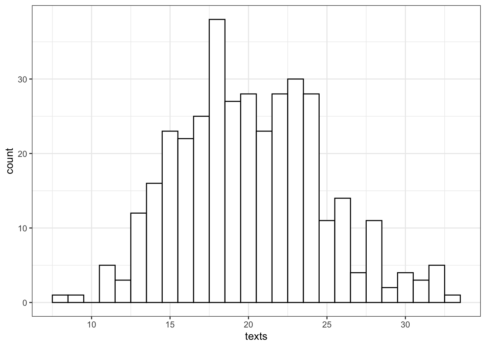
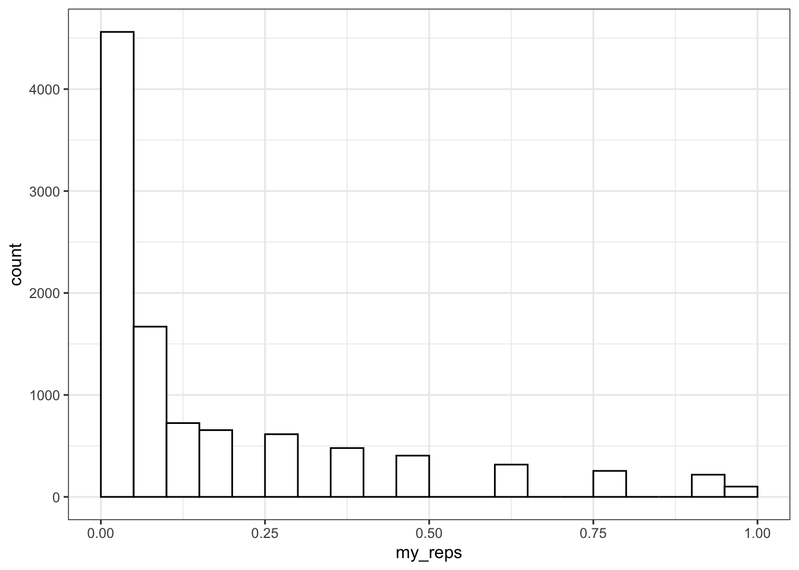
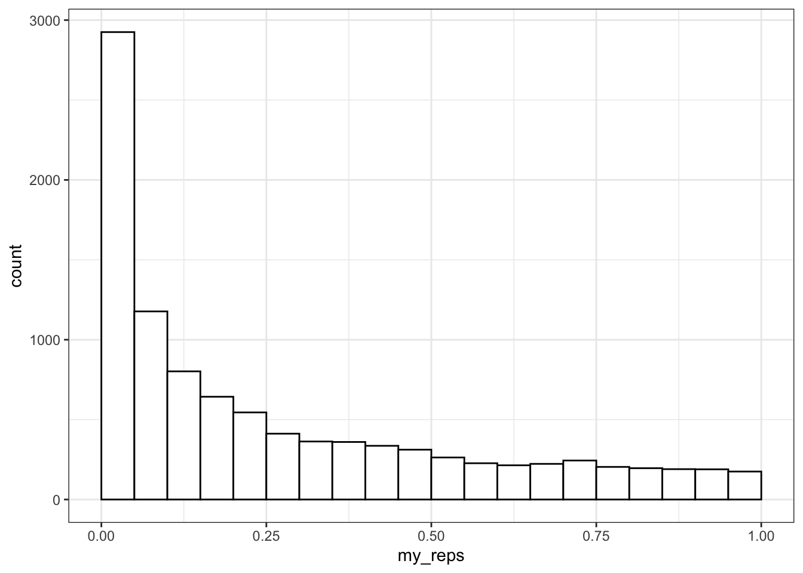
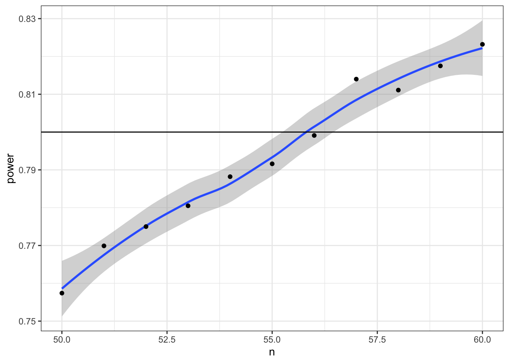

# Probability & Simulation {#sim}


## Learning Objectives {#ilo8}

### Basic

1. Generate and plot data randomly sampled from common distributions [(video)](https://youtu.be/iuecrT3q1kg){class="video"}
    + [uniform](#uniform)
    + [binomial](#binomial)
    + [normal](#normal)
    + [poisson](#poisson)
2. Generate related variables from a [multivariate](#mvdist) distribution [(video)](https://youtu.be/B14HfWQ1kIc){class="video"}
2. Define the following [statistical terms](#stat-terms):
    + [p-value](#p-value)
    + [alpha](#alpha)
    + [power](#power)
    + smallest effect size of interest ([SESOI](#sesoi))
    + [false positive](#false-pos) (type I error)
    + [false negative](#false-neg) (type II error)
    + confidence interval ([CI](#conf-inf))
3. Test sampled distributions against a null hypothesis
    + [exact binomial test](#exact-binom)
    + [t-test](#t-test) (1-sample, independent samples, paired samples)
    + [correlation](#correlation) (pearson, kendall and spearman)
4. [Calculate power](#calc-power-binom) using iteration and a sampling function

### Intermediate

6. Calculate the minimum sample size for a specific power level and design


## Resources {#resources8}

* [Stub for this lesson](stubs/8_sim.Rmd)
* [Distribution Shiny App](http://shiny.psy.gla.ac.uk/debruine/simulate/) (or run `dataskills::app("simulate")`
* [Simulation tutorials](https://debruine.github.io/tutorials/sim-data.html)
* [Chapter 21: Iteration](http://r4ds.had.co.nz/iteration.html)  of *R for Data Science*
* [Improving your statistical inferences](https://www.coursera.org/learn/statistical-inferences/) on Coursera (week 1)
* [Faux](https://debruine.github.io/faux/) package for data simulation
* [Simulation-Based Power-Analysis for Factorial ANOVA Designs](https://psyarxiv.com/baxsf) [@lakens_caldwell_2019]
* [Understanding mixed effects models through data simulation](https://psyarxiv.com/xp5cy/) [@debruine_barr_2019]

## Setup {#setup8}


```r
# libraries needed for these examples
library(tidyverse)
library(plotly)
library(faux)

set.seed(8675309) # makes sure random numbers are reproducible
```

Simulating data is a very powerful way to test your understanding of statistical concepts. We are going to use <a class='glossary' target='_blank' title='Generating data from summary parameters' href='https://psyteachr.github.io/glossary/s#simulation'>simulations</a> to learn the basics of <a class='glossary' target='_blank' title='A number between 0 and 1 where 0 indicates impossibility of the event and 1 indicates certainty' href='https://psyteachr.github.io/glossary/p#probability'>probability</a>.

## Univariate Distributions

First, we need to understand some different ways data might be distributed and how to simulate data from these distributions. A <a class='glossary' target='_blank' title='Relating to a single variable.' href='https://psyteachr.github.io/glossary/u#univariate'>univariate</a> distribution is the distribution of a single variable.

### Uniform Distribution {#uniform}

The <a class='glossary' target='_blank' title='All numbers in the range have an equal probability of being sampled' href='https://psyteachr.github.io/glossary/u#uniform-distribution'>uniform distribution</a> is the simplest distribution. All numbers in the range have an equal probability of being sampled.

<div class="try">
<p>Take a minute to think of things in your own research that are uniformly distributed.</p>
</div>

#### Continuous distribution

`runif(n, min=0, max=1)` 

Use `runif()` to sample from a continuous uniform distribution.


```r
u <- runif(100000, min = 0, max = 1)

# plot to visualise
ggplot() + 
  geom_histogram(aes(u), binwidth = 0.05, boundary = 0,
                 fill = "white", colour = "black")
```


#### Discrete

`sample(x, size, replace = FALSE, prob = NULL)`

Use `sample()` to sample from a <a class='glossary' target='_blank' title='Data that can only take certain values, such as integers.' href='https://psyteachr.github.io/glossary/d#discrete'>discrete</a> distribution.

You can use `sample()` to simulate events like rolling dice or choosing from a deck of cards. The code below simulates rolling a 6-sided die 10000 times. We set `replace` to `TRUE` so that each event is independent. See what happens if you set `replace` to `FALSE`.


```r
rolls <- sample(1:6, 10000, replace = TRUE)

# plot the results
ggplot() + 
  geom_histogram(aes(rolls), binwidth = 1, 
                 fill = "white", color = "black")
```

<div class="figure" style="text-align: center">

<p class="caption">(\#fig:sample-replace)Distribution of dice rolls.</p>
</div>

You can also use sample to sample from a list of named outcomes.


```r
pet_types <- c("cat", "dog", "ferret", "bird", "fish")
sample(pet_types, 10, replace = TRUE)
```

```
##  [1] "cat"    "cat"    "cat"    "cat"    "ferret" "dog"    "bird"   "cat"   
##  [9] "dog"    "fish"
```

Ferrets are a much less common pet than cats and dogs, so our sample isn't very realistic. You can set the probabilities of each item in the list with the `prob` argument.


```r
pet_types <- c("cat", "dog", "ferret", "bird", "fish")
pet_prob <- c(0.3, 0.4, 0.1, 0.1, 0.1)
sample(pet_types, 10, replace = TRUE, prob = pet_prob)
```

```
##  [1] "fish" "dog"  "cat"  "dog"  "cat"  "dog"  "fish" "dog"  "cat"  "fish"
```


### Binomial Distribution {#binomial}

The <a class='glossary' target='_blank' title='The distribution of data where each observation can have one of two outcomes, like success/failure, yes/no or head/tails. ' href='https://psyteachr.github.io/glossary/b#binomial-distribution'>binomial distribution</a> is useful for modelling binary data, where each observation can have one of two outcomes, like success/failure, yes/no or head/tails. 


`rbinom(n, size, prob)`

The `rbinom` function will generate a random binomial distribution.

* `n` = number of observations
* `size` = number of trials
* `prob` = probability of success on each trial

Coin flips are a typical example of a binomial distribution, where we can assign heads to 1 and tails to 0.


```r
# 20 individual coin flips of a fair coin
rbinom(20, 1, 0.5)
```

```
##  [1] 1 1 1 0 1 1 0 1 0 0 1 1 1 0 0 0 1 0 0 0
```


```r
# 20 individual coin flips of a baised (0.75) coin
rbinom(20, 1, 0.75)
```

```
##  [1] 1 1 1 0 1 0 1 1 1 0 1 1 1 0 0 1 1 1 1 1
```

You can generate the total number of heads in 1 set of 20 coin flips by setting `size` to 20 and `n` to 1.


```r
rbinom(1, 20, 0.75)
```

```
## [1] 13
```

You can generate more sets of 20 coin flips by increasing the `n`.


```r
rbinom(10, 20, 0.5)
```

```
##  [1] 10 14 11  7 11 13  6 10  9  9
```

You should always check your randomly generated data to check that it makes sense. For large samples, it's easiest to do that graphically. A histogram is usually the best choice for plotting binomial data.


```r
flips <- rbinom(1000, 20, 0.5)

ggplot() +
  geom_histogram(
    aes(flips), 
    binwidth = 1, 
    fill = "white", 
    color = "black"
  )
```


<div class="try">
<p>Run the simulation above several times, noting how the histogram changes. Try changing the values of <code>n</code>, <code>size</code>, and <code>prob</code>.</p>
</div>


### Normal Distribution {#normal}

`rnorm(n, mean, sd)`

We can simulate a <a class='glossary' target='_blank' title='A symmetric distribution of data where values near the centre are most probable.' href='https://psyteachr.github.io/glossary/n#normal-distribution'>normal distribution</a> of size `n` if we know the `mean` and standard deviation (`sd`). A density plot is usually the best way to visualise this type of data if your `n` is large.


```r
dv <- rnorm(1e5, 10, 2)

# proportions of normally-distributed data 
# within 1, 2, or 3 SD of the mean
sd1 <- .6827 
sd2 <- .9545
sd3 <- .9973

ggplot() +
  geom_density(aes(dv), fill = "white") +
  geom_vline(xintercept = mean(dv), color = "red") +
  geom_vline(xintercept = quantile(dv, .5 - sd1/2), color = "darkgreen") +
  geom_vline(xintercept = quantile(dv, .5 + sd1/2), color = "darkgreen") +
  geom_vline(xintercept = quantile(dv, .5 - sd2/2), color = "blue") +
  geom_vline(xintercept = quantile(dv, .5 + sd2/2), color = "blue") +
  geom_vline(xintercept = quantile(dv, .5 - sd3/2), color = "purple") +
  geom_vline(xintercept = quantile(dv, .5 + sd3/2), color = "purple") +
  scale_x_continuous(
    limits = c(0,20), 
    breaks = seq(0,20)
  )
```


<div class="info">
<p>Run the simulation above several times, noting how the density plot changes. What do the vertical lines represent? Try changing the values of <code>n</code>, <code>mean</code>, and <code>sd</code>.</p>
</div>


### Poisson Distribution {#poisson}

The <a class='glossary' target='_blank' title='A distribution that models independent events happening over a unit of time' href='https://psyteachr.github.io/glossary/p#poisson-distribution'>Poisson distribution</a> is useful for modelling events, like how many times something happens over a unit of time, as long as the events are independent (e.g., an event having happened in one time period doesn't make it more or less likely to happen in the next).

`rpois(n, lambda)`

The `rpois` function will generate a random Poisson distribution.

* `n` = number of observations
* `lambda` = the mean number of events per observation

Let's say we want to model how many texts you get each day for a whole. You know that you get an average of 20 texts per day. So we set `n = 365` and `lambda = 20`. Lambda is a <a class='glossary' target='_blank' title='A value that describes a distribution, such as the mean or SD' href='https://psyteachr.github.io/glossary/p#parameter'>parameter</a> that describes the Poisson distribution, just like mean and standard deviation are parameters that describe the normal distribution.


```r
texts <- rpois(n = 365, lambda = 20)

ggplot() +
  geom_histogram(
    aes(texts), 
    binwidth = 1, 
    fill = "white", 
    color = "black"
  )
```



So we can see that over a year, you're unlikely to get fewer than 5 texts in a day, or more than 35 (although it's not impossible).

## Multivariate Distributions {#mvdist}

### Bivariate Normal {#bvn}

A <a class='glossary' target='_blank' title='Two normally distributed vectors that have a specified correlation with each other.' href='https://psyteachr.github.io/glossary/b#bivariate-normal'>bivariate normal</a> distribution is two normally distributed vectors that have a specified relationship, or <a class='glossary' target='_blank' title='The relationship two vectors have to each other.' href='https://psyteachr.github.io/glossary/c#correlation'>correlation</a> to each other.

What if we want to sample from a population with specific relationships between variables? We can sample from a bivariate normal distribution using `mvrnorm()` from the `MASS` package. 

<div class="warning">
<p>Don’t load MASS with the <code>library()</code> function because it will create a conflict with the <code>select()</code> function from dplyr and you will always need to preface it with <code>dplyr::</code>. Just use <code>MASS::mvrnorm()</code>.</p>
</div>

You need to know how many observations you want to simulate (`n`) the means of the two variables (`mu`) and you need to calculate a <a class='glossary' target='_blank' title='Parameters showing how a set of vectors vary and are correlated.' href='https://psyteachr.github.io/glossary/c#covariance-matrix'>covariance matrix</a> (`sigma`) from the correlation between the variables (`rho`) and their standard deviations (`sd`).


```r
n   <- 1000 # number of random samples
# name the mu values to give the resulting columns names
mu     <- c(x = 10, y = 20) # the means of the samples
sd <- c(5, 6)   # the SDs of the samples

rho <- 0.5  # population correlation between the two variables

# correlation matrix
cor_mat <- matrix(c(  1, rho, 
                    rho,   1), 2) 

# create the covariance matrix
sigma <- (sd %*% t(sd)) * cor_mat

# sample from bivariate normal distribution
bvn <- MASS::mvrnorm(n, mu, sigma) 
```

Plot your sampled variables to check everything worked like you expect. It's easiest to convert the output of `mvnorm` into a tibble in order to use it in ggplot.


```r
bvn %>%
  as_tibble() %>%
  ggplot(aes(x, y)) +
    geom_point(alpha = 0.5) + 
    geom_smooth(method = "lm") +
    geom_density2d()
```

```
## `geom_smooth()` using formula 'y ~ x'
```


### Multivariate Normal {#mvnorm}

You can generate more than 2 correlated variables, but it gets a little trickier to create the correlation matrix.


```r
n      <- 200 # number of random samples
mu     <- c(x = 10, y = 20, z = 30) # the means of the samples
sd <- c(8, 9, 10)   # the SDs of the samples

rho1_2 <- 0.5 # correlation between x and y
rho1_3 <- 0   # correlation between x and z
rho2_3 <- 0.7 # correlation between y and z

# correlation matrix
cor_mat <- matrix(c(     1, rho1_2, rho1_3, 
                    rho1_2,      1, rho2_3,
                    rho1_3, rho2_3,      1), 3) 

sigma <- (sd %*% t(sd)) * cor_mat
bvn3 <- MASS::mvrnorm(n, mu, sigma)

cor(bvn3) # check correlation matrix
```

```
##           x         y         z
## x 1.0000000 0.5896674 0.1513108
## y 0.5896674 1.0000000 0.7468737
## z 0.1513108 0.7468737 1.0000000
```


You can use the `plotly` library to make a 3D graph.


```r
#set up the marker style
marker_style = list(
    color = "#ff0000", 
    line = list(
      color = "#444", 
      width = 1
    ), 
    opacity = 0.5,
    size = 5
  )

# convert bvn3 to a tibble, plot and add markers
bvn3 %>%
  as_tibble() %>%
  plot_ly(x = ~x, y = ~y, z = ~z, marker = marker_style) %>%
  add_markers()
```

```
## Warning: `arrange_()` is deprecated as of dplyr 0.7.0.
## Please use `arrange()` instead.
## See vignette('programming') for more help
## This warning is displayed once every 8 hours.
## Call `lifecycle::last_warnings()` to see where this warning was generated.
```

<!--html_preserve--><div id="htmlwidget-97464c64ba44c92dfe95" style="width:100%;height:480px;" class="plotly html-widget"></div>
<script type="application/json" data-for="htmlwidget-97464c64ba44c92dfe95">{"x":{"visdat":{"371579a61b3c":["function () ","plotlyVisDat"]},"cur_data":"371579a61b3c","attrs":{"371579a61b3c":{"x":{},"y":{},"z":{},"marker":{"color":"#ff0000","line":{"color":"#444","width":1},"opacity":0.5,"size":5},"alpha_stroke":1,"sizes":[10,100],"spans":[1,20],"type":"scatter3d","mode":"markers","inherit":true}},"layout":{"margin":{"b":40,"l":60,"t":25,"r":10},"scene":{"xaxis":{"title":"x"},"yaxis":{"title":"y"},"zaxis":{"title":"z"}},"hovermode":"closest","showlegend":false},"source":"A","config":{"showSendToCloud":false},"data":[{"x":[13.2706709668516,8.93168444153148,-0.813387275721611,12.1578345710007,3.1370729255489,0.588751826150403,18.0389693200385,17.2963444009539,10.1712133132531,12.811663072921,17.6674354852706,6.10990855003802,5.60590631481004,0.38993459624322,9.34457529455401,1.53724655103631,6.24133441834187,14.401965727951,15.6457154691537,9.59709731116506,19.3173199361119,0.622580498158262,8.46304220003606,14.5813002771313,15.2264594835635,24.4271454399806,14.5132557792455,9.94454127290208,15.4061242685495,6.18224971857149,11.4282133624854,1.46375023282721,18.4692737130189,-3.28990169600508,-0.913686386683796,-2.4003534775947,7.03251675101586,1.80590839812145,8.03501014956297,10.8925311637571,22.2012828662421,13.3686338774044,9.12930700468325,9.8477282958243,1.08155053444772,16.8467327437297,13.7544210834525,14.0459618146538,20.1909316422867,5.42848535607914,8.63530227133701,10.2400492882952,16.9828686952306,9.56003641494665,-3.73668704494906,17.6766426911933,14.6639952881569,10.9529581705025,13.1491754298513,1.97143797485862,12.0865755579754,27.007198580839,-0.96888046101337,12.357113212896,26.550958431147,-1.43431254069437,-0.659520305605257,3.26622528837262,-2.86864435547944,5.52723451818546,-1.54551910128612,17.5369808679526,2.02874040522986,12.179315632306,19.4700281958726,0.459033504960017,11.0753906584131,13.2417204648878,2.73035803865556,11.3497625780328,11.9752931773355,7.07383906662482,21.4625908180738,12.2026610746263,6.81816865204819,-4.62694055427287,-11.380686633026,18.195619814301,14.6207493053649,12.2940172154462,15.5421160339095,-0.672774526108778,1.86972619322493,2.72229175713346,-2.00691146026704,4.95191783500539,18.4997841781159,12.5454158111554,-1.8404297726578,12.1902134551205,-2.29950617995802,19.673384310892,19.2168753625664,7.55406878892677,10.8773622863717,10.897027461134,8.03729813701766,15.8416625804243,-2.25905877156731,13.6069354875793,15.9824699767045,12.3106078035442,8.8320886040444,-2.97585523808295,15.2928501639154,6.11953423544784,9.02611660736083,8.0985627432282,10.6676747737893,3.98116307923491,18.3984394405679,1.37497061925478,16.9270210889064,13.3360218387562,21.5672950632267,19.9187417634688,16.3868136348461,11.2022185465382,4.88573050763658,26.6681977307611,6.79915892973593,4.50521184554046,17.3659164510831,15.7730341335897,5.99526264750795,11.0817897487973,13.1944184100001,6.37069013415835,-2.29753038392569,21.2865881708463,8.37464722802101,6.03091916124688,9.42871520426261,23.0699749685797,17.2413550133616,16.0716191192048,16.2059199827799,12.711243879281,11.4511425012223,-3.14413914082388,0.368548845387581,11.1620640818684,5.41608718137467,24.671441819042,6.218372815113,-4.79886489232777,8.6347040388807,19.5607446376234,-2.70652530542612,12.3155309524205,17.2567438490898,21.3167714548801,8.46999688538251,12.9632544463787,11.4602093096755,13.675343592708,21.9809043508721,12.2553788557737,27.8633018209696,8.77084070895008,22.1274407589319,3.5904845898889,10.7340661324872,8.14551408874184,5.14687786400795,14.857205112184,15.6647833914829,12.3688267162181,21.1215184143489,1.86262784211056,4.81040438890318,0.023176320419461,2.62959504899839,24.3170624819592,9.53382568391016,-5.07278431092461,13.4196199094012,5.70479269666768,11.6165303211878,7.33640180918653,8.67379936570955,4.57526565966647,1.78535668840494,-2.73661222058224,14.8144210422508,1.26553010129849,14.0268118139695,23.0582031885629,6.8110053606729,10.5061561293097],"y":[16.9198331608329,15.5658836832766,12.0023292985872,31.679326329184,9.23356054103155,12.0379646890813,30.5132404746528,30.0288555793709,12.1313332257353,20.4367440384523,25.0394478658701,16.8786774241211,14.5251105850616,8.817015305264,14.9771207122924,13.8998632218387,19.0301939568932,36.0639314654669,16.0629508046166,24.8130781086024,31.1367365111203,15.4674114227803,20.6466626287577,21.2221543424767,13.9582776785546,37.9063595505304,26.8439103642856,17.0436727933381,23.632047219502,26.4721252061231,28.1071508144323,6.6463859359384,34.8486725983831,10.2391919786298,25.063141960649,8.58350978010821,8.13559018965644,16.1516652097313,8.08379361646939,21.2269319377933,33.5048105243542,15.6386415036746,35.4581043685889,13.9561548826582,5.43145555037317,29.4511177347454,29.8444471845666,17.2392706903176,18.7927602077705,30.5029214885579,18.8901776195703,3.7407762948643,32.6947159346627,27.9656502991536,13.7433261479156,26.9990218833437,30.2681221985182,16.5557834939042,14.0100345057208,27.8340635870348,27.4926872612182,24.0712466737601,16.0029155836746,11.7532442355804,25.5451176990467,12.8721860076752,3.25138463393827,5.85628816201969,4.87377407816796,18.0601565766599,13.2853419508613,17.9481280352954,16.891477437754,28.8906607118671,33.3426179073316,14.8748841335256,20.1565857902668,14.127585273994,6.26979898708169,24.402974317688,14.0650504615791,15.2552999707202,28.0242918725971,20.5524484287738,17.6292481317418,13.1581104421769,-9.68899326686151,39.7870527756354,16.3882485913436,12.8128647515335,17.7259616056233,8.67263224542787,14.4973550714307,2.9645879774206,12.6463587658133,16.6955638994355,28.1150181728562,39.1568359333324,27.1679818399565,23.4520311472258,21.9052357849411,27.6669921919361,19.496851500702,22.359076552224,21.8406142591989,30.5387069982231,27.6127322774043,25.7046142671252,11.4856385308798,21.0875751878586,23.3165312025342,15.4610822396932,21.0833258656906,23.5559513696089,27.9163182678118,7.40377766875541,13.6450513903449,19.236860420892,25.9253808571449,12.8640629615166,39.7451402586857,5.17152959807915,29.110111657828,23.5266054973775,24.0565273145455,25.0579081575753,25.0366159142909,27.3587096469808,22.4826471639297,23.9723986784714,10.2930041351836,10.6824491844929,35.1320705335896,7.93956187033599,18.7696687335155,12.9146241003076,20.5809450160067,10.3171485962211,9.0748001441284,25.4839179689133,26.3272775302125,11.599359503269,18.1155972348606,24.8230370124131,22.8916414019595,40.2039858196023,23.2773585756821,14.9014769971921,31.2919199431885,15.3269430707585,31.9723597701598,20.361699142628,15.5873389454796,27.5009646900296,28.3094065495796,3.89129717746682,23.2044682837122,43.4959279746153,11.0336965796605,14.0322506009497,14.1939675872121,31.4672229213866,28.8908732407647,32.3184900728454,9.39565508227873,26.4115246916896,23.7595417971252,25.8449954791114,36.1406820489328,23.8957658266721,20.1081181822945,10.6486921596689,27.3283606670254,20.3704157388002,29.6208111694907,16.3907852603418,24.1643604339493,15.8883973399799,9.12117996102224,21.0935025653128,17.5268445773091,22.7095589290196,17.1224857052403,39.3875041170685,26.1579731017364,9.04674189912384,21.9116240681364,19.4859588929281,37.9071401199012,24.0328572411991,20.3959188912875,15.9699290911366,-3.46093598369791,11.4669636870686,21.0537429779256,10.5465244672573,29.0319698993054,30.0153710500562,8.00797409802549,23.6089462848738],"z":[19.2062719926933,23.588055433883,26.6134610116593,34.6725476679983,17.5708990198933,35.210366024235,42.7254320390705,40.7468156648732,26.9010684738314,30.134911690258,22.6642811112674,32.4487032887693,26.823675696731,15.82312810408,26.0205324579493,22.5037758644187,30.5215375892708,46.3291955781557,17.6074496380245,42.4420002488632,33.7621701799632,28.8034576186699,39.2422475108156,30.8121556484111,23.6616222028932,57.2863036501298,43.3912603447884,13.6062566245833,34.892478902389,38.6066229108527,31.0367568251055,20.4033516661958,37.4720621808091,30.8193911162637,43.6539965962052,27.3456510969491,11.1710134243923,34.9792837825506,24.5514495886198,31.0233228647886,34.702139885793,33.7699060873917,45.6234454801048,21.601635189741,20.1716469740381,38.1111622910167,32.2907794619215,20.7382560703102,21.5224040622655,40.5403568716143,31.5668978483637,12.7464541315052,39.6789664486128,41.3567397415191,37.2699996922043,32.7856395420863,28.2061227600225,19.7832783656106,13.4827162539304,39.3876159080588,32.4095805621494,35.0659839351875,39.3654832179884,25.5186047831619,29.8692962378668,19.4416661704333,15.5634825744365,23.7829385445516,22.6602922012576,38.536427099433,40.4852965099212,20.8644078931986,29.0275378105262,43.6112511536925,53.9505596155704,31.3118403940161,29.845341081328,27.2793563077147,28.6899431137287,38.2512213523988,18.5593961899849,28.8983442766938,37.7919184621219,23.4757180552543,32.7231137007303,39.840955144914,4.61144065425453,45.4935675129272,27.2109124173466,21.9197650129508,24.9625061182506,35.0371202263133,25.9659591342815,11.8363648147318,24.4015742661329,40.082619325999,35.1649607185412,40.7491071462748,47.6096185483039,28.788311481114,45.5366644102063,28.4915128012374,17.5887933222663,37.110547271328,31.6485289664478,38.1149046849818,34.283040413936,41.5775031359886,20.7660060723277,27.1104273567518,27.7342942450294,24.5442553128023,37.9715680921479,35.6364539407857,35.7215427502046,17.9593443934155,20.4123477910357,24.314948324537,39.8832033220211,18.2460561434262,44.8709401376837,24.8803935864573,28.7523128626513,39.3588489183819,27.0618158471014,29.0278206228743,31.3738197897443,36.8900597421059,39.9212676009594,23.4271335303297,19.6734501073981,21.2388077827545,43.2812063859017,21.1900116982767,19.7999927616118,19.3622049176971,18.2813904396589,20.7299855909213,31.6195657183907,40.4049935730591,29.0908942831343,25.5926821537464,35.1819877238928,27.2714394775107,25.6843376041916,53.7600779326658,28.3564958209498,27.4605711922906,48.3380995708241,31.3692961065872,41.3721081116561,25.9751024857371,23.61105920394,32.5133639334142,48.2976211537806,25.1443349549736,38.9353280770253,53.8029190522997,18.4003009323106,17.5974573275823,20.851871646152,35.1630185656284,41.1194645948639,39.927181512426,21.0959086133842,44.8767275536531,22.7797038813969,41.331669902403,36.7774146287894,27.3327020681334,21.864299896001,19.9364876432779,45.270422419574,36.7326818519174,49.0140678410229,24.230017814132,30.5137169763084,15.5376311268585,13.2488299404187,42.9397039249466,30.0640945002077,38.3626141440506,42.2446392810559,45.6487636938188,32.2943723151426,24.2226441488186,31.1980072666,39.0853007350223,48.3420681198385,36.6930379130742,30.8865002930965,23.5219722493582,7.93827048449956,23.6907019483521,27.3117567334967,21.9106752981063,33.8971452522022,23.7314823207738,26.8895816229995,27.2250297609142],"marker":{"color":"#ff0000","line":{"color":"#444","width":1},"opacity":0.5,"size":5},"type":"scatter3d","mode":"markers","error_y":{"color":"rgba(31,119,180,1)"},"error_x":{"color":"rgba(31,119,180,1)"},"line":{"color":"rgba(31,119,180,1)"},"frame":null}],"highlight":{"on":"plotly_click","persistent":false,"dynamic":false,"selectize":false,"opacityDim":0.2,"selected":{"opacity":1},"debounce":0},"shinyEvents":["plotly_hover","plotly_click","plotly_selected","plotly_relayout","plotly_brushed","plotly_brushing","plotly_clickannotation","plotly_doubleclick","plotly_deselect","plotly_afterplot","plotly_sunburstclick"],"base_url":"https://plot.ly"},"evals":[],"jsHooks":[]}</script><!--/html_preserve-->

### Faux

Alternatively, you can use the package [faux](https://debruine.github.io/faux/){target="_blank"} to generate any number of correlated variables. It also has a function for checking the parameters of your new simulated data (`check_sim_stats()`).


```r
bvn3 <- rnorm_multi(
  n = n, 
  vars = 3,
  mu = mu, 
  sd = sd,
  r = c(rho1_2, rho1_3, rho2_3),
  varnames = c("x", "y", "z")
)

check_sim_stats(bvn3)
```

```
##     n var    x    y    z  mean   sd
## 1 200   x 1.00 0.54 0.10 10.35 7.66
## 2 200   y 0.54 1.00 0.67 20.01 8.77
## 3 200   z 0.10 0.67 1.00 30.37 9.59
```

You can also use faux to simulate data for factorial designs. Set up the between-subject and within-subject factors as lists with the levels as (named) vectors. Means and standard deviations can be included as vectors or data frames. The function calculates sigma for you, structures your dataset, and outputs a plot of the design.


```r
b <- list(pet = c(cat = "Cat Owners",
                  dog = "Dog Owners"))
w <- list(time = c("morning",
                   "noon",
                   "night"))
mu <- data.frame(
  cat    = c(10, 12, 14),
  dog    = c(10, 15, 20),
  row.names = w$time
)
sd <- c(3, 3, 3, 5, 5, 5)

pet_data <- sim_design(
  within = w, 
  between = b,
  n = 100, 
  mu = mu,
  sd = sd, 
  r = .5)
```


You can use the `check_sim_stats()` function, but you need to set the argument `between` to a vector of all the between-subject factor columns.


```r
check_sim_stats(pet_data, between = "pet")
```

```
##   pet   n     var morning noon night  mean   sd
## 1 cat 100 morning    1.00 0.57  0.51 10.62 3.48
## 2 cat 100   night    0.51 0.59  1.00 14.61 3.14
## 3 cat 100    noon    0.57 1.00  0.59 12.44 3.01
## 4 dog 100 morning    1.00 0.55  0.50  9.44 4.92
## 5 dog 100   night    0.50 0.48  1.00 19.42 5.36
## 6 dog 100    noon    0.55 1.00  0.48 14.18 5.90
```

See the [faux website](https://debruine.github.io/faux/){target="_blank"} for more detailed tutorials.


## Statistical terms {#stat-terms}

Let's review some important statistical terms before we review tests of distributions. 

### Effect {#effect}

The <a class='glossary' target='_blank' title='Some measure of your data, such as the mean value, or the number of standard deviations the mean differs from a chance value.' href='https://psyteachr.github.io/glossary/e#effect'>effect</a> is some measure of your data. This will depend on the type of data you have and the type of statistical test you are using. For example, if you flipped a coin 100 times and it landed heads 66 times, the effect would be 66/100. You can then use the exact binomial test to compare this effect to the <a class='glossary' target='_blank' title='An outcome that does not show an otherwise expected effect.' href='https://psyteachr.github.io/glossary/n#null-effect'>null effect</a> you would expect from a fair coin (50/100) or to any other effect you choose. The <a class='glossary' target='_blank' title='The difference between the effect in your data and the null effect (usually a chance value)' href='https://psyteachr.github.io/glossary/e#effect-size'>effect size</a> refers to the difference between the effect in your data and the null effect (usually a chance value).


### P-value {#p-value}

The <a class='glossary' target='_blank' title='The probability of seeing an effect at least as extreme as what you have, if the real effect was the value you are testing against (e.g., a null effect)' href='https://psyteachr.github.io/glossary/p#p-value'>p-value</a> of a test is the probability of seeing an effect at least as extreme as what you have, if the real effect was the value you are testing against (e.g., a null effect). So if you used a binomial test to test against a chance probability of 1/6 (e.g., the probability of rolling 1 with a 6-sided die), then a p-value of 0.17 means that you could expect to see effects at least as extreme as your data 17% of the time just by chance alone. 

### Alpha {#alpha}

If you are using null hypothesis significance testing (<a class='glossary' target='_blank' title='Null Hypothesis Signficance Testing' href='https://psyteachr.github.io/glossary/n#nhst'>NHST</a>), then you need to decide on a cutoff value (<a class='glossary' target='_blank' title='The cutoff value for making a decision to reject the null hypothesis' href='https://psyteachr.github.io/glossary/a#alpha'>alpha</a>) for making a decision to reject the null hypothesis. We call p-values below the alpha cutoff <a class='glossary' target='_blank' title='The conclusion when the p-value is less than the critical alpha. ' href='https://psyteachr.github.io/glossary/s#significant'>significant</a>. In psychology, alpha is traditionally set at 0.05, but there are good arguments for [setting a different criterion in some circumstances](http://daniellakens.blogspot.com/2019/05/justifying-your-alpha-by-minimizing-or.html). 

### False Positive/Negative {#false-pos}

The probability that a test concludes there is an effect when there is really no effect (e.g., concludes a fair coin is biased) is called the <a class='glossary' target='_blank' title='When a test concludes there is an effect when there really is no effect' href='https://psyteachr.github.io/glossary/f#false-positive'>false positive</a> rate (or <a class='glossary' target='_blank' title='A false positive; When a test concludes there is an effect when there is really is no effect' href='https://psyteachr.github.io/glossary/t#type-i-error'>Type I Error</a> Rate). The <a class='glossary' target='_blank' title='The cutoff value for making a decision to reject the null hypothesis' href='https://psyteachr.github.io/glossary/a#alpha'>alpha</a> is the false positive rate we accept for a test. The probability that a test concludes there is no effect when there really is one (e.g., concludes a biased coin is fair) is called the <a class='glossary' target='_blank' title='When a test concludes there is no effect when there really is an effect' href='https://psyteachr.github.io/glossary/f#false-negative'>false negative</a> rate (or <a class='glossary' target='_blank' title='A false negative; When a test concludes there is no effect when there is really is an effect' href='https://psyteachr.github.io/glossary/t#type-ii-error'>Type II Error</a> Rate). The <a class='glossary' target='_blank' title='The false negative rate we accept for a statistical test.' href='https://psyteachr.github.io/glossary/b#beta'>beta</a> is the false negative rate we accept for a test.

<div class="info">
<p>The false positive rate is not the overall probability of getting a false positive, but the probability of a false positive <em>under the null hypothesis</em>. Similarly, the false negative rate is the probability of a false negative <em>under the alternative hypothesis</em>. Unless we know the probability that we are testing a null effect, we can’t say anything about the overall probability of false positives or negatives. If 100% of the hypotheses we test are false, then all significant effects are false positives, but if all of the hypotheses we test are true, then all of the positives are true positives and the overall false positive rate is 0.</p>
</div>

### Power and SESOI {#power}

<a class='glossary' target='_blank' title='The probability of rejecting the null hypothesis when it is false.' href='https://psyteachr.github.io/glossary/p#power'>Power</a> is equal to 1 minus beta (i.e., the <a class='glossary' target='_blank' title='When a test concludes there is an effect when there is really is an effect' href='https://psyteachr.github.io/glossary/t#true-positive'>true positive</a> rate), and depends on the effect size, how many samples we take (n), and what we set alpha to. For any test, if you specify all but one of these values, you can calculate the last. The effect size you use in power calculations should be the smallest effect size of interest (<a class='glossary' target='_blank' title='Smallest Effect Size of Interest: the smallest effect that is theoretically or practically meaningful' href='https://psyteachr.github.io/glossary/s#sesoi'>SESOI</a>). See [@TOSTtutorial](https://doi.org/10.1177/2515245918770963) for a tutorial on methods for choosing an SESOI. 

<div class="try">
Let's say you want to be able to detect at least a 15% difference from chance (50%) in a coin's fairness, and you want your test to have a 5% chance of false positives and a 10% chance of false negatives. What are the following values?

* alpha = <input name='q_1' class='solveme nospaces  ' data-tol='0' size='4' data-answer='["0.05",".05","5%"]' />
* beta = <input name='q_2' class='solveme nospaces  ' data-tol='0' size='4' data-answer='["0.1","0.10",".1",".10","10%"]' />
* false positive rate = <input name='q_3' class='solveme nospaces  ' data-tol='0' size='4' data-answer='["0.05",".05","5%"]' />
* false negative rate = <input name='q_4' class='solveme nospaces  ' data-tol='0' size='4' data-answer='["0.1","0.10",".1",".10","10%"]' />
* power = <input name='q_5' class='solveme nospaces  ' data-tol='0' size='4' data-answer='["0.9","0.90",".9",".90","90%"]' />
* SESOI = <input name='q_6' class='solveme nospaces  ' data-tol='0' size='4' data-answer='["0.15",".15","15%"]' />
</div>

### Confidence Intervals {#conf-int}

The <a class='glossary' target='_blank' title='A type of interval estimate used to summarise a given statistic or measurement where a proportion of intervals calculated from the sample(s) will contain the true value of the statistic.' href='https://psyteachr.github.io/glossary/c#confidence-interval'>confidence interval</a> is a range around some value (such as a mean) that has some probability of containing the parameter, if you repeated the process many times. Traditionally in psychology, we use 95% confidence intervals, but you can calculate CIs for any percentage.

<div class="info">
A 95% CI does *not* mean that there is a 95% probability that the true mean lies within this range, but that, if you repeated the study many times and calculated the CI this same way every time, you'd expect the true mean to be inside the CI in 95% of the studies. This seems like a subtle distinction, but can lead to some misunderstandings. See [@Morey2016](https://link.springer.com/article/10.3758/s13423-015-0947-8) for more detailed discussion.
</div>

## Tests

### Exact binomial test {#exact-binom}

`binom.test(x, n, p)`

You can test a binomial distribution against a specific probability using the exact binomial test.

* `x` = the number of successes
* `n` = the number of trials
* `p` = hypothesised probability of success

Here we can test a series of 10 coin flips from a fair coin and a biased coin against the hypothesised probability of 0.5 (even odds).


```r
n <- 10
fair_coin <- rbinom(1, n, 0.5)
biased_coin <- rbinom(1, n, 0.6)

binom.test(fair_coin, n, p = 0.5)
binom.test(biased_coin, n, p = 0.5)
```

```
## 
## 	Exact binomial test
## 
## data:  fair_coin and n
## number of successes = 6, number of trials = 10, p-value = 0.7539
## alternative hypothesis: true probability of success is not equal to 0.5
## 95 percent confidence interval:
##  0.2623781 0.8784477
## sample estimates:
## probability of success 
##                    0.6 
## 
## 
## 	Exact binomial test
## 
## data:  biased_coin and n
## number of successes = 8, number of trials = 10, p-value = 0.1094
## alternative hypothesis: true probability of success is not equal to 0.5
## 95 percent confidence interval:
##  0.4439045 0.9747893
## sample estimates:
## probability of success 
##                    0.8
```

<div class="info">
<p>Run the code above several times, noting the p-values for the fair and biased coins. Alternatively, you can <a href="http://shiny.psy.gla.ac.uk/debruine/coinsim/">simulate coin flips</a> online and build up a graph of results and p-values.</p>
<ul>
<li>How does the p-value vary for the fair and biased coins?</li>
<li>What happens to the confidence intervals if you increase n from 10 to 100?</li>
<li>What criterion would you use to tell if the observed data indicate the coin is fair or biased?</li>
<li>How often do you conclude the fair coin is biased (false positives)?</li>
<li>How often do you conclude the biased coin is fair (false negatives)?</li>
</ul>
</div>


#### Sampling function {#sampling-binom}

To estimate these rates, we need to repeat the sampling above many times. A <a class='glossary' target='_blank' title='A named section of code that can be reused.' href='https://psyteachr.github.io/glossary/f#function'>function</a> is ideal for repeating the exact same procedure over and over. Set the arguments of the function to variables that you might want to change. Here, we will want to estimate power for:

* different sample sizes (`n`)
* different effects (`bias`)
* different hypothesised probabilities (`p`, defaults to 0.5)


```r
sim_binom_test <- function(n, bias, p = 0.5) {
  # simulate 1 coin flip n times with the specified bias
  coin <- rbinom(1, n, bias)
  # run a binomial test on the simulated data for the specified p
  btest <- binom.test(coin, n, p)
  # return the p-value of this test
  btest$p.value
}
```

Once you've created your function, test it a few times, changing the values.


```r
sim_binom_test(100, 0.6)
```

```
## [1] 0.1332106
```

#### Calculate power {#calc-power-binom}

Then you can use the `replicate()` function to run it many times and save all the output values. You can calculate the <a class='glossary' target='_blank' title='The probability of rejecting the null hypothesis when it is false.' href='https://psyteachr.github.io/glossary/p#power'>power</a> of your analysis by checking the proportion of your simulated analyses that have a p-value less than your <a class='glossary' target='_blank' title='The cutoff value for making a decision to reject the null hypothesis' href='https://psyteachr.github.io/glossary/a#alpha'>alpha</a> (the probability of rejecting the null hypothesis when the null hypothesis is true).


```r
my_reps <- replicate(1e4, sim_binom_test(100, 0.6))

alpha <- 0.05 # this does not always have to be 0.05

mean(my_reps < alpha)
```

```
## [1] 0.4561
```

<div class="info">
<p><code>1e4</code> is just scientific notation for a 1 followed by 4 zeros (<code>10000</code>). When you’re running simulations, you usually want to run a lot of them. It’s a pain to keep track of whether you’ve typed 5 or 6 zeros (100000 vs 1000000) and this will change your running time by an order of magnitude.</p>
</div>

You can plot the distribution of p-values.


```r
ggplot() + 
  geom_histogram(
    aes(my_reps), 
    binwidth = 0.05, 
    boundary = 0,
    fill = "white", 
    color = "black"
  )
```




### T-test {#t-test}

`t.test(x, y, alternative, mu, paired)`

Use a t-test to compare the mean of one distribution to a null hypothesis (one-sample t-test), compare the means of two samples (independent-samples t-test), or compare pairs of values (paired-samples t-test).

You can run a one-sample t-test comparing the mean of your data to `mu`. Here is a simulated distribution with a mean of 0.5 and an SD of 1, creating an effect size of 0.5 SD when tested against a `mu` of 0. Run the simulation a few times to see how often the t-test returns a significant p-value (or run it in the [shiny app](http://shiny.psy.gla.ac.uk/debruine/normsim/)).


```r
sim_norm <- rnorm(100, 0.5, 1)
t.test(sim_norm, mu = 0)
```

```
## 
## 	One Sample t-test
## 
## data:  sim_norm
## t = 6.2874, df = 99, p-value = 8.758e-09
## alternative hypothesis: true mean is not equal to 0
## 95 percent confidence interval:
##  0.4049912 0.7784761
## sample estimates:
## mean of x 
## 0.5917337
```

Run an independent-samples t-test by comparing two lists of values.


```r
a <- rnorm(100, 0.5, 1)
b <- rnorm(100, 0.7, 1)
t_ind <- t.test(a, b, paired = FALSE)
t_ind
```

```
## 
## 	Welch Two Sample t-test
## 
## data:  a and b
## t = -1.8061, df = 197.94, p-value = 0.07243
## alternative hypothesis: true difference in means is not equal to 0
## 95 percent confidence interval:
##  -0.54825320  0.02408469
## sample estimates:
## mean of x mean of y 
## 0.4585985 0.7206828
```

<div class="warning">
<p>The <code>paired</code> argument defaults to <code>FALSE</code>, but it’s good practice to always explicitly set it so you are never confused about what type of test you are performing.</p>
</div>

#### Sampling function {#sampling-t}

We can use the `names()` function to find out the names of all the t.test parameters and use this to just get one type of data, like the test statistic (e.g., t-value).


```r
names(t_ind)
t_ind$statistic
```

```
##  [1] "statistic"   "parameter"   "p.value"     "conf.int"    "estimate"   
##  [6] "null.value"  "stderr"      "alternative" "method"      "data.name"  
##         t 
## -1.806051
```

If you want to run the simulation many times and record information each time, first you need to turn your simulation into a function.


```r
sim_t_ind <- function(n, m1, sd1, m2, sd2) {
  # simulate v1
  v1 <- rnorm(n, m1, sd1)
  
  #simulate v2
  v2 <- rnorm(n, m2, sd2)
    
  # compare using an independent samples t-test
  t_ind <- t.test(v1, v2, paired = FALSE)
  
  # return the p-value
  return(t_ind$p.value)
}
```

Run it a few times to check that it gives you sensible values.


```r
sim_t_ind(100, 0.7, 1, 0.5, 1)
```

```
## [1] 0.362521
```

#### Calculate power {#calc-power-t}

Now replicate the simulation 1000 times.


```r
my_reps <- replicate(1e4, sim_t_ind(100, 0.7, 1, 0.5, 1))

alpha <- 0.05
power <- mean(my_reps < alpha)
power
```

```
## [1] 0.2925
```

<div class="try">
<p>Run the code above several times. How much does the power value fluctuate? How many replications do you need to run to get a reliable estimate of power?</p>
</div>

Compare your power estimate from simluation to a power calculation using `power.t.test()`. Here, `delta` is the difference between `m1` and `m2` above.


```r
power.t.test(n = 100, 
             delta = 0.2, 
             sd = 1, 
             sig.level = alpha, 
             type = "two.sample")
```

```
## 
##      Two-sample t test power calculation 
## 
##               n = 100
##           delta = 0.2
##              sd = 1
##       sig.level = 0.05
##           power = 0.2902664
##     alternative = two.sided
## 
## NOTE: n is number in *each* group
```

You can plot the distribution of p-values.


```r
ggplot() + 
  geom_histogram(
    aes(my_reps), 
    binwidth = 0.05, 
    boundary = 0,
    fill = "white", 
    color = "black"
  )
```



<div class="try">
<p>What do you think the distribution of p-values is when there is no effect (i.e., the means are identical)? Check this yourself.</p>
</div>

<div class="warning">
<p>Make sure the <code>boundary</code> argument is set to <code>0</code> for p-value histograms. See what happens with a null effect if <code>boundary</code> is not set.</p>
</div>


### Correlation {#correlation}

You can test if continuous variables are related to each other using the `cor()` function. Let's use `rnorm_multi()` to make a quick table of correlated values.


```r
dat <- rnorm_multi(
  n = 100, 
  vars = 2, 
  r = -0.5,
  varnames = c("x", "y")
)

cor(dat$x, dat$y)
```

```
## [1] -0.4960331
```

<div class="try">
<p>Set <code>n</code> to a large number like 1e6 so that the correlations are less affected by chance. Change the value of the <strong>mean</strong> for <code>a</code>, <code>x</code>, or <code>y</code>. Does it change the correlation between <code>x</code> and <code>y</code>? What happens when you increase or decrease the <strong>sd</strong>? Can you work out any rules here?</p>
</div>

`cor()` defaults to Pearson's correlations. Set the `method` argument to use Kendall or Spearman correlations.


```r
cor(dat$x, dat$y, method = "spearman")
```

```
## [1] -0.4724992
```

#### Sampling function {#sampling-cor}

Create a function that creates two variables with `n` observations and `r` correlation. Use the function `cor.test()` to give you p-values for the correlation.


```r
sim_cor_test <- function(n = 100, r = 0) {
  dat <- rnorm_multi(
    n = n, 
    vars = 2, 
    r = r,
    varnames = c("x", "y")
  )

  ctest <- cor.test(dat$x, dat$y)
  ctest$p.value
}
```

Once you've created your function, test it a few times, changing the values.


```r
sim_cor_test(50, .5)
```

```
## [1] 0.001354836
```

#### Calculate power {#calc-power-cor}

Now replicate the simulation 1000 times.


```r
my_reps <- replicate(1e4, sim_cor_test(50, 0.5))

alpha <- 0.05
power <- mean(my_reps < alpha)
power
```

```
## [1] 0.965
```

Compare to the value calcuated by the pwr package.


```r
pwr::pwr.r.test(n = 50, r = 0.5)
```

```
## 
##      approximate correlation power calculation (arctangh transformation) 
## 
##               n = 50
##               r = 0.5
##       sig.level = 0.05
##           power = 0.9669813
##     alternative = two.sided
```


## Example

This example uses the [Growth Chart Data Tables](https://www.cdc.gov/growthcharts/data/zscore/zstatage.csv) from the [US CDC](https://www.cdc.gov/growthcharts/zscore.htm). The data consist of height in centimeters for the z-scores of –2, -1.5, -1, -0.5, 0, 0.5, 1, 1.5, and 2 by sex (1=male; 2=female) and half-month of age (from 24.0 to 240.5 months).

### Load & wrangle

We have to do a little data wrangling first. Have a look at the data after you import it and relabel `Sex` to `male` and `female` instead of `1` and `2`. Also convert `Agemos` (age in months) to years. Relabel the column `0` as `mean` and calculate a new column named `sd` as the difference between columns `1` and `0`. 


```r
orig_height_age <- read_csv("https://www.cdc.gov/growthcharts/data/zscore/zstatage.csv") 
```

```
## 
## ── Column specification ────────────────────────────────────────────────────────
## cols(
##   Sex = col_character(),
##   Agemos = col_character(),
##   `-2` = col_double(),
##   `-1.5` = col_double(),
##   `-1` = col_double(),
##   `-0.5` = col_double(),
##   `0` = col_double(),
##   `0.5` = col_double(),
##   `1` = col_double(),
##   `1.5` = col_double(),
##   `2` = col_double()
## )
```

```r
height_age <- orig_height_age %>%
  filter(Sex %in% c(1,2)) %>%
  mutate(
    sex = recode(Sex, "1" = "male", "2" = "female"),
    age = as.numeric(Agemos)/12,
    sd = `1` - `0`
  ) %>%
  select(sex, age, mean = `0`, sd)
```


### Plot

Plot your new data frame to see how mean height changes with age for boys and girls.


```r
ggplot(height_age, aes(age, mean, color = sex)) +
  geom_smooth(aes(ymin = mean - sd, 
                  ymax = mean + sd),
              stat="identity")
```


### Simulate a population

Simulate 50 random male heights and 50 random female heights for 20-year-olds using the `rnorm()` function and the means and SDs from the `height_age` table. Plot the data.


```r
age_filter <- 20
m <- filter(height_age, age == age_filter, sex == "male")
f <- filter(height_age, age == age_filter, sex == "female")

sim_height <- tibble(
  male = rnorm(50, m$mean, m$sd),
  female = rnorm(50, f$mean, f$sd)
) %>%
  gather("sex", "height", male:female)

ggplot(sim_height) +
  geom_density(aes(height, fill = sex), alpha = 0.5) +
  xlim(125, 225)
```


<div class="try">
<p>Run the simulation above several times, noting how the density plot changes. Try changing the age you’re simulating.</p>
</div>

### Analyse simulated data

Use the `sim_t_ind(n, m1, sd1, m2, sd2)` function we created above to generate one simulation with a sample size of 50 in each group using the means and SDs of male and female 14-year-olds.


```r
age_filter <- 14
m <- filter(height_age, age == age_filter, sex == "male")
f <- filter(height_age, age == age_filter, sex == "female")

sim_t_ind(50, m$mean, m$sd, f$mean, f$sd)
```

```
## [1] 0.0002026926
```

### Replicate simulation

Now replicate this 1e4 times using the `replicate()` function. This function will save the returned p-values in a list (`my_reps`). We can then check what proportion of those p-values are less than our alpha value. This is the power of our test.


```r
my_reps <- replicate(1e4, sim_t_ind(50, m$mean, m$sd, f$mean, f$sd))

alpha <- 0.05
power <- mean(my_reps < alpha)
power
```

```
## [1] 0.6431
```

### One-tailed prediction

This design has about 65% power to detect the sex difference in height (with a 2-tailed test). Modify the `sim_t_ind` function for a 1-tailed prediction.

You could just set `alternative` equal to "greater" in the function, but it might be better to add the `alt` argument to your function (giving it the same default value as `t.test`) and change the value of `alternative` in the function to `alt`.


```r
sim_t_ind <- function(n, m1, sd1, m2, sd2, alt = "two.sided") {
  v1 <- rnorm(n, m1, sd1)
  v2 <- rnorm(n, m2, sd2)
  t_ind <- t.test(v1, v2, paired = FALSE, alternative = alt)
  
  return(t_ind$p.value)
}

alpha <- 0.05
my_reps <- replicate(1e4, sim_t_ind(50, m$mean, m$sd, f$mean, f$sd, "greater"))
mean(my_reps < alpha)
```

```
## [1] 0.7554
```

### Range of sample sizes

What if we want to find out what sample size will give us 80% power? We can try trial and error. We know the number should be slightly larger than 50. But you can search more systematically by repeating your power calculation for a range of sample sizes. 

<div class="info">
<p>This might seem like overkill for a t-test, where you can easily look up sample size calculators online, but it is a valuable skill to learn for when your analyses become more complicated.</p>
</div>

Start with a relatively low number of replications and/or more spread-out samples to estimate where you should be looking more specifically. Then you can repeat with a narrower/denser range of sample sizes and more iterations.


```r
# make another custom function to return power
pwr_func <- function(n, reps = 100, alpha = 0.05) {
  ps <- replicate(reps, sim_t_ind(n, m$mean, m$sd, f$mean, f$sd, "greater"))
  mean(ps < alpha)
}

# make a table of the n values you want to check
power_table <- tibble(
  n = seq(20, 100, by = 5)
) %>%
  # run the power function for each n
  mutate(power = map_dbl(n, pwr_func))

# plot the results
ggplot(power_table, aes(n, power)) +
  geom_smooth() +
  geom_point() +
  geom_hline(yintercept = 0.8)
```

```
## `geom_smooth()` using method = 'loess' and formula 'y ~ x'
```


Now we can narrow down our search to values around 55 (plus or minus 5) and increase the number of replications from 1e3 to 1e4.


```r
power_table <- tibble(
  n = seq(50, 60)
) %>%
  mutate(power = map_dbl(n, pwr_func, reps = 1e4))

ggplot(power_table, aes(n, power)) +
 geom_smooth() +
 geom_point() +
 geom_hline(yintercept = 0.8)
```

```
## `geom_smooth()` using method = 'loess' and formula 'y ~ x'
```



## Glossary {#glossary8}


|term                                                                                                                              |definition                                                                                                                                                                                 |
|:---------------------------------------------------------------------------------------------------------------------------------|:------------------------------------------------------------------------------------------------------------------------------------------------------------------------------------------|
|<a class='glossary' target='_blank' href='https://psyteachr.github.io/glossary/a#alpha'>alpha</a>                                 |The cutoff value for making a decision to reject the null hypothesis                                                                                                                       |
|<a class='glossary' target='_blank' href='https://psyteachr.github.io/glossary/b#beta'>beta</a>                                   |The false negative rate we accept for a statistical test.                                                                                                                                  |
|<a class='glossary' target='_blank' href='https://psyteachr.github.io/glossary/b#binomial.distribution'>binomial distribution</a> |The distribution of data where each observation can have one of two outcomes, like success/failure, yes/no or head/tails.                                                                  |
|<a class='glossary' target='_blank' href='https://psyteachr.github.io/glossary/b#bivariate.normal'>bivariate normal</a>           |Two normally distributed vectors that have a specified correlation with each other.                                                                                                        |
|<a class='glossary' target='_blank' href='https://psyteachr.github.io/glossary/c#confidence.interval'>confidence interval</a>     |A type of interval estimate used to summarise a given statistic or measurement where a proportion of intervals calculated from the sample(s) will contain the true value of the statistic. |
|<a class='glossary' target='_blank' href='https://psyteachr.github.io/glossary/c#correlation'>correlation</a>                     |The relationship two vectors have to each other.                                                                                                                                           |
|<a class='glossary' target='_blank' href='https://psyteachr.github.io/glossary/c#covariance.matrix'>covariance matrix</a>         |Parameters showing how a set of vectors vary and are correlated.                                                                                                                           |
|<a class='glossary' target='_blank' href='https://psyteachr.github.io/glossary/d#discrete'>discrete</a>                           |Data that can only take certain values, such as integers.                                                                                                                                  |
|<a class='glossary' target='_blank' href='https://psyteachr.github.io/glossary/e#effect.size'>effect size</a>                     |The difference between the effect in your data and the null effect (usually a chance value)                                                                                                |
|<a class='glossary' target='_blank' href='https://psyteachr.github.io/glossary/e#effect'>effect</a>                               |Some measure of your data, such as the mean value, or the number of standard deviations the mean differs from a chance value.                                                              |
|<a class='glossary' target='_blank' href='https://psyteachr.github.io/glossary/f#false.negative'>false negative</a>               |When a test concludes there is no effect when there really is an effect                                                                                                                    |
|<a class='glossary' target='_blank' href='https://psyteachr.github.io/glossary/f#false.positive'>false positive</a>               |When a test concludes there is an effect when there really is no effect                                                                                                                    |
|<a class='glossary' target='_blank' href='https://psyteachr.github.io/glossary/f#function.'>function </a>                         |A named section of code that can be reused.                                                                                                                                                |
|<a class='glossary' target='_blank' href='https://psyteachr.github.io/glossary/n#nhst'>nhst</a>                                   |Null Hypothesis Signficance Testing                                                                                                                                                        |
|<a class='glossary' target='_blank' href='https://psyteachr.github.io/glossary/n#normal.distribution'>normal distribution</a>     |A symmetric distribution of data where values near the centre are most probable.                                                                                                           |
|<a class='glossary' target='_blank' href='https://psyteachr.github.io/glossary/n#null.effect'>null effect</a>                     |An outcome that does not show an otherwise expected effect.                                                                                                                                |
|<a class='glossary' target='_blank' href='https://psyteachr.github.io/glossary/p#p.value'>p value</a>                             |The probability of seeing an effect at least as extreme as what you have, if the real effect was the value you are testing against (e.g., a null effect)                                   |
|<a class='glossary' target='_blank' href='https://psyteachr.github.io/glossary/p#parameter'>parameter</a>                         |A value that describes a distribution, such as the mean or SD                                                                                                                              |
|<a class='glossary' target='_blank' href='https://psyteachr.github.io/glossary/p#poisson.distribution'>poisson distribution</a>   |A distribution that models independent events happening over a unit of time                                                                                                                |
|<a class='glossary' target='_blank' href='https://psyteachr.github.io/glossary/p#power'>power</a>                                 |The probability of rejecting the null hypothesis when it is false.                                                                                                                         |
|<a class='glossary' target='_blank' href='https://psyteachr.github.io/glossary/p#probability'>probability</a>                     |A number between 0 and 1 where 0 indicates impossibility of the event and 1 indicates certainty                                                                                            |
|<a class='glossary' target='_blank' href='https://psyteachr.github.io/glossary/s#sesoi'>sesoi</a>                                 |Smallest Effect Size of Interest: the smallest effect that is theoretically or practically meaningful                                                                                      |
|<a class='glossary' target='_blank' href='https://psyteachr.github.io/glossary/s#significant'>significant</a>                     |The conclusion when the p-value is less than the critical alpha.                                                                                                                           |
|<a class='glossary' target='_blank' href='https://psyteachr.github.io/glossary/s#simulation'>simulation</a>                       |Generating data from summary parameters                                                                                                                                                    |
|<a class='glossary' target='_blank' href='https://psyteachr.github.io/glossary/t#true.positive'>true positive</a>                 |When a test concludes there is an effect when there is really is an effect                                                                                                                 |
|<a class='glossary' target='_blank' href='https://psyteachr.github.io/glossary/t#type.i.error'>type i error</a>                   |A false positive; When a test concludes there is an effect when there is really is no effect                                                                                               |
|<a class='glossary' target='_blank' href='https://psyteachr.github.io/glossary/t#type.ii.error'>type ii error</a>                 |A false negative; When a test concludes there is no effect when there is really is an effect                                                                                               |
|<a class='glossary' target='_blank' href='https://psyteachr.github.io/glossary/u#uniform.distribution'>uniform distribution</a>   |All numbers in the range have an equal probability of being sampled                                                                                                                        |
|<a class='glossary' target='_blank' href='https://psyteachr.github.io/glossary/u#univariate'>univariate</a>                       |Relating to a single variable.                                                                                                                                                             |


## Exercises {#exercises8}

Download the [exercises](exercises/08_sim_exercise.Rmd). See the [answers](exercises/08_sim_answers.Rmd) only after you've attempted all the questions.


```r
# run this to access the exercise
dataskills::exercise(8)

# run this to access the answers
dataskills::exercise(8, answers = TRUE)
```
