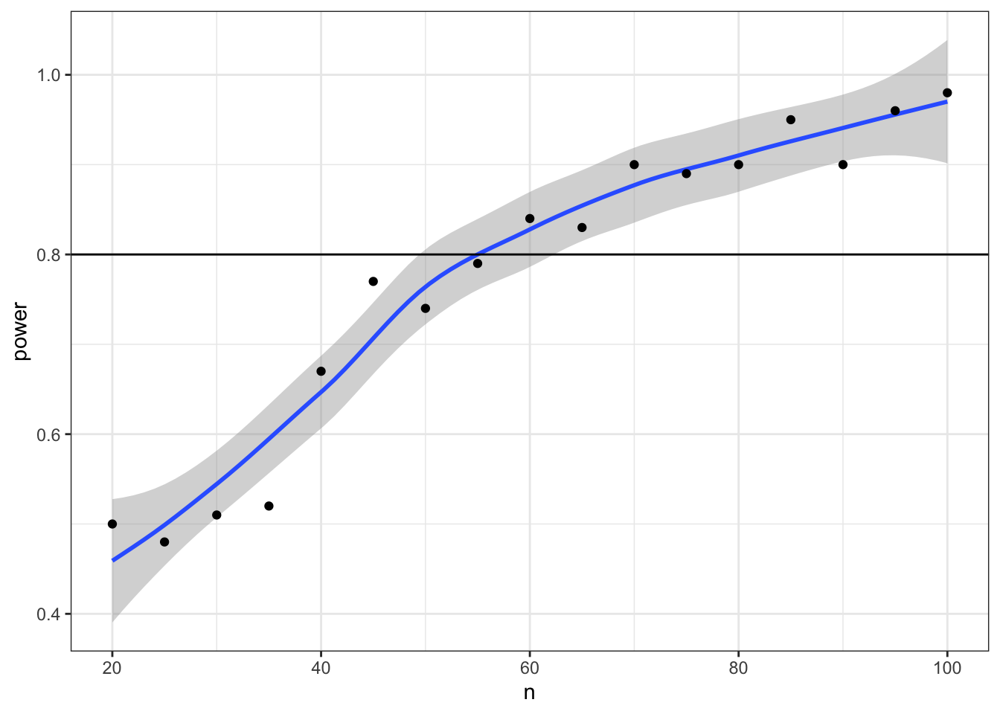

# Probability & Simulation {#sim}

## Learning Objectives

### Basic

1. Understand what types of data are best modeled by different distributions
    + uniform
    + binomial
    + normal
    + poisson
2. Generate and plot data randomly sampled from the above distributions
3. Test sampled distributions against a null hypothesis
    + exact binomial test
    + t-test (1-sample, independent samples, paired samples)
    + correlation (pearson, kendall and spearman)
4. Define the following statistical terms:
    + p-value
    + alpha
    + power
    + false positive (type I error)
    + false negative (type II error)
    + confidence interval

### Intermediate

5. Create a function to generate a sample with specific properties and run an inferential test
6. Calculate power using `replicate` and a sampling function
7. Calculate the minimum sample size for a specific power level and design

### Advanced

8. Generate 3+ variables from a multivariate normal distribution and plot them

## Resources

* [Chapter 21: Iteration](http://r4ds.had.co.nz/iteration.html)  of *R for Data Science*
* [Improving your statistical inferences](https://www.coursera.org/learn/statistical-inferences/) on Coursera (week 1)


## Distributions

Simulating data is a very powerful way to test your understanding of statistical 
concepts. We are going to use simulations to learn the basics of probability.


```r
# libraries needed for these examples
library(tidyverse)
library(MASS)
```


### Uniform Distribution

The uniform distribution is the simplest distribution. All numbers in the range 
have an equal probability of being sampled. 

#### Sample continuous distribution

`runif(n, min=0, max=1)` 

Use `runif()` to sample from a continuous uniform distribution.


```r
runif(10, min = 0, max = 1)
```

```
##  [1] 0.1594836 0.4781883 0.7647987 0.7696877 0.2685485 0.6730459 0.9787908
##  [8] 0.8463270 0.8566562 0.4451601
```

#### Sample discrete distribution

`sample(x, size, replace = FALSE, prob = NULL)`

Use `sample()` to sample from a discrete distribution.

Simulate a single roll of a 6-sided die.

```r
sample(6, 1)
```

```
## [1] 6
```

Simulate 10 rolls of a 6-sided die. Set `replace` to `TRUE` so each roll is 
independent. See what happens if you set `replace` to `FALSE`.

```r
sample(6, 10, replace = TRUE)
```

```
##  [1] 4 4 2 5 6 5 2 5 5 1
```

You can also use sample to sample from a list of named outcomes.


```r
pet_types <- c("cat", "dog", "ferret", "bird", "fish")
sample(pet_types, 10, replace = TRUE)
```

```
##  [1] "fish"   "fish"   "dog"    "ferret" "bird"   "dog"    "cat"   
##  [8] "cat"    "fish"   "fish"
```

Ferrets are a much less common pet than cats and dogs, so our sample isn't very 
realistic. You can set the probabilities of each item in the list with the `prob` 
argument.


```r
pet_types <- c("cat", "dog", "ferret", "bird", "fish")
pet_prob <- c(0.3, 0.4, 0.1, 0.1, 0.1)
sample(pet_types, 10, replace = TRUE, prob = pet_prob)
```

```
##  [1] "fish"   "dog"    "cat"    "dog"    "cat"    "cat"    "dog"   
##  [8] "dog"    "ferret" "bird"
```

### Binomial Distribution

The binomial distribution is useful for modeling binary data, where each 
observation can have one of two outcomes, like success/failure, yes/no or 
head/tails. 

#### Sample distribution

`rbinom(n, size, prob)`

The `rbinom` function will generate a random binomial distribution.

* `n` = number of observations
* `size` = number of trials
* `prob` = probability of success on each trial

Coin flips are a typical example of a binomial distribution, where we can assign 
head to 1 and tails to 0.

20 individual coin flips of a fair coin

```r
rbinom(20, 1, 0.5)
```

```
##  [1] 1 1 1 0 0 0 0 0 1 1 0 1 0 1 0 0 0 1 0 1
```

20 individual coin flips of a baised (0.75) coin

```r
rbinom(20, 1, 0.75)
```

```
##  [1] 1 0 0 0 0 1 0 1 1 1 1 1 0 1 0 1 1 1 1 1
```

You can generate the total number of heads in 1 set of 20 coin flips by setting 
`size` to 20 and `n` to 1.

```r
rbinom(1, 20, 0.75)
```

```
## [1] 15
```

You can generate more sets of 20 coin flips by increasing the `n`.

```r
rbinom(10, 20, 0.5)
```

```
##  [1] 10 12 10  7 12  8  9  8 10 11
```

You should always check your randomly generated data to check that it makes sense. 
For large samples, it's easiest to do that graphically. A histogram is usually 
the best choice for plotting binomial data.


```r
flips <- rbinom(1000, 20, 0.5)

ggplot() +
  geom_histogram(
    aes(flips), 
    binwidth = 1, 
    fill = "white", 
    color = "black"
  )
```

<div class="figure" style="text-align: center">

<p class="caption">(\#fig:sim_flips)**CAPTION THIS FIGURE!!**</p>
</div>

<div class="info">
<p>Run the simulation above several times, noting how the histogram changes. Try changing the values of <code>n</code>, <code>size</code>, and <code>prob</code>.</p>
</div>

#### Exact binomial test

`binom.test(x, n, p)`

You can test a binomial distribution against a specific probability using the 
exact binomial test.

* `x` = the number of successes
* `n` = the number of trials
* `p` = hypothesised probability of success

Here we can test a series of 10 coin flips from a fair coin and a biased coin 
against the hypothesised probability of 0.5 (even odds).


```r
n <- 10
fair_coin <- rbinom(1, n, 0.5)
biased_coin <- rbinom(1, n, 0.6)

binom.test(fair_coin, n, p = 0.5)
binom.test(biased_coin, n, p = 0.5)
```

```
## 
## 	Exact binomial test
## 
## data:  fair_coin and n
## number of successes = 4, number of trials = 10, p-value = 0.7539
## alternative hypothesis: true probability of success is not equal to 0.5
## 95 percent confidence interval:
##  0.1215523 0.7376219
## sample estimates:
## probability of success 
##                    0.4 
## 
## 
## 	Exact binomial test
## 
## data:  biased_coin and n
## number of successes = 7, number of trials = 10, p-value = 0.3438
## alternative hypothesis: true probability of success is not equal to 0.5
## 95 percent confidence interval:
##  0.3475471 0.9332605
## sample estimates:
## probability of success 
##                    0.7
```

<div class="info">
<p>Run the code above several times, noting the p-values for the fair and biased coins. Alternatively, you can <a href="https://debruine.shinyapps.io/coinsim/">simulate coin flips</a> online and build up a graph of results and p-values.</p>
<ul>
<li>How does the p-value vary for the fair and biased coins?</li>
<li>What happens to the confidence intervals if you increase n from 10 to 100?</li>
<li>What criterion would you use to tell if the observed data indicate the coin is fair or biased?</li>
<li>How often do you conclude the fair coin is biased (false positives)?</li>
<li>How often do you conclude the biased coin is fair (false negatives)?</li>
</ul>
</div>

#### False positives & negatives

The probability that a test concludes the fair coin is biased is called the 
*false positive rate* (or _Type I Error Rate_). The *alpha* is the false positive 
rate we accept for a test. This is traditionally set at 0.05, but there are good 
arguments for setting a different criterion in some circumstances.

The probability that a test concludes the biased coin is fair is called the 
*false negative rate* (of _Type II Error Rate_). The *power* of a test is 1 
minus its false negative rate (i.e., the *true positive rate*). Power depends 
on how biased the coin is and how many samples we take. 

#### Sampling function

To estimate these rates, we need to repeat the sampling above many times. 
A function is ideal for repeating the exact same procedure over and over. Set 
the arguments of the function to variables that you might want to change. Here, 
we will want to estimate power for:

* different sample sizes (`n`)
* different coin biases (`bias`)
* different hypothesised probabilities (`p`, defaults to 0.5)


```r
sim_binom_test <- function(n, bias, p = 0.5) {
  coin <- rbinom(1, n, bias)
  btest <- binom.test(coin, n, p)
  
  btest$p.value
}
```

Once you've created your function, test it a few times, changing the values.


```r
sim_binom_test(100, 0.6)
```

```
## [1] 0.0352002
```

#### Calculate power

Then you can use the `replicate()` function to run it many times and save all 
the output values. You can calculate the *power* of your analysis by checking the 
proportion of your simulated analyses that have a p-value less than your _alpha_ 
(the probability of rejecting the null hypothesis when the null hypothesis is true).


```r
my_reps <- replicate(1e4, sim_binom_test(100, 0.6))

mean(my_reps < 0.05)
```

```
## [1] 0.461
```

<div class="info">
<p><code>1e4</code> is just scientific notation for a 1 followed by 4 zeros (<code>10000</code>). When youre running simulations, you usually want to run a lot of them and it's a pain to keep track of whether you've typed 5 or 6 zeros (100000 vs 1000000) and this will change your running time by an order of magnitude.</p>
</div>

### Normal Distribution

#### Sample distribution

`rnorm(n, mean, sd)`

We can simulate a normal distribution of size `n` if we know the `mean` and 
standard deviation (`sd`). A density plot is usually the best way to visualise 
this type of data if your `n` is large.


```r
dv <- rnorm(1e5, 10, 2)

ggplot() +
  geom_density(aes(dv), fill = "white") +
  geom_vline(xintercept = mean(dv), color = "red") +
  geom_vline(xintercept = quantile(dv, .5 - (.6827/2)), color = "darkgreen") +
  geom_vline(xintercept = quantile(dv, .5 + (.6827/2)), color = "darkgreen") +
  geom_vline(xintercept = quantile(dv, .5 - (.9545/2)), color = "blue") +
  geom_vline(xintercept = quantile(dv, .5 + (.9545/2)), color = "blue") +
  geom_vline(xintercept = quantile(dv, .5 - (.9973/2)), color = "purple") +
  geom_vline(xintercept = quantile(dv, .5 + (.9973/2)), color = "purple") +
  scale_x_continuous(
    limits = c(0,20), 
    breaks = seq(0,20)
  )
```

<div class="figure" style="text-align: center">

<p class="caption">(\#fig:rnorm)**CAPTION THIS FIGURE!!**</p>
</div>

<div class="info">
<p>Run the simulation above several times, noting how the density plot changes. What do the vertical lines represent? Try changing the values of <code>n</code>, <code>mean</code>, and <code>sd</code>.</p>
</div>

#### T-test

`t.test(x, y, alternative, mu, paired)`

Use a t-test to compare the mean of one distribution to a null hypothesis 
(one-sample t-test), compare the means of two samples (independent-samples t-test), 
or compare pairs of values (paired-samples t-test).

You can run a one-sample t-test comparing the mean of your data to `mu`. Here is 
a simulated distribution with a mean of 0.5 and an SD of 1, creating an effect 
size of 0.5 SD when tested against a `mu` of 0. Run the simulation a few times to 
see how often the t-test returns a significant p-value (or run it in the [shiny app](http://shiny.psy.gla.ac.uk/debruine/normsim/)).


```r
sim_norm <- rnorm(100, 0.5, 1)
t.test(sim_norm, mu = 0)
```

```
## 
## 	One Sample t-test
## 
## data:  sim_norm
## t = 5.7482, df = 99, p-value = 1.001e-07
## alternative hypothesis: true mean is not equal to 0
## 95 percent confidence interval:
##  0.3957309 0.8129538
## sample estimates:
## mean of x 
## 0.6043423
```

Run an independent-samples t-test by comparing two lists of values.


```r
a <- rnorm(100, 0.5, 1)
b <- rnorm(100, 0.7, 1)
t_ind <- t.test(a, b, paired = FALSE)
t_ind
```

```
## 
## 	Welch Two Sample t-test
## 
## data:  a and b
## t = -1.933, df = 197.78, p-value = 0.05466
## alternative hypothesis: true difference in means is not equal to 0
## 95 percent confidence interval:
##  -0.582471984  0.005816091
## sample estimates:
## mean of x mean of y 
## 0.4745243 0.7628522
```

<div class="warning">
<p>The <code>paired</code> argument defaults to <code>FALSE</code>, but it's good practice to always explicitly set it so you are never confused about what type of test you are performing.</p>
</div>

#### Sampling function

We can use the `names()` function to find out the names of all the t.test parameters 
and use this to just get one type of data, like the test statistic (e.g., t-value).

```r
names(t_ind)
t_ind$statistic
```

```
## [1] "statistic"   "parameter"   "p.value"     "conf.int"    "estimate"   
## [6] "null.value"  "alternative" "method"      "data.name"  
##         t 
## -1.933038
```

Alternatively, use `broom::tidy()` to convert the output into a tidy table.


```r
broom::tidy(t_ind)
```

```
## # A tibble: 1 x 10
##   estimate estimate1 estimate2 statistic p.value parameter conf.low
##      <dbl>     <dbl>     <dbl>     <dbl>   <dbl>     <dbl>    <dbl>
## 1   -0.288     0.475     0.763     -1.93  0.0547      198.   -0.582
## # … with 3 more variables: conf.high <dbl>, method <chr>,
## #   alternative <chr>
```


If you want to run the simulation many times and record information each time, 
first you need to turn your simulation into a function.


```r
sim_t_ind <- function(n, m1, sd1, m2, sd2) {
  v1 <- rnorm(n, m1, sd1)
  v2 <- rnorm(n, m2, sd2)
  t_ind <- t.test(v1, v2, paired = FALSE)
  
  return(t_ind$p.value)
}
```

Run it a few times to check that it gives you sensible values.


```r
sim_t_ind(100, 0.7, 1, 0.5, 1)
```

```
## [1] 0.4601542
```

Now replicate the simulation 1000 times.


```r
my_reps <- replicate(1e4, sim_t_ind(100, 0.7, 1, 0.5, 1))

alpha <- 0.05
power <- mean(my_reps < alpha)
power
```

```
## [1] 0.2965
```

<div class="try">
<p>Run the code above several times. How much does the power value fluctuate? How many replications do you need to run to get a reliable estimate of power?</p>
</div>

Compare your power estimate from simluation to a power calculation using `power.t.test()`. 
Here, `delta` is the difference between `m1` and `m2` above.


```r
power.t.test(n = 100, delta = 0.2, sd = 1, sig.level = alpha, type = "two.sample")
```

```
## 
##      Two-sample t test power calculation 
## 
##               n = 100
##           delta = 0.2
##              sd = 1
##       sig.level = 0.05
##           power = 0.2902664
##     alternative = two.sided
## 
## NOTE: n is number in *each* group
```


You can plot the distribution of p-values.


```r
ggplot() + 
  geom_histogram(
    aes(my_reps), 
    binwidth = 0.05, 
    boundary = 0,
    fill = "white", 
    color = "black"
  )
```

<div class="figure" style="text-align: center">

<p class="caption">(\#fig:plot-reps)**CAPTION THIS FIGURE!!**</p>
</div>

<div class="try">
<p>What do you think the distribution of p-values is when there is no effect (i.e., the means are identical)? Check this yourself.</p>
</div>

<div class="warning">
<p>Make sure the <code>boundary</code> argument is set to <code>0</code> for p-value histograms. See what happens with a null effect if <code>boundary</code> is not set.</p>
</div>

#### Bivariate Normal

##### Correlation 

You can test if two continuous variables are related to each other using the `cor()` function.

Below is a quick and dirty way to generate two correlated variables. `x` is drawn 
from a normal distribution, while `y` is the sum of `x` and another value drawn 
from a random normal distribution. We'll learn later how to generate specific 
correlations in simulated data.


```r
n <- 100 # number of random samples

x <- rnorm(n, 0, 1)
y <- x + rnorm(n, 0, 1)

cor(x, y)
```

```
## [1] 0.7097442
```

`cor()` defaults to Pearson's correlations. Set the `method` argument to use 
Kendall or Spearman correlations.


```r
cor(x, y, method = "spearman")
```

```
## [1] 0.7153195
```

##### Sample distribution
<a name="bvn"></a>

What if we want to sample from a population with specific relationships between 
variables? We can sample from a _bivariate normal distribution_ using the `MASS` package,


```r
n <- 1000 # number of random samples
rho <- 0.5 # population correlation between the two variables

mu <- c(10, 20) # the means of the samples
stdevs <- c(5, 6) # the SDs of the samples

# correlation matrix
cor_mat <- matrix(c(  1, rho, 
                    rho,   1), 2) 

# create the covariance matrix
sigma <- (stdevs %*% t(stdevs)) * cor_mat

# sample from bivariate normal distribution
bvn <- mvrnorm(n, mu, sigma) 

cor(bvn) # check correlation matrix
```

```
##           [,1]      [,2]
## [1,] 1.0000000 0.4986956
## [2,] 0.4986956 1.0000000
```

Plot your sampled variables to check everything worked like you expect. You need 
to convert the output of `mvnorm` into a tibble in order to use it in ggplot.


```r
bvn %>%
  as_tibble() %>%
  ggplot(aes(V1, V2)) +
    geom_point(alpha = 0.5) + 
    geom_smooth(method = "lm") +
    geom_density2d()
```

```
## Warning: `as_tibble.matrix()` requires a matrix with column names or a `.name_repair` argument. Using compatibility `.name_repair`.
## This warning is displayed once per session.
```

<div class="figure" style="text-align: center">

<p class="caption">(\#fig:graph-bvn)**CAPTION THIS FIGURE!!**</p>
</div>

### Multivariate Normal

##### Sample distribution


```r
n <- 200 # number of random samples
rho1_2 <- 0.5 # correlation betwen v1 and v2
rho1_3 <- 0 # correlation betwen v1 and v3
rho2_3 <- 0.7 # correlation betwen v2 and v3

mu <- c(10, 20, 30) # the means of the samples
stdevs <- c(8, 9, 10) # the SDs of the samples

# correlation matrix
cor_mat <- matrix(c(     1, rho1_2, rho1_3, 
                    rho1_2,      1, rho2_3,
                    rho1_3, rho2_3,      1), 3) 

sigma <- (stdevs %*% t(stdevs)) * cor_mat
bvn3 <- mvrnorm(n, mu, sigma)

cor(bvn3) # check correlation matrix
```

```
##           [,1]      [,2]      [,3]
## [1,] 1.0000000 0.5980426 0.1007923
## [2,] 0.5980426 1.0000000 0.6949006
## [3,] 0.1007923 0.6949006 1.0000000
```

##### 3D Plots

You can use the `plotly` library to make a 3D graph.


```r
library(plotly)
```

```
## 
## Attaching package: 'plotly'
```

```
## The following object is masked from 'package:MASS':
## 
##     select
```

```
## The following object is masked from 'package:ggplot2':
## 
##     last_plot
```

```
## The following object is masked from 'package:stats':
## 
##     filter
```

```
## The following object is masked from 'package:graphics':
## 
##     layout
```

```r
marker_style = list(
    color = "#ff0000", 
    line = list(
      color = "#444", 
      width = 1
    ), 
    opacity = 0.5,
    size = 5
  )

bvn3 %>%
  as_tibble() %>%
  plot_ly(x = ~V1, y = ~V2, z = ~V3, marker = marker_style) %>%
  add_markers()
```

<div class="figure" style="text-align: center">
<!--html_preserve--><div id="htmlwidget-398537f4a7f58e5be370" style="width:100%;height:480px;" class="plotly html-widget"></div>
<script type="application/json" data-for="htmlwidget-398537f4a7f58e5be370">{"x":{"visdat":{"ed0c1cb5d931":["function () ","plotlyVisDat"]},"cur_data":"ed0c1cb5d931","attrs":{"ed0c1cb5d931":{"x":{},"y":{},"z":{},"marker":{"color":"#ff0000","line":{"color":"#444","width":1},"opacity":0.5,"size":5},"alpha_stroke":1,"sizes":[10,100],"spans":[1,20],"type":"scatter3d","mode":"markers","inherit":true}},"layout":{"margin":{"b":40,"l":60,"t":25,"r":10},"scene":{"xaxis":{"title":"V1"},"yaxis":{"title":"V2"},"zaxis":{"title":"V3"}},"hovermode":"closest","showlegend":false},"source":"A","config":{"modeBarButtonsToAdd":[{"name":"Collaborate","icon":{"width":1000,"ascent":500,"descent":-50,"path":"M487 375c7-10 9-23 5-36l-79-259c-3-12-11-23-22-31-11-8-22-12-35-12l-263 0c-15 0-29 5-43 15-13 10-23 23-28 37-5 13-5 25-1 37 0 0 0 3 1 7 1 5 1 8 1 11 0 2 0 4-1 6 0 3-1 5-1 6 1 2 2 4 3 6 1 2 2 4 4 6 2 3 4 5 5 7 5 7 9 16 13 26 4 10 7 19 9 26 0 2 0 5 0 9-1 4-1 6 0 8 0 2 2 5 4 8 3 3 5 5 5 7 4 6 8 15 12 26 4 11 7 19 7 26 1 1 0 4 0 9-1 4-1 7 0 8 1 2 3 5 6 8 4 4 6 6 6 7 4 5 8 13 13 24 4 11 7 20 7 28 1 1 0 4 0 7-1 3-1 6-1 7 0 2 1 4 3 6 1 1 3 4 5 6 2 3 3 5 5 6 1 2 3 5 4 9 2 3 3 7 5 10 1 3 2 6 4 10 2 4 4 7 6 9 2 3 4 5 7 7 3 2 7 3 11 3 3 0 8 0 13-1l0-1c7 2 12 2 14 2l218 0c14 0 25-5 32-16 8-10 10-23 6-37l-79-259c-7-22-13-37-20-43-7-7-19-10-37-10l-248 0c-5 0-9-2-11-5-2-3-2-7 0-12 4-13 18-20 41-20l264 0c5 0 10 2 16 5 5 3 8 6 10 11l85 282c2 5 2 10 2 17 7-3 13-7 17-13z m-304 0c-1-3-1-5 0-7 1-1 3-2 6-2l174 0c2 0 4 1 7 2 2 2 4 4 5 7l6 18c0 3 0 5-1 7-1 1-3 2-6 2l-173 0c-3 0-5-1-8-2-2-2-4-4-4-7z m-24-73c-1-3-1-5 0-7 2-2 3-2 6-2l174 0c2 0 5 0 7 2 3 2 4 4 5 7l6 18c1 2 0 5-1 6-1 2-3 3-5 3l-174 0c-3 0-5-1-7-3-3-1-4-4-5-6z"},"click":"function(gd) { \n        // is this being viewed in RStudio?\n        if (location.search == '?viewer_pane=1') {\n          alert('To learn about plotly for collaboration, visit:\\n https://cpsievert.github.io/plotly_book/plot-ly-for-collaboration.html');\n        } else {\n          window.open('https://cpsievert.github.io/plotly_book/plot-ly-for-collaboration.html', '_blank');\n        }\n      }"}],"cloud":false},"data":[{"x":[11.1148934084963,-1.66498088857444,10.6811913231604,4.78726002783861,6.88514032796861,3.01805113414321,13.1795268100109,3.74787301926506,-0.181775531936175,0.87435384755309,16.5698489400346,12.4265034172464,1.45650927465134,8.05113464911467,31.8438893047431,7.58117641418362,22.6847711466373,-1.85557963677383,15.8122919481733,17.2808294764598,6.76173905606375,14.5638328090566,11.6374942303838,19.9891868393746,13.2060588689455,4.14672160722232,10.1955741604546,16.7974027585985,23.7035405505464,7.70837420988864,-2.15218490561808,14.0317958132652,16.7913989282841,2.98147089019423,-8.55672999697654,19.290547930685,14.6158547871846,14.030141309246,14.5226020031962,11.9902711059039,2.65887063781444,10.3979646039631,-2.35952032550511,7.48588212478059,23.7560949435314,6.49800483461837,11.4761737741547,-7.134691085379,14.4789565041416,-1.77576399591401,8.16279262753046,18.353798278226,9.24803681700702,3.876175682443,3.71631274654606,11.398541683716,-2.51261164958883,3.48530848336078,15.5708271601487,16.4736735575654,10.0240058017052,18.5235929827603,21.1646162905576,-0.095647246787939,17.8791547924125,17.6843007079761,10.9433611790579,11.781118519091,16.3700363837459,8.56837382182195,16.5913846337896,4.9113042881134,17.6020957785226,16.9528227083516,20.1448304850817,6.17889339889091,2.41798064686243,22.9312805902455,25.7581228925173,18.1358013879732,12.6185092014007,3.53986018546909,2.19719154634623,21.2167368265081,10.1098971138003,3.46059846862061,23.2548339285602,-7.81571036717409,-4.54126541817403,24.9114678610626,16.9700778288186,14.5447411433333,8.3496063536746,14.6414770509675,12.7425732162067,14.0768936028322,15.7256120007008,15.0033920579141,11.7540646779828,-3.32749076303686,3.46708679737292,13.8192713446663,17.8470929733787,9.47809198704144,2.0796848390253,8.91843888866914,18.1385741598274,1.27248128493452,-9.32866743821121,20.0497415169071,27.9409274196184,3.31964398415861,14.7318280275677,16.6583984600534,0.928702646359394,10.1678696438659,11.5042681608989,4.24516904310622,8.76681569685673,21.9093649964623,8.20796554475855,1.27511070719744,-2.01752009028856,7.24353755999789,24.6618402819927,9.11307747134696,19.6965424695837,-4.66258322648446,2.48733753280544,7.87772317474198,14.1876456571292,14.7999547523464,3.49018882037571,4.96000013576747,11.975028608271,15.8480798496304,14.832665257273,13.5599144131624,22.1406024247893,7.31457854047192,6.57639972253891,11.4178231306918,14.4677203451809,9.61897705897155,0.470855481266547,20.836333625054,8.28849374524221,14.5838576318135,9.5319991638203,5.98348358735693,22.1855670554324,26.3195540080616,33.1591398285116,2.41404786524075,7.29167733804315,10.958983652565,8.21007583378738,6.07715849589573,16.1480898315212,15.6431892328152,4.3655708623208,16.1912746845997,25.9450913958415,-2.21708948129395,-16.0207990166948,-2.50746931983802,10.9310610169806,3.46347962852626,11.8968131376732,8.74454443444312,23.3746814309392,26.0022597214998,12.3753348492352,5.85621531348225,7.52822281122869,11.2523775592591,14.784269817157,4.82910667799392,13.2121142177486,7.61265806595182,-2.15858419316497,17.6293066166568,-6.64318246937081,17.6321253368242,11.0489878355592,3.30359368392457,7.90323607356413,21.1378727998954,14.2802877666847,9.4528121730635,16.1886854066549,4.58088068617413,14.7394204221826,13.944475991566,19.2930885506612,0.267910602957652,1.39970640632444,0.752335267231922,20.0010718730004,-0.288272146142694],"y":[11.3142513536567,19.4628404426847,17.6557525685348,4.95107205228466,21.817487659359,10.2259972169188,24.5467874018055,25.2624917655222,34.4569896878497,18.7101014367376,29.14059664125,31.8619948481306,4.30333712620789,23.3676872713337,43.2728947073299,16.4520066969602,15.5097264545959,10.9339850338437,19.1959442130777,23.6800462596908,15.2607463469114,34.6477029726345,13.3803780581169,18.386682890763,21.1465042891789,4.824611452621,26.1877444257019,27.2723334678665,35.2119394863957,27.7711142806995,7.1197523363117,26.6812319714731,17.284054251371,18.8993634560284,17.1753116039415,23.8867998292136,28.8180961322882,28.6323117709672,26.4501642954248,22.8123713498582,5.26720938932735,14.1211324409628,-4.36876079631003,31.0194897985618,28.9111205563551,12.2748691844461,22.8702881486256,1.50325430944365,21.4362738840641,17.6457183343654,10.3649566057793,23.4059261238669,18.4235294288521,15.2957541194795,14.012265638748,20.6678326834623,9.99540952204818,21.3793703683506,32.9022861254977,21.824944413323,25.5148487059503,30.3752187591089,27.1683253430368,11.5712536447209,21.9698547356066,17.5451090869945,21.8249388272084,15.8548447059514,14.2151130497875,27.6003313418188,33.8179991186594,10.6033238144759,23.8915063804932,7.53370345938155,22.9106193946624,14.4679962772395,18.5841450418415,37.2504303848473,28.9933693161702,26.5343949093641,24.3024258669068,5.55476425624523,22.6822715769932,28.2424898528385,12.1358100334843,8.24623724142442,46.2011463325562,1.22244195190766,27.1600542619408,17.7643865750468,21.4347368254892,10.4183333094749,21.4125383233079,25.7624358979432,19.6787766935566,24.2480938002438,32.9276783207064,19.8033891755952,33.7547466573742,12.1142260160141,16.4917623107947,27.3956507920295,20.3459147922709,19.4561025141169,10.6207252252284,17.7150060067604,24.1448864846663,16.6325680542512,-8.05955496421473,27.4958093935573,22.3883274541547,30.3565062944689,39.074002809608,18.9282990865516,11.2075298123745,27.0746707220919,25.1804059023683,11.0257169788071,18.0123866651442,25.224325062325,20.8879119802848,4.30152162443666,10.2421158373819,3.08528812633165,40.9979423982973,10.5484302141932,12.6942048691093,16.6343428371679,23.8476938902904,37.9484064017918,16.6386502980992,32.5257364240722,14.9545951526251,18.9766437862907,24.3789296775903,22.4827369600428,30.7118519890683,29.65666068747,27.4488779755106,26.1138469700269,0.610569481699255,35.7813915604707,26.660161753753,14.3813052973617,4.02976743198094,8.82151681079848,15.2275776819573,29.3090650574094,32.0695640729609,16.131927129955,36.5951299738802,36.9809137621398,37.0536538284069,24.2706650963441,18.8828155440265,27.5367978260365,23.5284886042624,22.9167048335702,23.5630062253305,9.42960672224729,14.7675288606382,23.2515254105736,39.8204854576362,8.24346427881328,11.1045047744758,1.90050425436231,20.9232596509789,31.7091928838321,14.5543184260051,21.3784550200961,44.0108084119517,29.4122556922672,25.8820815740264,24.9955106222381,30.7651409620457,27.8449323676795,25.9402340158256,14.1879155269193,16.7777062667743,9.28066044078779,4.58467160700904,18.0170810403703,19.4864083605284,31.8217891465829,23.8954838641425,7.62028467140052,14.7289465194314,26.1867731721274,25.4828127380156,29.5565470607616,21.534381496136,20.0186337627439,26.0718284561408,35.0337218385103,15.637103745121,20.7905430201623,11.7831687576067,8.62152461803907,35.4671809288675,14.1177740660904],"z":[23.3056886875019,38.1904125485321,20.9259100047855,12.8709797762802,30.1667949179176,26.5762687536294,37.9500599819661,31.945094737688,51.781067135754,29.6246017438921,34.5259243509077,38.7083636589081,21.2184215873117,37.0570949330247,37.3901939984151,28.1816665985689,6.49128017822727,35.9736583318908,25.692484188583,31.6073043516226,29.2182849715847,39.879744167991,22.9455329128774,22.9650379225763,29.4492436605455,13.9808719459961,36.529041317483,33.7918877819452,37.9536445987545,38.6709696434672,18.2850215776852,31.0865095170726,23.7179261832991,29.6268591313795,42.9231614846237,30.5933081783238,41.8427284939299,39.1386936756847,32.947785907181,35.4645361195111,18.0383418556767,29.6782854664054,13.8517330457453,42.387228696378,32.8878845936131,26.8145321218888,30.4892035774145,11.8601251229675,27.0036981360709,54.8918169331917,23.6372767419564,44.2815689795873,29.8459443785672,36.6319632527921,26.847582135015,29.423611517949,27.6751157716671,39.1097506754011,44.0109609697286,27.3913036422733,36.188874922214,39.0077236371587,35.3541353949638,25.1121429733554,30.5797121423827,18.7580064482851,24.175323696158,27.2141740685196,15.0773458341387,41.2508315726659,37.692214051231,32.948709859135,26.3544821012255,11.5349615983488,23.8626065612663,23.7141569772208,25.9485288835724,33.5124631893497,35.4573945795999,23.7159959830747,41.5601544229212,21.7127786434553,45.5419809494962,36.3427687795288,27.7265359163373,20.8957726252501,37.2604958479942,20.2540399121682,41.5692914350533,13.9661499374392,23.0722051269961,11.7318451688934,36.7993927290413,27.21217093316,40.2848963256064,34.3700483676921,36.2782442735901,28.2414497193164,43.8022425803844,29.406981695878,25.9099864442135,39.8685399704939,15.481656780691,32.700733214484,33.4514999647136,32.004454402978,28.7865916357954,28.5785673292063,12.0772911750627,37.8071518575751,27.8568388823057,42.3562804981346,53.7354244994399,32.1413423213359,33.9275283259942,38.4999749370075,22.1769234990292,24.9099656051475,23.4801807942709,36.7534254012368,36.0321871401764,24.4870182091137,26.6330459100522,13.9166499048262,47.4659511285402,8.16742635568904,26.2189424234198,20.8817554055301,43.7788128713553,54.4389148444979,23.5842758327404,43.1742641927296,21.7348599336383,26.5572524861645,43.3676735996844,28.0142549790496,44.0834865061032,26.2727011235645,32.2897467148473,34.263736366614,18.0149857036007,47.2006368415867,37.094347535178,19.0368556252555,21.5095060634708,20.8787004116612,37.7711320662943,27.4164559258456,35.3040847948313,34.0854662272644,35.7631849672786,31.7005129862698,26.5334415710184,33.8734501396952,18.3119402098496,36.1172677455415,47.0130015864936,36.1546965599502,31.5510058615113,9.84639327665813,29.8716551834612,40.0514434711092,40.0791574062273,26.4780355558516,34.4846683132664,11.9185995779508,31.7105470411136,45.546191013024,17.1989804521013,27.5504690850461,46.574131321165,35.7542793209018,26.3831501941907,32.7381030293211,37.997492166159,20.0613734301851,38.0740537346843,34.7474287976971,29.5103941395398,17.1547694603168,27.3554071636278,25.7813264288705,45.545715690094,47.9993703089265,24.9547529839293,21.3323390832915,24.9252347380147,23.4544669026669,30.8410689091183,42.2037328949707,31.1461032170714,27.5654868647415,31.216383439263,44.9873381561458,23.2172997829676,33.4583514095478,27.5539280361629,22.1694888534779,35.2855276819751,22.9586125354087],"marker":{"color":"#ff0000","line":{"color":"#444","width":1},"opacity":0.5,"size":5},"type":"scatter3d","mode":"markers","error_y":{"color":"rgba(31,119,180,1)"},"error_x":{"color":"rgba(31,119,180,1)"},"line":{"color":"rgba(31,119,180,1)"},"frame":null}],"highlight":{"on":"plotly_click","persistent":false,"dynamic":false,"selectize":false,"opacityDim":0.2,"selected":{"opacity":1},"debounce":0},"base_url":"https://plot.ly"},"evals":["config.modeBarButtonsToAdd.0.click"],"jsHooks":[]}</script><!--/html_preserve-->
<p class="caption">(\#fig:3d-graph-mvn)**CAPTION THIS FIGURE!!**</p>
</div>

## Example

This example uses the [Growth Chart Data Tables](https://www.cdc.gov/growthcharts/data/zscore/zstatage.csv) 
from the [US CDC](https://www.cdc.gov/growthcharts/zscore.htm). 

### Load & wrangle

We have to do a little data wrangling first. Have a look at the data after you 
import it and relabel `Sex` to `male` and `female` instead of `1` and `2`. Also 
convert `Agemos` (age in months) to years. Relabel the column `0` as `mean` and 
calculate a new column named `sd` as the difference between columns `1` and `0`. 


```r
height_age <- read_csv("https://www.cdc.gov/growthcharts/data/zscore/zstatage.csv") %>%
  filter(Sex %in% c(1,2)) %>%
  mutate(
    sex = recode(Sex, "1" = "male", "2" = "female"),
    age = as.numeric(Agemos)/12,
    sd = `1` - `0`
  ) %>%
  dplyr::select(sex, age, mean = `0`, sd)
```

```
## Parsed with column specification:
## cols(
##   Sex = col_character(),
##   Agemos = col_character(),
##   `-2` = col_double(),
##   `-1.5` = col_double(),
##   `-1` = col_double(),
##   `-0.5` = col_double(),
##   `0` = col_double(),
##   `0.5` = col_double(),
##   `1` = col_double(),
##   `1.5` = col_double(),
##   `2` = col_double()
## )
```

<div class="warning">
<p>If you run the code above without putting <code>dplyr::</code> before the <code>select()</code> function, you will get an error message. This is because the <code>MASS</code> package also has a function called <code>select()</code> and, since we loaded <code>MASS</code> after <code>tidyverse</code>, the <code>MASS</code> function is the default. When you loaded <code>MASS</code>, you should have seen a warning like &quot;The following object is masked from ‘package:dplyr’: select&quot;. You can use functions with the same name from different packages by specifying the package before the function name, separated by two colons.</p>
</div>

### Plot

Plot your new data frame to see how mean height changes with age for boys and girls.


```r
ggplot(height_age, aes(age, mean, color = sex)) +
  geom_smooth(aes(ymin = mean - sd, ymax = mean + sd), stat="identity")
```

<div class="figure" style="text-align: center">

<p class="caption">(\#fig:plot-height-means)**CAPTION THIS FIGURE!!**</p>
</div>

### Get means and SDs

Create new variables for the means and SDs for 20-year-old men and women.


```r
height_sub <- height_age %>% filter(age == 20)

m_mean <- height_sub %>% filter(sex == "male") %>% pull(mean)
m_sd   <- height_sub %>% filter(sex == "male") %>% pull(sd)
f_mean <- height_sub %>% filter(sex == "female") %>% pull(mean)
f_sd   <- height_sub %>% filter(sex == "female") %>% pull(sd)

height_sub
```

```
## # A tibble: 2 x 4
##   sex      age  mean    sd
##   <chr>  <dbl> <dbl> <dbl>
## 1 male      20  177.  7.12
## 2 female    20  163.  6.46
```

### Simulate a population

Simulate 50 random male heights and 50 radom female heights using the `rnorm()` 
function and the means and SDs above. Plot the data.


```r
sim_height <- tibble(
  male = rnorm(50, m_mean, m_sd),
  female = rnorm(50, f_mean, f_sd)
) %>%
  gather("sex", "height", male:female)

ggplot(sim_height) +
  geom_density(aes(height, fill = sex), alpha = 0.5) +
  xlim(125, 225)
```

<div class="figure" style="text-align: center">

<p class="caption">(\#fig:sim-height-20)**CAPTION THIS FIGURE!!**</p>
</div>

<div class="try">
<p>Run the simulation above several times, noting how the density plot changes. Try changing the age you're simulating.</p>
</div>

### Analyse simulated data

Use the `sim_t_ind(n, m1, sd1, m2, sd2)` function we created above to generate 
one simulation with a sample size of 50 in each group using the means and SDs 
of male and female 14-year-olds.


```r
height_sub <- height_age %>% filter(age == 14)
m_mean <- height_sub %>% filter(sex == "male") %>% pull(mean)
m_sd   <- height_sub %>% filter(sex == "male") %>% pull(sd)
f_mean <- height_sub %>% filter(sex == "female") %>% pull(mean)
f_sd   <- height_sub %>% filter(sex == "female") %>% pull(sd)

sim_t_ind(50, m_mean, m_sd, f_mean, f_sd)
```

```
## [1] 0.01405976
```

### Replicate simulation

Now replicate this 1e4 times using the `replicate()` function. This function 
will save the returned p-values in a list (`my_reps`). We can then check what 
proportion of those p-values are less than our alpha value. This is the power of 
our test.


```r
my_reps <- replicate(1e4, sim_t_ind(50, m_mean, m_sd, f_mean, f_sd))

alpha <- 0.05
power <- mean(my_reps < alpha)
power
```

```
## [1] 0.6448
```

### One-tailed prediction

This design has about 65% power to detect the sex difference in height (with a 
2-tailed test). Modify the `sim_t_ind` function for a 1-tailed prediction.

You could just set `alternative` equal to "greater" in the function, but it might be 
better to add the `alternative` argument to your function (giving it the same default 
value as `t.test`) and change the value of `alternative` in the function to `alternative`.


```r
sim_t_ind <- function(n, m1, sd1, m2, sd2, alternative = "two.sided") {
  v1 <- rnorm(n, m1, sd1)
  v2 <- rnorm(n, m2, sd2)
  t_ind <- t.test(v1, v2, paired = FALSE, alternative = alternative)
  
  return(t_ind$p.value)
}

my_reps <- replicate(1e4, sim_t_ind(50, m_mean, m_sd, f_mean, f_sd, "greater"))
mean(my_reps < alpha)
```

```
## [1] 0.7591
```

### Range of sample sizes

What if we want to find out what sample size will give us 80% power? We can try 
trial and error. We know the number should be slightly larger than 50. But you 
can search more systematically by repeating your power calculation for a range 
of sample sizes. 

<div class="info">
<p>This might seem like overkill for a t-test, where you can easily look up sample size calculators online, but it is a valuable skill to learn for when your analyses become more complicated.</p>
</div>

Start with a relatively low number of replications and/or more spread-out samples 
to estimate where you should be looking more specifically. Then you can repeat 
with a narrower/denser range of sample sizes and more iterations.


```r
alpha <- 0.05
power_table <- tibble(
  n = seq(20, 100, by = 5)
) %>%
  mutate(power = map_dbl(n, function(n) {
    ps <- replicate(1e3, sim_t_ind(n, m_mean, m_sd, f_mean, f_sd, "greater"))
    mean(ps < alpha)
  }))

ggplot(power_table, aes(n, power)) +
  geom_smooth() +
  geom_point() +
  geom_hline(yintercept = 0.8)
```

```
## `geom_smooth()` using method = 'loess' and formula 'y ~ x'
```

<div class="figure" style="text-align: center">

<p class="caption">(\#fig:range-sample-sizes)**CAPTION THIS FIGURE!!**</p>
</div>

Now we can narrow down our search to values around 55 (plus or minus 5) and 
increase the number of replications from 1e3 to 1e4.


```r
power_table <- tibble(
  n = seq(50, 60)
) %>%
  mutate(power = map_dbl(n, function(n) {
    ps <- replicate(1e3, sim_t_ind(n, m_mean, m_sd, f_mean, f_sd, "greater"))
    mean(ps < alpha)
  }))

##ggplot(power_table, aes(n, power)) +
##  geom_smooth() +
##  geom_point() +
##  geom_hline(yintercept = 0.8) +
##  scale_x_continuous(breaks = sample_size)
```

## Formative exercises

Download the [formative exercises](formative_exercises/08_simulations_stub.Rmd). See the [answers](formative_exercises/08_simulations_answers.Rmd) only after you've attempted all the questions.

