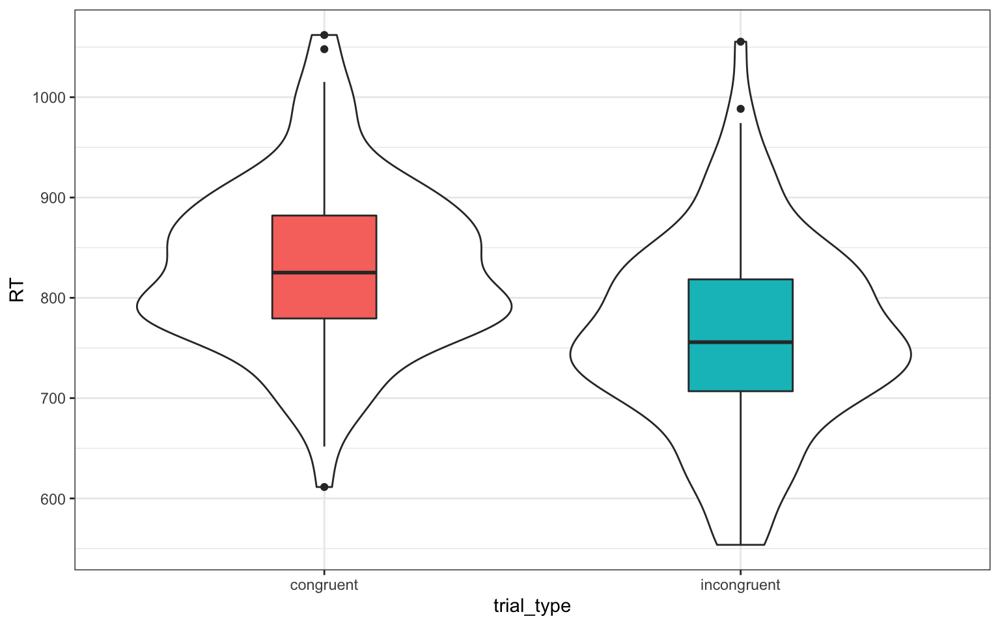

# Introduction to GLM {#glm}


## Learning Objectives

### Basic

1. Prove to yourself the correspondence among two-sample t-test, one-way ANOVA, and linear regression with dummy coding
2. Given data and a GLM, generate a decomposition matrix and calculate sums of squares, mean squares, and F ratios

## Resources

* [Jeff Miller and Patricia Haden, Statistical Analysis with the Linear Model (free online textbook)](http://www.otago.ac.nz/psychology/otago039309.pdf)
* [lecture slides introducing the General Linear Model](slides/08_glm_slides.pdf)
* [GLM shiny app](http://rstudio2.psy.gla.ac.uk/Dale/GLM)
* [F distribution](http://rstudio2.psy.gla.ac.uk/Dale/fdist)


## GLM

### What is the GLM?

The General Linear Model (GLM) a general mathematical framework for expressing relationships among variables that can express or test linear relationships between a numerical `**dependent variable** and any combination of categorical or continuous **independent variables**.

A very simple linear model is the relationship between height and foot size in adults.

$footsize = avgfootsize + A * height + error$

### Components

There are some mathematical conventions that you need to learn to understand the equations representing linear models. Once you understand those, learning about the GLM will get much easier.


| Component of GLM | Notation                      |
|------------------|-------------------------------|
| DV               | \( Y \)                       |
| Grand Average    | \( \mu \) (the Greek letter "mu")   |
| Main Effects     | \( A, B, C, \ldots \)         |
| Interactions     | \( AB, AC, BC, ABC, \ldots \) |
| Random Error     | \( S(Group) \)                |

The linear equation predicts the dependent variable ($Y$) as the sum of the grand average value of $Y$ ($\mu$, also called the intercept), the main effects of all the predictor variables ($A+B+C+ \ldots$), the interactions among all the predictor variables ($AB, AC, BC, ABC, \ldots$), and some random error ($S(Group)$). The equation for a model with two predictor variables ($A$ and $B$) and their interaction ($AB$) is written like this:

$Y$ ~ $\mu+A+B+AB+S(Group)$

### Simulating data from GLM

A good way to learn about linear models is to simulate data where you know exactly how the variables are related, and then analyses this simulated data to see where the parameters show up in the analysis.

We'll start with a very simple linear model that just has a single categorical predictor. Let's say we're predicting reaction times for congruent and incongruent trials in a Stroop task. Average reaction time (`mu`) is 800ms, and is 50ms faster for congruent than incongruent trials (`effect`). 

People won't always respond exactly the same way. Some people will be naturally faster or slower, and some will respond to trial congruency more or less. And one person might be a little faster one some trials than others, due to random fluctuations in attention, learning about the task, or fatigue. So we can add an error term to each trial. We can't know how much any specific trial will differ, but we can characterise the distribution of how much trials differ from average and then sample from this distribution. 

Here, we'll assume the error term is sampled from a normal distribution with a standard deviation of 100 ms (the mean of the error term distribution is always 0). We'll also sample 100 trials of each type, so we can see a range of variation.


```r
n_per_grp <- 100
mu <- 800
effect <- 50
error_sd <- 100
trial_types <- c("congruent" = 0.5, "incongruent" = -0.5)

dat <- data.frame(
  trial_type = rep(names(trial_types), each = n_per_grp),
  trial_type.e = rep(trial_types, each = n_per_grp),
  error = rnorm(2*n_per_grp, 0, error_sd)
) %>%
  mutate(RT = mu + effect*trial_type.e + error)

ggplot(dat, aes(trial_type, RT)) + 
  geom_violin() +
  geom_boxplot(aes(fill = trial_type), width = 0.25, show.legend = FALSE)
```



Now we can analyse the data we simulated using the function `lm()`. It takes the formula as the first argument. This is the same as the data-generating equation, but you can omit the error term (this is implied), and takes the data table as the second argument. Use the `summary()` function to see the statistical summary.


```r
lm(RT ~ trial_type.e, data = dat) %>% summary()
```

```
## 
## Call:
## lm(formula = RT ~ trial_type.e, data = dat)
## 
## Residuals:
##      Min       1Q   Median       3Q      Max 
## -308.586  -67.040   -1.844   67.406  254.470 
## 
## Coefficients:
##              Estimate Std. Error t value Pr(>|t|)    
## (Intercept)   804.533      6.991 115.078  < 2e-16 ***
## trial_type.e   40.050     13.982   2.864  0.00463 ** 
## ---
## Signif. codes:  0 '***' 0.001 '**' 0.01 '*' 0.05 '.' 0.1 ' ' 1
## 
## Residual standard error: 98.87 on 198 degrees of freedom
## Multiple R-squared:  0.03979,	Adjusted R-squared:  0.03494 
## F-statistic: 8.204 on 1 and 198 DF,  p-value: 0.00463
```

Notice how the estimate for the `(Intercept)` is close to the value we set for `mu` and the estimate for `trial_type.e` is close to the value we set for `beer_effect`.

<div class="try">
<p>Change the values of <code>mu</code> and <code>trial_type.e</code>, resimulate the data, and re-run the linear model. What happens to the estimates?</p>
</div>

## Examples

In the code block below, you are given the `two_sample()` function which you will use to generate random datasets.


```r
# libraries needed for these examples
library(tidyverse)

two_sample <- function(diff = 0.5, n_per_group = 20) {
  tibble(Y = c(rnorm(n_per_group, -.5 * diff, sd = 1),
               rnorm(n_per_group, .5 * diff, sd = 1)),
         grp = factor(rep(c("a", "b"), each = n_per_group)),
         grp_d = rep(c(0, 1), each = n_per_group))
}
```

## Relationship between t-test, ANOVA, and linear regression

Generate a single random dataset using `two_sample()`.  Then compare and contrast the results from:

1. A t-test (with `var.equal = TRUE`)
2. An ANOVA (using `aov()`)
3. Linear regression (using `lm()`) on the data


## Understanding decomposition matrices

Now use `two_sample()` to create a dataset `dat` with N=5 per group.  Then use the estimation equations for a one-factor ANOVA to calculate the model components `mu_hat` ($\hat{\mu}$), and `a_hat` ($\hat{A_i}$).  'mu_hat" should be a single value and `a_hat` should be a table with two rows and columns `grp` and `a` (the estimated effect for that group).

    <div class="solution"><button>Hint</button>
    
    ```r
    mu_hat <- dat %>%
      summarise(????) %>%
      pull(????)
    
    a_hat <- dat %>%
      group_by(???) %>% 
      summarise(????)
    ```
    </div>

Calculate residuals (`err` or $\widehat{S(A)_{ij}}$) and generate a *decomposition matrix* of `Y` in `dat`, such as seen slides 10-12 from the lecture.  (Despite being called a matrix, your decomposition matrix should be a `tibble` not a matrix, and you don't need to include the last line with SS yet.) 

    <div class="solution"><button>Hint</button>
    It might be easier to calculate the residuals *after* you get everything else in the table.
    </div>

    <div class="solution"><button>Another Hint</button>
    Use `select()` on dat to get `Y` and `grp`, and `inner_join()` to add in the $A_i$s.
    </div>

    <div class="solution"><button>Yet Another Hint</button>
    
    ```r
    decomp <- dat %>% 
      select(Y, grp) %>%
      mutate(mu = mu_hat) %>%
      inner_join(a_hat, "grp") # %>% ...etc
    ```
    </div>

Calculate sums of squares for `Y`, `a`, and `err`.  The resulting table should be called `all_ss` with columns `SS_Y`, `SS_a`, and `SS_err` respectively.

    <div class="solution"><button>Hint</button>
    Use the `summarise()` function.  You can declare more than one summary values as separate arguments to the function.
    </div>

Divide each sum of squares by its corresponding df to calculate mean squares.  The calculate an F-ratio, and get the p-value using the `pf()` function.

    <div class="solution"><button>Hint</button>
    Use `lower.tail = FALSE` with `pf()`.  See `?pf`
    </div>

Now run a one-way ANOVA on your results and compare it to what you obtained in your calculations.


## Exercises

Download the [exercises](exercises/09_glm_exercise.Rmd). See the [answers](exercises/09_glm_solution.Rmd) only after you've attempted all the questions.
