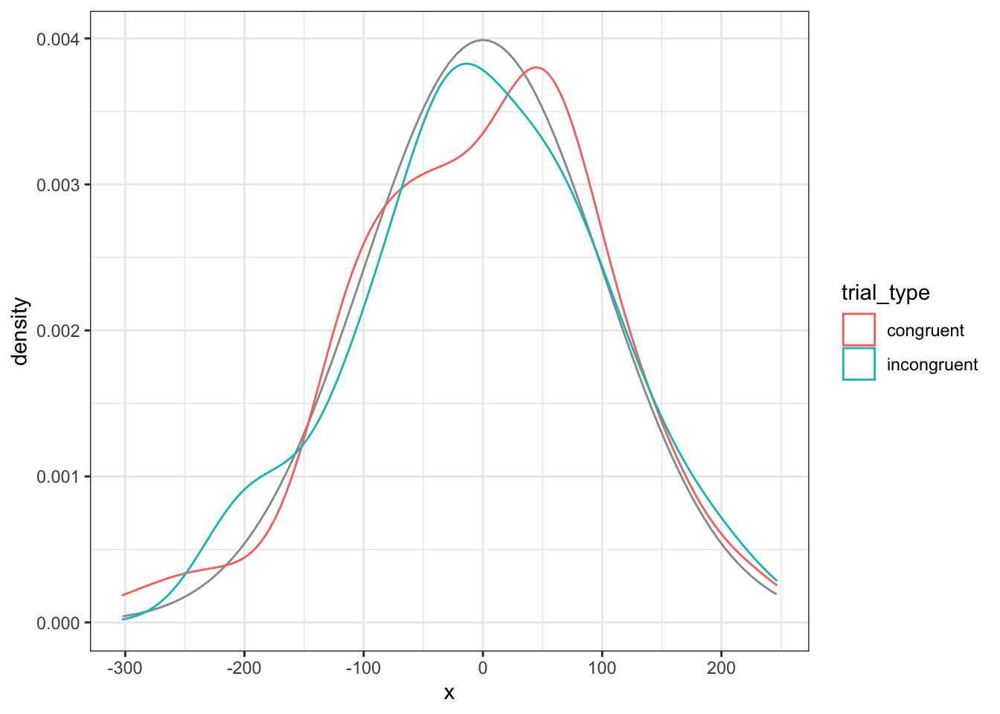
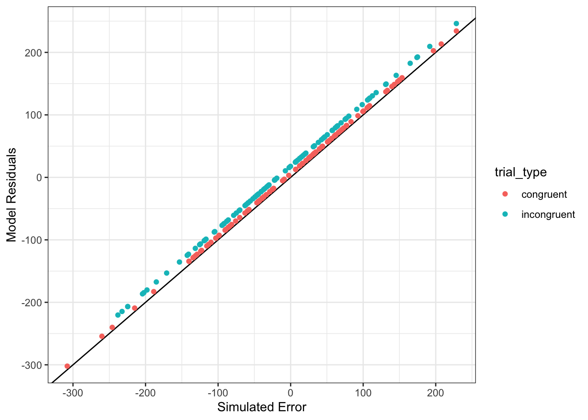

# Introduction to GLM {#glm}


<!--

     -->

## Learning Objectives {#ilo9}

### Basic

1. Define the [components](#glm-components) of the GLM
2. [Simulate data](#sim-glm) using GLM equations [(video)](https://youtu.be/JQ90LnVCbKc){class="video"}
3. Identify the model parameters that correspond to the data-generation parameters
4. Understand and plot [residuals](#residuals) [(video)](https://youtu.be/sr-NtxiH2Qk){class="video"}
5. [Predict new values](#predict) using the model [(video)](https://youtu.be/0o4LEbVVWfM){class="video"}
6. Explain the differences among [coding schemes](#coding-schemes) [(video)](https://youtu.be/SqL28AbLj3g){class="video"}

### Intermediate

7. Demonstrate the [relationships](#test-rels) among two-sample t-test, one-way ANOVA, and linear regression
8. Given data and a GLM, [generate a decomposition matrix](#decomp) and calculate sums of squares, mean squares, and F ratios for a one-way ANOVA

## Resources {#resources9}

* [Stub for this lesson](stubs/9_glm.Rmd)
* [Jeff Miller and Patricia Haden, Statistical Analysis with the Linear Model (free online textbook)](http://www.otago.ac.nz/psychology/otago039309.pdf)
* [lecture slides introducing the General Linear Model](slides/08_glm_slides.pdf)
* [GLM shiny app](http://rstudio2.psy.gla.ac.uk/Dale/GLM)
* [F distribution](http://rstudio2.psy.gla.ac.uk/Dale/fdist)

## Setup {#setup9}


```r
# libraries needed for these examples
library(tidyverse)
library(broom)
set.seed(30250) # makes sure random numbers are reproducible
```


## GLM

### What is the GLM?

The <a class='glossary' target='_blank' title='NA' href='https://psyteachr.github.io/glossary/g#general-linear-model'>General Linear Model</a> (GLM) is a general mathematical framework for expressing relationships among variables that can express or test <a class='glossary' target='_blank' title='NA' href='https://psyteachr.github.io/glossary/l#linear'>linear</a> relationships between a numerical <a class='glossary' target='_blank' title='The target variable that is being analyzed, whose value is assumed to depend on other variables.' href='https://psyteachr.github.io/glossary/d#dependent-variable'>dependent variable</a> and any combination of <a class='glossary' target='_blank' title='Data that can only take certain values, such as types of pet.' href='https://psyteachr.github.io/glossary/c#categorical'>categorical</a> or <a class='glossary' target='_blank' title='Data that can take on any values between other existing values.' href='https://psyteachr.github.io/glossary/c#continuous'>continuous</a> <a class='glossary' target='_blank' title='A variable whose value is assumed to influence the value of a dependent variable.' href='https://psyteachr.github.io/glossary/i#independent-variable'>independent variables</a>.

### Components {#glm-components}

There are some mathematical conventions that you need to learn to understand the equations representing linear models. Once you understand those, learning about the GLM will get much easier.


| Component of GLM | Notation                      |
|------------------|-------------------------------|
| Dependent Variable (DV) | $Y$                    |
| Grand Average    | $\mu$ (the Greek letter "mu") |
| Main Effects     | $A, B, C, \ldots$             |
| Interactions     | $AB, AC, BC, ABC, \ldots$     |
| Random Error     | $S(Group)$                    |


The linear equation predicts the dependent variable ($Y$) as the sum of the grand average value of $Y$ ($\mu$, also called the intercept), the main effects of all the predictor variables ($A+B+C+ \ldots$), the interactions among all the predictor variables ($AB, AC, BC, ABC, \ldots$), and some random error ($S(Group)$). The equation for a model with two predictor variables ($A$ and $B$) and their interaction ($AB$) is written like this:

$Y$ ~ $\mu+A+B+AB+S(Group)$

Don't worry if this doesn't make sense until we walk through a concrete example.

### Simulating data from GLM {#sim-glm}

A good way to learn about linear models is to <a class='glossary' target='_blank' title='Generating data from summary parameters' href='https://psyteachr.github.io/glossary/s#simulation'>simulate</a> data where you know exactly how the variables are related, and then analyse this simulated data to see where the parameters show up in the analysis.

We'll start with a very simple linear model that just has a single categorical factor with two levels. Let's say we're predicting reaction times for congruent and incongruent trials in a Stroop task for a single participant. Average reaction time (`mu`) is 800ms, and is 50ms faster for congruent than incongruent trials (`effect`). 

<div class="warning">
A **factor** is a categorical variable that is used to divide subjects into groups, usually to draw some comparison. Factors are composed of different **levels**. Do not confuse factors with levels!

In the example above, trial type is a <select class='solveme' name='q_1' data-answer='["factor"]'> <option></option> <option>factor</option> <option>level</option></select>, incongrunt is a <select class='solveme' name='q_2' data-answer='["level"]'> <option></option> <option>factor</option> <option>level</option></select>, and congruent is a <select class='solveme' name='q_3' data-answer='["level"]'> <option></option> <option>factor</option> <option>level</option></select>.
</div>

You need to represent <a class='glossary' target='_blank' title='Data that can only take certain values, such as types of pet.' href='https://psyteachr.github.io/glossary/c#categorical'>categorical</a> factors with numbers. The numbers, or <a class='glossary' target='_blank' title='How to represent categorical variables with numbers for use in models.' href='https://psyteachr.github.io/glossary/c#coding-scheme'>coding scheme</a> you choose will affect the numbers you get out of the analysis and how you need to interpret them. Here, we will <a class='glossary' target='_blank' title='A coding scheme for categorical variables that contrasts each group mean with the mean of all the group means.' href='https://psyteachr.github.io/glossary/e#effect-code'>effect code</a> the trial types so that congruent trials are coded as +0.5, and incongruent trials are coded as -0.5.

A person won't always respond exactly the same way. They might be a little faster on some trials than others, due to random fluctuations in attention, learning about the task, or fatigue. So we can add an <a class='glossary' target='_blank' title='NA' href='https://psyteachr.github.io/glossary/e#error-term'>error term</a> to each trial. We can't know how much any specific trial will differ, but we can characterise the distribution of how much trials differ from average and then sample from this distribution. 

Here, we'll assume the error term is sampled from a <a class='glossary' target='_blank' title='A symmetric distribution of data where values near the centre are most probable.' href='https://psyteachr.github.io/glossary/n#normal-distribution'>normal distribution</a> with a <a class='glossary' target='_blank' title='A statistic that measures how spread out data are relative to the mean.' href='https://psyteachr.github.io/glossary/s#standard-deviation'>standard deviation</a> of 100 ms (the mean of the error term distribution is always 0). We'll also sample 100 trials of each type, so we can see a range of variation.

So first create variables for all of the parameters that describe your data.


```r
n_per_grp <- 100
mu <- 800 # average RT
effect <- 50 # average difference between congruent and incongruent trials
error_sd <- 100 # standard deviation of the error term
trial_types <- c("congruent" = 0.5, "incongruent" = -0.5) # effect code
```

Then simulate the data by creating a data table with a row for each trial and columns for the trial type and the error term (random numbers samples from a normal distribution with the SD specified by `error_sd`). For categorical variables, include both a column with the text labels (`trial_type`) and another column with the coded version (`trial_type.e`) to make it easier to check what the codings mean and to use for graphing. Calculate the dependent variable (`RT`) as the sum of the grand mean (`mu`), the coefficient (`effect`) multiplied by the effect-coded predictor variable (`trial_type.e`), and the error term.


```r
dat <- data.frame(
  trial_type = rep(names(trial_types), each = n_per_grp)
) %>%
  mutate(
    trial_type.e = recode(trial_type, !!!trial_types),
    error = rnorm(nrow(.), 0, error_sd),
    RT = mu + effect*trial_type.e + error
  )
```

<div class="info">
<p>The <code>!!!</code> (triple bang) in the code <code>recode(trial_type, !!!trial_types)</code> is a way to expand the vector <code>trial_types &lt;- c("congruent" = 0.5, "incongruent" = -0.5)</code>. It’s equivalent to <code>recode(trial_type, "congruent" = 0.5, "incongruent" = -0.5)</code>. This pattern avoids making mistakes with recoding because there is only one place where you set up the category to code mapping (in the <code>trial_types</code> vector).</p>
</div>

Last but not least, always plot simulated data to make sure it looks like you expect.


```r
ggplot(dat, aes(trial_type, RT)) + 
  geom_violin() +
  geom_boxplot(aes(fill = trial_type), 
               width = 0.25, show.legend = FALSE)
```

<div class="figure" style="text-align: center">

<p class="caption">(\#fig:plot-sim)Simulated Data</p>
</div>

### Linear Regression

Now we can analyse the data we simulated using the function `lm()`. It takes the formula as the first argument. This is the same as the data-generating equation, but you can omit the error term (this is implied), and takes the data table as the second argument. Use the `summary()` function to see the statistical summary.


```r
my_lm <- lm(RT ~ trial_type.e, data = dat)
summary(my_lm)
```

```
## 
## Call:
## lm(formula = RT ~ trial_type.e, data = dat)
## 
## Residuals:
##      Min       1Q   Median       3Q      Max 
## -302.110  -70.052    0.948   68.262  246.220 
## 
## Coefficients:
##              Estimate Std. Error t value Pr(>|t|)    
## (Intercept)   788.192      7.206 109.376  < 2e-16 ***
## trial_type.e   61.938     14.413   4.297 2.71e-05 ***
## ---
## Signif. codes:  0 '***' 0.001 '**' 0.01 '*' 0.05 '.' 0.1 ' ' 1
## 
## Residual standard error: 101.9 on 198 degrees of freedom
## Multiple R-squared:  0.08532,	Adjusted R-squared:  0.0807 
## F-statistic: 18.47 on 1 and 198 DF,  p-value: 2.707e-05
```

Notice how the **estimate** for the `(Intercept)` is close to the value we set for `mu` and the estimate for `trial_type.e` is close to the value we set for `effect`.

<div class="try">
<p>Change the values of <code>mu</code> and <code>effect</code>, resimulate the data, and re-run the linear model. What happens to the estimates?</p>
</div>

### Residuals {#residuals}

You can use the `residuals()` function to extract the error term for each each data point. This is the DV values, minus the estimates for the intercept and trial type. We'll make a density plot of the <a class='glossary' target='_blank' title='NA' href='https://psyteachr.github.io/glossary/r#residuals'>residuals</a> below and compare it to the normal distribution we used for the error term.


```r
res <- residuals(my_lm)
ggplot(dat) + 
  stat_function(aes(0), color = "grey60",
                fun = dnorm, n = 101,
                args = list(mean = 0, sd = error_sd)) +
  geom_density(aes(res, color = trial_type))
```

<div class="figure" style="text-align: center">

<p class="caption">(\#fig:res-density-plot)Model residuals should be approximately normally distributed for each group</p>
</div>


You can also compare the model residuals to the simulated error values. If the model is accurate, they should be almost identical. If the intercept estimate is slightly off, the points will be slightly above or below the black line. If the estimate for the effect of trial type is slightly off, there will be a small, systematic difference between residuals for congruent and incongruent trials.


```r
ggplot(dat) +
  geom_abline(slope = 1) +
  geom_point(aes(error, res,color = trial_type)) +
  ylab("Model Residuals") +
  xlab("Simulated Error")
```

<div class="figure" style="text-align: center">

<p class="caption">(\#fig:res-err-plot)Model residuals should be very similar to the simulated error</p>
</div>

<div class="try">
<p>What happens to the residuals if you fit a model that ignores trial type (e.g., <code>lm(Y ~ 1, data = dat)</code>)?</p>
</div>

### Predict New Values {#predict}

You can use the estimates from your model to predict new data points, given values for the model parameters. For this simple example, we just need to know the trial type to make a prediction.

For congruent trials, you would predict that a new data point would be equal to the intercept estimate plus the trial type estimate multiplied by 0.5 (the effect code for congruent trials).


```r
int_est <- my_lm$coefficients[["(Intercept)"]]
tt_est  <- my_lm$coefficients[["trial_type.e"]]
tt_code <- trial_types[["congruent"]]
new_congruent_RT <- int_est + tt_est * tt_code
new_congruent_RT
```

```
## [1] 819.1605
```

You can also use the `predict()` function to do this more easily. The second argument is a data table with columns for the factors in the model and rows with the values that you want to use for the prediction.


```r
predict(my_lm, newdata = tibble(trial_type.e = 0.5))
```

```
##        1 
## 819.1605
```


<div class="info">
<p>If you look up this function using <code>?predict</code>, you will see that “The function invokes particular methods which depend on the class of the first argument.” What this means is that <code>predict()</code> works differently depending on whether you’re predicting from the output of <code>lm()</code> or other analysis functions. You can search for help on the lm version with <code>?predict.lm</code>.</p>
</div>


### Coding Categorical Variables {#coding-schemes}

In the example above, we used **effect coding** for trial type. You can also use **sum coding**, which assigns +1 and  -1 to the levels instead of +0.5 and -0.5.  More commonly, you might want to use **treatment coding**, which assigns 0 to one level (usually a baseline or control condition) and 1 to the other level (usually a treatment or experimental condition).

Here we will add sum-coded and treatment-coded versions of `trial_type` to the dataset using the `recode()` function.


```r
dat <- dat %>% mutate(
  trial_type.sum = recode(trial_type, "congruent" = +1, "incongruent" = -1),
  trial_type.tr = recode(trial_type, "congruent" = 1, "incongruent" = 0)
)
```

If you define named vectors with your levels and coding, you can use them with the `recode()` function if you expand them using `!!!`.


```r
tt_sum <- c("congruent"   = +1, 
            "incongruent" = -1)
tt_tr <- c("congruent"   = 1, 
           "incongruent" = 0)
dat <- dat %>% mutate(
  trial_type.sum = recode(trial_type, !!!tt_sum),
  trial_type.tr = recode(trial_type, !!!tt_tr)
)
```

Here are the coefficients for the effect-coded version. They should be the same as those from the last analysis.


```r
lm(RT ~ trial_type.e, data = dat)$coefficients
```

```
##  (Intercept) trial_type.e 
##    788.19166     61.93773
```

Here are the coefficients for the sum-coded version. This give the same results as effect coding, except the estimate for the categorical factor will be exactly half as large, as it represents the difference between each trial type and the hypothetical condition of 0 (the overall mean RT), rather than the difference between the two trial types.


```r
lm(RT ~ trial_type.sum, data = dat)$coefficients
```

```
##    (Intercept) trial_type.sum 
##      788.19166       30.96887
```

Here are the coefficients for the treatment-coded version. The estimate for the categorical factor will be the same as in the effect-coded version, but the intercept will decrease. It will be equal to the intercept minus the estimate for trial type from the sum-coded version.


```r
lm(RT ~ trial_type.tr, data = dat)$coefficients
```

```
##   (Intercept) trial_type.tr 
##     757.22279      61.93773
```


## Relationships among tests {#test-rels}

### T-test

The t-test is just a special, limited example of a general linear model.


```r
t.test(RT ~ trial_type.e, data = dat, var.equal = TRUE)
```

```
## 
## 	Two Sample t-test
## 
## data:  RT by trial_type.e
## t = -4.2975, df = 198, p-value = 2.707e-05
## alternative hypothesis: true difference in means is not equal to 0
## 95 percent confidence interval:
##  -90.35945 -33.51601
## sample estimates:
## mean in group -0.5  mean in group 0.5 
##           757.2228           819.1605
```

<div class="try">
<p>What happens when you use other codings for trial type in the t-test above? Which coding maps onto the results of the t-test best?</p>
</div>

### ANOVA

ANOVA is also a special, limited version of the linear model.


```r
my_aov <- aov(RT ~ trial_type.e, data = dat)
summary(my_aov, intercept = TRUE)
```

```
##               Df    Sum Sq   Mean Sq  F value   Pr(>F)    
## (Intercept)    1 124249219 124249219 11963.12  < 2e-16 ***
## trial_type.e   1    191814    191814    18.47 2.71e-05 ***
## Residuals    198   2056432     10386                      
## ---
## Signif. codes:  0 '***' 0.001 '**' 0.01 '*' 0.05 '.' 0.1 ' ' 1
```

The easiest way to get parameters out of an analysis is to use the `broom::tidy()` function. This returns a tidy table that you can extract numbers of interest from. Here, we just want to get the F-value for the effect of trial_type. Compare the square root of this value to the t-value from the t-tests above.


```r
f <- broom::tidy(my_aov)$statistic[1]
sqrt(f)
```

```
## [1] 4.297498
```

## Understanding ANOVA

We'll walk through an example of a one-way ANOVA with the following equation:

$Y_{ij} = \mu + A_i + S(A)_{ij}$

This means that each data point ($Y_{ij}$) is predicted to be the sum of the grand mean ($\mu$), plus the effect of factor A ($A_i$), plus some residual error ($S(A)_{ij}$).

### Means, Variability, and Deviation Scores

Let's create a simple simulation function so you can quickly create a two-sample dataset with specified Ns, means, and SDs.


```r
two_sample <- function(n = 10, m1 = 0, m2 = 0, sd1 = 1, sd2 = 1) {
  s1 <- rnorm(n, m1, sd1)
  s2 <- rnorm(n, m2, sd2)
  
  data.frame(
    Y = c(s1, s2),
    grp = rep(c("A", "B"), each = n)
  )
}
```

Now we will use `two_sample()` to create a dataset `dat` with N=5 per group, means of -2 and +2, and SDs of 1 and 1 (yes, this is an effect size of d = 4).


```r
dat <- two_sample(5, -2, +2, 1, 1)
```

You can calculate how each data point (`Y`) deviates from the overall sample mean ($\hat{\mu}$), which is represented by the horizontal grey line below and the deviations are the vertical grey lines. You can also calculate how different each point is from its group-specific mean ($\hat{A_i}$), which are represented by the horizontal coloured lines below and the deviations are the coloured vertical lines.

<div class="figure" style="text-align: center">

<p class="caption">(\#fig:deviation)Deviations of each data point (Y) from the overall and group means</p>
</div>

You can use these deviations to calculate variability between groups and within groups. ANOVA tests whether the variability between groups is larger than that within groups, accounting for the number of groups and observations.

### Decomposition matrices {#decomp}

We can use the estimation equations for a one-factor ANOVA to calculate the model components.

* `mu` is the overall mean 
* `a` is how different each group mean is from the overall mean
* `err` is residual error, calculated by subtracting `mu` and `a` from `Y`

This produces a *decomposition matrix*, a table with columns for `Y`, `mu`, `a`, and `err`.


```r
decomp <- dat %>% 
  select(Y, grp) %>%
  mutate(mu = mean(Y)) %>%     # calculate mu_hat
  group_by(grp) %>%
  mutate(a = mean(Y) - mu) %>% # calculate a_hat for each grp
  ungroup() %>%
  mutate(err = Y - mu - a)     # calculate residual error
```


|          Y|grp |        mu|         a|        err|
|----------:|:---|---------:|---------:|----------:|
| -1.4770938|A   | 0.1207513| -1.533501| -0.0643443|
| -2.9508741|A   | 0.1207513| -1.533501| -1.5381246|
| -0.6376736|A   | 0.1207513| -1.533501|  0.7750759|
| -1.7579084|A   | 0.1207513| -1.533501| -0.3451589|
| -0.2401977|A   | 0.1207513| -1.533501|  1.1725518|
|  0.1968155|B   | 0.1207513|  1.533501| -1.4574367|
|  2.6308008|B   | 0.1207513|  1.533501|  0.9765486|
|  2.0293297|B   | 0.1207513|  1.533501|  0.3750775|
|  2.1629037|B   | 0.1207513|  1.533501|  0.5086516|
|  1.2514112|B   | 0.1207513|  1.533501| -0.4028410|


Calculate sums of squares for `mu`, `a`, and `err`.


```r
SS <- decomp %>%
  summarise(mu = sum(mu*mu),
            a = sum(a*a),
            err = sum(err*err))
```


|        mu|        a|      err|
|---------:|--------:|--------:|
| 0.1458088| 23.51625| 8.104182|


If you've done everything right, `SS$mu + SS$a + SS$err` should equal the sum of squares for Y.


```r
SS_Y <- sum(decomp$Y^2)
all.equal(SS_Y, SS$mu + SS$a + SS$err)
```

```
## [1] TRUE
```

Divide each sum of squares by its corresponding degrees of freedom (df) to calculate mean squares. The df for `mu` is 1, the df for factor `a` is `K-1` (K is the number of groups), and the df for `err` is `N - K` (N is the number of observations).


```r
K <- n_distinct(dat$grp)
N <- nrow(dat)
df <- c(mu = 1, a = K - 1, err = N - K)
MS <- SS / df
```


|        mu|        a|      err|
|---------:|--------:|--------:|
| 0.1458088| 23.51625| 1.013023|


Then calculate an F-ratio for `mu` and `a` by dividing their mean squares by the error term mean square. Get the p-values that correspond to these F-values using the `pf()` function.


```r
F_mu <- MS$mu / MS$err
F_a  <- MS$a  / MS$err
p_mu <- pf(F_mu, df1 = df['mu'], df2 = df['err'], lower.tail = FALSE)
p_a  <- pf(F_a,  df1 = df['a'],  df2 = df['err'], lower.tail = FALSE)
```

Put everything into a data frame to display it in the same way as the ANOVA summary function.


```r
my_calcs <- data.frame(
  term = c("Intercept", "grp", "Residuals"),
  Df = df,
  SS = c(SS$mu, SS$a, SS$err),
  MS = c(MS$mu, MS$a, MS$err),
  F = c(F_mu, F_a, NA),
  p = c(p_mu, p_a, NA)
)
```


|    |term      | Df|     SS|     MS|      F|     p|
|:---|:---------|--:|------:|------:|------:|-----:|
|mu  |Intercept |  1|  0.146|  0.146|  0.144| 0.714|
|a   |grp       |  1| 23.516| 23.516| 23.214| 0.001|
|err |Residuals |  8|  8.104|  1.013|     NA|    NA|


Now run a one-way ANOVA on your results and compare it to what you obtained in your calculations.


```r
aov(Y ~ grp, data = dat) %>% summary(intercept = TRUE)
```

```
##             Df Sum Sq Mean Sq F value  Pr(>F)   
## (Intercept)  1  0.146   0.146   0.144 0.71427   
## grp          1 23.516  23.516  23.214 0.00132 **
## Residuals    8  8.104   1.013                   
## ---
## Signif. codes:  0 '***' 0.001 '**' 0.01 '*' 0.05 '.' 0.1 ' ' 1
```


<div class="try">
<p>Using the code above, write your own function that takes a table of data and returns the ANOVA results table like above.</p>
</div>


## Glossary {#glossary9}


|term                                                                                                                            |definition                                                                                                     |
|:-------------------------------------------------------------------------------------------------------------------------------|:--------------------------------------------------------------------------------------------------------------|
|<a class='glossary' target='_blank' href='https://psyteachr.github.io/glossary/c#categorical'>categorical</a>                   |Data that can only take certain values, such as types of pet.                                                  |
|<a class='glossary' target='_blank' href='https://psyteachr.github.io/glossary/c#coding.scheme'>coding scheme</a>               |How to represent categorical variables with numbers for use in models.                                         |
|<a class='glossary' target='_blank' href='https://psyteachr.github.io/glossary/c#continuous'>continuous</a>                     |Data that can take on any values between other existing values.                                                |
|<a class='glossary' target='_blank' href='https://psyteachr.github.io/glossary/d#dependent.variable'>dependent variable</a>     |The target variable that is being analyzed, whose value is assumed to depend on other variables.               |
|<a class='glossary' target='_blank' href='https://psyteachr.github.io/glossary/e#effect.code'>effect code</a>                   |A coding scheme for categorical variables that contrasts each group mean with the mean of all the group means. |
|<a class='glossary' target='_blank' href='https://psyteachr.github.io/glossary/e#error.term'>error term</a>                     |NA                                                                                                             |
|<a class='glossary' target='_blank' href='https://psyteachr.github.io/glossary/g#general.linear.model'>general linear model</a> |NA                                                                                                             |
|<a class='glossary' target='_blank' href='https://psyteachr.github.io/glossary/i#independent.variable'>independent variable</a> |A variable whose value is assumed to influence the value of a dependent variable.                              |
|<a class='glossary' target='_blank' href='https://psyteachr.github.io/glossary/l#linear'>linear</a>                             |NA                                                                                                             |
|<a class='glossary' target='_blank' href='https://psyteachr.github.io/glossary/n#normal.distribution'>normal distribution</a>   |A symmetric distribution of data where values near the centre are most probable.                               |
|<a class='glossary' target='_blank' href='https://psyteachr.github.io/glossary/r#residuals'>residuals</a>                       |NA                                                                                                             |
|<a class='glossary' target='_blank' href='https://psyteachr.github.io/glossary/s#simulation'>simulation</a>                     |Generating data from summary parameters                                                                        |
|<a class='glossary' target='_blank' href='https://psyteachr.github.io/glossary/s#standard.deviation'>standard deviation</a>     |A statistic that measures how spread out data are relative to the mean.                                        |


## Exercises {#exercises9}

Download the [exercises](exercises/09_glm_exercise.Rmd). See the [answers](exercises/09_glm_answers.Rmd) only after you've attempted all the questions.


```r
# run this to access the exercise
dataskills::exercise(9)

# run this to access the answers
dataskills::exercise(9, answers = TRUE)
```
