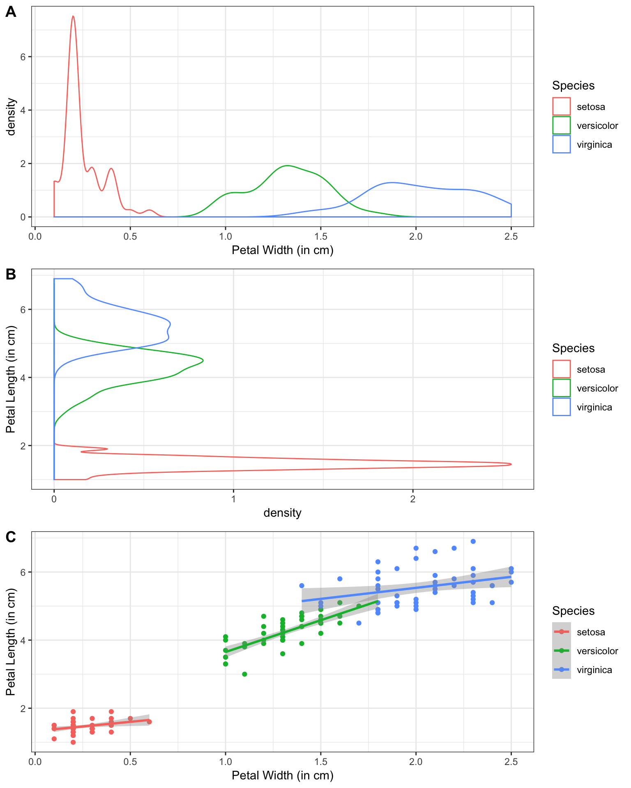

# Quiz {#quiz}

Take this short quiz to determine if you need to read this chapter.

1. Generate a plot like this from the built-in dataset `iris`. Make sure to include the custom axis labels.

    
    
    
    <div class='solution'><button>Solution</button>
    
    ```r
    ggplot(iris, aes(Species, Petal.Width, fill = Species)) +
      geom_boxplot(show.legend = FALSE) +
      xlab("Flower Species") +
      ylab("Petal Width (in cm)")
    
    # there are many ways to do things, the code below is also correct
    ggplot(iris) +
      geom_boxplot(aes(Species, Petal.Width, fill = Species), show.legend = FALSE) +
      labs(x = "Flower Species",
           y = "Petal Width (in cm)")
    ```
    
    
    </div>


2. You have just created a plot using the following code. How do you save it?
    
    ```r
    ggplot(cars, aes(speed, dist)) + 
      geom_point() +
      geom_smooth(method = lm)
    ```
    
    <select class='solveme' data-answer='["ggsave(\"figname.png\")"]'> <option></option> <option>ggsave()</option> <option>ggsave("figname")</option> <option>ggsave("figname.png")</option> <option>ggsave("figname.png", plot = cars)</option></select>

  
3. Debug the following code.
    
    ```r
    ggplot(iris) +
      geom_point(aes(Petal.Width, Petal.Length, colour = Species)) +
      geom_smooth(method = lm) +
      facet_grid(Species)
    ```
    
    
    <div class='solution'><button>Solution</button>
    
    ```r
    ggplot(iris, aes(Petal.Width, Petal.Length, colour = Species)) +
      geom_point() +
      geom_smooth(method = lm) +
      facet_grid(~Species)
    ```
    
    
    </div>


4. Generate a plot like this from the built-in dataset `ChickWeight`.  

    
    
    
    <div class='solution'><button>Solution</button>
    
    ```r
    ggplot(ChickWeight, aes(weight, Time)) +
      geom_hex(binwidth = c(10, 1)) +
      scale_fill_viridis_c()
    ```
    
    
    </div>

    
5. Generate a plot like this from the built-in dataset `iris`.

    
    
    
    <div class='solution'><button>Solution</button>
    
    ```r
    pw <- ggplot(iris, aes(Petal.Width, color = Species)) +
      geom_density() +
      xlab("Petal Width (in cm)")
    
    pl <- ggplot(iris, aes(Petal.Length, color = Species)) +
      geom_density() +
      xlab("Petal Length (in cm)") +
      coord_flip()
    
    pw_pl <- ggplot(iris, aes(Petal.Width, Petal.Length, color = Species)) +
      geom_point() +
      geom_smooth(method = lm) +
      xlab("Petal Width (in cm)") +
      ylab("Petal Length (in cm)")
    
    cowplot::plot_grid(
      pw, pl, pw_pl, 
      labels = c("A", "B", "C"),
      nrow = 3
    )
    ```
    
    
    </div>
