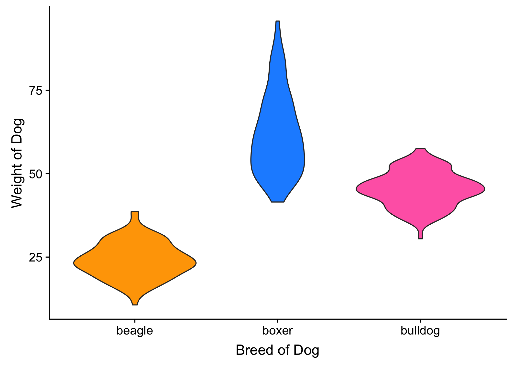

```{r setup, include=FALSE}
# please do not alter this code chunk
knitr::opts_chunk$set(echo = TRUE)
library(tidyverse)
library(viridis)
library(cowplot)
set.seed(0) # makes sure random numbers are reproducible
```


## Common Plots

Generate a violin plot, boxplot, histogram, density plot, and column plot for the following data. 

```{r dogs}
# do not edit this chunk
# dog weights estimated from http://petobesityprevention.org/ideal-weight-ranges/

dogs <- tibble(
  breed = rep(c("beagle", "boxer", "bulldog"), each = 100),
  weight = c(
    rnorm(100, 24, 6),
    rnorm(100, 62.5, 12.5),
    rnorm(100, 45, 5)
  )
)

```

### Basic

Create each plot.

#### Violin Plot
```{r exercise-violin}
dog_violin <- NULL

dog_violin # prints the plot below
```


#### Boxplot
```{r exercise-boxplot}
dog_boxplot <- NULL

dog_boxplot # prints the plot below
```


#### Histogram
```{r exercise-histogram}
dog_histogram <- NULL

dog_histogram # prints the plot below
```


#### Density plot
```{r exercise-density}
dog_density <- NULL

dog_density # prints the plot below
```


#### Column Plot
```{r exercise-colplot}
dog_column <- NULL

dog_column # prints the plot below
```

### Intermediate

Change the axis labels so the x-axis reads "Breed of Dog" or "Weight of Dog" (depending on the plot type) and the y-axis reads "Weight of Dog", "Number of Dogs", or "Density of Dogs" (depending on the plot type).

Change the default colours to "orange", "dodgerblue", and "hotpink". 

Save each plot as a PNG file with the names "dog_violin.png", "dog_boxplot.png","dog_histogram.png", "dog_density.png", and "dog_column.png" (the names are important so they show up in the code below; remeber to remove the two lines indicated).

```{r exercise-dog-intermediate, message=FALSE}

my_colors <- NULL
axis_labels <- NULL
axis_labels_hist <- NULL
axis_labels_density <- NULL

# put ggsave commands here


```

<!-- remove this line after you save the images




remove this line after you save the images -->

### Advanced

Create a grid of the first four plot styles (exclude the column plot). 

```{r exercise-dog-advanced}
dog_grid <- NULL

dog_grid # prints the plot below
```


## Two continuous variables

Represent the relationships among moral, sexual and pathogen disgust scores from the dataset [disgust_scores.csv](https://psyteachr.github.io/msc-data-skills/data/disgust_scores.csv). Load the data into the variable `disgust`.

### Basic

Graph the linear relationship between moral and pathogen disgust. Make sure the 
axes run from the minimum to maximum possible scores on both axes. Give the 
graph an appropriate title and axis lables.
  
```{r exercise-cor-basic, message = FALSE, warning = FALSE}

# load data
disgust <- NULL

disgust_scatterplot <- NULL

disgust_scatterplot # prints the plot below
```
  
### Intermediate

Create a 2d density plot of the relationship between pathogen and sexual disgust. 

Use `stat_density_2d(aes(fill = ..level..), geom = "polygon", n = n, 
h = h)`, set n and h to values that make the graph look good, and 
figure out what `n` and `h` represent.

```{r exercise-density2d, warning=FALSE}
n <- NULL
h <- c(NULL, NULL)

disgust_density <- NULL

disgust_density # prints the plot below
```


### Advanced

Create a 3x3 grid of plots with columns representing the x-axis and 
rows representing the y-axis and assign it to `disgust_grid`. 
Put a density plot of each variable along the diagonal. Make sure the graphs have 
appropriate titles and axis labels and that the range of the axes are the same 
in all graphs.

|              | moral   | sexual  | pathogen |
|--------------|---------|---------|----------|
| **moral**    | density | line    | line     | 
| **sexual**   | line    | density | line     |
| **pathogen** | line    | line    | density  |


```{r exercise-cor-advanced, message = FALSE, warning = FALSE}

# create individual plots for each panel and assign them to variables 
# (you can decide what to call them)


# use the variables above to create the grid
disgust_grid <- NULL

disgust_grid # prints the plot below
```


## Many correlated variables

*Basic*: Create a heatmap of the relationships among all the questions in [disgust_cors.csv](https://psyteachr.github.io/msc-data-skills/data/disgust_cors.csv) (the correlations have already been calculated for you). 

*Intermediate*: Figure out how to rotate the text on the x-axis so it's readable.

```{r exercise-heatmap, message=FALSE}

# load data
disgust_cors <- NULL

disgust_heatmap <- NULL

disgust_heatmap # prints the plot below
```

