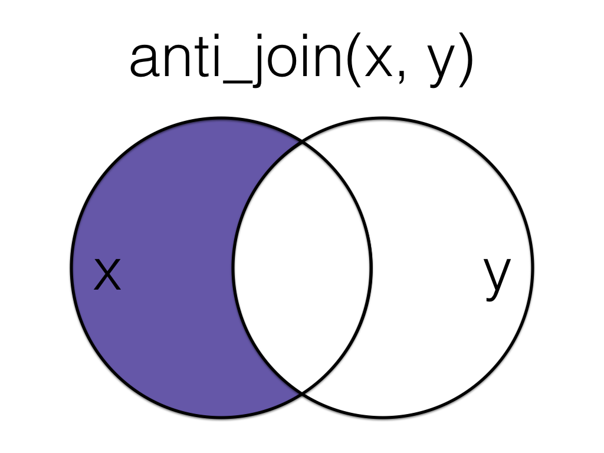

# Data Relations {#joins}


## Learning Objectives

### Beginner

1. Be able to use the 4 mutating join verbs:
    + [`left_join()`](#left_join)
    + [`right_join()`](#right_join)
    + [`inner_join()`](#inner_join)
    + [`full_join()`](#full_join)
2. Use the [`by`](#join-by) argument to set the join columns

### Intermediate

3. Use the [`suffix`](#join-suffix) argument to distinguish columns with the same name
4. Be able to use the 2 filtering join verbs:
    + [`semi_join()`](#semi_join)
    + [`anti_join()`](#anti_join)
5. Be able to use the 2 binding join verbs:
    + [`bind_rows()`](#bind_rows)
    + [`bind_cols()`](#bind_cols)
6. Be able to use the 3 set operations:
    + [`intersect()`](#intersect)
    + [`union()`](#union)
    + [`setdiff()`](#setdiff)

## Resources

* [Chapter 13: Relational Data](http://r4ds.had.co.nz/relational-data.html) in *R for Data Science*
* [Cheatsheet for dplyr join functions](http://stat545.com/bit001_dplyr-cheatsheet.html)
* [Lecture slides on dplyr two-table verbs](slides/05_joins_slides.pdf)

## Data

First, we'll create two small data tables. 

`subject` has id, sex and age for subjects 1-5. Age and sex are missing for subject 3.


```r
subject <- tibble(
  id = seq(1,5),
  sex = c("m", "m", NA, "f", "f"),
  age = c(19, 22, NA, 19, 18)
)
```


| id|sex | age|
|--:|:---|---:|
|  1|m   |  19|
|  2|m   |  22|
|  3|NA  |  NA|
|  4|f   |  19|
|  5|f   |  18|


`exp` has subject id and the score from an experiment. Some subjects are missing, some completed twice, and some are not in the subject table.


```r
exp <- tibble(
  id = c(2, 3, 4, 4, 5, 5, 6, 6, 7),
  score = c(10, 18, 21, 23, 9, 11, 11, 12, 3)
)
```


| id| score|
|--:|-----:|
|  2|    10|
|  3|    18|
|  4|    21|
|  4|    23|
|  5|     9|
|  5|    11|
|  6|    11|
|  6|    12|
|  7|     3|


## Mutating Joins

All the <a class='glossary' target='_blank' title='NA' href='https://psyteachr.github.io/glossary/m#mutating-joins'>mutating joins</a> have this basic syntax:

`****_join(x, y, by = NULL, suffix = c(".x", ".y")`

* `x` = the first (left) table
* `y` = the second (right) table
* {#join-by} `by` = what columns to match on. If you leave this blank, it will match on all columns with the same names in the two tables.
* {#join-suffix} `suffix` = if columns have the same name in the two tables, but you aren't joining by them, they get a suffix to make them unambiguous. This defaults to ".x" and ".y", but you can change it to something more meaningful.

<div class="info">
<p>You can leave out the <code>by</code> argument if you’re matching on all of the columns with the same name, but it’s good practice to always specify it so your code is robust to changes in the loaded data.</p>
</div>

### left_join() {#left_join}

<div class = 'join'><div class="figure" style="text-align: center">

<p class="caption">(\#fig:img-left-join)Left Join</p>
</div></div>

A `left_join` keeps all the data from the first (left) table and joins anything that matches from the second (right) table. If the right table has more than one match for a row in the right table, there will be more than one row in the joined table (see ids 4 and 5).


```r
left_join(subject, exp, by = "id")
```

```
## # A tibble: 7 x 4
##      id sex     age score
##   <dbl> <chr> <dbl> <dbl>
## 1     1 m        19    NA
## 2     2 m        22    10
## 3     3 <NA>     NA    18
## 4     4 f        19    21
## 5     4 f        19    23
## 6     5 f        18     9
## 7     5 f        18    11
```

<div class = 'join'><div class="figure" style="text-align: center">

<p class="caption">(\#fig:img-left-join-rev)Left Join (reversed)</p>
</div></div>

The order of tables is swapped here, so the result is all rows from the `exp` table joined to any matching rows from the `subject` table.


```r
left_join(exp, subject, by = "id")
```

```
## # A tibble: 9 x 4
##      id score sex     age
##   <dbl> <dbl> <chr> <dbl>
## 1     2    10 m        22
## 2     3    18 <NA>     NA
## 3     4    21 f        19
## 4     4    23 f        19
## 5     5     9 f        18
## 6     5    11 f        18
## 7     6    11 <NA>     NA
## 8     6    12 <NA>     NA
## 9     7     3 <NA>     NA
```

### right_join() {#right_join}

<div class = 'join'><div class="figure" style="text-align: center">

<p class="caption">(\#fig:img-right-join)Right Join</p>
</div></div>

A `right_join` keeps all the data from the second (right) table and joins anything 
that matches from the first (left) table. 


```r
right_join(subject, exp, by = "id")
```

```
## # A tibble: 9 x 4
##      id sex     age score
##   <dbl> <chr> <dbl> <dbl>
## 1     2 m        22    10
## 2     3 <NA>     NA    18
## 3     4 f        19    21
## 4     4 f        19    23
## 5     5 f        18     9
## 6     5 f        18    11
## 7     6 <NA>     NA    11
## 8     6 <NA>     NA    12
## 9     7 <NA>     NA     3
```

<div class="info">
<p>This table has the same information as <code>left_join(exp, subject, by = "id")</code>, but the columns are in a different order (left table, then right table).</p>
</div>

### inner_join() {#inner_join}

<div class = 'join'><div class="figure" style="text-align: center">

<p class="caption">(\#fig:img-inner-join)Inner Join</p>
</div></div>

An `inner_join` returns all the rows that have a match in the other table.


```r
inner_join(subject, exp, by = "id")
```

```
## # A tibble: 6 x 4
##      id sex     age score
##   <dbl> <chr> <dbl> <dbl>
## 1     2 m        22    10
## 2     3 <NA>     NA    18
## 3     4 f        19    21
## 4     4 f        19    23
## 5     5 f        18     9
## 6     5 f        18    11
```


### full_join() {#full_join}

<div class = 'join'><div class="figure" style="text-align: center">

<p class="caption">(\#fig:img-full-join)Full Join</p>
</div></div>

A `full_join` lets you join up rows in two tables while keeping all of the information from both tables. If a row doesn't have a match in the other table, the other table's column values are set to `NA`.


```r
full_join(subject, exp, by = "id")
```

```
## # A tibble: 10 x 4
##       id sex     age score
##    <dbl> <chr> <dbl> <dbl>
##  1     1 m        19    NA
##  2     2 m        22    10
##  3     3 <NA>     NA    18
##  4     4 f        19    21
##  5     4 f        19    23
##  6     5 f        18     9
##  7     5 f        18    11
##  8     6 <NA>     NA    11
##  9     6 <NA>     NA    12
## 10     7 <NA>     NA     3
```


## Filtering Joins

### semi_join() {#semi_join}

<div class = 'join'><div class="figure" style="text-align: center">

<p class="caption">(\#fig:img-semi-join)Semi Join</p>
</div></div>

A `semi_join` returns all rows from the left table where there are matching values in the right table, keeping just columns from the left table.


```r
semi_join(subject, exp, by = "id")
```

```
## # A tibble: 4 x 3
##      id sex     age
##   <int> <chr> <dbl>
## 1     2 m        22
## 2     3 <NA>     NA
## 3     4 f        19
## 4     5 f        18
```

<div class="info">
<p>Unlike an inner join, a semi join will never duplicate the rows in the left table if there is more than one maching row in the right table.</p>
</div>

<div class = 'join'><div class="figure" style="text-align: center">

<p class="caption">(\#fig:img-semi-join-rev)Semi Join (Reversed)</p>
</div></div>

Order matters in a semi join.


```r
semi_join(exp, subject, by = "id")
```

```
## # A tibble: 6 x 2
##      id score
##   <dbl> <dbl>
## 1     2    10
## 2     3    18
## 3     4    21
## 4     4    23
## 5     5     9
## 6     5    11
```

### anti_join() {#anti_join}

<div class = 'join'><div class="figure" style="text-align: center">

<p class="caption">(\#fig:img-anti-join)Anti Join</p>
</div></div>
A `anti_join` return all rows from the left table where there are *not* matching 
values in the right table, keeping just columns from the left table.


```r
anti_join(subject, exp, by = "id")
```

```
## # A tibble: 1 x 3
##      id sex     age
##   <int> <chr> <dbl>
## 1     1 m        19
```

<div class = 'join'><div class="figure" style="text-align: center">

<p class="caption">(\#fig:img-anti-join-rev)Anti Join (Reversed)</p>
</div></div>

Order matters in an anti join.


```r
anti_join(exp, subject, by = "id")
```

```
## # A tibble: 3 x 2
##      id score
##   <dbl> <dbl>
## 1     6    11
## 2     6    12
## 3     7     3
```

## Binding Joins

### bind_rows() {#bind_rows}

You can combine the rows of two tables with `bind_rows`.

Here we'll add subject data for subjects 6-9 and bind that to the original subject table.


```r
new_subjects <- tibble(
  id = seq(6, 9),
  sex = c("m", "m", "f", "f"),
  age = c(19, 16, 20, 19)
)

bind_rows(subject, new_subjects)
```

```
## # A tibble: 9 x 3
##      id sex     age
##   <int> <chr> <dbl>
## 1     1 m        19
## 2     2 m        22
## 3     3 <NA>     NA
## 4     4 f        19
## 5     5 f        18
## 6     6 m        19
## 7     7 m        16
## 8     8 f        20
## 9     9 f        19
```

The columns just have to have the same names, they don't have to be in the same order. Any columns that differ between the two tables will just have `NA` values for entries from the other table.

If a row is duplicated between the two tables (like id 5 below), the row will also be duplicated in the resulting table. If your tables have the exact same columns, you can use `union()` (see below) to avoid duplicates.


```r
new_subjects <- tibble(
  id = seq(5, 9),
  age = c(18, 19, 16, 20, 19),
  sex = c("f", "m", "m", "f", "f"),
  new = c(1,2,3,4,5)
)

bind_rows(subject, new_subjects)
```

```
## # A tibble: 10 x 4
##       id sex     age   new
##    <int> <chr> <dbl> <dbl>
##  1     1 m        19    NA
##  2     2 m        22    NA
##  3     3 <NA>     NA    NA
##  4     4 f        19    NA
##  5     5 f        18    NA
##  6     5 f        18     1
##  7     6 m        19     2
##  8     7 m        16     3
##  9     8 f        20     4
## 10     9 f        19     5
```

### bind_cols() {#bind_cols}

You can merge two tables with the same number of rows using `bind_cols`. This is only useful if the two tables have their rows in the exact same order. The only advantage over a left join is when the tables don't have any IDs to join by and you have to rely solely on their order.


```r
new_info <- tibble(
  colour = c("red", "orange", "yellow", "green", "blue")
)

bind_cols(subject, new_info)
```

```
## # A tibble: 5 x 4
##      id sex     age colour
##   <int> <chr> <dbl> <chr> 
## 1     1 m        19 red   
## 2     2 m        22 orange
## 3     3 <NA>     NA yellow
## 4     4 f        19 green 
## 5     5 f        18 blue
```

## Set Operations

### intersect() {#intersect}

`intersect()` returns all rows in two tables that match exactly. The columns 
don't have to be in the same order.


```r
new_subjects <- tibble(
  id = seq(4, 9),
  age = c(19, 18, 19, 16, 20, 19),
  sex = c("f", "f", "m", "m", "f", "f")
)

dplyr::intersect(subject, new_subjects)
```

```
## # A tibble: 2 x 3
##      id sex     age
##   <int> <chr> <dbl>
## 1     4 f        19
## 2     5 f        18
```


### union() {#union}

`union()` returns all the rows from both tables, removing duplicate rows.


```r
dplyr::union(subject, new_subjects)
```

```
## # A tibble: 9 x 3
##      id sex     age
##   <int> <chr> <dbl>
## 1     1 m        19
## 2     2 m        22
## 3     3 <NA>     NA
## 4     4 f        19
## 5     5 f        18
## 6     6 m        19
## 7     7 m        16
## 8     8 f        20
## 9     9 f        19
```

### setdiff() {#setdiff}

`setdiff` returns rows that are in the first table, but not in the second table.


```r
setdiff(subject, new_subjects)
```

```
## # A tibble: 3 x 3
##      id sex     age
##   <int> <chr> <dbl>
## 1     1 m        19
## 2     2 m        22
## 3     3 <NA>     NA
```

Order matters for `setdiff`.


```r
setdiff(new_subjects, subject)
```

```
## # A tibble: 4 x 3
##      id   age sex  
##   <int> <dbl> <chr>
## 1     6    19 m    
## 2     7    16 m    
## 3     8    20 f    
## 4     9    19 f
```

## Glossary {#glossary6}


|term                                                                                                                |definition |
|:-------------------------------------------------------------------------------------------------------------------|:----------|
|<a class='glossary' target='_blank' href='https://psyteachr.github.io/glossary/m#mutating.joins'>mutating joins</a> |NA         |


## Exercises

Download the [exercises](exercises/06_joins_exercise.Rmd). See the [answers](exercises/06_joins_answers.Rmd) only after you've attempted all the questions.


```r
# run this to access the exercise
dataskills::exercise(6)

# run this to access the answers
dataskills::exercise(6, answers = TRUE)
```
